# 数据模型

<cite>
**本文引用的文件**   
- [publish_service/model.py](file://publish_service/model.py)
- [operator_authoring/model.py](file://operator_authoring/model.py)
- [publish_service/backends/models.py](file://publish_service/backends/models.py)
- [sql/publish_schema.sql](file://sql/publish_schema.sql)
- [publish_service/store.py](file://publish_service/store.py)
- [publish_service/service.py](file://publish_service/service.py)
</cite>

## 目录
1. [引言](#引言)
2. [项目结构](#项目结构)
3. [核心数据实体](#核心数据实体)
4. [架构总览](#架构总览)
5. [详细组件分析](#详细组件分析)
6. [依赖关系分析](#依赖关系分析)
7. [性能与索引策略](#性能与索引策略)
8. [ORM 映射与查询模式](#orm-映射与查询模式)
9. [数据迁移与版本管理](#数据迁移与版本管理)
10. [故障排查指南](#故障排查指南)
11. [结论](#结论)

## 引言
本文面向 Publish Service 的数据模型，系统性说明核心数据实体、数据库表结构、约束与索引、业务规则、ORM 映射方式以及查询模式。重点覆盖 Operator、VirtualContract（虚拟算子契约）、CompilationResult（编译产物/后端变体）等概念，并给出发布流程中的数据流转与状态机。

## 项目结构
Publish Service 的数据模型由三层组成：
- API/请求模型层：用于校验和序列化外部输入输出。
- 领域模型层：描述虚拟算子契约、参数绑定、输出规范等核心语义。
- 存储层：PostgreSQL 表结构与访问封装，负责持久化、并发控制与事务。

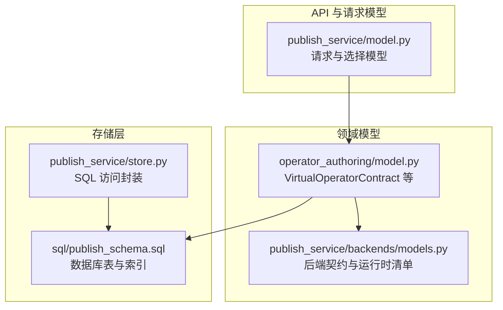

**图表来源**
- [publish_service/model.py:15-92](file://publish_service/model.py#L15-L92)
- [operator_authoring/model.py:16-212](file://operator_authoring/model.py#L16-L212)
- [publish_service/backends/models.py:10-73](file://publish_service/backends/models.py#L10-L73)
- [sql/publish_schema.sql:1-68](file://sql/publish_schema.sql#L1-L68)
- [publish_service/store.py:17-35](file://publish_service/store.py#L17-L35)

**章节来源**
- [publish_service/model.py:15-92](file://publish_service/model.py#L15-L92)
- [operator_authoring/model.py:16-212](file://operator_authoring/model.py#L16-L212)
- [publish_service/backends/models.py:10-73](file://publish_service/backends/models.py#L10-L73)
- [sql/publish_schema.sql:1-68](file://sql/publish_schema.sql#L1-L68)
- [publish_service/store.py:17-35](file://publish_service/store.py#L17-L35)

## 核心数据实体
本节从“领域模型”到“数据库表”逐层说明关键实体及其字段、关系与约束。

### Operator（逻辑算子）
- 领域含义：一个可被多次发布、具有唯一名称的算子逻辑定义，属于某个工作空间与用户。
- 主要字段：
  - id：UUID，主键。
  - workspace：文本，工作空间名。
  - name：文本，算子唯一名。
  - display_name：文本，展示名。
  - description：文本，描述。
  - created_at / updated_at：时间戳。
- 约束与索引：
  - 主键：id。
  - 唯一约束：(workspace, name)。
- 关系：
  - 一对多关联到 virtual_contract_versions。

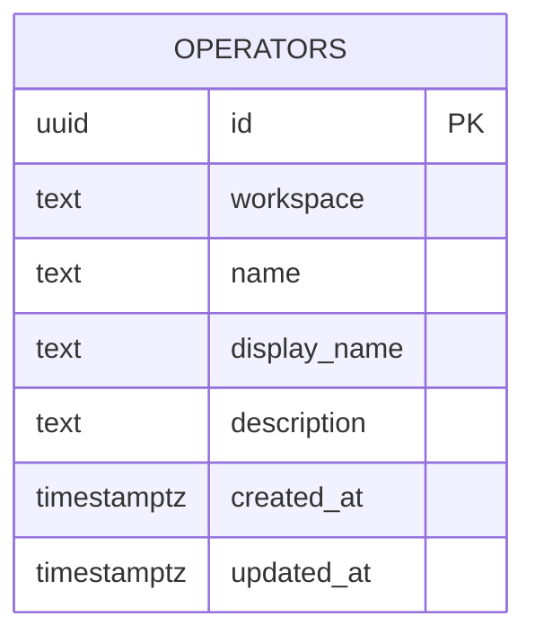

**图表来源**
- [sql/publish_schema.sql:3-12](file://sql/publish_schema.sql#L3-L12)

**章节来源**
- [sql/publish_schema.sql:3-12](file://sql/publish_schema.sql#L3-L12)

### VirtualContract（虚拟算子契约）
- 领域含义：一次不可变的算子契约快照，包含元数据、源码定位、目标可调用项、构造参数绑定、运行期参数绑定与输出规范。
- 主要字段（JSONB contract_json）：
  - api_version：固定为 dsc.virtual-operator/v1。
  - execution_model：固定为 direct。
  - metadata：OperatorMetadata，含 name、display_name、description。
  - source：SourceSpec，含 source_revision、python_path、source_ref。
  - target：TargetRef，含 callable_id。
  - constructor_arguments：字典，构造参数绑定。
  - arguments：字典，运行期参数绑定。
  - output：OutputSpec，含 payload、metadata、none_policy。
- 数据库表 virtual_contract_versions：
  - id：UUID，主键。
  - operator_id：外键指向 operators.id。
  - version：整数，大于 0。
  - source_revision：字符串，不可变源码快照标识。
  - source_ref：字符串，不可变源码引用。
  - contract_sha256：字符串，契约摘要。
  - contract_json：JSONB，契约内容。
  - created_at：时间戳。
- 约束与索引：
  - 主键：id。
  - 唯一约束：(operator_id, version)、(operator_id, contract_sha256)。
  - 索引：按 (operator_id, version DESC)、source_revision。

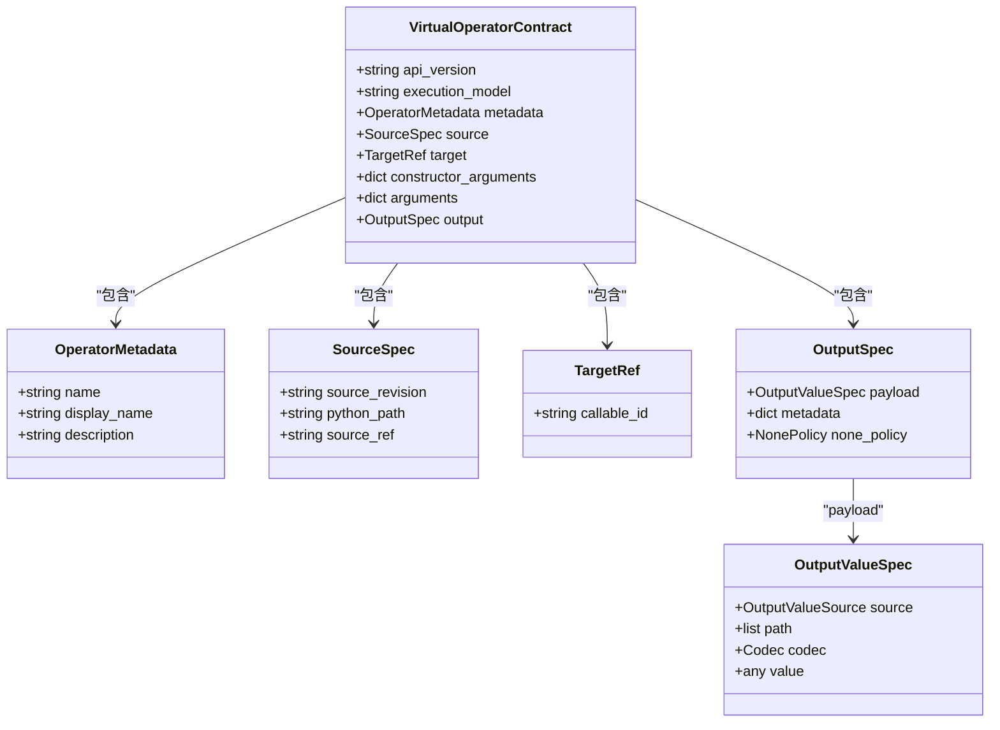

**图表来源**
- [operator_authoring/model.py:146-212](file://operator_authoring/model.py#L146-L212)

**章节来源**
- [operator_authoring/model.py:146-212](file://operator_authoring/model.py#L146-L212)
- [sql/publish_schema.sql:14-31](file://sql/publish_schema.sql#L14-L31)

### CompilationResult（编译产物/后端变体）
- 领域含义：针对某一虚拟契约的后端编译产物，记录编译器版本、变体键、后端契约、状态与发布结果。
- 数据库表 backend_variants：
  - id：UUID，主键。
  - contract_id：外键指向 virtual_contract_versions.id。
  - backend：后端类型（如 runner、nifi_native）。
  - compiler_version：编译器版本。
  - variant_key：变体键。
  - options_json：JSONB，编译选项。
  - backend_contract_sha256：后端契约摘要。
  - backend_contract_json：JSONB，后端契约。
  - status：枚举值 COMPILED/PUBLISHED/FAILED。
  - published_ref / published_metadata：发布产物引用与元数据。
  - last_error：最近错误信息。
  - created_at / updated_at：时间戳。
- 约束与索引：
  - 主键：id。
  - 唯一约束：(contract_id, backend, variant_key)。
  - 索引：按 (contract_id, backend, created_at DESC)。

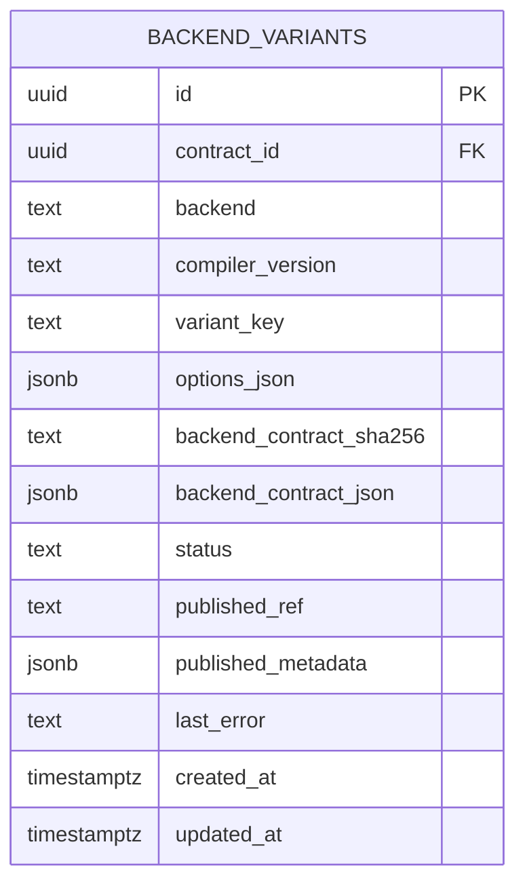

**图表来源**
- [sql/publish_schema.sql:33-52](file://sql/publish_schema.sql#L33-L52)

**章节来源**
- [sql/publish_schema.sql:33-52](file://sql/publish_schema.sql#L33-L52)

### Backend Contract（后端契约）
- Runner 后端契约：
  - backend：固定 runner。
  - runtime_profile：运行时配置。
  - runner_manifest：RunnerManifest，含入口、输入输出属性列表。
  - parameters：RunnerParameter 列表，描述运行时参数。
- NiFi Native 后端契约：
  - backend：固定 nifi_native。
  - processor_type：处理器类型。
  - class_name / package_name：Java 类与包。
  - properties：NativeProperty 列表。
  - requirements：依赖列表。
  - target_platform：目标平台（os/arch/python_version/uv_python_platform）。
  - deployment_mode：部署模式。

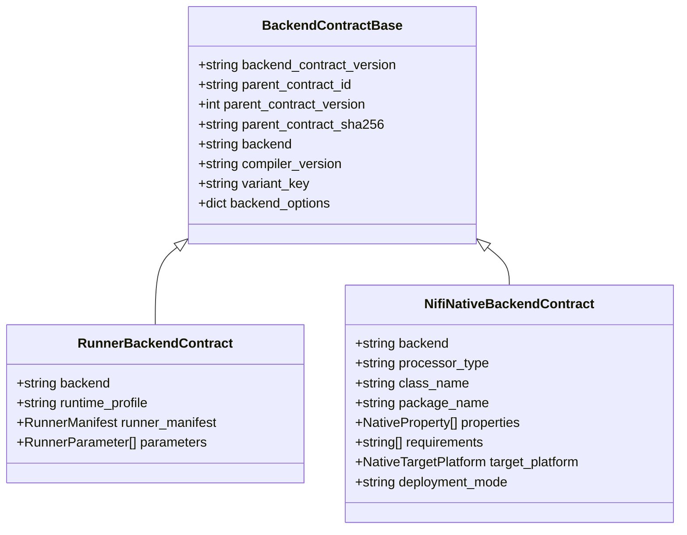

**图表来源**
- [publish_service/backends/models.py:10-73](file://publish_service/backends/models.py#L10-L73)

**章节来源**
- [publish_service/backends/models.py:10-73](file://publish_service/backends/models.py#L10-L73)

### Publish Job（发布任务）
- 数据库表 publish_jobs：
  - id：UUID，主键。
  - variant_id：外键指向 backend_variants.id。
  - status：PENDING/RUNNING/READY/FAILED。
  - artifact_ref：发布产物引用。
  - result_json：JSONB，发布结果。
  - error_message：错误消息。
  - created_at / started_at / finished_at：时间戳。
- 索引：按 (variant_id, created_at DESC)。

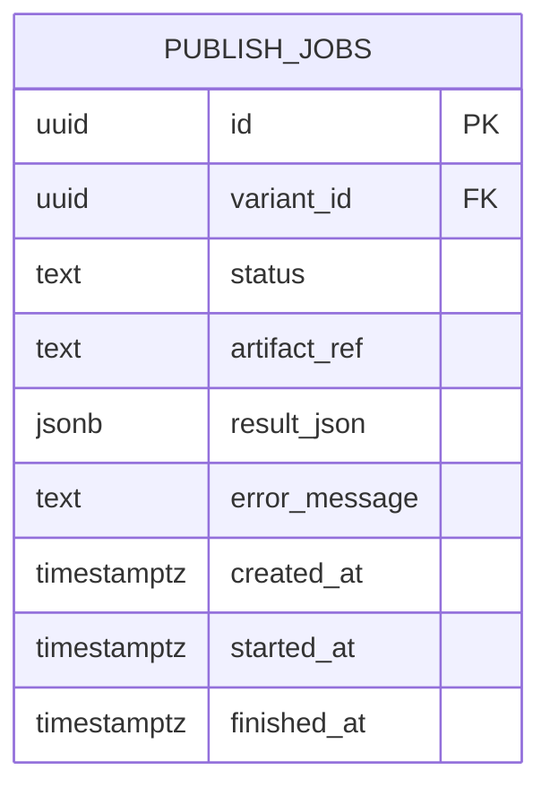

**图表来源**
- [sql/publish_schema.sql:54-68](file://sql/publish_schema.sql#L54-L68)

**章节来源**
- [sql/publish_schema.sql:54-68](file://sql/publish_schema.sql#L54-L68)

## 架构总览
Publish Service 的数据流围绕“虚拟契约 → 后端变体 → 发布任务”展开。

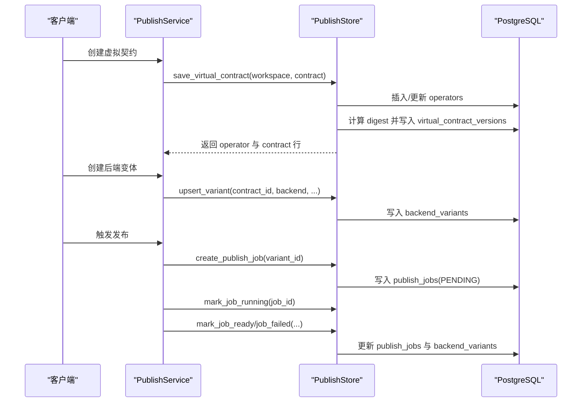

**图表来源**
- [publish_service/store.py:39-127](file://publish_service/store.py#L39-L127)
- [publish_service/store.py:246-290](file://publish_service/store.py#L246-L290)
- [publish_service/store.py:292-370](file://publish_service/store.py#L292-L370)

**章节来源**
- [publish_service/store.py:39-127](file://publish_service/store.py#L39-L127)
- [publish_service/store.py:246-290](file://publish_service/store.py#L246-L290)
- [publish_service/store.py:292-370](file://publish_service/store.py#L292-L370)

## 详细组件分析

### 虚拟契约保存与版本管理
- 业务规则：
  - 同一 workspace+name 的 Operator 唯一；重复时仅更新展示信息与更新时间。
  - 同一 Operator 下，version 自增且唯一；contract_sha256 也唯一，避免重复契约。
  - 通过 source.source_revision 与 catalog 校验一致性，确保不可变快照。
- 实现要点：
  - 使用 ON CONFLICT 更新 operators。
  - 先检查是否存在相同 digest 的契约，存在则直接返回。
  - 否则计算 next_version 并插入 virtual_contract_versions。

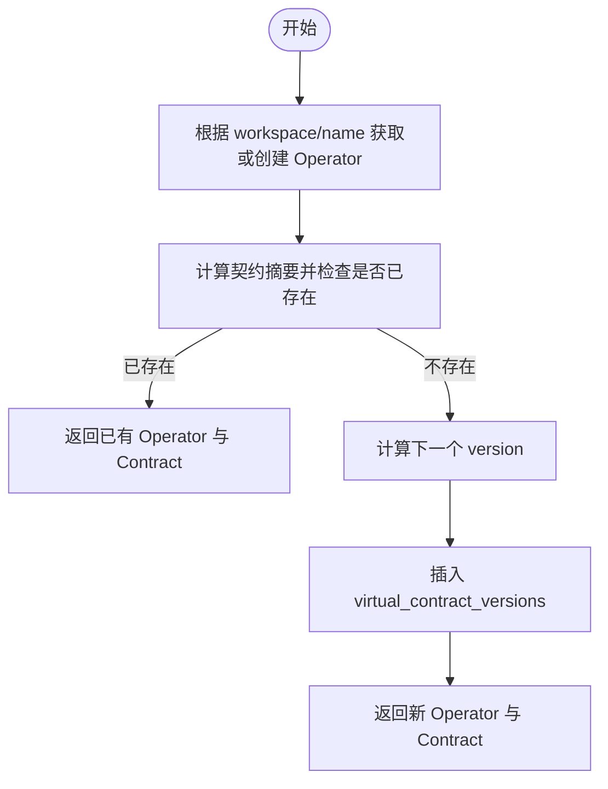

**图表来源**
- [publish_service/store.py:39-127](file://publish_service/store.py#L39-L127)

**章节来源**
- [publish_service/store.py:39-127](file://publish_service/store.py#L39-L127)

### 后端变体与编译产物
- 业务规则：
  - 同一 contract_id+backend+variant_key 唯一；重复时更新编译信息与状态。
  - 若原状态为 PUBLISHED，则保持 PUBLISHED；否则回退为 COMPILED。
- 实现要点：
  - upsert_variant 使用 ON CONFLICT DO UPDATE 保证幂等。
  - 将后端契约 JSONB 与摘要一并落库，便于后续审计与回溯。

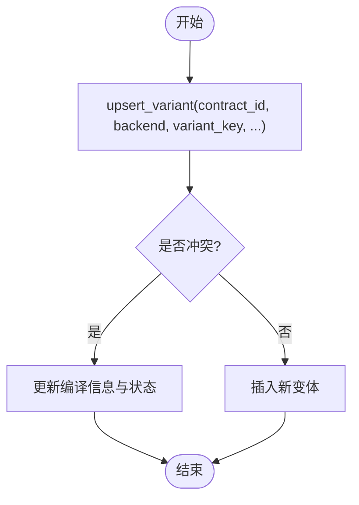

**图表来源**
- [publish_service/store.py:246-290](file://publish_service/store.py#L246-L290)

**章节来源**
- [publish_service/store.py:246-290](file://publish_service/store.py#L246-L290)

### 发布任务状态机
- 状态转换：
  - PENDING → RUNNING → READY（成功）或 FAILED（失败）。
- 实现要点：
  - create_publish_job 创建任务。
  - mark_job_running 标记开始。
  - mark_job_ready/mark_job_failed 同时更新任务与变体状态。

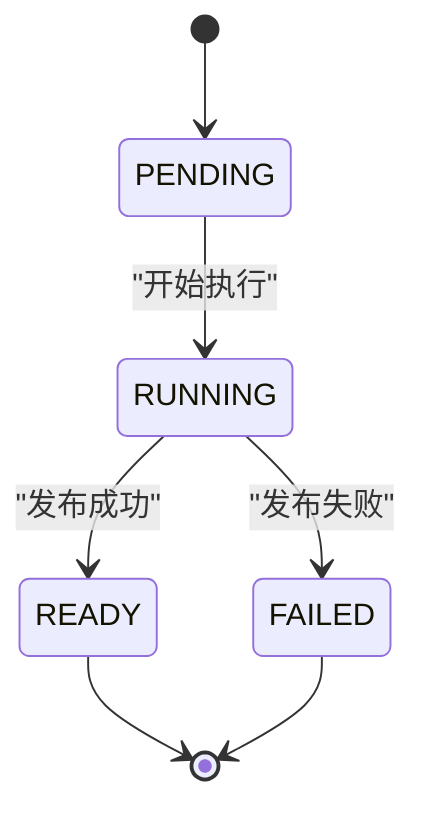

**图表来源**
- [publish_service/store.py:292-370](file://publish_service/store.py#L292-L370)

**章节来源**
- [publish_service/store.py:292-370](file://publish_service/store.py#L292-L370)

### 当前父契约加载与编译
- 业务规则：
  - 读取最新版本的虚拟契约，校验其 source_ref 不可为空。
  - 解析源码路径，扫描项目并编译虚拟契约，得到 ExecutionPlan。
- 实现要点：
  - get_latest_contract 按 version DESC 取最新。
  - service._load_current_parent 进行契约校验与编译。

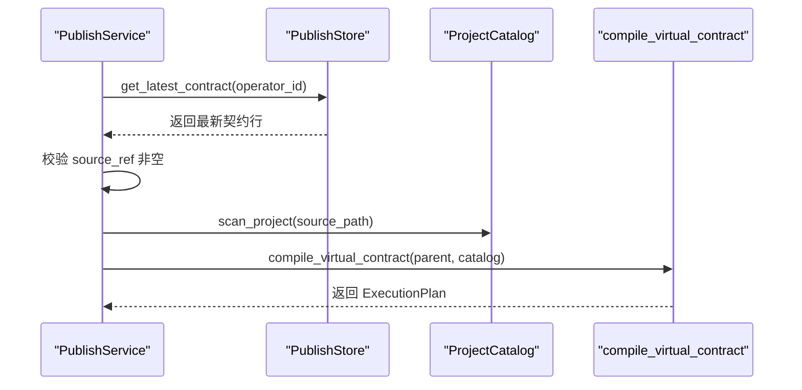

**图表来源**
- [publish_service/store.py:208-220](file://publish_service/store.py#L208-L220)
- [publish_service/service.py:546-567](file://publish_service/service.py#L546-L567)

**章节来源**
- [publish_service/store.py:208-220](file://publish_service/store.py#L208-L220)
- [publish_service/service.py:546-567](file://publish_service/service.py#L546-L567)

## 依赖关系分析
- 领域模型依赖：
  - VirtualOperatorContract 依赖 OperatorMetadata、SourceSpec、TargetRef、OutputSpec、OutputValueSpec。
  - 后端契约继承 BackendContractBase，派生出 RunnerBackendContract 与 NifiNativeBackendContract。
- 存储层依赖：
  - store.py 依赖 psycopg/psycopg_pool 连接 PostgreSQL。
  - 通过 schema 语句初始化数据库结构。
- 服务层依赖：
  - service.py 调用 store.py 完成数据读写，并结合 operator_authoring 的编译能力。

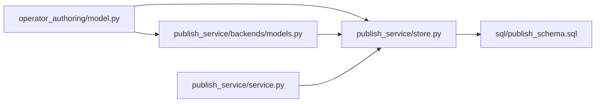

**图表来源**
- [operator_authoring/model.py:146-212](file://operator_authoring/model.py#L146-L212)
- [publish_service/backends/models.py:10-73](file://publish_service/backends/models.py#L10-L73)
- [publish_service/store.py:17-35](file://publish_service/store.py#L17-L35)
- [sql/publish_schema.sql:1-68](file://sql/publish_schema.sql#L1-L68)
- [publish_service/service.py:546-567](file://publish_service/service.py#L546-L567)

**章节来源**
- [operator_authoring/model.py:146-212](file://operator_authoring/model.py#L146-L212)
- [publish_service/backends/models.py:10-73](file://publish_service/backends/models.py#L10-L73)
- [publish_service/store.py:17-35](file://publish_service/store.py#L17-L35)
- [sql/publish_schema.sql:1-68](file://sql/publish_schema.sql#L1-L68)
- [publish_service/service.py:546-567](file://publish_service/service.py#L546-L567)

## 性能与索引策略
- 主键索引：所有表均定义 UUID 主键，快速定位单行。
- 唯一约束：
  - operators：(workspace, name) 防止同名冲突。
  - virtual_contract_versions：(operator_id, version)、(operator_id, contract_sha256) 保证版本与内容唯一。
  - backend_variants：(contract_id, backend, variant_key) 保证变体唯一。
- 复合索引：
  - virtual_contract_versions：(operator_id, version DESC) 加速按算子查最新版本。
  - virtual_contract_versions：source_revision 加速按源码快照检索。
  - backend_variants：(contract_id, backend, created_at DESC) 加速按契约与后端查最新变体。
  - publish_jobs：(variant_id, created_at DESC) 加速按变体查任务历史。
- 建议：
  - 对高频查询列（如 user_id、status）考虑添加索引以优化过滤。
  - 对大 JSONB 字段（options_json、backend_contract_json）谨慎查询，必要时提取常用字段为独立列。

**章节来源**
- [sql/publish_schema.sql:3-68](file://sql/publish_schema.sql#L3-L68)

## ORM 映射与查询模式
本项目未使用传统 ORM，而是采用 psycopg 直连 PostgreSQL，并通过 Pydantic 模型进行数据校验与序列化。

- 数据访问封装：
  - PublishStore 提供 save_virtual_contract、get_operator、get_latest_contract、get_contract、list_variants、upsert_variant、create_publish_job、mark_job_running/ready/failed 等方法。
- 典型查询模式：
  - 按 Operator 获取最新契约：ORDER BY version DESC LIMIT 1。
  - 列出某契约的所有变体：WHERE contract_id = ? ORDER BY backend, created_at DESC。
  - 列出 Runner/NiFi Native 算子清单：JOIN operators/virtual_contract_versions/backend_variants，并按后端与状态过滤。
- Pydantic 映射：
  - VirtualOperatorContract 作为 JSONB 存储于 contract_json。
  - BackendContractBase 及其子类作为 JSONB 存储于 backend_contract_json。
  - 请求模型（如 CreateVirtualContractRequest）在 API 层校验后转换为领域模型。

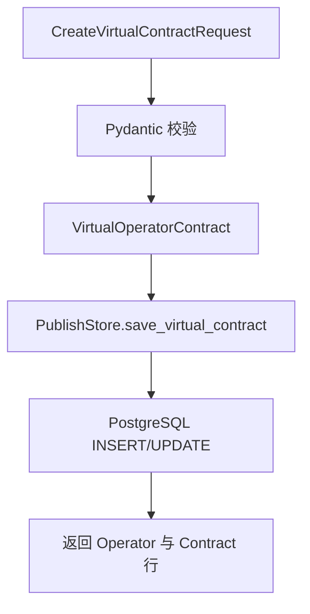

**图表来源**
- [publish_service/model.py:72-83](file://publish_service/model.py#L72-L83)
- [operator_authoring/model.py:203-212](file://operator_authoring/model.py#L203-L212)
- [publish_service/store.py:39-127](file://publish_service/store.py#L39-L127)

**章节来源**
- [publish_service/model.py:72-83](file://publish_service/model.py#L72-L83)
- [operator_authoring/model.py:203-212](file://operator_authoring/model.py#L203-L212)
- [publish_service/store.py:39-127](file://publish_service/store.py#L39-L127)

## 数据迁移与版本管理
- 迁移脚本：
  - sql/publish_schema.sql 定义 publish 模式与全部表结构，包括索引与约束。
- 启动初始化：
  - PublishStore.__init__ 中通过 _init_schema 执行 PUBLISH_SCHEMA_STATEMENTS，确保表结构就绪。
- 版本管理策略：
  - 应用级版本：VirtualOperatorContract.api_version 固定为 dsc.virtual-operator/v1。
  - 后端契约版本：BackendContractBase.backend_contract_version 固定为 dsc.backend-contract/v1。
  - 编译器版本：backend_variants.compiler_version 区分不同编译器实现（如 runner-contract-v4、nifi-native-contract-v2）。
  - 源码快照：source.source_revision 与 source.source_ref 保证不可变性与可追溯性。
- 建议：
  - 引入数据库迁移工具（如 Alembic）管理 schema 演进，避免直接修改生产 SQL。
  - 对新增字段采用向后兼容策略，保留旧字段并在过渡期兼容。

**章节来源**
- [sql/publish_schema.sql:1-68](file://sql/publish_schema.sql#L1-L68)
- [publish_service/store.py:17-35](file://publish_service/store.py#L17-L35)
- [operator_authoring/model.py:203-212](file://operator_authoring/model.py#L203-L212)
- [publish_service/backends/models.py:10-18](file://publish_service/backends/models.py#L10-L18)

## 故障排查指南
- 常见问题与定位：
  - 契约重复：检查 contract_sha256 是否一致，确认 source.source_revision 与 catalog 匹配。
  - 变体冲突：检查 (contract_id, backend, variant_key) 是否重复，确认 variant_key 生成策略。
  - 发布失败：查看 publish_jobs.error_message 与 backend_variants.last_error。
  - 权限问题：查询 operators.user_id 与虚拟契约 JOIN 条件，确保 user_id 过滤正确。
- 调试建议：
  - 打印/记录 JSONB 字段（contract_json、backend_contract_json）以便审计。
  - 使用 EXPLAIN ANALYZE 分析慢查询，结合现有索引优化。
  - 对并发场景使用 advisory lock（edge_publish_lock）避免竞态。

**章节来源**
- [publish_service/store.py:292-370](file://publish_service/store.py#L292-L370)
- [publish_service/store.py:372-399](file://publish_service/store.py#L372-L399)

## 结论
Publish Service 的数据模型以 VirtualOperatorContract 为核心，围绕 Operator、后端变体与发布任务构建完整的数据链路。通过严格的约束与索引策略，保障数据一致性与查询性能。Pydantic 模型与 psycopg 直连数据库的组合，提供了简洁高效的 ORM 替代方案。建议在后续演进中引入标准化迁移工具，并持续优化索引与查询模式以适应业务增长。