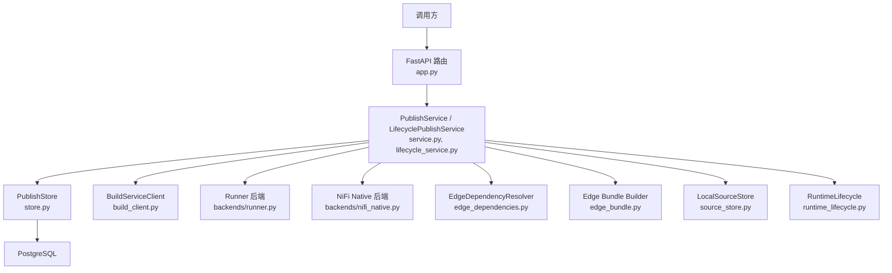
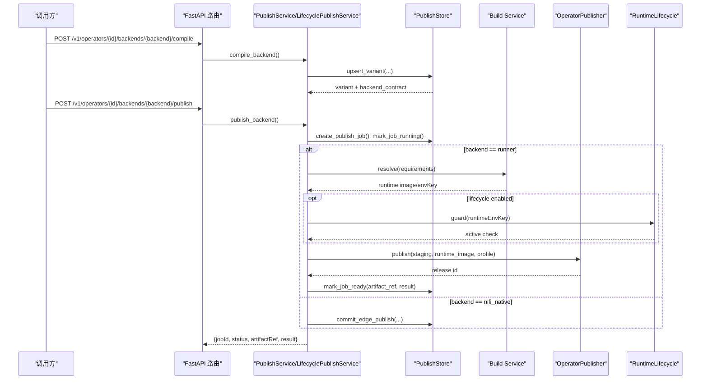
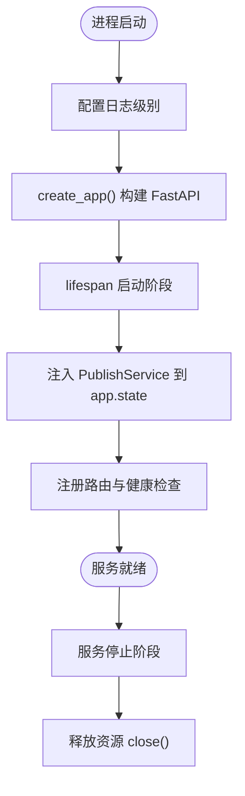
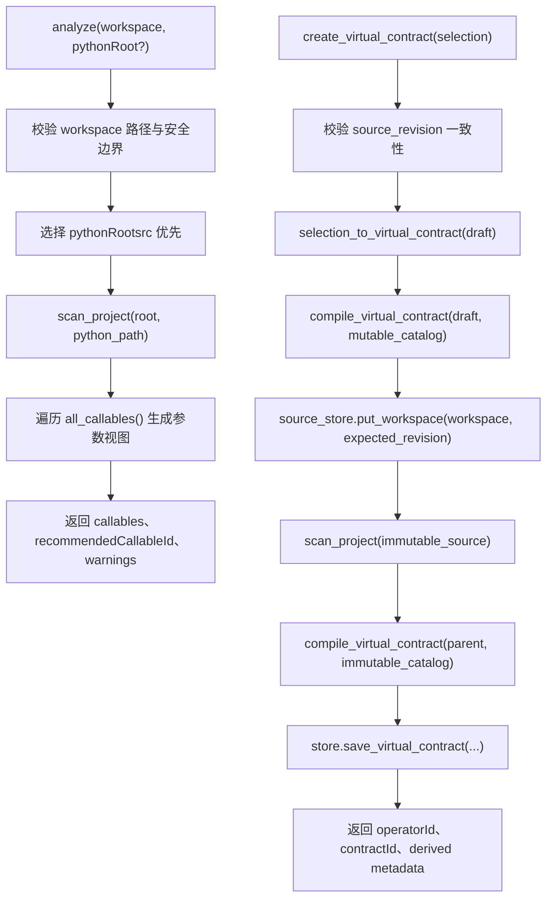
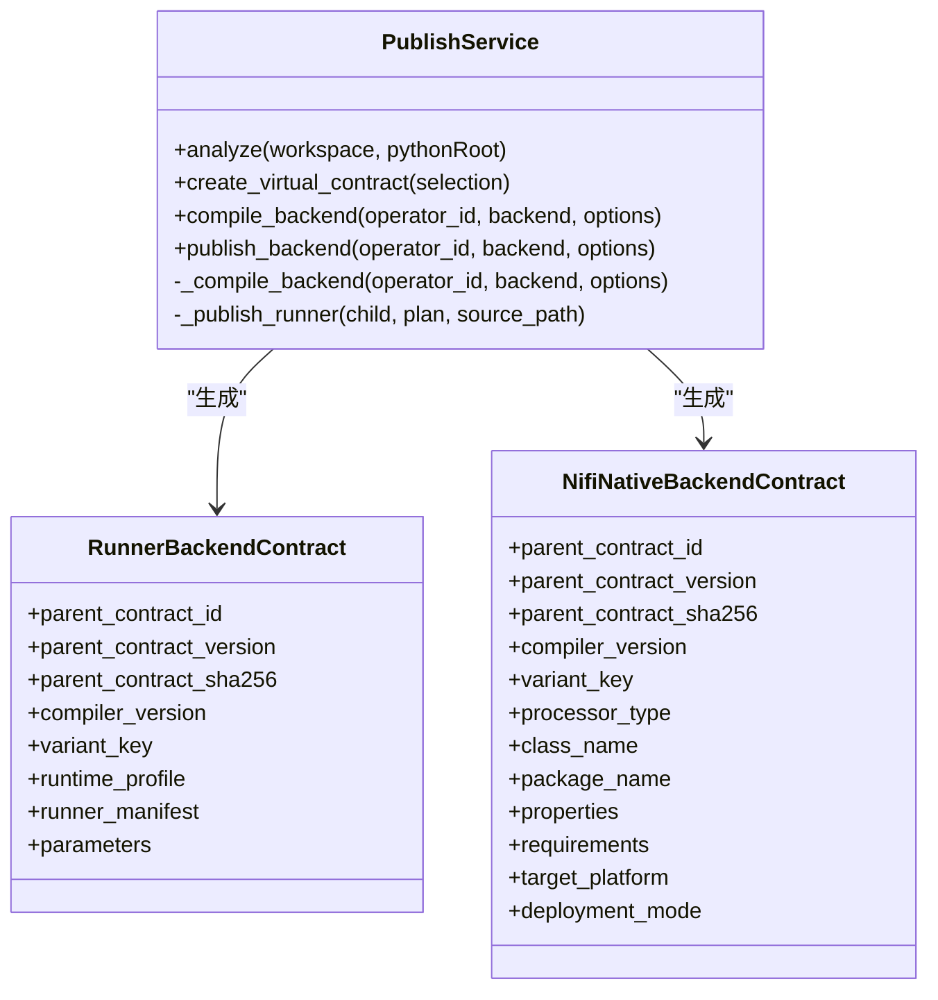
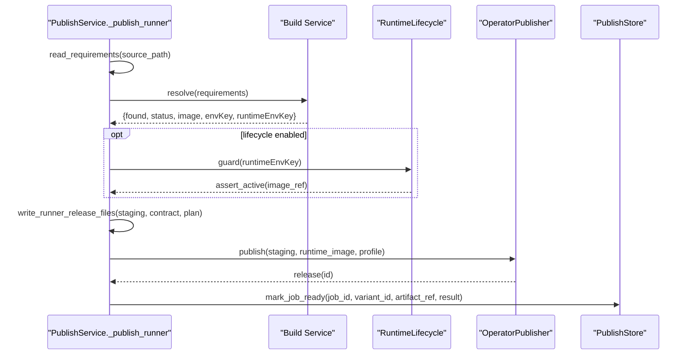
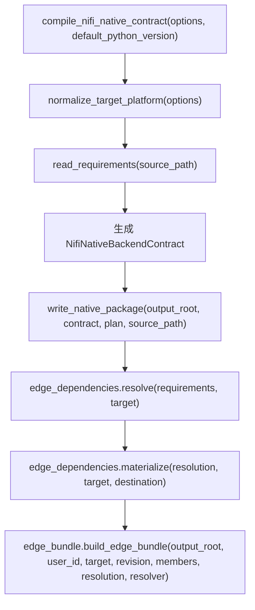
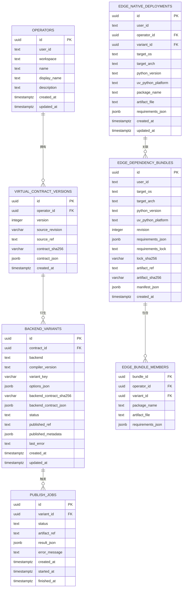
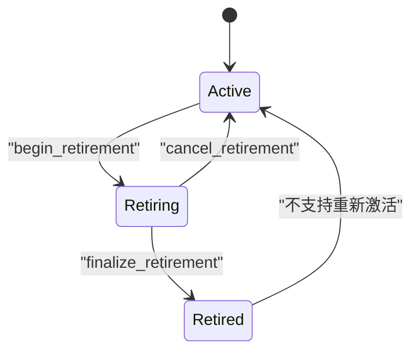
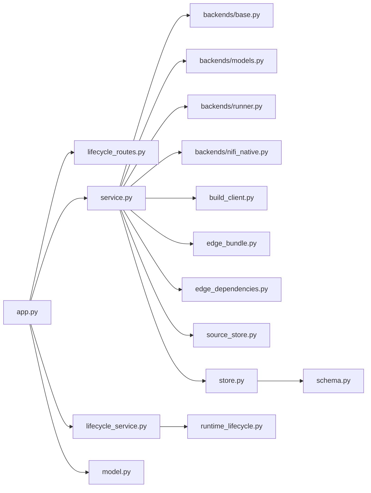

# 服务概述与架构

<cite>
**本文引用的文件**   
- [app.py](file://publish_service/app.py)
- [service.py](file://publish_service/service.py)
- [lifecycle_service.py](file://publish_service/lifecycle_service.py)
- [lifecycle_routes.py](file://publish_service/lifecycle_routes.py)
- [model.py](file://publish_service/model.py)
- [schema.py](file://publish_service/schema.py)
- [store.py](file://publish_service/store.py)
- [build_client.py](file://publish_service/build_client.py)
- [backends/base.py](file://publish_service/backends/base.py)
- [backends/models.py](file://publish_service/backends/models.py)
- [backends/runner.py](file://publish_service/backends/runner.py)
- [backends/nifi_native.py](file://publish_service/backends/nifi_native.py)
- [edge_bundle.py](file://publish_service/edge_bundle.py)
- [edge_dependencies.py](file://publish_service/edge_dependencies.py)
- [source_store.py](file://publish_service/source_store.py)
- [runtime_lifecycle.py](file://publish_service/runtime_lifecycle.py)
</cite>

## 目录
1. [简介](#简介)
2. [项目结构](#项目结构)
3. [核心组件](#核心组件)
4. [架构总览](#架构总览)
5. [详细组件分析](#详细组件分析)
6. [依赖关系分析](#依赖关系分析)
7. [性能与可扩展性](#性能与可扩展性)
8. [部署与配置](#部署与配置)
9. [监控与可观测性](#监控与可观测性)
10. [故障排查指南](#故障排查指南)
11. [结论](#结论)

## 简介
本文件为 Publish Service 的服务概述与架构文档。该服务负责将 Python 算子代码编译并发布到多后端：Runner 运行时与 NiFi Native 边缘目标。其核心职责包括：
- 算子代码分析与虚拟契约生成
- 多后端编译（Runner、NiFi Native）
- 版本管理与工件发布
- 边缘依赖解析与打包
- Runner 运行环境生命周期管理（退役保护）
- 与 Build Service 协作，获取可复现的运行时镜像

服务基于 FastAPI 构建，提供 REST API，并通过 PostgreSQL 持久化算子、契约、变体、发布任务与边缘包信息。

## 项目结构
Publish Service 采用分层组织方式：
- 应用层：FastAPI 路由、生命周期管理、健康检查
- 业务层：PublishService/LifecyclePublishService 编排分析、编译、发布流程
- 后端适配层：Runner/NiFi Native 编译器与产物写入
- 存储层：PostgreSQL 连接池、模式初始化、事务与锁
- 外部集成：Build Service 客户端、MinIO 工具
- 数据模型：Pydantic 请求/响应模型与数据库 Schema

**图示来源**
- [app.py:135-347](file://publish_service/app.py#L135-L347)
- [service.py:71-110](file://publish_service/service.py#L71-L110)
- [lifecycle_service.py:16-20](file://publish_service/lifecycle_service.py#L16-L20)
- [store.py:17-35](file://publish_service/store.py#L17-L35)
- [build_client.py:13-31](file://publish_service/build_client.py#L13-L31)
- [backends/runner.py:23-67](file://publish_service/backends/runner.py#L23-L67)
- [backends/nifi_native.py:103-168](file://publish_service/backends/nifi_native.py#L103-L168)
- [edge_dependencies.py:70-136](file://publish_service/edge_dependencies.py#L70-L136)
- [edge_bundle.py:46-131](file://publish_service/edge_bundle.py#L46-L131)
- [source_store.py:16-65](file://publish_service/source_store.py#L16-L65)
- [runtime_lifecycle.py:7-17](file://publish_service/runtime_lifecycle.py#L7-L17)

**章节来源**
- [app.py:135-347](file://publish_service/app.py#L135-L347)
- [service.py:71-110](file://publish_service/service.py#L71-L110)

## 核心组件
- FastAPI 应用与路由：定义健康检查、算子分析、虚拟契约创建、后端编译与发布、MinIO 下载等接口，统一错误映射。
- 业务服务：
  - PublishService：封装工作区校验、Python 源码扫描、虚拟契约编译、后端变体生成、发布任务编排。
  - LifecyclePublishService：扩展 Runner 发布流程，增加运行环境退役保护。
- 后端编译器：
  - Runner：生成 Runner 契约、适配器入口与发布清单。
  - NiFi Native：生成 Java/Python 混合处理器包、属性描述与目标平台元数据。
- 存储层：PostgreSQL 连接池、Schema 自动初始化、事务与 Advisory Lock。
- 外部集成：
  - BuildServiceClient：调用 Build Service 解析依赖并返回运行时镜像。
  - MinIO 工具：下载远程文件夹到本地工作空间。
- 边缘依赖：通过 uv 进行依赖锁定与目标平台材料化，支持二进制优先策略。
- 源快照：对源码进行不可变快照，保证契约与执行计划可追溯。
- 运行环境生命周期：使用 PostgreSQL Advisory Lock 保护 Runner 运行环境的退役流程。

**章节来源**
- [app.py:135-347](file://publish_service/app.py#L135-L347)
- [service.py:71-110](file://publish_service/service.py#L71-L110)
- [lifecycle_service.py:16-20](file://publish_service/lifecycle_service.py#L16-L20)
- [backends/runner.py:23-67](file://publish_service/backends/runner.py#L23-L67)
- [backends/nifi_native.py:103-168](file://publish_service/backends/nifi_native.py#L103-L168)
- [store.py:17-35](file://publish_service/store.py#L17-L35)
- [build_client.py:13-31](file://publish_service/build_client.py#L13-L31)
- [edge_dependencies.py:70-136](file://publish_service/edge_dependencies.py#L70-L136)
- [source_store.py:16-65](file://publish_service/source_store.py#L16-L65)
- [runtime_lifecycle.py:7-17](file://publish_service/runtime_lifecycle.py#L7-L17)

## 架构总览
Publish Service 在整体系统中的角色：
- 作为“发布编排中心”，协调算子分析、契约生成、后端编译与工件发布。
- 与 Runner Engine 的关系：Runner 后端发布产物由 Runner Engine 消费；同时 Publish Service 暴露 Runner 运行环境退役管理接口，供运维侧控制运行环境可用性。
- 与 Build Service 的关系：通过 HTTP 调用 Build Service 的运行时环境解析接口，获得稳定镜像与环境键，确保发布可复现。

**图示来源**
- [app.py:233-277](file://publish_service/app.py#L233-L277)
- [service.py:624-710](file://publish_service/service.py#L624-L710)
- [lifecycle_service.py:52-90](file://publish_service/lifecycle_service.py#L52-L90)
- [lifecycle_service.py:92-168](file://publish_service/lifecycle_service.py#L92-L168)
- [store.py:292-370](file://publish_service/store.py#L292-L370)
- [build_client.py:18-31](file://publish_service/build_client.py#L18-L31)
- [runtime_lifecycle.py:46-66](file://publish_service/runtime_lifecycle.py#L46-L66)

**章节来源**
- [app.py:233-277](file://publish_service/app.py#L233-L277)
- [service.py:624-710](file://publish_service/service.py#L624-L710)
- [lifecycle_service.py:52-168](file://publish_service/lifecycle_service.py#L52-L168)
- [store.py:292-370](file://publish_service/store.py#L292-L370)
- [build_client.py:18-31](file://publish_service/build_client.py#L18-L31)
- [runtime_lifecycle.py:46-66](file://publish_service/runtime_lifecycle.py#L46-L66)

## 详细组件分析

### FastAPI 应用结构与生命周期
- 应用工厂 create_app 注册路由、挂载生命周期上下文，并将 PublishService 实例注入 app.state.publish_service。
- lifespan 管理器在服务启动时构造服务实例，停止时关闭资源。
- 健康检查端点返回服务版本、支持的 API 与后端能力标志。
- 路由统一捕获业务异常并映射为 HTTP 状态码。

**图示来源**
- [app.py:34-150](file://publish_service/app.py#L34-L150)
- [app.py:151-347](file://publish_service/app.py#L151-L347)

**章节来源**
- [app.py:34-150](file://publish_service/app.py#L34-L150)
- [app.py:151-347](file://publish_service/app.py#L151-L347)

### 配置机制与环境变量
- 通过环境变量构建 PublishSettings，包含工作区、目录根、数据库 DSN、Build Service URL、默认用户与 Profile、边缘 Python 版本、uv 索引、是否要求二进制、构建超时与最大源码大小等。
- 关键路径默认值：native_artifact_root、source_root、edge_bundle_root 均基于 catalog_root 推导。
- 管理员令牌 PUBLISH_ADMIN_TOKEN 用于启用生命周期管理接口鉴权。

**章节来源**
- [app.py:50-128](file://publish_service/app.py#L50-L128)
- [service.py:53-69](file://publish_service/service.py#L53-L69)
- [lifecycle_routes.py:20-34](file://publish_service/lifecycle_routes.py#L20-L34)

### 依赖注入与服务发现
- 路由通过 request.app.state.publish_service 访问服务实例，避免全局单例。
- 测试或容器化部署可通过传入 service 参数替换实现，便于单元测试与隔离。

**章节来源**
- [app.py:135-150](file://publish_service/app.py#L135-L150)
- [app.py:172-277](file://publish_service/app.py#L172-L277)

### 算子代码分析与虚拟契约生成
- analyze：扫描工作区 Python 源码，列出可调用的函数/方法，标注支持性与原因，返回推荐 callable。
- create_virtual_contract：根据前端选择生成虚拟契约，校验源码版本一致性，保存不可变源码快照，编译得到执行计划与派生参数/输入输出元数据。

**图示来源**
- [service.py:385-416](file://publish_service/service.py#L385-L416)
- [service.py:418-477](file://publish_service/service.py#L418-L477)
- [source_store.py:22-45](file://publish_service/source_store.py#L22-L45)

**章节来源**
- [service.py:385-477](file://publish_service/service.py#L385-L477)
- [source_store.py:22-45](file://publish_service/source_store.py#L22-L45)

### 多后端编译与版本管理
- _compile_backend：根据后端类型生成 RunnerBackendContract 或 NifiNativeBackendContract，计算 variant_key 与后端契约摘要，upsert 变体记录。
- compile_backend：仅返回编译结果与摘要。
- publish_backend：创建发布任务，标记 RUNNING，执行具体后端发布逻辑，最终标记 READY 或 FAILED。

**图示来源**
- [service.py:569-642](file://publish_service/service.py#L569-L642)
- [backends/models.py:40-72](file://publish_service/backends/models.py#L40-L72)
- [backends/runner.py:23-67](file://publish_service/backends/runner.py#L23-L67)
- [backends/nifi_native.py:103-168](file://publish_service/backends/nifi_native.py#L103-L168)

**章节来源**
- [service.py:569-642](file://publish_service/service.py#L569-L642)
- [backends/models.py:40-72](file://publish_service/backends/models.py#L40-L72)
- [backends/runner.py:23-67](file://publish_service/backends/runner.py#L23-L67)
- [backends/nifi_native.py:103-168](file://publish_service/backends/nifi_native.py#L103-L168)

### Runner 后端发布流程
- 读取 requirements，调用 Build Service 解析运行时镜像与环境键。
- 若启用生命周期保护，则通过 RuntimeLifecycle.guard 加锁并断言运行环境活跃。
- 临时目录中复制源码、写入 Runner 发布文件，调用 OperatorPublisher 发布工件。
- 更新发布任务与变体状态，返回 artifact_ref 与发布结果。

**图示来源**
- [service.py:711-774](file://publish_service/service.py#L711-L774)
- [lifecycle_service.py:92-168](file://publish_service/lifecycle_service.py#L92-L168)
- [runtime_lifecycle.py:46-92](file://publish_service/runtime_lifecycle.py#L46-L92)
- [backends/runner.py:70-114](file://publish_service/backends/runner.py#L70-L114)

**章节来源**
- [service.py:711-774](file://publish_service/service.py#L711-L774)
- [lifecycle_service.py:92-168](file://publish_service/lifecycle_service.py#L92-L168)
- [runtime_lifecycle.py:46-92](file://publish_service/runtime_lifecycle.py#L46-L92)
- [backends/runner.py:70-114](file://publish_service/backends/runner.py#L70-L114)

### NiFi Native 后端与边缘依赖
- compile_nifi_native_contract：解析目标平台、类名与包名，生成属性列表与 requirements。
- write_native_package：生成 Python 包与运行时目录，打包为 zip。
- edge_dependencies：通过 uv pip compile 生成 lock 文本，materialize 安装目标平台依赖。
- edge_bundle：聚合多个算子的 native 工件与依赖，生成带 manifest 的 bundle zip。

**图示来源**
- [backends/nifi_native.py:103-168](file://publish_service/backends/nifi_native.py#L103-L168)
- [backends/nifi_native.py:533-581](file://publish_service/backends/nifi_native.py#L533-L581)
- [edge_dependencies.py:70-136](file://publish_service/edge_dependencies.py#L70-L136)
- [edge_dependencies.py:138-182](file://publish_service/edge_dependencies.py#L138-L182)
- [edge_bundle.py:46-131](file://publish_service/edge_bundle.py#L46-L131)

**章节来源**
- [backends/nifi_native.py:103-168](file://publish_service/backends/nifi_native.py#L103-L168)
- [backends/nifi_native.py:533-581](file://publish_service/backends/nifi_native.py#L533-L581)
- [edge_dependencies.py:70-182](file://publish_service/edge_dependencies.py#L70-L182)
- [edge_bundle.py:46-131](file://publish_service/edge_bundle.py#L46-L131)

### 版本管理与数据库模式
- operators：算子元数据与用户维度唯一约束。
- virtual_contract_versions：虚拟契约版本、源码修订与 JSON 内容。
- backend_variants：后端变体、编译器版本、选项、状态与发布引用。
- publish_jobs：发布任务状态机（PENDING/RUNNING/READY/FAILED）。
- edge_native_deployments：边缘部署记录，按 OS/Arch/Python 维度去重。
- edge_dependency_bundles 与 edge_bundle_members：边缘依赖包与成员关系。

**图示来源**
- [schema.py:4-150](file://publish_service/schema.py#L4-L150)

**章节来源**
- [schema.py:4-150](file://publish_service/schema.py#L4-L150)
- [store.py:39-127](file://publish_service/store.py#L39-L127)
- [store.py:246-370](file://publish_service/store.py#L246-L370)
- [store.py:507-689](file://publish_service/store.py#L507-L689)

### 运行环境生命周期管理
- begin_retirement：将运行环境标记为 RETIRING，查询当前引用者，判断是否安全退役。
- cancel_retirement：取消退役状态。
- finalize_retirement：完成退役，进入 RETIRED。
- guard：使用 PostgreSQL Advisory Lock 保护并发操作，防止发布与退役竞态。

**图示来源**
- [runtime_lifecycle.py:150-253](file://publish_service/runtime_lifecycle.py#L150-L253)
- [runtime_lifecycle.py:46-66](file://publish_service/runtime_lifecycle.py#L46-L66)

**章节来源**
- [runtime_lifecycle.py:46-92](file://publish_service/runtime_lifecycle.py#L46-L92)
- [runtime_lifecycle.py:150-253](file://publish_service/runtime_lifecycle.py#L150-L253)
- [lifecycle_routes.py:36-86](file://publish_service/lifecycle_routes.py#L36-L86)

## 依赖关系分析
- 模块耦合：
  - app.py 依赖 lifecycle_routes、lifecycle_service、service、model、utils.minio_tools。
  - service.py 依赖 operator_authoring、runner_engine.catalog/publisher、backends.*、build_client、edge_bundle、edge_dependencies、source_store。
  - store.py 依赖 schema.py 与 psycopg_pool。
  - lifecycle_service.py 继承 service.PublishService 并组合 runtime_lifecycle。
- 外部依赖：
  - Build Service：HTTP 接口 /v1/runtime-environments/resolve。
  - PostgreSQL：连接池、事务、Advisory Lock。
  - uv：依赖解析与材料化。
- 潜在循环依赖：无直接循环；模块间通过接口与数据对象解耦。

**图示来源**
- [app.py:14-31](file://publish_service/app.py#L14-L31)
- [service.py:12-39](file://publish_service/service.py#L12-L39)
- [store.py:11-14](file://publish_service/store.py#L11-L14)
- [lifecycle_service.py:8-13](file://publish_service/lifecycle_service.py#L8-L13)

**章节来源**
- [app.py:14-31](file://publish_service/app.py#L14-L31)
- [service.py:12-39](file://publish_service/service.py#L12-L39)
- [store.py:11-14](file://publish_service/store.py#L11-L14)
- [lifecycle_service.py:8-13](file://publish_service/lifecycle_service.py#L8-L13)

## 性能与可扩展性
- 数据库连接池：PublishStore 使用 psycopg_pool，最小/最大连接数可配置，提升并发查询吞吐。
- 原子性与锁：
  - 发布任务状态变更使用事务保证一致性。
  - 边缘包提交使用 Advisory Lock 避免并发冲突。
  - Runner 运行环境退役使用 Advisory Lock 保护发布与退役竞态。
- 文件系统：
  - 源码快照与临时目录使用 tempfile，避免污染工作区。
  - 边缘包与原生包使用 zipfile 压缩，减少传输体积。
- 可扩展点：
  - 新增后端需实现对应编译器与产物写入逻辑，并在 service._compile_backend 中分支处理。
  - 可引入异步任务队列（如 Celery）以解耦耗时发布流程。

[本节为通用指导，不直接分析具体文件]

## 部署与配置
- 必需环境变量：
  - PUBLISH_WORKSPACE_ROOT：算子源码工作区根目录
  - PUBLISH_CATALOG_ROOT：制品目录根
  - PUBLISH_DATABASE_URL：PostgreSQL DSN
- 可选环境变量：
  - PUBLISH_SOURCE_ROOT：源码快照根（默认 catalog_root/_publish_sources）
  - PUBLISH_NATIVE_ARTIFACT_ROOT：原生制品根（默认 catalog_root/_nifi_native_packages）
  - PUBLISH_EDGE_BUNDLE_ROOT：边缘包根（默认 native_artifact_root/_edge_bundles）
  - PUBLISH_BUILD_SERVICE_URL：Build Service 地址（默认 http://127.0.0.1:9088）
  - PUBLISH_DEFAULT_PROFILE：默认 Runner profile（默认 standard）
  - PUBLISH_DEFAULT_USER_ID：默认用户 ID（默认 1）
  - PUBLISH_EDGE_PYTHON_VERSION：边缘 Python 版本（默认 3.12）
  - PUBLISH_EDGE_UV_DEFAULT_INDEX：uv 默认索引
  - PUBLISH_EDGE_REQUIRE_BINARY：是否要求二进制依赖（默认 true）
  - PUBLISH_BUILD_TIMEOUT_SECONDS：构建超时秒数（默认 1800）
  - PUBLISH_MAX_SOURCE_BYTES：最大源码快照大小（默认 500MB）
  - PUBLISH_LOG_LEVEL：日志级别（默认 INFO）
  - PUBLISH_LISTEN_HOST/PUBLISH_LISTEN_PORT：监听主机与端口（默认 127.0.0.1:9090）
  - PUBLISH_ADMIN_TOKEN：管理员令牌（启用生命周期管理接口鉴权）

- 启动命令示例：
  - 开发模式：python -m publish_service --listen-host 0.0.0.0 --listen-port 9090 --log-level INFO
  - 生产模式：通过容器运行，设置上述环境变量，并确保 PostgreSQL 与 Build Service 可达。

**章节来源**
- [app.py:50-128](file://publish_service/app.py#L50-L128)
- [app.py:353-378](file://publish_service/app.py#L353-L378)
- [lifecycle_routes.py:20-34](file://publish_service/lifecycle_routes.py#L20-L34)

## 监控与可观测性
- 健康检查：GET /health 返回服务版本、API 版本、后端能力标志与生命周期管理配置状态。
- 日志：统一格式化输出，支持通过环境变量调整级别。
- 指标建议：
  - 发布任务计数与状态分布（PENDING/RUNNING/READY/FAILED）
  - 后端变体数量与状态（COMPILED/PUBLISHED/FAILED）
  - 边缘包构建耗时与失败率
  - Build Service 调用成功率与平均延迟
  - 运行环境退役事件计数
- 可观测性增强建议：
  - 引入 Prometheus 指标导出器，统计关键路径耗时与错误率。
  - 结构化日志中包含 operatorId、variantId、jobId、artifactRef 等追踪字段。

[本节为通用指导，不直接分析具体文件]

## 故障排查指南
- 常见错误与定位：
  - 源码变更导致契约不一致：提示 SOURCE_CHANGED，需重新 analyze。
  - Build Service 不可用或返回失败：RUNTIME_BUILD_FAILED/RUNTIME_NOT_READY，检查网络与 Build Service 状态。
  - Runner 运行环境退役保护：RUNTIME_RETIRING，等待退役完成或取消退役。
  - 边缘依赖冲突：EDGE_DEPENDENCY_CONFLICT，检查同一目标平台下已发布的依赖环境。
  - MinIO 下载失败：区分 400/403/404/500/502 错误码，检查 bucket/folder 权限与配置。
- 诊断步骤：
  - 查看发布任务状态与错误消息（publish_jobs.error_message）。
  - 检查变体状态与最后错误（backend_variants.last_error）。
  - 确认 PostgreSQL 连接与 Advisory Lock 使用情况。
  - 验证 uv 环境与依赖解析日志。

**章节来源**
- [service.py:418-477](file://publish_service/service.py#L418-L477)
- [service.py:711-774](file://publish_service/service.py#L711-L774)
- [lifecycle_service.py:92-168](file://publish_service/lifecycle_service.py#L92-L168)
- [app.py:279-335](file://publish_service/app.py#L279-L335)

## 结论
Publish Service 提供了完整的算子发布流水线，覆盖从源码分析、虚拟契约生成、多后端编译到工件发布与版本管理的全流程。通过与 Build Service 和 Runner Engine 的协作，以及 PostgreSQL 的事务与锁机制，服务保证了发布过程的可复现性与安全性。未来可在异步任务、指标采集与错误恢复方面进一步增强，以提升大规模发布场景下的稳定性与可观测性。