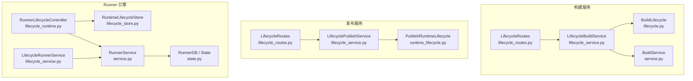
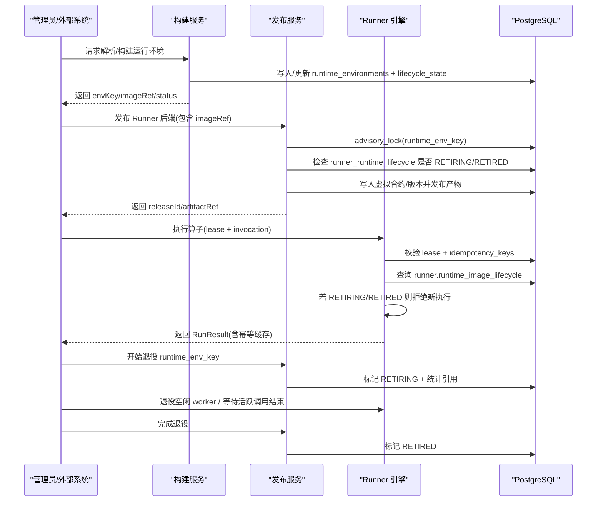
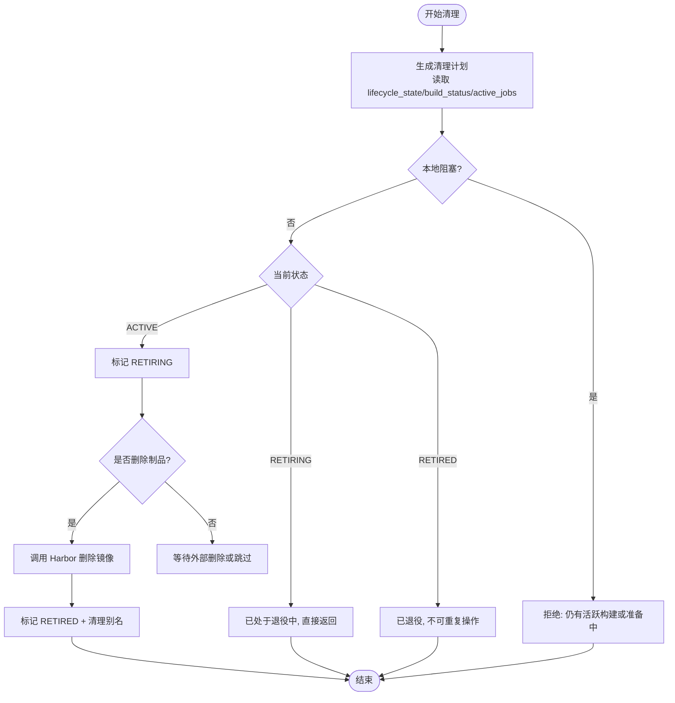
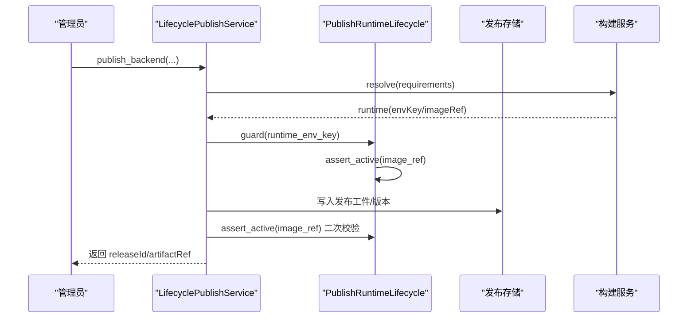
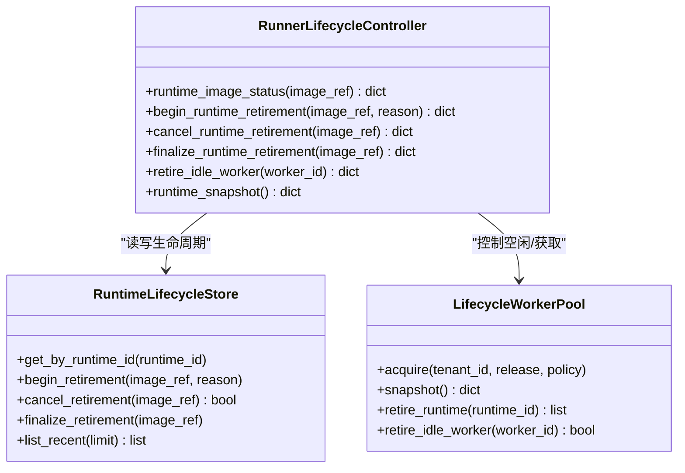
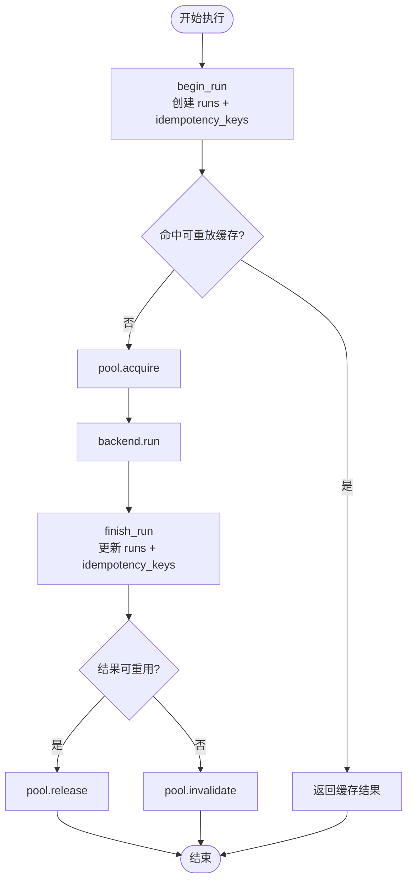
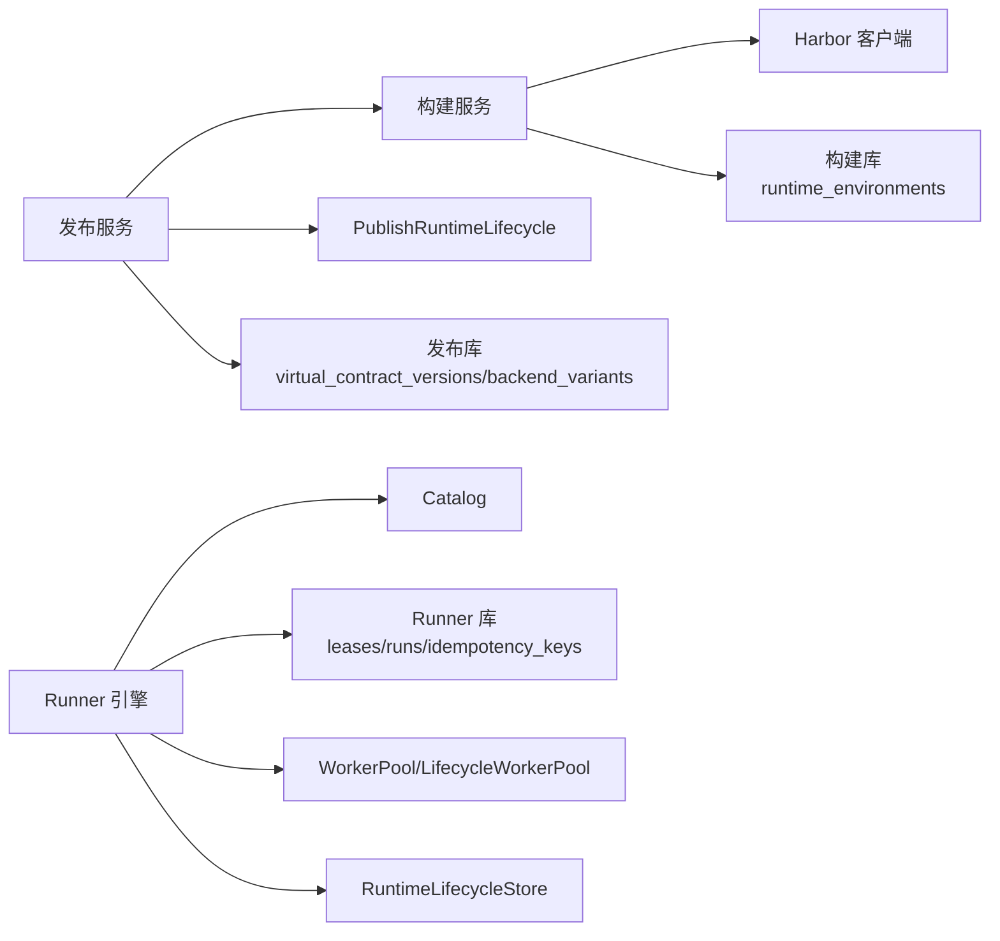
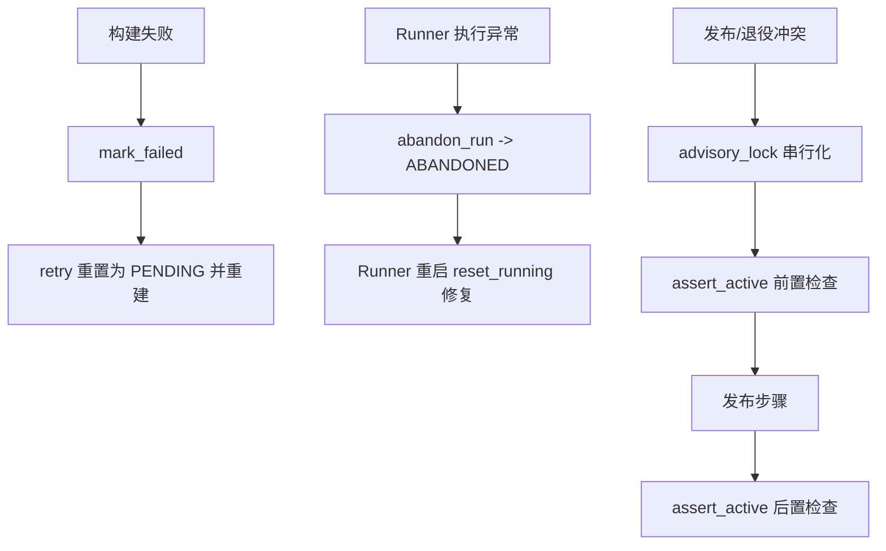

# 生命周期管理

<cite>
**本文引用的文件**   
- [build_service/lifecycle.py](file://build_service/lifecycle.py)
- [build_service/lifecycle_routes.py](file://build_service/lifecycle_routes.py)
- [build_service/lifecycle_service.py](file://build_service/lifecycle_service.py)
- [build_service/service.py](file://build_service/service.py)
- [runner_engine/lifecycle_runtime.py](file://runner_engine/lifecycle_runtime.py)
- [runner_engine/lifecycle_service.py](file://runner_engine/lifecycle_service.py)
- [runner_engine/lifecycle_store.py](file://runner_engine/lifecycle_store.py)
- [runner_engine/state.py](file://runner_engine/state.py)
- [runner_engine/service.py](file://runner_engine/service.py)
- [publish_service/runtime_lifecycle.py](file://publish_service/runtime_lifecycle.py)
- [publish_service/lifecycle_routes.py](file://publish_service/lifecycle_routes.py)
- [publish_service/lifecycle_service.py](file://publish_service/lifecycle_service.py)
</cite>

## 目录
1. [引言](#引言)
2. [项目结构](#项目结构)
3. [核心组件](#核心组件)
4. [架构总览](#架构总览)
5. [详细组件分析](#详细组件分析)
6. [依赖关系分析](#依赖关系分析)
7. [性能与一致性](#性能与一致性)
8. [故障恢复与事务](#故障恢复与事务)
9. [API 调用示例](#api-调用示例)
10. [结论](#结论)

## 引言
本文面向算子从“构建/解析环境”到“发布为 Runner 运行时”，再到“运行期执行、回收与归档”的完整生命周期。重点说明：
- 状态机与转换条件
- 事件处理与路由
- 持久化机制（PostgreSQL 表、索引、事务）
- 异步任务管理、进度跟踪与结果回调
- 失败恢复、事务边界与数据一致性保证
- 关键 API 调用路径与错误码

本仓库将生命周期拆分为三个服务层：
- 构建服务：负责运行环境镜像构建、复用与清理计划
- 发布服务：负责将算子发布为 Runner 后端，并与运行环境生命周期做互斥保护
- Runner 引擎：负责执行算子、租约与幂等执行记录，并在运行期对镜像生命周期进行门控

## 项目结构
围绕生命周期相关代码，主要分布在以下模块：
- build_service：构建与清理生命周期
- publish_service：发布流程与运行环境生命周期门控
- runner_engine：Runner 执行引擎、运行期生命周期存储与池化沙箱

**图表来源**
- [build_service/lifecycle.py:14-134](file://build_service/lifecycle.py#L14-L134)
- [build_service/lifecycle_service.py:11-323](file://build_service/lifecycle_service.py#L11-L323)
- [build_service/service.py:26-216](file://build_service/service.py#L26-L216)
- [build_service/lifecycle_routes.py:34-108](file://build_service/lifecycle_routes.py#L34-L108)
- [publish_service/runtime_lifecycle.py:7-254](file://publish_service/runtime_lifecycle.py#L7-L254)
- [publish_service/lifecycle_service.py:16-169](file://publish_service/lifecycle_service.py#L16-L169)
- [publish_service/lifecycle_routes.py:36-86](file://publish_service/lifecycle_routes.py#L36-L86)
- [runner_engine/lifecycle_store.py:10-151](file://runner_engine/lifecycle_store.py#L10-L151)
- [runner_engine/lifecycle_runtime.py:14-397](file://runner_engine/lifecycle_runtime.py#L14-L397)
- [runner_engine/lifecycle_service.py:7-71](file://runner_engine/lifecycle_service.py#L7-L71)
- [runner_engine/service.py:80-456](file://runner_engine/service.py#L80-L456)
- [runner_engine/state.py:16-685](file://runner_engine/state.py#L16-L685)

**章节来源**
- [build_service/lifecycle.py:14-134](file://build_service/lifecycle.py#L14-L134)
- [build_service/lifecycle_service.py:11-323](file://build_service/lifecycle_service.py#L11-L323)
- [publish_service/runtime_lifecycle.py:7-254](file://publish_service/runtime_lifecycle.py#L7-L254)
- [runner_engine/lifecycle_store.py:10-151](file://runner_engine/lifecycle_store.py#L10-L151)
- [runner_engine/lifecycle_runtime.py:14-397](file://runner_engine/lifecycle_runtime.py#L14-L397)
- [runner_engine/lifecycle_service.py:7-71](file://runner_engine/lifecycle_service.py#L7-L71)
- [runner_engine/service.py:80-456](file://runner_engine/service.py#L80-L456)
- [runner_engine/state.py:16-685](file://runner_engine/state.py#L16-L685)

## 核心组件
- 构建侧生命周期
  - BuildLifecycle：封装环境清理计划、开始退役、取消退役、删除制品等逻辑
  - LifecycleBuildStore：在构建库上扩展 lifecycle_state、last_used_at、retired_at、artifact_deleted_at、cleanup_error 等字段，并实现 claim_build、begin_retirement、finalize_retirement 等原子操作
  - LifecycleBuildService：对外暴露 cleanup_plan、retire_environment、cancel_environment_retirement、delete_environment_artifact
- 发布侧生命周期
  - PublishRuntimeLifecycle：基于 PostgreSQL advisory lock 的发布/退役互斥门控；维护 publish.runner_runtime_lifecycle 表
  - LifecyclePublishService：包装发布流程，确保发布前检查运行环境是否处于 RETIRING/RETIRED
- Runner 侧生命周期
  - RuntimeLifecycleStore：维护 runner.runtime_image_lifecycle 表，提供 begin/cancel/finalize 退役接口
  - LifecycleWorkerPool：在 WorkerPool 之上增加生命周期门控，阻止 RETIRING 镜像的新沙箱获取，并支持按 runtime_id 退役空闲 worker
  - RunnerLifecycleController：聚合 Runner 内部活跃调用、空闲 worker、受管沙箱等信息，计算 safeForArtifactDeletion，并提供 begin/cancel/finalize 退役入口
  - LifecycleRunnerService：在 RunnerService 之上拦截 acquire_lease/renew_lease/invoke，拒绝 RETIRING/RETIRED 镜像的新执行

**章节来源**
- [build_service/lifecycle.py:14-134](file://build_service/lifecycle.py#L14-L134)
- [build_service/lifecycle_service.py:11-323](file://build_service/lifecycle_service.py#L11-L323)
- [publish_service/runtime_lifecycle.py:7-254](file://publish_service/runtime_lifecycle.py#L7-L254)
- [runner_engine/lifecycle_runtime.py:14-397](file://runner_engine/lifecycle_runtime.py#L14-L397)
- [runner_engine/lifecycle_service.py:7-71](file://runner_engine/lifecycle_service.py#L7-L71)
- [runner_engine/lifecycle_store.py:10-151](file://runner_engine/lifecycle_store.py#L10-L151)

## 架构总览
下图展示从“构建环境”到“发布 Runner 后端”，再到“Runner 执行与退役”的整体流程。

**图表来源**
- [build_service/lifecycle_service.py:304-323](file://build_service/lifecycle_service.py#L304-L323)
- [publish_service/lifecycle_service.py:52-169](file://publish_service/lifecycle_service.py#L52-L169)
- [publish_service/runtime_lifecycle.py:46-92](file://publish_service/runtime_lifecycle.py#L46-L92)
- [runner_engine/lifecycle_service.py:19-71](file://runner_engine/lifecycle_service.py#L19-L71)
- [runner_engine/service.py:188-405](file://runner_engine/service.py#L188-L405)
- [runner_engine/state.py:411-607](file://runner_engine/state.py#L411-L607)

## 详细组件分析

### 构建侧生命周期：环境构建、复用与清理
- 状态与阻塞规则
  - 构建状态：PENDING → BUILDING → VERIFYING → READY/FAILED
  - 生命周期状态：ACTIVE、RETIRING、RETIRED
  - 本地阻塞：存在活跃构建任务或处于 PENDING/BUILDING/VERIFYING 时，不允许进入 RETIRING
- 清理流程
  - begin_retirement：仅允许 ACTIVE 且无活跃构建的任务进入 RETIRING
  - cancel_retirement：仅允许 RETIRING 回到 ACTIVE
  - delete_artifact：仅在 RETIRING 且无活跃构建时，调用 Harbor 删除镜像，然后 finalize_retirement 到 RETIRED
- 持久化
  - 通过 LifecycleBuildStore 在 runtime_environments 上扩展 lifecycle_state 等列，并使用原子 SQL 保证并发安全
  - 使用 build_jobs 表计数活跃构建任务

**图表来源**
- [build_service/lifecycle.py:45-134](file://build_service/lifecycle.py#L45-L134)
- [build_service/lifecycle_service.py:216-290](file://build_service/lifecycle_service.py#L216-L290)

**章节来源**
- [build_service/lifecycle.py:14-134](file://build_service/lifecycle.py#L14-L134)
- [build_service/lifecycle_service.py:11-323](file://build_service/lifecycle_service.py#L11-L323)
- [build_service/service.py:26-216](file://build_service/service.py#L26-L216)

### 发布侧生命周期：Runner 后端发布与退役门控
- 发布前检查
  - 通过 PublishRuntimeLifecycle.guard 使用 PostgreSQL advisory lock 串行化同一 runtime_env_key 的发布/退役操作
  - assert_active 禁止在 RETIRING/RETIRED 或 image_ref 不一致的情况下发布
- 退役流程
  - begin_retirement：插入/更新 runner_runtime_lifecycle 为 RETIRING，并统计当前引用
  - cancel_retirement：删除 RETIRING 行以取消退役
  - finalize_retirement：将状态改为 RETIRED
- 发布事务
  - _publish_runner_transactional 内先 resolve 运行环境，再 guard(runtime_env_key)，发布完成后再次 assert_active，最后 mark_job_ready

**图表来源**
- [publish_service/lifecycle_service.py:52-169](file://publish_service/lifecycle_service.py#L52-L169)
- [publish_service/runtime_lifecycle.py:46-92](file://publish_service/runtime_lifecycle.py#L46-L92)

**章节来源**
- [publish_service/lifecycle_service.py:16-169](file://publish_service/lifecycle_service.py#L16-L169)
- [publish_service/runtime_lifecycle.py:7-254](file://publish_service/runtime_lifecycle.py#L7-L254)

### Runner 侧生命周期：执行门控、退役与制品删除
- 执行门控
  - LifecycleRunnerService.acquire_lease/renew_lease/invoke 均会检查 release 对应 runtime 的生命周期，若 RETIRING/RETIRED 则抛出 RUNTIME_RETIRING/RUNTIME_RETIRED
  - LifecycleWorkerPool.acquire 再次检查 is_blocked_runtime，关闭竞态
- 退役流程
  - begin_runtime_retirement：持久化 RETIRING，并退役空闲 worker
  - cancel_runtime_retirement：删除 RETIRING 记录
  - finalize_runtime_retirement：校验 safeForArtifactDeletion（无活跃调用、无空闲 worker、无 acquiring、无 managed sandbox），然后标记 RETIRED
- 快照与观察
  - runtime_image_status 聚合活跃调用、空闲 worker、acquiring 计数、managed sandbox 列表，并给出 safeForArtifactDeletion 判断

**图表来源**
- [runner_engine/lifecycle_runtime.py:14-397](file://runner_engine/lifecycle_runtime.py#L14-L397)
- [runner_engine/lifecycle_store.py:35-151](file://runner_engine/lifecycle_store.py#L35-L151)

**章节来源**
- [runner_engine/lifecycle_runtime.py:14-397](file://runner_engine/lifecycle_runtime.py#L14-L397)
- [runner_engine/lifecycle_service.py:7-71](file://runner_engine/lifecycle_service.py#L7-L71)
- [runner_engine/lifecycle_store.py:10-151](file://runner_engine/lifecycle_store.py#L10-L151)

### 执行状态机与幂等性
- 执行状态
  - runner.runs.state：RUNNING → DONE/ABANDONED
  - outcome_class：SUCCESS / RETRYABLE_FAILURE / USER_FAILURE / INFRASTRUCTURE_FAILURE
- 幂等键
  - runner.idempotency_keys：记录 key→run_id 的映射，支持可重放结果缓存（replayable + expires_at）
- 启动恢复
  - startup 阶段 reset_running 将 RUNNING 转为 ABANDONED，并清空 RUNNING 的幂等键
- 后台清理
  - 定期清理过期租约、过期幂等键、旧执行记录

**图表来源**
- [runner_engine/state.py:411-607](file://runner_engine/state.py#L411-L607)
- [runner_engine/service.py:188-405](file://runner_engine/service.py#L188-L405)

**章节来源**
- [runner_engine/state.py:16-685](file://runner_engine/state.py#L16-L685)
- [runner_engine/service.py:80-456](file://runner_engine/service.py#L80-L456)

## 依赖关系分析
- 构建服务依赖
  - HarborClient：用于删除镜像制品
  - BuildStore/LifecycleBuildStore：数据库访问与生命周期扩展
- 发布服务依赖
  - PublishRuntimeLifecycle：advisory lock 与 runner_runtime_lifecycle 表
  - BuildService：解析运行环境
  - Publisher：发布产物
- Runner 引擎依赖
  - Catalog：获取 release 信息
  - RunnerDB(state.py)：leases/runs/idempotency_keys
  - WorkerPool/LifecycleWorkerPool：沙箱池与生命周期门控
  - RuntimeLifecycleStore：runner.runtime_image_lifecycle

**图表来源**
- [build_service/lifecycle.py:6-134](file://build_service/lifecycle.py#L6-L134)
- [build_service/lifecycle_service.py:11-323](file://build_service/lifecycle_service.py#L11-L323)
- [publish_service/lifecycle_service.py:16-169](file://publish_service/lifecycle_service.py#L16-L169)
- [publish_service/runtime_lifecycle.py:7-254](file://publish_service/runtime_lifecycle.py#L7-L254)
- [runner_engine/lifecycle_runtime.py:14-397](file://runner_engine/lifecycle_runtime.py#L14-L397)
- [runner_engine/lifecycle_store.py:10-151](file://runner_engine/lifecycle_store.py#L10-L151)
- [runner_engine/state.py:16-685](file://runner_engine/state.py#L16-L685)

**章节来源**
- [build_service/lifecycle.py:6-134](file://build_service/lifecycle.py#L6-L134)
- [publish_service/lifecycle_service.py:16-169](file://publish_service/lifecycle_service.py#L16-L169)
- [runner_engine/lifecycle_runtime.py:14-397](file://runner_engine/lifecycle_runtime.py#L14-L397)

## 性能与一致性
- 并发控制
  - 构建侧：claim_build 使用原子 UPDATE + INSERT 保证单实例构建
  - 发布侧：advisory lock 保证同一 runtime_env_key 的发布/退役串行化
  - Runner 侧：LifecycleWorkerPool.acquire 双重检查生命周期，避免竞态
- 索引优化
  - 构建侧：ix_build_runtime_lifecycle(lifecycle_state, status, updated_at DESC)
  - Runner 侧：runner.runtime_image_lifecycle(state, updated_at DESC)
  - 执行侧：runs 与 idempotency_keys 的多维索引提升查询与清理效率
- 资源清理
  - 后台线程周期性清理过期租约、过期幂等键、旧执行记录
  - Runner 启动时重置 RUNNING 为 ABANDONED，防止进程重启导致悬挂执行

**章节来源**
- [build_service/lifecycle_service.py:109-214](file://build_service/lifecycle_service.py#L109-L214)
- [publish_service/runtime_lifecycle.py:46-66](file://publish_service/runtime_lifecycle.py#L46-L66)
- [runner_engine/lifecycle_runtime.py:26-47](file://runner_engine/lifecycle_runtime.py#L26-L47)
- [runner_engine/state.py:151-177](file://runner_engine/state.py#L151-L177)
- [runner_engine/service.py:105-139](file://runner_engine/service.py#L105-L139)

## 故障恢复与事务
- 构建失败恢复
  - _build 捕获异常后 mark_failed，可通过 retry 接口重置 FAILED 环境重新构建
- Runner 执行失败恢复
  - abandon_run 将 RUNNING 转为 ABANDONED，并清除幂等键
  - 启动时 reset_running 批量修复悬挂执行
- 发布/退役事务
  - 发布过程在 advisory lock 保护下完成，前后两次 assert_active 确保无状态漂移
  - 退役三步：begin → cancel/finalize，最终状态由数据库约束保证

**图表来源**
- [build_service/service.py:157-216](file://build_service/service.py#L157-L216)
- [runner_engine/state.py:388-409](file://runner_engine/state.py#L388-L409)
- [publish_service/runtime_lifecycle.py:46-92](file://publish_service/runtime_lifecycle.py#L46-L92)

**章节来源**
- [build_service/service.py:121-216](file://build_service/service.py#L121-L216)
- [runner_engine/state.py:388-409](file://runner_engine/state.py#L388-L409)
- [publish_service/lifecycle_service.py:92-169](file://publish_service/lifecycle_service.py#L92-L169)

## API 调用示例
以下为典型生命周期管理 API 调用路径与行为说明（不展示具体代码内容）。

- 构建服务清理计划与退役
  - GET /v1/admin/runtime-environments/{environment_id}/cleanup-plan
    - 鉴权：Bearer BUILD_ADMIN_TOKEN
    - 返回：environmentId/envKey/buildStatus/lifecycleState/imageRef/aliasCount/activeBuildJobs/locallyBlocked
  - POST /v1/admin/runtime-environments/{environment_id}/retire
    - 入参：reason
    - 行为：若本地阻塞或状态非法返回 409；否则标记 RETIRING
  - POST /v1/admin/runtime-environments/{environment_id}/cancel-retirement
    - 行为：仅 RETIRING 可取消回 ACTIVE
  - DELETE /v1/admin/runtime-environments/{environment_id}/artifact
    - 入参：expectedImageRef
    - 行为：校验 RETIRING 且无活跃构建，删除 Harbor 制品后标记 RETIRED

- 发布服务 Runner 运行环境退役
  - POST /v1/admin/runner-runtimes/retire
    - 入参：runtimeEnvKey/imageRef/reason
    - 行为：advisory_lock 保护，标记 RETIRING，返回 publishedReferenceCount/safeForRetirement
  - POST /v1/admin/runner-runtimes/cancel-retirement
    - 行为：删除 RETIRING 行，若不存在或已 RETIRED 返回相应语义
  - POST /v1/admin/runner-runtimes/finalize-retirement
    - 行为：标记 RETIRED

- Runner 引擎运行期观察与控制
  - 内部控制器方法（通常由内部 HTTP 或管理接口暴露）：
    - runtime_image_status(image_ref)：返回 runtimeId/imageRef/lifecycleState/releaseCount/unexpiredLeaseCount/activeInvocationCount/idleWorkerCount/acquiringWorkerCount/managedSandboxCount/safeForArtifactDeletion
    - begin_runtime_retirement(image_ref, reason)：持久化 RETIRING 并退役空闲 worker
    - cancel_runtime_retirement(image_ref)：删除 RETIRING 记录
    - finalize_runtime_retirement(image_ref)：校验 safeForArtifactDeletion 后标记 RETIRED
    - retire_idle_worker(worker_id)：退役指定空闲 worker

- 执行与幂等
  - acquire_lease/renew_lease/invoke：
    - 若 release 对应 runtime 为 RETIRING/RETIRED，抛出 RUNTIME_RETIRING/RUNTIME_RETIRED
    - invoke 使用 idempotency_key 去重，命中缓存直接返回

**章节来源**
- [build_service/lifecycle_routes.py:34-108](file://build_service/lifecycle_routes.py#L34-L108)
- [publish_service/lifecycle_routes.py:36-86](file://publish_service/lifecycle_routes.py#L36-L86)
- [runner_engine/lifecycle_runtime.py:239-397](file://runner_engine/lifecycle_runtime.py#L239-L397)
- [runner_engine/lifecycle_service.py:19-71](file://runner_engine/lifecycle_service.py#L19-L71)
- [runner_engine/service.py:146-405](file://runner_engine/service.py#L146-L405)

## 结论
该生命周期体系通过三层协作实现了从构建、发布到运行期的全链路可控：
- 构建侧通过 BuildLifecycle 与 LifecycleBuildStore 保证环境构建与清理的原子性与可观测性
- 发布侧通过 PublishRuntimeLifecycle 的 advisory lock 与 assert_active 机制，确保发布与退役互斥一致
- Runner 侧通过 LifecycleRunnerService 与 LifecycleWorkerPool 的双重门控，以及 RuntimeLifecycleStore 的持久化状态，保障运行期不再接受新执行，并安全过渡到退役完成

同时，Runner 的执行状态机与幂等键设计提供了强一致的执行审计与恢复能力，配合后台清理策略，使系统在长时间运行下保持健康与稳定。