# Runner Engine

<cite>
**本文引用的文件**   
- [runner_engine/app.py](file://runner_engine/app.py)
- [runner_engine/gateway.py](file://runner_engine/gateway.py)
- [runner_engine/service.py](file://runner_engine/service.py)
- [runner_engine/lifecycle_service.py](file://runner_engine/lifecycle_service.py)
- [runner_engine/pool.py](file://runner_engine/pool.py)
- [runner_engine/lifecycle_runtime.py](file://runner_engine/lifecycle_runtime.py)
- [runner_engine/lifecycle_store.py](file://runner_engine/lifecycle_store.py)
- [runner_engine/state.py](file://runner_engine/state.py)
- [runner_engine/admin_http.py](file://runner_engine/admin_http.py)
- [runner_engine/sandbox/backend.py](file://runner_engine/sandbox/backend.py)
- [runner_engine/sandbox/opensandbox.py](file://runner_engine/sandbox/opensandbox.py)
- [runner_engine/worker/agent.py](file://runner_engine/worker/agent.py)
- [runner_engine/model.py](file://runner_engine/model.py)
- [runner_engine/policy.py](file://runner_engine/policy.py)
- [runner_engine/quota.py](file://runner_engine/quota.py)
- [proto/runner.proto](file://proto/runner.proto)
</cite>

## 目录
1. [简介](#简介)
2. [项目结构](#项目结构)
3. [核心组件](#核心组件)
4. [架构总览](#架构总览)
5. [详细组件分析](#详细组件分析)
6. [依赖关系分析](#依赖关系分析)
7. [性能与容量规划](#性能与容量规划)
8. [API 端点与服务接口](#api-端点与服务接口)
9. [错误处理与幂等性](#错误处理与幂等性)
10. [与构建服务、发布服务的集成](#与构建服务发布服务的集成)
11. [故障排查指南](#故障排查指南)
12. [最佳实践](#最佳实践)
13. [结论](#结论)

## 简介
Runner Engine 是算子执行引擎，负责在受控沙箱中安全地调度并执行 Python 算子。它提供 gRPC 管理接口，实现租约生命周期、工作池调度、沙箱隔离、资源配额控制、状态持久化以及运行时退役治理。Runner Engine 通过 OpenSandbox 后端创建和销毁沙箱，并在沙箱内启动可信 Agent，Agent 再拉起用户算子进程，完成输入输出、日志限制、超时与取消等关键行为。

## 项目结构
Runner Engine 采用分层组织：入口装配、gRPC 网关、业务服务、工作池与沙箱后端、状态与策略、管理员 HTTP 接口、Worker 子进程协议等。

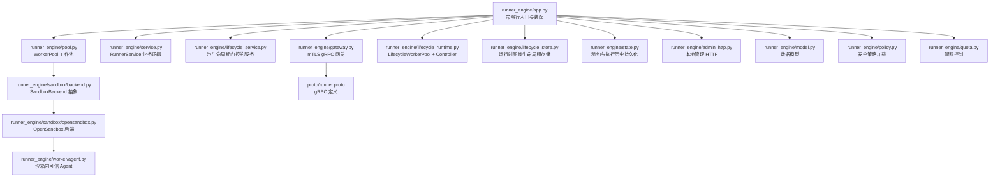

**图表来源**
- [runner_engine/app.py:26-227](file://runner_engine/app.py#L26-L227)
- [runner_engine/gateway.py:44-194](file://runner_engine/gateway.py#L44-L194)
- [runner_engine/service.py:80-456](file://runner_engine/service.py#L80-L456)
- [runner_engine/lifecycle_service.py:7-71](file://runner_engine/lifecycle_service.py#L7-L71)
- [runner_engine/pool.py:11-188](file://runner_engine/pool.py#L11-L188)
- [runner_engine/lifecycle_runtime.py:14-397](file://runner_engine/lifecycle_runtime.py#L14-L397)
- [runner_engine/lifecycle_store.py:35-151](file://runner_engine/lifecycle_store.py#L35-L151)
- [runner_engine/state.py:131-685](file://runner_engine/state.py#L131-L685)
- [runner_engine/admin_http.py:14-190](file://runner_engine/admin_http.py#L14-L190)
- [runner_engine/sandbox/backend.py:14-49](file://runner_engine/sandbox/backend.py#L14-L49)
- [runner_engine/sandbox/opensandbox.py:31-440](file://runner_engine/sandbox/opensandbox.py#L31-L440)
- [runner_engine/worker/agent.py:309-797](file://runner_engine/worker/agent.py#L309-L797)
- [runner_engine/model.py:7-98](file://runner_engine/model.py#L7-L98)
- [runner_engine/policy.py:9-25](file://runner_engine/policy.py#L9-L25)
- [runner_engine/quota.py:9-61](file://runner_engine/quota.py#L9-L61)
- [proto/runner.proto:8-75](file://proto/runner.proto#L8-L75)

**章节来源**
- [runner_engine/app.py:26-227](file://runner_engine/app.py#L26-L227)

## 核心组件
- 入口与装配：解析参数、加载策略、初始化持久化、工作池、服务与管理接口，并启动 gRPC 服务器。
- gRPC 网关：基于 mTLS 的认证与授权，将请求映射到 RunnerService。
- RunnerService：租约管理、调用编排、幂等缓存、活跃调用跟踪、后台清理。
- LifecycleRunnerService：在租约获取、续租、调用前检查运行时是否处于 RETIRING/RETIRED。
- WorkerPool：按租户+运行时+安全策略键复用空闲沙箱，控制创建并发与存活上限。
- LifecycleWorkerPool：扩展 Pool，增加运行时退役门控与快照能力。
- OpenSandboxBackend：与 OpenSandbox 集群交互，创建/续期/安装/运行/取消/销毁沙箱。
- Worker Agent：沙箱内可信代理，校验并执行用户算子，限制输出、日志、协议帧大小，支持取消。
- 状态持久化：PostgreSQL 存储租约、执行历史、幂等键；生命周期表记录运行时退役状态。
- 策略与配额：安全策略决定 CPU/内存/网络/超时/复用；配额限制全局与租户级沙箱数量。

**章节来源**
- [runner_engine/app.py:26-227](file://runner_engine/app.py#L26-L227)
- [runner_engine/gateway.py:44-194](file://runner_engine/gateway.py#L44-L194)
- [runner_engine/service.py:80-456](file://runner_engine/service.py#L80-L456)
- [runner_engine/lifecycle_service.py:7-71](file://runner_engine/lifecycle_service.py#L7-L71)
- [runner_engine/pool.py:11-188](file://runner_engine/pool.py#L11-L188)
- [runner_engine/lifecycle_runtime.py:14-397](file://runner_engine/lifecycle_runtime.py#L14-L397)
- [runner_engine/sandbox/opensandbox.py:31-440](file://runner_engine/sandbox/opensandbox.py#L31-L440)
- [runner_engine/worker/agent.py:309-797](file://runner_engine/worker/agent.py#L309-L797)
- [runner_engine/state.py:131-685](file://runner_engine/state.py#L131-L685)
- [runner_engine/policy.py:9-25](file://runner_engine/policy.py#L9-L25)
- [runner_engine/quota.py:9-61](file://runner_engine/quota.py#L9-L61)

## 架构总览
Runner Engine 对外暴露 gRPC 接口，内部由 Service 编排调用，通过 Pool 选择或创建 Worker（沙箱），再由 Backend 与 OpenSandbox 通信，最终在沙箱内由 Agent 执行用户算子。所有执行状态与幂等键持久化到 PostgreSQL，生命周期状态独立存储用于退役治理。

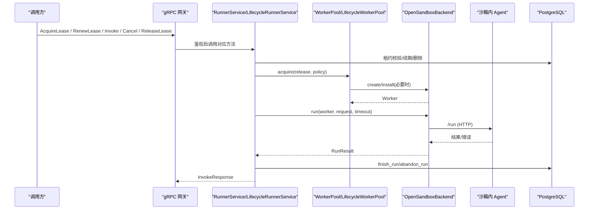

**图表来源**
- [runner_engine/gateway.py:98-177](file://runner_engine/gateway.py#L98-L177)
- [runner_engine/service.py:188-405](file://runner_engine/service.py#L188-L405)
- [runner_engine/pool.py:73-130](file://runner_engine/pool.py#L73-L130)
- [runner_engine/sandbox/opensandbox.py:339-376](file://runner_engine/sandbox/opensandbox.py#L339-L376)
- [runner_engine/worker/agent.py:467-797](file://runner_engine/worker/agent.py#L467-L797)
- [runner_engine/state.py:411-607](file://runner_engine/state.py#L411-L607)

## 详细组件分析

### 入口与装配
- 解析命令行与环境变量，校验必填项。
- 加载集群配置与安全策略。
- 初始化 RuntimeLifecycleStore、LifecycleOpenSandboxBackend、Quota、LifecycleWorkerPool、LifecycleRunnerService。
- 启动后台清理线程，可选启动本地管理 HTTP。
- 启动 mTLS gRPC 服务并等待终止。

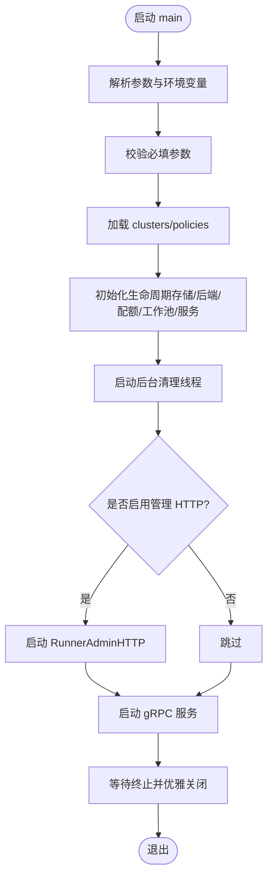

**图表来源**
- [runner_engine/app.py:26-227](file://runner_engine/app.py#L26-L227)

**章节来源**
- [runner_engine/app.py:26-227](file://runner_engine/app.py#L26-L227)

### gRPC 网关与访问控制
- 强制使用 mTLS，从上下文提取客户端身份。
- AccessControl 根据身份允许 tenant/project 访问。
- 将 RunnerError 映射为合适的 gRPC 状态码。
- 实现 Health/AcquireLease/RenewLease/Invoke/Cancel/ReleaseLease。

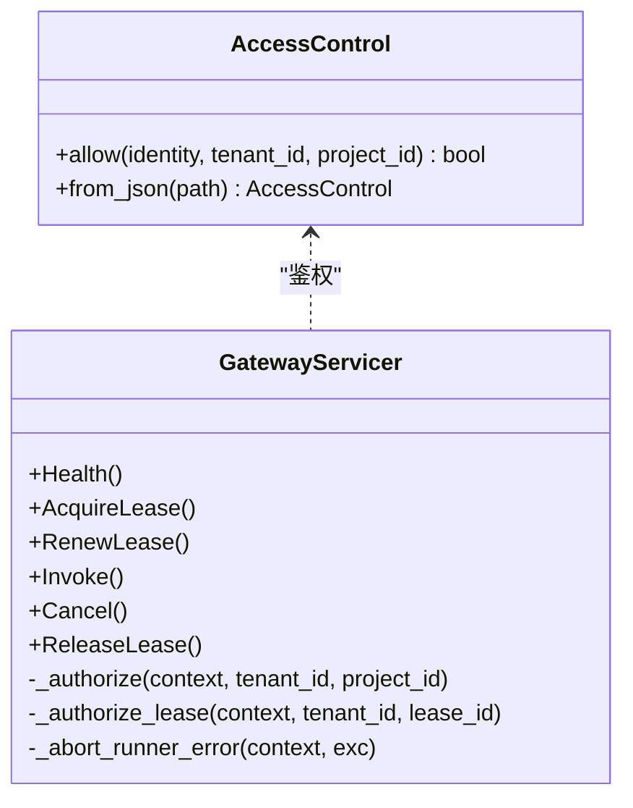

**图表来源**
- [runner_engine/gateway.py:12-96](file://runner_engine/gateway.py#L12-L96)
- [runner_engine/gateway.py:98-177](file://runner_engine/gateway.py#L98-L177)

**章节来源**
- [runner_engine/gateway.py:12-194](file://runner_engine/gateway.py#L12-L194)
- [proto/runner.proto:8-75](file://proto/runner.proto#L8-L75)

### 业务服务与幂等执行
- 租约：创建、查询、续期、释放，均校验租户与过期时间。
- 调用：
  - 校验内容大小、幂等键、属性白名单与大小、参数大小。
  - 计算请求指纹，写入幂等键表，命中则直接返回缓存结果。
  - 分配 Worker，注册活跃调用，调用后端 run，过滤输出属性与大小。
  - 根据结果决定是否重用 Worker 或失效。
  - 失败路径标记 abandon_run，并抛出 RunnerError。
- 后台清理：定期回收闲置 Worker、清理过期租约与幂等键、清理旧执行历史。

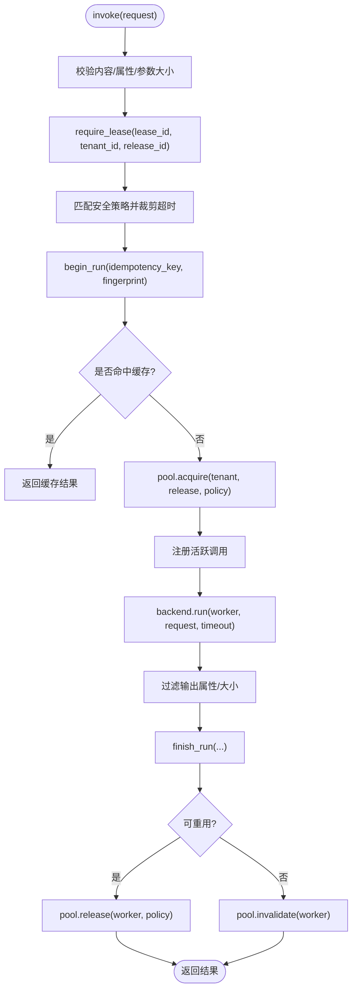

**图表来源**
- [runner_engine/service.py:188-405](file://runner_engine/service.py#L188-L405)
- [runner_engine/state.py:411-607](file://runner_engine/state.py#L411-L607)

**章节来源**
- [runner_engine/service.py:80-456](file://runner_engine/service.py#L80-L456)
- [runner_engine/state.py:131-685](file://runner_engine/state.py#L131-L685)

### 生命周期门控与退役治理
- LifecycleRunnerService 在 acquire/renew/invoke 前检查运行时是否处于 RETIRING/RETIRED。
- LifecycleWorkerPool 阻止对退役中的运行时新建 Worker，并提供 retire_runtime/retire_idle_worker 与 snapshot。
- RunnerLifecycleController 提供运行时图像状态、开始退役、取消退役、最终化退役、观察活跃调用与空闲 Worker。
- RuntimeLifecycleStore 维护 runner.runtime_image_lifecycle 表，支持 begin/cancel/finalize/list_recent。

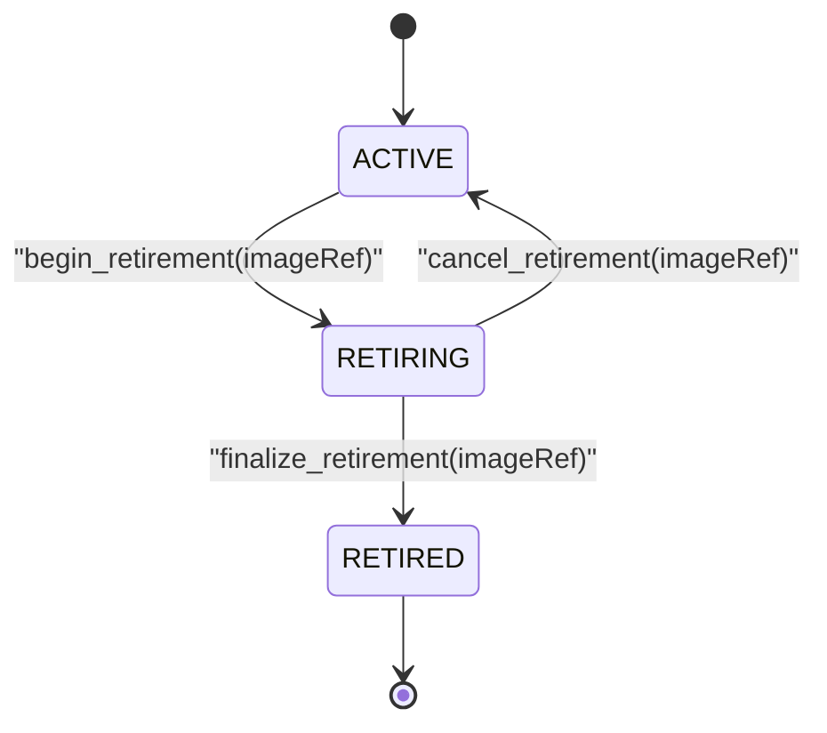

**图表来源**
- [runner_engine/lifecycle_service.py:19-71](file://runner_engine/lifecycle_service.py#L19-L71)
- [runner_engine/lifecycle_runtime.py:83-121](file://runner_engine/lifecycle_runtime.py#L83-L121)
- [runner_engine/lifecycle_runtime.py:187-397](file://runner_engine/lifecycle_runtime.py#L187-L397)
- [runner_engine/lifecycle_store.py:82-151](file://runner_engine/lifecycle_store.py#L82-L151)

**章节来源**
- [runner_engine/lifecycle_service.py:7-71](file://runner_engine/lifecycle_service.py#L7-L71)
- [runner_engine/lifecycle_runtime.py:14-397](file://runner_engine/lifecycle_runtime.py#L14-L397)
- [runner_engine/lifecycle_store.py:35-151](file://runner_engine/lifecycle_store.py#L35-L151)

### 工作池与沙箱后端
- WorkerPool：
  - 按 (tenant_id, runtime.id, profile) 键复用空闲 Worker。
  - 控制 idle 过期、orphan TTL、renew_before、max_installed_releases。
  - reserve_live/release_live 配合 Quota 控制全局与租户级上限。
  - reset_after_restart 销毁遗留 Worker，避免内存池不可恢复。
- OpenSandboxBackend：
  - create：向 OpenSandbox 提交镜像、资源限制、环境变量、entrypoint，轮询就绪并验证 Agent health。
  - renew：延长沙箱过期时间。
  - install：将算子制品注入 Worker。
  - run：调用 Worker /run，封装 RunResult。
  - cancel：调用 Worker /cancel。
  - destroy/cleanup_managed：删除托管沙箱。

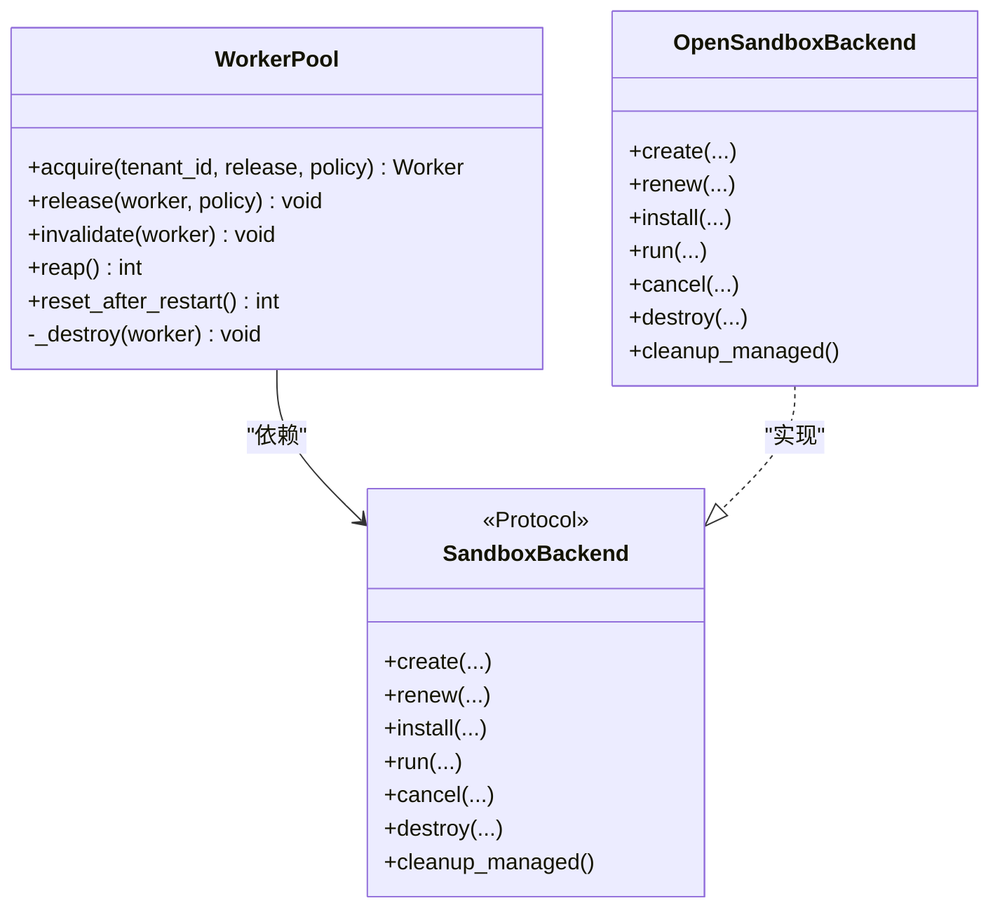

**图表来源**
- [runner_engine/pool.py:11-188](file://runner_engine/pool.py#L11-L188)
- [runner_engine/sandbox/backend.py:14-49](file://runner_engine/sandbox/backend.py#L14-L49)
- [runner_engine/sandbox/opensandbox.py:31-440](file://runner_engine/sandbox/opensandbox.py#L31-L440)

**章节来源**
- [runner_engine/pool.py:11-188](file://runner_engine/pool.py#L11-L188)
- [runner_engine/sandbox/backend.py:14-49](file://runner_engine/sandbox/backend.py#L14-L49)
- [runner_engine/sandbox/opensandbox.py:31-440](file://runner_engine/sandbox/opensandbox.py#L31-L440)

### 沙箱内 Agent 与算子执行
- AgentState：
  - bootstrap：接收算子制品并安装，校验 manifest id。
  - health：健康检查，报告 busy 状态。
  - run：串行执行一个用户算子，准备 scratch/workspace，设置环境变量与资源限制，启动 child.py，限制 stdout/stderr 与协议帧大小，支持超时与取消。
  - cancel：针对 invocation_id 触发取消。
- 安全边界：
  - 单沙箱只运行一个用户进程。
  - 严格校验 child 协议版本、类型、invocation_id、输出大小、属性数量与字节数。
  - 超限时杀死进程组并清理用户进程。

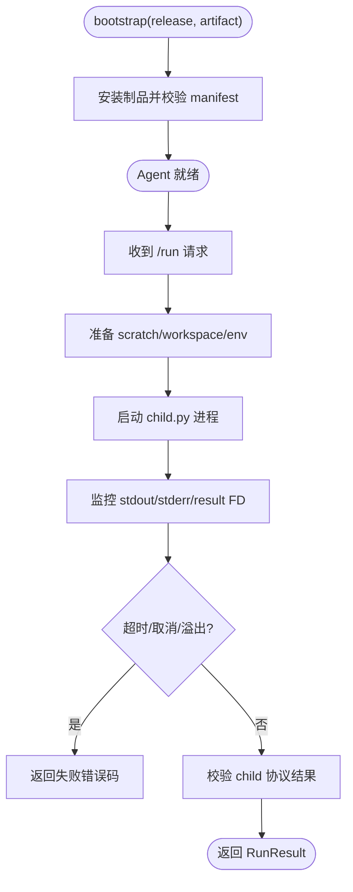

**图表来源**
- [runner_engine/worker/agent.py:353-377](file://runner_engine/worker/agent.py#L353-L377)
- [runner_engine/worker/agent.py:467-797](file://runner_engine/worker/agent.py#L467-L797)

**章节来源**
- [runner_engine/worker/agent.py:309-797](file://runner_engine/worker/agent.py#L309-L797)

### 状态持久化与幂等性
- 租约表 runner.leases：记录租户、项目、处理器、release、过期时间。
- 执行历史 runner.runs：记录 run_id、状态、结果、耗时、worker_id 等。
- 幂等键 runner.idempotency_keys：以 (tenant_id, release_id, idempotency_key) 为主键，缓存非重试型成功结果，支持重放计数与过期清理。
- 生命周期表 runner.runtime_image_lifecycle：记录运行时图像的退役状态与原因。

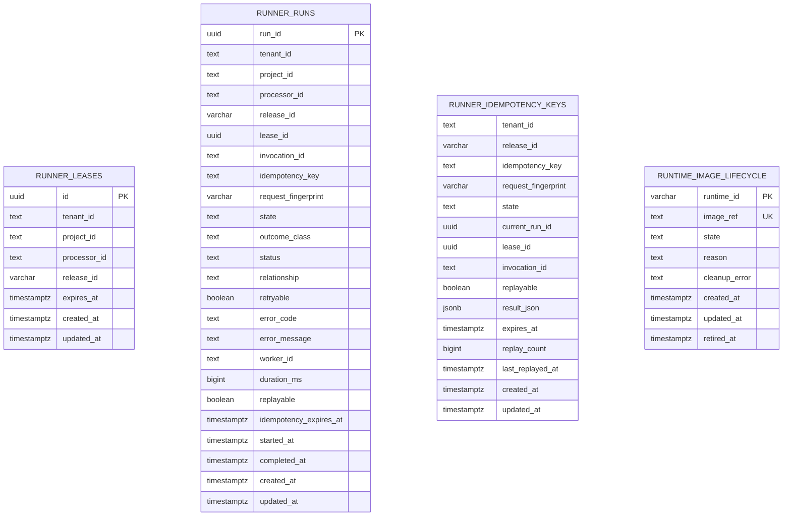

**图表来源**
- [runner_engine/state.py:16-82](file://runner_engine/state.py#L16-L82)
- [runner_engine/lifecycle_store.py:10-28](file://runner_engine/lifecycle_store.py#L10-L28)

**章节来源**
- [runner_engine/state.py:131-685](file://runner_engine/state.py#L131-L685)
- [runner_engine/lifecycle_store.py:35-151](file://runner_engine/lifecycle_store.py#L35-L151)

### 管理员 HTTP 接口
- 仅本地监听，需 Bearer Token 鉴权。
- 提供健康检查、运行时快照、运行时图像状态、开始/取消/最终化退役、回收空闲 Worker。

**章节来源**
- [runner_engine/admin_http.py:14-190](file://runner_engine/admin_http.py#L14-L190)

## 依赖关系分析
- RunnerEngine 装配层依赖：Catalog、Policy、Quota、LifecycleStore、OpenSandboxBackend、RunnerDB、LifecycleRunnerService、Gateway、AdminHTTP。
- Service 依赖：Catalog、RunnerDB、WorkerPool、SecurityPolicies。
- Pool 依赖：SandboxBackend、Quota。
- Backend 依赖：OpenSandbox HTTP API 与 Worker HTTP API。
- Agent 依赖：ReleaseMaterializer、child.py 协议。

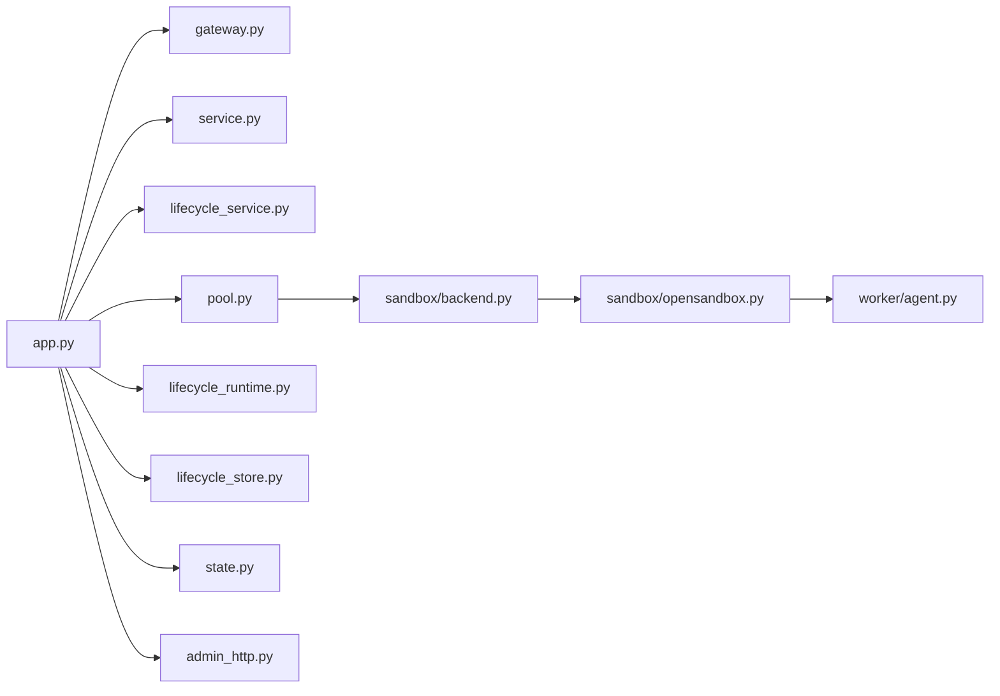

**图表来源**
- [runner_engine/app.py:9-21](file://runner_engine/app.py#L9-L21)
- [runner_engine/service.py:8-12](file://runner_engine/service.py#L8-L12)
- [runner_engine/pool.py:6-8](file://runner_engine/pool.py#L6-L8)
- [runner_engine/sandbox/opensandbox.py:16-18](file://runner_engine/sandbox/opensandbox.py#L16-L18)
- [runner_engine/worker/agent.py:23](file://runner_engine/worker/agent.py#L23)

**章节来源**
- [runner_engine/app.py:9-21](file://runner_engine/app.py#L9-L21)
- [runner_engine/service.py:8-12](file://runner_engine/service.py#L8-L12)
- [runner_engine/pool.py:6-8](file://runner_engine/pool.py#L6-L8)
- [runner_engine/sandbox/opensandbox.py:16-18](file://runner_engine/sandbox/opensandbox.py#L16-L18)
- [runner_engine/worker/agent.py:23](file://runner_engine/worker/agent.py#L23)

## 性能与容量规划
- gRPC 消息长度限制：最大接收/发送 10 MiB。
- 算子输入/输出限制：inline content 与 output 上限 8 MiB；attributes 数量上限 128，字节上限 64 KiB。
- 工作池：
  - idle_seconds：空闲回收阈值。
  - orphan_ttl_seconds：孤儿沙箱 TTL，必须大于 idle_seconds。
  - renew_before_seconds：提前续期阈值，至少大于执行头预留时间。
  - max_installed_releases：单 Worker 已安装算子上限。
- 配额：
  - max_creating：同时创建沙箱上限。
  - max_live：全局活跃沙箱上限。
  - max_live_per_tenant：租户级活跃沙箱上限。
- 后台清理：reaper 周期默认 30 秒，清理闲置 Worker、过期租约、过期幂等键、旧执行历史。
- 数据库连接池：RunnerDB 默认最小 1、最大 16；LifecycleStore 最小 1、最大 4。

优化建议：
- 合理设置 max_timeout_ms 与 policy.reuse_sandbox，提升复用率。
- 调整 idle_seconds 与 orphan_ttl_seconds，平衡冷启动成本与资源占用。
- 根据负载调优 Quota 与 gRPC 线程池 max_workers。
- 使用幂等键减少重复执行，降低后端压力。

**章节来源**
- [runner_engine/gateway.py:184-194](file://runner_engine/gateway.py#L184-L194)
- [runner_engine/service.py:15-20](file://runner_engine/service.py#L15-L20)
- [runner_engine/pool.py:19-43](file://runner_engine/pool.py#L19-L43)
- [runner_engine/quota.py:12-27](file://runner_engine/quota.py#L12-L27)
- [runner_engine/app.py:160-168](file://runner_engine/app.py#L160-L168)
- [runner_engine/state.py:138-149](file://runner_engine/state.py#L138-L149)
- [runner_engine/lifecycle_store.py:40-46](file://runner_engine/lifecycle_store.py#L40-L46)

## API 端点与服务接口

### gRPC 接口 ManagedPythonRunner
- Health：健康检查，返回 ok 与版本。
- AcquireLease：创建租约，返回 lease_id 与过期时间。
- RenewLease：续租，返回新过期时间。
- Invoke：执行算子，返回状态、关系、内容、属性、重试标志、错误信息、worker_id、耗时。
- Cancel：取消正在执行的调用。
- ReleaseLease：释放租约。

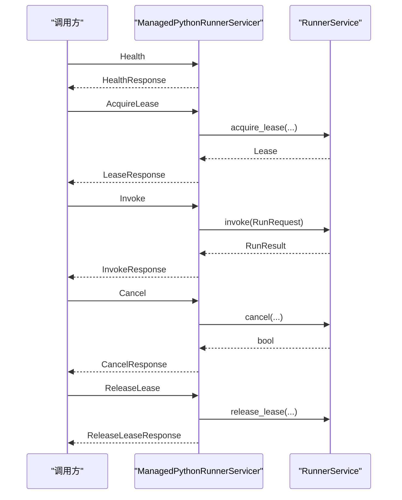

**图表来源**
- [runner_engine/gateway.py:98-177](file://runner_engine/gateway.py#L98-L177)
- [runner_engine/service.py:146-456](file://runner_engine/service.py#L146-L456)
- [proto/runner.proto:8-75](file://proto/runner.proto#L8-L75)

**章节来源**
- [proto/runner.proto:8-75](file://proto/runner.proto#L8-L75)
- [runner_engine/gateway.py:98-177](file://runner_engine/gateway.py#L98-L177)

### 管理员 HTTP 接口
- GET /health：返回 {"ok": true, "service": "runner-admin"}。
- GET /v1/observe/runtime：返回运行时快照，包括活跃调用、空闲 Worker、按运行时统计的 acquiring 计数。
- GET /v1/admin/runtime-images/status?imageRef=...：返回运行时图像状态、关联 releases、未过期租约数、活跃调用、空闲 Worker、managed sandboxes、是否安全删除制品。
- POST /v1/admin/runtime-images/retire：开始退役，需提供 imageRef 与 reason。
- POST /v1/admin/runtime-images/cancel-retirement：取消退役。
- POST /v1/admin/runtime-images/finalize-retirement：最终化退役，要求无活跃调用、空闲 Worker、acquiring 与 managed sandboxes。
- POST /v1/admin/sandboxes/retire-idle：回收指定空闲 Worker。

鉴权：Authorization: Bearer <token>。

**章节来源**
- [runner_engine/admin_http.py:73-169](file://runner_engine/admin_http.py#L73-L169)

## 错误处理与幂等性
- RunnerError 分类：
  - UNAUTHENTICATED：mTLS 身份缺失。
  - FORBIDDEN/CANCEL_FORBIDDEN：权限不足。
  - RELEASE_NOT_FOUND/LEASE_UNKNOWN：资源不存在。
  - 其他业务错误：FAILED_PRECONDITION。
  - 可重试错误：UNAVAILABLE。
- 常见错误码：
  - INLINE_CONTENT_TOO_LARGE、OUTPUT_TOO_LARGE、ATTRIBUTES_TOO_LARGE、ATTRIBUTES_TOO_LARGE、TOO_MANY_ATTRIBUTES。
  - IDEMPOTENCY_REQUIRED、IDEMPOTENCY_CONFLICT、RUN_IN_PROGRESS、RUN_STATE_INVALID、RUNNER_INFRASTRUCTURE_ERROR。
  - QUOTA 相关：GLOBAL_SANDBOX_QUOTA、TENANT_SANDBOX_QUOTA。
  - 沙箱相关：UNKNOWN_SANDBOX_CLUSTER、OPENSANDBOX_HTTP、OPENSANDBOX_UNREACHABLE、SANDBOX_START_FAILED、SANDBOX_START_TIMEOUT、AGENT_START_TIMEOUT。
  - 算子相关：TIMEOUT、CANCELLED、CPU_LIMIT、USER_EXCEPTION、USER_IMPORT_ERROR、ENTRYPOINT_NOT_FOUND、INVALID_USER_RESULT、USER_PROCESS_EXITED、USER_PROCESS_SIGNALED、LOG_LIMIT、CHILD_PROTOCOL_ERROR、INVALID_CHILD_RESPONSE、OPERATOR_REPORTED_FAILURE。
- 幂等性：
  - 基于 (tenant_id, release_id, idempotency_key) 的主键。
  - 首次执行写入 RUNNING 状态与当前 run_id；完成后写 DONE 并缓存非重试结果。
  - 相同 key 且相同 request_fingerprint 的请求可直接返回缓存结果。
  - 若 key 被重用但 fingerprint 不同，拒绝冲突。
  - 后台清理过期幂等键与旧执行历史。

**章节来源**
- [runner_engine/gateway.py:67-79](file://runner_engine/gateway.py#L67-L79)
- [runner_engine/service.py:39-77](file://runner_engine/service.py#L39-L77)
- [runner_engine/service.py:188-405](file://runner_engine/service.py#L188-L405)
- [runner_engine/state.py:411-607](file://runner_engine/state.py#L411-L607)
- [runner_engine/quota.py:36-44](file://runner_engine/quota.py#L36-L44)
- [runner_engine/sandbox/opensandbox.py:91-110](file://runner_engine/sandbox/opensandbox.py#L91-L110)
- [runner_engine/worker/agent.py:222-297](file://runner_engine/worker/agent.py#L222-L297)

## 与构建服务、发布服务的集成
- 构建服务负责生成算子制品与运行时镜像，Runner Engine 通过 Catalog 引用 release_id 与 artifact_path。
- 发布服务将算子制品分发至后端存储，Runner Engine 在 Worker 启动时通过 OpenSandboxBackend.install 将制品注入沙箱。
- 与 NiFi 集成：proto 定义位于 nifi 模块，Java 侧通过 gRPC 调用 Runner Engine 执行算子。

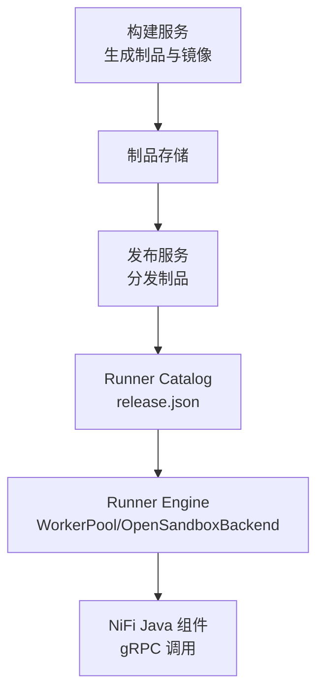

**图表来源**
- [proto/runner.proto:5](file://proto/runner.proto#L5)
- [runner_engine/sandbox/opensandbox.py:324-337](file://runner_engine/sandbox/opensandbox.py#L324-L337)

**章节来源**
- [proto/runner.proto:5](file://proto/runner.proto#L5)
- [runner_engine/sandbox/opensandbox.py:324-337](file://runner_engine/sandbox/opensandbox.py#L324-L337)

## 故障排查指南
- 无法启动：
  - 检查必填参数 db-url、owner-id、tls-cert、tls-key、client-ca。
  - 确认 ACL 与 policies 文件可读。
- gRPC 调用失败：
  - 检查 mTLS 证书链与 client CA。
  - 查看 RunnerError 映射的状态码与错误信息。
- 租约问题：
  - 确认租户与项目一致，租约未过期。
  - 检查 leases 表是否存在且未过期。
- 调用被拒绝：
  - 检查幂等键是否重复且 fingerprint 不一致。
  - 检查 attributes/parameters 是否超限。
- 沙箱创建失败：
  - 检查 OpenSandbox 集群可达性与 API Key。
  - 关注 SANDBOX_START_FAILED/TIMEOUT、AGENT_START_TIMEOUT。
- 算子执行异常：
  - 查看 TIMEOUT/CPU_LIMIT/USER_PROCESS_* 等错误码。
  - 检查日志溢出 LOG_LIMIT 与协议错误 CHILD_PROTOCOL_ERROR。
- 退役流程卡住：
  - 使用 /v1/admin/runtime-images/status 检查是否有活跃调用、空闲 Worker、acquiring 或 managed sandboxes。
  - 使用 /v1/admin/sandboxes/retire-idle 回收空闲 Worker。

**章节来源**
- [runner_engine/app.py:76-85](file://runner_engine/app.py#L76-L85)
- [runner_engine/gateway.py:67-96](file://runner_engine/gateway.py#L67-L96)
- [runner_engine/state.py:313-346](file://runner_engine/state.py#L313-L346)
- [runner_engine/service.py:188-405](file://runner_engine/service.py#L188-L405)
- [runner_engine/sandbox/opensandbox.py:192-302](file://runner_engine/sandbox/opensandbox.py#L192-L302)
- [runner_engine/worker/agent.py:696-778](file://runner_engine/worker/agent.py#L696-L778)
- [runner_engine/lifecycle_runtime.py:239-300](file://runner_engine/lifecycle_runtime.py#L239-L300)

## 最佳实践
- 生产环境强制启用 mTLS 与 ACL，避免明文模式。
- 合理配置策略：
  - 为不同算子设定合适的 CPU/内存/超时与网络白名单。
  - 开启 reuse_sandbox 以提升复用率。
- 容量规划：
  - 根据峰值 QPS 与沙箱冷启动时间调整 max_creating 与 max_live。
  - 按租户隔离配额，防止热点租户耗尽资源。
- 幂等设计：
  - 调用方务必生成稳定 idempotency_key，避免重复执行导致副作用。
  - 谨慎使用 retryable 错误码，避免无限重试风暴。
- 运维治理：
  - 定期巡检 /v1/observe/runtime 与 /v1/admin/runtime-images/status。
  - 使用退役流程逐步下线旧运行时，确保无活跃调用后再 finalize。
- 观测与诊断：
  - 保留 run 历史与错误码，结合 duration_ms 与 worker_id 定位瓶颈。
  - 关注后台清理日志，及时发现僵尸沙箱或泄漏。

[本节为通用指导，不直接分析具体文件]

## 结论
Runner Engine 通过严谨的租约机制、工作池复用、沙箱隔离与配额控制，提供了高可靠、可扩展的算子执行能力。其幂等执行、状态持久化与生命周期治理确保了在生产环境中对多租户、多项目的稳定支撑。配合 OpenSandbox 与 NiFi 生态，Runner Engine 成为算子编排与执行的关键基础设施。

[本节为总结性内容，不直接分析具体文件]