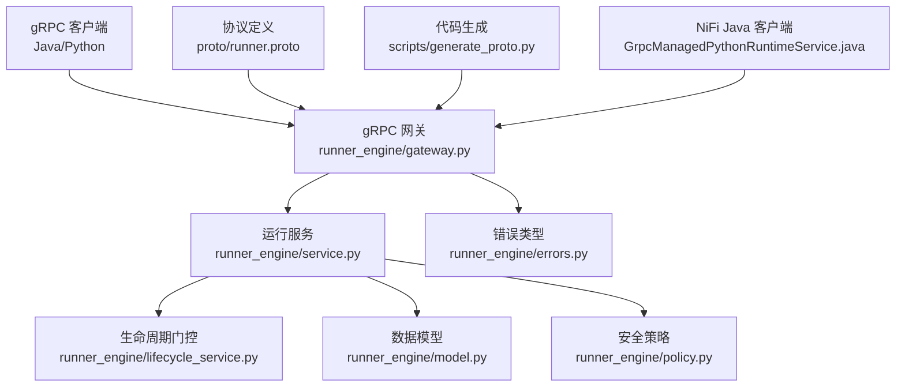
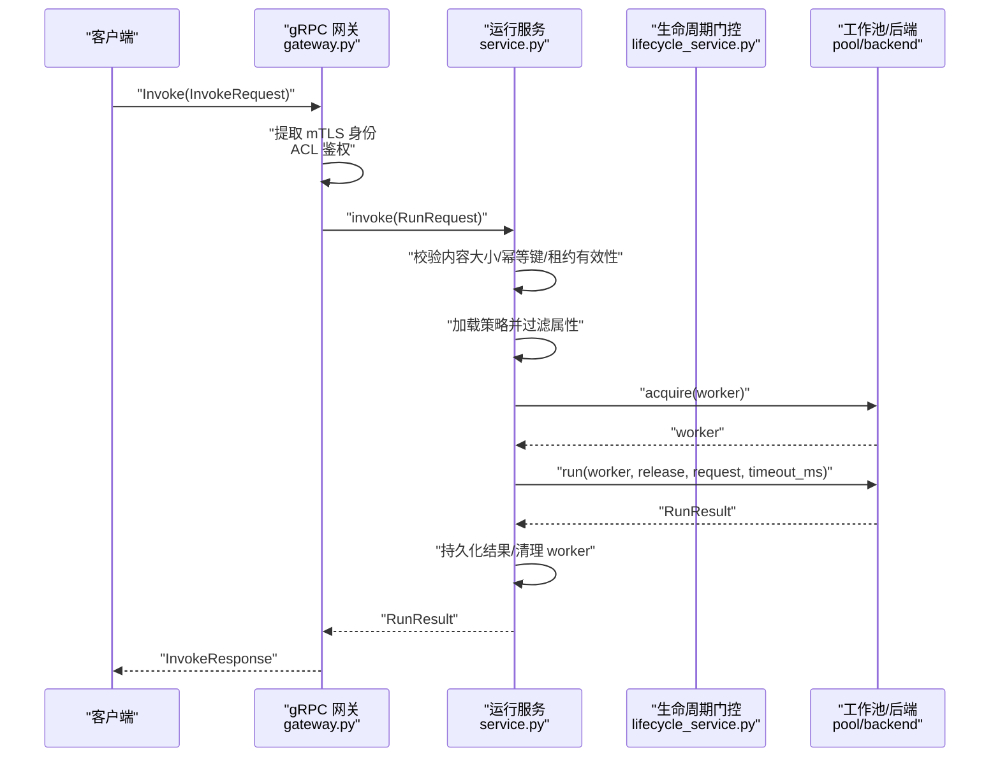
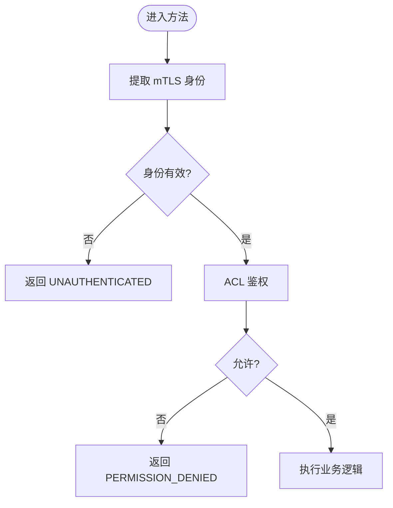
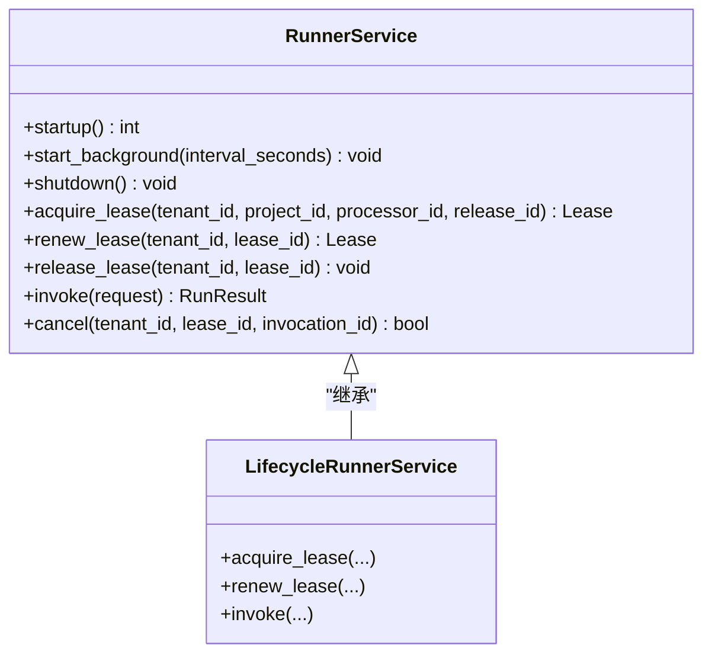
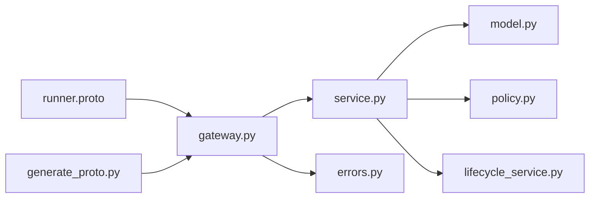

# gRPC 服务接口

<cite>
**本文引用的文件**   
- [runner.proto](file://proto/runner.proto)
- [gateway.py](file://runner_engine/gateway.py)
- [service.py](file://runner_engine/service.py)
- [lifecycle_service.py](file://runner_engine/lifecycle_service.py)
- [errors.py](file://runner_engine/errors.py)
- [model.py](file://runner_engine/model.py)
- [policy.py](file://runner_engine/policy.py)
- [generate_proto.py](file://scripts/generate_proto.py)
- [GrpcManagedPythonRuntimeService.java](file://nifi/managed-python-processors/src/main/java/com/dsc/nifi/GrpcManagedPythonRuntimeService.java)
- [test_service_security.py](file://tests/test_service_security.py)
</cite>

## 目录
1. [简介](#简介)
2. [项目结构](#项目结构)
3. [核心组件](#核心组件)
4. [架构总览](#架构总览)
5. [详细组件分析](#详细组件分析)
6. [依赖关系分析](#依赖关系分析)
7. [性能与容量规划](#性能与容量规划)
8. [故障排查指南](#故障排查指南)
9. [结论](#结论)
10. [附录](#附录)

## 简介
本文件为 Runner Engine 的 gRPC 服务接口文档，聚焦于 ManagedPythonRunner 服务的所有 RPC 方法、请求响应格式、错误码与状态码映射、认证授权机制（mTLS、客户端 CA 校验、访问控制列表）、服务启动配置、连接管理与负载均衡策略，以及与服务发现、监控指标和日志追踪的集成方式。同时提供 API 版本管理指南与兼容性注意事项，并给出客户端调用示例路径与最佳实践。

需要特别说明的是：当前仓库未定义 RunOperator、CreateRuntime、DestroyRuntime 等 gRPC 方法；现有接口围绕“租约生命周期 + 算子执行”展开，包括 Health、AcquireLease、RenewLease、Invoke、Cancel、ReleaseLease。

## 项目结构
Runner Engine 的 gRPC 服务由以下关键部分组成：
- 协议定义：proto/runner.proto
- gRPC 服务端实现与鉴权：runner_engine/gateway.py
- 业务编排与执行：runner_engine/service.py
- 运行时生命周期门控：runner_engine/lifecycle_service.py
- 数据模型与策略：runner_engine/model.py、runner_engine/policy.py
- 错误类型：runner_engine/errors.py
- 代码生成脚本：scripts/generate_proto.py
- Java 客户端示例（NiFi Processor）：nifi/.../GrpcManagedPythonRuntimeService.java

**图表来源** 
- [runner.proto:8-15](file://proto/runner.proto#L8-L15)
- [gateway.py:44-194](file://runner_engine/gateway.py#L44-L194)
- [service.py:80-115](file://runner_engine/service.py#L80-L115)
- [lifecycle_service.py:7-17](file://runner_engine/lifecycle_service.py#L7-L17)
- [model.py:7-98](file://runner_engine/model.py#L7-L98)
- [policy.py:9-24](file://runner_engine/policy.py#L9-L24)
- [errors.py:1-22](file://runner_engine/errors.py#L1-L22)
- [generate_proto.py:1-21](file://scripts/generate_proto.py#L1-L21)
- [GrpcManagedPythonRuntimeService.java:61-94](file://nifi/managed-python-processors/src/main/java/com/dsc/nifi/GrpcManagedPythonRuntimeService.java#L61-L94)

**章节来源**
- [runner.proto:1-76](file://proto/runner.proto#L1-L76)
- [gateway.py:1-195](file://runner_engine/gateway.py#L1-L195)
- [service.py:1-456](file://runner_engine/service.py#L1-L456)
- [lifecycle_service.py:1-71](file://runner_engine/lifecycle_service.py#L1-L71)
- [model.py:1-98](file://runner_engine/model.py#L1-L98)
- [policy.py:1-25](file://runner_engine/policy.py#L1-L25)
- [errors.py:1-22](file://runner_engine/errors.py#L1-L22)
- [generate_proto.py:1-21](file://scripts/generate_proto.py#L1-L21)
- [GrpcManagedPythonRuntimeService.java:61-94](file://nifi/managed-python-processors/src/main/java/com/dsc/nifi/GrpcManagedPythonRuntimeService.java#L61-L94)

## 核心组件
- gRPC 协议与消息：ManagedPythonRunner 服务定义了健康检查、租约获取/续期/释放、算子调用与取消等 RPC。
- 网关层：负责 mTLS 双向认证、身份提取、ACL 鉴权、RunnerError 到 gRPC StatusCode 的映射、线程池与消息大小限制。
- 运行服务：封装租约、幂等性、属性过滤、策略约束、工作池调度、执行结果持久化与清理。
- 生命周期门控：在 RETIRING/RETIRED 状态下拒绝新租约、续租与调用，避免对即将退役的运行环境提交任务。
- 数据模型与安全策略：描述运行时环境、算子发布、租约、请求/结果、Worker 与 ActiveRun，以及安全策略参数。
- 错误体系：统一 RunnerError 及其子类，携带 code、message 与 retryable 标志。

**章节来源**
- [runner.proto:8-76](file://proto/runner.proto#L8-L76)
- [gateway.py:12-194](file://runner_engine/gateway.py#L12-L194)
- [service.py:80-456](file://runner_engine/service.py#L80-L456)
- [lifecycle_service.py:7-71](file://runner_engine/lifecycle_service.py#L7-L71)
- [model.py:7-98](file://runner_engine/model.py#L7-L98)
- [errors.py:1-22](file://runner_engine/errors.py#L1-L22)

## 架构总览
下图展示一次 Invoke 调用的端到端流程，包括鉴权、租约校验、策略校验、工作池分配、执行与结果回传。

**图表来源** 
- [gateway.py:129-157](file://runner_engine/gateway.py#L129-L157)
- [service.py:188-362](file://runner_engine/service.py#L188-L362)
- [lifecycle_service.py:63-70](file://runner_engine/lifecycle_service.py#L63-L70)

## 详细组件分析

### gRPC 服务与方法定义
服务名：ManagedPythonRunner  
包名：dsc.runner.v33  

| 方法 | 请求 | 响应 | 说明 |
|---|---|---|---|
| Health | HealthRequest | HealthResponse | 健康检查，返回 ok 与版本信息 |
| AcquireLease | AcquireLeaseRequest | LeaseResponse | 申请执行租约，包含租户、项目、处理器与发布标识 |
| RenewLease | RenewLeaseRequest | LeaseResponse | 续期租约，延长过期时间 |
| Invoke | InvokeRequest | InvokeResponse | 执行算子，携带内容、属性、参数、超时与幂等键 |
| Cancel | CancelRequest | CancelResponse | 取消正在执行的调用 |
| ReleaseLease | ReleaseLeaseRequest | ReleaseLeaseResponse | 释放租约 |

字段要点：
- InvokeRequest.content 为二进制负载，attributes/parameters 为字符串键值对，timeout_ms 默认 30000。
- InvokeResponse.status 表示执行状态，relationship 为关系标签，retryable 指示是否可重试，error_code/error_message 用于错误诊断，worker_id/duration_ms 用于观测。

**章节来源**
- [runner.proto:8-76](file://proto/runner.proto#L8-L76)

### 认证与授权
- 传输安全：强制使用 mTLS 双向认证，服务端通过 ssl_server_credentials 加载服务器密钥/证书与客户端 CA，并要求客户端证书。
- 身份提取：从 gRPC auth_context 中读取 x509_subject_alternative_name 或 x509_common_name，作为 identity。
- 访问控制：AccessControl 基于 identities 配置，将 identity 映射到 tenant_id -> project_id 列表，支持通配符 "*"。
- 鉴权点：
  - Health：仅验证身份存在。
  - AcquireLease：校验 identity 对 tenant/project 的访问权限。
  - RenewLease/Invoke/Cancel/ReleaseLease：先通过 lease_id 反查项目，再校验 identity 对该项目的访问权限。

**图表来源** 
- [gateway.py:33-41](file://runner_engine/gateway.py#L33-L41)
- [gateway.py:81-96](file://runner_engine/gateway.py#L81-L96)

**章节来源**
- [gateway.py:12-41](file://runner_engine/gateway.py#L12-L41)
- [gateway.py:81-96](file://runner_engine/gateway.py#L81-L96)

### 错误码与 gRPC 状态码映射
RunnerError.code 到 grpc.StatusCode 的映射规则：
- UNAUTHENTICATED → UNAUTHENTICATED
- 以 FORBIDDEN 结尾或 CANCEL_FORBIDDEN → PERMISSION_DENIED
- RELEASE_NOT_FOUND、LEASE_UNKNOWN → NOT_FOUND
- retryable=True → UNAVAILABLE
- 其他 → FAILED_PRECONDITION

常见业务错误码（部分）：
- UNKNOWN_SECURITY_POLICY：未知安全策略
- INLINE_CONTENT_TOO_LARGE：输入内容过大（>8 MiB）
- IDEMPOTENCY_REQUIRED：缺少幂等键
- INVOCATION_ID_IN_USE：并发重复 invocation_id
- RUN_STATE_INVALID：新建执行未获得 run id
- OUTPUT_TOO_LARGE：输出内容过大（>8 MiB）
- CANCEL_FORBIDDEN：跨租约取消被拒绝
- CANCEL_FAILED：取消失败（可重试）

**章节来源**
- [gateway.py:67-79](file://runner_engine/gateway.py#L67-L79)
- [service.py:188-405](file://runner_engine/service.py#L188-L405)
- [errors.py:1-22](file://runner_engine/errors.py#L1-L22)

### 运行服务与生命周期门控
- RunnerService：
  - 启动时清理残留运行、过期租约与幂等记录。
  - 后台守护线程定期回收 worker、清理过期数据与旧运行记录。
  - invoke 流程包含内容大小校验、幂等键校验、租约与策略校验、属性白名单过滤、工作池分配、执行与结果持久化、worker 复用或失效。
- LifecycleRunnerService：
  - 在 acquire_lease/renew_lease/invoke 前检查运行时状态，若处于 RETIRING/RETIRED 则拒绝新执行，RETIRING 标记为可重试。

**图表来源** 
- [service.py:80-456](file://runner_engine/service.py#L80-L456)
- [lifecycle_service.py:7-71](file://runner_engine/lifecycle_service.py#L7-L71)

**章节来源**
- [service.py:105-144](file://runner_engine/service.py#L105-L144)
- [service.py:146-456](file://runner_engine/service.py#L146-L456)
- [lifecycle_service.py:19-70](file://runner_engine/lifecycle_service.py#L19-L70)

### 数据模型与安全策略
- RuntimeEnv/OperatorRelease：描述运行时环境与算子发布元数据，含 profile、input/output_attributes。
- SecurityPolicy：定义 sandbox_cluster、cpu/memory、max_timeout_ms、network_allow、reuse_sandbox。
- Lease/RunRequest/RunResult/Worker/ActiveRun：贯穿租约、请求、结果与工作进程的生命周期。

**章节来源**
- [model.py:7-98](file://runner_engine/model.py#L7-L98)
- [policy.py:9-24](file://runner_engine/policy.py#L9-L24)

### 客户端调用示例与异步处理
- Java 客户端（NiFi Processor）：
  - 使用 NettyChannelBuilder 构建带 mTLS 的通道，设置 trustManager/keyManager，最大入站消息大小为 10 MiB。
  - 通过 ManagedPythonRunnerGrpc.newBlockingStub 创建阻塞式 stub，适合同步调用场景。
- Python 客户端建议：
  - 使用 grpc.aio 进行异步调用，结合重试库（如 tenacity）实现指数退避与重试上限。
  - 根据 InvokeResponse.retryable 与 gRPC StatusCode.UNAVAILABLE 决定是否重试。
  - 为每次调用生成唯一 invocation_id 与幂等键 idempotency_key，避免重复执行。

参考路径：
- [GrpcManagedPythonRuntimeService.java:61-94](file://nifi/managed-python-processors/src/main/java/com/dsc/nifi/GrpcManagedPythonRuntimeService.java#L61-L94)

**章节来源**
- [GrpcManagedPythonRuntimeService.java:61-94](file://nifi/managed-python-processors/src/main/java/com/dsc/nifi/GrpcManagedPythonRuntimeService.java#L61-L94)

### 服务启动配置、连接管理与负载均衡
- 服务端启动：
  - 使用 grpc.server 与 ThreadPoolExecutor(max_workers) 控制并发。
  - 设置 max_receive_message_length/max_send_message_length 为 10 MiB。
  - 通过 add_secure_port 绑定地址与 mTLS 凭据。
- 连接管理：
  - 客户端应复用 ManagedChannel，避免频繁握手开销。
  - 合理设置 keepalive、backoff 与重试策略。
- 负载均衡：
  - 可在前端使用反向代理或服务网格（如 Envoy、Istio）进行多实例负载均衡。
  - 保持会话亲和性非必需，因调用无状态且依赖租约。

**章节来源**
- [gateway.py:179-194](file://runner_engine/gateway.py#L179-L194)

### 与服务发现、监控指标与日志追踪的集成
- 服务发现：
  - 可通过 DNS SRV 或 K8s Service/Endpoint 暴露多个 Runner 实例，配合负载均衡器分发流量。
- 监控指标：
  - 建议在 RunnerService.start_background 中增加指标采集（如运行数、租约数、错误率、延迟分位）。
  - 对外暴露 HTTP 指标端点（例如 Prometheus），与现有 observe 模块风格保持一致。
- 日志追踪：
  - 在 gateway 层注入 trace_id，贯穿 service 与 pool/backend，便于链路追踪。
  - 对关键步骤（租约创建、执行开始/结束、worker 回收）输出结构化日志。

[本节为概念性指导，不直接分析具体文件]

### API 版本管理与兼容性
- 协议版本：proto 包名为 dsc.runner.v33，HealthResponse.version 返回 "3.3.0"。
- 兼容性建议：
  - 新增字段时使用向后兼容的编号，避免破坏现有客户端。
  - 废弃字段保留但标记 deprecated，逐步迁移。
  - 重大变更升级包名（如 v34），并提供双栈兼容期。
- 客户端适配：
  - 客户端应检查 HealthResponse.version 并做能力协商。
  - 对不可用状态（UNAVAILABLE）实施重试与降级策略。

**章节来源**
- [runner.proto:3-21](file://proto/runner.proto#L3-L21)
- [gateway.py:98-100](file://runner_engine/gateway.py#L98-L100)

## 依赖关系分析
RunnerEngine 内部依赖关系如下：

**图表来源** 
- [gateway.py:1-195](file://runner_engine/gateway.py#L1-L195)
- [service.py:1-456](file://runner_engine/service.py#L1-L456)
- [lifecycle_service.py:1-71](file://runner_engine/lifecycle_service.py#L1-L71)
- [model.py:1-98](file://runner_engine/model.py#L1-L98)
- [policy.py:1-25](file://runner_engine/policy.py#L1-L25)
- [errors.py:1-22](file://runner_engine/errors.py#L1-L22)
- [runner.proto:1-76](file://proto/runner.proto#L1-L76)
- [generate_proto.py:1-21](file://scripts/generate_proto.py#L1-L21)

**章节来源**
- [gateway.py:1-195](file://runner_engine/gateway.py#L1-L195)
- [service.py:1-456](file://runner_engine/service.py#L1-L456)
- [lifecycle_service.py:1-71](file://runner_engine/lifecycle_service.py#L1-L71)
- [model.py:1-98](file://runner_engine/model.py#L1-L98)
- [policy.py:1-25](file://runner_engine/policy.py#L1-L25)
- [errors.py:1-22](file://runner_engine/errors.py#L1-L22)
- [runner.proto:1-76](file://proto/runner.proto#L1-L76)
- [generate_proto.py:1-21](file://scripts/generate_proto.py#L1-L21)

## 性能与容量规划
- 并发与线程池：
  - 服务端 max_workers 决定并发处理能力，需根据 CPU 核数与 I/O 特性调整。
- 消息大小：
  - 请求与响应均限制为 10 MiB，业务侧应避免超大负载，必要时采用外部存储+引用。
- 属性与内容限制：
  - 属性数量上限 128，属性字节总量上限 64 KiB；内容上限 8 MiB。
- 幂等性与缓存：
  - 通过 idempotency_key 去重，减少重复执行成本。
- 资源回收：
  - 后台守护线程定期清理过期租约、幂等记录与旧运行，降低存储膨胀。

[本节为通用性能指导，不直接分析具体文件]

## 故障排查指南
- 认证失败：
  - 检查 mTLS 证书链与 CA 配置是否正确，确认客户端证书受信任。
  - 查看身份提取是否成功（x509_subject_alternative_name/x509_common_name）。
- 权限不足：
  - 核对 AccessControl 配置，确保 identity 对目标 tenant/project 有访问权限。
- 租约相关错误：
  - LEASE_UNKNOWN/RELEASE_NOT_FOUND 通常表示租约不存在或已过期，检查租约生命周期与续期逻辑。
- 执行失败：
  - 关注 InvokeResponse.error_code 与 error_message，结合 Worker 日志定位问题。
  - 对于 CANCEL_FORBIDDEN，确认调用方拥有对应租约与 invocation_id 的权限。
- 测试用例参考：
  - 属性过滤与跨租约取消拒绝行为已在单元测试中覆盖。

**章节来源**
- [gateway.py:33-41](file://runner_engine/gateway.py#L33-L41)
- [gateway.py:81-96](file://runner_engine/gateway.py#L81-L96)
- [service.py:411-456](file://runner_engine/service.py#L411-L456)
- [test_service_security.py:65-112](file://tests/test_service_security.py#L65-L112)

## 结论
Runner Engine 的 gRPC 服务以租约为核心，结合 mTLS 与 ACL 实现强安全的执行入口，并通过 RunnerService 提供幂等、策略约束与资源回收能力。LifecycleRunnerService 进一步保障运行时退役期的稳定性。建议在生产环境中完善服务发现、指标与追踪集成，并遵循版本管理最佳实践，确保长期兼容与可维护性。

[本节为总结性内容，不直接分析具体文件]

## 附录
- 代码生成：
  - 使用 scripts/generate_proto.py 生成 runner_pb2 与 runner_pb2_grpc 到 runner_engine/generated。
- 参考客户端：
  - NiFi Java 客户端展示了 mTLS 通道与阻塞 stub 的使用方式。

**章节来源**
- [generate_proto.py:1-21](file://scripts/generate_proto.py#L1-L21)
- [GrpcManagedPythonRuntimeService.java:61-94](file://nifi/managed-python-processors/src/main/java/com/dsc/nifi/GrpcManagedPythonRuntimeService.java#L61-L94)