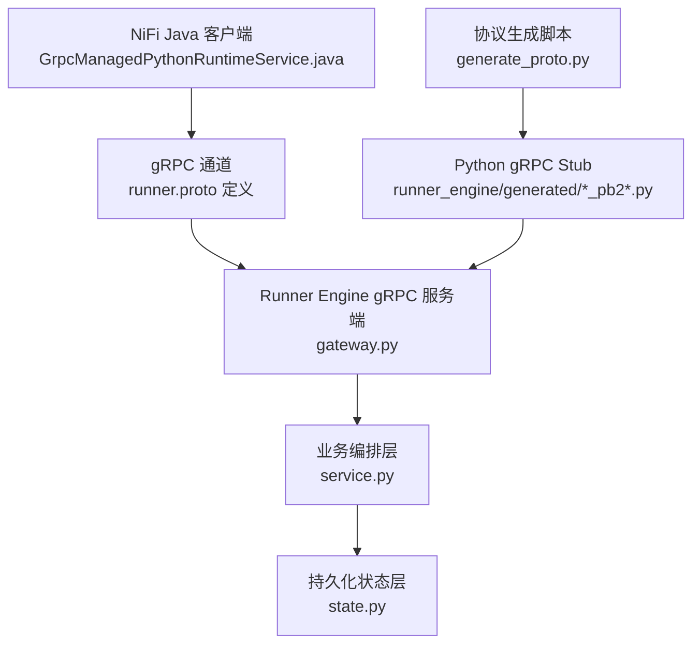
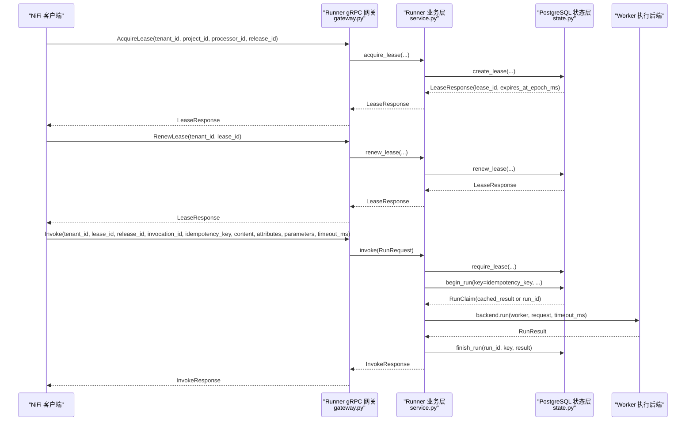
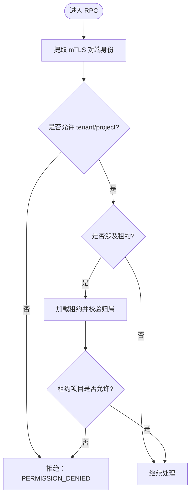
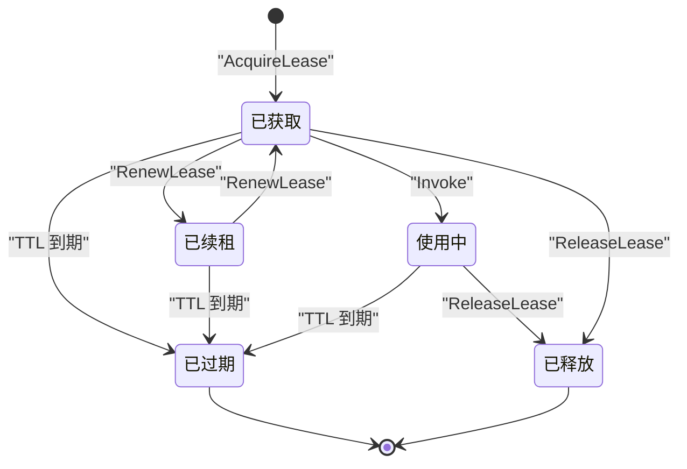
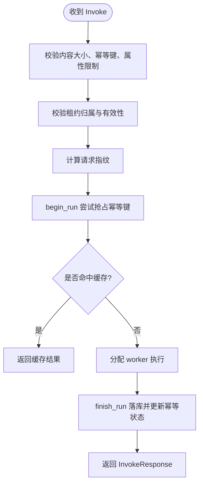
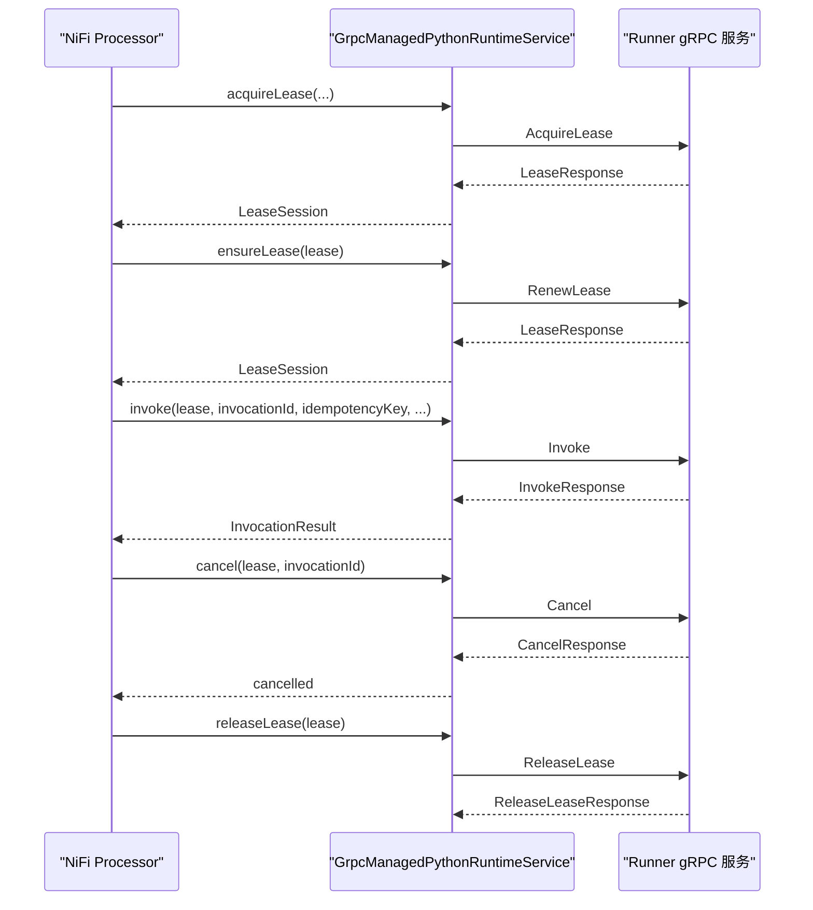

# 协议定义与消息格式

<cite>
**本文引用的文件**   
- [runner.proto](file://proto/runner.proto)
- [gateway.py](file://runner_engine/gateway.py)
- [service.py](file://runner_engine/service.py)
- [state.py](file://runner_engine/state.py)
- [GrpcManagedPythonRuntimeService.java](file://nifi/managed-python-processors/src/main/java/com/dsc/nifi/GrpcManagedPythonRuntimeService.java)
- [generate_proto.py](file://scripts/generate_proto.py)
</cite>

## 目录
1. [引言](#引言)
2. [项目结构与协议位置](#项目结构与协议位置)
3. [核心组件总览](#核心组件总览)
4. [架构概览](#架构概览)
5. [RPC 方法详解](#rpc-方法详解)
6. [消息字段与验证规则](#消息字段与验证规则)
7. [租户隔离与权限模型](#租户隔离与权限模型)
8. [租约机制与生命周期](#租约机制与生命周期)
9. [Invoke 幂等性与重试语义](#invoke-幂等性与重试语义)
10. [错误码与 gRPC 状态映射](#错误码与-grpc-状态映射)
11. [客户端集成示例说明](#客户端集成示例说明)
12. [性能与容量约束](#性能与容量约束)
13. [故障排查指南](#故障排查指南)
14. [结论](#结论)

## 引言
本文面向 Runner Engine 的 gRPC 协议，系统性说明 `ManagedPythonRunner` 服务的所有 RPC 方法、请求响应消息、字段含义、业务语义、租户隔离机制、租约生命周期以及 Invoke 方法的幂等性保证。文档同时给出调用序列图、数据流图和关键实现路径，帮助读者从协议到实现建立完整理解。

## 项目结构与协议位置
Runner Engine 的 gRPC 协议定义位于 `proto/runner.proto`，由脚本生成 Python gRPC stub，并在 `runner_engine/gateway.py` 中实现 mTLS gRPC 服务端；Java 侧 NiFi Processor 通过 `GrpcManagedPythonRuntimeService.java` 作为 mTLS gRPC 客户端调用该服务。

**图表来源**
- [runner.proto:8-15](file://proto/runner.proto#L8-L15)
- [gateway.py:44-65](file://runner_engine/gateway.py#L44-L65)
- [service.py:80-103](file://runner_engine/service.py#L80-L103)
- [state.py:131-149](file://runner_engine/state.py#L131-L149)
- [generate_proto.py:5-14](file://scripts/generate_proto.py#L5-L14)

**章节来源**
- [runner.proto:1-76](file://proto/runner.proto#L1-L76)
- [gateway.py:44-194](file://runner_engine/gateway.py#L44-L194)
- [service.py:80-103](file://runner_engine/service.py#L80-L103)
- [state.py:131-149](file://runner_engine/state.py#L131-L149)
- [generate_proto.py:1-21](file://scripts/generate_proto.py#L1-L21)

## 核心组件总览
- `ManagedPythonRunner`：gRPC 服务接口，包含 Health、AcquireLease、RenewLease、Invoke、Cancel、ReleaseLease 六个 RPC。
- `gateway.py`：mTLS gRPC 服务端实现，负责身份认证、授权校验、参数转换、错误映射。
- `service.py`：Runner 业务编排层，负责租约创建/续期/释放、执行调度、幂等控制、结果落库。
- `state.py`：基于 PostgreSQL 的持久化状态管理，维护 leases、runs、idempotency_keys 表及清理策略。
- `GrpcManagedPythonRuntimeService.java`：NiFi 侧 Java 客户端，封装 mTLS gRPC 调用，提供 lease 确保、invoke、cancel、release 能力。

**章节来源**
- [runner.proto:8-15](file://proto/runner.proto#L8-L15)
- [gateway.py:67-177](file://runner_engine/gateway.py#L67-L177)
- [service.py:80-455](file://runner_engine/service.py#L80-L455)
- [state.py:131-685](file://runner_engine/state.py#L131-L685)
- [GrpcManagedPythonRuntimeService.java:32-232](file://nifi/managed-python-processors/src/main/java/com/dsc/nifi/GrpcManagedPythonRuntimeService.java#L32-L232)

## 架构概览
下图展示一次典型 Invoke 调用的端到端流程：NiFi 客户端获取并续租租约，携带幂等键和 invocation_id 发起执行，Runner 服务端进行鉴权、参数校验、幂等判断、执行调度、结果落库，最终返回执行结果。

**图表来源**
- [runner.proto:8-15](file://proto/runner.proto#L8-L15)
- [gateway.py:102-157](file://runner_engine/gateway.py#L102-L157)
- [service.py:146-409](file://runner_engine/service.py#L146-L409)
- [state.py:283-607](file://runner_engine/state.py#L283-L607)
- [GrpcManagedPythonRuntimeService.java:114-204](file://nifi/managed-python-processors/src/main/java/com/dsc/nifi/GrpcManagedPythonRuntimeService.java#L114-L204)

## RPC 方法详解

### Health
- 作用：健康检查，确认 Runner gRPC 服务可用。
- 请求：`HealthRequest`（空）。
- 响应：`HealthResponse.ok`、`HealthResponse.version`。
- 行为：服务端仅校验 mTLS 对端身份，返回固定版本信息。

**章节来源**
- [runner.proto:17-21](file://proto/runner.proto#L17-L21)
- [gateway.py:98-100](file://runner_engine/gateway.py#L98-L100)

### AcquireLease
- 作用：为指定租户、项目、处理器和发布版本申请执行租约。
- 请求字段：
  - `tenant_id`：租户标识，用于多租户隔离。
  - `project_id`：项目标识，用于细粒度访问控制。
  - `processor_id`：处理器标识，用于按处理器维度统计或限制。
  - `release_id`：发布版本标识，用于定位安全策略与资源配额。
- 响应字段：
  - `lease_id`：租约唯一标识。
  - `expires_at_epoch_ms`：租约过期时间（毫秒时间戳）。
- 行为：
  - 校验调用方对 tenant/project 的访问权限。
  - 校验 release 的安全策略是否存在。
  - 在数据库写入租约记录并返回过期时间。

**章节来源**
- [runner.proto:23-38](file://proto/runner.proto#L23-L38)
- [gateway.py:102-116](file://runner_engine/gateway.py#L102-L116)
- [service.py:146-167](file://runner_engine/service.py#L146-L167)
- [state.py:283-311](file://runner_engine/state.py#L283-L311)

### RenewLease
- 作用：续租已持有的租约，延长其有效期。
- 请求字段：
  - `tenant_id`：租户标识。
  - `lease_id`：要续租的租约标识。
- 响应字段：
  - `lease_id`：续租后的租约标识。
  - `expires_at_epoch_ms`：新的过期时间。
- 行为：
  - 校验调用方对该租约所属项目的访问权限。
  - 校验租约存在且未过期。
  - 更新过期时间为当前时间加 TTL。

**章节来源**
- [runner.proto:30-38](file://proto/runner.proto#L30-L38)
- [gateway.py:118-127](file://runner_engine/gateway.py#L118-L127)
- [service.py:175-180](file://runner_engine/service.py#L175-L180)
- [state.py:348-369](file://runner_engine/state.py#L348-L369)

### Invoke
- 作用：在有效租约下执行处理器逻辑，支持幂等与超时控制。
- 请求字段：
  - `tenant_id`：租户标识。
  - `lease_id`：执行租约标识。
  - `release_id`：发布版本标识。
  - `invocation_id`：本次调用唯一标识，用于并发去重与取消。
  - `idempotency_key`：幂等键，用于重复请求去重。
  - `content`：二进制内容。
  - `attributes`：输入属性键值对。
  - `parameters`：参数键值对。
  - `timeout_ms`：执行超时时间（毫秒），默认 30000。
- 响应字段：
  - `status`：执行状态，例如成功或失败。
  - `relationship`：关系标签，如 success、retry 等。
  - `content`：输出二进制内容。
  - `attributes`：输出属性键值对。
  - `retryable`：是否可重试。
  - `error_code`：错误码。
  - `error_message`：错误消息。
  - `worker_id`：执行 worker 标识。
  - `duration_ms`：执行耗时（毫秒）。
- 行为：
  - 校验租约归属与有效性。
  - 校验内容大小、幂等键必填、属性数量与字节上限。
  - 根据 release 的安全策略裁剪并校验 attributes。
  - 计算请求指纹，结合 idempotency_key 做幂等判断。
  - 若缓存命中则直接返回历史结果。
  - 否则分配 worker 执行，记录运行状态，完成后落库。
  - 根据结果决定 worker 复用或失效。

**章节来源**
- [runner.proto:40-62](file://proto/runner.proto#L40-L62)
- [gateway.py:129-157](file://runner_engine/gateway.py#L129-L157)
- [service.py:188-409](file://runner_engine/service.py#L188-L409)
- [state.py:411-607](file://runner_engine/state.py#L411-L607)

### Cancel
- 作用：取消正在执行的 invocation。
- 请求字段：
  - `tenant_id`：租户标识。
  - `lease_id`：租约标识。
  - `invocation_id`：要取消的调用标识。
- 响应字段：
  - `cancelled`：是否成功取消。
- 行为：
  - 校验租约归属与有效性。
  - 查找内存中的活跃 invocation。
  - 若匹配则调用后端 cancel，否则返回 false。
  - 取消失败时可能标记 worker 失效并抛出可重试错误。

**章节来源**
- [runner.proto:64-69](file://proto/runner.proto#L64-L69)
- [gateway.py:159-169](file://runner_engine/gateway.py#L159-L169)
- [service.py:411-455](file://runner_engine/service.py#L411-L455)

### ReleaseLease
- 作用：主动释放租约，回收资源。
- 请求字段：
  - `tenant_id`：租户标识。
  - `lease_id`：要释放的租约标识。
- 响应字段：
  - `released`：是否成功释放。
- 行为：
  - 校验租约归属与有效性。
  - 删除租约记录。

**章节来源**
- [runner.proto:71-76](file://proto/runner.proto#L71-L76)
- [gateway.py:171-177](file://runner_engine/gateway.py#L171-L177)
- [service.py:182-186](file://runner_engine/service.py#L182-L186)
- [state.py:371-381](file://runner_engine/state.py#L371-L381)

## 消息字段与验证规则

### 通用字段说明
- `tenant_id`：租户标识，贯穿所有需要租户隔离的接口。
- `project_id`：项目标识，用于访问控制与审计。
- `processor_id`：处理器标识，用于按处理器维度统计或限制。
- `release_id`：发布版本标识，用于安全策略与资源配额。
- `lease_id`：租约标识，用于限定执行上下文。
- `invocation_id`：调用实例标识，用于并发去重与取消。
- `idempotency_key`：幂等键，用于重复请求去重。
- `content`：二进制负载，受大小限制。
- `attributes`：键值对属性，受数量与字节数限制。
- `parameters`：键值对参数，受数量与字节数限制。
- `timeout_ms`：执行超时时间，受策略上限限制。

### 字段验证规则
- 内容大小：
  - 输入内容超过 8 MiB 时报错。
  - 输出内容超过 8 MiB 时报错。
- 属性与参数：
  - 属性数量上限为 128。
  - 属性键值对 UTF-8 字节总数上限为 64 KiB。
  - 属性必须为字符串键值对。
- 超时时间：
  - 最小值为 1 毫秒。
  - 最大值为 release 安全策略配置的 `max_timeout_ms`。
- 幂等键：
  - 必填。
  - 同一租户+release+idempotency_key 的请求指纹必须一致。
- 租约：
  - 必须存在、属于相同租户、未过期。
  - Invoke 还要求租约与 release_id 匹配。

**章节来源**
- [service.py:15-21](file://runner_engine/service.py#L15-L21)
- [service.py:39-77](file://runner_engine/service.py#L39-L77)
- [service.py:188-235](file://runner_engine/service.py#L188-L235)
- [service.py:300-310](file://runner_engine/service.py#L300-L310)
- [state.py:313-346](file://runner_engine/state.py#L313-L346)
- [state.py:411-456](file://runner_engine/state.py#L411-L456)

## 租户隔离与权限模型
- 身份来源：mTLS 客户端证书的对端身份（SAN 或 CN）。
- 访问控制：
  - `AccessControl.allow(identity, tenant_id, project_id)` 允许配置 identity 到 tenant/project 的映射。
  - 支持通配符项目 `*` 表示允许该租户下的任意项目。
- 租约级授权：
  - 涉及租约的操作会先查询租约，再校验调用方 identity 是否允许该租约对应的项目。
- 取消保护：
  - Cancel 会校验 invocation 是否属于当前 tenant/lease，否则拒绝。

**图表来源**
- [gateway.py:12-31](file://runner_engine/gateway.py#L12-L31)
- [gateway.py:81-96](file://runner_engine/gateway.py#L81-L96)
- [gateway.py:102-177](file://runner_engine/gateway.py#L102-L177)

**章节来源**
- [gateway.py:12-31](file://runner_engine/gateway.py#L12-L31)
- [gateway.py:81-96](file://runner_engine/gateway.py#L81-L96)
- [gateway.py:102-177](file://runner_engine/gateway.py#L102-L177)

## 租约机制与生命周期
租约是 Runner Engine 的执行许可凭证，生命周期包括获取、续租、使用、释放与过期清理。

- 获取：`AcquireLease` 写入 `runner.leases`，设置 `expires_at`。
- 续租：`RenewLease` 更新 `expires_at` 为当前时间 + TTL。
- 使用：`Invoke` 校验租约存在、未过期、租户与 release 匹配。
- 释放：`ReleaseLease` 删除租约记录。
- 过期清理：后台任务定期清理过期租约。

**图表来源**
- [state.py:16-32](file://runner_engine/state.py#L16-L32)
- [state.py:283-311](file://runner_engine/state.py#L283-L311)
- [state.py:348-369](file://runner_engine/state.py#L348-L369)
- [state.py:371-386](file://runner_engine/state.py#L371-L386)

**章节来源**
- [runner.proto:23-38](file://proto/runner.proto#L23-L38)
- [gateway.py:102-127](file://runner_engine/gateway.py#L102-L127)
- [service.py:146-186](file://runner_engine/service.py#L146-L186)
- [state.py:283-386](file://runner_engine/state.py#L283-L386)

## Invoke 幂等性与重试语义
Invoke 的幂等性由 `idempotency_key` 与请求指纹共同保障：
- 幂等键必填。
- 系统计算请求指纹，包含 release_id、content SHA256、attributes、parameters、timeout_ms。
- 首次请求：
  - 在 `runner.idempotency_keys` 插入 RUNNING 状态，并关联 `current_run_id`。
  - 同时在 `runner.runs` 插入 RUNNING 审计行。
- 重复请求：
  - 若指纹不一致，报错 `IDEMPOTENCY_CONFLICT`。
  - 若状态为 RUNNING，报错 `RUN_IN_PROGRESS`（可重试）。
  - 若状态为 DONE 且可回放，直接返回缓存结果。
- 完成：
  - 非可重试结果会被缓存并可回放一段时间。
  - 可重试结果不会缓存回放。
- invocation_id：
  - 用于并发去重与取消。
  - 在服务内存中维护活跃 invocation，防止同一 invocation_id 并发执行。

**图表来源**
- [service.py:188-409](file://runner_engine/service.py#L188-L409)
- [state.py:411-607](file://runner_engine/state.py#L411-L607)

**章节来源**
- [runner.proto:40-62](file://proto/runner.proto#L40-L62)
- [service.py:188-409](file://runner_engine/service.py#L188-L409)
- [state.py:411-607](file://runner_engine/state.py#L411-L607)

## 错误码与 gRPC 状态映射
Runner 内部错误码与服务端 gRPC 状态映射如下：
- `UNAUTHENTICATED` → `UNAUTHENTICATED`
- 以 `FORBIDDEN` 结尾或 `CANCEL_FORBIDDEN` → `PERMISSION_DENIED`
- `RELEASE_NOT_FOUND`、`LEASE_UNKNOWN` → `NOT_FOUND`
- 标记为 `retryable=True` 的错误 → `UNAVAILABLE`
- 其他错误 → `FAILED_PRECONDITION`

常见业务错误码：
- `UNKNOWN_SECURITY_POLICY`：未知安全策略。
- `INLINE_CONTENT_TOO_LARGE`：输入内容过大。
- `IDEMPOTENCY_REQUIRED`：缺少幂等键。
- `IDEMPOTENCY_CONFLICT`：幂等键被用于不同请求内容。
- `RUN_IN_PROGRESS`：相同逻辑请求已在运行。
- `INVOCATION_ID_IN_USE`：invocation_id 已被占用。
- `OUTPUT_TOO_LARGE`：输出内容过大。
- `RUN_STATE_INVALID`：执行状态无效。
- `RUNNER_INFRASTRUCTURE_ERROR`：基础设施错误（可重试）。
- `CANCEL_FAILED`：取消失败（可重试）。

**章节来源**
- [gateway.py:67-79](file://runner_engine/gateway.py#L67-L79)
- [service.py:188-409](file://runner_engine/service.py#L188-L409)
- [service.py:411-455](file://runner_engine/service.py#L411-L455)

## 客户端集成示例说明
NiFi Java 客户端通过 `GrpcManagedPythonRuntimeService` 调用 Runner gRPC 服务：
- 配置 mTLS：目标地址、CA 证书、客户端证书与私钥。
- 获取租约：`acquireLease(tenantId, projectId, processorId, releaseId)`。
- 确保租约：`ensureLease(lease)`，若接近过期则自动续租；若租约未知或过期则重新获取。
- 执行调用：`invoke(lease, invocationId, idempotencyKey, content, attributes, parameters, timeoutMs)`。
- 取消执行：`cancel(lease, invocationId)`。
- 释放租约：`releaseLease(lease)`。

**图表来源**
- [GrpcManagedPythonRuntimeService.java:114-222](file://nifi/managed-python-processors/src/main/java/com/dsc/nifi/GrpcManagedPythonRuntimeService.java#L114-L222)
- [runner.proto:8-15](file://proto/runner.proto#L8-L15)

**章节来源**
- [GrpcManagedPythonRuntimeService.java:32-232](file://nifi/managed-python-processors/src/main/java/com/dsc/nifi/GrpcManagedPythonRuntimeService.java#L32-L232)

## 性能与容量约束
- 消息大小：
  - gRPC 最大接收/发送消息长度为 10 MiB。
  - 业务层对 Invoke 的 inline content 限制为 8 MiB。
- 属性与参数：
  - 最多 128 个属性。
  - 属性键值对 UTF-8 字节总数不超过 64 KiB。
- 超时：
  - 最小 1 毫秒，最大由安全策略配置。
- 后台清理：
  - 定期清理过期租约、过期幂等缓存、旧运行记录。

**章节来源**
- [gateway.py:184-189](file://runner_engine/gateway.py#L184-L189)
- [service.py:15-21](file://runner_engine/service.py#L15-L21)
- [service.py:188-235](file://runner_engine/service.py#L188-L235)
- [service.py:117-138](file://runner_engine/service.py#L117-L138)

## 故障排查指南
- 无法连接或认证失败：
  - 检查 mTLS 证书链与 SAN/CN 配置。
  - 确认 AccessControl 配置允许 identity 访问对应 tenant/project。
- 租约相关错误：
  - `LEASE_UNKNOWN`：租约不存在或已被释放。
  - `LEASE_EXPIRED`：租约已过期，需续租或重新获取。
  - `LEASE_FORBIDDEN`：租约不属于当前租户。
  - `LEASE_RELEASE_MISMATCH`：租约与 release_id 不匹配。
- 幂等相关错误：
  - `IDEMPOTENCY_REQUIRED`：缺少幂等键。
  - `IDEMPOTENCY_CONFLICT`：幂等键被用于不同请求内容。
  - `RUN_IN_PROGRESS`：相同逻辑请求已在运行，建议重试。
- 执行相关错误：
  - `RUN_STATE_INVALID`：执行状态异常，建议重试。
  - `RUNNER_INFRASTRUCTURE_ERROR`：基础设施错误，建议重试。
  - `CANCEL_FAILED`：取消失败，建议重试或检查 worker 状态。
- 输出与属性限制：
  - `OUTPUT_TOO_LARGE`：输出内容过大。
  - `TOO_MANY_ATTRIBUTES`：属性过多。
  - `ATTRIBUTES_TOO_LARGE`：属性字节数超限。

**章节来源**
- [gateway.py:67-79](file://runner_engine/gateway.py#L67-L79)
- [gateway.py:81-96](file://runner_engine/gateway.py#L81-L96)
- [service.py:188-409](file://runner_engine/service.py#L188-L409)
- [service.py:411-455](file://runner_engine/service.py#L411-L455)
- [state.py:313-346](file://runner_engine/state.py#L313-L346)
- [state.py:411-456](file://runner_engine/state.py#L411-L456)

## 结论
Runner Engine 的 `ManagedPythonRunner` gRPC 协议围绕“租约 + 幂等”构建可靠的执行模型。通过 mTLS 身份认证与 AccessControl 访问控制，实现严格的租户与项目隔离；通过租约的生命周期管理，确保执行上下文的安全与可控；通过 `idempotency_key` 与请求指纹，保证 Invoke 的幂等性与可回放性；通过清晰的错误码与 gRPC 状态映射，便于客户端进行重试与降级。NiFi Java 客户端提供了完整的 mTLS gRPC 调用封装，便于在生产环境中稳定集成。