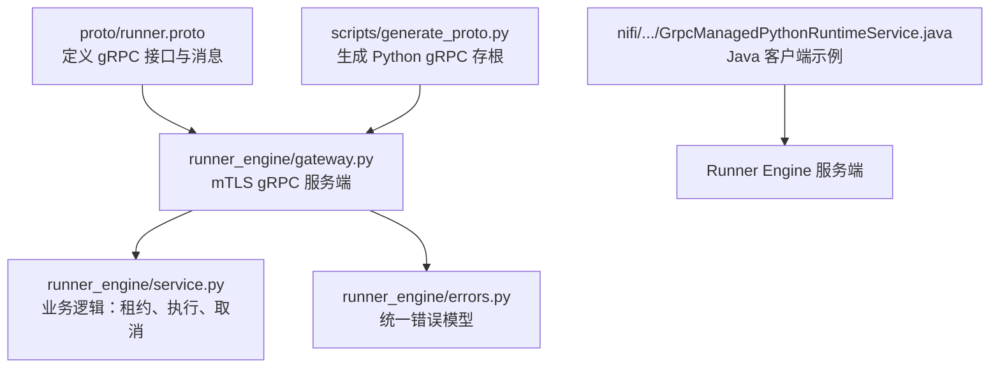
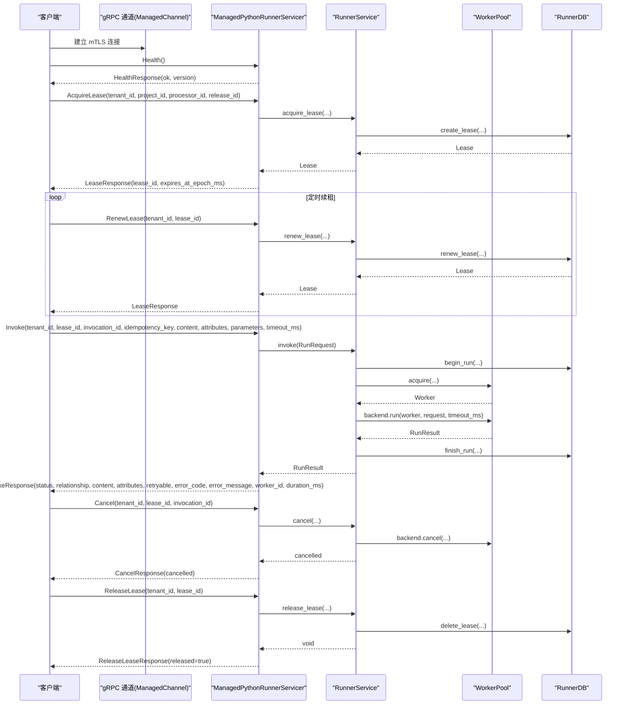
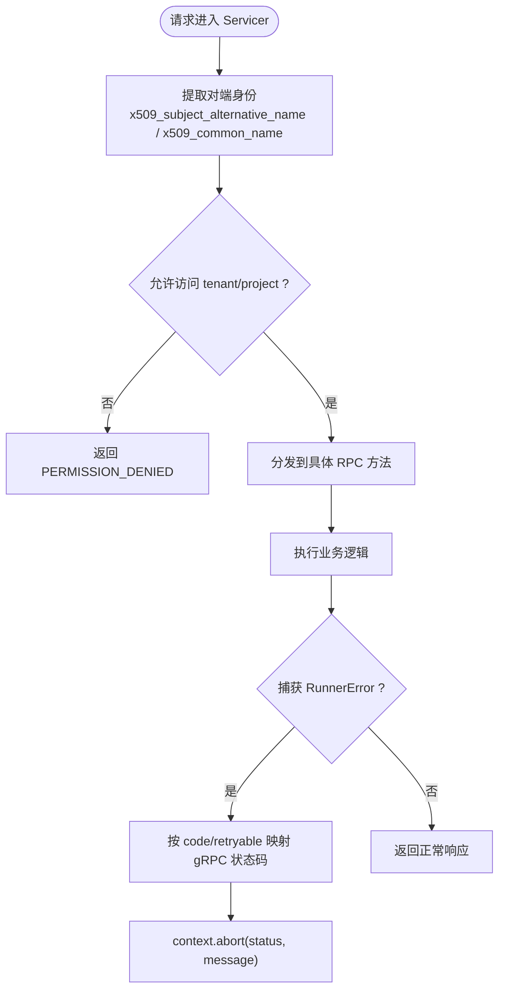
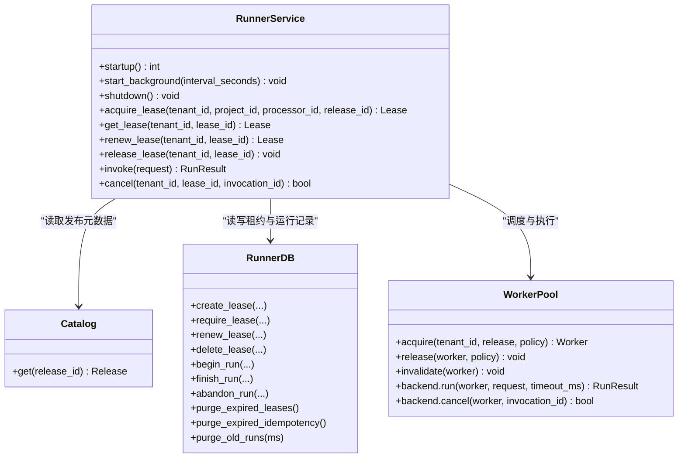
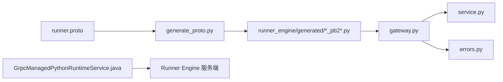
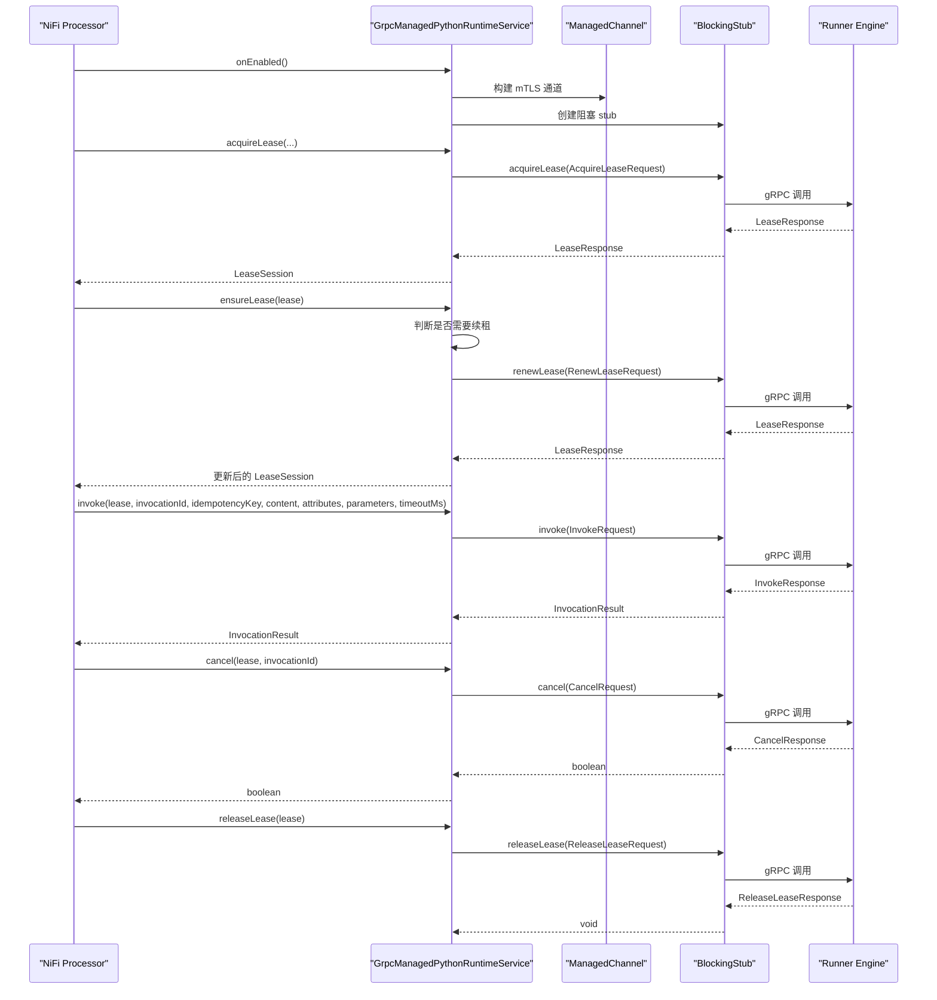

# 客户端集成指南

<cite>
**本文引用的文件**   
- [runner.proto](file://proto/runner.proto)
- [gateway.py](file://runner_engine/gateway.py)
- [service.py](file://runner_engine/service.py)
- [errors.py](file://runner_engine/errors.py)
- [generate_proto.py](file://scripts/generate_proto.py)
- [GrpcManagedPythonRuntimeService.java](file://nifi/managed-python-processors/src/main/java/com/dsc/nifi/GrpcManagedPythonRuntimeService.java)
</cite>

## 目录
1. [简介](#简介)
2. [项目结构](#项目结构)
3. [核心组件](#核心组件)
4. [架构总览](#架构总览)
5. [详细组件分析](#详细组件分析)
6. [依赖关系分析](#依赖关系分析)
7. [性能与高可用配置](#性能与高可用配置)
8. [错误处理与重试策略](#错误处理与重试策略)
9. [多语言客户端实现要点](#多语言客户端实现要点)
10. [故障排查](#故障排查)
11. [结论](#结论)

## 简介
本指南面向需要以 gRPC 方式接入 Runner Engine 的客户端开发者。Runner Engine 通过 mTLS 暴露 ManagedPythonRunner 服务，提供健康检查、租约管理、任务执行、取消和租约释放等能力。本文重点说明：
- 如何建立安全的 gRPC 连接（mTLS）
- 如何调用各 gRPC 方法（同步/异步）
- 如何设计错误处理与重试机制
- 如何配置连接池、负载均衡和高可用
- 如何在 Python 与 Java 中实现客户端
- 如何进行性能优化与监控指标收集

## 项目结构
Runner Engine 的 gRPC 接口定义位于 proto 目录；服务端实现位于 runner_engine 模块；Java 侧 NiFi Processor 示例展示了客户端用法。

图示来源
- [runner.proto:8-15](file://proto/runner.proto#L8-L15)
- [gateway.py:44-194](file://runner_engine/gateway.py#L44-L194)
- [service.py:80-456](file://runner_engine/service.py#L80-L456)
- [errors.py:1-22](file://runner_engine/errors.py#L1-22)
- [generate_proto.py:1-21](file://scripts/generate_proto.py#L1-L21)
- [GrpcManagedPythonRuntimeService.java:32-94](file://nifi/managed-python-processors/src/main/java/com/dsc/nifi/GrpcManagedPythonRuntimeService.java#L32-L94)

章节来源
- [runner.proto:1-76](file://proto/runner.proto#L1-L76)
- [gateway.py:1-195](file://runner_engine/gateway.py#L1-L195)
- [service.py:1-456](file://runner_engine/service.py#L1-L456)
- [errors.py:1-22](file://runner_engine/errors.py#L1-L22)
- [generate_proto.py:1-21](file://scripts/generate_proto.py#L1-L21)
- [GrpcManagedPythonRuntimeService.java:1-232](file://nifi/managed-python-processors/src/main/java/com/dsc/nifi/GrpcManagedPythonRuntimeService.java#L1-L232)

## 核心组件
- gRPC 接口与服务
  - 服务名：ManagedPythonRunner
  - 方法：Health、AcquireLease、RenewLease、Invoke、Cancel、ReleaseLease
- 服务端
  - gateway.py：启动 mTLS gRPC 服务，鉴权、映射业务错误到 gRPC 状态码
  - service.py：租约生命周期、幂等执行、工作池管理、结果持久化
  - errors.py：统一错误类型，包含可重试标记
- 代码生成
  - generate_proto.py：从 runner.proto 生成 Python gRPC 存根并修正导入路径
- Java 客户端示例
  - GrpcManagedPythonRuntimeService.java：NiFi Controller Service，封装 ManagedChannel、BlockingStub 及租约续期逻辑

章节来源
- [runner.proto:8-75](file://proto/runner.proto#L8-L75)
- [gateway.py:44-194](file://runner_engine/gateway.py#L44-L194)
- [service.py:80-456](file://runner_engine/service.py#L80-L456)
- [errors.py:1-22](file://runner_engine/errors.py#L1-L22)
- [generate_proto.py:1-21](file://scripts/generate_proto.py#L1-L21)
- [GrpcManagedPythonRuntimeService.java:32-232](file://nifi/managed-python-processors/src/main/java/com/dsc/nifi/GrpcManagedPythonRuntimeService.java#L32-L232)

## 架构总览
下图展示客户端到 Runner Engine 的端到端交互流程，包括鉴权、租约获取、任务执行与取消。

图示来源
- [runner.proto:8-75](file://proto/runner.proto#L8-L75)
- [gateway.py:98-177](file://runner_engine/gateway.py#L98-L177)
- [service.py:146-456](file://runner_engine/service.py#L146-L456)

## 详细组件分析

### gRPC 接口与数据模型
- 服务与方法
  - Health：健康检查
  - AcquireLease：申请租约
  - RenewLease：续租
  - Invoke：执行任务
  - Cancel：取消执行
  - ReleaseLease：释放租约
- 关键消息字段
  - InvokeRequest：包含租户、租约、幂等键、内容、属性、参数、超时等
  - InvokeResponse：包含状态、关系、内容、属性、是否可重试、错误信息、耗时等

章节来源
- [runner.proto:8-75](file://proto/runner.proto#L8-L75)

### 服务端实现要点
- mTLS 安全传输
  - 使用 ssl_server_credentials，要求客户端证书认证
  - 限制最大收发消息大小为 10 MiB
- 身份与权限控制
  - 从 gRPC context 提取 x509_subject_alternative_name 或 x509_common_name
  - AccessControl 根据 identity 校验 tenant/project 访问权限
- 错误映射
  - 将内部 RunnerError 映射为 gRPC StatusCode：UNAUTHENTICATED、PERMISSION_DENIED、NOT_FOUND、UNAVAILABLE、FAILED_PRECONDITION
  - 基于错误码与 retryable 标志决定 UNAVAILABLE 等

图示来源
- [gateway.py:33-41](file://runner_engine/gateway.py#L33-L41)
- [gateway.py:67-79](file://runner_engine/gateway.py#L67-L79)
- [gateway.py:179-194](file://runner_engine/gateway.py#L179-L194)

章节来源
- [gateway.py:12-31](file://runner_engine/gateway.py#L12-L31)
- [gateway.py:33-41](file://runner_engine/gateway.py#L33-L41)
- [gateway.py:67-79](file://runner_engine/gateway.py#L67-L79)
- [gateway.py:98-177](file://runner_engine/gateway.py#L98-L177)
- [gateway.py:179-194](file://runner_engine/gateway.py#L179-L194)

### 业务服务 RunnerService
- 租约管理
  - acquire_lease：校验发布版本安全策略，创建租约
  - renew_lease：续租
  - release_lease：删除租约
- 执行引擎
  - invoke：校验输入大小、必填幂等键、校验属性与参数、计算指纹、并发去重、数据库事务、工作池执行、输出校验、结果持久化
  - cancel：校验租约归属，尝试取消后台执行
- 资源清理
  - 后台线程定期清理过期租约、幂等记录与旧运行记录
  - 启动时重置孤儿运行记录

图示来源
- [service.py:80-456](file://runner_engine/service.py#L80-L456)

章节来源
- [service.py:80-456](file://runner_engine/service.py#L80-L456)

### 错误模型
- RunnerError：基础异常，包含 code、message、retryable
- 子类：CatalogError、LeaseError、QuotaError、SandboxError
- 服务端将 retryable=True 的错误映射为 UNAVAILABLE，便于客户端重试

章节来源
- [errors.py:1-22](file://runner_engine/errors.py#L1-L22)
- [gateway.py:67-79](file://runner_engine/gateway.py#L67-L79)

### 代码生成
- generate_proto.py 使用 grpc_tools.protoc 生成 Python 协议与 gRPC 存根
- 修正生成的 runner_pb2_grpc.py 中的相对导入，使其在包内可正确 import

章节来源
- [generate_proto.py:1-21](file://scripts/generate_proto.py#L1-L21)

## 依赖关系分析
- 外部依赖
  - Python：grpcio、protobuf（由脚本生成）
  - Java：io.grpc、netty-shaded（用于 mTLS 与 Channel）
- 内部耦合
  - gateway.py 依赖 generated 模块中的 runner_pb2 与 runner_pb2_grpc
  - gateway.py 依赖 service.py 的业务方法与 errors.py 的错误模型
  - service.py 依赖 catalog、state、pool 等子系统

图示来源
- [runner.proto:1-76](file://proto/runner.proto#L1-L76)
- [generate_proto.py:1-21](file://scripts/generate_proto.py#L1-L21)
- [gateway.py:60-65](file://runner_engine/gateway.py#L60-L65)
- [GrpcManagedPythonRuntimeService.java:12-16](file://nifi/managed-python-processors/src/main/java/com/dsc/nifi/GrpcManagedPythonRuntimeService.java#L12-L16)

章节来源
- [runner.proto:1-76](file://proto/runner.proto#L1-L76)
- [generate_proto.py:1-21](file://scripts/generate_proto.py#L1-L21)
- [gateway.py:60-65](file://runner_engine/gateway.py#L60-L65)
- [GrpcManagedPythonRuntimeService.java:12-16](file://nifi/managed-python-processors/src/main/java/com/dsc/nifi/GrpcManagedPythonRuntimeService.java#L12-L16)

## 性能与高可用配置

### 连接与消息大小
- 服务端限制最大收发消息长度为 10 MiB
- Java 客户端设置 maxInboundMessageSize 为 10 MiB
- 建议客户端保持长连接（ManagedChannel），避免频繁握手

章节来源
- [gateway.py:184-190](file://runner_engine/gateway.py#L184-L190)
- [GrpcManagedPythonRuntimeService.java:87-91](file://nifi/managed-python-processors/src/main/java/com/dsc/nifi/GrpcManagedPythonRuntimeService.java#L87-L91)

### 连接池与复用
- 服务端使用 ThreadPoolExecutor(max_workers=32) 处理并发请求
- 客户端应复用 ManagedChannel，并在关闭时优雅 shutdown
- Java 示例在 onDisabled 中等待终止，必要时强制 shutdownNow

章节来源
- [gateway.py:184-190](file://runner_engine/gateway.py#L184-L190)
- [GrpcManagedPythonRuntimeService.java:96-112](file://nifi/managed-python-processors/src/main/java/com/dsc/nifi/GrpcManagedPythonRuntimeService.java#L96-L112)

### 负载均衡与高可用
- 当前仓库未内置客户端侧负载均衡器
- 建议在客户端侧结合服务发现（如 DNS SRV、Kubernetes Service、Consul）与自定义 LoadBalancer 实现多实例均衡
- 配合重试与熔断策略提升可用性

[本节为通用实践说明，不直接分析具体文件]

### 批量操作
- 当前接口为单条 Invoke，不支持批量
- 可在客户端侧做批量化聚合，但需注意幂等键与超时控制

[本节为通用实践说明，不直接分析具体文件]

### 监控指标
- 建议采集：连接数、QPS、延迟分布、错误率、重试次数、租约续期成功率、执行时长、worker 利用率
- 指标维度：tenant_id、project_id、processor_id、release_id、status、error_code

[本节为通用实践说明，不直接分析具体文件]

## 错误处理与重试策略

### 错误分类与状态码映射
- UNAUTHENTICATED：认证失败
- PERMISSION_DENIED：鉴权失败或禁止操作
- NOT_FOUND：租约不存在
- UNAVAILABLE：可重试错误（如临时不可用）
- FAILED_PRECONDITION：前置条件不满足

章节来源
- [gateway.py:67-79](file://runner_engine/gateway.py#L67-L79)

### 重试策略
- 仅对 UNAVAILABLE 且业务层标记 retryable=True 的请求进行重试
- 指数退避 + 抖动，限制最大重试次数
- 对 Invoke 的超时与取消语义要谨慎处理，避免重复执行

章节来源
- [errors.py:1-22](file://runner_engine/errors.py#L1-L22)
- [gateway.py:67-79](file://runner_engine/gateway.py#L67-L79)

### 租约失效处理
- Java 示例在 renewLease 失败时检测 LEASE_UNKNOWN/LEASE_EXPIRED 前缀，自动重新申请租约
- 客户端应缓存 expires_at_epoch_ms，提前触发续租

章节来源
- [GrpcManagedPythonRuntimeService.java:138-171](file://nifi/managed-python-processors/src/main/java/com/dsc/nifi/GrpcManagedPythonRuntimeService.java#L138-L171)

### 网络异常与超时
- 客户端应设置合理的 connectTimeout、callTimeout
- 对超时错误区分“可重试”与“不可重试”，避免误重试导致重复执行

[本节为通用实践说明，不直接分析具体文件]

## 多语言客户端实现要点

### Python 客户端实现要点
- 生成存根
  - 先运行 scripts/generate_proto.py 生成 runner_engine/generated/*_pb2*.py
- 建立 mTLS 通道
  - 使用 grpc.ssl_channel_credentials，加载 CA 证书、客户端证书与私钥
  - 设置 channel options：最大消息大小、keepalive 等
- 同步调用
  - 使用 stub.Health/AcquireLease/RenewLease/Invoke/Cancel/ReleaseLease
- 异步调用
  - 使用 stub.xxx.future(...) 或 aio 通道
- 最佳实践
  - 复用 Channel 与 Stub
  - 对 UNAVAILABLE 且 retryable=True 的请求进行有限重试
  - 使用幂等键避免重复执行
  - 合理设置 timeout_ms，避免长时间占用连接

章节来源
- [generate_proto.py:1-21](file://scripts/generate_proto.py#L1-L21)
- [runner.proto:8-75](file://proto/runner.proto#L8-L75)
- [gateway.py:179-194](file://runner_engine/gateway.py#L179-L194)

### Java 客户端实现要点
- 依赖
  - io.grpc、io.grpc.netty.shaded（用于 NettyChannelBuilder 与 SSL）
- 配置属性
  - runner-target：gRPC 目标地址
  - runner-ca-cert：CA 证书路径
  - runner-client-cert：客户端证书路径
  - runner-client-key：客户端私钥路径
- 初始化
  - 使用 GrpcSslContexts.forClient().trustManager(...).keyManager(...).build()
  - NettyChannelBuilder.forTarget(...).sslContext(...).maxInboundMessageSize(...)
  - newBlockingStub(channel)
- 生命周期
  - onEnabled 构建通道与 stub
  - onDisabled 关闭通道，等待终止或强制关闭
- 租约管理
  - ensureLease 在到期前自动续租，失败时根据错误前缀重新申请
- 调用方法
  - acquireLease、ensureLease、invoke、cancel、releaseLease

图示来源
- [GrpcManagedPythonRuntimeService.java:78-94](file://nifi/managed-python-processors/src/main/java/com/dsc/nifi/GrpcManagedPythonRuntimeService.java#L78-L94)
- [GrpcManagedPythonRuntimeService.java:114-232](file://nifi/managed-python-processors/src/main/java/com/dsc/nifi/GrpcManagedPythonRuntimeService.java#L114-L232)

章节来源
- [GrpcManagedPythonRuntimeService.java:32-94](file://nifi/managed-python-processors/src/main/java/com/dsc/nifi/GrpcManagedPythonRuntimeService.java#L32-L94)
- [GrpcManagedPythonRuntimeService.java:114-232](file://nifi/managed-python-processors/src/main/java/com/dsc/nifi/GrpcManagedPythonRuntimeService.java#L114-L232)

## 故障排查

### 常见问题
- 无法建立 mTLS 连接
  - 检查 CA、客户端证书与私钥是否正确
  - 确认服务端 require_client_auth 已启用
- 鉴权失败
  - 检查 x509_subject_alternative_name 或 x509_common_name 是否与 AccessControl 配置匹配
- 租约相关错误
  - LEASE_UNKNOWN/LEASE_EXPIRED：客户端应重新申请租约
  - RELEASE_NOT_FOUND：释放不存在的租约
- 执行失败
  - 关注 InvokeResponse 的 status、error_code、error_message、retryable
  - 对可重试错误进行有限次重试

章节来源
- [gateway.py:33-41](file://runner_engine/gateway.py#L33-L41)
- [gateway.py:67-79](file://runner_engine/gateway.py#L67-L79)
- [GrpcManagedPythonRuntimeService.java:138-171](file://nifi/managed-python-processors/src/main/java/com/dsc/nifi/GrpcManagedPythonRuntimeService.java#L138-L171)

### 诊断步骤
- 验证 Health 接口可达
- 打印 gRPC 状态码与描述信息
- 核对租户、项目、处理器、发布版本与安全策略
- 检查属性与参数的长度与数量限制
- 观察 worker 池与数据库维护日志

章节来源
- [service.py:15-21](file://runner_engine/service.py#L15-L21)
- [service.py:188-235](file://runner_engine/service.py#L188-L235)
- [service.py:334-359](file://runner_engine/service.py#L334-L359)

## 结论
Runner Engine 通过 mTLS gRPC 暴露稳定的托管 Python 运行时接口。客户端应：
- 使用长连接与正确的 mTLS 配置
- 遵循租约生命周期，主动续租并在失效时重新申请
- 使用幂等键与合理的超时控制
- 对 UNAVAILABLE 且可重试的错误实施有限重试
- 复用连接、限制消息大小、采集监控指标以提升性能与稳定性

[本节为总结性内容，不直接分析具体文件]