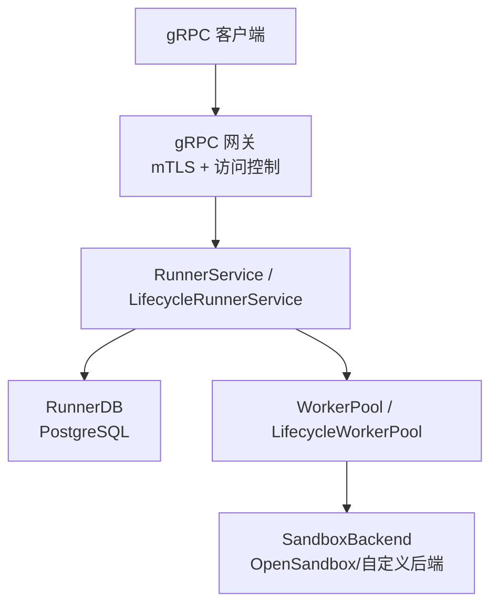
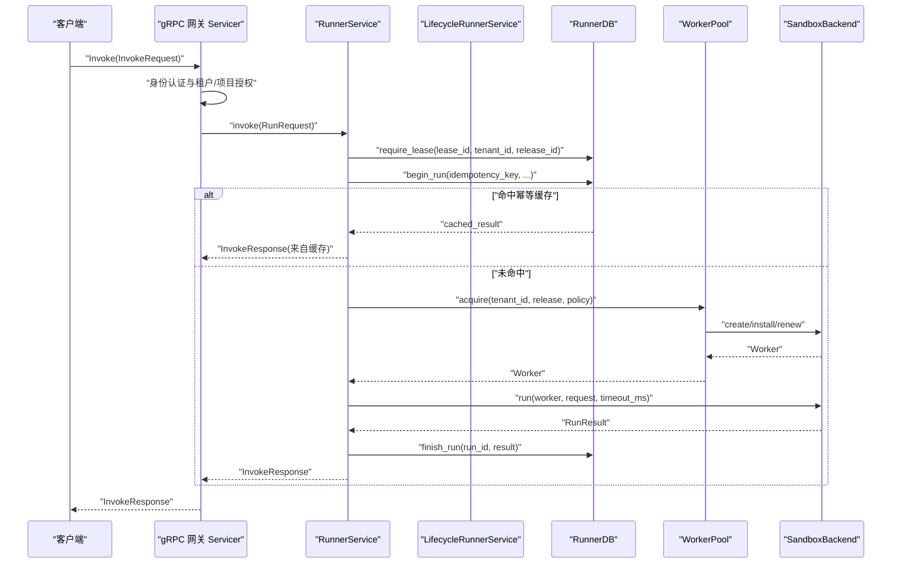
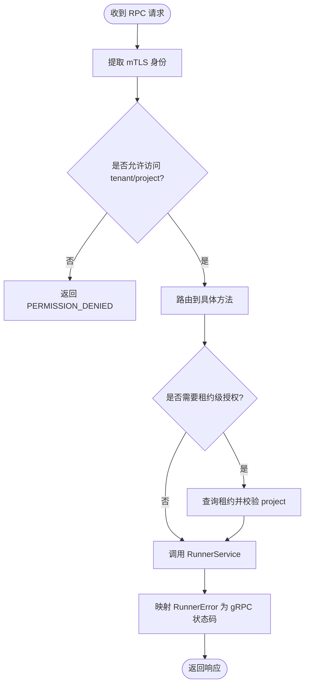
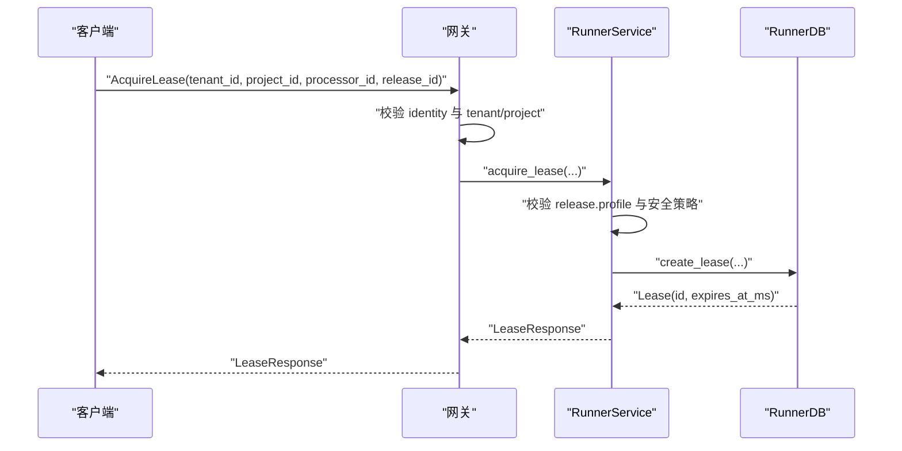
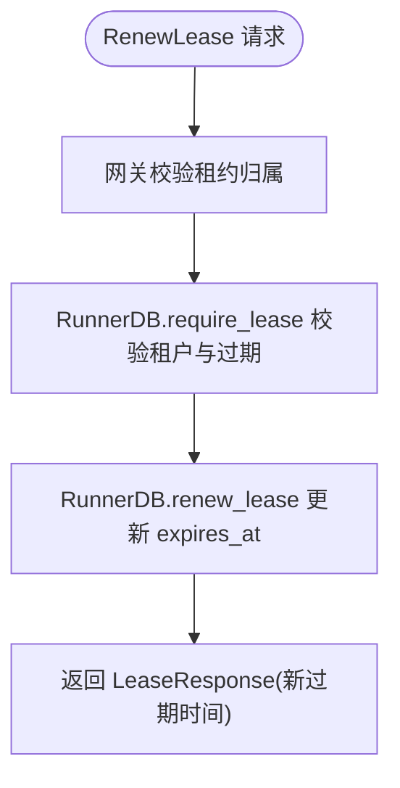
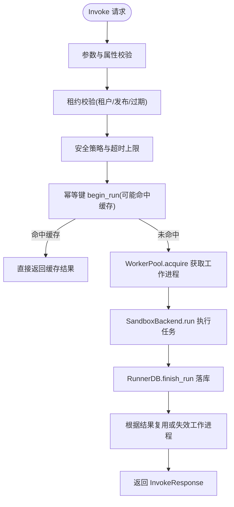
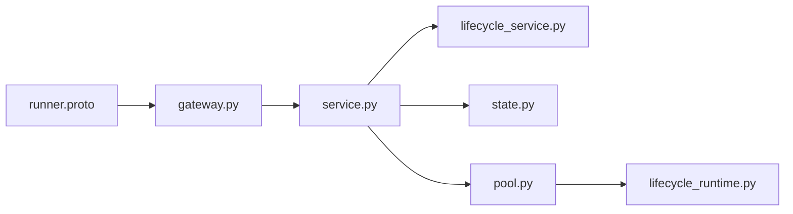

# 服务实现与路由

<cite>
**本文引用的文件**   
- [proto/runner.proto](file://proto/runner.proto)
- [runner_engine/app.py](file://runner_engine/app.py)
- [runner_engine/gateway.py](file://runner_engine/gateway.py)
- [runner_engine/service.py](file://runner_engine/service.py)
- [runner_engine/lifecycle_service.py](file://runner_engine/lifecycle_service.py)
- [runner_engine/state.py](file://runner_engine/state.py)
- [runner_engine/pool.py](file://runner_engine/pool.py)
- [runner_engine/model.py](file://runner_engine/model.py)
- [runner_engine/lifecycle_runtime.py](file://runner_engine/lifecycle_runtime.py)
</cite>

## 目录
1. [简介](#简介)
2. [项目结构](#项目结构)
3. [核心组件](#核心组件)
4. [架构总览](#架构总览)
5. [详细组件分析](#详细组件分析)
6. [依赖关系分析](#依赖关系分析)
7. [性能与调优](#性能与调优)
8. [故障排查指南](#故障排查指南)
9. [结论](#结论)

## 简介
本文面向 Runner Engine 的 gRPC 服务实现，围绕以下目标展开：
- 解释 gRPC 服务的启动配置、连接管理与路由分发机制。
- 详细说明 Health 健康检查接口的实现逻辑，包括版本信息与鉴权要求。
- 深入解析 AcquireLease 租约获取流程，涵盖租户隔离、资源分配与并发控制。
- 记录 RenewLease 续租处理流程，包括过期时间计算与自动续租策略。
- 说明 Invoke 方法的核心执行逻辑，包括参数校验、工作进程调度、超时控制与结果封装。
- 解释 Cancel 取消操作与 ReleaseLease 租约释放的资源清理过程。
- 汇总服务配置选项、性能调优参数与错误处理策略。

该文档既适合运维与平台工程师进行部署与排障，也适合业务开发者理解调用链路与边界条件。

## 项目结构
Runner Engine 的 gRPC 服务由协议定义、入口程序、网关路由、业务服务、状态持久化与工作池等模块组成。关键路径如下：
- 协议定义位于 proto/runner.proto，声明 ManagedPythonRunner 服务及消息类型。
- 应用入口 runner_engine/app.py 负责命令行参数解析、配置加载、后台任务与 gRPC 服务器启动。
- 网关 runner_engine/gateway.py 提供 mTLS 安全端口、访问控制与 RPC 路由转发。
- 业务服务 runner_engine/service.py 实现健康检查、租约管理、执行编排与取消逻辑。
- 生命周期扩展 runner_engine/lifecycle_service.py 在 RETIRING/RETIRED 状态下阻断新请求。
- 状态持久化 runner_engine/state.py 使用 PostgreSQL 维护租约、执行历史与幂等缓存。
- 工作池 runner_engine/pool.py 管理沙箱工作进程的生命周期与复用。
- 运行时生命周期 runner_engine/lifecycle_runtime.py 提供沙箱池增强与运行时退役控制。

**图表来源**
- [runner_engine/app.py:212-220](file://runner_engine/app.py#L212-L220)
- [runner_engine/gateway.py:179-194](file://runner_engine/gateway.py#L179-L194)
- [runner_engine/service.py:80-115](file://runner_engine/service.py#L80-L115)
- [runner_engine/state.py:131-149](file://runner_engine/state.py#L131-L149)
- [runner_engine/pool.py:11-46](file://runner_engine/pool.py#L11-L46)

**章节来源**
- [proto/runner.proto:8-15](file://proto/runner.proto#L8-L15)
- [runner_engine/app.py:26-74](file://runner_engine/app.py#L26-L74)
- [runner_engine/gateway.py:44-66](file://runner_engine/gateway.py#L44-L66)

## 核心组件
- gRPC 协议与服务接口：ManagedPythonRunner 暴露 Health、AcquireLease、RenewLease、Invoke、Cancel、ReleaseLease 六个 RPC。
- 网关 Servicer：将请求映射到 RunnerService 方法，并统一做身份认证、租户/项目授权与错误码转换。
- RunnerService：实现租约创建/续期/删除、执行编排、取消与后台清理。
- LifecycleRunnerService：在 RUNTIME_RETIRING/RUNTIME_RETIRED 时阻止新的租约与执行。
- RunnerDB：基于 PostgreSQL 的租约表、执行历史表与幂等键表，提供事务性状态机。
- WorkerPool/LifecycleWorkerPool：按租户+运行时镜像+安全策略维度复用沙箱，支持配额、TTL 续期与退役。

**章节来源**
- [proto/runner.proto:8-75](file://proto/runner.proto#L8-L75)
- [runner_engine/gateway.py:67-177](file://runner_engine/gateway.py#L67-L177)
- [runner_engine/service.py:80-456](file://runner_engine/service.py#L80-L456)
- [runner_engine/lifecycle_service.py:7-71](file://runner_engine/lifecycle_service.py#L7-L71)
- [runner_engine/state.py:131-685](file://runner_engine/state.py#L131-L685)
- [runner_engine/pool.py:11-188](file://runner_engine/pool.py#L11-L188)

## 架构总览
下图展示一次典型 Invoke 调用从客户端到工作进程的完整链路，包括鉴权、租约校验、幂等判断、工作进程调度与结果落库。

**图表来源**
- [runner_engine/gateway.py:129-157](file://runner_engine/gateway.py#L129-L157)
- [runner_engine/service.py:188-410](file://runner_engine/service.py#L188-L410)
- [runner_engine/state.py:411-607](file://runner_engine/state.py#L411-L607)
- [runner_engine/pool.py:73-130](file://runner_engine/pool.py#L73-L130)

## 详细组件分析

### gRPC 服务启动与连接管理
- 启动入口 runner_engine/app.py 解析命令行与环境变量，构造 LifecycleWorkerPool、LifecycleRunnerService 与 RunnerLifecycleController。
- 通过 gateway.serve 启动 mTLS gRPC 服务器，启用双向证书认证，设置最大收发消息长度为 10 MiB，并使用线程池处理请求。
- 可选 Admin HTTP 服务用于生命周期管理，默认监听本地地址与端口。

关键要点：
- 必须提供 db-url、owner-id、tls-cert、tls-key、client-ca。
- 可通过环境变量调整 worker 空闲时间、孤儿 TTL、续期阈值、最大安装发布数等。
- 后台清理线程定期回收闲置工作进程、清理过期租约与幂等缓存。

**章节来源**
- [runner_engine/app.py:26-168](file://runner_engine/app.py#L26-L168)
- [runner_engine/gateway.py:179-194](file://runner_engine/gateway.py#L179-L194)

### 路由分发与访问控制
gateway.py 中的 Servicer 承担以下职责：
- 身份提取：从 mTLS 上下文读取 x509_subject_alternative_name 或 x509_common_name。
- 访问控制：根据 AccessControl 配置允许 identity 访问指定 tenant/project。
- 租约级授权：对需要 lease_id 的请求先查询租约，再校验 identity 是否有权访问租约所属 project。
- 错误映射：将 RunnerError 转换为合适的 gRPC StatusCode（如 UNAUTHENTICATED、PERMISSION_DENIED、NOT_FOUND、UNAVAILABLE、FAILED_PRECONDITION）。

**图表来源**
- [runner_engine/gateway.py:33-41](file://runner_engine/gateway.py#L33-L41)
- [runner_engine/gateway.py:81-96](file://runner_engine/gateway.py#L81-L96)
- [runner_engine/gateway.py:67-177](file://runner_engine/gateway.py#L67-L177)

**章节来源**
- [runner_engine/gateway.py:12-41](file://runner_engine/gateway.py#L12-L41)
- [runner_engine/gateway.py:67-177](file://runner_engine/gateway.py#L67-L177)

### Health 健康检查接口
Health 接口用于快速探测服务可用性，并在成功鉴权后返回 ok 与版本信息。当前版本固定为 3.3.0。

行为说明：
- 必须先通过 mTLS 身份认证。
- 成功后返回 ok=true 与 version="3.3.0"。
- 不依赖数据库或工作池状态，属于轻量探针。

**章节来源**
- [runner_engine/gateway.py:98-100](file://runner_engine/gateway.py#L98-L100)
- [proto/runner.proto:17-21](file://proto/runner.proto#L17-L21)

### AcquireLease 租约获取
AcquireLease 负责为租户、项目、处理器与发布版本创建租约，并返回租约 ID 与过期时间。

处理流程：
1. 网关层校验 identity 是否允许访问 tenant_id 与 project_id。
2. RunnerService.acquire_lease 校验 release.profile 是否在已配置的安全策略中。
3. RunnerDB.create_lease 写入 runner.leases 表，生成 UUID 租约 ID 与 expires_at。
4. 返回 LeaseResponse，包含 lease_id 与 expires_at_epoch_ms。

租户隔离与并发控制：
- 租约记录包含 tenant_id、project_id、processor_id、release_id，确保跨租户隔离。
- 租约过期由 RunnerDB.require_lease 与后台清理共同保证；过期租约会被标记为 LEASE_EXPIRED。

**图表来源**
- [runner_engine/gateway.py:102-117](file://runner_engine/gateway.py#L102-L117)
- [runner_engine/service.py:146-167](file://runner_engine/service.py#L146-L167)
- [runner_engine/state.py:283-311](file://runner_engine/state.py#L283-L311)

**章节来源**
- [runner_engine/gateway.py:102-117](file://runner_engine/gateway.py#L102-L117)
- [runner_engine/service.py:146-167](file://runner_engine/service.py#L146-L167)
- [runner_engine/state.py:283-311](file://runner_engine/state.py#L283-L311)

### RenewLease 租约续租
RenewLease 用于延长租约有效期，避免长时间运行任务因租约过期被中断。

处理流程：
1. 网关层先通过 require_lease 校验租约存在且属于当前租户。
2. RunnerService.renew_lease 调用 RunnerDB.renew_lease，以当前时间为基准加上 ttl_ms 更新 expires_at。
3. 返回新的 LeaseResponse，包含相同的 lease_id 与更新的 expires_at_epoch_ms。

自动续租策略（客户端侧）：
- Java 客户端在 ensureLease 中比较当前时间与 renewBefore，若租约即将过期则调用 RenewLease。
- 若服务端返回 LEASE_UNKNOWN 或 LEASE_EXPIRED，客户端会回退到重新 AcquireLease。

**图表来源**
- [runner_engine/gateway.py:118-127](file://runner_engine/gateway.py#L118-L127)
- [runner_engine/service.py:175-180](file://runner_engine/service.py#L175-L180)
- [runner_engine/state.py:348-369](file://runner_engine/state.py#L348-L369)

**章节来源**
- [runner_engine/gateway.py:118-127](file://runner_engine/gateway.py#L118-L127)
- [runner_engine/service.py:175-180](file://runner_engine/service.py#L175-L180)
- [runner_engine/state.py:348-369](file://runner_engine/state.py#L348-L369)

### Invoke 方法核心执行逻辑
Invoke 是 Runner Engine 的核心执行入口，负责参数校验、租约与策略校验、幂等去重、工作进程调度、超时控制与结果封装。

关键步骤：
- 参数校验：限制内联内容大小、强制 idempotency_key、校验 attributes 与 parameters 的数量与字节上限。
- 租约校验：require_lease 校验租户、发布版本与过期状态。
- 策略校验：根据 release.profile 查找 SecurityPolicy，限制 max_timeout_ms。
- 属性过滤：仅允许 release.input_attributes 白名单内的 attributes，输出属性同样受 release.output_attributes 白名单约束。
- 幂等处理：RunnerDB.begin_run 通过 runner.idempotency_keys 表进行锁竞争与缓存命中，避免重复执行相同语义请求。
- 工作进程调度：WorkerPool.acquire 按租户+运行时+策略维度复用沙箱，必要时创建新沙箱并安装发布。
- 执行与超时：SandboxBackend.run 接收 RunRequest 与 timeout_ms，返回 RunResult。
- 结果封装与落库：RunnerDB.finish_run 更新 runner.runs 与 runner.idempotency_keys，非重试错误可缓存供后续回放。
- 工作进程回收：根据结果状态决定 reuse_sandbox 或 invalidate。

**图表来源**
- [runner_engine/service.py:188-410](file://runner_engine/service.py#L188-L410)
- [runner_engine/state.py:411-607](file://runner_engine/state.py#L411-L607)
- [runner_engine/pool.py:73-130](file://runner_engine/pool.py#L73-L130)

**章节来源**
- [runner_engine/service.py:188-410](file://runner_engine/service.py#L188-L410)
- [runner_engine/state.py:411-607](file://runner_engine/state.py#L411-L607)
- [runner_engine/pool.py:73-130](file://runner_engine/pool.py#L73-L130)

### Cancel 取消操作
Cancel 用于取消正在执行的 invocation。

处理流程：
1. 网关层校验租约归属。
2. RunnerService.cancel 校验 invocation_id 是否存在于内存中的 _active 表，并校验 tenant_id 与 lease_id 匹配。
3. 调用 SandboxBackend.cancel 向工作进程发送取消信号。
4. 若取消失败，尝试 invalidate 工作进程并抛出 CANCEL_FAILED。

并发与一致性：
- _active 表使用 RLock 保护，防止并发覆盖。
- 取消失败不会改变最终执行结果，但会尝试清理工作进程以避免资源泄漏。

**章节来源**
- [runner_engine/gateway.py:159-169](file://runner_engine/gateway.py#L159-L169)
- [runner_engine/service.py:411-456](file://runner_engine/service.py#L411-L456)

### ReleaseLease 租约释放
ReleaseLease 用于主动释放租约，通常发生在任务完成或异常终止后。

处理流程：
1. 网关层校验租约归属。
2. RunnerService.release_lease 调用 RunnerDB.delete_lease 删除租约记录。
3. 返回 ReleaseLeaseResponse(released=True)。

资源清理：
- 租约释放本身不直接销毁工作进程；工作进程由 WorkerPool 根据策略与 TTL 管理。
- 若租约仍关联活跃执行，应先完成 Cancel 或等待执行结束。

**章节来源**
- [runner_engine/gateway.py:171-177](file://runner_engine/gateway.py#L171-L177)
- [runner_engine/service.py:182-186](file://runner_engine/service.py#L182-L186)
- [runner_engine/state.py:371-386](file://runner_engine/state.py#L371-L386)

### 生命周期扩展与运行时退役
LifecycleRunnerService 在 RUNTIME_RETIRING 或 RUNTIME_RETIRED 状态下阻止新的租约与执行，确保平滑退役。

行为说明：
- acquire_lease、renew_lease、invoke 前都会检查运行时状态。
- RETIRING 状态下的错误标记为 retryable，允许客户端重试；RETIRED 状态直接拒绝。
- LifecycleWorkerPool 在 acquire 时再次检查运行时是否被阻塞，关闭竞态窗口。

**章节来源**
- [runner_engine/lifecycle_service.py:7-71](file://runner_engine/lifecycle_service.py#L7-L71)
- [runner_engine/lifecycle_runtime.py:14-47](file://runner_engine/lifecycle_runtime.py#L14-L47)

## 依赖关系分析
Runner Engine 的依赖关系呈现清晰的层次结构：
- 协议层：proto/runner.proto 定义服务契约。
- 网关层：gateway.py 负责认证、授权与路由。
- 服务层：service.py 与 lifecycle_service.py 实现业务逻辑。
- 数据层：state.py 提供持久化能力。
- 执行层：pool.py 与 lifecycle_runtime.py 管理工作进程与生命周期。

**图表来源**
- [proto/runner.proto:8-15](file://proto/runner.proto#L8-L15)
- [runner_engine/gateway.py:67-177](file://runner_engine/gateway.py#L67-L177)
- [runner_engine/service.py:80-456](file://runner_engine/service.py#L80-L456)
- [runner_engine/lifecycle_service.py:7-71](file://runner_engine/lifecycle_service.py#L7-L71)
- [runner_engine/state.py:131-685](file://runner_engine/state.py#L131-L685)
- [runner_engine/pool.py:11-188](file://runner_engine/pool.py#L11-L188)
- [runner_engine/lifecycle_runtime.py:14-397](file://runner_engine/lifecycle_runtime.py#L14-L397)

**章节来源**
- [runner_engine/app.py:104-154](file://runner_engine/app.py#L104-L154)
- [runner_engine/gateway.py:67-177](file://runner_engine/gateway.py#L67-L177)
- [runner_engine/service.py:80-456](file://runner_engine/service.py#L80-L456)

## 性能与调优
- 消息大小限制：gRPC 服务器设置最大收发消息长度为 10 MiB；RunnerService 限制内联内容与输出内容为 8 MiB。
- 属性限制：attributes 数量上限为 128，总字节上限为 64 KiB。
- 超时控制：invoke 的 timeout_ms 会被限制在 SecurityPolicy.max_timeout_ms 范围内。
- 工作池复用：WorkerPool 按租户+运行时+策略维度复用沙箱，减少冷启动开销。
- 后台清理：RunnerService.start_background 定期回收闲置工作进程、清理过期租约与幂等缓存。
- 幂等缓存：非重试错误可缓存，提升重复请求性能；缓存保留时间由 idempotency_retention_ms 控制。
- 运行时退役：LifecycleWorkerPool 在退役期间阻止新沙箱创建，逐步回收空闲工作进程。

建议调优点：
- 根据负载调整 RUNNER_WORKER_IDLE_SECONDS、RUNNER_SANDBOX_ORPHAN_TTL_SECONDS、RUNNER_SANDBOX_RENEW_BEFORE_SECONDS。
- 根据业务规模调整 RUNNER_MAX_LIVE、RUNNER_MAX_LIVE_PER_TENANT、RUNNER_MAX_CREATING。
- 根据数据量调整 RUNNER_IDEMPOTENCY_RETENTION_MS 与 RUNNER_RUN_RETENTION_MS。
- 根据网络与磁盘性能调整 PostgreSQL 连接池大小与索引策略。

[本节为通用指导，不直接分析具体文件]

## 故障排查指南
常见错误与定位思路：
- UNAUTHENTICATED：mTLS 身份缺失或证书链不完整，检查 client_ca 与证书颁发机构。
- PERMISSION_DENIED：identity 未被允许访问 tenant/project 或租约所属 project，检查 ACL 配置。
- NOT_FOUND：租约不存在或已过期，检查 LeaseUnknown/LeaseExpired 错误并触发 AcquireLease。
- UNAVAILABLE：RunnerError.retryable=True，可能是临时不可用，客户端应重试。
- FAILED_PRECONDITION：参数非法、属性超限、租约冲突等，检查输入校验与幂等键。
- RUN_IN_PROGRESS：相同逻辑请求已在执行，客户端应等待或更换 idempotency_key。
- RUNTIME_RETIRING/RUNTIME_RETIRED：运行时处于退役流程，停止新请求并等待现有执行完成。

排查步骤：
1. 确认 mTLS 配置正确，客户端与服务端证书链一致。
2. 检查 ACL 配置，确保 identity 有权限访问对应 tenant/project。
3. 查看 RunnerDB 中的租约与执行状态，确认租约是否过期或执行是否仍在 RUNNING。
4. 检查工作池快照与运行时状态，确认是否有空闲工作进程或正在 acquiring 的沙箱。
5. 根据错误码分类处理：重试类错误采用指数退避重试；非重试类错误需修正输入或流程。

**章节来源**
- [runner_engine/gateway.py:67-79](file://runner_engine/gateway.py#L67-L79)
- [runner_engine/service.py:188-410](file://runner_engine/service.py#L188-L410)
- [runner_engine/state.py:313-386](file://runner_engine/state.py#L313-L386)

## 结论
Runner Engine 的 gRPC 服务通过清晰的协议定义、严格的 mTLS 鉴权与访问控制、健壮的租约与幂等机制、以及灵活的工作池与生命周期管理，提供了高可靠、可扩展的执行环境。运维人员可通过环境变量与配置文件精细调优性能与资源占用；开发者可依据错误码与状态机设计稳健的客户端重试与恢复策略。整体架构在保证安全隔离的同时，兼顾了吞吐与延迟优化，适用于大规模 NiFi 处理器执行场景。

[本节为总结性内容，不直接分析具体文件]