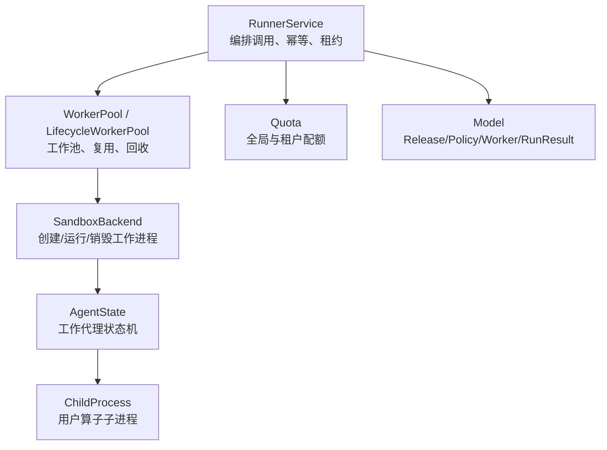
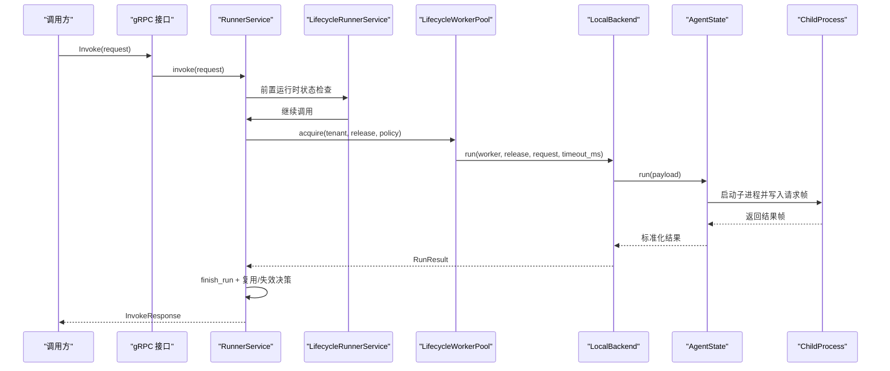
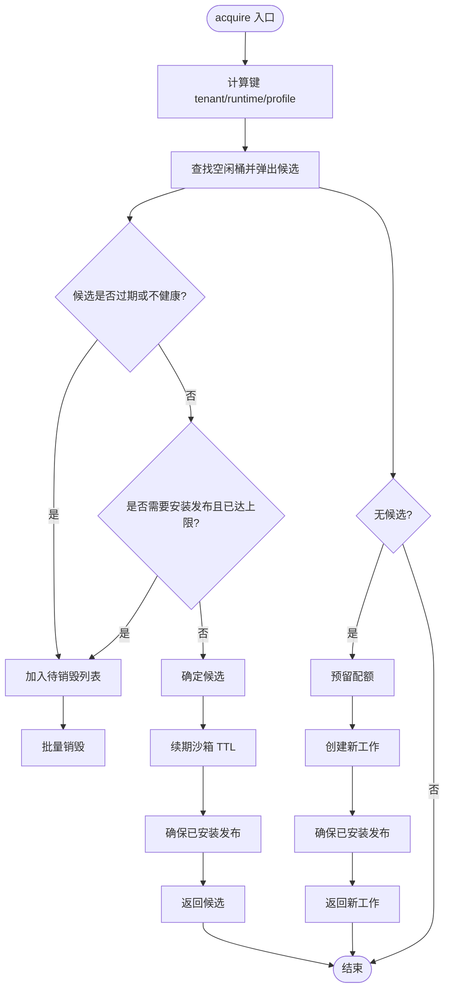
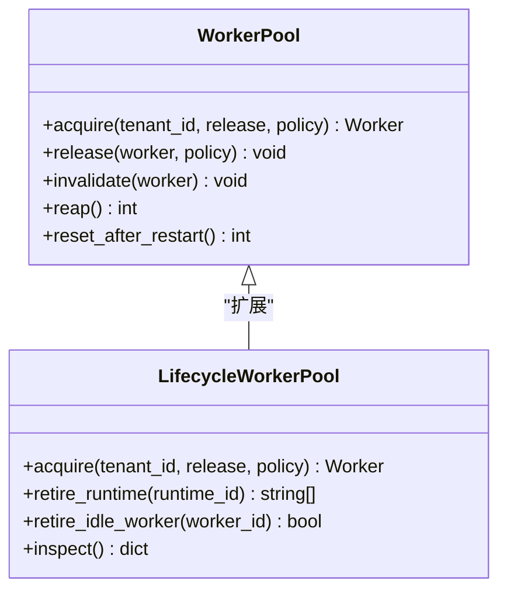
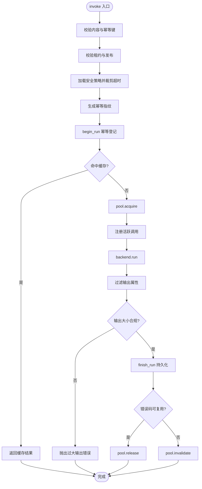
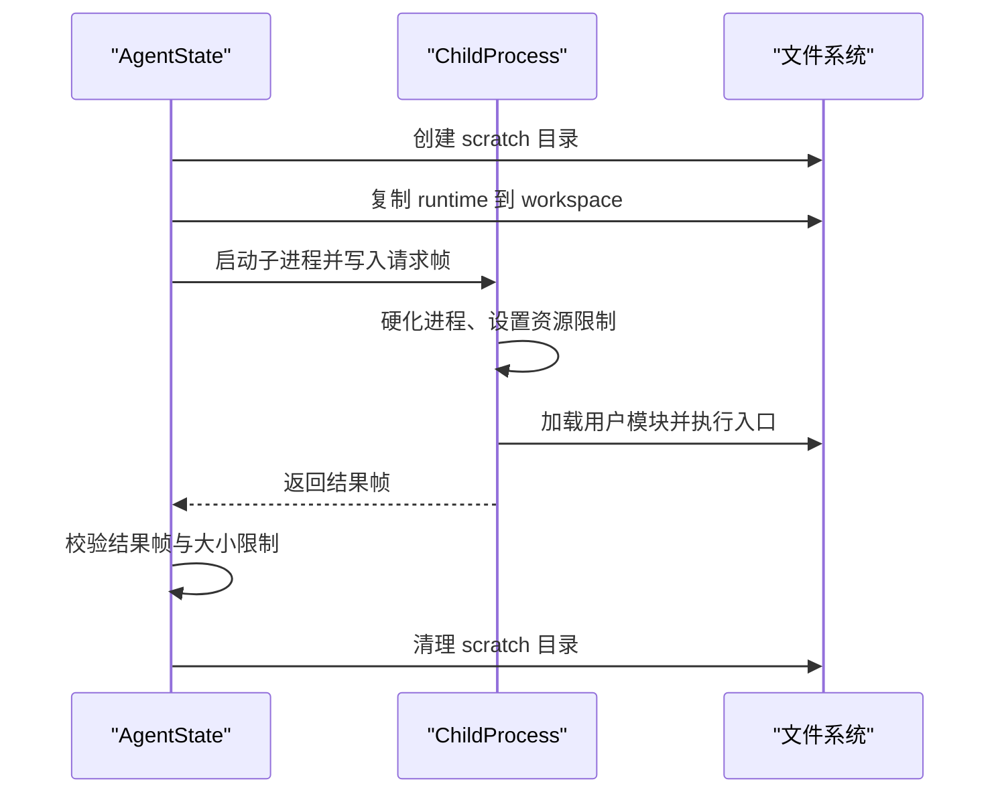
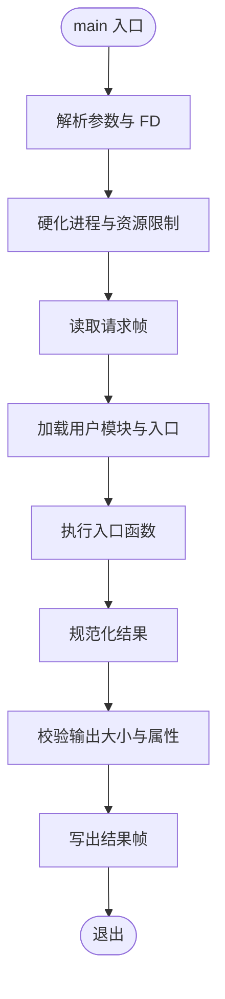
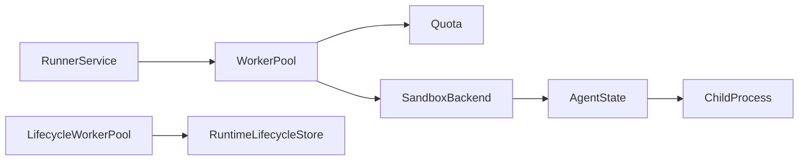

# 工作池管理

<cite>
**本文引用的文件**   
- [pool.py](file://runner_engine/pool.py)
- [lifecycle_runtime.py](file://runner_engine/lifecycle_runtime.py)
- [service.py](file://runner_engine/service.py)
- [lifecycle_service.py](file://runner_engine/lifecycle_service.py)
- [model.py](file://runner_engine/model.py)
- [quota.py](file://runner_engine/quota.py)
- [sandbox/backend.py](file://runner_engine/sandbox/backend.py)
- [sandbox/local.py](file://runner_engine/sandbox/local.py)
- [worker/agent.py](file://runner_engine/worker/agent.py)
- [worker/child.py](file://runner_engine/worker/child.py)
- [proto/runner.proto](file://proto/runner.proto)
</cite>

## 目录
1. [引言](#引言)
2. [项目结构](#项目结构)
3. [核心组件](#核心组件)
4. [架构总览](#架构总览)
5. [详细组件分析](#详细组件分析)
6. [依赖关系分析](#依赖关系分析)
7. [性能与扩缩容](#性能与扩缩容)
8. [配置、配额与沙箱集成](#配置配额与沙箱集成)
9. [故障诊断指南](#故障诊断指南)
10. [结论](#结论)

## 引言
本文围绕 Runner Engine 的工作池管理系统展开，重点解释以下能力：
- 工作进程生命周期管理：从创建、复用、健康检查到销毁。
- 资源分配与负载均衡：基于租户、运行时镜像和安全策略的隔离与共享。
- LifecycleWorkerPool：在 WorkerPool 基础上增加运行时退役门控、空闲回收和可观测性。
- WorkerAgent 通信协议：进程间通信、消息帧格式、结果校验与异常处理。
- ChildProcess 管理机制：进程隔离、资源限制、输出限制与错误分类。
- 与工作池配置、配额控制及沙箱环境的集成方式。
- 性能调优建议与常见故障诊断方法。

## 项目结构
Runner Engine 中与工作池相关的代码主要分布在以下模块：
- 工作池与调度：`runner_engine/pool.py`、`runner_engine/lifecycle_runtime.py`
- 服务编排与幂等执行：`runner_engine/service.py`、`runner_engine/lifecycle_service.py`
- 模型与配额：`runner_engine/model.py`、`runner_engine/quota.py`
- 沙箱后端抽象与本地实现：`runner_engine/sandbox/backend.py`、`runner_engine/sandbox/local.py`
- 工作代理与子进程：`runner_engine/worker/agent.py`、`runner_engine/worker/child.py`
- gRPC 接口定义：`proto/runner.proto`

**图表来源**
- [service.py:80-115](file://runner_engine/service.py#L80-L115)
- [pool.py:11-46](file://runner_engine/pool.py#L11-L46)
- [sandbox/backend.py:14-49](file://runner_engine/sandbox/backend.py#L14-L49)
- [worker/agent.py:309-377](file://runner_engine/worker/agent.py#L309-L377)
- [worker/child.py:347-414](file://runner_engine/worker/child.py#L347-L414)
- [quota.py:9-61](file://runner_engine/quota.py#L9-L61)
- [model.py:73-98](file://runner_engine/model.py#L73-L98)

**章节来源**
- [service.py:80-115](file://runner_engine/service.py#L80-L115)
- [pool.py:11-46](file://runner_engine/pool.py#L11-L46)
- [sandbox/backend.py:14-49](file://runner_engine/sandbox/backend.py#L14-L49)
- [worker/agent.py:309-377](file://runner_engine/worker/agent.py#L309-L377)
- [worker/child.py:347-414](file://runner_engine/worker/child.py#L347-L414)
- [quota.py:9-61](file://runner_engine/quota.py#L9-L61)
- [model.py:73-98](file://runner_engine/model.py#L73-L98)

## 核心组件
- WorkerPool：按租户+运行时+安全策略键维护空闲工作进程池，负责复用、TTL 续期、释放与回收。
- LifecycleWorkerPool：扩展 WorkerPool，增加运行时退役门控、获取计数统计、批量退役空闲工作。
- RunnerService：编排租约、幂等执行、属性过滤、超时裁剪、工作池调用与结果回写。
- SandboxBackend：工作进程后端的统一抽象；LocalBackend 是开发测试实现。
- AgentState：工作代理的状态机，负责安装发布包、启动子进程、读写协议帧、资源限制与清理。
- ChildProcess：用户算子子进程，负责加载用户模块、执行入口函数、规范化结果并返回。
- Quota：控制并发创建数、全局在线工作数、单租户在线工作数。
- Model：描述运行时环境、发布版本、安全策略、租约、请求、结果与工作对象。

**章节来源**
- [pool.py:11-188](file://runner_engine/pool.py#L11-L188)
- [lifecycle_runtime.py:14-120](file://runner_engine/lifecycle_runtime.py#L14-L120)
- [service.py:80-456](file://runner_engine/service.py#L80-L456)
- [sandbox/backend.py:14-49](file://runner_engine/sandbox/backend.py#L14-L49)
- [sandbox/local.py:14-132](file://runner_engine/sandbox/local.py#L14-L132)
- [worker/agent.py:309-798](file://runner_engine/worker/agent.py#L309-L798)
- [worker/child.py:272-414](file://runner_engine/worker/child.py#L272-L414)
- [quota.py:9-61](file://runner_engine/quota.py#L9-L61)
- [model.py:7-98](file://runner_engine/model.py#L7-L98)

## 架构总览
Runner Engine 的执行路径如下：
1. 上层通过 gRPC 接口发起 AcquireLease/RenewLease/Invoke/Cancel。
2. RunnerService 校验参数、过滤属性、裁剪超时、记录幂等指纹。
3. LifecycleRunnerService 在 acquire/renew/invoke 前检查运行时是否处于 RETIRING/RETIRED。
4. RunnerService 调用 LifecycleWorkerPool.acquire，根据租户、运行时与安全策略选择或创建工作进程。
5. 工作池通过 SandboxBackend.run 将请求转发给具体后端（如 LocalBackend）。
6. LocalBackend 调用 AgentState.run，后者启动 ChildProcess，使用管道传递请求与结果。
7. ChildProcess 加载用户模块并执行入口函数，规范化结果并通过协议帧返回。
8. RunnerService 将结果持久化，并根据错误类型决定是否复用或销毁工作进程。

**图表来源**
- [proto/runner.proto:8-15](file://proto/runner.proto#L8-L15)
- [service.py:188-362](file://runner_engine/service.py#L188-L362)
- [lifecycle_service.py:63-70](file://runner_engine/lifecycle_service.py#L63-L70)
- [lifecycle_runtime.py:26-40](file://runner_engine/lifecycle_runtime.py#L26-L40)
- [sandbox/local.py:78-111](file://runner_engine/sandbox/local.py#L78-L111)
- [worker/agent.py:467-778](file://runner_engine/worker/agent.py#L467-L778)
- [worker/child.py:347-414](file://runner_engine/worker/child.py#L347-L414)

## 详细组件分析

### WorkerPool：工作池调度、健康检查与自动续期
WorkerPool 以 `(tenant_id, runtime_id, profile)` 为键组织空闲工作进程桶，提供以下关键行为：
- 获取工作进程 `acquire`：
  - 优先从空闲桶中弹出候选，跳过已过期或不健康的工作。
  - 若候选未安装所需发布且已达最大安装数量，则丢弃该候选。
  - 对候选进行 TTL 续期与发布安装，更新最后使用时间。
  - 若无可用候选，则通过 Quota.reserve_live 预留配额，并在 creation_slot 内创建新工作。
- 释放工作进程 `release`：
  - 根据健康状态、reuse_sandbox 策略决定是否放回空闲桶或销毁。
- 失效与销毁 `invalidate/_destroy`：
  - 保证每个 Worker 仅销毁一次，并在 finally 中释放配额。
- 回收空闲工作 `reap`：
  - 定期扫描空闲桶，销毁超过 idle_seconds 的工作。
- 重启恢复 `reset_after_restart`：
  - 清空内存空闲表，并让后端清理托管残留。

**图表来源**
- [pool.py:73-130](file://runner_engine/pool.py#L73-L130)
- [pool.py:132-188](file://runner_engine/pool.py#L132-L188)

**章节来源**
- [pool.py:11-188](file://runner_engine/pool.py#L11-L188)

### LifecycleWorkerPool：运行时退役门控与可观测性
LifecycleWorkerPool 继承 WorkerPool，新增：
- 运行时退役门控：在 acquire 前检查运行时是否被阻塞，若是则抛出 RUNTIME_RETIRING。
- 获取计数跟踪：记录每个运行时的正在获取数量，避免竞态。
- 退役空闲工作：批量移除指定运行时的空闲工作并销毁。
- 退役单个工作：按 worker_id 从空闲桶中移除并销毁。
- 可观测性：暴露空闲工作列表与按运行时分组的获取计数。

**图表来源**
- [pool.py:11-188](file://runner_engine/pool.py#L11-L188)
- [lifecycle_runtime.py:14-120](file://runner_engine/lifecycle_runtime.py#L14-L120)

**章节来源**
- [lifecycle_runtime.py:14-120](file://runner_engine/lifecycle_runtime.py#L14-L120)

### RunnerService：编排调用、幂等与结果处理
RunnerService 的职责包括：
- 启动时清理遗留工作、标记废弃运行、清理过期租约与幂等缓存。
- 后台定时任务：回收空闲工作、清理过期数据。
- 租约管理：创建、查询、续期、释放。
- 调用流程：
  - 校验内容大小、必填幂等键。
  - 校验租约与发布，过滤输入属性，校验参数。
  - 裁剪超时不超过安全策略上限。
  - 幂等指纹去重，开始执行事务。
  - 获取工作进程，注册活跃调用，调用后端执行。
  - 过滤输出属性，校验输出大小，持久化结果。
  - 根据错误码决定复用或失效工作进程。
- 取消调用：校验归属，调用后端取消，失败时失效工作。

**图表来源**
- [service.py:188-362](file://runner_engine/service.py#L188-L362)
- [service.py:411-456](file://runner_engine/service.py#L411-L456)

**章节来源**
- [service.py:80-456](file://runner_engine/service.py#L80-L456)

### LifecycleRunnerService：运行时退役门控
LifecycleRunnerService 在 RunnerService 之上增加运行时状态检查：
- 在 acquire_lease、renew_lease、invoke 前查询运行时状态。
- 若为 RETIRED，抛出 RUNTIME_RETIRED；若为 RETIRING，抛出 RUNTIME_RETIRING 并标记 retryable。
- 注释说明：即使此处检查通过，仍会在 LifecycleWorkerPool.acquire 处再次检查，关闭竞态。

**章节来源**
- [lifecycle_service.py:7-70](file://runner_engine/lifecycle_service.py#L7-L70)

### SandboxBackend 与 LocalBackend：工作进程后端
SandboxBackend 定义了工作进程后端的最小接口：
- create：创建工作进程元信息。
- renew：续期工作进程 TTL。
- install：在工作进程中安装发布。
- run：执行调用。
- cancel：取消调用。
- destroy：销毁工作进程。
- cleanup_managed：清理托管残留。

LocalBackend 是开发测试实现：
- 使用 AgentState 作为工作代理。
- create 生成临时目录与 token，构造 Worker。
- install 调用 state.bootstrap 安装发布。
- run 调用 state.run 并将响应转换为 RunResult。
- cancel 调用 state.cancel。
- destroy/cleanup_managed 清理临时目录。

**章节来源**
- [sandbox/backend.py:14-49](file://runner_engine/sandbox/backend.py#L14-L49)
- [sandbox/local.py:14-132](file://runner_engine/sandbox/local.py#L14-L132)

### WorkerAgent：通信协议、进程管理与状态同步
AgentState 是受信任的工作代理，核心职责：
- 安装发布：接收 base64 编码的 artifact，校验 manifest id，缓存发布路径与清单。
- 健康检查：返回 ok/busy/path_compatibility。
- 准备隔离环境：
  - 为每次调用创建 scratch 目录，包含 home/tmp/cache/absolute。
  - 复制发布 runtime 目录为 workspace，并设置权限。
- 启动子进程：
  - 使用管道传递请求与结果，避免标准流污染。
  - 设置环境变量限制 CPU、文件句柄、进程数、地址空间、UID/GID。
  - 启动独立会话，传入 pass_fds。
- 输出与协议限制：
  - 限制 stdout/stderr 大小，超限则终止子进程组。
  - 限制协议帧大小，超限则终止子进程组。
- 超时与取消：
  - 等待子进程直到超时，超时则发送 SIGKILL 到进程组。
  - 支持 cancel，设置 cancel_requested 事件并终止进程组。
- 结果校验：
  - 解码帧，校验 protocol_version/type/invocation_id/result/status/relationship/content_b64/attributes/retryable/error_code/error_message。
  - 校验 content_b64 长度、attributes 数量与字节数。
- 清理：
  - 清除活跃子进程引用，终止进程组，清理用户进程，关闭 FD，删除 scratch 目录。

**图表来源**
- [worker/agent.py:399-424](file://runner_engine/worker/agent.py#L399-L424)
- [worker/agent.py:467-778](file://runner_engine/worker/agent.py#L467-L778)
- [worker/child.py:55-85](file://runner_engine/worker/child.py#L55-L85)
- [worker/child.py:272-344](file://runner_engine/worker/child.py#L272-L344)

**章节来源**
- [worker/agent.py:309-798](file://runner_engine/worker/agent.py#L309-L798)

### ChildProcess：用户算子执行与结果规范化
ChildProcess 的核心逻辑：
- 解析参数与读取请求帧，校验协议版本与类型。
- 硬化进程：禁用 core dump、限制 nofile/nproc/cpu/address space、降权 UID/GID。
- 加载用户模块：
  - 设置 sys.path 为发布根与可选依赖根。
  - 动态导入模块并获取入口函数。
- 执行入口函数：
  - 支持返回 bytes/str/dict/None。
  - 规范化结果为 status/relationship/content_b64/attributes/retryable/error_code/error_message。
- 输出校验：
  - 校验 content 大小、attributes 数量与字节数。
- 返回结果：
  - 封装为协议帧并通过结果 FD 写出。

**图表来源**
- [worker/child.py:347-414](file://runner_engine/worker/child.py#L347-L414)
- [worker/child.py:55-85](file://runner_engine/worker/child.py#L55-L85)
- [worker/child.py:272-344](file://runner_engine/worker/child.py#L272-L344)

**章节来源**
- [worker/child.py:272-414](file://runner_engine/worker/child.py#L272-L414)

### gRPC 接口与状态同步
gRPC 接口定义 ManagedPythonRunner 服务，包含 Health/AcquireLease/RenewLease/Invoke/Cancel/ReleaseLease。
- Health：返回 ok/version。
- AcquireLease：返回 lease_id 与 expires_at_epoch_ms。
- RenewLease：续租。
- Invoke：执行调用，返回状态、关系、内容、属性、重试标志、错误码、错误信息、工作 ID 与耗时。
- Cancel：取消调用。
- ReleaseLease：释放租约。

这些接口由上层服务层（如 RunnerService/LifecycleRunnerService）实现业务逻辑，并与工作池、后端、数据库交互。

**章节来源**
- [proto/runner.proto:1-76](file://proto/runner.proto#L1-L76)

## 依赖关系分析
- RunnerService 依赖 Catalog、RunnerDB、WorkerPool、SecurityPolicy。
- WorkerPool 依赖 Quota、SandboxBackend、Worker 模型。
- LifecycleWorkerPool 依赖 RuntimeLifecycleStore。
- LocalBackend 依赖 AgentState。
- AgentState 依赖 ReleaseMaterializer、subprocess、os、threading。
- ChildProcess 依赖 resource、importlib、path_virtualization。

**图表来源**
- [service.py:80-115](file://runner_engine/service.py#L80-L115)
- [pool.py:11-46](file://runner_engine/pool.py#L11-L46)
- [lifecycle_runtime.py:14-25](file://runner_engine/lifecycle_runtime.py#L14-L25)
- [sandbox/local.py:14-23](file://runner_engine/sandbox/local.py#L14-L23)
- [worker/agent.py:23-24](file://runner_engine/worker/agent.py#L23-L24)
- [worker/child.py:258-270](file://runner_engine/worker/child.py#L258-L270)

**章节来源**
- [service.py:80-115](file://runner_engine/service.py#L80-L115)
- [pool.py:11-46](file://runner_engine/pool.py#L11-L46)
- [lifecycle_runtime.py:14-25](file://runner_engine/lifecycle_runtime.py#L14-L25)
- [sandbox/local.py:14-23](file://runner_engine/sandbox/local.py#L14-L23)
- [worker/agent.py:23-24](file://runner_engine/worker/agent.py#L23-L24)
- [worker/child.py:258-270](file://runner_engine/worker/child.py#L258-L270)

## 性能与扩缩容
- 工作池复用：
  - 通过 reuse_sandbox 策略与 idle_seconds 控制空闲回收，减少重复创建开销。
  - 通过 max_installed_releases 控制每个工作安装的发布数量，避免过多安装导致内存与磁盘压力。
- TTL 续期：
  - 当剩余 TTL 小于 renew_before_seconds 或执行头room不足时，自动续期，避免执行中途过期。
- 配额控制：
  - 全局在线工作数 max_live 与单租户在线工作数 max_live_per_tenant 防止资源耗尽。
  - 并发创建数 max_creating 限制同时创建工作进程的数量。
- 后台回收：
  - RunnerService.start_background 定期回收空闲工作、清理过期租约与幂等缓存。
- 扩缩容建议：
  - 根据负载调整 max_live 与 max_live_per_tenant，避免频繁创建销毁。
  - 合理设置 idle_seconds 与 orphan_ttl_seconds，平衡复用率与资源占用。
  - 根据发布体积与安装成本调整 max_installed_releases。

[本节为通用指导，不直接分析具体文件]

## 配置、配额与沙箱集成
- 安全策略 SecurityPolicy：
  - sandbox_cluster、cpu、memory、max_timeout_ms、network_allow、reuse_sandbox。
  - 影响 RunnerService 的超时裁剪与 WorkerPool 的复用策略。
- 配额 Quota：
  - max_creating、max_live、max_live_per_tenant。
  - 在 WorkerPool.acquire 中 reserve_live，在 _destroy 中 release_live。
- 沙箱后端 SandboxBackend：
  - 抽象后端接口，LocalBackend 用于开发与测试。
  - 生产环境可使用 OpenSandboxBackend（未在本文展开）。
- 工作代理 AgentState：
  - 通过环境变量注入资源限制与路径虚拟化。
  - 支持 child_uid/gid、nproc、nofile、address_space_bytes。
- 子进程 ChildProcess：
  - 通过 resource.setrlimit 应用系统级限制。
  - 通过 path_virtualization 实现路径隔离。

**章节来源**
- [model.py:26-35](file://runner_engine/model.py#L26-L35)
- [quota.py:9-61](file://runner_engine/quota.py#L9-L61)
- [sandbox/backend.py:14-49](file://runner_engine/sandbox/backend.py#L14-L49)
- [sandbox/local.py:14-132](file://runner_engine/sandbox/local.py#L14-L132)
- [worker/agent.py:309-377](file://runner_engine/worker/agent.py#L309-L377)
- [worker/child.py:55-85](file://runner_engine/worker/child.py#L55-L85)

## 故障诊断指南
常见错误与定位要点：
- RUNTIME_RETIRING/RUNTIME_RETIRED：
  - 检查运行时是否处于退役状态，确认 LifecycleRunnerService 的前置检查与 LifecycleWorkerPool 的门控。
- QUOTA 相关错误：
  - 全局或租户在线工作数达到上限，需调整 Quota 配置或降低并发。
- TIMEOUT/CANCELLED/CPU_LIMIT：
  - 检查安全策略 max_timeout_ms 与子进程 CPU 限制，确认 RunnerService 的超时裁剪。
- LOG_LIMIT/OUTPUT_LIMIT/CHILD_PROTOCOL_ERROR：
  - 检查 stdout/stderr 与结果帧大小限制，确认 AgentState 与 ChildProcess 的限制配置。
- USER_IMPORT_ERROR/ENTRYPOINT_NOT_FOUND/USER_EXCEPTION/INVALID_USER_RESULT：
  - 检查用户模块与入口函数是否正确，确认 ChildProcess 的模块加载与结果规范化逻辑。
- INVALID_CHILD_RESPONSE：
  - 检查子进程返回的协议帧是否符合规范，确认 AgentState 的结果校验逻辑。

排查步骤建议：
1. 查看 RunnerService 的错误码与日志，确认错误发生在哪个阶段。
2. 检查工作池状态：空闲工作数量、按运行时的获取计数。
3. 检查配额使用情况：全局与租户在线工作数。
4. 检查工作代理健康状态：busy 标志与 path_compatibility。
5. 检查子进程日志与 stderr tail，定位用户代码异常。
6. 检查文件系统权限与路径虚拟化，确认 workspace 与 scratch 目录正确。

**章节来源**
- [service.py:334-362](file://runner_engine/service.py#L334-L362)
- [lifecycle_service.py:19-32](file://runner_engine/lifecycle_service.py#L19-L32)
- [worker/agent.py:696-778](file://runner_engine/worker/agent.py#L696-L778)
- [worker/child.py:313-344](file://runner_engine/worker/child.py#L313-L344)

## 结论
Runner Engine 的工作池管理系统通过 WorkerPool 与 LifecycleWorkerPool 实现了高效的工作进程复用、健康检查与自动续期，结合 Quota 控制资源使用，确保安全与稳定。RunnerService 编排了租约、幂等执行与结果持久化，LifecycleRunnerService 增加了运行时退役门控。WorkerAgent 与 ChildProcess 通过严格的协议帧与资源限制，实现了安全的进程隔离与异常处理。整体架构清晰、可扩展，适合在生产环境中进行性能调优与故障诊断。

[本节为总结，不直接分析具体文件]