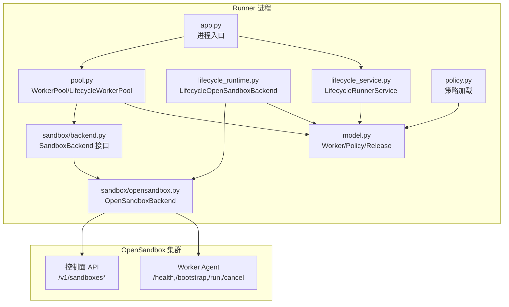
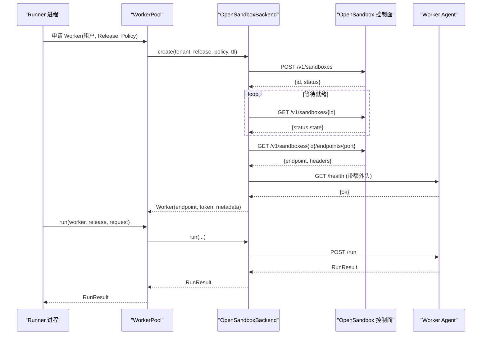
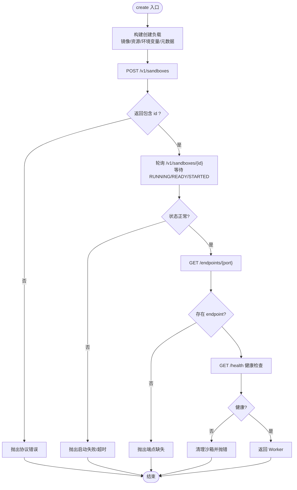
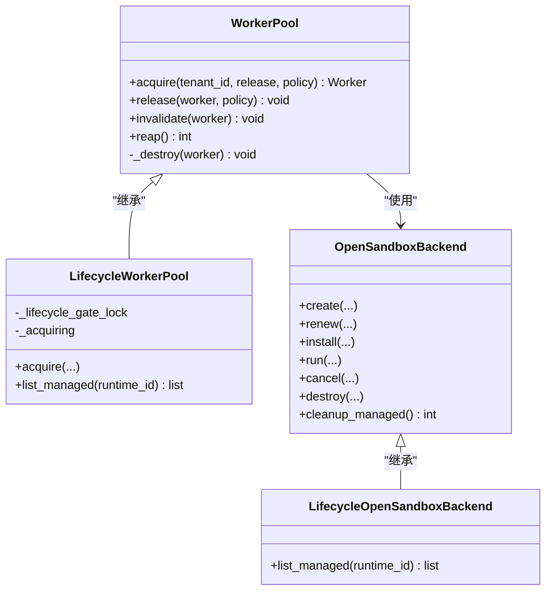
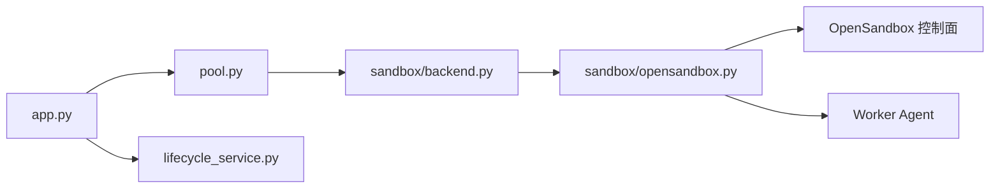

# OpenSandbox 分布式沙箱

<cite>
**本文引用的文件**   
- [runner_engine/sandbox/opensandbox.py](file://runner_engine/sandbox/opensandbox.py)
- [runner_engine/sandbox/backend.py](file://runner_engine/sandbox/backend.py)
- [runner_engine/model.py](file://runner_engine/model.py)
- [runner_engine/policy.py](file://runner_engine/policy.py)
- [runner_engine/app.py](file://runner_engine/app.py)
- [runner_engine/lifecycle_runtime.py](file://runner_engine/lifecycle_runtime.py)
- [runner_engine/lifecycle_service.py](file://runner_engine/lifecycle_service.py)
- [runner_engine/pool.py](file://runner_engine/pool.py)
- [config/opensandbox.example.json](file://config/opensandbox.example.json)
- [config/opensandbox.json](file://config/opensandbox.json)
- [infra/opensandbox/README.md](file://infra/opensandbox/README.md)
- [tests/test_opensandbox_backend.py](file://tests/test_opensandbox_backend.py)
</cite>

## 目录
1. [简介](#简介)
2. [项目结构](#项目结构)
3. [核心组件](#核心组件)
4. [架构总览](#架构总览)
5. [详细组件分析](#详细组件分析)
6. [依赖关系分析](#依赖关系分析)
7. [性能与容量规划](#性能与容量规划)
8. [部署与配置示例](#部署与配置示例)
9. [运维与故障诊断](#运维与故障诊断)
10. [结论](#结论)

## 简介
本文件面向 OpenSandbox 分布式沙箱后端，系统性说明 OpenSandboxBackend 的架构设计、集群通信协议、任务分发与资源调度策略，以及在分布式环境下的沙箱生命周期管理。文档同时覆盖集群配置管理、服务发现与健康检查机制，给出可操作的部署示例，并对比本地沙箱的差异、性能特征与适用场景，最后提供运维指南和故障诊断方法。

OpenSandboxBackend 通过 HTTP REST API 与 OpenSandbox 控制面交互，负责创建、启动、运行、续期、销毁远程沙箱，并通过内置 worker agent 进行任务执行与结果回传。Runner 侧通过 WorkerPool 实现沙箱复用、配额与空闲回收；Lifecycle 扩展则增加运行时退役门控与持久化状态联动。

## 项目结构
与 OpenSandbox 分布式沙箱直接相关的代码主要位于 runner_engine 子包中：
- sandbox：后端抽象与 OpenSandbox 具体实现
- model：领域模型（Release、Policy、Worker、RunRequest/Result）
- policy：安全策略加载
- app：进程入口，装配后端、池、服务与生命周期控制器
- lifecycle_runtime / lifecycle_service：生命周期增强与运行时退役门控
- pool：沙箱池与资源配额

图表来源
- [runner_engine/app.py:87-129](file://runner_engine/app.py#L87-L129)
- [runner_engine/pool.py:11-28](file://runner_engine/pool.py#L11-L28)
- [runner_engine/lifecycle_runtime.py:123-153](file://runner_engine/lifecycle_runtime.py#L123-L153)
- [runner_engine/lifecycle_service.py:7-32](file://runner_engine/lifecycle_service.py#L7-L32)
- [runner_engine/sandbox/backend.py:14-48](file://runner_engine/sandbox/backend.py#L14-L48)
- [runner_engine/sandbox/opensandbox.py:31-110](file://runner_engine/sandbox/opensandbox.py#L31-L110)

章节来源
- [runner_engine/app.py:26-129](file://runner_engine/app.py#L26-L129)
- [runner_engine/pool.py:11-171](file://runner_engine/pool.py#L11-L171)
- [runner_engine/lifecycle_runtime.py:14-153](file://runner_engine/lifecycle_runtime.py#L14-L153)
- [runner_engine/lifecycle_service.py:7-71](file://runner_engine/lifecycle_service.py#L7-L71)
- [runner_engine/sandbox/backend.py:14-48](file://runner_engine/sandbox/backend.py#L14-L48)
- [runner_engine/sandbox/opensandbox.py:31-440](file://runner_engine/sandbox/opensandbox.py#L31-L440)

## 核心组件
- SandboxBackend 接口：定义 create/renew/install/run/cancel/destroy/cleanup_managed 等统一能力，屏蔽不同后端差异。
- OpenSandboxBackend：基于 HTTP REST 的 OpenSandbox 适配器，封装集群访问、请求重试语义、端点发现、健康检查、任务执行与清理。
- WorkerPool：按租户+运行时+策略维度缓存 Worker，支持空闲回收、过期续期、最大安装数限制与配额控制。
- LifecycleWorkerPool / LifecycleOpenSandboxBackend：在池与后端之上叠加运行时退役门控、受管沙箱列举与清理能力。
- LifecycleRunnerService：在服务层拦截租约获取、续租与调用，确保退役中的运行时不再接受新执行。

章节来源
- [runner_engine/sandbox/backend.py:14-48](file://runner_engine/sandbox/backend.py#L14-L48)
- [runner_engine/sandbox/opensandbox.py:31-440](file://runner_engine/sandbox/opensandbox.py#L31-L440)
- [runner_engine/pool.py:11-171](file://runner_engine/pool.py#L11-L171)
- [runner_engine/lifecycle_runtime.py:14-153](file://runner_engine/lifecycle_runtime.py#L14-L153)
- [runner_engine/lifecycle_service.py:7-71](file://runner_engine/lifecycle_service.py#L7-L71)

## 架构总览
OpenSandboxBackend 作为 Runner 与 OpenSandbox 集群之间的适配层，承担以下职责：
- 集群选择：由 SecurityPolicy.sandbox_cluster 决定目标集群名称，再映射到 clusters 配置项。
- 控制面通信：使用 HTTP JSON 协议与 OpenSandbox 控制面交互，包括创建、查询、续期、删除、端点发现。
- 数据面通信：通过 Worker Agent 暴露的 /health、/bootstrap、/run、/cancel 接口完成健康检查、制品安装、任务执行与取消。
- 生命周期管理：创建后轮询状态直至 RUNNING/READY/STARTED，随后拉取端点并验证 Agent 健康；失败时自动清理已创建的沙箱。
- 资源与隔离：将 CPU、内存、网络策略、超时、元数据标签等下发给 OpenSandbox，以实现多租户隔离与安全约束。
- 清理与治理：周期性扫描受管沙箱并按 owner_id 与 managed-by 标签清理孤儿实例。

图表来源
- [runner_engine/sandbox/opensandbox.py:141-302](file://runner_engine/sandbox/opensandbox.py#L141-L302)
- [runner_engine/sandbox/opensandbox.py:339-376](file://runner_engine/sandbox/opensandbox.py#L339-L376)
- [runner_engine/pool.py:11-171](file://runner_engine/pool.py#L11-L171)

## 详细组件分析

### OpenSandboxBackend 设计与实现
- 集群访问
  - 构造时接收 clusters 字典，键为集群名，值为包含 url 与可选 api_key 的配置。
  - _cluster 根据名称查找集群，不存在抛出 UNKNOWN_SANDBOX_CLUSTER。
  - _request 统一封装 HTTP 请求，设置 Accept/Content-Type，注入 OPEN-SANDBOX-API-KEY，捕获 HTTPError/URLError/TimeoutError 并转换为 SandboxError，标记 retryable=True 以便上层重试。
- 沙箱创建流程
  - 从 SecurityPolicy.sandbox_cluster 确定集群。
  - 生成随机 token 作为 Agent 认证凭据。
  - 构建镜像、超时、CPU/内存限制、环境变量、entrypoint、metadata 等参数，POST 至 /v1/sandboxes。
  - 轮询 /v1/sandboxes/{id} 直到状态为 RUNNING/READY/STARTED，或进入 FAILED/STOPPED/ERROR/TERMINATED 时报错。
  - 获取端点 /endpoints/{agent_port}，规范化 endpoint 地址，构造 Worker 对象返回。
  - 对 Worker Agent 发起 /health 健康检查，超时或异常则清理刚创建的沙箱并报错。
- 任务执行
  - 通过 worker_call 调用 Agent 的 /run，携带 release_id、invocation_id、content_b64、attributes、parameters、timeout_ms 等。
  - 将 Agent 返回的响应映射为 RunResult，包含状态、关系、内容、属性、是否可重试、错误码/信息、耗时等。
- 续期与销毁
  - renew 调用 /renew-expiration 延长沙箱过期时间，并更新本地 Worker 过期时间。
  - destroy 调用 DELETE /v1/sandboxes/{id}，忽略 404。
- 受管清理
  - cleanup_managed 遍历所有集群，分页拉取沙箱列表，按 metadata.labels.managed-by 与 runner-owner 匹配当前 Runner 实例，批量删除。

图表来源
- [runner_engine/sandbox/opensandbox.py:141-302](file://runner_engine/sandbox/opensandbox.py#L141-L302)

章节来源
- [runner_engine/sandbox/opensandbox.py:31-440](file://runner_engine/sandbox/opensandbox.py#L31-L440)

### WorkerPool 与沙箱生命周期
- 池化策略
  - 以 (tenant_id, runtime_id, profile) 为键维护空闲 Worker 列表，避免重复创建。
  - 支持 idle_seconds 空闲超时、orphan_ttl_seconds 孤儿 TTL、renew_before_seconds 提前续期阈值、max_installed_releases 单沙箱最大安装发布数。
- 生命周期钩子
  - acquire：从池中获取或触发后端 create。
  - release：使用后更新 last_used_monotonic，若不可复用则销毁。
  - invalidate：标记不健康并销毁。
  - reap：定时回收空闲超时的 Worker。
  - _destroy：幂等销毁，调用 backend.destroy 并释放配额。
- 与配额系统协作
  - 创建前占用配额，销毁后释放，保证 live 数量上限与租户级上限。

图表来源
- [runner_engine/pool.py:11-171](file://runner_engine/pool.py#L11-L171)
- [runner_engine/lifecycle_runtime.py:14-153](file://runner_engine/lifecycle_runtime.py#L14-L153)
- [runner_engine/sandbox/opensandbox.py:31-440](file://runner_engine/sandbox/opensandbox.py#L31-L440)

章节来源
- [runner_engine/pool.py:11-171](file://runner_engine/pool.py#L11-L171)
- [runner_engine/lifecycle_runtime.py:14-153](file://runner_engine/lifecycle_runtime.py#L14-L153)

### 生命周期与退役门控
- LifecycleRunnerService 在服务层校验运行时状态，拒绝 RETIRING/RETIRED 的新租约、续租与调用。
- LifecycleWorkerPool.acquire 在获取沙箱前再次检查运行时状态，关闭竞态窗口。
- LifecycleOpenSandboxBackend.list_managed 支持按 runtime_id 过滤，便于退役期间统计与清理。

章节来源
- [runner_engine/lifecycle_service.py:7-71](file://runner_engine/lifecycle_service.py#L7-L71)
- [runner_engine/lifecycle_runtime.py:14-153](file://runner_engine/lifecycle_runtime.py#L14-L153)

### 模型与策略
- SecurityPolicy：指定 sandbox_cluster、CPU、内存、最大超时、网络白名单、是否复用沙箱。
- OperatorRelease/RuntimeEnv：描述制品与运行时镜像。
- Worker：表示一个远端沙箱实例，包含 endpoint、token、租户、运行时、策略、过期时间、运行计数、健康状态、元数据等。
- RunRequest/RunResult：任务输入输出模型。

章节来源
- [runner_engine/model.py:7-98](file://runner_engine/model.py#L7-L98)
- [runner_engine/policy.py:9-25](file://runner_engine/policy.py#L9-L25)

## 依赖关系分析
- Runner 进程装配
  - app.py 读取 clusters 与 policies，构造 LifecycleOpenSandboxBackend、LifecycleWorkerPool、LifecycleRunnerService，并启动 gRPC 服务与管理面板。
- 后端抽象解耦
  - SandboxBackend Protocol 使 Runner 与具体后端解耦，便于替换或扩展。
- 外部依赖
  - OpenSandbox 控制面：HTTP REST API，鉴权通过 OPEN-SANDBOX-API-KEY。
  - Worker Agent：HTTP API，用于健康检查、制品安装、任务执行与取消。

图表来源
- [runner_engine/app.py:87-129](file://runner_engine/app.py#L87-L129)
- [runner_engine/sandbox/backend.py:14-48](file://runner_engine/sandbox/backend.py#L14-L48)
- [runner_engine/sandbox/opensandbox.py:31-110](file://runner_engine/sandbox/opensandbox.py#L31-L110)

章节来源
- [runner_engine/app.py:26-232](file://runner_engine/app.py#L26-L232)
- [runner_engine/sandbox/backend.py:14-48](file://runner_engine/sandbox/backend.py#L14-L48)
- [runner_engine/sandbox/opensandbox.py:31-110](file://runner_engine/sandbox/opensandbox.py#L31-L110)

## 性能与容量规划
- 并发与限流
  - 通过环境变量 RUNNER_MAX_CREATING、RUNNER_MAX_LIVE、RUNNER_MAX_LIVE_PER_TENANT 控制创建并发、在线沙箱总数与租户级上限。
- 沙箱复用
  - reuse_sandbox 开启时，相同租户+运行时+策略的沙箱可被复用，减少冷启动开销。
- 空闲回收与续期
  - idle_seconds 控制空闲回收周期；orphan_ttl_seconds 控制孤儿 TTL；renew_before_seconds 控制提前续期阈值，避免到期中断。
- 单沙箱制品缓存
  - max_installed_releases 限制单个沙箱内安装的发布数量，平衡内存与复用收益。
- 网络与超时
  - 控制面请求默认 30s 超时；Agent 健康检查 1s；任务执行超时 = timeout_ms + 10s 缓冲；销毁/取消分别有独立超时。

[本节为通用指导，不直接分析具体文件]

## 部署与配置示例

### 集群配置
- 配置文件位置
  - 默认路径：./config/opensandbox.json，可通过 --clusters 或 RUNNER_CLUSTERS 环境变量覆盖。
- 配置结构
  - 每个集群项包含 url 与 api_key。示例中包含 gvisor 与 kata 两个隔离类集群。
- 安全建议
  - 将 OpenSandbox 与 Worker 端点置于私有网络；启用 secureAccess，Runner 会转发 OpenSandbox 返回的额外头部。

章节来源
- [runner_engine/app.py:51-57](file://runner_engine/app.py#L51-L57)
- [config/opensandbox.example.json:1-11](file://config/opensandbox.example.json#L1-L11)
- [config/opensandbox.json:1-11](file://config/opensandbox.json#L1-L11)
- [infra/opensandbox/README.md:1-27](file://infra/opensandbox/README.md#L1-L27)

### 策略与运行时选择
- 策略文件
  - 默认路径：./config/policies.json，可通过 --policies 或 RUNNER_POLICIES 环境变量覆盖。
- 策略字段
  - sandbox_cluster：选择 OpenSandbox 集群名。
  - cpu/memory：资源限制。
  - max_timeout_ms：最大任务超时。
  - network_allow：出站网络白名单。
  - reuse_sandbox：是否复用沙箱。

章节来源
- [runner_engine/policy.py:9-25](file://runner_engine/policy.py#L9-L25)
- [runner_engine/model.py:26-35](file://runner_engine/model.py#L26-L35)

### 进程启动与服务
- 关键参数
  - --listen：gRPC 监听地址。
  - --db-url：数据库连接串。
  - --owner-id：Runner 实例标识，用于受管沙箱清理。
  - --tls-cert/--tls-key/--client-ca：TLS 与客户端证书。
  - --acl：访问控制列表。
- 后台任务
  - reaper 间隔由 RUNNER_REAPER_INTERVAL_SECONDS 控制。
  - 管理面板端口由 RUNNER_ADMIN_LISTEN/RUNNER_ADMIN_PORT 控制，需设置 RUNNER_ADMIN_TOKEN 启用。

章节来源
- [runner_engine/app.py:26-74](file://runner_engine/app.py#L26-L74)
- [runner_engine/app.py:156-232](file://runner_engine/app.py#L156-L232)

## 运维与故障诊断

### 常见问题定位
- 未知集群
  - 现象：创建失败，错误码 UNKNOWN_SANDBOX_CLUSTER。
  - 原因：SecurityPolicy.sandbox_cluster 未在 clusters 配置中存在。
  - 处理：核对策略与集群配置一致性。
- 控制面不可达
  - 现象：OPENSANDBOX_UNREACHABLE 或 OPENSANDBOX_HTTP。
  - 原因：网络不通、API Key 错误或控制面返回非 2xx。
  - 处理：检查网络连通性、鉴权头、控制面日志。
- 沙箱启动失败或超时
  - 现象：SANDBOX_START_FAILED/SANDBOX_START_TIMEOUT。
  - 原因：镜像拉取失败、资源不足、策略不合法。
  - 处理：查看 OpenSandbox 控制面日志，确认镜像与资源配额。
- Agent 未就绪
  - 现象：AGENT_START_TIMEOUT。
  - 原因：Worker Agent 未成功启动或未通过 /health。
  - 处理：检查 Agent 端口、环境变量、制品安装过程。
- 端点缺失
  - 现象：SANDBOX_ENDPOINT_MISSING。
  - 原因：OpenSandbox 未返回 endpoint/url。
  - 处理：检查控制面版本与端点发现逻辑。

章节来源
- [runner_engine/sandbox/opensandbox.py:52-110](file://runner_engine/sandbox/opensandbox.py#L52-L110)
- [runner_engine/sandbox/opensandbox.py:192-302](file://runner_engine/sandbox/opensandbox.py#L192-L302)

### 监控与观测
- 管理面板
  - 启用 RUNNER_ADMIN_TOKEN 后，可访问管理 HTTP 服务，观察生命周期与沙箱状态。
- 指标与日志
  - 结合 OpenSandbox 控制面与 Runner 日志，关注创建成功率、Agent 健康率、任务耗时分布、配额使用率。
- 退役治理
  - 使用 LifecycleOpenSandboxBackend.list_managed 按 runtime_id 过滤，辅助退役期间的沙箱清理与审计。

章节来源
- [runner_engine/app.py:170-210](file://runner_engine/app.py#L170-L210)
- [runner_engine/lifecycle_runtime.py:123-153](file://runner_engine/lifecycle_runtime.py#L123-L153)

### 测试与验证
- 单元测试
  - tests/test_opensandbox_backend.py 验证 create 流程、策略下发、元数据长度限制与端点头透传。
- 集成测试
  - integration/apply_lifecycle_integration.py 演示如何装配 LifecycleOpenSandboxBackend 与 LifecycleWorkerPool。

章节来源
- [tests/test_opensandbox_backend.py:1-59](file://tests/test_opensandbox_backend.py#L1-L59)
- [integration/apply_lifecycle_integration.py:261-292](file://integration/apply_lifecycle_integration.py#L261-L292)

## 结论
OpenSandboxBackend 为 Runner 提供了稳定、可扩展的分布式沙箱后端能力。它通过明确的 HTTP 协议与 OpenSandbox 控制面及 Worker Agent 交互，实现了沙箱的创建、健康检查、任务执行与清理。配合 WorkerPool 与 Lifecycle 扩展，Runner 能够在多集群环境下实现资源隔离、负载均衡（通过策略选择集群）、故障转移（通过重试与清理）与生命周期治理。在生产环境中，应合理配置集群、策略、配额与超时参数，并结合管理面板与日志进行持续观测与排障。