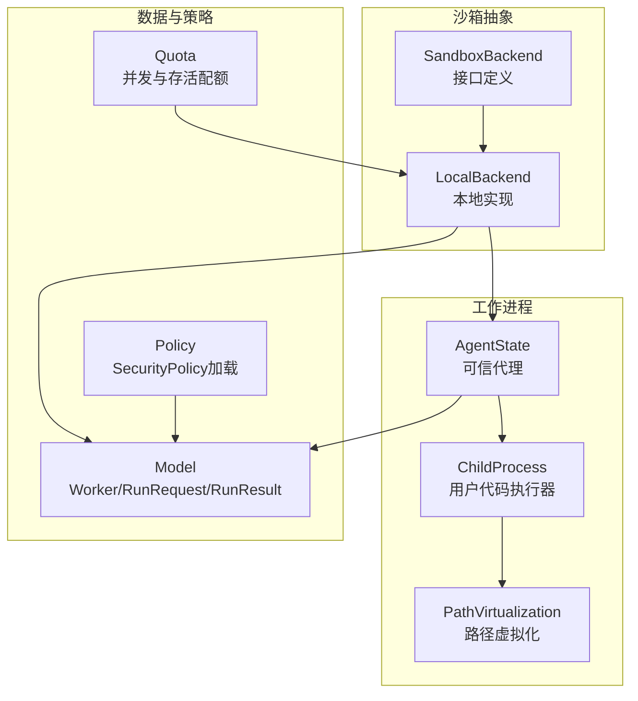
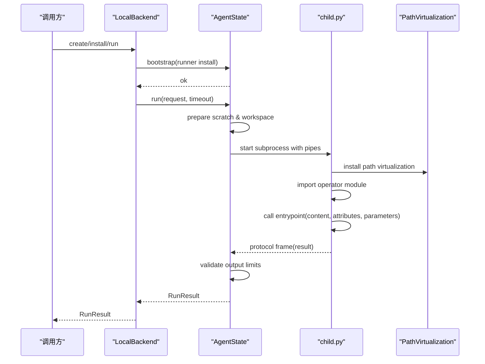
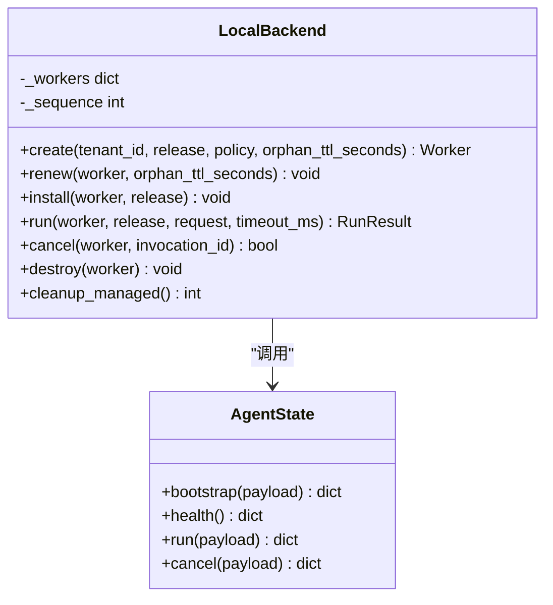
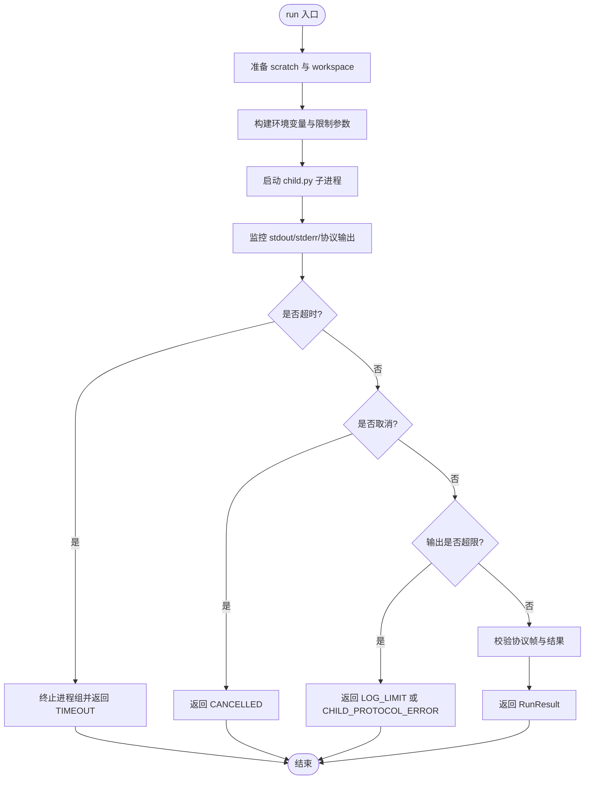
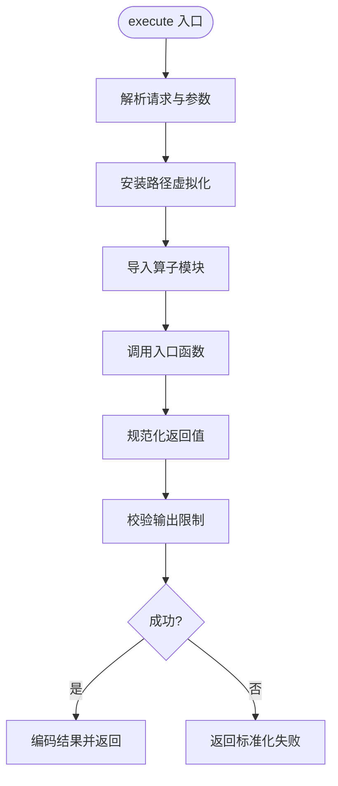
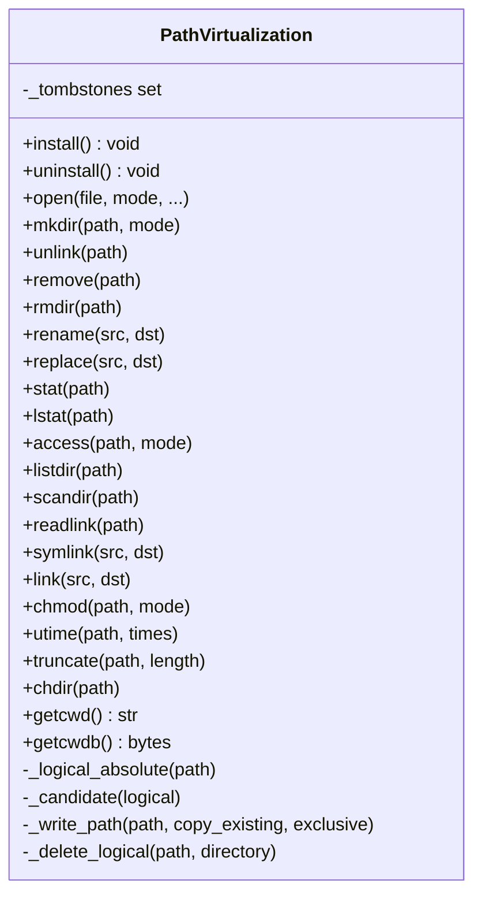
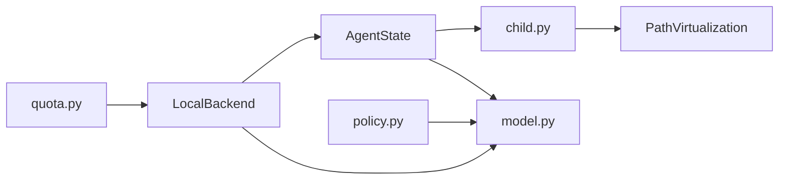

# 本地沙箱后端

<cite>
**本文引用的文件**   
- [runner_engine/sandbox/local.py](file://runner_engine/sandbox/local.py)
- [runner_engine/sandbox/backend.py](file://runner_engine/sandbox/backend.py)
- [runner_engine/worker/agent.py](file://runner_engine/worker/agent.py)
- [runner_engine/worker/child.py](file://runner_engine/worker/child.py)
- [runner_engine/worker/path_virtualization.py](file://runner_engine/worker/path_virtualization.py)
- [runner_engine/model.py](file://runner_engine/model.py)
- [runner_engine/policy.py](file://runner_engine/policy.py)
- [runner_engine/quota.py](file://runner_engine/quota.py)
</cite>

## 目录
1. [引言](#引言)
2. [项目结构](#项目结构)
3. [核心组件](#核心组件)
4. [架构总览](#架构总览)
5. [详细组件分析](#详细组件分析)
6. [依赖关系分析](#依赖关系分析)
7. [性能与资源限制](#性能与资源限制)
8. [配置示例](#配置示例)
9. [故障排查指南](#故障排查指南)
10. [结论](#结论)

## 引言
本文面向“本地沙箱后端”的实现与使用，重点解释 LocalSandboxBackend（代码中为 `LocalBackend`）的工作原理。它通过本地进程隔离、文件系统路径虚拟化、以及严格的输出与协议边界，为算子执行提供轻量级、可测试的运行时环境。需要特别强调：该实现明确声明不是安全沙箱，主要用于开发与测试场景；生产环境的强隔离应结合其他后端或操作系统级能力。

## 项目结构
围绕本地沙箱的相关代码主要分布在以下模块：
- 沙箱后端接口与本地实现：`runner_engine/sandbox/backend.py`、`runner_engine/sandbox/local.py`
- 可信代理与工作进程：`runner_engine/worker/agent.py`、`runner_engine/worker/child.py`
- 文件系统虚拟化层：`runner_engine/worker/path_virtualization.py`
- 模型与安全策略：`runner_engine/model.py`、`runner_engine/policy.py`
- 配额控制：`runner_engine/quota.py`

**图表来源**
- [runner_engine/sandbox/backend.py:14-49](file://runner_engine/sandbox/backend.py#L14-L49)
- [runner_engine/sandbox/local.py:14-132](file://runner_engine/sandbox/local.py#L14-L132)
- [runner_engine/worker/agent.py:309-797](file://runner_engine/worker/agent.py#L309-L797)
- [runner_engine/worker/child.py:272-344](file://runner_engine/worker/child.py#L272-L344)
- [runner_engine/worker/path_virtualization.py:62-171](file://runner_engine/worker/path_virtualization.py#L62-L171)
- [runner_engine/model.py:7-98](file://runner_engine/model.py#L7-L98)
- [runner_engine/policy.py:9-24](file://runner_engine/policy.py#L9-L24)
- [runner_engine/quota.py:9-61](file://runner_engine/quota.py#L9-L61)

**章节来源**
- [runner_engine/sandbox/backend.py:1-49](file://runner_engine/sandbox/backend.py#L1-L49)
- [runner_engine/sandbox/local.py:1-132](file://runner_engine/sandbox/local.py#L1-L132)
- [runner_engine/worker/agent.py:1-800](file://runner_engine/worker/agent.py#L1-L800)
- [runner_engine/worker/child.py:1-414](file://runner_engine/worker/child.py#L1-L414)
- [runner_engine/worker/path_virtualization.py:1-739](file://runner_engine/worker/path_virtualization.py#L1-L739)
- [runner_engine/model.py:1-98](file://runner_engine/model.py#L1-L98)
- [runner_engine/policy.py:1-25](file://runner_engine/policy.py#L1-L25)
- [runner_engine/quota.py:1-61](file://runner_engine/quota.py#L1-L61)

## 核心组件
- `SandboxBackend`：定义沙箱后端的统一接口，包括创建、续租、安装发布包、运行、取消、销毁和清理托管实例等方法。
- `LocalBackend`：本地开发/测试后端，不启动真实容器，而是通过内存中的 `AgentState` 管理工作进程生命周期，并使用临时目录作为工作空间。
- `AgentState`：可信代理，负责安装发布包、准备隔离的工作目录、启动并监控子进程、限制日志与协议输出大小、处理超时与取消。
- `child.py`：用户代码执行器，在受限环境中导入并调用算子入口函数，规范化返回结果，并进行输出校验。
- `PathVirtualization`：Python 级别的文件系统兼容层，将绝对路径写入重定向到调用根下的虚拟目录，读取时优先使用本地覆盖版本。
- `model.py`：定义 `Worker`、`RunRequest`、`RunResult`、`SecurityPolicy` 等核心数据结构。
- `policy.py`：从配置文件加载安全策略，映射到 `SecurityPolicy`。
- `quota.py`：控制全局与租户维度的沙箱并发与存活数量。

**章节来源**
- [runner_engine/sandbox/backend.py:14-49](file://runner_engine/sandbox/backend.py#L14-L49)
- [runner_engine/sandbox/local.py:14-132](file://runner_engine/sandbox/local.py#L14-L132)
- [runner_engine/worker/agent.py:309-797](file://runner_engine/worker/agent.py#L309-L797)
- [runner_engine/worker/child.py:272-344](file://runner_engine/worker/child.py#L272-L344)
- [runner_engine/worker/path_virtualization.py:62-171](file://runner_engine/worker/path_virtualization.py#L62-L171)
- [runner_engine/model.py:7-98](file://runner_engine/model.py#L7-L98)
- [runner_engine/policy.py:9-24](file://runner_engine/policy.py#L9-L24)
- [runner_engine/quota.py:9-61](file://runner_engine/quota.py#L9-L61)

## 架构总览
本地沙箱的执行流程由三层组成：
1. 后端层：`LocalBackend` 接收上层调度请求，创建或复用 `Worker`，并通过 `AgentState` 完成安装与运行。
2. 代理层：`AgentState` 准备隔离工作目录、设置环境变量、启动 `child.py` 子进程，并监控其标准输出、错误输出与协议通道。
3. 执行层：`child.py` 在受限环境中加载算子模块、调用入口函数、规范化结果并写回协议帧。

**图表来源**
- [runner_engine/sandbox/local.py:67-111](file://runner_engine/sandbox/local.py#L67-L111)
- [runner_engine/worker/agent.py:467-778](file://runner_engine/worker/agent.py#L467-L778)
- [runner_engine/worker/child.py:272-344](file://runner_engine/worker/child.py#L272-L344)
- [runner_engine/worker/path_virtualization.py:258-270](file://runner_engine/worker/path_virtualization.py#L258-L270)

## 详细组件分析

### LocalBackend：本地沙箱后端
- 职责
  - 创建工作进程标识、令牌与临时目录。
  - 初始化 `AgentState`，注入释放根、调用根、依赖根、子进程 UID/GID、文件描述符与进程数限制。
  - 安装发布包：将 artifact 解码并传给 `AgentState.bootstrap`。
  - 运行算子：构造 `RunRequest` 参数，调用 `AgentState.run`，并将响应转换为 `RunResult`。
  - 取消与销毁：支持按调用 ID 取消，清理临时目录。
- 关键行为
  - 工作进程端点为本地状态地址，用于开发测试。
  - 默认输出字节上限、属性数量与属性字节上限在运行阶段传入。
  - 临时目录权限设置为可读可执行，便于子进程访问。

**图表来源**
- [runner_engine/sandbox/local.py:14-132](file://runner_engine/sandbox/local.py#L14-L132)
- [runner_engine/worker/agent.py:309-797](file://runner_engine/worker/agent.py#L309-L797)

**章节来源**
- [runner_engine/sandbox/local.py:14-132](file://runner_engine/sandbox/local.py#L14-L132)

### AgentState：可信代理与工作进程管理
- 职责
  - 安装发布包：验证 manifest id，缓存 release 根与清单。
  - 准备隔离工作区：为每次调用创建 scratch 目录，包含 home/tmp/cache/absolute 子目录，并设置严格权限。
  - 复制 runtime 工作空间：将 release 的 runtime 目录复制到 scratch/workspace，确保用户代码拥有可写权限。
  - 启动 child 进程：通过管道传递请求与结果，设置环境变量，限制 CPU、内存、文件描述符、进程数与地址空间。
  - 监控与恢复：限制 stdout/stderr 与协议帧大小，处理超时、取消、信号与异常退出。
  - 清理：关闭文件描述符、终止进程组、清理用户进程、删除 scratch 目录。
- 关键行为
  - 单调用串行化：通过 `_run_gate` 保证同一 agent 同时只运行一个用户调用。
  - 活跃子进程跟踪：通过 `_active_child` 支持按 invocation_id 取消。
  - 安全加固：在非 Windows 平台尝试禁用 core dump、限制资源、切换非特权 UID/GID。

**图表来源**
- [runner_engine/worker/agent.py:467-778](file://runner_engine/worker/agent.py#L467-L778)

**章节来源**
- [runner_engine/worker/agent.py:309-797](file://runner_engine/worker/agent.py#L309-L797)

### child.py：用户代码执行器
- 职责
  - 解析请求信封，设置 sys.path，安装路径虚拟化层。
  - 动态导入算子模块并调用入口函数。
  - 规范化返回值：支持 bytes/str/dict/None，校验 status、relationship、retryable、attributes、error_code/message。
  - 输出限制：校验 content 字节数、attributes 数量与字节数。
  - 安全加固：禁用新增特权、限制 core dump、文件描述符、进程数、CPU 时间、地址空间，必要时切换 UID/GID。
- 关键行为
  - 协议帧：固定魔数与长度头，限制最大请求与结果大小。
  - 异常处理：捕获导入错误、入口缺失、用户异常，返回标准化失败结果。
  - 资源限制：通过环境变量控制 RLIMIT_* 参数。

**图表来源**
- [runner_engine/worker/child.py:272-344](file://runner_engine/worker/child.py#L272-L344)
- [runner_engine/worker/child.py:159-227](file://runner_engine/worker/child.py#L159-L227)
- [runner_engine/worker/child.py:230-246](file://runner_engine/worker/child.py#L230-L246)
- [runner_engine/worker/child.py:55-84](file://runner_engine/worker/child.py#L55-L84)

**章节来源**
- [runner_engine/worker/child.py:1-414](file://runner_engine/worker/child.py#L1-L414)

### PathVirtualization：文件系统虚拟化层
- 设计目标
  - 相对路径保持正常 cwd 语义。
  - 绝对写入重定向到 `<invocation_root>/absolute/<original>`。
  - 绝对读取优先使用调用本地覆盖版本，否则回退到真实容器路径。
  - 明确说明这不是操作系统级沙箱；原生代码或子进程可能绕过 Python 文件系统 API，仍受非特权 UID/GID 约束。
- 关键机制
  - 重写 builtins.open、io.open、os.* 系列方法。
  - 逻辑绝对路径计算与候选路径生成。
  - 墓碑机制：删除操作标记逻辑路径为墓碑，避免后续读取显示已删除项。
  - 父目录物化：按需将真实目录结构复制到虚拟命名空间。
  - 符号链接保护：禁止在虚拟绝对路径中使用符号链接父目录或绝对符号链接目标。
  - 列表与扫描：合并真实与虚拟目录条目，隐藏墓碑项。
  - chdir/getcwd：将虚拟根映射为 `/`，保持调用者视角一致。

**图表来源**
- [runner_engine/worker/path_virtualization.py:62-171](file://runner_engine/worker/path_virtualization.py#L62-L171)
- [runner_engine/worker/path_virtualization.py:173-320](file://runner_engine/worker/path_virtualization.py#L173-L320)
- [runner_engine/worker/path_virtualization.py:321-739](file://runner_engine/worker/path_virtualization.py#L321-L739)

**章节来源**
- [runner_engine/worker/path_virtualization.py:1-739](file://runner_engine/worker/path_virtualization.py#L1-L739)

### 模型与安全策略
- `model.py`
  - `RuntimeEnv`：运行时环境标识、镜像与 Python 版本。
  - `OperatorRelease`：算子发布包标识、artifact 路径与摘要、运行时信息、入口点、输入输出属性白名单。
  - `SecurityPolicy`：策略名称、目标集群、CPU/内存配额、最大超时、网络允许列表、是否复用沙箱。
  - `RunRequest`/`RunResult`/`Worker`：运行请求、结果与工作进程元数据。
- `policy.py`
  - 从 JSON 文件加载策略，映射到 `SecurityPolicy`，包含 cpu/memory/max_timeout_ms/network_allow/reuse_sandbox。

**章节来源**
- [runner_engine/model.py:7-98](file://runner_engine/model.py#L7-L98)
- [runner_engine/policy.py:9-24](file://runner_engine/policy.py#L9-L24)

### 配额控制
- `quota.py`
  - 控制创建并发与存活沙箱总数，以及每租户存活上限。
  - 提供 `creation_slot` 上下文管理器与 `reserve_live`/`release_live` 接口。
  - 超出配额抛出 `QuotaError`，标记为可重试。

**章节来源**
- [runner_engine/quota.py:9-61](file://runner_engine/quota.py#L9-L61)

## 依赖关系分析
- 耦合关系
  - `LocalBackend` 依赖 `AgentState` 进行实际执行，依赖 `model.py` 的数据结构。
  - `AgentState` 依赖 `child.py` 执行用户代码，依赖 `path_virtualization.py` 进行文件系统兼容。
  - `policy.py` 与 `model.py` 解耦，仅负责策略加载。
  - `quota.py` 独立于具体后端，但通常与后端创建/销毁流程配合。
- 外部依赖
  - 操作系统资源限制：`resource`、`ctypes`、`signal`、`subprocess`。
  - 文件系统：`pathlib`、`shutil`、`tempfile`。
  - 网络：当前本地后端未直接发起网络访问，但策略中包含 `network_allow` 字段，供上层调度决定。

**图表来源**
- [runner_engine/sandbox/local.py:14-132](file://runner_engine/sandbox/local.py#L14-L132)
- [runner_engine/worker/agent.py:309-797](file://runner_engine/worker/agent.py#L309-L797)
- [runner_engine/worker/child.py:272-344](file://runner_engine/worker/child.py#L272-L344)
- [runner_engine/worker/path_virtualization.py:62-171](file://runner_engine/worker/path_virtualization.py#L62-L171)
- [runner_engine/model.py:7-98](file://runner_engine/model.py#L7-L98)
- [runner_engine/policy.py:9-24](file://runner_engine/policy.py#L9-L24)
- [runner_engine/quota.py:9-61](file://runner_engine/quota.py#L9-L61)

**章节来源**
- [runner_engine/sandbox/local.py:14-132](file://runner_engine/sandbox/local.py#L14-L132)
- [runner_engine/worker/agent.py:309-797](file://runner_engine/worker/agent.py#L309-L797)
- [runner_engine/worker/child.py:272-344](file://runner_engine/worker/child.py#L272-L344)
- [runner_engine/worker/path_virtualization.py:62-171](file://runner_engine/worker/path_virtualization.py#L62-L171)
- [runner_engine/model.py:7-98](file://runner_engine/model.py#L7-L98)
- [runner_engine/policy.py:9-24](file://runner_engine/policy.py#L9-L24)
- [runner_engine/quota.py:9-61](file://runner_engine/quota.py#L9-L61)

## 性能与资源限制
- 进程隔离
  - 子进程通过 `start_new_session=True` 与管道通信，避免继承不必要的文件描述符。
  - 非 Windows 平台尝试禁用 core dump，限制 RLIMIT_NOFILE、RLIMIT_NPROC、RLIMIT_CPU、RLIMIT_AS。
  - 当以 root 运行时，尝试切换到非特权 UID/GID 并清空附加组。
- 输出限制
  - 标准输出与错误输出分别限制为 1MB，超过则终止进程组并返回 `LOG_LIMIT`。
  - 协议帧大小根据输出与属性限制动态计算，防止内存膨胀。
  - 用户结果 content 与 attributes 有字节数与数量上限，超出返回 `OUTPUT_LIMIT` 或 `CHILD_PROTOCOL_ERROR`。
- 超时与取消
  - 超时后先发送 SIGKILL 到进程组，再等待短窗口，若仍未退出则强制 kill。
  - 取消通过事件标志与进程组终止实现，返回 `CANCELLED`。
- 文件系统虚拟化开销
  - 路径虚拟化在 Python 层拦截常见 API，带来一定开销；适用于大多数 Python 库，但不覆盖原生扩展或子进程直接系统调用。
- 建议优化
  - 合理设置 `RUNNER_CHILD_NOFILE`、`RUNNER_CHILD_NPROC`、`RUNNER_CHILD_CPU_SECONDS`、`RUNNER_CHILD_ADDRESS_SPACE_BYTES`。
  - 调整 `RUNNER_MAX_OUTPUT_BYTES`、`RUNNER_MAX_ATTRIBUTES`、`RUNNER_MAX_ATTRIBUTE_BYTES` 以匹配业务负载。
  - 对大输出场景考虑分块或流式处理，避免单次协议帧过大。

**章节来源**
- [runner_engine/worker/child.py:55-84](file://runner_engine/worker/child.py#L55-L84)
- [runner_engine/worker/child.py:230-246](file://runner_engine/worker/child.py#L230-L246)
- [runner_engine/worker/agent.py:112-167](file://runner_engine/worker/agent.py#L112-L167)
- [runner_engine/worker/agent.py:674-778](file://runner_engine/worker/agent.py#L674-L778)

## 配置示例
以下为本地沙箱相关的环境变量与策略配置建议，帮助设置隔离级别与性能参数：

- 环境变量（作用于 child 进程）
  - `RUNNER_CHILD_UID`：子进程有效用户 ID，默认继承或设为非特权用户。
  - `RUNNER_CHILD_GID`：子进程有效组 ID。
  - `RUNNER_CHILD_NOFILE`：文件描述符上限，默认 256。
  - `RUNNER_CHILD_NPROC`：进程数上限，默认 64。
  - `RUNNER_CHILD_CPU_SECONDS`：CPU 时间上限，通常基于超时计算。
  - `RUNNER_CHILD_ADDRESS_SPACE_BYTES`：地址空间上限，默认 0 表示不限制。
  - `RUNNER_MAX_OUTPUT_BYTES`：输出字节上限，默认 8MB。
  - `RUNNER_MAX_ATTRIBUTES`：属性数量上限，默认 128。
  - `RUNNER_MAX_ATTRIBUTE_BYTES`：属性字节上限，默认 64KB。
  - `RUNNER_RUNTIME_ROOT`：runtime 工作空间根路径。
  - `RUNNER_INVOCATION_ROOT`：调用根路径，用于路径虚拟化。
  - `RUNNER_DEPENDENCY_ROOT`：依赖根路径，可选。

- 安全策略（JSON）
  - `sandbox_cluster`：目标集群标识。
  - `cpu`：CPU 配额字符串，如 `"1"`。
  - `memory`：内存配额字符串，如 `"512Mi"`。
  - `max_timeout_ms`：最大超时毫秒数，如 `60000`。
  - `network_allow`：允许的网络规则列表。
  - `reuse_sandbox`：是否复用沙箱，布尔值。

- 配额（代码内）
  - `max_creating`：创建并发上限，默认 8。
  - `max_live`：全局存活沙箱上限，默认 64。
  - `max_live_per_tenant`：每租户存活上限，默认 16。

**章节来源**
- [runner_engine/worker/child.py:55-84](file://runner_engine/worker/child.py#L55-L84)
- [runner_engine/worker/child.py:230-246](file://runner_engine/worker/child.py#L230-L246)
- [runner_engine/worker/agent.py:546-567](file://runner_engine/worker/agent.py#L546-L567)
- [runner_engine/policy.py:9-24](file://runner_engine/policy.py#L9-L24)
- [runner_engine/quota.py:12-26](file://runner_engine/quota.py#L12-L26)

## 故障排查指南
- 常见问题与定位
  - 用户导入错误：检查 `USER_IMPORT_ERROR`，确认算子模块路径与依赖是否正确。
  - 入口函数不存在：检查 `ENTRYPOINT_NOT_FOUND`，确认 manifest 中 entrypoint 与模块导出一致。
  - 用户异常：查看 `USER_EXCEPTION` 与 stderr tail，定位用户代码异常堆栈。
  - 输出超限：检查 `OUTPUT_LIMIT` 或 `LOG_LIMIT`，调整 `RUNNER_MAX_OUTPUT_BYTES` 与日志限制。
  - 协议错误：检查 `CHILD_PROTOCOL_ERROR`，确认 child 进程是否正常返回协议帧。
  - 超时：检查 `TIMEOUT`，评估业务耗时与 `timeout_ms` 设置。
  - 取消：检查 `CANCELLED`，确认上层是否主动取消调用。
  - 进程被信号终止：检查 `CPU_LIMIT` 或 `USER_PROCESS_SIGNALED`，评估 CPU 限制与资源分配。
- 排查步骤
  - 启用更详细的 stderr 收集，关注 `_tail(stderr)` 输出。
  - 检查环境变量是否正确注入，尤其是 `RUNNER_RUNTIME_ROOT`、`RUNNER_INVOCATION_ROOT`、`RUNNER_DEPENDENCY_ROOT`。
  - 验证路径虚拟化是否生效，确认绝对路径写入是否重定向到调用根下的 absolute 目录。
  - 检查配额是否达到上限，导致创建或运行被拒绝。
  - 对于原生扩展或子进程绕过 Python API 的情况，确认非特权 UID/GID 与 OS 级限制是否足够。

**章节来源**
- [runner_engine/worker/child.py:296-327](file://runner_engine/worker/child.py#L296-L327)
- [runner_engine/worker/child.py:230-246](file://runner_engine/worker/child.py#L230-L246)
- [runner_engine/worker/agent.py:696-778](file://runner_engine/worker/agent.py#L696-L778)
- [runner_engine/worker/agent.py:724-755](file://runner_engine/worker/agent.py#L724-L755)

## 结论
本地沙箱后端通过 `LocalBackend` 与 `AgentState` 协作，提供了轻量级的本地执行环境。它在开发测试场景中具备快速迭代与较低部署成本的优势，同时通过路径虚拟化、输出限制、超时与取消机制保障基本稳定性。需要注意的是，该实现并非安全沙箱；在生产环境中应结合操作系统级隔离、容器化或专用后端，以满足更强的权限控制、网络访问限制与资源配额管理需求。