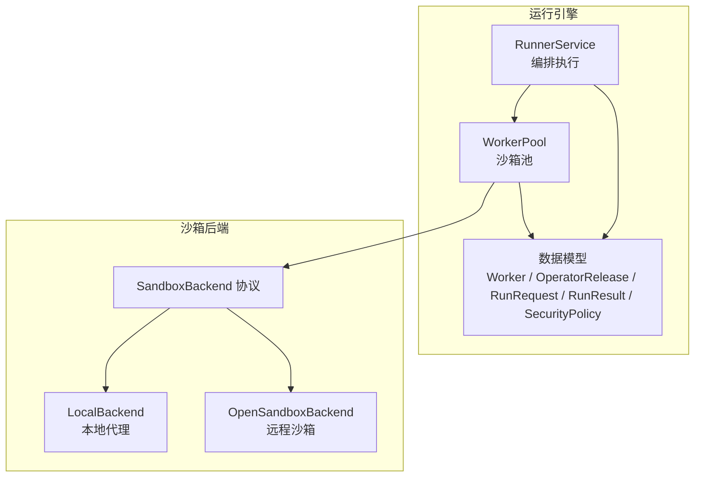
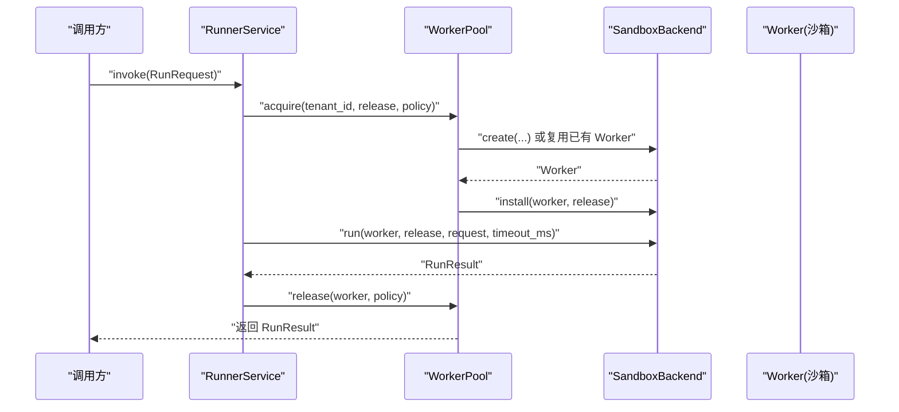
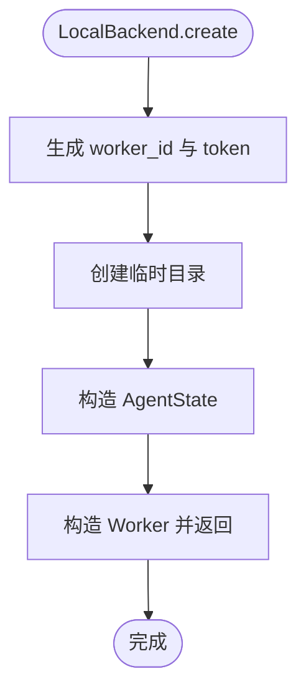
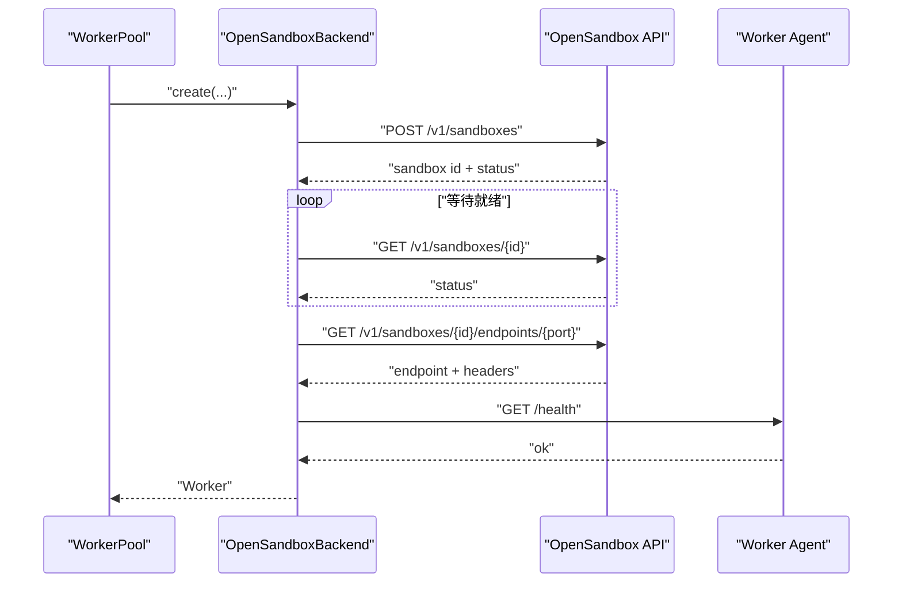
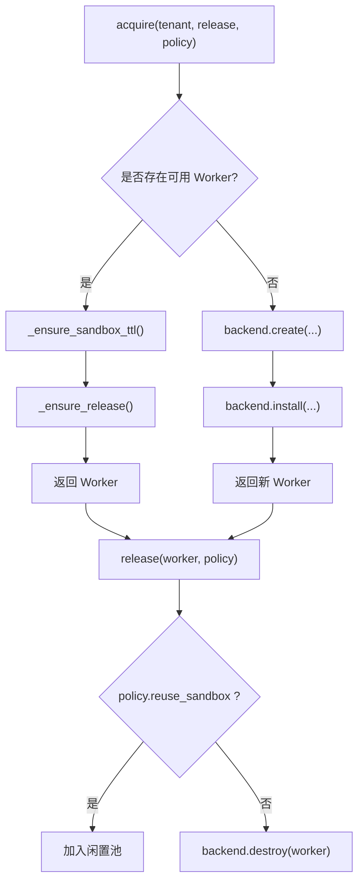
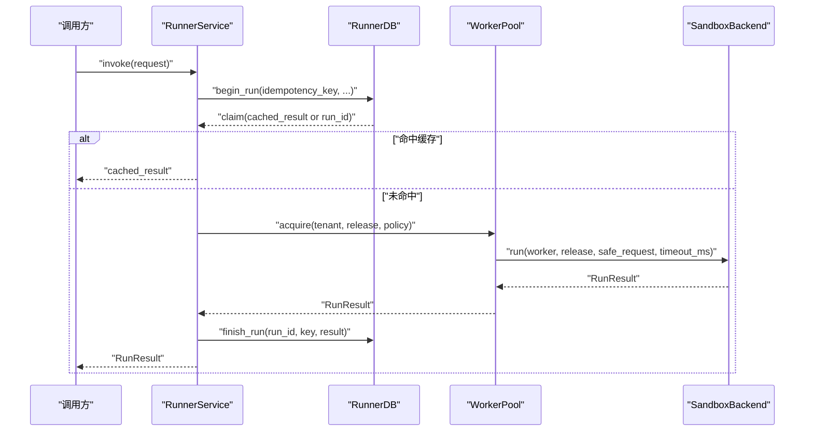
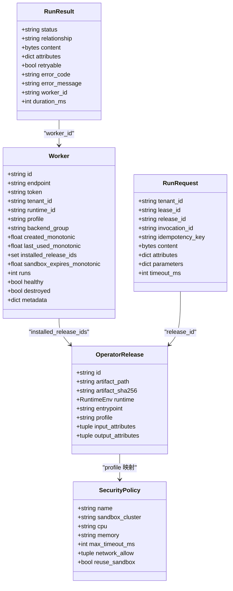
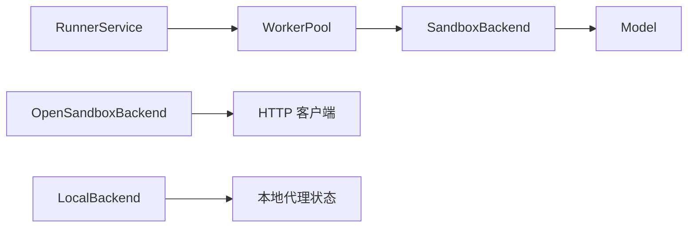

# 沙箱后端协议

<cite>
**本文引用的文件**   
- [backend.py](file://runner_engine/sandbox/backend.py)
- [local.py](file://runner_engine/sandbox/local.py)
- [opensandbox.py](file://runner_engine/sandbox/opensandbox.py)
- [model.py](file://runner_engine/model.py)
- [pool.py](file://runner_engine/pool.py)
- [service.py](file://runner_engine/service.py)
- [lifecycle_runtime.py](file://runner_engine/lifecycle_runtime.py)
- [test_opensandbox_backend.py](file://tests/test_opensandbox_backend.py)
- [test_end_to_end_local.py](file://tests/test_end_to_end_local.py)
</cite>

## 目录
1. [引言](#引言)
2. [项目结构定位](#项目结构定位)
3. [核心组件](#核心组件)
4. [架构总览](#架构总览)
5. [详细组件分析](#详细组件分析)
6. [依赖关系分析](#依赖关系分析)
7. [性能与扩展性](#性能与扩展性)
8. [故障排查指南](#故障排查指南)
9. [结论](#结论)
10. [附录：自定义沙箱后端实现示例](#附录自定义沙箱后端实现示例)

## 引言
本文面向需要理解或扩展“沙箱后端”能力的工程师，系统性说明 SandboxBackend 协议接口的设计理念、抽象方法定义、调用时机、状态管理、错误处理机制，以及与 Worker、OperatorRelease、RunRequest、RunResult、SecurityPolicy 等数据模型的关系。文档同时给出基于现有 LocalBackend 和 OpenSandboxBackend 的实现参考，并总结协议扩展点与最佳实践，帮助新后端在兼容性与性能之间取得平衡。

## 项目结构定位
沙箱后端相关代码集中在 runner_engine 子系统中：
- 协议定义位于 sandbox/backend.py。
- 本地开发测试后端位于 sandbox/local.py。
- OpenSandbox 远程沙箱后端位于 sandbox/opensandbox.py。
- 运行时数据模型统一位于 model.py。
- 工作进程池与生命周期管理位于 pool.py。
- 上层编排服务位于 service.py。
- 生命周期扩展位于 lifecycle_runtime.py。
- 测试用例覆盖关键行为，便于理解使用方式。

**图表来源**
- [service.py:80-115](file://runner_engine/service.py#L80-L115)
- [pool.py:11-45](file://runner_engine/pool.py#L11-L45)
- [backend.py:14-48](file://runner_engine/sandbox/backend.py#L14-L48)
- [local.py:14-31](file://runner_engine/sandbox/local.py#L14-L31)
- [opensandbox.py:31-50](file://runner_engine/sandbox/opensandbox.py#L31-L50)
- [model.py:14-34](file://runner_engine/model.py#L14-L34)

**章节来源**
- [backend.py:1-48](file://runner_engine/sandbox/backend.py#L1-L48)
- [local.py:1-132](file://runner_engine/sandbox/local.py#L1-L132)
- [opensandbox.py:1-440](file://runner_engine/sandbox/opensandbox.py#L1-L440)
- [model.py:1-98](file://runner_engine/model.py#L1-L98)
- [pool.py:1-188](file://runner_engine/pool.py#L1-L188)
- [service.py:1-456](file://runner_engine/service.py#L1-L456)

## 核心组件
- SandboxBackend 协议：定义 create、renew、install、run、cancel、destroy、cleanup_managed 七个核心方法，作为所有沙箱实现的统一契约。
- Worker：表示一个已创建并可执行的沙箱工作进程，包含标识、端点、令牌、租户、运行时、安全策略配置、健康状态、安装记录、过期时间等元信息。
- OperatorRelease：描述一次算子发布物，包括 ID、制品路径、摘要、运行时环境、入口、安全策略 profile、输入输出属性白名单等。
- RunRequest：表示一次执行请求，包括租户、租约、发布物、调用 ID、幂等键、内容、属性、参数、超时等。
- RunResult：表示执行结果，包括状态、关系、内容、属性、是否可重试、错误码、错误消息、工作进程 ID、耗时等。
- SecurityPolicy：描述安全策略，包括名称、目标沙箱集群、CPU/内存限制、最大超时、网络白名单、是否复用沙箱等。

这些模型共同构成沙箱后端的输入输出边界，确保上层服务与底层实现解耦。

**章节来源**
- [model.py:14-34](file://runner_engine/model.py#L14-L34)
- [model.py:47-98](file://runner_engine/model.py#L47-L98)
- [backend.py:14-48](file://runner_engine/sandbox/backend.py#L14-L48)

## 架构总览
RunnerService 负责编排执行流程，WorkerPool 负责沙箱的创建、复用、续期、销毁与清理，SandboxBackend 提供具体沙箱能力。OpenSandboxBackend 通过 HTTP 与远端 OpenSandbox 系统交互；LocalBackend 用于开发与测试，直接操作本地代理状态。

**图表来源**
- [service.py:188-331](file://runner_engine/service.py#L188-L331)
- [pool.py:73-130](file://runner_engine/pool.py#L73-L130)
- [backend.py:14-48](file://runner_engine/sandbox/backend.py#L14-L48)

**章节来源**
- [service.py:188-331](file://runner_engine/service.py#L188-L331)
- [pool.py:73-130](file://runner_engine/pool.py#L73-L130)

## 详细组件分析

### SandboxBackend 协议设计
SandboxBackend 是一个 Protocol，强调“行为契约”，不强制继承关系，允许任意类实现该接口。其设计目标是：
- 将沙箱资源的生命周期（创建、续期、安装、运行、取消、销毁）与上层调度逻辑解耦。
- 通过 Worker 对象传递沙箱上下文，避免重复传递敏感信息。
- 通过 Policy 控制资源配额、超时、集群选择等安全约束。
- 通过 cleanup_managed 支持进程重启后的孤儿资源回收。

| 方法 | 参数 | 返回值 | 主要职责 | 典型调用时机 |
|---|---|---|---|---|
| create | tenant_id、release、policy、orphan_ttl_seconds | Worker | 根据租户、发布物与安全策略创建沙箱，返回 Worker | WorkerPool.acquire 新建沙箱时 |
| renew | worker、orphan_ttl_seconds | None | 延长沙箱过期时间，防止被外部系统回收 | WorkerPool._ensure_sandbox_ttl 接近过期时 |
| install | worker、release | None | 将发布物安装到沙箱中，供后续 run 使用 | WorkerPool._ensure_release 首次使用时 |
| run | worker、release、request、timeout_ms | RunResult | 在沙箱中执行一次算子调用，返回结果 | RunnerService.invoke 执行阶段 |
| cancel | worker、invocation_id | bool | 尝试取消正在运行的调用 | RunnerService.cancel 或异常路径 |
| destroy | worker | None | 销毁沙箱资源 | WorkerPool._destroy 释放或失效时 |
| cleanup_managed | 无 | int | 清理本进程拥有的孤儿沙箱，返回删除数量 | WorkerPool.reset_after_restart 启动时 |

**章节来源**
- [backend.py:14-48](file://runner_engine/sandbox/backend.py#L14-L48)

### LocalBackend 实现要点
LocalBackend 是开发测试后端，不实现真正的隔离沙箱，而是通过本地代理状态模拟执行：
- create：生成临时目录、令牌、AgentState，构造 Worker，设置过期时间。
- renew：更新 Worker 的过期时间。
- install：读取发布物制品，通过 AgentState.bootstrap 注入。
- run：调用 AgentState.run，封装为 RunResult。
- cancel：调用 AgentState.cancel，返回布尔值。
- destroy：从内部字典移除并清理临时目录。
- cleanup_managed：遍历内部字典，清理所有临时目录并返回数量。

**图表来源**
- [local.py:24-62](file://runner_engine/sandbox/local.py#L24-L62)

**章节来源**
- [local.py:14-132](file://runner_engine/sandbox/local.py#L14-L132)

### OpenSandboxBackend 实现要点
OpenSandboxBackend 通过 HTTP 与远端 OpenSandbox 系统交互，负责：
- 集群配置校验与请求封装。
- 创建沙箱并轮询状态直到 READY/RUNNING/STARTED。
- 获取 Worker 端点并验证健康。
- 向 Worker 发送 bootstrap/run/cancel 请求。
- 销毁沙箱并忽略 404 等幂等情况。
- 扫描集群中标记为当前 Runner 拥有的沙箱并批量清理。

**图表来源**
- [opensandbox.py:141-290](file://runner_engine/sandbox/opensandbox.py#L141-L290)

**章节来源**
- [opensandbox.py:31-440](file://runner_engine/sandbox/opensandbox.py#L31-L440)

### WorkerPool 与沙箱生命周期
WorkerPool 维护按租户、运行时、profile 分桶的闲置 Worker 列表，负责：
- 空闲回收：超过 idle_seconds 的 Worker 被销毁。
- 续期保护：当 Worker 剩余 TTL 小于阈值时调用 backend.renew。
- 发布物安装：首次使用某 release 时调用 backend.install。
- 创建与销毁：受 Quota 限流，保证并发与资源上限。
- 重启恢复：reset_after_restart 清空内存池并调用 backend.cleanup_managed。

**图表来源**
- [pool.py:51-130](file://runner_engine/pool.py#L51-L130)
- [pool.py:132-187](file://runner_engine/pool.py#L132-L187)

**章节来源**
- [pool.py:11-187](file://runner_engine/pool.py#L11-L187)

### RunnerService 与执行流程
RunnerService 负责：
- 校验请求大小、幂等键、属性白名单与字节限制。
- 解析并发布物安全策略。
- 建立 ActiveRun 跟踪，避免并发冲突。
- 调用 WorkerPool.backend.run 执行。
- 过滤输出属性并限制输出大小。
- 根据结果决定复用或失效 Worker。
- 失败路径标记 abandon_run 并抛出 RunnerError。

**图表来源**
- [service.py:188-331](file://runner_engine/service.py#L188-L331)

**章节来源**
- [service.py:188-405](file://runner_engine/service.py#L188-L405)

### 数据模型关系
- OperatorRelease 提供运行时镜像、制品路径、安全策略 profile、输入输出属性白名单。
- SecurityPolicy 指定目标集群、资源限制、最大超时、是否复用沙箱。
- Worker 承载沙箱实例上下文，包括 endpoint、token、metadata、installed_release_ids、sandbox_expires_monotonic 等。
- RunRequest 携带执行内容与参数，RunnerService 会裁剪属性并限制超时。
- RunResult 由后端返回，RunnerService 再次过滤输出属性并限制大小。

**图表来源**
- [model.py:14-34](file://runner_engine/model.py#L14-L34)
- [model.py:47-98](file://runner_engine/model.py#L47-L98)

**章节来源**
- [model.py:14-98](file://runner_engine/model.py#L14-L98)

## 依赖关系分析
- RunnerService 依赖 WorkerPool 与数据模型。
- WorkerPool 依赖 SandboxBackend 与 Quota。
- SandboxBackend 依赖数据模型与错误类型。
- OpenSandboxBackend 依赖 HTTP 客户端与 Worker HTTP API。
- LocalBackend 依赖本地代理状态与临时目录。

**图表来源**
- [service.py:80-115](file://runner_engine/service.py#L80-L115)
- [pool.py:11-45](file://runner_engine/pool.py#L11-L45)
- [opensandbox.py:61-110](file://runner_engine/sandbox/opensandbox.py#L61-L110)
- [local.py:14-31](file://runner_engine/sandbox/local.py#L14-L31)

**章节来源**
- [service.py:80-115](file://runner_engine/service.py#L80-L115)
- [pool.py:11-45](file://runner_engine/pool.py#L11-L45)
- [opensandbox.py:61-110](file://runner_engine/sandbox/opensandbox.py#L61-L110)
- [local.py:14-31](file://runner_engine/sandbox/local.py#L14-L31)

## 性能与扩展性
- 沙箱复用：WorkerPool 按租户、运行时、profile 复用 Worker，减少创建开销。
- 续期保护：接近过期时自动 renew，避免远端回收导致执行中断。
- 发布物缓存：Worker.installed_release_ids 避免重复安装。
- 属性白名单：RunnerService 对输入输出属性进行白名单过滤，降低跨边界风险。
- 大小限制：RunnerService 限制 inline content 与输出大小，防止资源滥用。
- 可扩展性：新增后端只需实现 SandboxBackend 协议，无需改动上层编排逻辑。

[本节为通用指导，不直接分析具体文件]

## 故障排查指南
- 沙箱启动失败：OpenSandboxBackend.create 会轮询状态，若进入 FAILED/STOPPED/ERROR/TERMINATED 则抛出 SandboxError。
- 健康检查超时：OpenSandboxBackend.create 会在 AGENT_READY_WAIT_SECONDS 内轮询 /health，失败则抛出 AGENT_START_TIMEOUT。
- 端点缺失：若 endpoints 响应缺少 endpoint，抛出 SANDBOX_ENDPOINT_MISSING。
- 网络不可达：_request 捕获 HTTP 错误与 URLError/TimeoutError，包装为 SandboxError，标记 retryable。
- 销毁幂等：destroy 忽略 404，避免重复销毁报错。
- 清理孤儿：cleanup_managed 遍历集群中标记为当前 Runner 拥有的沙箱并删除，忽略异常继续。

**章节来源**
- [opensandbox.py:141-290](file://runner_engine/sandbox/opensandbox.py#L141-L290)
- [opensandbox.py:389-439](file://runner_engine/sandbox/opensandbox.py#L389-L439)

## 结论
SandboxBackend 协议以清晰的七方法契约定义了沙箱生命周期与执行语义，配合 WorkerPool 的复用与续期机制、RunnerService 的安全校验与结果过滤，形成稳定可扩展的执行框架。LocalBackend 与 OpenSandboxBackend 分别满足开发与生产需求。新增后端应严格遵循协议、正确处理错误、合理设置超时与资源限制，并通过 cleanup_managed 保障进程重启后的资源一致性。

[本节为总结性内容，不直接分析具体文件]

## 附录：自定义沙箱后端实现示例
以下示例展示如何实现一个自定义沙箱后端，使其符合 SandboxBackend 协议并与 WorkerPool、RunnerService 无缝集成。注意：示例仅说明结构与步骤，不包含具体代码内容。

- 导入与继承
  - 从 runner_engine.sandbox.backend 导入 SandboxBackend。
  - 从 runner_engine.model 导入 OperatorRelease、RunRequest、RunResult、SecurityPolicy、Worker。
  - 自定义类实现 SandboxBackend 协议的所有方法。

- 必要字段与初始化
  - 保存集群配置、所有者标识、端口等。
  - 提供 _cluster 与 _request 等辅助方法，封装远端 API 调用与错误转换。

- 方法实现要点
  - create：根据 policy.sandbox_cluster 选择集群，构造 payload，调用远端创建接口，轮询状态直至就绪，获取 endpoint 并验证健康，返回 Worker。
  - renew：调用远端续期接口，更新 Worker.sandbox_expires_monotonic。
  - install：读取发布物制品，调用 Worker 的 /bootstrap 接口注入。
  - run：调用 Worker 的 /run 接口，封装为 RunResult。
  - cancel：调用 Worker 的 /cancel 接口，返回布尔值。
  - destroy：调用远端删除接口，忽略 404。
  - cleanup_managed：分页查询集群沙箱，按 managed-by 与 runner-owner 标签筛选，批量删除并计数。

- 测试与验证
  - 参考 tests/test_opensandbox_backend.py 中的 FakeOpenSandbox，mock _request 与 worker_call，验证 create 使用的策略与元数据。
  - 参考 tests/test_end_to_end_local.py，使用 LocalBackend 与 WorkerPool、RunnerService 进行端到端验证。

- 最佳实践
  - 使用安全的随机令牌与不可预测的标识。
  - 对所有远端调用设置合理超时，区分控制面与数据面。
  - 将非业务错误包装为 SandboxError，并标注 retryable。
  - 保持 Worker.metadata 最小化且可序列化，避免泄露敏感信息。
  - 在 cleanup_managed 中容忍部分失败，确保整体清理尽可能完成。

**章节来源**
- [backend.py:14-48](file://runner_engine/sandbox/backend.py#L14-L48)
- [opensandbox.py:31-440](file://runner_engine/sandbox/opensandbox.py#L31-L440)
- [test_opensandbox_backend.py:1-29](file://tests/test_opensandbox_backend.py#L1-L29)
- [test_end_to_end_local.py:1-32](file://tests/test_end_to_end_local.py#L1-L32)