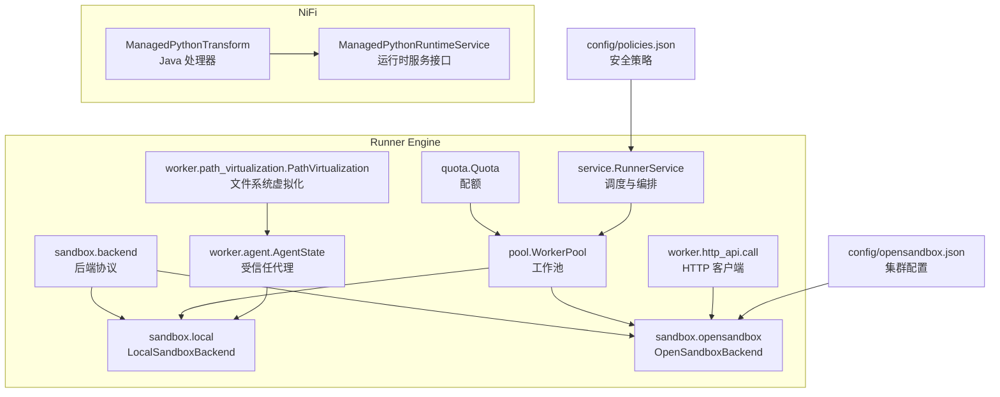
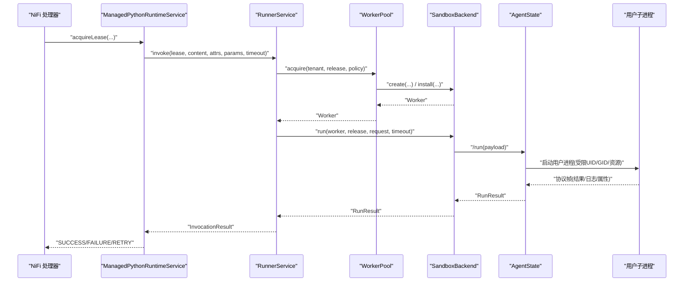
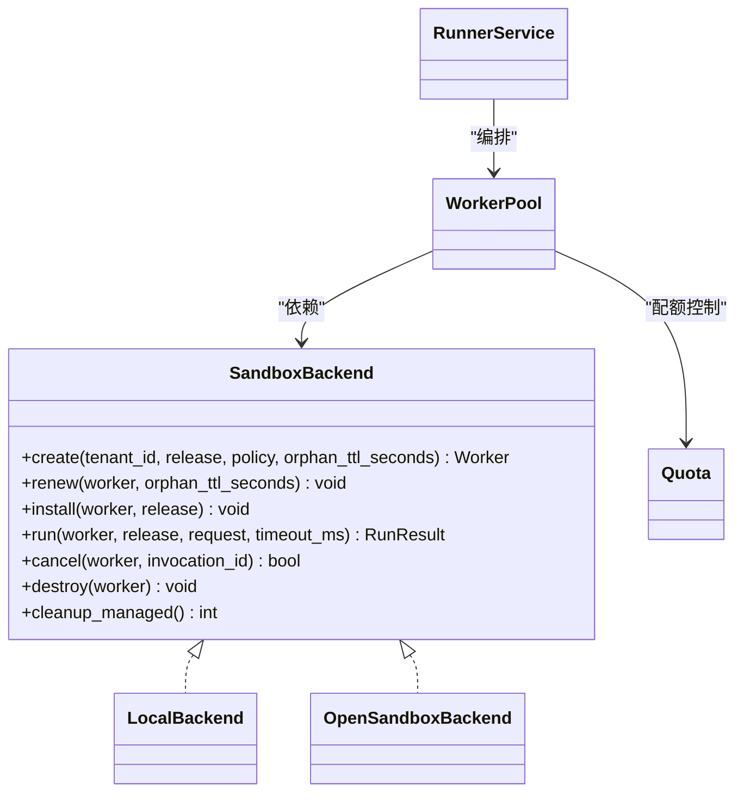
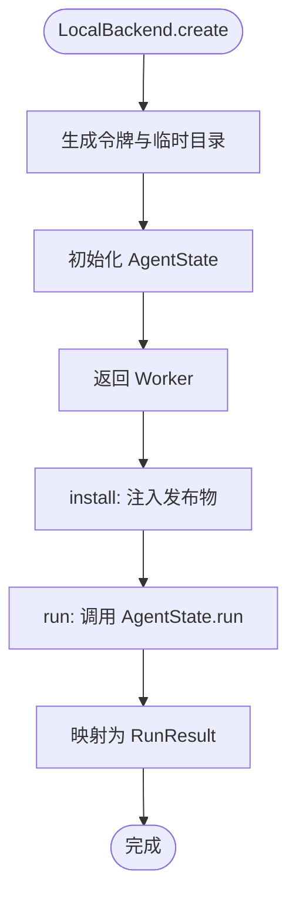
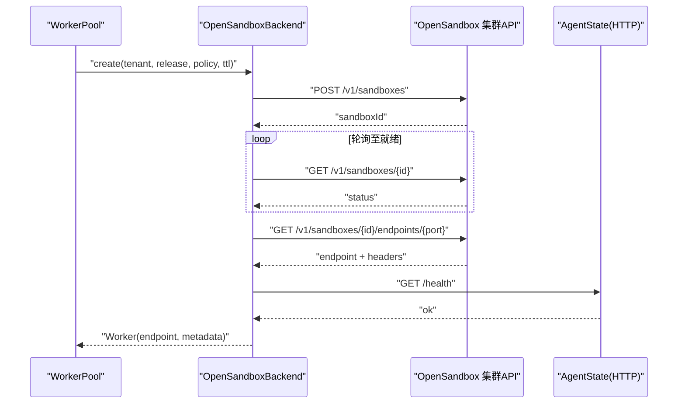
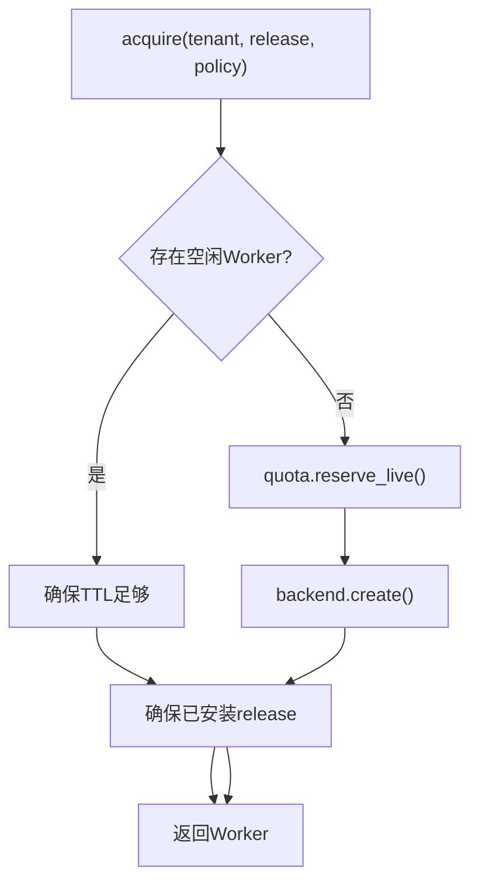
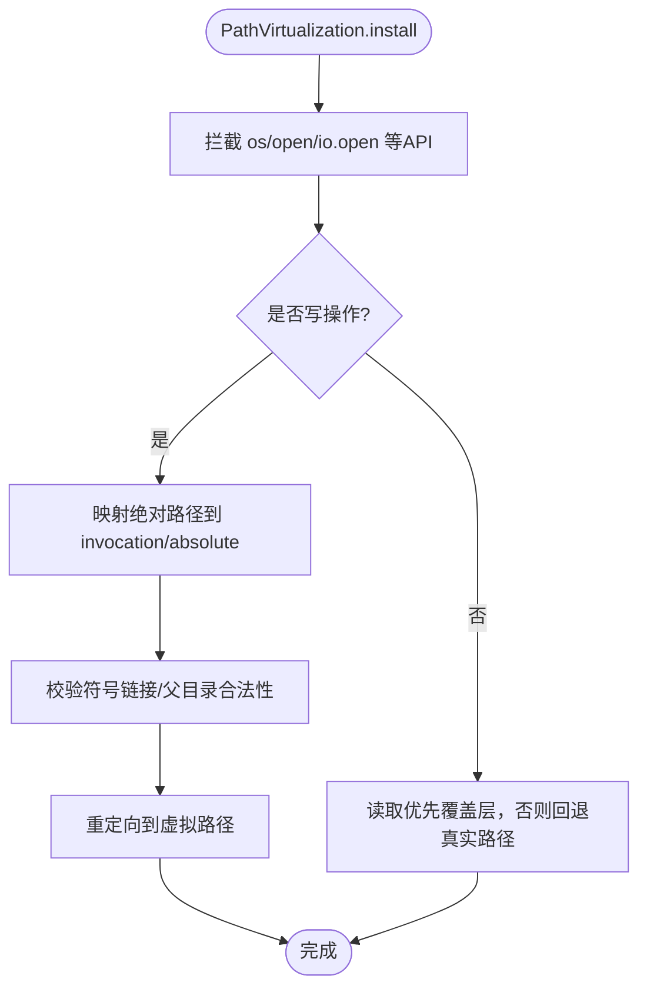
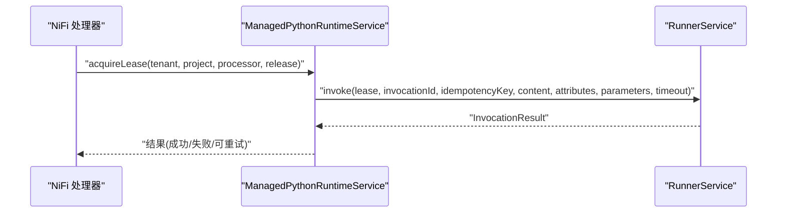
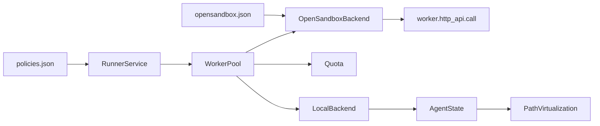

# 沙箱隔离

<cite>
**本文引用的文件**   
- [backend.py](file://runner_engine/sandbox/backend.py)
- [local.py](file://runner_engine/sandbox/local.py)
- [opensandbox.py](file://runner_engine/sandbox/opensandbox.py)
- [pool.py](file://runner_engine/pool.py)
- [quota.py](file://runner_engine/quota.py)
- [service.py](file://runner_engine/service.py)
- [model.py](file://runner_engine/model.py)
- [agent.py](file://runner_engine/worker/agent.py)
- [http_api.py](file://runner_engine/worker/http_api.py)
- [path_virtualization.py](file://runner_engine/worker/path_virtualization.py)
- [ManagedPythonTransform.java](file://nifi/managed-python-processors/src/main/java/com/dsc/nifi/ManagedPythonTransform.java)
- [ManagedPythonRuntimeService.java](file://nifi/managed-python-processors/src/main/java/com/dsc/nifi/ManagedPythonRuntimeService.java)
- [opensandbox.json](file://config/opensandbox.json)
- [policies.json](file://config/policies.json)
</cite>

## 目录
1. [简介](#简介)
2. [项目结构](#项目结构)
3. [核心组件](#核心组件)
4. [架构总览](#架构总览)
5. [详细组件分析](#详细组件分析)
6. [依赖关系分析](#依赖关系分析)
7. [性能与容量规划](#性能与容量规划)
8. [故障排查指南](#故障排查指南)
9. [结论](#结论)
10. [附录：配置与安全最佳实践](#附录配置与安全最佳实践)

## 简介
本文件系统性梳理 Runner Engine 的沙箱隔离体系，重点包括：
- 沙箱后端抽象接口、插件化扩展点与实现差异
- LocalSandboxBackend（本地进程级隔离）与 OpenSandboxBackend（分布式集群管理）的对比
- 沙箱创建、安装、运行、取消、销毁全生命周期流程
- 文件系统虚拟化、网络隔离、资源限制策略
- 与 NiFi 原生处理器和容器化环境的集成方式
- 与配额系统、工作池和服务发现的关系
- 安全配置指南与性能优化建议

## 项目结构
Runner Engine 的沙箱子系统位于 runner_engine 包内，围绕“后端抽象 + 工作池 + 配额控制 + 服务编排”展开；NiFi 侧通过 Java 处理器调用运行时服务。

图表来源
- [backend.py:14-49](file://runner_engine/sandbox/backend.py#L14-L49)
- [local.py:14-132](file://runner_engine/sandbox/local.py#L14-L132)
- [opensandbox.py:31-440](file://runner_engine/sandbox/opensandbox.py#L31-L440)
- [pool.py:11-188](file://runner_engine/pool.py#L11-L188)
- [quota.py:9-61](file://runner_engine/quota.py#L9-L61)
- [service.py:80-456](file://runner_engine/service.py#L80-L456)
- [agent.py:309-798](file://runner_engine/worker/agent.py#L309-L798)
- [http_api.py:8-39](file://runner_engine/worker/http_api.py#L8-L39)
- [path_virtualization.py:62-739](file://runner_engine/worker/path_virtualization.py#L62-L739)
- [ManagedPythonTransform.java:35-301](file://nifi/managed-python-processors/src/main/java/com/dsc/nifi/ManagedPythonTransform.java#L35-L301)
- [ManagedPythonRuntimeService.java:7-49](file://nifi/managed-python-processors/src/main/java/com/dsc/nifi/ManagedPythonRuntimeService.java#L7-L49)
- [policies.json:1-19](file://config/policies.json#L1-L19)
- [opensandbox.json:1-11](file://config/opensandbox.json#L1-L11)

章节来源
- [backend.py:14-49](file://runner_engine/sandbox/backend.py#L14-L49)
- [pool.py:11-188](file://runner_engine/pool.py#L11-L188)
- [service.py:80-456](file://runner_engine/service.py#L80-L456)

## 核心组件
- SandboxBackend 协议：定义 create/renew/install/run/cancel/destroy/cleanup_managed 统一接口，屏蔽不同后端差异。
- WorkerPool：按租户+运行时+安全策略维度复用空闲沙箱，负责 TTL 续期、发布物安装、配额预留与回收。
- Quota：全局并发创建、全局在线数、租户在线数三重配额控制。
- RunnerService：编排租约、幂等执行、属性校验、结果持久化与清理。
- LocalBackend：基于本地临时目录与 AgentState 进程隔离的开发/测试后端。
- OpenSandboxBackend：通过 HTTP API 在外部集群（如 gVisor/Kata）上创建、健康检查、端点发现并驱动 Agent。
- AgentState：受信任代理，负责发布物安装、子进程启动、输出/日志限流、超时与取消、文件系统虚拟化的环境变量注入。
- PathVirtualization：Python 层文件系统虚拟化，将绝对路径写操作重定向到 invocation 专属目录，读优先使用覆盖层。
- NiFi 集成：ManagedPythonTransform 通过 ManagedPythonRuntimeService 获取租约并调用 Runner 执行。

章节来源
- [backend.py:14-49](file://runner_engine/sandbox/backend.py#L14-L49)
- [pool.py:11-188](file://runner_engine/pool.py#L11-L188)
- [quota.py:9-61](file://runner_engine/quota.py#L9-L61)
- [service.py:80-456](file://runner_engine/service.py#L80-L456)
- [local.py:14-132](file://runner_engine/sandbox/local.py#L14-L132)
- [opensandbox.py:31-440](file://runner_engine/sandbox/opensandbox.py#L31-L440)
- [agent.py:309-798](file://runner_engine/worker/agent.py#L309-L798)
- [path_virtualization.py:62-739](file://runner_engine/worker/path_virtualization.py#L62-L739)
- [ManagedPythonTransform.java:35-301](file://nifi/managed-python-processors/src/main/java/com/dsc/nifi/ManagedPythonTransform.java#L35-L301)

## 架构总览
下图展示一次从 NiFi 到沙箱执行的端到端调用链。

图表来源
- [ManagedPythonTransform.java:160-220](file://nifi/managed-python-processors/src/main/java/com/dsc/nifi/ManagedPythonTransform.java#L160-L220)
- [ManagedPythonRuntimeService.java:28-49](file://nifi/managed-python-processors/src/main/java/com/dsc/nifi/ManagedPythonRuntimeService.java#L28-L49)
- [service.py:188-405](file://runner_engine/service.py#L188-L405)
- [pool.py:73-130](file://runner_engine/pool.py#L73-L130)
- [opensandbox.py:339-376](file://runner_engine/sandbox/opensandbox.py#L339-L376)
- [agent.py:467-778](file://runner_engine/worker/agent.py#L467-L778)

## 详细组件分析

### 后端抽象与扩展点
- 协议方法
  - create：根据租户、发布物、安全策略、孤儿 TTL 创建 Worker。
  - renew：延长沙箱过期时间，避免空闲回收。
  - install：向 Worker 安装发布物（artifact）。
  - run：执行一次调用，返回 RunResult。
  - cancel：取消指定 invocation。
  - destroy：销毁 Worker。
  - cleanup_managed：清理托管资源（重启后兜底）。
- 扩展点
  - 新增后端需实现 SandboxBackend 协议，并在 WorkerPool 构造时注入。
  - 通过 SecurityPolicy.sandbox_cluster 选择后端集群（OpenSandboxBackend 支持多集群路由）。

图表来源
- [backend.py:14-49](file://runner_engine/sandbox/backend.py#L14-L49)
- [local.py:14-132](file://runner_engine/sandbox/local.py#L14-L132)
- [opensandbox.py:31-440](file://runner_engine/sandbox/opensandbox.py#L31-L440)
- [pool.py:11-188](file://runner_engine/pool.py#L11-L188)
- [quota.py:9-61](file://runner_engine/quota.py#L9-L61)
- [service.py:80-456](file://runner_engine/service.py#L80-L456)

章节来源
- [backend.py:14-49](file://runner_engine/sandbox/backend.py#L14-L49)

### LocalSandboxBackend：本地进程隔离
- 设计要点
  - 使用临时目录作为 releases/invocations 根，模拟真实环境但不提供强隔离。
  - 通过 AgentState 启动用户子进程，设置 child_uid/gid、nproc、nofile 等参数。
  - 不启用网络隔离，适合开发与测试。
- 关键流程
  - create：生成 token、临时目录、AgentState，返回 Worker。
  - install：将 artifact 以 base64 形式注入 AgentState 进行安装。
  - run：封装请求参数，调用 AgentState.run，映射为 RunResult。
  - destroy/cleanup_managed：清理临时目录与内存状态。

图表来源
- [local.py:24-62](file://runner_engine/sandbox/local.py#L24-L62)
- [local.py:67-111](file://runner_engine/sandbox/local.py#L67-L111)
- [agent.py:309-798](file://runner_engine/worker/agent.py#L309-L798)

章节来源
- [local.py:14-132](file://runner_engine/sandbox/local.py#L14-L132)
- [agent.py:309-798](file://runner_engine/worker/agent.py#L309-L798)

### OpenSandboxBackend：分布式集群管理
- 设计要点
  - 通过 HTTP API 与外部集群交互，支持多集群（gvisor/kata）路由。
  - 创建沙箱时注入 RUNNER_AGENT_TOKEN、端口、根路径等环境变量，并以 runner_engine.worker.agent 作为入口。
  - 等待沙箱就绪与健康检查通过后，获取 endpoint 并缓存额外头部。
  - 对错误进行分类（HTTP/不可达/协议异常），标记可重试。
- 关键流程
  - create：POST /v1/sandboxes，轮询状态，GET endpoints，健康检查 /health。
  - renew：POST /renew-expiration 延长过期时间。
  - install：调用 /bootstrap 安装发布物。
  - run：调用 /run，封装 RunResult。
  - cancel：调用 /cancel。
  - destroy：DELETE /v1/sandboxes/{id}。
  - cleanup_managed：分页查询并删除带 managed-by 标签的资源。

图表来源
- [opensandbox.py:141-302](file://runner_engine/sandbox/opensandbox.py#L141-L302)
- [opensandbox.py:304-337](file://runner_engine/sandbox/opensandbox.py#L304-L337)
- [opensandbox.py:339-440](file://runner_engine/sandbox/opensandbox.py#L339-L440)

章节来源
- [opensandbox.py:31-440](file://runner_engine/sandbox/opensandbox.py#L31-L440)

### 工作池与配额
- WorkerPool
  - 按 (tenant_id, runtime.id, profile) 维度复用空闲 Worker。
  - 自动续期：当剩余 TTL 小于阈值时调用 backend.renew。
  - 按需安装：首次使用时安装发布物，避免重复安装。
  - 释放策略：根据 policy.reuse_sandbox 决定是否回池。
- Quota
  - 全局并发创建上限、全局在线沙箱上限、租户在线沙箱上限。
  - 预留与释放严格配对，保证失败路径也能释放配额。

图表来源
- [pool.py:73-130](file://runner_engine/pool.py#L73-L130)
- [quota.py:28-55](file://runner_engine/quota.py#L28-L55)

章节来源
- [pool.py:11-188](file://runner_engine/pool.py#L11-L188)
- [quota.py:9-61](file://runner_engine/quota.py#L9-L61)

### 文件系统虚拟化与资源限制
- 文件系统虚拟化
  - PathVirtualization 拦截 Python 文件系统 API，将绝对路径写操作重定向到 invocation 专属目录 absolute。
  - 读操作优先使用覆盖层，不存在则回退到真实路径。
  - 禁止在虚拟绝对路径中创建指向宿主机绝对路径的符号链接，防止逃逸。
- 资源限制
  - AgentState 通过环境变量传递 CPU seconds、地址空间大小、nproc、nofile 等给子进程。
  - 日志与协议输出有硬上限，超限会终止子进程并返回错误码。
  - 子进程以非特权 UID/GID 运行，必要时清理同 UID 残留进程。

图表来源
- [path_virtualization.py:62-739](file://runner_engine/worker/path_virtualization.py#L62-L739)
- [agent.py:546-568](file://runner_engine/worker/agent.py#L546-L568)
- [agent.py:616-698](file://runner_engine/worker/agent.py#L616-L698)

章节来源
- [path_virtualization.py:62-739](file://runner_engine/worker/path_virtualization.py#L62-L739)
- [agent.py:309-798](file://runner_engine/worker/agent.py#L309-L798)

### 与 NiFi 原生处理器和容器化环境的集成
- NiFi 处理器 ManagedPythonTransform
  - 通过 ManagedPythonRuntimeService 获取租约，构建 idempotency_key，调用 invoke。
  - 根据结果状态分流到 success/failure/retry。
- 运行时服务接口 ManagedPythonRuntimeService
  - 暴露 acquireLease/ensureLease/invoke/cancel/releaseLease 等方法。
- 容器化环境
  - OpenSandboxBackend 在集群中拉起包含 runner_engine.worker.agent 的容器镜像，并通过 HTTP 与 Runner 通信。
  - 环境变量 RUNNER_AGENT_PORT/RUNNER_RELEASES_ROOT/RUNNER_INVOCATIONS_ROOT/RUNNER_DEPENDENCY_ROOT 由后端注入。

图表来源
- [ManagedPythonTransform.java:160-220](file://nifi/managed-python-processors/src/main/java/com/dsc/nifi/ManagedPythonTransform.java#L160-L220)
- [ManagedPythonRuntimeService.java:28-49](file://nifi/managed-python-processors/src/main/java/com/dsc/nifi/ManagedPythonRuntimeService.java#L28-L49)
- [service.py:188-405](file://runner_engine/service.py#L188-L405)

章节来源
- [ManagedPythonTransform.java:35-301](file://nifi/managed-python-processors/src/main/java/com/dsc/nifi/ManagedPythonTransform.java#L35-L301)
- [ManagedPythonRuntimeService.java:7-49](file://nifi/managed-python-processors/src/main/java/com/dsc/nifi/ManagedPythonRuntimeService.java#L7-L49)

## 依赖关系分析
- 低耦合后端：所有后端实现均遵循 SandboxBackend 协议，便于替换与扩展。
- 工作池集中管理：RunnerService 不直接感知后端细节，仅通过 WorkerPool 与后端交互。
- 配额与生命周期解耦：Quota 独立于后端，保障全局与租户级容量。
- NiFi 与 Runner 通过 gRPC/HTTP 边界清晰，NiFi 侧只关心租约与调用结果。

图表来源
- [policies.json:1-19](file://config/policies.json#L1-L19)
- [opensandbox.json:1-11](file://config/opensandbox.json#L1-L11)
- [service.py:80-456](file://runner_engine/service.py#L80-L456)
- [pool.py:11-188](file://runner_engine/pool.py#L11-L188)
- [quota.py:9-61](file://runner_engine/quota.py#L9-L61)
- [local.py:14-132](file://runner_engine/sandbox/local.py#L14-L132)
- [opensandbox.py:31-440](file://runner_engine/sandbox/opensandbox.py#L31-L440)
- [http_api.py:8-39](file://runner_engine/worker/http_api.py#L8-L39)
- [agent.py:309-798](file://runner_engine/worker/agent.py#L309-L798)
- [path_virtualization.py:62-739](file://runner_engine/worker/path_virtualization.py#L62-L739)

章节来源
- [service.py:80-456](file://runner_engine/service.py#L80-L456)
- [pool.py:11-188](file://runner_engine/pool.py#L11-L188)
- [quota.py:9-61](file://runner_engine/quota.py#L9-L61)

## 性能与容量规划
- 工作池复用
  - 合理设置 idle_seconds、orphan_ttl_seconds、renew_before_seconds，减少频繁创建与销毁。
  - max_installed_releases 控制单 Worker 缓存的发布物数量，平衡内存与复用收益。
- 配额调优
  - max_creating 控制并发创建压力；max_live 控制总体在线沙箱数；max_live_per_tenant 防单租户独占。
- 网络与IO
  - OpenSandboxBackend 的健康检查与端点发现存在轮询开销，应结合集群延迟调整超时。
  - 大输出与属性体积受 MAX_INLINE_BYTES、MAX_ATTRIBUTES、MAX_ATTRIBUTE_BYTES 限制，避免阻塞。
- 资源限制
  - 通过 SecurityPolicy.cpu/memory 与 AgentState 的环境变量约束子进程资源，避免雪崩。

[本节为通用指导，无需代码引用]

## 故障排查指南
- 常见错误与定位
  - SANDBOX_START_FAILED/SANDBOX_START_TIMEOUT：OpenSandbox 集群未就绪或状态异常，检查集群 API 与镜像启动。
  - AGENT_START_TIMEOUT：Agent 健康检查失败，检查 /health 响应与网络连通性。
  - CHILD_PROTOCOL_ERROR/LOG_LIMIT/TIMEOUT：子进程协议或资源超限，检查用户代码输出与超时设置。
  - QUOTA 相关错误：全局或租户配额耗尽，降低并发或扩容配额。
- 诊断步骤
  - 查看 RunnerService 后台维护线程日志，确认租约与幂等记录清理情况。
  - 检查 WorkerPool 空闲列表与销毁逻辑，确认是否存在泄漏。
  - 验证 OpenSandbox 集群标签 managed-by 与 runner-owner 是否正确，以便 cleanup_managed 生效。
  - 在 AgentState 侧检查子进程退出码与信号，定位 SIGXCPU 等资源限制触发。

章节来源
- [opensandbox.py:61-110](file://runner_engine/sandbox/opensandbox.py#L61-L110)
- [opensandbox.py:192-302](file://runner_engine/sandbox/opensandbox.py#L192-L302)
- [agent.py:616-778](file://runner_engine/worker/agent.py#L616-L778)
- [service.py:117-138](file://runner_engine/service.py#L117-L138)
- [quota.py:36-55](file://runner_engine/quota.py#L36-L55)

## 结论
Runner Engine 的沙箱隔离体系以 SandboxBackend 协议为核心，通过 WorkerPool 与 Quota 实现高效复用与容量控制；LocalBackend 面向开发测试，OpenSandboxBackend 面向生产集群。AgentState 与 PathVirtualization 共同提供进程级隔离与文件系统虚拟化能力。NiFi 侧通过标准化接口与 Runner 解耦，形成清晰的边界与可扩展的生态。

[本节为总结性内容，无需代码引用]

## 附录：配置与安全最佳实践

### 安全策略与集群选择
- policies.json
  - standard：默认策略，允许复用沙箱，适用于一般场景。
  - hardened：更严格策略，禁用沙箱复用，适合高敏感任务。
- opensandbox.json
  - 为每个集群配置 url 与 api_key，用于 OpenSandboxBackend 的多集群路由。

章节来源
- [policies.json:1-19](file://config/policies.json#L1-L19)
- [opensandbox.json:1-11](file://config/opensandbox.json#L1-L11)

### 隔离参数与安全策略
- 安全策略字段
  - sandbox_cluster：选择 OpenSandbox 集群名称。
  - cpu/memory：分配给沙箱的 CPU 与内存。
  - max_timeout_ms：最大执行超时。
  - network_allow：网络白名单（当前示例为空）。
  - reuse_sandbox：是否复用沙箱。
- 运行时限制
  - 通过 AgentState 环境变量传递 child_uid/gid、nproc、nofile、CPU seconds、地址空间上限。
  - 日志与协议输出上限保护，超限即终止子进程。

章节来源
- [model.py:26-35](file://runner_engine/model.py#L26-L35)
- [agent.py:546-568](file://runner_engine/worker/agent.py#L546-L568)
- [agent.py:616-698](file://runner_engine/worker/agent.py#L616-L698)

### 配置示例（以路径代替具体代码）
- 配置 OpenSandbox 集群
  - 参考 [opensandbox.json](file://config/opensandbox.json)
- 配置安全策略
  - 参考 [policies.json](file://config/policies.json)
- 在 NiFi 中配置处理器
  - 参考 [ManagedPythonTransform.java](file://nifi/managed-python-processors/src/main/java/com/dsc/nifi/ManagedPythonTransform.java)

[本节为配置指引，不直接粘贴代码内容]