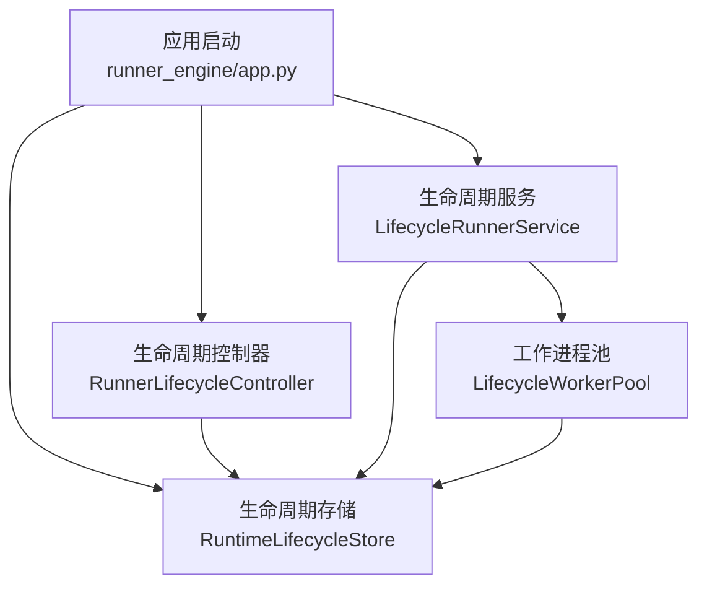
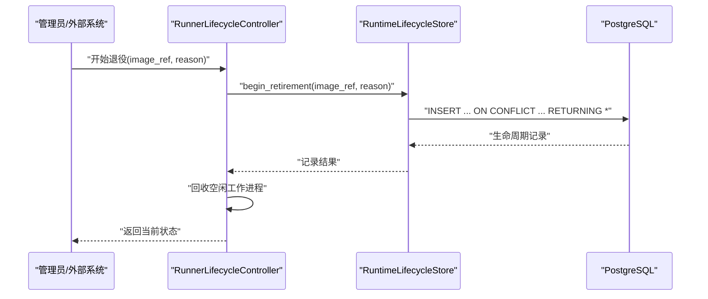
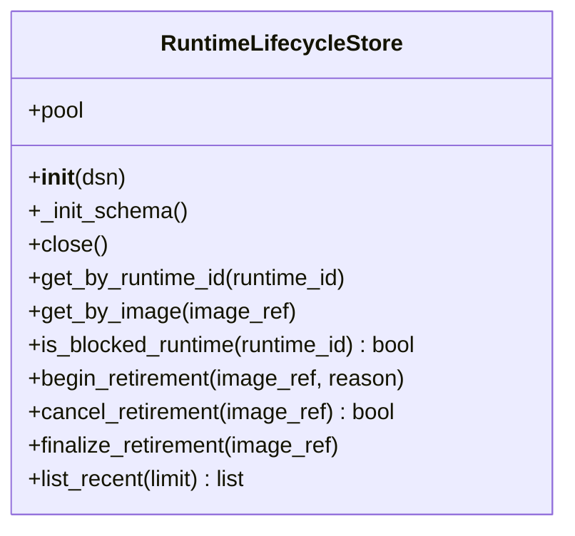
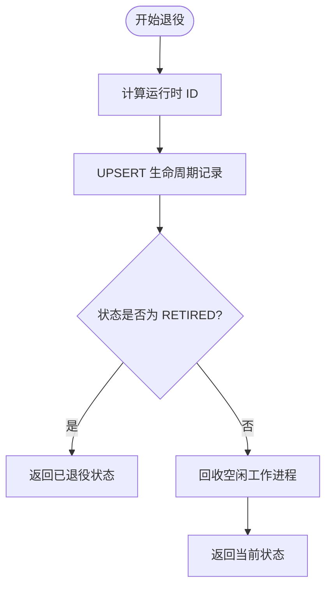
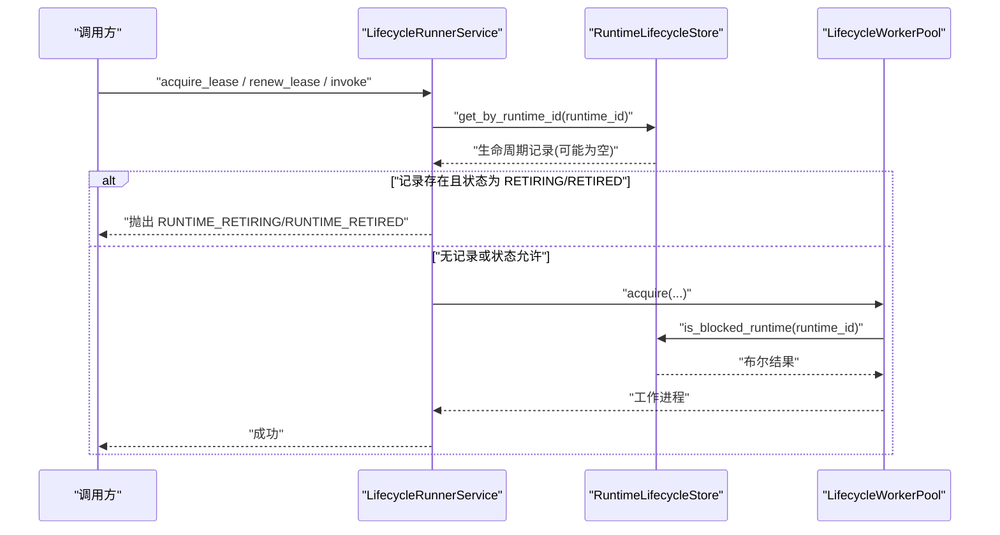
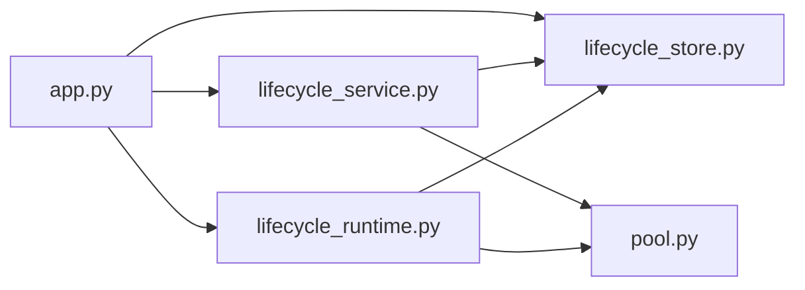

# 存储层实现

<cite>
**本文引用的文件**   
- [lifecycle_store.py](file://runner_engine/lifecycle_store.py)
- [lifecycle_runtime.py](file://runner_engine/lifecycle_runtime.py)
- [lifecycle_service.py](file://runner_engine/lifecycle_service.py)
- [app.py](file://runner_engine/app.py)
</cite>

## 目录
1. [引言](#引言)
2. [项目结构](#项目结构)
3. [核心组件](#核心组件)
4. [架构总览](#架构总览)
5. [详细组件分析](#详细组件分析)
6. [依赖关系分析](#依赖关系分析)
7. [性能与一致性](#性能与一致性)
8. [故障排查指南](#故障排查指南)
9. [结论](#结论)
10. [附录：数据模型与操作示例](#附录数据模型与操作示例)

## 引言
本文件聚焦 Runner Engine 生命周期存储层，围绕 RuntimeLifecycleStore 类展开，系统说明其数据持久化机制、数据库表结构设计、CRUD 操作实现、运行时 ID 生成规则、状态字段定义、时间戳管理、连接池使用、查询优化、事务边界、并发更新策略、与 PostgreSQL 的集成方式、性能调优建议，以及数据迁移与备份恢复实践。文档同时给出面向运维与开发人员的可操作步骤与排障指引。

## 项目结构
Runner Engine 的生命周期存储能力由以下模块共同构成：
- runner_engine/lifecycle_store.py：定义运行时生命周期表的 DDL、运行时 ID 生成函数与 RuntimeLifecycleStore 数据访问类。
- runner_engine/lifecycle_runtime.py：封装生命周期控制器，协调 WorkerPool、沙箱后端与生命周期存储，提供退役流程控制与状态聚合。
- runner_engine/lifecycle_service.py：在服务层增加基于生命周期状态的执行门禁，阻止对 RETIRING/RETIRED 运行时的新租约、续租与调用。
- runner_engine/app.py：应用启动入口，负责初始化 RuntimeLifecycleStore、注入到服务与控制器中，并统一关闭资源。

图表来源
- [app.py:92-135](file://runner_engine/app.py#L92-L135)
- [lifecycle_store.py:35-55](file://runner_engine/lifecycle_store.py#L35-L55)
- [lifecycle_runtime.py:187-194](file://runner_engine/lifecycle_runtime.py#L187-L194)
- [lifecycle_service.py:7-17](file://runner_engine/lifecycle_service.py#L7-L17)

章节来源
- [app.py:26-135](file://runner_engine/app.py#L26-L135)
- [lifecycle_store.py:10-55](file://runner_engine/lifecycle_store.py#L10-L55)
- [lifecycle_runtime.py:187-194](file://runner_engine/lifecycle_runtime.py#L187-L194)
- [lifecycle_service.py:7-17](file://runner_engine/lifecycle_service.py#L7-L17)

## 核心组件
- RuntimeLifecycleStore：封装 PostgreSQL 连接池、schema 初始化、运行时生命周期记录的 CRUD 与列表查询。
- runtime_id_for_image：根据镜像引用计算确定性运行时 ID。
- LifecycleWorkerPool：在获取沙箱前检查生命周期状态，阻断退役中的运行时。
- LifecycleRunnerService：在服务层拦截 acquire_lease、renew_lease、invoke，拒绝已退役或退役中的运行时。
- RunnerLifecycleController：编排退役流程（开始退役、取消退役、最终确认退役），聚合运行时状态。

章节来源
- [lifecycle_store.py:31-151](file://runner_engine/lifecycle_store.py#L31-L151)
- [lifecycle_runtime.py:14-120](file://runner_engine/lifecycle_runtime.py#L14-L120)
- [lifecycle_runtime.py:187-397](file://runner_engine/lifecycle_runtime.py#L187-L397)
- [lifecycle_service.py:7-70](file://runner_engine/lifecycle_service.py#L7-L70)

## 架构总览
生命周期存储层通过 psycopg_pool 管理连接池，使用 psycopg 的 dict_row 返回字典行，避免 ORM 开销。DDL 在首次初始化时创建 schema 与表，并在需要时创建索引。所有写操作均通过单条 SQL 完成幂等写入或状态推进，读操作通过主键或唯一索引快速定位。

图表来源
- [lifecycle_runtime.py:302-323](file://runner_engine/lifecycle_runtime.py#L302-L323)
- [lifecycle_store.py:82-108](file://runner_engine/lifecycle_store.py#L82-L108)

## 详细组件分析

### RuntimeLifecycleStore 数据持久化机制
- 连接池配置
  - 使用 psycopg_pool.ConnectionPool，最小连接数 1，最大连接数 4。
  - 设置 row_factory=dict_row，使查询结果直接为字典，便于上层处理。
  - 构造时立即打开连接池，并执行 schema 初始化。
- Schema 初始化
  - 确保 runner schema 存在。
  - 创建 runner.runtime_image_lifecycle 表，包含运行时 ID、镜像引用、状态、原因、清理错误、创建时间、更新时间、退役时间等字段。
  - 创建复合索引 ix_runner_runtime_image_lifecycle_state(state, updated_at DESC)，用于按状态和更新时间排序的高效查询。
- 运行时 ID 生成
  - 使用 SHA-256 对 image_ref 进行哈希，得到固定长度、确定性的运行时 ID。
- 读取接口
  - get_by_runtime_id：按主键查询。
  - get_by_image：按唯一索引 image_ref 查询。
  - is_blocked_runtime：判断是否存在该运行时记录。
  - list_recent：按 updated_at 倒序取最近 N 条，限制上限 500。
- 写入接口
  - begin_retirement：将镜像标记为 RETIRING；若已存在且为 RETIRED，则保持 RETIRED；否则置为 RETIRING，清空 cleanup_error，更新时间戳；支持幂等插入。
  - cancel_retirement：仅当状态为 RETIRING 时删除记录，返回是否成功取消。
  - finalize_retirement：将状态推进为 RETIRED，保留或填充 retired_at，清空 cleanup_error，更新时间戳。

图表来源
- [lifecycle_store.py:35-151](file://runner_engine/lifecycle_store.py#L35-L151)

章节来源
- [lifecycle_store.py:10-55](file://runner_engine/lifecycle_store.py#L10-L55)
- [lifecycle_store.py:57-151](file://runner_engine/lifecycle_store.py#L57-L151)

### 生命周期状态与数据格式
- 运行时 ID
  - 由镜像引用 image_ref 经 SHA-256 计算得出，保证同一镜像在不同环境下的 ID 一致。
- 状态字段
  - state：枚举值 RETIRING、RETIRED。
  - reason：退役原因，写入时截断至 1000 字符。
  - cleanup_error：清理失败信息，正常推进时清空。
- 时间戳字段
  - created_at：记录创建时间，默认 now()。
  - updated_at：每次更新时刷新为 now()。
  - retired_at：退役完成时间，若未显式设置则推进时为 now()。
- 唯一性约束
  - runtime_id 为主键。
  - image_ref 为唯一键，防止重复镜像记录。

章节来源
- [lifecycle_store.py:10-28](file://runner_engine/lifecycle_store.py#L10-L28)
- [lifecycle_store.py:31-32](file://runner_engine/lifecycle_store.py#L31-L32)
- [lifecycle_store.py:82-108](file://runner_engine/lifecycle_store.py#L82-L108)
- [lifecycle_store.py:123-136](file://runner_engine/lifecycle_store.py#L123-L136)

### CRUD 操作与一致性保证
- 幂等写入
  - begin_retirement 使用 INSERT ... ON CONFLICT (runtime_id) DO UPDATE，确保多次触发退役不会改变已退役状态，同时重置清理错误并更新时间戳。
- 条件更新
  - cancel_retirement 仅在 state=RETIRING 时删除记录，避免误删已退役数据。
  - finalize_retirement 仅在 image_ref 匹配时推进状态为 RETIRED，并保留或填充 retired_at。
- 事务边界
  - 每个方法通过 with self.pool.connection() 获取连接，psycopg_pool 会在上下文结束时归还连接；SQL 语句本身是单条原子操作，无需显式事务块。
- 并发安全
  - 主键与唯一键约束保证数据一致性。
  - 状态推进逻辑在数据库层以 CASE WHEN 保证 RETIRED 不会被回退为 RETIRING。
  - 上层控制器在内存中使用锁保护工作进程回收与状态变更顺序，减少竞态。

图表来源
- [lifecycle_runtime.py:302-323](file://runner_engine/lifecycle_runtime.py#L302-L323)
- [lifecycle_store.py:82-108](file://runner_engine/lifecycle_store.py#L82-L108)

章节来源
- [lifecycle_store.py:82-108](file://runner_engine/lifecycle_store.py#L82-L108)
- [lifecycle_store.py:110-136](file://runner_engine/lifecycle_store.py#L110-L136)
- [lifecycle_runtime.py:302-323](file://runner_engine/lifecycle_runtime.py#L302-L323)

### 数据访问模式
- 连接池管理
  - 构造时开启连接池，min_size=1，max_size=4，适合中等并发场景。
  - close() 方法用于优雅关闭连接池。
- 查询优化
  - 按 runtime_id 查询走主键索引。
  - 按 image_ref 查询走唯一索引。
  - list_recent 使用 ORDER BY updated_at DESC LIMIT，配合复合索引提升排序效率。
- 事务处理
  - 单条 SQL 原子操作，隐式事务由驱动管理；复杂跨表事务不在本模块内实现。

章节来源
- [lifecycle_store.py:35-55](file://runner_engine/lifecycle_store.py#L35-L55)
- [lifecycle_store.py:57-77](file://runner_engine/lifecycle_store.py#L57-L77)
- [lifecycle_store.py:138-151](file://runner_engine/lifecycle_store.py#L138-L151)

### 与服务层的集成
- LifecycleRunnerService
  - 在 acquire_lease、renew_lease、invoke 前检查运行时生命周期状态，若为 RETIRING 或 RETIRED，抛出相应错误，阻止新执行。
- LifecycleWorkerPool
  - 在 acquire 前检查 is_blocked_runtime，若存在记录则拒绝获取沙箱，避免退役期间分配资源。
- RunnerLifecycleController
  - 编排退役流程：开始退役、取消退役、最终确认退役；聚合活跃调用、空闲工作进程、受管沙箱等信息，判断是否可安全删除制品。

图表来源
- [lifecycle_service.py:19-70](file://runner_engine/lifecycle_service.py#L19-L70)
- [lifecycle_runtime.py:26-47](file://runner_engine/lifecycle_runtime.py#L26-L47)
- [lifecycle_store.py:57-80](file://runner_engine/lifecycle_store.py#L57-L80)

章节来源
- [lifecycle_service.py:7-70](file://runner_engine/lifecycle_service.py#L7-L70)
- [lifecycle_runtime.py:26-47](file://runner_engine/lifecycle_runtime.py#L26-L47)

## 依赖关系分析
- RuntimeLifecycleStore 依赖 psycopg_pool 与 psycopg 的 dict_row。
- LifecycleRunnerController 依赖 RuntimeLifecycleStore 与 WorkerPool。
- LifecycleRunnerService 依赖 Catalog、RunnerDB、WorkerPool 与 RuntimeLifecycleStore。
- app.py 负责装配 RuntimeLifecycleStore、LifecycleWorkerPool、LifecycleRunnerService、RunnerLifecycleController。

图表来源
- [app.py:92-135](file://runner_engine/app.py#L92-L135)
- [lifecycle_store.py:35-55](file://runner_engine/lifecycle_store.py#L35-L55)
- [lifecycle_runtime.py:187-194](file://runner_engine/lifecycle_runtime.py#L187-L194)
- [lifecycle_service.py:7-17](file://runner_engine/lifecycle_service.py#L7-L17)

章节来源
- [app.py:92-135](file://runner_engine/app.py#L92-L135)
- [lifecycle_store.py:35-55](file://runner_engine/lifecycle_store.py#L35-L55)
- [lifecycle_runtime.py:187-194](file://runner_engine/lifecycle_runtime.py#L187-L194)
- [lifecycle_service.py:7-17](file://runner_engine/lifecycle_service.py#L7-L17)

## 性能与一致性
- 连接池调优
  - min_size=1 保障冷启动可用，max_size=4 控制并发连接数。可根据 QPS 与延迟目标调整 max_size。
  - 在高并发场景下，建议结合数据库服务器参数（如 max_connections）与连接池大小做容量规划。
- 索引优化
  - 复合索引 (state, updated_at DESC) 支持按状态筛选并按更新时间倒序扫描，适用于列表与监控查询。
  - 如需高频按 image_ref 过滤，可利用现有唯一索引。
- 查询优化
  - list_recent 限制 limit 上限为 500，避免大结果集拖慢响应。
  - 建议在业务侧分页或增量拉取，减少单次查询压力。
- 一致性保证
  - 数据库层主键与唯一键约束保证强一致性。
  - UPSERT 与条件更新避免状态回退与重复记录。
  - 上层控制器加锁保护工作进程回收与状态推进的顺序，降低竞态窗口。

章节来源
- [lifecycle_store.py:35-55](file://runner_engine/lifecycle_store.py#L35-L55)
- [lifecycle_store.py:138-151](file://runner_engine/lifecycle_store.py#L138-L151)
- [lifecycle_store.py:82-108](file://runner_engine/lifecycle_store.py#L82-L108)
- [lifecycle_runtime.py:302-323](file://runner_engine/lifecycle_runtime.py#L302-L323)

## 故障排查指南
- 无法连接数据库
  - 检查 RUNNER_DB_URL 是否正确，网络连通性与认证信息。
  - 确认 PostgreSQL 版本与 psycopg/psycopg_pool 兼容性。
- 生命周期记录不存在
  - 确认镜像引用与运行时 ID 映射正确。
  - 检查是否被其他实例提前退役或清理。
- 退役流程卡住
  - 查看是否有活跃调用、空闲工作进程或受管沙箱。
  - 使用 runtime_image_status 聚合视图确认 safeForArtifactDeletion 条件。
- 并发冲突
  - 观察是否出现 RETIRED 被回退为 RETIRING 的情况；正常情况下数据库层会阻止该回退。
  - 检查上层控制器锁是否正常工作，避免多实例竞争导致的状态不一致。

章节来源
- [lifecycle_runtime.py:239-300](file://runner_engine/lifecycle_runtime.py#L239-L300)
- [lifecycle_runtime.py:340-359](file://runner_engine/lifecycle_runtime.py#L340-L359)
- [lifecycle_store.py:82-108](file://runner_engine/lifecycle_store.py#L82-L108)

## 结论
RuntimeLifecycleStore 以简洁的数据模型与明确的 CRUD 接口，为 Runner Engine 提供了可靠的运行时生命周期持久化能力。通过数据库级约束与幂等写入，保证了状态推进的一致性与安全性；配合服务层与工作进程池的门禁检查，有效阻止退役中的运行时接受新任务。连接池与索引设计满足中等并发场景的性能需求，并可按实际负载扩展调优。

## 附录：数据模型与操作示例

### 数据库表结构
- 表名：runner.runtime_image_lifecycle
- 字段说明
  - runtime_id：VARCHAR(64)，主键，由镜像引用 SHA-256 生成。
  - image_ref：TEXT，唯一，镜像引用。
  - state：TEXT，CHECK 约束为 RETIRING 或 RETIRED。
  - reason：TEXT，退役原因，写入时截断至 1000 字符。
  - cleanup_error：TEXT，清理失败信息，正常推进时清空。
  - created_at：TIMESTAMPTZ，默认 now()。
  - updated_at：TIMESTAMPTZ，默认 now()，每次更新刷新。
  - retired_at：TIMESTAMPTZ，退役完成时间，推进时填充。
- 索引
  - 主键索引：runtime_id。
  - 唯一索引：image_ref。
  - 复合索引：ix_runner_runtime_image_lifecycle_state(state, updated_at DESC)。

章节来源
- [lifecycle_store.py:10-28](file://runner_engine/lifecycle_store.py#L10-L28)

### 运行时 ID 生成规则
- 算法：SHA-256。
- 输入：image_ref（UTF-8 编码）。
- 输出：十六进制字符串，作为 runtime_id。

章节来源
- [lifecycle_store.py:31-32](file://runner_engine/lifecycle_store.py#L31-L32)

### CRUD 操作示例路径
- 查询运行时记录
  - 按运行时 ID：[lifecycle_store.py:57-66](file://runner_engine/lifecycle_store.py#L57-L66)
  - 按镜像引用：[lifecycle_store.py:68-77](file://runner_engine/lifecycle_store.py#L68-L77)
- 写入与状态推进
  - 开始退役：[lifecycle_store.py:82-108](file://runner_engine/lifecycle_store.py#L82-L108)
  - 取消退役：[lifecycle_store.py:110-121](file://runner_engine/lifecycle_store.py#L110-L121)
  - 最终退役：[lifecycle_store.py:123-136](file://runner_engine/lifecycle_store.py#L123-L136)
- 列表查询
  - 最近记录：[lifecycle_store.py:138-151](file://runner_engine/lifecycle_store.py#L138-L151)

### 并发更新与完整性维护
- 幂等写入：UPSERT 保证重复退役不改变已退役状态。
- 条件更新：仅允许从 RETIRING 取消或删除，避免误操作。
- 状态推进：CASE WHEN 保证 RETIRED 不被回退。
- 上层锁：控制器在工作进程回收与状态推进间加锁，减少竞态。

章节来源
- [lifecycle_store.py:82-108](file://runner_engine/lifecycle_store.py#L82-L108)
- [lifecycle_store.py:110-136](file://runner_engine/lifecycle_store.py#L110-L136)
- [lifecycle_runtime.py:302-323](file://runner_engine/lifecycle_runtime.py#L302-L323)

### 与 PostgreSQL 的集成与调优
- 集成要点
  - 使用 psycopg_pool 管理连接池，psycopg 的 dict_row 返回字典行。
  - 启动时执行 DDL，确保 schema 与表存在。
- 调优建议
  - 根据并发量调整 ConnectionPool.max_size。
  - 利用复合索引优化状态筛选与时间排序。
  - 限制 list_recent 的返回规模，避免大结果集。
  - 监控数据库连接数与慢查询，必要时拆分读写或引入缓存。

章节来源
- [lifecycle_store.py:35-55](file://runner_engine/lifecycle_store.py#L35-L55)
- [lifecycle_store.py:138-151](file://runner_engine/lifecycle_store.py#L138-L151)

### 数据迁移与备份恢复指南
- 迁移
  - 首次部署时，RuntimeLifecycleStore 会自动创建 runner schema 与表，无需手动建表。
  - 若需扩展字段或索引，应通过独立迁移脚本执行 ALTER TABLE 或 CREATE INDEX，并确保幂等。
- 备份
  - 使用 pg_dump 对 runner schema 进行逻辑备份，包含表结构与数据。
  - 建议定期备份并结合归档日志实现时间点恢复。
- 恢复
  - 使用 psql 或 pg_restore 恢复 runner schema。
  - 恢复后重启 Runner Engine，确保连接池与 schema 初始化正常。

章节来源
- [lifecycle_store.py:10-28](file://runner_engine/lifecycle_store.py#L10-L28)
- [lifecycle_store.py:49-52](file://runner_engine/lifecycle_store.py#L49-L52)