# 服务层实现

<cite>
**本文引用的文件**   
- [runner_engine/lifecycle_service.py](file://runner_engine/lifecycle_service.py)
- [runner_engine/lifecycle_runtime.py](file://runner_engine/lifecycle_runtime.py)
- [runner_engine/lifecycle_store.py](file://runner_engine/lifecycle_store.py)
- [runner_engine/service.py](file://runner_engine/service.py)
- [runner_engine/pool.py](file://runner_engine/pool.py)
- [runner_engine/quota.py](file://runner_engine/quota.py)
- [runner_engine/state.py](file://runner_engine/state.py)
- [runner_engine/gateway.py](file://runner_engine/gateway.py)
- [runner_engine/app.py](file://runner_engine/app.py)
- [proto/runner.proto](file://proto/runner.proto)
</cite>

## 目录
1. [引言](#引言)
2. [项目结构](#项目结构)
3. [核心组件](#核心组件)
4. [架构总览](#架构总览)
5. [详细组件分析](#详细组件分析)
6. [依赖关系分析](#依赖关系分析)
7. [性能与并发特性](#性能与并发特性)
8. [故障排查指南](#故障排查指南)
9. [结论](#结论)

## 引言
本文聚焦 Runner Engine 生命周期服务层，围绕 `LifecycleRunnerService` 及其相关组件展开。内容涵盖：
- gRPC 接口如何接入并调用生命周期服务
- 请求处理流程、错误映射与重试语义
- 运行时生命周期状态转换（ACTIVE、RETIRING、RETIRED）的触发条件与规则
- 并发控制机制：线程锁、事务边界、资源竞争避免
- 与配额系统、工作池和沙箱后端的集成
- 监控执行状态、异步操作与运维 API 的使用方式
- 故障排查与性能优化建议

## 项目结构
Runner Engine 的生命周期能力由以下模块共同构成：
- gRPC 网关：将外部请求路由到服务层
- 生命周期服务：在通用 Runner 服务之上增加“运行时不可接受新执行”的门控
- 生命周期控制器：提供图像级生命周期管理、状态查询与清理判定
- 生命周期存储：持久化运行时图像的 RETIRING/RETIRED 状态
- 工作池与配额：管理沙箱实例、并发创建与运行数量
- 状态数据库：租约、执行历史与幂等缓存

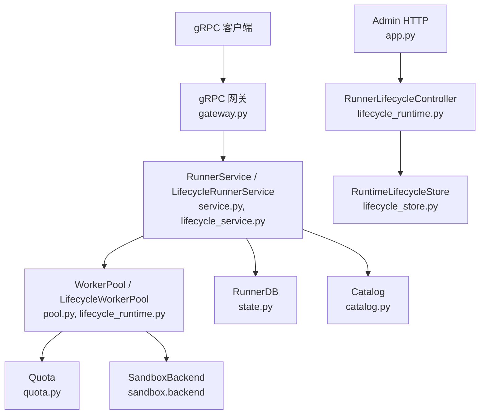

**图表来源**
- [runner_engine/gateway.py:44-127](file://runner_engine/gateway.py#L44-L127)
- [runner_engine/service.py:80-115](file://runner_engine/service.py#L80-L115)
- [runner_engine/lifecycle_service.py:7-70](file://runner_engine/lifecycle_service.py#L7-L70)
- [runner_engine/pool.py:11-46](file://runner_engine/pool.py#L11-L46)
- [runner_engine/quota.py:9-27](file://runner_engine/quota.py#L9-L27)
- [runner_engine/lifecycle_runtime.py:187-300](file://runner_engine/lifecycle_runtime.py#L187-L300)
- [runner_engine/lifecycle_store.py:35-56](file://runner_engine/lifecycle_store.py#L35-L56)
- [runner_engine/app.py:179-231](file://runner_engine/app.py#L179-L231)

**章节来源**
- [runner_engine/gateway.py:44-127](file://runner_engine/gateway.py#L44-L127)
- [runner_engine/app.py:179-231](file://runner_engine/app.py#L179-L231)

## 核心组件
- `LifecycleRunnerService`：继承自 `RunnerService`，在租约获取、续租和执行入口前检查运行时是否处于 RETIRING/RETIRED，阻止新执行进入。
- `LifecycleWorkerPool`：继承自 `WorkerPool`，在工作池层面增加生命周期门控锁，防止正在退出的运行时继续分配沙箱，并提供空闲工作器退役与快照。
- `RunnerLifecycleController`：对外暴露运行时图像级别的生命周期管理 API，包括开始退役、取消退役、最终退役、空闲工作器退役、运行时快照与图像状态查询。
- `RuntimeLifecycleStore`：使用 PostgreSQL 持久化运行时图像的 RETIRING/RETIRED 状态，支持开始退役、取消退役、最终退役与最近记录查询。
- `RunnerService`：通用 Runner 服务，负责租约、执行、幂等、后台清理、活跃调用跟踪等。
- `WorkerPool`：按租户+运行时+安全策略维度复用沙箱，负责创建、回收、销毁与 TTL 续期。
- `Quota`：限制全局与租户维度的沙箱并发创建与运行数量。
- `RunnerDB`：基于 PostgreSQL 的租约、执行历史与幂等键表管理。

**章节来源**
- [runner_engine/lifecycle_service.py:7-70](file://runner_engine/lifecycle_service.py#L7-L70)
- [runner_engine/lifecycle_runtime.py:14-121](file://runner_engine/lifecycle_runtime.py#L14-L121)
- [runner_engine/lifecycle_runtime.py:187-397](file://runner_engine/lifecycle_runtime.py#L187-L397)
- [runner_engine/lifecycle_store.py:35-151](file://runner_engine/lifecycle_store.py#L35-L151)
- [runner_engine/service.py:80-456](file://runner_engine/service.py#L80-L456)
- [runner_engine/pool.py:11-188](file://runner_engine/pool.py#L11-L188)
- [runner_engine/quota.py:9-61](file://runner_engine/quota.py#L9-L61)
- [runner_engine/state.py:131-685](file://runner_engine/state.py#L131-L685)

## 架构总览
Runner Engine 通过 gRPC 暴露 ManagedPythonRunner 服务，生命周期扩展点位于服务层与工作池层：
- gRPC 网关解析请求并进行鉴权，然后调用服务层方法
- `LifecycleRunnerService` 在关键路径上拦截对 RETIRING/RETIRED 运行时的新请求
- `LifecycleWorkerPool` 在工作池分配阶段再次校验生命周期状态，关闭竞态窗口
- `RunnerLifecycleController` 提供管理员接口用于启动退役、取消退役、最终退役与状态观测
- `RuntimeLifecycleStore` 以数据库行作为权威状态源，保证跨进程一致性

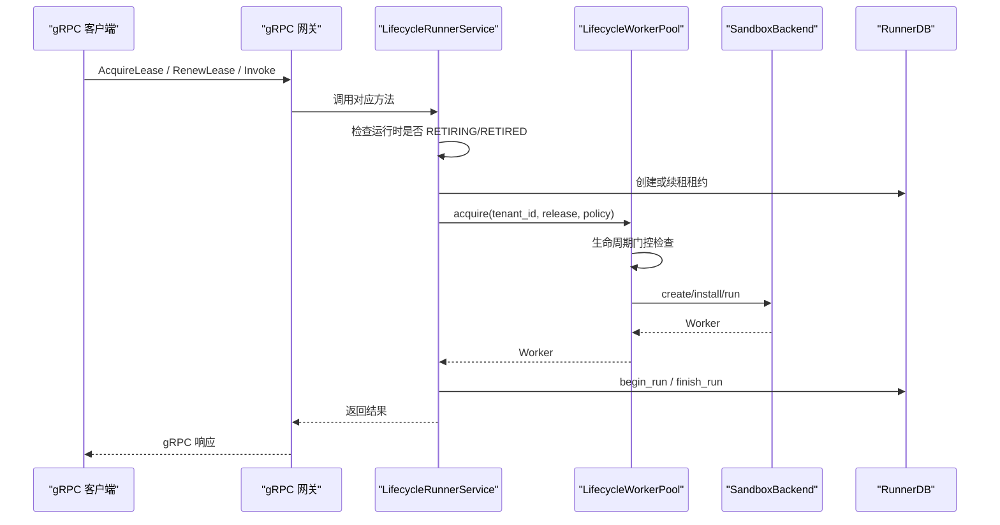

**图表来源**
- [runner_engine/gateway.py:98-127](file://runner_engine/gateway.py#L98-L127)
- [runner_engine/lifecycle_service.py:19-70](file://runner_engine/lifecycle_service.py#L19-L70)
- [runner_engine/lifecycle_runtime.py:26-47](file://runner_engine/lifecycle_runtime.py#L26-L47)
- [runner_engine/service.py:146-180](file://runner_engine/service.py#L146-L180)
- [runner_engine/service.py:188-410](file://runner_engine/service.py#L188-L410)
- [runner_engine/state.py:283-369](file://runner_engine/state.py#L283-L369)

## 详细组件分析

### LifecycleRunnerService：生命周期门控的服务层
`LifecycleRunnerService` 的核心职责是在三个关键入口前检查运行时生命周期：
- `acquire_lease`：在创建租约前检查 release 对应的运行时是否可接受新执行
- `renew_lease`：在续租前检查租约关联的 release 对应的运行时是否仍可续租
- `invoke`：在执行前检查 release 对应的运行时是否仍可执行

其内部 `_assert_runtime_active` 会读取 `RuntimeLifecycleStore` 中该 runtime_id 的记录：
- 若状态为 RETIRED，抛出 RUNTIME_RETIRED
- 若状态为 RETIRING，抛出 RUNTIME_RETIRING，且标记为可重试

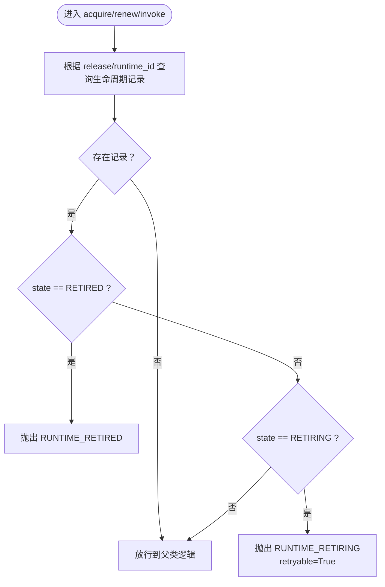

**图表来源**
- [runner_engine/lifecycle_service.py:19-32](file://runner_engine/lifecycle_service.py#L19-L32)
- [runner_engine/lifecycle_service.py:34-70](file://runner_engine/lifecycle_service.py#L34-L70)

**章节来源**
- [runner_engine/lifecycle_service.py:7-70](file://runner_engine/lifecycle_service.py#L7-L70)

### LifecycleWorkerPool：工作池生命周期门控与空闲退役
`LifecycleWorkerPool` 在 `WorkerPool.acquire` 之前增加生命周期门控：
- 使用 `threading.RLock()` 保护生命周期检查与 acquiring 计数
- 如果运行时被标记为阻塞（即已存在生命周期记录），直接拒绝分配
- 在成功进入父类 acquire 前后维护 per-runtime 的 acquiring 计数，便于快照与诊断

此外提供：
- `retire_runtime(runtime_id)`：从空闲池中移除指定运行时所有空闲 worker 并销毁
- `retire_idle_worker(worker_id)`：按 worker_id 退役单个空闲 worker
- `snapshot()`：返回空闲 worker 列表与按运行时分组的 acquiring 计数

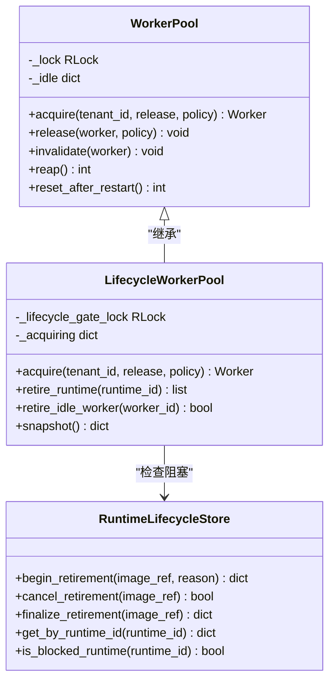

**图表来源**
- [runner_engine/pool.py:11-188](file://runner_engine/pool.py#L11-L188)
- [runner_engine/lifecycle_runtime.py:14-121](file://runner_engine/lifecycle_runtime.py#L14-L121)
- [runner_engine/lifecycle_store.py:35-151](file://runner_engine/lifecycle_store.py#L35-L151)

**章节来源**
- [runner_engine/lifecycle_runtime.py:14-121](file://runner_engine/lifecycle_runtime.py#L14-L121)
- [runner_engine/pool.py:73-131](file://runner_engine/pool.py#L73-L131)

### RunnerLifecycleController：运行时图像生命周期管理
`RunnerLifecycleController` 提供面向管理员的运行时图像生命周期管理能力：
- `runtime_image_status(image_ref)`：查询图像对应的运行时 ID、生命周期状态、发布版本、未过期租约数、活跃调用、空闲 worker、正在分配的 worker、受管沙箱以及是否可安全删除制品
- `begin_runtime_retirement(image_ref, reason)`：开始退役；若已为 RETIRED 则直接返回状态；否则更新存储并退役空闲 worker
- `cancel_runtime_retirement(image_ref)`：取消退役；若已 RETIRED 则拒绝
- `finalize_runtime_retirement(image_ref)`：最终退役；要求无活跃调用、无空闲 worker、无正在分配、无受管沙箱
- `retire_idle_worker(worker_id)`：退役指定空闲 worker
- `runtime_snapshot()`：返回当前进程内活跃调用、空闲 worker、按运行时分组正在分配计数与近期生命周期记录

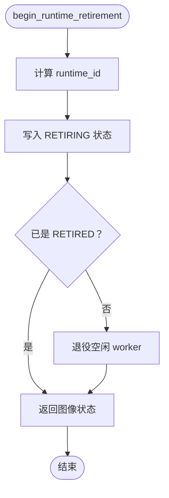

**图表来源**
- [runner_engine/lifecycle_runtime.py:302-323](file://runner_engine/lifecycle_runtime.py#L302-L323)
- [runner_engine/lifecycle_store.py:82-108](file://runner_admin/lifecycle_store.py#L82-L108)

**章节来源**
- [runner_engine/lifecycle_runtime.py:187-397](file://runner_engine/lifecycle_runtime.py#L187-L397)

### RuntimeLifecycleStore：生命周期持久化
`RuntimeLifecycleStore` 使用 PostgreSQL 表 `runner.runtime_image_lifecycle` 持久化运行时图像生命周期：
- `begin_retirement`：插入或更新为 RETIRING，保留 RE TIRED 状态不变
- `cancel_retirement`：仅当状态为 RETIRING 时删除记录
- `finalize_retirement`：将状态更新为 RETIRED，并设置 retired_at
- `list_recent`：按更新时间倒序返回最近记录

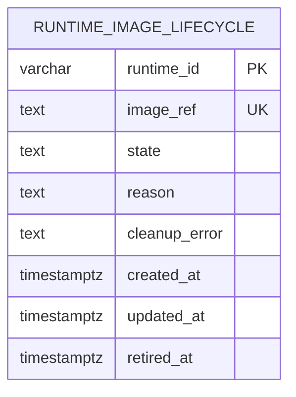

**图表来源**
- [runner_engine/lifecycle_store.py:10-28](file://runner_engine/lifecycle_store.py#L10-L28)

**章节来源**
- [runner_engine/lifecycle_store.py:35-151](file://runner_engine/lifecycle_store.py#L35-L151)

### gRPC 接口与错误映射
ManagedPythonRunner 定义健康检查、租约获取、续租、执行、取消与释放租约等 RPC。gRPC 网关将 `RunnerError` 映射为合适的 gRPC 状态码：
- UNAUTHENTICATED → UNAUTHENTICATED
- FORBIDDEN/CANCEL_FORBIDDEN → PERMISSION_DENIED
- RELEASE_NOT_FOUND/LEASE_UNKNOWN → NOT_FOUND
- retryable 错误 → UNAVAILABLE
- 其他错误 → FAILED_PRECONDITION

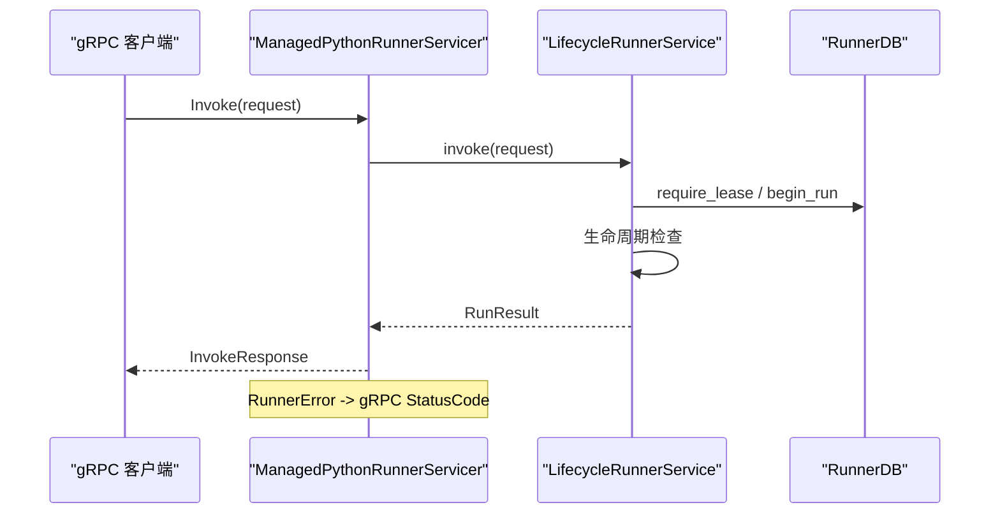

**图表来源**
- [proto/runner.proto:8-76](file://proto/runner.proto#L8-L76)
- [runner_engine/gateway.py:67-127](file://runner_engine/gateway.py#L67-L127)
- [runner_engine/service.py:188-410](file://runner_engine/service.py#L188-L410)

**章节来源**
- [proto/runner.proto:8-76](file://proto/runner.proto#L8-L76)
- [runner_engine/gateway.py:44-127](file://runner_engine/gateway.py#L44-L127)

### 生命周期状态转换规则
运行时图像生命周期状态转换如下：
- ACTIVE：默认状态，未存在生命周期记录
- RETIRING：调用 `begin_runtime_retirement` 后进入；此时仍允许已有执行完成，但禁止新租约、续租与执行
- RETIRED：调用 `finalize_runtime_retirement` 后进入；表示已完成清理，不再接受任何新执行

触发条件与规则：
- 开始退役：
  - 若已 RETIRED，直接返回当前状态
  - 否则写入 RETIRING，并退役空闲 worker
- 取消退役：
  - 若已 RETIRED，拒绝重新激活
  - 否则删除 RETIRING 记录，回到 ACTIVE
- 最终退役：
  - 必须满足：无活跃调用、无空闲 worker、无正在分配、无受管沙箱
  - 成功后状态变为 RETIRED

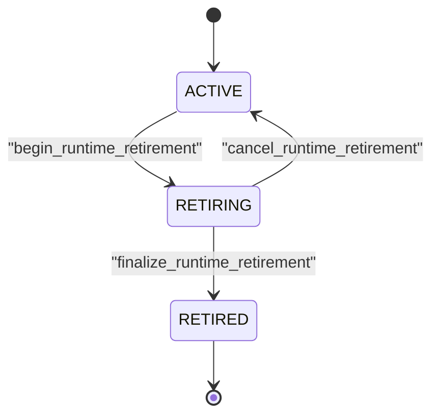

**图表来源**
- [runner_engine/lifecycle_runtime.py:302-359](file://runner_engine/lifecycle_runtime.py#L302-L359)
- [runner_engine/lifecycle_store.py:82-136](file://runner_engine/lifecycle_store.py#L82-L136)

**章节来源**
- [runner_engine/lifecycle_runtime.py:302-359](file://runner_engine/lifecycle_runtime.py#L302-L359)
- [runner_engine/lifecycle_store.py:82-136](file://runner_engine/lifecycle_store.py#L82-L136)

### 并发控制与资源竞争避免
- 服务层锁：
  - `RunnerService._active_lock`：保护活跃调用字典，避免重复 invocation_id 与并发注册
- 工作池锁：
  - `WorkerPool._lock`：保护空闲池结构与 worker 销毁
  - `LifecycleWorkerPool._lifecycle_gate_lock`：保护生命周期检查与 acquiring 计数
- 配额锁：
  - `Quota._lock`：保护全局与租户维度的 live 计数
- 事务边界：
  - `RunnerDB` 与 `RuntimeLifecycleStore` 均使用 psycopg_pool 连接上下文，确保单条 SQL 的事务性
  - `begin_run` 使用 FOR UPDATE 锁定幂等键行，避免并发重复执行
- 资源竞争避免：
  - 生命周期检查在服务层与工作池层双重拦截，关闭竞态窗口
  - `_destroy` 使用 destroyed 标志与锁保证单次销毁与配额释放
  - `reset_after_restart` 清空内存池并清理后端受管资源

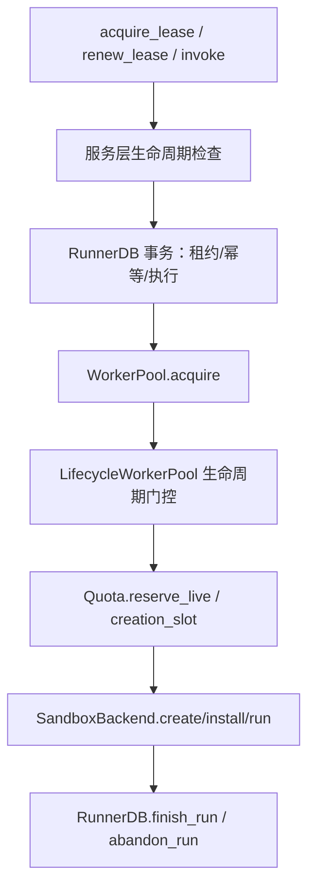

**图表来源**
- [runner_engine/service.py:238-410](file://runner_engine/service.py#L238-L410)
- [runner_engine/lifecycle_runtime.py:26-47](file://runner_engine/lifecycle_runtime.py#L26-L47)
- [runner_engine/pool.py:148-160](file://runner_engine/pool.py#L148-L160)
- [runner_engine/quota.py:36-55](file://runner_engine/quota.py#L36-L55)
- [runner_engine/state.py:411-521](file://runner_engine/state.py#L411-L521)

**章节来源**
- [runner_engine/service.py:238-410](file://runner_engine/service.py#L238-L410)
- [runner_engine/lifecycle_runtime.py:26-47](file://runner_engine/lifecycle_runtime.py#L26-L47)
- [runner_engine/pool.py:148-160](file://runner_engine/pool.py#L148-L160)
- [runner_engine/quota.py:36-55](file://runner_engine/quota.py#L36-L55)
- [runner_engine/state.py:411-521](file://runner_engine/state.py#L411-L521)

### 与配额系统、工作池和沙箱后端的集成
- 配额系统：
  - `Quota` 限制全局与租户维度的 live 沙箱数量，并通过 `creation_slot` 限制并发创建
  - `WorkerPool.acquire` 在创建前预留 live 配额，失败时回滚
- 工作池：
  - 按 tenant_id + runtime.id + profile 维度复用 worker
  - 支持 idle_seconds、orphan_ttl_seconds、renew_before_seconds、max_installed_releases 等参数
  - 支持 reaping 空闲超时 worker 与重启后清理
- 沙箱后端：
  - `LifecycleOpenSandboxBackend.list_managed` 可扩展查询受管沙箱，供生命周期控制器判断是否可安全删除制品

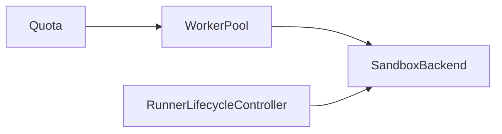

**图表来源**
- [runner_engine/quota.py:9-61](file://runner_engine/quota.py#L9-L61)
- [runner_engine/pool.py:11-188](file://runner_engine/pool.py#L11-L188)
- [runner_engine/lifecycle_runtime.py:123-184](file://runner_engine/lifecycle_runtime.py#L123-L184)

**章节来源**
- [runner_engine/quota.py:9-61](file://runner_engine/quota.py#L9-L61)
- [runner_engine/pool.py:11-188](file://runner_engine/pool.py#L11-L188)
- [runner_engine/lifecycle_runtime.py:123-184](file://runner_engine/lifecycle_runtime.py#L123-L184)

## 依赖关系分析
- `LifecycleRunnerService` 依赖：
  - `RunnerService`：通用服务逻辑
  - `RuntimeLifecycleStore`：生命周期状态查询
- `LifecycleWorkerPool` 依赖：
  - `WorkerPool`：基础工作池行为
  - `RuntimeLifecycleStore`：生命周期门控
- `RunnerLifecycleController` 依赖：
  - `RunnerService`：访问 pool、db、catalog、active 状态
  - `RuntimeLifecycleStore`：生命周期状态变更
- `RunnerService` 依赖：
  - `RunnerDB`：租约、执行、幂等
  - `WorkerPool`：worker 分配与回收
  - `Catalog`：release 与策略
- `WorkerPool` 依赖：
  - `Quota`：配额控制
  - `SandboxBackend`：沙箱生命周期

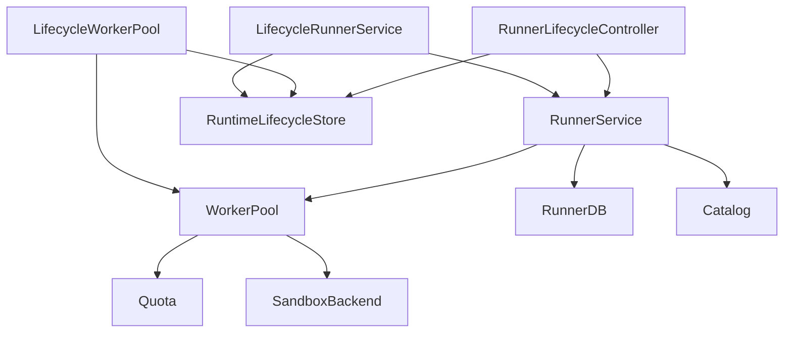

**图表来源**
- [runner_engine/lifecycle_service.py:7-70](file://runner_engine/lifecycle_service.py#L7-L70)
- [runner_engine/lifecycle_runtime.py:14-121](file://runner_engine/lifecycle_runtime.py#L14-L121)
- [runner_engine/lifecycle_runtime.py:187-397](file://runner_engine/lifecycle_runtime.py#L187-L397)
- [runner_engine/service.py:80-456](file://runner_engine/service.py#L80-L456)
- [runner_engine/pool.py:11-188](file://runner_engine/pool.py#L11-L188)
- [runner_engine/quota.py:9-61](file://runner_engine/quota.py#L9-L61)

**章节来源**
- [runner_engine/lifecycle_service.py:7-70](file://runner_engine/lifecycle_service.py#L7-L70)
- [runner_engine/lifecycle_runtime.py:14-121](file://runner_engine/lifecycle_runtime.py#L14-L121)
- [runner_engine/lifecycle_runtime.py:187-397](file://runner_engine/lifecycle_runtime.py#L187-L397)
- [runner_engine/service.py:80-456](file://runner_engine/service.py#L80-L456)
- [runner_engine/pool.py:11-188](file://runner_engine/pool.py#L11-L188)
- [runner_engine/quota.py:9-61](file://runner_engine/quota.py#L9-L61)

## 性能与并发特性
- 并发模型：
  - gRPC 服务端使用多线程执行器，服务层方法本身无全局锁，依赖细粒度锁保护共享状态
  - `RunnerService._active_lock` 与 `WorkerPool._lock` 均为 RLock，避免重入死锁
- 数据库连接池：
  - `RunnerDB` 与 `RuntimeLifecycleStore` 使用 psycopg_pool，分别配置不同大小，降低连接争用
- 幂等与重试：
  - `begin_run` 使用 FOR UPDATE 锁定幂等键，避免重复执行
  - gateway 将 retryable 错误映射为 UNAVAILABLE，便于客户端重试
- 资源清理：
  - 后台清理线程定期回收空闲 worker、过期租约、过期幂等键与旧执行记录
- 生命周期影响：
  - RETIRING 状态下禁止新租约与执行，减少新负载进入
  - finalize 前检查活跃调用、空闲 worker、正在分配与受管沙箱，确保清理安全

[本节为通用性能讨论，不直接分析具体代码文件]

## 故障排查指南
常见问题与定位步骤：
- 运行时处于 RETIRING/RETIRED：
  - 现象：acquire_lease、renew_lease、invoke 抛出 RUNTIME_RETIRING 或 RUNTIME_RETIRED
  - 排查：
    - 查询 `RuntimeLifecycleStore` 中对应 runtime_id 的状态
    - 使用 `RunnerLifecycleController.runtime_image_status` 查看活跃调用、空闲 worker、正在分配与受管沙箱
    - 若需恢复，调用 `cancel_runtime_retirement`；若需彻底退役，调用 `finalize_runtime_retirement`
- 工作池无法分配 worker：
  - 现象：acquire 抛出配额错误或后端创建失败
  - 排查：
    - 检查 `Quota.live` 与租户配额
    - 检查后端是否可用，必要时调用 `retire_idle_worker` 清理异常 worker
- 执行未完成或卡住：
  - 现象：RUNNING 状态长期存在
  - 排查：
    - 检查 `RunnerDB.reset_running` 是否在启动时将 stale RUNNING 转为 ABANDONED
    - 使用 `runtime_snapshot` 查看活跃调用与 worker 信息
- gRPC 错误码：
  - UNAVAILABLE：通常为 retryable 错误，客户端应重试
  - PERMISSION_DENIED：权限不足或 cancel_forbidden
  - NOT_FOUND：release 或 lease 不存在
  - FAILED_PRECONDITION：业务前置条件不满足

**章节来源**
- [runner_engine/lifecycle_service.py:19-32](file://runner_engine/lifecycle_service.py#L19-L32)
- [runner_engine/lifecycle_runtime.py:239-300](file://runner_engine/lifecycle_runtime.py#L239-L300)
- [runner_engine/lifecycle_runtime.py:325-359](file://runner_engine/lifecycle_runtime.py#L325-L359)
- [runner_engine/gateway.py:67-97](file://runner_engine/gateway.py#L67-L97)
- [runner_engine/state.py:388-409](file://runner_engine/state.py#L388-L409)

## 结论
`LifecycleRunnerService` 通过在服务层与工作池层双重拦截生命周期状态，确保 RETIRING/RETIRED 运行时不会接受新执行，同时保持已有执行的正常完成。配合 `RunnerLifecycleController` 与 `RuntimeLifecycleStore`，系统提供了完整的运行时图像生命周期管理能力，并与配额系统、工作池和沙箱后端紧密集成。通过细粒度锁、事务边界与幂等机制，系统在并发环境下具备较强的健壮性与可观测性。运维侧可通过 Admin HTTP 与 gRPC 接口进行状态监控与生命周期管理，结合错误码与日志快速定位问题。

[本节为总结性内容，不直接分析具体代码文件]