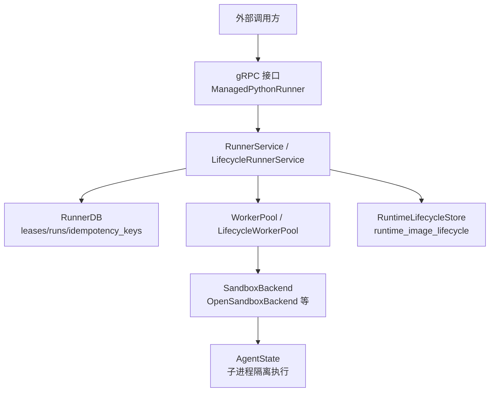
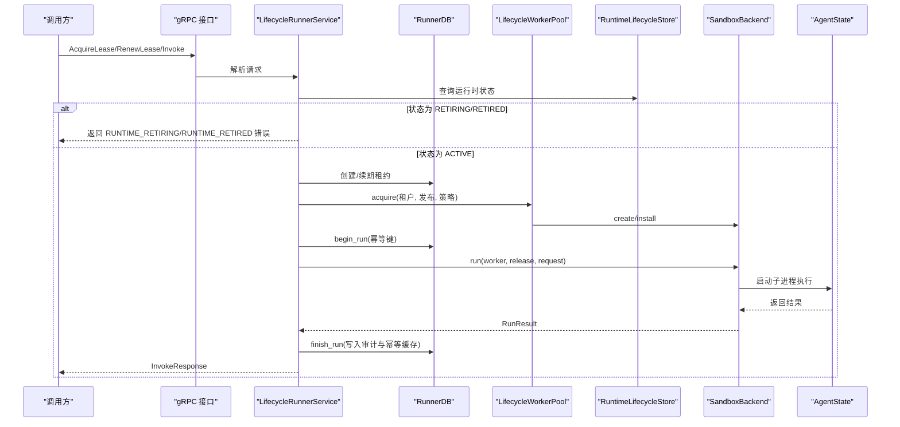
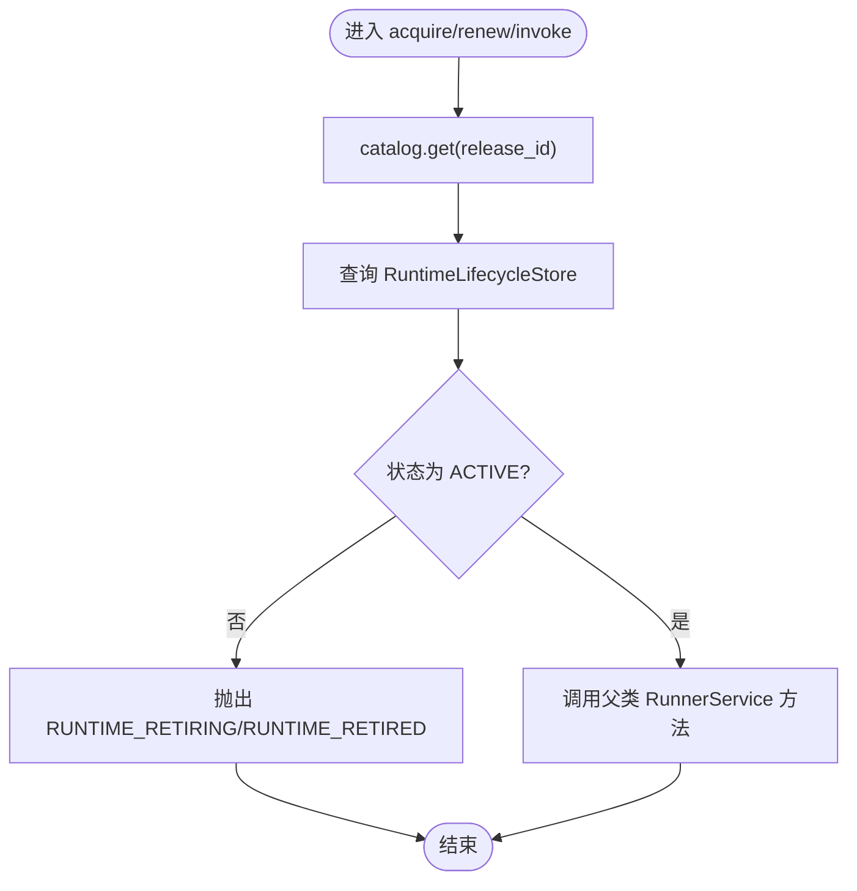
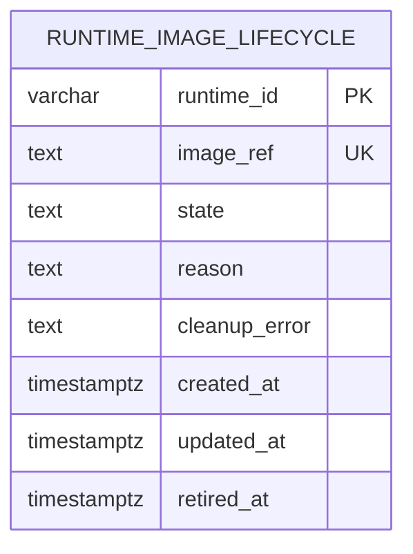
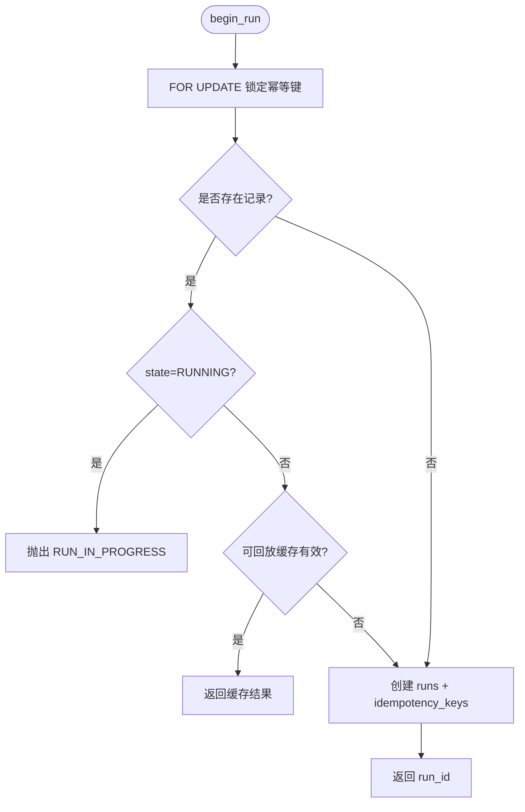
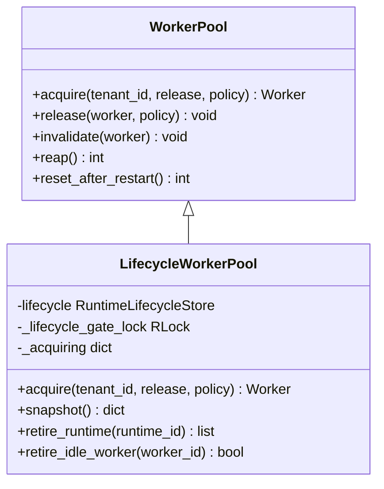
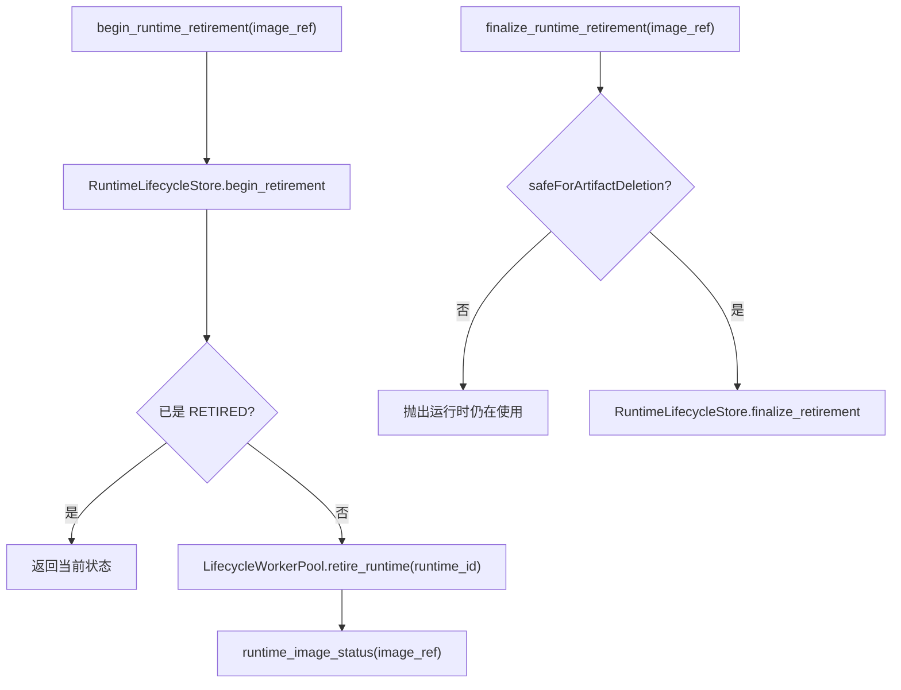
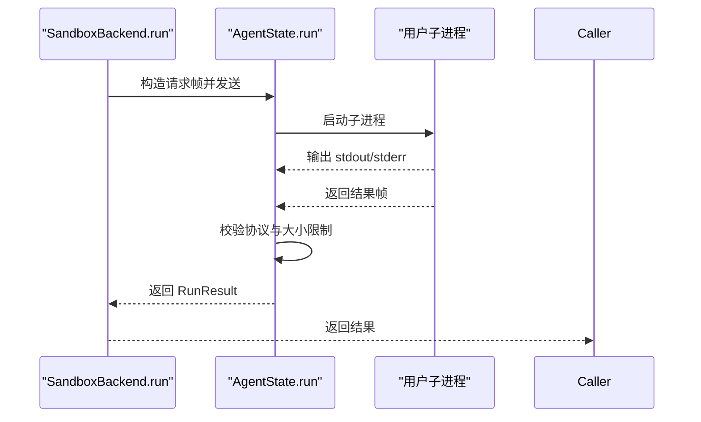
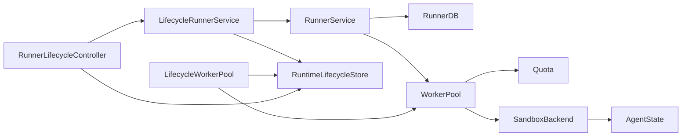

# 生命周期管理

<cite>
**本文引用的文件**   
- [lifecycle_service.py](file://runner_engine/lifecycle_service.py)
- [lifecycle_store.py](file://runner_engine/lifecycle_store.py)
- [state.py](file://runner_engine/state.py)
- [pool.py](file://runner_engine/pool.py)
- [service.py](file://runner_engine/service.py)
- [lifecycle_runtime.py](file://runner_engine/lifecycle_runtime.py)
- [backend.py](file://runner_engine/sandbox/backend.py)
- [agent.py](file://runner_engine/worker/agent.py)
- [quota.py](file://runner_engine/quota.py)
- [errors.py](file://runner_engine/errors.py)
- [runner.proto](file://proto/runner.proto)
</cite>

## 目录
1. [引言](#引言)
2. [项目结构](#项目结构)
3. [核心组件](#核心组件)
4. [架构总览](#架构总览)
5. [详细组件分析](#详细组件分析)
6. [依赖关系分析](#依赖关系分析)
7. [性能与容量规划](#性能与容量规划)
8. [故障排查指南](#故障排查指南)
9. [结论](#结论)

## 引言
本文面向 Runner Engine 的生命周期管理子系统，系统性说明算子从创建、启动、运行到销毁的完整生命周期流程，重点覆盖：
- 状态机与持久化：RuntimeLifecycleStore 的状态定义、事务语义和一致性保证。
- 服务层控制：LifecycleRunnerService 如何拦截新租约、续租和调用，确保进入退役状态的运行时不再接受新执行。
- 并发与资源：WorkerPool/LifecycleWorkerPool 的沙箱池、配额系统 Quota 以及后端 SandboxBackend 的协作。
- 可观测性与运维：生命周期快照、活跃调用追踪、后台清理任务。
- 错误恢复策略：幂等执行、租约过期、进程重启恢复、沙箱回收与重试边界。

## 项目结构
Runner Engine 中与管理算子生命周期相关的代码主要分布在 runner_engine 包内，并与 proto 接口定义协同工作：
- 协议层：proto/runner.proto 定义了 gRPC 接口，包括健康检查、租约获取/续期/释放、调用、取消等。
- 服务层：service.py 提供通用 RunnerService；lifecycle_service.py 在其之上增加“运行时退役”门控。
- 存储层：state.py 提供 RunnerDB（租约、执行历史、幂等缓存）；lifecycle_store.py 提供 RuntimeLifecycleStore（运行时镜像退役状态）。
- 资源层：pool.py 提供 WorkerPool；lifecycle_runtime.py 扩展为 LifecycleWorkerPool，并实现 RunnerLifecycleController。
- 沙箱后端：sandbox/backend.py 定义抽象接口；具体后端由 OpenSandboxBackend 等实现。
- 工作进程：worker/agent.py 负责在沙箱内安全地启动用户算子进程，处理超时、日志限制、结果校验等。
- 配额与错误：quota.py 提供全局/租户级配额；errors.py 定义统一错误类型。

图表来源
- [runner.proto:8-15](file://proto/runner.proto#L8-L15)
- [service.py:80-99](file://runner_engine/service.py#L80-L99)
- [lifecycle_service.py:7-17](file://runner_engine/lifecycle_service.py#L7-L17)
- [state.py:131-149](file://runner_engine/state.py#L131-L149)
- [lifecycle_store.py:35-47](file://runner_engine/lifecycle_store.py#L35-L47)
- [pool.py:11-46](file://runner_engine/pool.py#L11-L46)
- [backend.py:14-49](file://runner_engine/sandbox/backend.py#L14-L49)
- [agent.py:309-349](file://runner_engine/worker/agent.py#L309-L349)

章节来源
- [runner.proto:1-76](file://proto/runner.proto#L1-L76)
- [service.py:1-456](file://runner_engine/service.py#L1-L456)
- [lifecycle_service.py:1-71](file://runner_engine/lifecycle_service.py#L1-L71)
- [state.py:1-685](file://runner_engine/state.py#L1-L685)
- [lifecycle_store.py:1-151](file://runner_engine/lifecycle_store.py#L1-L151)
- [pool.py:1-188](file://runner_engine/pool.py#L1-L188)
- [lifecycle_runtime.py:1-397](file://runner_engine/lifecycle_runtime.py#L1-L397)
- [backend.py:1-49](file://runner_engine/sandbox/backend.py#L1-L49)
- [agent.py:1-939](file://runner_engine/worker/agent.py#L1-L939)
- [quota.py:1-61](file://runner_engine/quota.py#L1-L61)
- [errors.py:1-22](file://runner_engine/errors.py#L1-L22)

## 核心组件
- LifecycleRunnerService：在 RunnerService 基础上增加运行时状态门控，阻止 RETIRING/RETIRED 的运行时接受新租约、续租或调用。
- RuntimeLifecycleStore：基于 PostgreSQL 的运行时镜像退役状态表，支持开始退役、取消退役、最终确认退役、查询最近记录。
- RunnerDB：租约、执行历史和幂等性缓存的持久化层，提供 begin_run/finish_run/abandon_run 等原子操作。
- WorkerPool/LifecycleWorkerPool：按租户+运行时+安全策略分桶维护空闲沙箱，负责创建、安装发布版本、TTL 续期、回收和销毁。
- SandboxBackend：沙箱后端抽象，封装 create/renew/install/run/cancel/destroy/cleanup_managed 等操作。
- AgentState：沙箱内的可信代理，负责安装发布、启动用户子进程、限制输出、校验协议、处理取消和超时。
- Quota：内存中的配额控制器，限制全局和租户级同时存在的沙箱数量，以及并发创建数。

章节来源
- [lifecycle_service.py:7-71](file://runner_engine/lifecycle_service.py#L7-L71)
- [lifecycle_store.py:10-151](file://runner_engine/lifecycle_store.py#L10-L151)
- [state.py:131-685](file://runner_engine/state.py#L131-L685)
- [pool.py:11-188](file://runner_engine/pool.py#L11-L188)
- [lifecycle_runtime.py:14-121](file://runner_engine/lifecycle_runtime.py#L14-L121)
- [backend.py:14-49](file://runner_engine/sandbox/backend.py#L14-L49)
- [agent.py:309-798](file://runner_engine/worker/agent.py#L309-L798)
- [quota.py:9-61](file://runner_engine/quota.py#L9-L61)

## 架构总览
Runner Engine 的生命周期管理围绕“运行时镜像退役状态”这一权威源展开。所有新建执行路径都会经过该状态门控，从而保证退役期间不会分配新的沙箱，也不会接受新的调用。

图表来源
- [lifecycle_service.py:19-70](file://runner_engine/lifecycle_service.py#L19-L70)
- [lifecycle_store.py:57-151](file://runner_engine/lifecycle_store.py#L57-L151)
- [state.py:283-607](file://runner_engine/state.py#L283-L607)
- [pool.py:73-130](file://runner_engine/pool.py#L73-L130)
- [service.py:188-331](file://runner_engine/service.py#L188-L331)
- [agent.py:467-778](file://runner_engine/worker/agent.py#L467-L778)

## 详细组件分析

### LifecycleRunnerService：运行时退役门控
LifecycleRunnerService 继承 RunnerService，并在三个关键入口增加运行时状态检查：
- acquire_lease：通过 catalog 获取 release，再根据 runtime.id 查询 RuntimeLifecycleStore，若处于 RETIRING/RETIRED，则抛出对应错误。
- renew_lease：先 require_lease 校验租约归属，再检查 release 对应的运行时状态。
- invoke：同样在调用前检查运行时状态，避免在退役窗口内继续调度。

该设计将“是否允许新执行”的判断下沉到运行时维度，而不是仅依赖 WorkerPool 内部逻辑，从而形成双重保障。

图表来源
- [lifecycle_service.py:19-70](file://runner_engine/lifecycle_service.py#L19-L70)
- [lifecycle_store.py:57-80](file://runner_engine/lifecycle_store.py#L57-L80)

章节来源
- [lifecycle_service.py:7-71](file://runner_engine/lifecycle_service.py#L7-L71)

### RuntimeLifecycleStore：状态持久化与事务语义
RuntimeLifecycleStore 使用 PostgreSQL 表 runner.runtime_image_lifecycle 保存运行时镜像的退役状态，关键字段包括：
- runtime_id：由 image_ref 计算得到，作为主键。
- state：枚举 RETIRING/RETIRED。
- reason：退役原因。
- cleanup_error：清理失败时记录错误。
- created_at/updated_at/retired_at：时间戳。

核心方法：
- begin_retirement：插入或更新为 RETIRING，若已存在且为 RETIRED，则保持 RETIRED。
- cancel_retirement：删除 RETIRING 的记录，表示取消退役。
- finalize_retirement：将状态改为 RETIRED，并设置 retired_at。
- get_by_runtime_id/get_by_image/is_blocked_runtime：查询与阻塞判断。
- list_recent：按更新时间倒序返回最近记录。

一致性保证：
- 所有写操作均通过 psycopg_pool 连接上下文执行，保证单条 SQL 的事务语义。
- begin_retirement 使用 INSERT ... ON CONFLICT DO UPDATE，结合 CASE 表达式保证 RETIRED 不会被回退为 RETIRING。
- finalize_retirement 仅在 RETIRING 状态下成功推进到 RETIRED。

图表来源
- [lifecycle_store.py:10-28](file://runner_engine/lifecycle_store.py#L10-L28)

章节来源
- [lifecycle_store.py:10-151](file://runner_engine/lifecycle_store.py#L10-L151)

### RunnerDB：租约、执行历史与幂等缓存
RunnerDB 管理三张核心表：
- runner.leases：租约表，包含租户、项目、处理器、发布、过期时间。
- runner.runs：执行审计历史，包含状态 RUNNING/DONE/ABANDONED、结果分类、错误信息、耗时等。
- runner.idempotency_keys：短生命周期幂等缓存，用于重复请求去重与结果回放。

关键流程：
- begin_run：对 idempotency_key 加 FOR UPDATE 行锁，判断是否存在正在运行的相同逻辑请求；若命中可回放缓存，直接返回缓存结果；否则创建 runs 与 idempotency_keys 记录。
- finish_run：将 runs 标记 DONE，并同步更新 idempotency_keys 的可回放结果与过期时间。
- abandon_run：将 runs 标记 ABANDONED，并清理 idempotency_keys 中的 RUNNING 记录。
- reset_running：进程重启时将 RUNNING 转为 ABANDONED，并清理 idempotency_keys 中的 RUNNING 记录。

图表来源
- [state.py:411-521](file://runner_engine/state.py#L411-L521)

章节来源
- [state.py:16-82](file://runner_engine/state.py#L16-L82)
- [state.py:131-280](file://runner_engine/state.py#L131-L280)
- [state.py:283-685](file://runner_engine/state.py#L283-L685)

### LifecycleWorkerPool：沙箱池与生命周期门控
LifecycleWorkerPool 继承 WorkerPool，新增：
- _lifecycle_gate_lock：保护 acquire 过程中的运行时状态检查与计数。
- _acquiring：按 runtime_id 统计正在 acquire 的请求数，便于监控与判定“可安全删除制品”的条件。
- acquire：若运行时被标记为退役，直接拒绝；否则放行至父类 acquire。
- retire_runtime：立即销毁属于指定 runtime_id 的所有空闲 worker。
- retire_idle_worker：按 worker_id 精确销毁空闲 worker。
- snapshot：暴露 idleWorkers、acquiringByRuntime 等指标。

图表来源
- [pool.py:11-188](file://runner_engine/pool.py#L11-L188)
- [lifecycle_runtime.py:14-121](file://runner_engine/lifecycle_runtime.py#L14-L121)

章节来源
- [pool.py:11-188](file://runner_engine/pool.py#L11-L188)
- [lifecycle_runtime.py:14-121](file://runner_engine/lifecycle_runtime.py#L14-L121)

### RunnerLifecycleController：生命周期 API 与状态聚合
RunnerLifecycleController 提供以下能力：
- runtime_image_status：聚合运行时状态、关联发布、未过期租约数、活跃调用、空闲 worker、acquiring 计数、受管沙箱列表，并计算 safeForArtifactDeletion。
- begin_runtime_retirement：在持有 pool._lifecycle_gate_lock 的情况下写入 RETIRING，并销毁空闲 worker。
- cancel_runtime_retirement：删除 RETIRING 记录，重置为 ACTIVE。
- finalize_runtime_retirement：校验 safeForArtifactDeletion 后推进到 RETIRED。
- retire_idle_worker：按 worker_id 销毁空闲 worker。
- runtime_snapshot：汇总活跃调用、空闲 worker、acquiring 计数、最近生命周期记录。

safeForArtifactDeletion 条件：
- 运行时状态为 RETIRING。
- 无活跃调用、无空闲 worker、无 acquiring 请求。
- 无受管沙箱。

图表来源
- [lifecycle_runtime.py:187-359](file://runner_engine/lifecycle_runtime.py#L187-L359)
- [lifecycle_store.py:82-136](file://runner_engine/lifecycle_store.py#L82-L136)

章节来源
- [lifecycle_runtime.py:187-397](file://runner_engine/lifecycle_runtime.py#L187-L397)

### SandboxBackend 与 AgentState：执行隔离与错误恢复
SandboxBackend 定义统一的沙箱后端接口，包括创建、续期、安装发布、运行、取消、销毁、清理受管沙箱等。
AgentState 在沙箱内负责：
- 安装发布工件并验证 manifest。
- 准备隔离的工作空间与权限。
- 启动用户子进程，限制 stdout/stderr 大小，限制协议帧大小。
- 处理超时、取消、信号终止、协议校验失败等场景，并返回结构化错误码。
- 清理临时目录与进程组。

图表来源
- [backend.py:14-49](file://runner_engine/sandbox/backend.py#L14-L49)
- [agent.py:467-778](file://runner_engine/worker/agent.py#L467-L778)

章节来源
- [backend.py:14-49](file://runner_engine/sandbox/backend.py#L14-L49)
- [agent.py:309-798](file://runner_engine/worker/agent.py#L309-L798)

### 配额系统 Quota：并发与容量控制
Quota 提供：
- creation_slot：限制并发创建沙箱的数量。
- reserve_live/release_live：跟踪全局与租户级的实际存活沙箱数量。
- live：只读属性，返回当前存活沙箱总数。

当达到全局或租户级上限时，会抛出 QuotaError，标记为可重试。

章节来源
- [quota.py:9-61](file://runner_engine/quota.py#L9-L61)

### gRPC 接口与调用示例
ManagedPythonRunner 接口定义：
- Health：健康检查。
- AcquireLease：获取租约。
- RenewLease：续期租约。
- Invoke：执行算子。
- Cancel：取消执行。
- ReleaseLease：释放租约。

调用示例（概念性步骤）：
- 调用方先调用 AcquireLease，获得 lease_id 与过期时间。
- 在过期前周期性调用 RenewLease 延长租约。
- 调用 Invoke，携带 tenant_id、lease_id、release_id、invocation_id、idempotency_key、content、attributes、parameters、timeout_ms。
- 如需取消，调用 Cancel 传入 lease_id 与 invocation_id。
- 完成后调用 ReleaseLease 释放租约。

章节来源
- [runner.proto:8-76](file://proto/runner.proto#L8-L76)

## 依赖关系分析
- LifecycleRunnerService 依赖 Catalog、RunnerDB、WorkerPool、SecurityPolicy，并通过 lifecycle_store 查询运行时状态。
- LifecycleWorkerPool 依赖 RuntimeLifecycleStore 进行退役门控，并复用 WorkerPool 的沙箱管理逻辑。
- RunnerLifecycleController 依赖 service、lifecycle_store、pool.snapshot 与 backend.list_managed。
- RunnerService.invoke 依赖 db.begin_run/finish_run/abandon_run 与 pool.acquire/release/invalidated。
- WorkerPool 依赖 Quota 与 SandboxBackend。
- AgentState 依赖 ReleaseMaterializer 与操作系统进程管理能力。

图表来源
- [lifecycle_service.py:7-71](file://runner_engine/lifecycle_service.py#L7-L71)
- [service.py:80-99](file://runner_engine/service.py#L80-L99)
- [lifecycle_runtime.py:14-121](file://runner_engine/lifecycle_runtime.py#L14-L121)
- [pool.py:11-188](file://runner_engine/pool.py#L11-L188)
- [lifecycle_store.py:35-47](file://runner_engine/lifecycle_store.py#L35-L47)
- [state.py:131-149](file://runner_engine/state.py#L131-L149)
- [backend.py:14-49](file://runner_engine/sandbox/backend.py#L14-L49)
- [agent.py:309-349](file://runner_engine/worker/agent.py#L309-L349)

章节来源
- [lifecycle_service.py:7-71](file://runner_engine/lifecycle_service.py#L7-L71)
- [service.py:80-456](file://runner_engine/service.py#L80-L456)
- [lifecycle_runtime.py:14-397](file://runner_engine/lifecycle_runtime.py#L14-L397)
- [pool.py:11-188](file://runner_engine/pool.py#L11-L188)
- [lifecycle_store.py:35-151](file://runner_engine/lifecycle_store.py#L35-L151)
- [state.py:131-685](file://runner_engine/state.py#L131-L685)
- [backend.py:14-49](file://runner_engine/sandbox/backend.py#L14-L49)
- [agent.py:309-798](file://runner_engine/worker/agent.py#L309-L798)

## 性能与容量规划
- 数据库连接池：
  - RuntimeLifecycleStore 默认最小 1、最大 4 的连接池。
  - RunnerDB 默认最小 1、最大 16 的连接池。
- 后台清理任务：
  - RunnerService.start_background 定期执行 pool.reap、purge_expired_leases、purge_expired_idempotency、purge_old_runs。
- 沙箱 TTL 与续期：
  - LifecycleWorkerPool 在 acquire 时根据策略 max_timeout_ms 与 renew_before_seconds 决定是否续期。
- 配额限制：
  - Quota 限制全局与租户级同时存在的沙箱数量，以及并发创建数。
- 幂等与回放：
  - idempotency_keys 表支持非重试结果的短期回放，减少重复计算成本。

优化建议：
- 根据负载调整 RunnerDB 的最大连接数与 WorkerPool 的 idle_seconds、orphan_ttl_seconds、max_installed_releases。
- 合理配置 Quota 的 max_creating、max_live、max_live_per_tenant，避免热点租户独占资源。
- 根据业务数据量调整 idempotency_retention_ms 与 run_retention_ms，平衡回放需求与存储增长。
- 监控 RuntimeLifecycleStore 的 RETIRING/RETIRED 记录与 RunnerLifecycleController 的 runtime_snapshot，及时触发 finalize。

[本节为通用指导，不直接分析具体文件]

## 故障排查指南
常见错误与定位思路：
- RUNTIME_RETIRING/RUNTIME_RETIRED：
  - 现象：acquire_lease/renew_lease/invoke 被拒绝。
  - 排查：查看 RuntimeLifecycleStore 中对应 runtime_id 的 state 与 reason。
  - 处理：等待 activeInvocationCount 与 idleWorkerCount 归零，必要时调用 finalize_runtime_retirement。
- RUN_IN_PROGRESS：
  - 现象：相同 idempotency_key 的逻辑请求已在运行。
  - 排查：检查 runner.idempotency_keys 的 state 是否为 RUNNING。
  - 处理：客户端应重试或更换 idempotency_key。
- RUN_STATE_LOST/IDEMPOTENCY_STATE_LOST：
  - 现象：finish_run 时发现 RUNNING 审计行或 RUNNING 幂等行消失。
  - 排查：可能由于并发异常或数据库问题导致状态不一致。
  - 处理：检查 RunnerService.invoke 的错误分支与 RunnerDB.finish_run 的行数校验。
- LEASE_EXPIRED/LEASE_UNKNOWN/LEASE_FORBIDDEN：
  - 现象：租约不存在、不属于当前租户或已过期。
  - 排查：检查 runner.leases 的 expires_at 与 tenant_id。
  - 处理：重新 AcquireLease 或在过期前 RenewLease。
- QUOTA 相关错误：
  - 现象：GLOBAL_SANDBOX_QUOTA/TENANT_SANDBOX_QUOTA。
  - 排查：检查 Quota 的 live 计数与租户分布。
  - 处理：扩容配额或降低并发。
- CHILD_PROTOCOL_ERROR/LOG_LIMIT/TIMEOUT/CANCELLED：
  - 现象：子进程协议错误或输出超限、超时或被取消。
  - 排查：查看 AgentState 的错误码与 stderr_tail。
  - 处理：调整 max_output_bytes、max_attributes、timeout_ms，修复用户算子逻辑。

章节来源
- [lifecycle_service.py:19-70](file://runner_engine/lifecycle_service.py#L19-L70)
- [lifecycle_store.py:82-151](file://runner_engine/lifecycle_store.py#L82-L151)
- [state.py:313-607](file://runner_engine/state.py#L313-L607)
- [service.py:334-405](file://runner_engine/service.py#L334-L405)
- [quota.py:36-55](file://runner_engine/quota.py#L36-L55)
- [agent.py:696-778](file://runner_engine/worker/agent.py#L696-L778)

## 结论
Runner Engine 的生命周期管理以 RuntimeLifecycleStore 为权威源，通过 LifecycleRunnerService 的门控与 LifecycleWorkerPool 的沙箱控制，确保运行时退役期间的安全性与一致性。RunnerDB 提供租约、执行历史与幂等缓存的强一致保障，配合后台清理任务与 Quota 容量控制，形成完整的生命周期闭环。运维侧可通过 RunnerLifecycleController 提供的状态聚合与快照接口，观察活跃调用、空闲沙箱与受管沙箱，逐步推进 RETIRING 到 RETIRED，最终安全删除制品。

[本节为总结性内容，不直接分析具体文件]