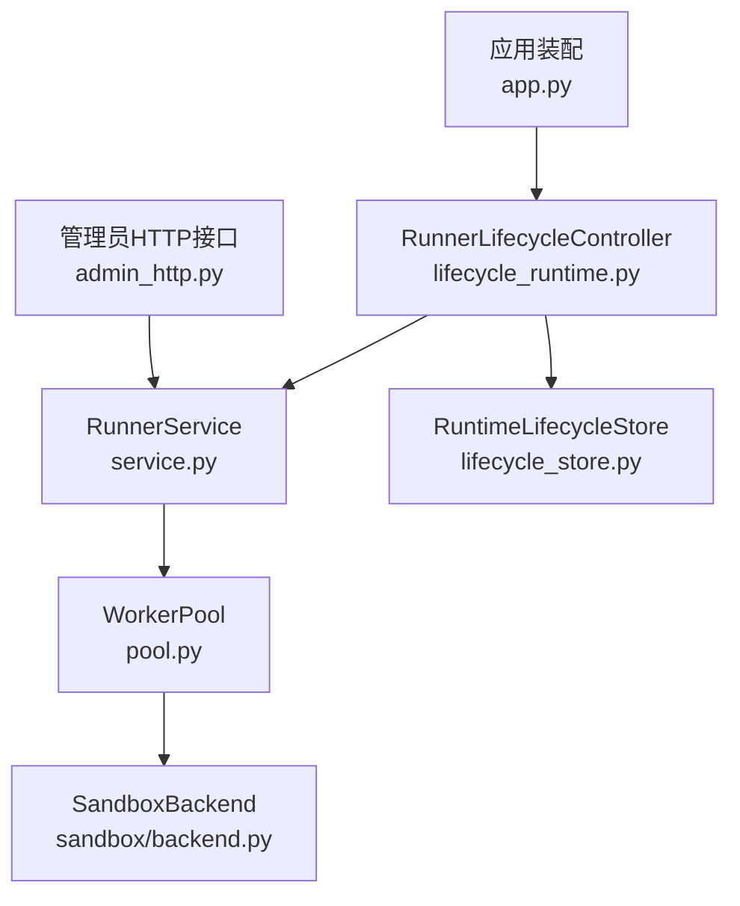
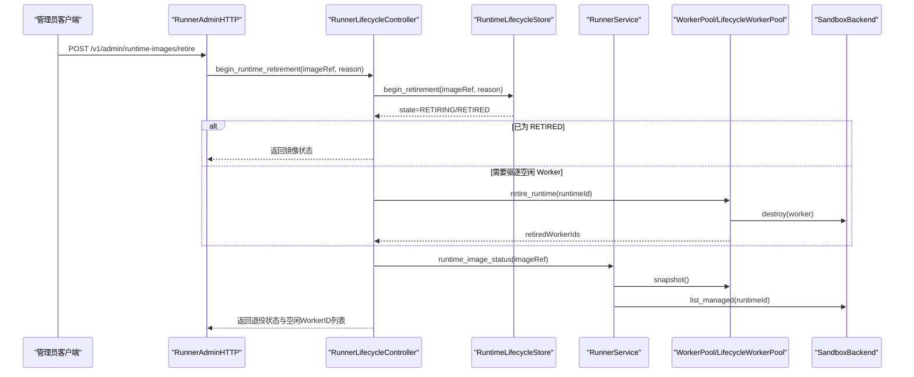
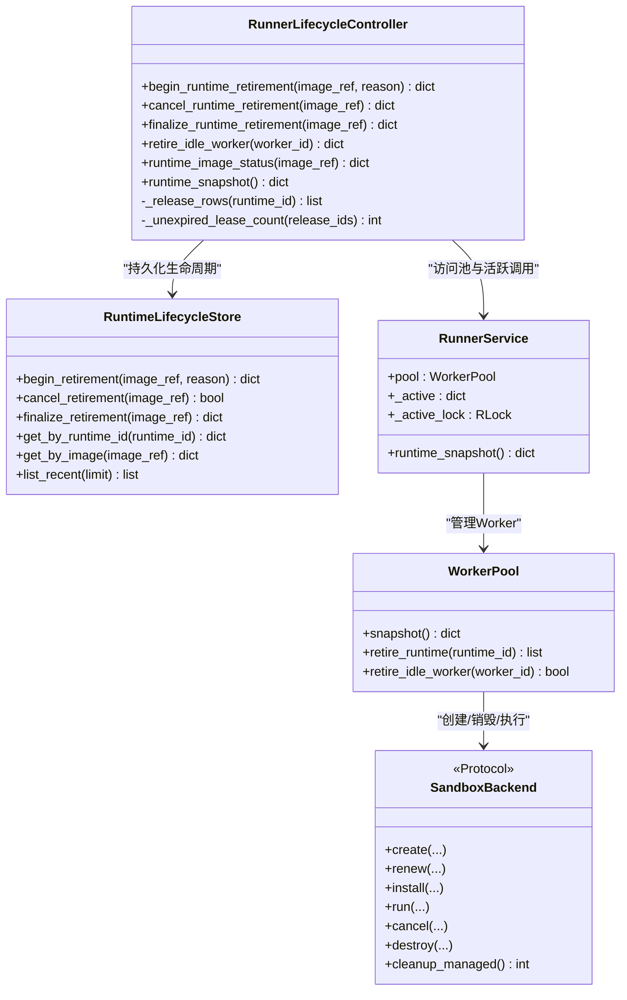
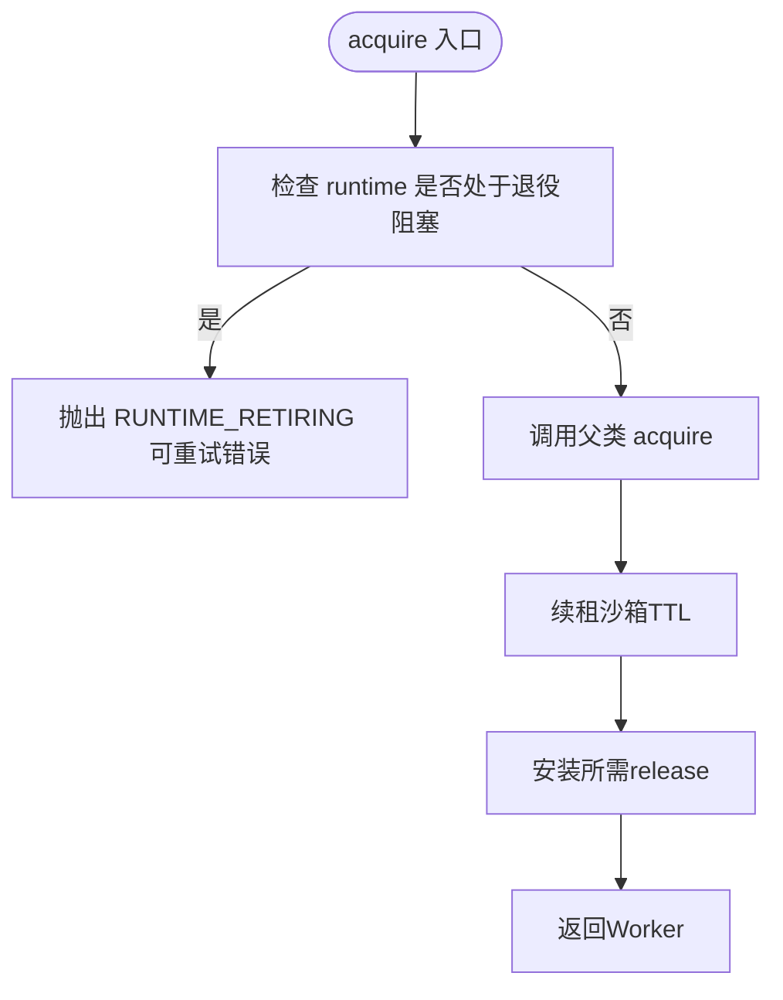
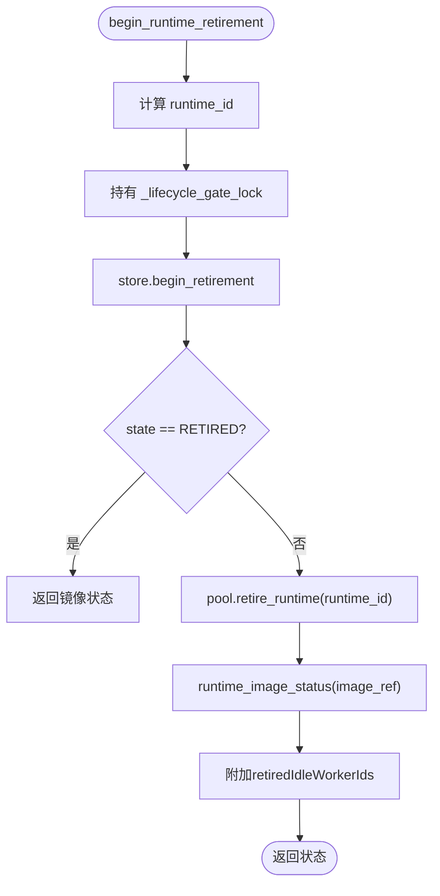
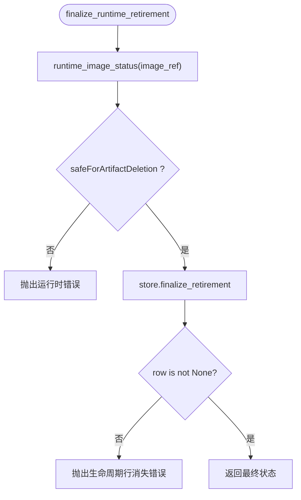
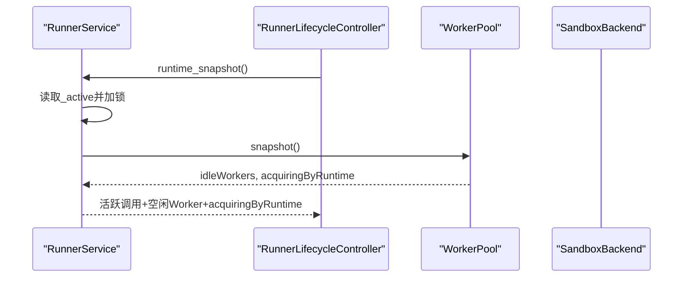
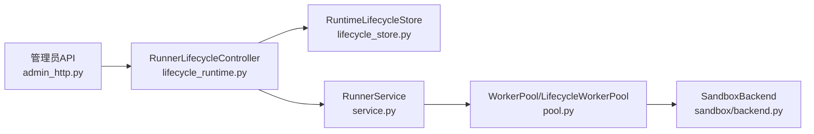

# 运行时控制器

<cite>
**本文引用的文件**   
- [lifecycle_runtime.py](file://runner_engine/lifecycle_runtime.py)
- [pool.py](file://runner_engine/pool.py)
- [backend.py](file://runner_engine/sandbox/backend.py)
- [service.py](file://runner_engine/service.py)
- [lifecycle_store.py](file://runner_engine/lifecycle_store.py)
- [admin_http.py](file://runner_engine/admin_http.py)
- [app.py](file://runner_engine/app.py)
</cite>

## 目录
1. [简介](#简介)
2. [项目结构定位](#项目结构定位)
3. [核心组件总览](#核心组件总览)
4. [架构总览](#架构总览)
5. [关键类与职责分析](#关键类与职责分析)
6. [退役流程详细实现](#退役流程详细实现)
7. [运行时状态监控机制](#运行时状态监控机制)
8. [依赖关系与协作模型](#依赖关系与协作模型)
9. [性能与资源清理特性](#性能与资源清理特性)
10. [运维操作指南](#运维操作指南)
11. [故障排查与异常处理](#故障排查与异常处理)
12. [结论与最佳实践](#结论与最佳实践)

## 简介
本文围绕 Runner Engine 的运行时生命周期控制器展开，重点解释 `RunnerLifecycleController` 的核心职责：算子镜像退役管理、工作池协调、沙箱资源清理，以及与 `WorkerPool`、`SandboxBackend`、`RuntimeLifecycleStore` 等组件的协作方式。文档同时覆盖活跃调用、空闲 Worker、受管沙箱的状态跟踪方法，并提供启动退役、检查运行状态和处理异常的操作示例路径。

## 项目结构定位
Runner Engine 的运行时生命周期控制逻辑集中在以下模块：
- 生命周期控制器与扩展池/后端：`runner_engine/lifecycle_runtime.py`
- 工作池与 Worker 生命周期：`runner_engine/pool.py`
- 沙箱后端抽象接口：`runner_engine/sandbox/backend.py`
- 服务主循环与活跃调用追踪：`runner_engine/service.py`
- 持久化生命周期表：`runner_engine/lifecycle_store.py`
- 管理员 HTTP 接口入口：`runner_engine/admin_http.py`
- 应用启动装配控制器：`runner_engine/app.py`

**图表来源**
- [admin_http.py:73-169](file://runner_engine/admin_http.py#L73-L169)
- [service.py:80-145](file://runner_engine/service.py#L80-L145)
- [pool.py:11-49](file://runner_engine/pool.py#L11-L49)
- [backend.py:14-49](file://runner_engine/sandbox/backend.py#L14-L49)
- [lifecycle_runtime.py:187-396](file://runner_engine/lifecycle_runtime.py#L187-L396)
- [lifecycle_store.py:35-151](file://runner_engine/lifecycle_store.py#L35-L151)
- [app.py:170-173](file://runner_engine/app.py#L170-L173)

**章节来源**
- [lifecycle_runtime.py:14-121](file://runner_engine/lifecycle_runtime.py#L14-L121)
- [pool.py:11-188](file://runner_engine/pool.py#L11-L188)
- [backend.py:14-49](file://runner_engine/sandbox/backend.py#L14-L49)
- [service.py:80-145](file://runner_engine/service.py#L80-L145)
- [lifecycle_store.py:35-151](file://runner_engine/lifecycle_store.py#L35-L151)
- [admin_http.py:73-169](file://runner_engine/admin_http.py#L73-L169)
- [app.py:170-173](file://runner_engine/app.py#L170-L173)

## 核心组件总览
- `RunnerLifecycleController`：对外暴露镜像退役、取消退役、完成退役、空闲 Worker 退役和运行时快照能力；内部通过 `RuntimeLifecycleStore` 持久化生命周期状态，并通过 `RunnerService` 访问工作池与活跃调用。
- `LifecycleWorkerPool`：继承 `WorkerPool`，在 acquire/release 边界增加“退役门控”，并支持按 runtime_id 退役空闲 Worker、统计正在获取沙箱的并发数。
- `LifecycleOpenSandboxBackend`：扩展 OpenSandbox 后端，提供受管沙箱列表查询能力，用于判断镜像是否仍被外部沙箱占用。
- `RuntimeLifecycleStore`：基于 PostgreSQL 持久化镜像生命周期状态，支持开始退役、取消退役、完成退役和最近记录查询。
- `WorkerPool`：负责 Worker 缓存、创建、续租、释放、回收和重启恢复。
- `SandboxBackend`：定义沙箱后端协议，包括创建、安装、执行、取消、销毁和托管清理。
- `RunnerService`：维护活跃调用、租约、调度执行、后台清理，并向控制器暴露 pool 与 active 状态。
- `RunnerAdminHTTP`：将管理员 API 映射到控制器和服务方法。

**章节来源**
- [lifecycle_runtime.py:14-121](file://runner_engine/lifecycle_runtime.py#L14-L121)
- [lifecycle_runtime.py:187-396](file://runner_engine/lifecycle_runtime.py#L187-L396)
- [pool.py:11-188](file://runner_engine/pool.py#L11-L188)
- [backend.py:14-49](file://runner_engine/sandbox/backend.py#L14-L49)
- [service.py:80-145](file://runner_engine/service.py#L80-L145)
- [lifecycle_store.py:35-151](file://runner_engine/lifecycle_store.py#L35-L151)
- [admin_http.py:73-169](file://runner_engine/admin_http.py#L73-L169)

## 架构总览
RunnerEngine 的运行时控制器处于“编排层”：它不直接创建或销毁沙箱，而是通过 `WorkerPool` 与 `SandboxBackend` 协作，并通过 `RuntimeLifecycleStore` 持久化镜像生命周期。管理员通过 HTTP 接口触发退役流程，控制器先标记镜像为 RETIRING，再驱逐空闲 Worker，最后等待无活跃调用、无空闲 Worker、无正在获取沙箱、无受管沙箱后，才允许完成退役。

**图表来源**
- [admin_http.py:116-129](file://runner_engine/admin_http.py#L116-L129)
- [lifecycle_runtime.py:302-323](file://runner_engine/lifecycle_runtime.py#L302-L323)
- [lifecycle_store.py:82-108](file://runner_engine/lifecycle_store.py#L82-L108)
- [lifecycle_runtime.py:83-96](file://runner_engine/lifecycle_runtime.py#L83-L96)
- [pool.py:148-160](file://runner_engine/pool.py#L148-L160)

## 关键类与职责分析

### RunnerLifecycleController
- 主要职责：
  - 根据镜像引用计算 runtime_id，并查询生命周期状态。
  - 汇总 catalog 中关联 release、数据库未过期 lease 数量、活跃调用、空闲 Worker、正在获取沙箱数量、受管沙箱。
  - 启动退役：写入 RETIRING，驱逐空闲 Worker，返回当前状态。
  - 取消退役：仅允许从 RETIRING 取消，禁止对 RETIRED 重新激活。
  - 完成退役：仅在 safeForArtifactDeletion 为真时更新为 RETIRED。
  - 空闲 Worker 退役：校验 Worker 属于本进程且空闲。
  - 运行时快照：聚合活跃调用、空闲 Worker、acquiringByRuntime、近期生命周期记录。

**图表来源**
- [lifecycle_runtime.py:187-396](file://runner_engine/lifecycle_runtime.py#L187-L396)
- [lifecycle_store.py:35-151](file://runner_engine/lifecycle_store.py#L35-L151)
- [service.py:80-145](file://runner_engine/service.py#L80-L145)
- [pool.py:11-188](file://runner_engine/pool.py#L11-L188)
- [backend.py:14-49](file://runner_engine/sandbox/backend.py#L14-L49)

**章节来源**
- [lifecycle_runtime.py:187-396](file://runner_engine/lifecycle_runtime.py#L187-L396)
- [service.py:80-145](file://runner_engine/service.py#L80-L145)
- [pool.py:11-188](file://runner_engine/pool.py#L11-L188)
- [backend.py:14-49](file://runner_engine/sandbox/backend.py#L14-L49)
- [lifecycle_store.py:35-151](file://runner_engine/lifecycle_store.py#L35-L151)

### LifecycleWorkerPool 与 WorkerPool
- `WorkerPool`：
  - 以 tenant + runtime + profile 为键缓存空闲 Worker。
  - 自动续租沙箱 TTL，确保执行头room。
  - 按需安装 release，限制每个 Worker 最大安装 release 数量。
  - 安全销毁 Worker，保证 quota 释放幂等。
  - 后台回收空闲超时 Worker。
- `LifecycleWorkerPool`：
  - 在 acquire 前检查 runtime 是否被阻塞（退役），若阻塞则抛出可重试错误。
  - 统计每个 runtime 正在 acquire 的数量，避免退役期间新分配。
  - 支持按 runtime_id 退役所有空闲 Worker。
  - 支持按 worker_id 退役单个空闲 Worker。

**图表来源**
- [lifecycle_runtime.py:26-46](file://runner_engine/lifecycle_runtime.py#L26-L46)
- [pool.py:73-130](file://runner_engine/pool.py#L73-L130)

**章节来源**
- [lifecycle_runtime.py:14-121](file://runner_engine/lifecycle_runtime.py#L14-L121)
- [pool.py:11-188](file://runner_engine/pool.py#L11-L188)

### LifecycleOpenSandboxBackend
- 扩展 OpenSandbox 后端，遍历集群分页查询沙箱，过滤由本 Runner 管理的沙箱，并按 runtime 标签筛选。
- 返回 sandboxId、cluster、state、runtime、tenant、profile 等信息，供控制器判断“受管沙箱”是否存在。

**章节来源**
- [lifecycle_runtime.py:123-184](file://runner_engine/lifecycle_runtime.py#L123-L184)

### RuntimeLifecycleStore
- 使用 PostgreSQL 表 `runner.runtime_image_lifecycle` 持久化镜像生命周期。
- 支持：
  - `begin_retirement`：插入或更新为 RETIRING，保留 reason。
  - `cancel_retirement`：删除 RETIRING 记录，表示取消退役。
  - `finalize_retirement`：更新为 RETIRED，设置 retired_at。
  - `list_recent`：按更新时间倒序返回最近生命周期记录。

**章节来源**
- [lifecycle_store.py:10-28](file://runner_engine/lifecycle_store.py#L10-L28)
- [lifecycle_store.py:35-151](file://runner_engine/lifecycle_store.py#L35-L151)

## 退役流程详细实现

### begin_runtime_retirement
- 输入：image_ref、reason。
- 行为：
  - 计算 runtime_id。
  - 持有池的 `_lifecycle_gate_lock`，调用 store.begin_retirement。
  - 如果状态已经是 RETIRED，直接返回镜像状态。
  - 否则调用 pool.retire_runtime 驱逐该 runtime 的空闲 Worker。
  - 返回镜像状态，并附带被退役的空闲 Worker ID 列表。

**图表来源**
- [lifecycle_runtime.py:302-323](file://runner_engine/lifecycle_runtime.py#L302-L323)
- [lifecycle_store.py:82-108](file://runner_engine/lifecycle_store.py#L82-L108)
- [lifecycle_runtime.py:83-96](file://runner_engine/lifecycle_runtime.py#L83-L96)

**章节来源**
- [lifecycle_runtime.py:302-323](file://runner_engine/lifecycle_runtime.py#L302-L323)
- [lifecycle_store.py:82-108](file://runner_engine/lifecycle_store.py#L82-L108)
- [lifecycle_runtime.py:83-96](file://runner_engine/lifecycle_runtime.py#L83-L96)

### cancel_runtime_retirement
- 输入：image_ref。
- 行为：
  - 查询当前生命周期记录，若状态为 RETIRED，抛出运行时错误，不允许重新激活。
  - 持有池的 `_lifecycle_gate_lock`，调用 store.cancel_retirement。
  - 返回 cancelled 标志、image_ref 和 ACTIVE 状态。

**章节来源**
- [lifecycle_runtime.py:325-338](file://runner_engine/lifecycle_runtime.py#L325-L338)
- [lifecycle_store.py:110-121](file://runner_engine/lifecycle_store.py#L110-L121)

### finalize_runtime_retirement
- 输入：image_ref。
- 行为：
  - 先计算镜像状态，若 safeForArtifactDeletion 为假，抛出运行时错误。
  - 调用 store.finalize_retirement 更新为 RETIRED。
  - 若生命周期行消失，抛出运行时错误。
  - 返回包含最终状态和 safeForArtifactDeletion=false 的结果。

**图表来源**
- [lifecycle_runtime.py:340-359](file://runner_engine/lifecycle_runtime.py#L340-L359)
- [lifecycle_store.py:123-136](file://runner_engine/lifecycle_store.py#L123-L136)

**章节来源**
- [lifecycle_runtime.py:340-359](file://runner_engine/lifecycle_runtime.py#L340-L359)
- [lifecycle_store.py:123-136](file://runner_engine/lifecycle_store.py#L123-L136)

## 运行时状态监控机制

### 活跃调用 active invocations
- `RunnerService._active` 字典维护 invocation_id 到 ActiveRun 的映射。
- `RunnerLifecycleController.runtime_snapshot` 与 `runtime_image_status` 均通过 `_active_lock` 读取活跃调用，并过滤出目标 runtime_id 的调用。

**图表来源**
- [service.py:238-291](file://runner_engine/service.py#L238-L291)
- [lifecycle_runtime.py:373-396](file://runner_engine/lifecycle_runtime.py#L373-L396)

**章节来源**
- [service.py:238-291](file://runner_engine/service.py#L238-L291)
- [lifecycle_runtime.py:373-396](file://runner_engine/lifecycle_runtime.py#L373-L396)

### 空闲 workers idle workers
- `WorkerPool.snapshot()` 返回 idleCount 与 idleWorkers 列表。
- `LifecycleWorkerPool.snapshot()` 额外返回 acquiringByRuntime，用于统计每个 runtime 正在获取沙箱的并发数。

**章节来源**
- [pool.py:161-181](file://runner_engine/pool.py#L161-L181)
- [lifecycle_runtime.py:48-81](file://runner_engine/lifecycle_runtime.py#L48-L81)

### 受管沙箱 managed sandboxes
- `LifecycleOpenSandboxBackend.list_managed` 遍历集群分页查询沙箱，过滤 managed-by 与 runner-owner 标签，并按 runtime 标签筛选。
- `runtime_image_status` 调用 backend.list_managed，若无该方法则返回空列表。

**章节来源**
- [lifecycle_runtime.py:123-184](file://runner_engine/lifecycle_runtime.py#L123-L184)
- [lifecycle_runtime.py:268-274](file://runner_engine/lifecycle_runtime.py#L268-L274)

## 依赖关系与协作模型

**图表来源**
- [admin_http.py:73-169](file://runner_engine/admin_http.py#L73-L169)
- [lifecycle_runtime.py:187-396](file://runner_engine/lifecycle_runtime.py#L187-L396)
- [lifecycle_store.py:35-151](file://runner_engine/lifecycle_store.py#L35-L151)
- [service.py:80-145](file://runner_engine/service.py#L80-L145)
- [pool.py:11-188](file://runner_engine/pool.py#L11-L188)
- [backend.py:14-49](file://runner_engine/sandbox/backend.py#L14-L49)

**章节来源**
- [admin_http.py:73-169](file://runner_engine/admin_http.py#L73-L169)
- [lifecycle_runtime.py:187-396](file://runner_engine/lifecycle_runtime.py#L187-L396)
- [lifecycle_store.py:35-151](file://runner_engine/lifecycle_store.py#L35-L151)
- [service.py:80-145](file://runner_engine/service.py#L80-L145)
- [pool.py:11-188](file://runner_engine/pool.py#L11-L188)
- [backend.py:14-49](file://runner_engine/sandbox/backend.py#L14-L49)

## 性能与资源清理特性
- 工作池 TTL 续租：根据策略 max_timeout_ms 与 renew_before_seconds 决定续租阈值，避免执行中途沙箱过期。
- 空闲回收：后台线程周期性回收空闲超时 Worker，减少资源占用。
- 重启恢复：`reset_after_restart` 清空内存池并调用 backend.cleanup_managed，防止残留沙箱。
- 配额释放：Worker 销毁时释放租户配额，保证并发上限可控。
- 生命周期持久化：使用连接池与索引优化查询性能，限制 list_recent 上限。

**章节来源**
- [pool.py:56-71](file://runner_engine/pool.py#L56-L71)
- [pool.py:161-188](file://runner_engine/pool.py#L161-L188)
- [service.py:117-138](file://runner_engine/service.py#L117-L138)
- [lifecycle_store.py:40-47](file://runner_engine/lifecycle_store.py#L40-L47)
- [lifecycle_store.py:138-151](file://runner_engine/lifecycle_store.py#L138-L151)

## 运维操作指南

### 启动退役流程
- 通过管理员接口 `/v1/admin/runtime-images/retire` 提交 imageRef 与 reason。
- 控制器会：
  - 持久化 RETIRING。
  - 驱逐空闲 Worker。
  - 返回当前镜像状态与被退役的空闲 Worker ID 列表。

参考路径：
- [admin_http.py:116-129](file://runner_engine/admin_http.py#L116-L129)
- [lifecycle_runtime.py:302-323](file://runner_engine/lifecycle_runtime.py#L302-L323)

### 检查运行状态
- 使用 `/v1/admin/runtime-images/status?imageRef=...` 查看镜像状态。
- 响应包含：
  - lifecycleState：ACTIVE/RETIRING/RETIRED
  - unexpiredLeaseCount：未过期租约数量
  - activeInvocationCount/activeInvocations：活跃调用
  - idleWorkerCount/idleWorkers：空闲 Worker
  - acquiringWorkerCount：正在获取沙箱数量
  - managedSandboxCount/managedSandboxes：受管沙箱
  - safeForArtifactDeletion：是否可安全删除制品

参考路径：
- [admin_http.py:88-96](file://runner_engine/admin_http.py#L88-L96)
- [lifecycle_runtime.py:239-300](file://runner_engine/lifecycle_runtime.py#L239-L300)

### 取消退役
- 使用 `/v1/admin/runtime-images/cancel-retirement` 提交 imageRef。
- 若状态为 RETIRED，将抛出运行时错误；否则取消 RETIRING 并返回 ACTIVE。

参考路径：
- [admin_http.py:132-139](file://runner_engine/admin_http.py#L132-L139)
- [lifecycle_runtime.py:325-338](file://runner_engine/lifecycle_runtime.py#L325-L338)

### 完成退役
- 使用 `/v1/admin/runtime-images/finalize-retirement` 提交 imageRef。
- 仅当 safeForArtifactDeletion 为真时成功，否则抛出运行时错误。

参考路径：
- [admin_http.py:142-149](file://runner_engine/admin_http.py#L142-L149)
- [lifecycle_runtime.py:340-359](file://runner_engine/lifecycle_runtime.py#L340-L359)

### 退役空闲 Worker
- 使用 `/v1/admin/sandboxes/retire-idle` 提交 workerId。
- 若 Worker 非空闲或非本进程拥有，抛出运行时错误。

参考路径：
- [admin_http.py:152-159](file://runner_engine/admin_http.py#L152-L159)
- [lifecycle_runtime.py:361-371](file://runner_engine/lifecycle_runtime.py#L361-L371)

## 故障排查与异常处理

### 常见异常与原因
- RUNTIME_RETIRING：
  - 原因：镜像已进入退役阶段，无法获取新沙箱。
  - 处理：等待活跃调用结束、空闲 Worker 回收、受管沙箱清理后重试。
  - 相关代码位置：[lifecycle_runtime.py:26-35](file://runner_engine/lifecycle_runtime.py#L26-L35)
- a RETIRED runtime cannot be reactivated：
  - 原因：尝试对已完成的退役镜像执行取消退役。
  - 处理：不要对 RETIRED 镜像执行 cancel。
  - 相关代码位置：[lifecycle_runtime.py:325-328](file://runner_engine/lifecycle_runtime.py#L325-L328)
- runtime still has an active invocation, sandbox acquisition, idle worker or managed sandbox：
  - 原因：未完成退役前置条件检查失败。
  - 处理：等待活跃调用结束、空闲 Worker 回收、受管沙箱清理后再 finalize。
  - 相关代码位置：[lifecycle_runtime.py:340-349](file://runner_engine/lifecycle_runtime.py#L340-L349)
- worker is not idle or is no longer owned by this Runner process：
  - 原因：请求退役的 Worker 不存在或不属于本进程。
  - 处理：确认 workerId 有效性。
  - 相关代码位置：[lifecycle_runtime.py:361-366](file://runner_engine/lifecycle_runtime.py#L361-L366)
- runtime lifecycle row disappeared：
  - 原因：finalize 时生命周期记录不存在。
  - 处理：检查数据一致性与并发操作。
  - 相关代码位置：[lifecycle_runtime.py:351-353](file://runner_engine/lifecycle_runtime.py#L351-L353)

### 排查步骤建议
1. 调用 `/v1/admin/runtime-images/status` 检查镜像状态与各项计数。
2. 检查 `/v1/observe/runtime` 获取全局活跃调用与空闲 Worker 快照。
3. 若存在受管沙箱，检查后端 list_managed 返回结果。
4. 若仍有活跃调用，等待调用完成或主动 cancel。
5. 若仍有空闲 Worker，使用 retire-idle 或等待回收。
6. 满足 safeForArtifactDeletion 后执行 finalize。

**章节来源**
- [lifecycle_runtime.py:26-35](file://runner_engine/lifecycle_runtime.py#L26-L35)
- [lifecycle_runtime.py:325-328](file://runner_engine/lifecycle_runtime.py#L325-L328)
- [lifecycle_runtime.py:340-349](file://runner_engine/lifecycle_runtime.py#L340-L349)
- [lifecycle_runtime.py:361-366](file://runner_engine/lifecycle_runtime.py#L361-L366)
- [lifecycle_runtime.py:351-353](file://runner_engine/lifecycle_runtime.py#L351-L353)
- [admin_http.py:84-96](file://runner_engine/admin_http.py#L84-L96)
- [admin_http.py:84-86](file://runner_engine/admin_http.py#L84-L86)

## 结论与最佳实践
- 退役流程应遵循“标记 → 驱逐空闲 → 等待无活跃 → 完成退役”的顺序，避免破坏性操作。
- 使用 `runtime_image_status` 作为退役前置检查工具，关注 activeInvocations、idleWorkers、acquiringWorkerCount、managedSandboxes 四项指标。
- 对 RETIRED 镜像不可执行 cancel；如需重新启用，应通过新的镜像版本发布。
- 合理配置 WorkerPool 的 idle_seconds、orphan_ttl_seconds、renew_before_seconds，平衡资源复用与清理效率。
- 定期观察 `/v1/observe/runtime` 与生命周期记录，及时发现滞留的活跃调用或受管沙箱。
- 管理员接口需启用认证令牌，避免未授权操作影响生产环境稳定性。