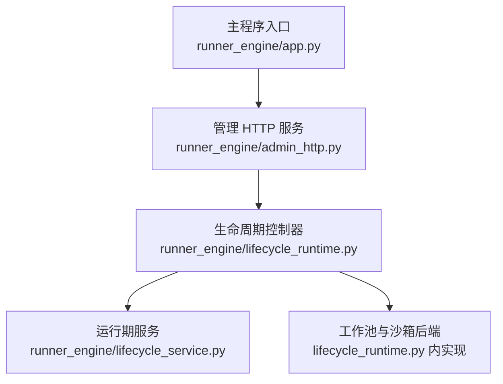
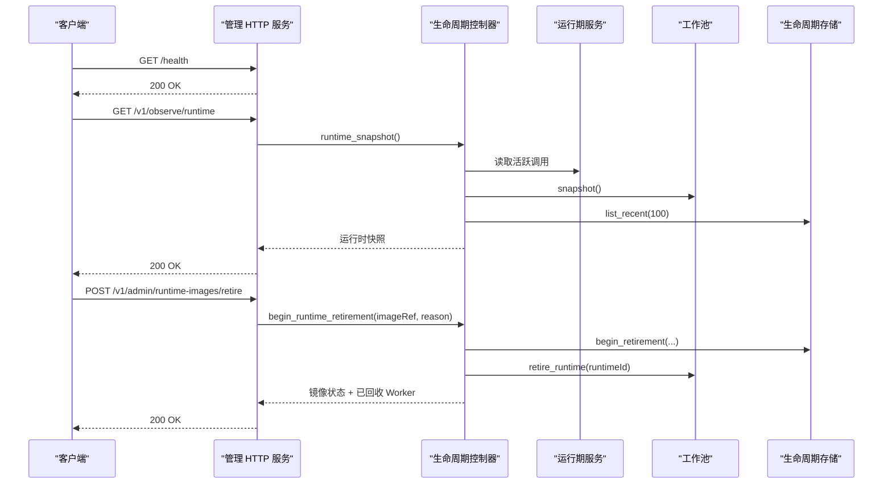
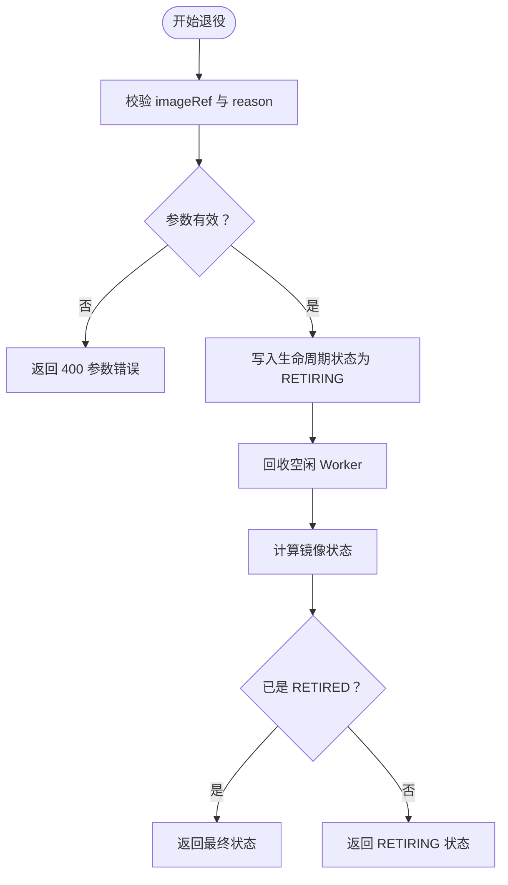
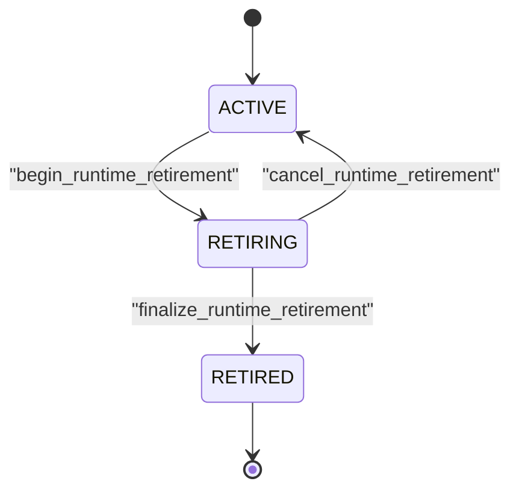
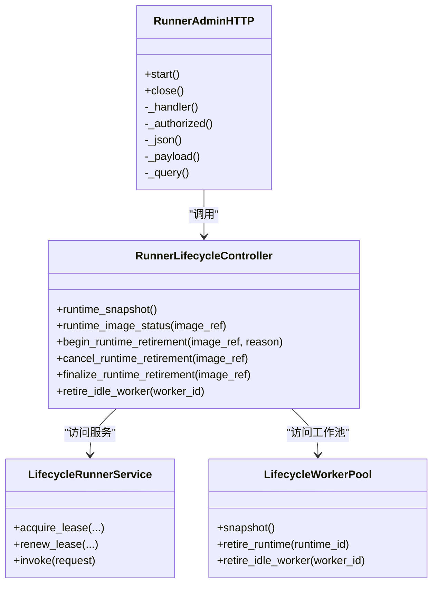

# 管理 HTTP 接口

<cite>
**本文引用的文件**   
- [runner_engine/app.py](file://runner_engine/app.py)
- [runner_engine/admin_http.py](file://runner_engine/admin_http.py)
- [runner_engine/lifecycle_runtime.py](file://runner_engine/lifecycle_runtime.py)
- [runner_engine/lifecycle_service.py](file://runner_engine/lifecycle_service.py)
</cite>

## 目录
1. [简介](#简介)
2. [项目结构与管理接口位置](#项目结构与管理接口位置)
3. [核心组件与职责](#核心组件与职责)
4. [架构总览](#架构总览)
5. [详细端点说明](#详细端点说明)
6. [认证与安全机制](#认证与安全机制)
7. [运行时状态与生命周期模型](#运行时状态与生命周期模型)
8. [依赖关系分析](#依赖关系分析)
9. [性能与可观测性建议](#性能与可观测性建议)
10. [运维操作指南](#运维操作指南)
11. [故障诊断与常见问题](#故障诊断与常见问题)
12. [结论](#结论)

## 简介
本文面向 Runner Engine 的管理 HTTP 接口，系统性说明其功能范围、RESTful 端点定义、认证机制、数据模型、调用示例以及运维最佳实践。该管理接口主要用于：
- 运行时监控：查看当前活跃调用、空闲工作进程、按运行时维度统计。
- 进程管理：回收空闲 Worker、触发并推进运行时镜像退役流程。
- 系统配置与治理：查询运行时镜像状态、取消或完成退役、评估是否安全删除制品。

管理接口默认仅在本地回环地址监听，并通过管理员令牌进行访问控制，适合由运维平台、内部工具或可信反向代理调用。

## 项目结构与管理接口位置
Runner Engine 的主程序负责启动 gRPC 服务、生命周期控制器、工作池和可选的管理 HTTP 服务。管理 HTTP 服务通过环境变量启用，并在设置管理员令牌后启动独立线程监听。



**图表来源**
- [runner_engine/app.py:156-210](file://runner_engine/app.py#L156-L210)
- [runner_engine/admin_http.py:14-24](file://runner_engine/admin_http.py#L14-L24)
- [runner_engine/lifecycle_runtime.py:187-194](file://runner_engine/lifecycle_runtime.py#L187-L194)

**章节来源**
- [runner_engine/app.py:26-74](file://runner_engine/app.py#L26-L74)
- [runner_engine/app.py:156-210](file://runner_engine/app.py#L156-L210)

## 核心组件与职责
- 管理 HTTP 服务
  - 提供轻量级 HTTP 服务器，处理健康检查、运行时快照、运行时镜像状态、退役管理等请求。
  - 使用 Bearer Token 认证，拒绝未授权请求。
  - 对请求体大小、JSON 格式进行校验，返回统一 JSON 错误结构。
- 生命周期控制器
  - 封装运行时镜像的生命周期操作：查询状态、开始退役、取消退役、完成退役。
  - 聚合服务层、工作池、持久化存储信息，生成结构化状态响应。
- 运行期服务与工作池
  - 在业务执行路径上增加“运行时活跃性”检查，阻止已退役或正在退役的运行时接受新租约、续租或调用。
  - 工作池维护空闲 Worker、按运行时维度统计获取中数量，并提供回收空闲 Worker 的能力。

**章节来源**
- [runner_engine/admin_http.py:14-190](file://runner_engine/admin_http.py#L14-L190)
- [runner_engine/lifecycle_runtime.py:187-396](file://runner_engine/lifecycle_runtime.py#L187-L396)
- [runner_engine/lifecycle_service.py:7-70](file://runner_engine/lifecycle_service.py#L7-L70)

## 架构总览
管理 HTTP 接口是 Runner Engine 的辅助面，不替代主 gRPC 业务面。它直接调用生命周期控制器，后者再访问服务层、工作池和持久化存储，形成清晰的“HTTP 路由 → 控制器 → 服务/存储”分层。



**图表来源**
- [runner_engine/admin_http.py:73-105](file://runner_engine/admin_http.py#L73-L105)
- [runner_engine/admin_http.py:107-169](file://runner_engine/admin_http.py#L107-L169)
- [runner_engine/lifecycle_runtime.py:302-323](file://runner_engine/lifecycle_runtime.py#L302-L323)
- [runner_engine/lifecycle_runtime.py:373-396](file://runner_engine/lifecycle_runtime.py#L373-L396)

## 详细端点说明

### 通用行为
- 所有管理端点均要求携带 `Authorization: Bearer <RUNNER_ADMIN_TOKEN>`。
- 成功响应为 JSON；失败响应包含 `detail` 字段描述错误原因。
- 部分端点会返回业务冲突或状态不一致的错误，例如尝试激活已退役运行时。

### 健康检查
- 方法：GET
- 路径：`/health`
- 用途：确认管理 HTTP 服务是否存活。
- 成功响应：包含服务标识与健康标志。
- 认证：需要管理员令牌。

**章节来源**
- [runner_engine/admin_http.py:73-82](file://runner_engine/admin_http.py#L73-L82)

### 运行时监控
- 方法：GET
- 路径：`/v1/observe/runtime`
- 用途：获取当前 Runner 进程的运行时快照，包括活跃调用、空闲 Worker、按运行时维度的获取中计数、近期生命周期记录。
- 典型字段：
  - 活跃调用列表：租户、租约、发布版本、Worker、运行时、Profile。
  - 空闲 Worker 列表：Worker ID、租户、运行时、Profile、健康状态、空闲时长、已安装发布数。
  - 按运行时维度的获取中计数。
  - 近期生命周期记录：最近 100 条运行时生命周期事件。
- 适用场景：运维监控大盘、容量评估、异常定位。

**章节来源**
- [runner_engine/admin_http.py:84-86](file://runner_engine/admin_http.py#L84-L86)
- [runner_engine/lifecycle_runtime.py:373-396](file://runner_engine/lifecycle_runtime.py#L373-L396)

### 运行时镜像状态
- 方法：GET
- 路径：`/v1/admin/runtime-images/status`
- 查询参数：
  - `imageRef`：必填，运行时镜像引用。
- 用途：查询指定运行时镜像的状态，包括生命周期状态、关联发布、活跃调用、空闲 Worker、获取中 Worker、受管沙箱、是否安全删除制品等。
- 关键判断：
  - `safeForArtifactDeletion` 为真时，表示当前无活跃调用、无空闲 Worker、无获取中 Worker、无受管沙箱，且生命周期处于可安全清理阶段。
- 适用场景：制品下线前验证、灰度发布观察、资源清理决策。

**章节来源**
- [runner_engine/admin_http.py:88-96](file://runner_engine/admin_http.py#L88-L96)
- [runner_engine/lifecycle_runtime.py:239-300](file://runner_engine/lifecycle_runtime.py#L239-L300)

### 开始运行时镜像退役
- 方法：POST
- 路径：`/v1/admin/runtime-images/retire`
- 请求体：
  - `imageRef`：必填，要退役的运行时镜像引用。
  - `reason`：必填，退役原因，长度至少 5 个字符。
- 用途：将运行时镜像标记为退役，立即停止接收新的执行，并回收空闲 Worker。
- 响应：返回镜像状态，可能包含已回收空闲 Worker 的 ID 列表。
- 注意事项：
  - 若镜像已经处于最终退役状态，则直接返回最终状态。
  - 退役过程中仍可能有活跃调用或获取中的 Worker，需等待安全后再完成退役。



**图表来源**
- [runner_engine/admin_http.py:116-130](file://runner_engine/admin_http.py#L116-L130)
- [runner_engine/lifecycle_runtime.py:302-323](file://runner_engine/lifecycle_runtime.py#L302-L323)

**章节来源**
- [runner_engine/admin_http.py:116-130](file://runner_engine/admin_http.py#L116-L130)
- [runner_engine/lifecycle_runtime.py:302-323](file://runner_engine/lifecycle_runtime.py#L302-L323)

### 取消运行时镜像退役
- 方法：POST
- 路径：`/v1/admin/runtime-images/cancel-retirement`
- 请求体：
  - `imageRef`：必填，要取消退役的运行时镜像引用。
- 用途：将处于退役过程中的运行时镜像恢复为活跃状态。
- 限制：已处于最终退役状态的运行时无法重新激活。
- 响应：包含取消结果、镜像引用和生命周期状态。

**章节来源**
- [runner_engine/admin_http.py:132-140](file://runner_engine/admin_http.py#L132-L140)
- [runner_engine/lifecycle_runtime.py:325-338](file://runner_engine/lifecycle_runtime.py#L325-L338)

### 完成运行时镜像退役
- 方法：POST
- 路径：`/v1/admin/runtime-images/finalize-retirement`
- 请求体：
  - `imageRef`：必填，要完成退役的运行时镜像引用。
- 用途：在确认镜像不再被使用时，将其生命周期推进到最终退役状态，允许后续安全删除制品。
- 前置条件：必须满足 `safeForArtifactDeletion` 为真，即无活跃调用、无空闲 Worker、无获取中 Worker、无受管沙箱。
- 响应：返回最终生命周期状态及制品删除安全性标志。

**章节来源**
- [runner_engine/admin_http.py:142-150](file://runner_engine/admin_http.py#L142-L150)
- [runner_engine/lifecycle_runtime.py:340-359](file://runner_engine/lifecycle_runtime.py#L340-L359)

### 回收空闲 Worker
- 方法：POST
- 路径：`/v1/admin/sandboxes/retire-idle`
- 请求体：
  - `workerId`：必填，要回收的空闲 Worker ID。
- 用途：主动销毁某个空闲 Worker，常用于调试、压测后资源回收或隔离问题 Worker。
- 限制：仅当 Worker 确实空闲且属于当前 Runner 进程时才成功。
- 响应：包含回收结果与 Worker ID。

**章节来源**
- [runner_engine/admin_http.py:152-160](file://runner_engine/admin_http.py#L152-L160)
- [runner_engine/lifecycle_runtime.py:98-120](file://runner_engine/lifecycle_runtime.py#L98-L120)
- [runner_engine/lifecycle_runtime.py:361-371](file://runner_engine/lifecycle_runtime.py#L361-L371)

## 认证与安全机制
- 管理员令牌
  - 通过环境变量 `RUNNER_ADMIN_TOKEN` 配置。
  - 如果为空，管理 HTTP 服务不会启动，并输出警告日志。
- 请求认证
  - 每个管理端点都要求 `Authorization: Bearer <token>`。
  - 服务端使用恒定时间比较函数验证令牌，避免时序攻击。
- 网络暴露建议
  - 默认监听地址为 `127.0.0.1`，端口可通过 `RUNNER_ADMIN_LISTEN` 和 `RUNNER_ADMIN_PORT` 调整。
  - 不建议直接将管理端口暴露到公网；如需远程访问，应通过可信反向代理、防火墙或零信任网络进行访问控制。
- 响应头安全
  - 管理 HTTP 服务返回 `Cache-Control: no-store`，避免缓存敏感状态。
  - 其他 Web 管理界面（如控制台）还会设置更严格的安全响应头，但管理 HTTP 服务本身保持最小化。

**章节来源**
- [runner_engine/admin_http.py:15-24](file://runner_engine/admin_http.py#L15-L24)
- [runner_engine/admin_http.py:35-40](file://runner_engine/admin_http.py#L35-L40)
- [runner_engine/admin_http.py:42-56](file://runner_engine/admin_http.py#L42-L56)
- [runner_engine/app.py:174-210](file://runner_engine/app.py#L174-L210)

## 运行时状态与生命周期模型
- 生命周期状态
  - ACTIVE：正常运行，可接受新调用。
  - RETIRING：正在退役，不再接受新调用，但可能仍有活跃调用或空闲 Worker。
  - RETIRED：已完成退役，不应再接受任何执行。
- 业务侧保护
  - 运行期服务在获取租约、续租和执行调用前检查运行时状态，阻止对 RETIRING/RETIRED 的运行时的新执行。
  - 工作池在获取沙箱时也检查生命周期状态，确保退役流程在底层资源边界得到保障。
- 镜像状态聚合
  - 镜像状态接口聚合发布版本、活跃调用、空闲 Worker、获取中 Worker、受管沙箱、未过期租约数量等信息。
  - `safeForArtifactDeletion` 用于指导制品下线流程，只有满足全部安全条件才允许删除。



**图表来源**
- [runner_engine/lifecycle_service.py:19-32](file://runner_engine/lifecycle_service.py#L19-L32)
- [runner_engine/lifecycle_runtime.py:302-359](file://runner_engine/lifecycle_runtime.py#L302-L359)

**章节来源**
- [runner_engine/lifecycle_service.py:7-70](file://runner_engine/lifecycle_service.py#L7-L70)
- [runner_engine/lifecycle_runtime.py:239-300](file://runner_engine/lifecycle_runtime.py#L239-L300)
- [runner_engine/lifecycle_runtime.py:302-359](file://runner_engine/lifecycle_runtime.py#L302-L359)

## 依赖关系分析
管理 HTTP 接口依赖以下核心对象：
- `RunnerLifecycleController`：对外暴露运行时状态与退役管理方法。
- `LifecycleRunnerService`：在业务执行路径上增加生命周期门控。
- `LifecycleWorkerPool`：维护 Worker 生命周期、空闲集合、按运行时维度的获取中计数。
- `RuntimeLifecycleStore`：持久化运行时生命周期状态，供控制器查询与更新。



**图表来源**
- [runner_engine/admin_http.py:14-190](file://runner_engine/admin_http.py#L14-L190)
- [runner_engine/lifecycle_runtime.py:187-396](file://runner_engine/lifecycle_runtime.py#L187-L396)
- [runner_engine/lifecycle_service.py:7-70](file://runner_engine/lifecycle_service.py#L7-L70)

**章节来源**
- [runner_engine/admin_http.py:14-190](file://runner_engine/admin_http.py#L14-L190)
- [runner_engine/lifecycle_runtime.py:187-396](file://runner_engine/lifecycle_runtime.py#L187-L396)
- [runner_engine/lifecycle_service.py:7-70](file://runner_engine/lifecycle_service.py#L7-L70)

## 性能与可观测性建议
- 监控频率
  - `/v1/observe/runtime` 适合周期性轮询，但不宜过于频繁，避免放大数据库与服务内存锁竞争。
- 退役流程
  - 先调用开始退役，再观察活跃调用与空闲 Worker 归零，最后完成退役。
  - 若存在受管沙箱，需要先协调下游清理，否则无法进入安全删除状态。
- 日志与审计
  - 管理 HTTP 服务自身关闭了默认 HTTP 日志输出，便于外部集中采集。
  - 建议在反向代理或网关层记录访问日志、认证失败、参数错误与业务冲突。
- 资源回收
  - 使用回收空闲 Worker 接口进行精准清理，避免误杀非空闲 Worker。
  - 结合镜像状态接口的 `safeForArtifactDeletion` 指标做自动化下线流水线。

[本节为通用建议，不直接分析具体代码文件]

## 运维操作指南

### 环境准备
- 设置管理员令牌：配置 `RUNNER_ADMIN_TOKEN`。
- 确认管理监听地址与端口：默认 `127.0.0.1:9444`，可通过 `RUNNER_ADMIN_LISTEN` 与 `RUNNER_ADMIN_PORT` 调整。
- 确保 Runner Engine 主进程正常启动，gRPC 服务与管理 HTTP 服务可同时运行。

### 常用 curl 示例
以下为调用管理接口的示例命令模板，请替换实际主机、端口、令牌与业务参数。

- 健康检查
  ```bash
  curl -H "Authorization: Bearer YOUR_ADMIN_TOKEN" http://127.0.0.1:9444/health
  ```

- 获取运行时快照
  ```bash
  curl -H "Authorization: Bearer YOUR_ADMIN_TOKEN" \
    http://127.0.0.1:9444/v1/observe/runtime
  ```

- 查询运行时镜像状态
  ```bash
  curl -H "Authorization: Bearer YOUR_ADMIN_TOKEN" \
    "http://127.0.0.1:9444/v1/admin/runtime-images/status?imageRef=YOUR_IMAGE_REF"
  ```

- 开始运行时镜像退役
  ```bash
  curl -X POST -H "Authorization: Bearer YOUR_ADMIN_TOKEN" \
    -H "Content-Type: application/json" \
    -d '{
      "imageRef": "YOUR_IMAGE_REF",
      "reason": "下线旧镜像并切换到新版本"
    }' \
    http://127.0.0.1:9444/v1/admin/runtime-images/retire
  ```

- 取消运行时镜像退役
  ```bash
  curl -X POST -H "Authorization: Bearer YOUR_ADMIN_TOKEN" \
    -H "Content-Type: application/json" \
    -d '{"imageRef": "YOUR_IMAGE_REF"}' \
    http://127.0.0.1:9444/v1/admin/runtime-images/cancel-retirement
  ```

- 完成运行时镜像退役
  ```bash
  curl -X POST -H "Authorization: Bearer YOUR_ADMIN_TOKEN" \
    -H "Content-Type: application/json" \
    -d '{"imageRef": "YOUR_IMAGE_REF"}' \
    http://127.0.0.1:9444/v1/admin/runtime-images/finalize-retirement
  ```

- 回收空闲 Worker
  ```bash
  curl -X POST -H "Authorization: Bearer YOUR_ADMIN_TOKEN" \
    -H "Content-Type: application/json" \
    -d '{"workerId": "YOUR_WORKER_ID"}' \
    http://127.0.0.1:9444/v1/admin/sandboxes/retire-idle
  ```

### Python 客户端示例
以下为使用 Python 标准库调用管理接口的示例模板，请替换实际参数。

- 健康检查
  ```python
  import urllib.request
  import json

  token = "YOUR_ADMIN_TOKEN"
  url = "http://127.0.0.1:9444/health"
  req = urllib.request.Request(url, headers={"Authorization": f"Bearer {token}"})
  with urllib.request.urlopen(req) as resp:
      print(resp.read().decode())
  ```

- 查询运行时镜像状态
  ```python
  import urllib.request
  import urllib.parse

  token = "YOUR_ADMIN_TOKEN"
  image_ref = "YOUR_IMAGE_REF"
  params = urllib.parse.urlencode({"imageRef": image_ref})
  url = f"http://127.0.0.1:9444/v1/admin/runtime-images/status?{params}"
  req = urllib.request.Request(url, headers={"Authorization": f"Bearer {token}"})
  with urllib.request.urlopen(req) as resp:
      print(resp.read().decode())
  ```

- 开始运行时镜像退役
  ```python
  import urllib.request
  import json

  token = "YOUR_ADMIN_TOKEN"
  payload = {
      "imageRef": "YOUR_IMAGE_REF",
      "reason": "下线旧镜像并切换到新版本"
  }
  data = json.dumps(payload).encode("utf-8")
  url = "http://127.0.0.1:9444/v1/admin/runtime-images/retire"
  req = urllib.request.Request(url, data=data, headers={
      "Authorization": f"Bearer {token}",
      "Content-Type": "application/json"
  })
  with urllib.request.urlopen(req) as resp:
      print(resp.read().decode())
  ```

[以上示例仅为调用模板，不包含仓库源码内容]

## 故障诊断与常见问题
- 401 未授权
  - 原因：缺少或错误的 `Authorization: Bearer` 令牌。
  - 处理：检查 `RUNNER_ADMIN_TOKEN` 是否正确配置，并确保请求携带相同令牌。
- 400 参数错误
  - 原因：必填参数缺失或不符合约束，例如 `imageRef` 为空、`reason` 过短。
  - 处理：根据响应 `detail` 修正请求参数。
- 409 业务冲突
  - 原因：尝试对已退役运行时重新激活，或未完成退役就执行完成操作。
  - 处理：先查询镜像状态，确认生命周期状态后再执行下一步。
- 404 未找到
  - 原因：请求路径不存在。
  - 处理：核对端点路径与方法。
- 500 内部错误
  - 原因：服务层抛出未预期异常。
  - 处理：查看 Runner Engine 主进程日志，定位底层数据库或服务异常。

**章节来源**
- [runner_engine/admin_http.py:73-105](file://runner_engine/admin_http.py#L73-L105)
- [runner_engine/admin_http.py:107-169](file://runner_engine/admin_http.py#L107-L169)
- [runner_engine/lifecycle_runtime.py:325-359](file://runner_engine/lifecycle_runtime.py#L325-L359)

## 结论
Runner Engine 的管理 HTTP 接口提供了简洁而强大的运维能力，覆盖运行时监控、进程管理与运行时镜像生命周期治理。通过严格的 Bearer Token 认证与默认本地监听策略，它在保证安全性的同时，为运维自动化、故障诊断与性能分析提供了稳定入口。建议在生产环境中结合反向代理、访问控制与集中日志，构建完整的 Runner 运维闭环。