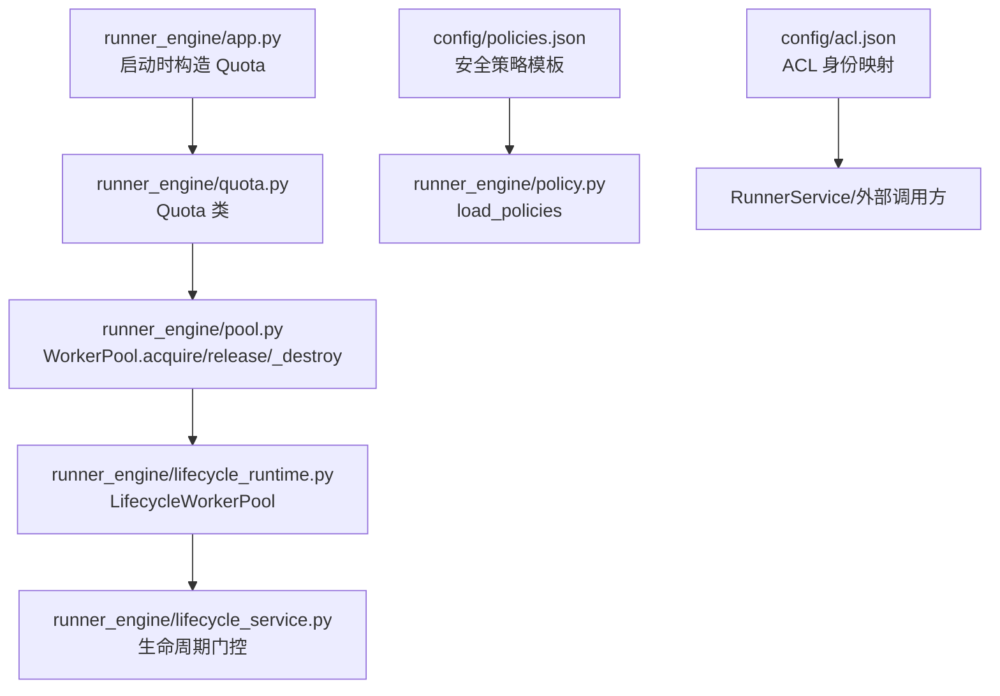
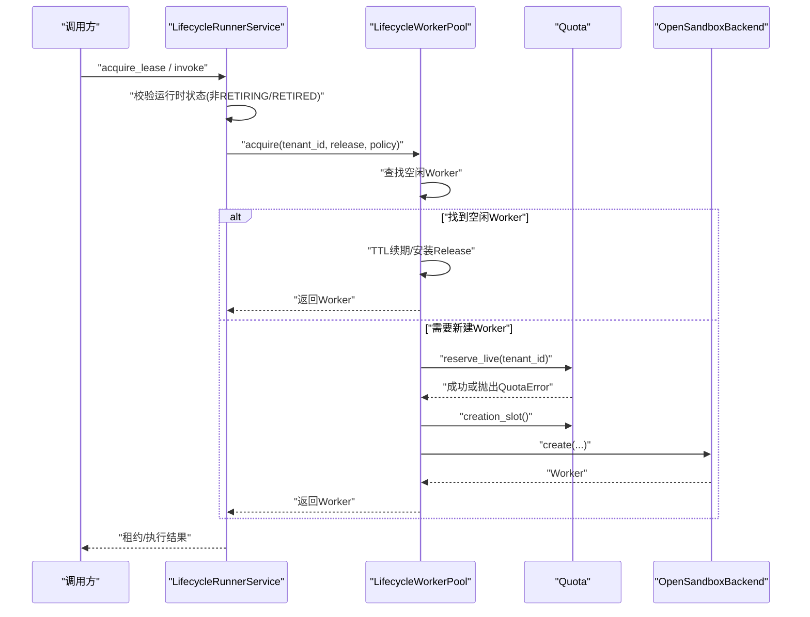
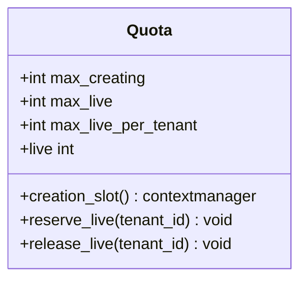
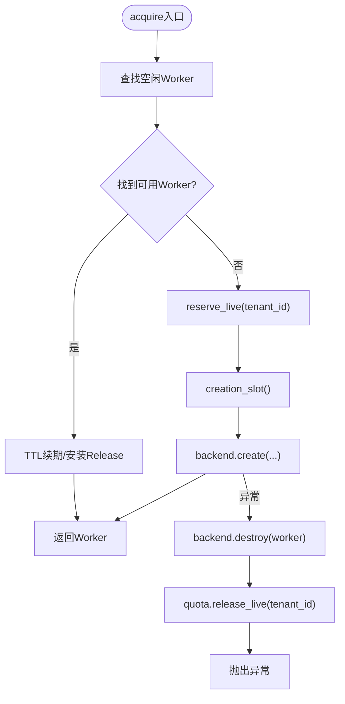
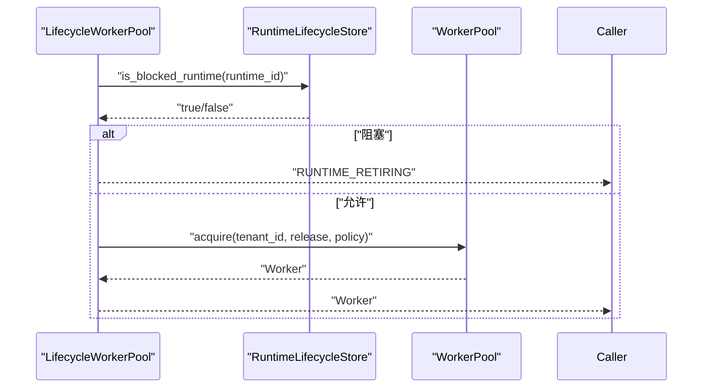
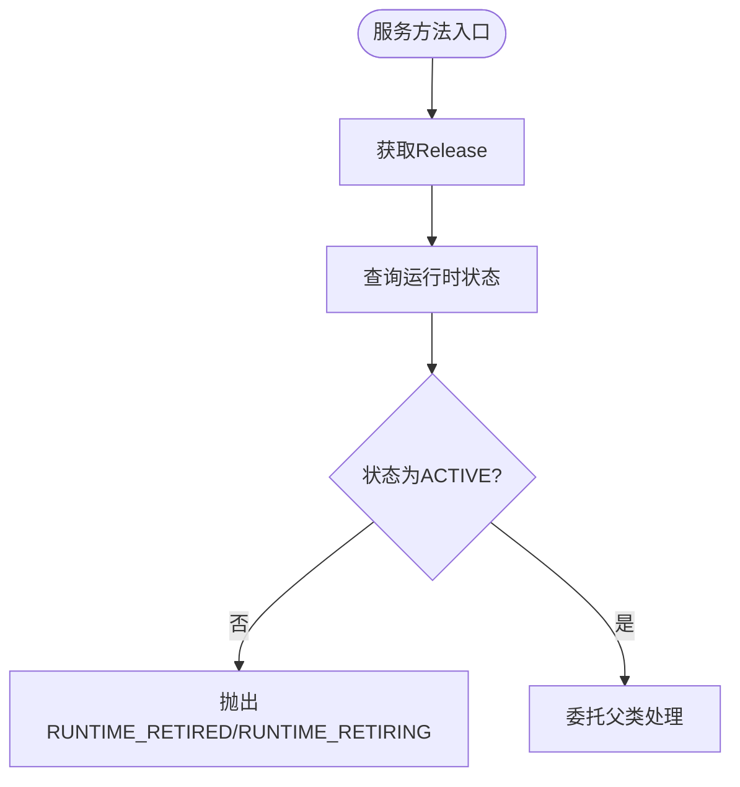
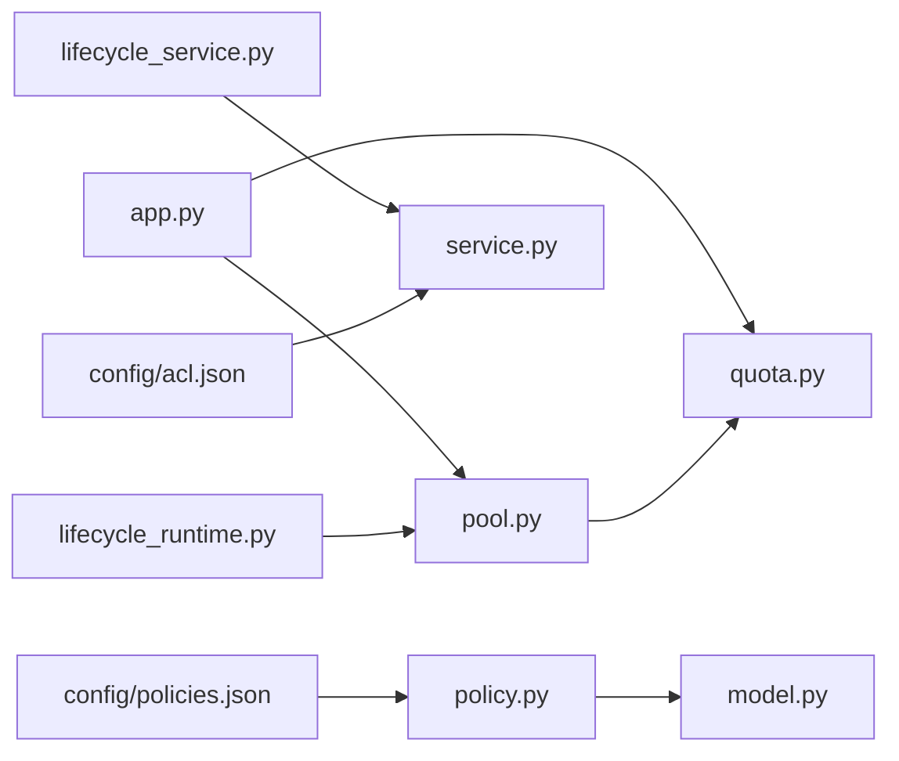
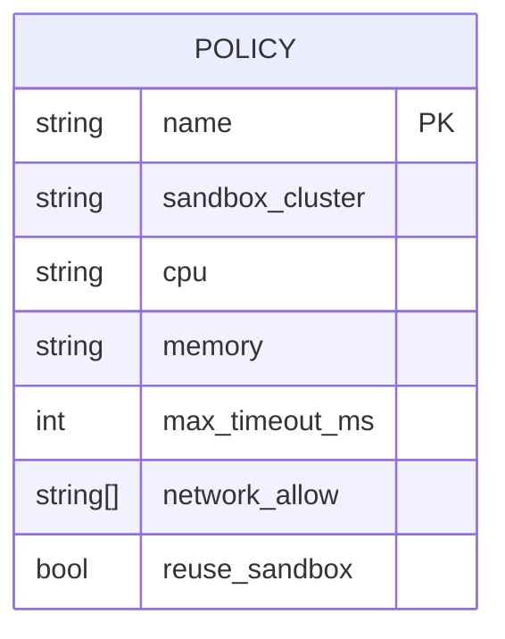
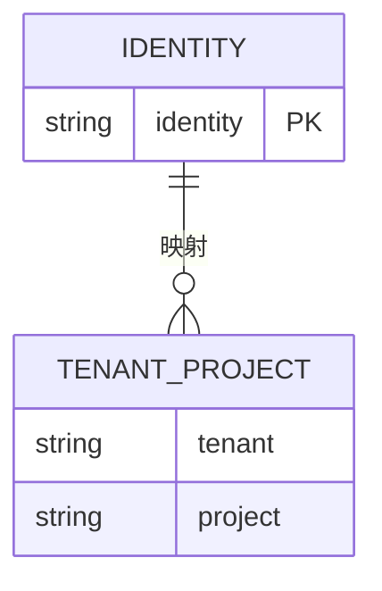
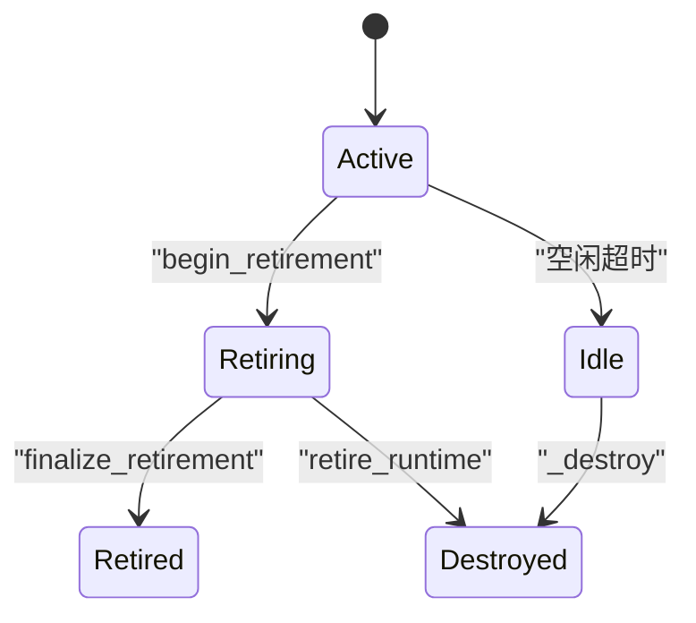

# 配额控制

<cite>
**本文引用的文件**   
- [runner_engine/quota.py](file://runner_engine/quota.py)
- [runner_engine/pool.py](file://runner_engine/pool.py)
- [runner_engine/lifecycle_runtime.py](file://runner_engine/lifecycle_runtime.py)
- [runner_engine/lifecycle_service.py](file://runner_engine/lifecycle_service.py)
- [runner_engine/app.py](file://runner_engine/app.py)
- [runner_engine/errors.py](file://runner_engine/errors.py)
- [runner_engine/model.py](file://runner_engine/model.py)
- [runner_engine/policy.py](file://runner_engine/policy.py)
- [config/policies.json](file://config/policies.json)
- [config/acl.json](file://config/acl.json)
- [tests/test_quota.py](file://tests/test_quota.py)
- [tests/test_pool_destroy_idempotent.py](file://tests/test_pool_destroy_idempotent.py)
</cite>

## 目录
1. [引言](#引言)
2. [项目结构中的配额相关位置](#项目结构中的配额相关位置)
3. [核心组件](#核心组件)
4. [架构总览](#架构总览)
5. [详细组件分析](#详细组件分析)
6. [依赖关系分析](#依赖关系分析)
7. [性能与并发特性](#性能与并发特性)
8. [配置与策略语法](#配置与策略语法)
9. [生命周期集成](#生命周期集成)
10. [监控、审计与权限](#监控审计与权限)
11. [故障排查](#故障排查)
12. [规划建议与最佳实践](#规划建议与最佳实践)
13. [结论](#结论)

## 引言
本文件面向 Runner Engine 的配额控制系统，目标是帮助读者理解并正确使用“全局配额、租户配额、实例级别限制”的组合机制。文档将围绕 Quota 类的实现逻辑展开，说明配额检查、计数器管理、创建并发控制、释放回收策略，以及与 WorkerPool、生命周期系统、安全策略和 ACL 的关系。同时提供可操作的配置示例、监控指标和超限处理建议。

## 项目结构中的配额相关位置
配额控制主要分布在以下模块：
- 配额核心：runner_engine/quota.py
- 沙箱池与配额耦合：runner_engine/pool.py
- 生命周期扩展（含运行时退役门控）：runner_engine/lifecycle_runtime.py
- 服务层生命周期校验：runner_engine/lifecycle_service.py
- 应用启动与配额参数注入：runner_engine/app.py
- 错误类型定义：runner_engine/errors.py
- 模型与安全策略：runner_engine/model.py、runner_engine/policy.py
- 策略配置文件：config/policies.json
- ACL 配置：config/acl.json
- 测试用例：tests/test_quota.py、tests/test_pool_destroy_idempotent.py

**图表来源**
- [runner_engine/app.py:92-139](file://runner_engine/app.py#L92-L139)
- [runner_engine/quota.py:9-61](file://runner_engine/quota.py#L9-L61)
- [runner_engine/pool.py:11-188](file://runner_engine/pool.py#L11-L188)
- [runner_engine/lifecycle_runtime.py:14-121](file://runner_engine/lifecycle_runtime.py#L14-L121)
- [runner_engine/lifecycle_service.py:7-71](file://runner_engine/lifecycle_service.py#L7-L71)
- [runner_engine/policy.py:9-24](file://runner_engine/policy.py#L9-L24)
- [config/policies.json:1-19](file://config/policies.json#L1-L19)
- [config/acl.json:1-8](file://config/acl.json#L1-L8)

**章节来源**
- [runner_engine/app.py:92-139](file://runner_engine/app.py#L92-L139)
- [runner_engine/quota.py:9-61](file://runner_engine/quota.py#L9-L61)
- [runner_engine/pool.py:11-188](file://runner_engine/pool.py#L11-L188)
- [runner_engine/lifecycle_runtime.py:14-121](file://runner_engine/lifecycle_runtime.py#L14-L121)
- [runner_engine/lifecycle_service.py:7-71](file://runner_engine/lifecycle_service.py#L7-L71)
- [runner_engine/policy.py:9-24](file://runner_engine/policy.py#L9-L24)
- [config/policies.json:1-19](file://config/policies.json#L1-L19)
- [config/acl.json:1-8](file://config/acl.json#L1-L8)

## 核心组件
- Quota：负责三类限制
  - 创建并发限制：通过有界信号量控制同时处于“创建中”的沙箱数量。
  - 全局活跃沙箱上限：限制当前进程内所有租户的活跃沙箱总数。
  - 租户活跃沙箱上限：限制单个租户的活跃沙箱数。
- WorkerPool：在获取或释放 Worker 时调用 Quota，保证计数与后端资源一致。
- LifecycleWorkerPool：在 WorkerPool 基础上增加运行时退役门控，阻止对退役中/已退役运行时的新分配。
- LifecycleRunnerService：在服务层拒绝 RETIRING/RETIRED 运行时的租约申请、续租和调用。
- Policy 与 SecurityPolicy：从 config/policies.json 加载安全策略，决定 CPU、内存、网络策略、超时、是否复用沙箱等。
- ACL：config/acl.json 定义身份到租户/项目的映射，用于权限控制。

**章节来源**
- [runner_engine/quota.py:9-61](file://runner_engine/quota.py#L9-L61)
- [runner_engine/pool.py:11-188](file://runner_engine/pool.py#L11-L188)
- [runner_engine/lifecycle_runtime.py:14-121](file://runner_engine/lifecycle_runtime.py#L14-L121)
- [runner_engine/lifecycle_service.py:7-71](file://runner_engine/lifecycle_service.py#L7-L71)
- [runner_engine/policy.py:9-24](file://runner_engine/policy.py#L9-L24)
- [config/policies.json:1-19](file://config/policies.json#L1-L19)
- [config/acl.json:1-8](file://config/acl.json#L1-L8)

## 架构总览
配额控制贯穿“请求进入 → 租约获取 → 沙箱分配 → 执行 → 释放”的全链路。关键路径如下：
- 应用启动时根据环境变量初始化 Quota。
- 服务层先进行生命周期状态校验，再进入 WorkerPool.acquire。
- WorkerPool.acquire 先尝试复用空闲 Worker；若需新建，则先 reserve_live，再用 creation_slot 保护后端 create。
- WorkerPool.release/invalidate/_destroy 确保 quota.release_live 被精确调用一次。
- LifecycleWorkerPool 在 acquire 前后维护运行时退役门控，避免退役期间的新建。

**图表来源**
- [runner_engine/lifecycle_service.py:19-71](file://runner_engine/lifecycle_service.py#L19-L71)
- [runner_engine/lifecycle_runtime.py:26-47](file://runner_engine/lifecycle_runtime.py#L26-L47)
- [runner_engine/pool.py:73-130](file://runner_engine/pool.py#L73-L130)
- [runner_engine/quota.py:28-55](file://runner_engine/quota.py#L28-L55)

## 详细组件分析

### Quota 类设计与实现
Quota 是配额控制的原子单元，包含：
- 创建并发信号量：max_creating
- 全局活跃上限：max_live
- 租户活跃上限：max_live_per_tenant
- 内部计数器：_live、_tenant_live
- 线程安全：使用 BoundedSemaphore 与 Lock

关键行为：
- creation_slot：以有界信号量限制同时创建的数量。
- reserve_live：在创建前预留活跃名额，若达到全局或租户上限则抛出 QuotaError。
- release_live：释放活跃名额，按租户维度递减。
- live：只读属性，返回当前活跃沙箱总数。

**图表来源**
- [runner_engine/quota.py:9-61](file://runner_engine/quota.py#L9-L61)

**章节来源**
- [runner_engine/quota.py:9-61](file://runner_engine/quota.py#L9-L61)
- [runner_engine/errors.py:16-17](file://runner_engine/errors.py#L16-L17)
- [tests/test_quota.py:6-15](file://tests/test_quota.py#L6-L15)

### WorkerPool 与配额耦合
WorkerPool 负责沙箱复用、过期清理、释放回收，并与 Quota 紧密协作：
- acquire：
  - 优先复用空闲 Worker。
  - 若需新建，先 reserve_live，再在 creation_slot 中调用后端 create。
  - 异常路径中确保 release_live 被调用。
- release/invalidate/_destroy：
  - 保证每个 Worker 对象仅销毁一次，且 quota.release_live 恰好调用一次。
- reap：
  - 定时清理空闲超时的 Worker，触发 _destroy 从而释放配额。

**图表来源**
- [runner_engine/pool.py:73-130](file://runner_engine/pool.py#L73-L130)

**章节来源**
- [runner_engine/pool.py:11-188](file://runner_engine/pool.py#L11-L188)
- [tests/test_pool_destroy_idempotent.py:19-39](file://tests/test_pool_destroy_idempotent.py#L19-L39)

### LifecycleWorkerPool 与生命周期门控
LifecycleWorkerPool 在 WorkerPool.acquire 前后增加运行时退役门控：
- 若运行时处于退役中，直接拒绝新建。
- 维护 acquiring 计数，防止竞态。
- retire_runtime：主动销毁指定运行时的空闲 Worker。
- snapshot：暴露 idleWorkers、acquiringByRuntime 等观测信息。

**图表来源**
- [runner_engine/lifecycle_runtime.py:26-47](file://runner_engine/lifecycle_runtime.py#L26-L47)

**章节来源**
- [runner_engine/lifecycle_runtime.py:14-121](file://runner_engine/lifecycle_runtime.py#L14-L121)

### LifecycleRunnerService 与服务层校验
LifecycleRunnerService 在 acquire_lease、renew_lease、invoke 前校验运行时状态：
- 若运行时为 RETIRED，拒绝新操作。
- 若为 RETIRING，抛出可重试错误，提示等待退役完成。

**图表来源**
- [runner_engine/lifecycle_service.py:19-71](file://runner_engine/lifecycle_service.py#L19-L71)

**章节来源**
- [runner_engine/lifecycle_service.py:7-71](file://runner_engine/lifecycle_service.py#L7-L71)

## 依赖关系分析
- app.py 通过环境变量注入 Quota 参数，并构建 LifecycleWorkerPool 与 LifecycleRunnerService。
- pool.py 依赖 quota.py 与 sandbox backend。
- lifecycle_runtime.py 扩展 pool.py 并依赖 lifecycle store。
- lifecycle_service.py 继承 service.py 并依赖 catalog、db、pool。
- policy.py 解析 config/policies.json 生成 SecurityPolicy。
- acl.json 提供身份到租户/项目的映射，供上层权限校验使用。

**图表来源**
- [runner_engine/app.py:92-139](file://runner_engine/app.py#L92-L139)
- [runner_engine/pool.py:1-188](file://runner_engine/pool.py#L1-L188)
- [runner_engine/lifecycle_runtime.py:1-121](file://runner_engine/lifecycle_runtime.py#L1-L121)
- [runner_engine/lifecycle_service.py:1-71](file://runner_engine/lifecycle_service.py#L1-L71)
- [runner_engine/policy.py:1-24](file://runner_engine/policy.py#L1-L24)
- [config/policies.json:1-19](file://config/policies.json#L1-L19)
- [config/acl.json:1-8](file://config/acl.json#L1-L8)

**章节来源**
- [runner_engine/app.py:92-139](file://runner_engine/app.py#L92-L139)
- [runner_engine/pool.py:1-188](file://runner_engine/pool.py#L1-L188)
- [runner_engine/lifecycle_runtime.py:1-121](file://runner_engine/lifecycle_runtime.py#L1-L121)
- [runner_engine/lifecycle_service.py:1-71](file://runner_engine/lifecycle_service.py#L1-L71)
- [runner_engine/policy.py:1-24](file://runner_engine/policy.py#L1-L24)
- [config/policies.json:1-19](file://config/policies.json#L1-L19)
- [config/acl.json:1-8](file://config/acl.json#L1-L8)

## 性能与并发特性
- 创建并发受 max_creating 限制，避免后端创建风暴。
- 全局与租户双上限保护系统容量与公平性。
- 空闲 Worker 复用减少创建开销；TTL 续期降低频繁重建成本。
- 锁粒度合理：Quota 使用细粒度 Lock，WorkerPool 使用 RLock 保护池结构。
- 幂等销毁保障：即使多次 invalidate，也仅销毁一次并释放一次配额。

[本节为通用性能讨论，不直接分析具体文件]

## 配置与策略语法

### 安全策略配置（policies.json）
- 顶层键为策略名称，例如 standard、hardened。
- 字段含义：
  - sandbox_cluster：选择沙箱集群（如 gvisor、kata）。
  - cpu：CPU 限额字符串。
  - memory：内存限额字符串。
  - max_timeout_ms：最大执行超时毫秒。
  - network_allow：出站白名单域名列表。
  - reuse_sandbox：是否允许复用沙箱。
- load_policies 将 JSON 转换为 SecurityPolicy 字典，供服务层使用。

**图表来源**
- [runner_engine/policy.py:9-24](file://runner_engine/policy.py#L9-L24)
- [config/policies.json:1-19](file://config/policies.json#L1-L19)

**章节来源**
- [runner_engine/policy.py:9-24](file://runner_engine/policy.py#L9-L24)
- [config/policies.json:1-19](file://config/policies.json#L1-L19)

### ACL 配置（acl.json）
- identities 下按外部身份（如 nifi-prod-cluster）组织租户到项目的映射。
- 可用于权限校验，限制不同租户访问的项目范围。

**图表来源**
- [config/acl.json:1-8](file://config/acl.json#L1-L8)

**章节来源**
- [config/acl.json:1-8](file://config/acl.json#L1-L8)

## 生命周期集成
- 创建限制：
  - 通过 Quota.max_creating 限制并发创建。
  - 通过 LifecycleWorkerPool 阻止对 RETIRING/RETIRED 运行时的新建。
- 运行限制：
  - 全局与租户活跃上限限制实际运行沙箱数量。
  - TTL 续期与空闲回收控制沙箱存活时间。
- 释放回收：
  - WorkerPool._destroy 保证 quota.release_live 精确调用一次。
  - LifecycleWorkerPool.retire_runtime 主动销毁空闲 Worker，快速释放配额。

**图表来源**
- [runner_engine/lifecycle_runtime.py:83-121](file://runner_engine/lifecycle_runtime.py#L83-L121)
- [runner_engine/pool.py:148-180](file://runner_engine/pool.py#L148-L180)

**章节来源**
- [runner_engine/lifecycle_runtime.py:83-121](file://runner_engine/lifecycle_runtime.py#L83-L121)
- [runner_engine/pool.py:148-180](file://runner_engine/pool.py#L148-L180)

## 监控、审计与权限

### 监控指标
- 配额使用：
  - Quota.live：当前活跃沙箱总数。
  - 可通过 WorkerPool.snapshot 获取 idleWorkers、acquiringByRuntime 等。
- 生命周期状态：
  - LifecycleRunnerController.runtime_image_status 提供运行时状态、活跃调用、空闲 Worker、managed Sandbox 等信息。
- 建议暴露：
  - 全局活跃数、租户活跃数、创建队列长度、空闲 Worker 数、TTL 续期次数、退役 Worker 数。

**章节来源**
- [runner_engine/quota.py:57-61](file://runner_engine/quota.py#L57-L61)
- [runner_engine/lifecycle_runtime.py:48-81](file://runner_engine/lifecycle_runtime.py#L48-L81)
- [runner_engine/lifecycle_runtime.py:239-300](file://runner_engine/lifecycle_runtime.py#L239-L300)

### 审计日志
- 建议在以下节点记录审计事件：
  - reserve_live 失败（全局/租户配额超限）。
  - creation_slot 开始/结束。
  - Worker 创建/销毁。
  - 生命周期状态变更（RETIRING/RETIRED）。
- 审计内容应包含：
  - tenant_id、release_id、runtime_id、worker_id、事件类型、时间戳、错误码。

[本节为通用审计建议，不直接分析具体文件]

### 权限与 ACL
- ACL 配置将外部身份映射到租户/项目，用于限制访问范围。
- 结合 SecurityPolicy 的网络策略与资源限制，形成“身份→租户→项目→资源”的多层控制。

**章节来源**
- [config/acl.json:1-8](file://config/acl.json#L1-L8)
- [runner_engine/policy.py:9-24](file://runner_engine/policy.py#L9-L24)

## 故障排查

### 常见错误与定位
- 全局配额耗尽：
  - 现象：reserve_live 抛出 QuotaError，错误码 GLOBAL_SANDBOX_QUOTA。
  - 排查：检查 Quota.live 与 max_live，确认是否存在泄漏或未释放。
- 租户配额耗尽：
  - 现象：reserve_live 抛出 QuotaError，错误码 TENANT_SANDBOX_QUOTA。
  - 排查：检查 _tenant_live 中该租户计数，确认是否有长时间未释放的 Worker。
- 创建并发饱和：
  - 现象：creation_slot 无法获取信号量，导致创建排队。
  - 排查：检查后端创建耗时与 max_creating 设置。
- 生命周期退役阻塞：
  - 现象：RUNTIME_RETIRING/RUNTIME_RETIRED 错误。
  - 排查：查看 runtime_image_status，确认 activeInvocationCount、idleWorkerCount、acquiringWorkerCount 是否为 0。

**章节来源**
- [runner_engine/quota.py:36-55](file://runner_engine/quota.py#L36-L55)
- [runner_engine/errors.py:16-17](file://runner_engine/errors.py#L16-L17)
- [runner_engine/lifecycle_service.py:19-32](file://runner_engine/lifecycle_service.py#L19-L32)
- [runner_engine/lifecycle_runtime.py:239-300](file://runner_engine/lifecycle_runtime.py#L239-L300)

### 幂等销毁与配额一致性
- 多次 invalidate 同一 Worker 不应重复销毁或重复释放配额。
- 测试覆盖：tests/test_pool_destroy_idempotent.py 验证 destroy_count 与 quota.live 一致性。

**章节来源**
- [tests/test_pool_destroy_idempotent.py:19-39](file://tests/test_pool_destroy_idempotent.py#L19-L39)
- [runner_engine/pool.py:148-160](file://runner_engine/pool.py#L148-L160)

## 规划建议与最佳实践

### 配额参数规划
- 全局活跃上限（max_live）：
  - 基于后端集群容量与单实例资源估算，预留一定缓冲。
- 租户活跃上限（max_live_per_tenant）：
  - 按租户规模与公平性设定，避免大租户独占资源。
- 创建并发（max_creating）：
  - 根据后端创建能力与延迟调优，避免雪崩。

### 生命周期与配额协同
- 退役流程：
  - 先 begin_retirement，观察 activeInvocationCount、idleWorkerCount、acquiringWorkerCount 归零。
  - 再 finalize_retirement，确保无残留 managed Sandbox。
- 空闲回收：
  - 合理设置 idle_seconds、orphan_ttl_seconds、renew_before_seconds，平衡复用与资源占用。

### 监控与告警
- 告警阈值：
  - 全局活跃接近 max_live。
  - 租户活跃接近 max_live_per_tenant。
  - 创建队列持续积压。
  - 退役流程长时间未完成。
- 观测面板：
  - 展示 Quota.live、idleWorkers、acquiringByRuntime、runtime lifecycle state。

### 安全与合规
- 使用 SecurityPolicy 限制 CPU、内存、网络出站。
- 结合 ACL 限制租户/项目访问范围。
- 审计日志记录配额超限、生命周期变更、Worker 创建/销毁。

[本节为通用规划建议，不直接分析具体文件]

## 结论
Runner Engine 的配额控制系统通过 Quota 提供创建并发、全局与租户三层次限制，并与 WorkerPool、LifecycleWorkerPool、LifecycleRunnerService 深度集成，确保沙箱资源的公平、稳定与安全。配合 policies.json 与 acl.json，可实现从身份到资源的多层治理。通过合理的参数规划、完善的监控告警与严格的退役流程，可有效避免资源争用与泄漏，提升系统整体稳定性与可观测性。