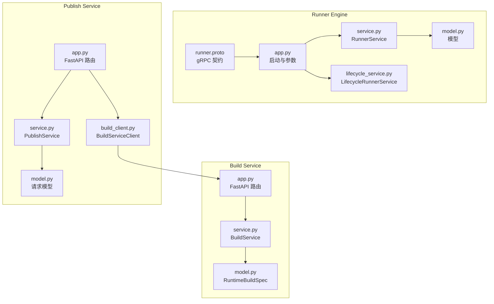
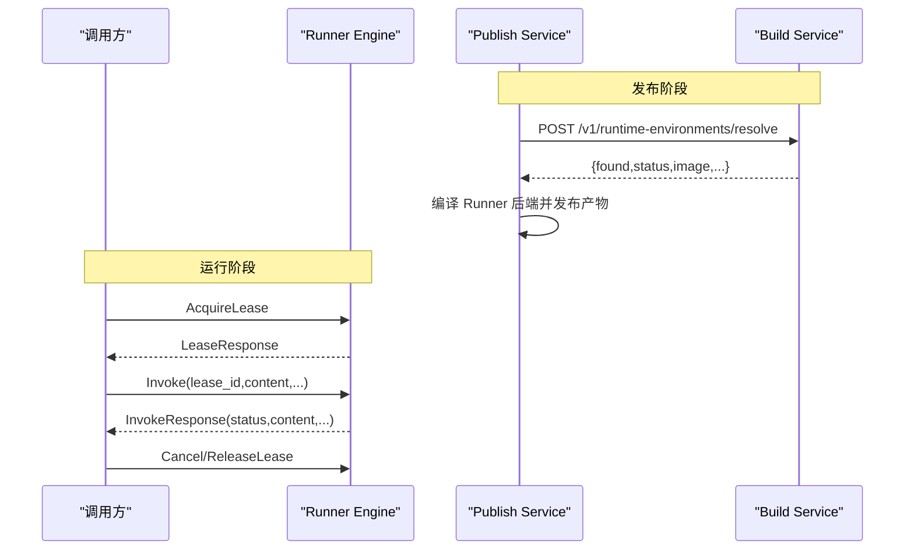
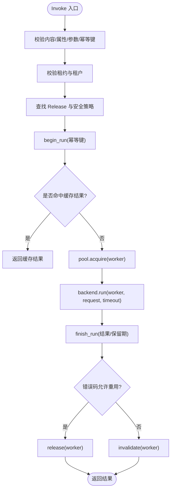
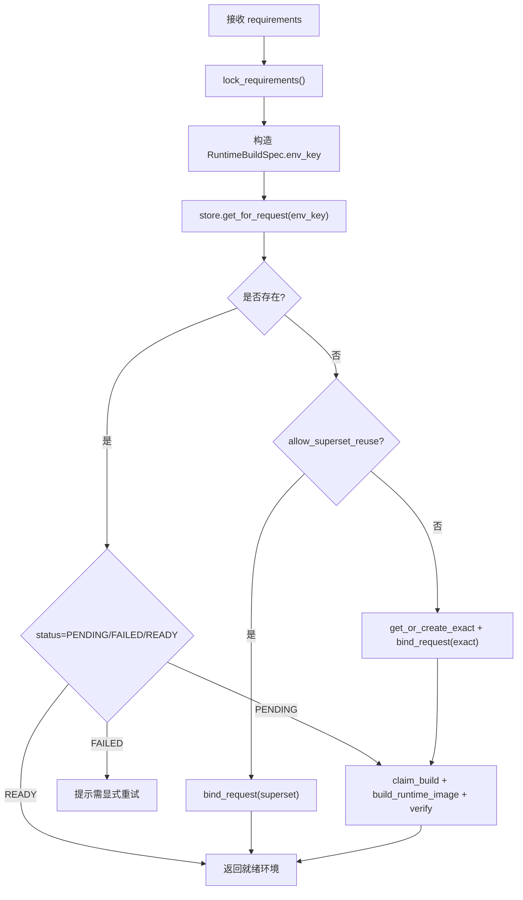
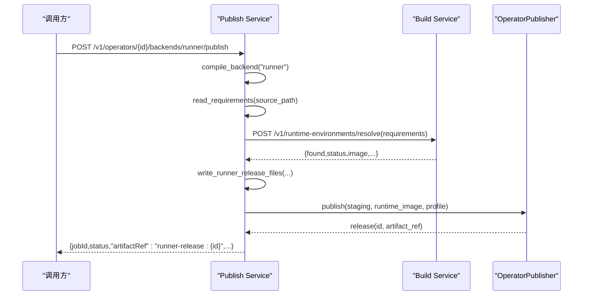
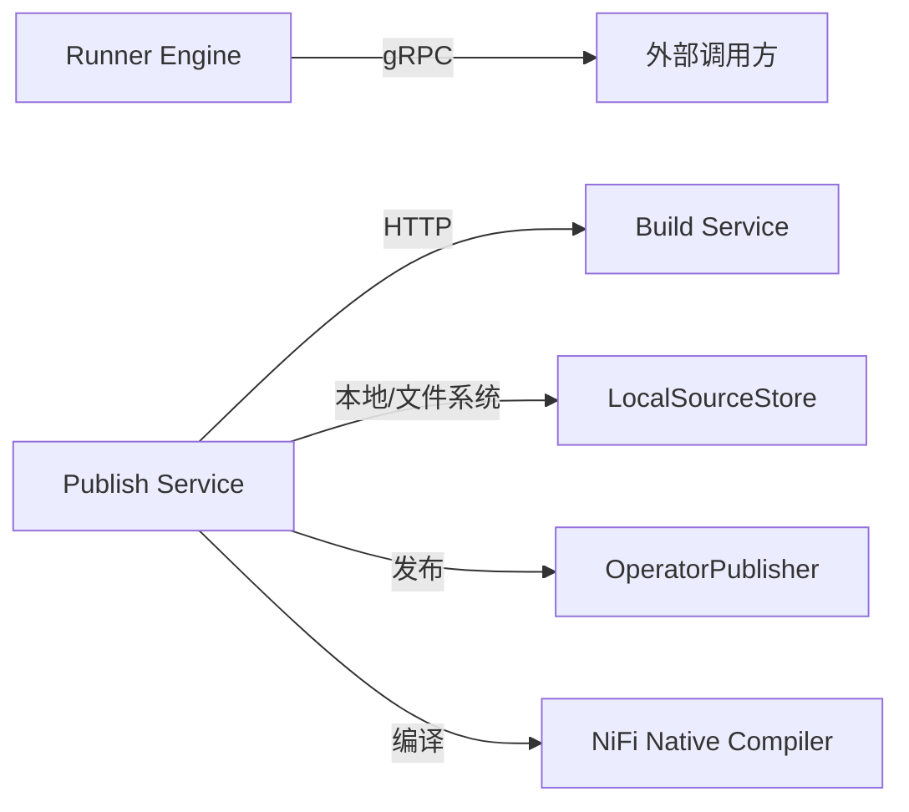

# 核心服务

<cite>
**本文引用的文件**   
- [runner_engine/app.py](file://runner_engine/app.py)
- [runner_engine/service.py](file://runner_engine/service.py)
- [runner_engine/model.py](file://runner_engine/model.py)
- [runner_engine/lifecycle_service.py](file://runner_engine/lifecycle_service.py)
- [proto/runner.proto](file://proto/runner.proto)
- [build_service/app.py](file://build_service/app.py)
- [build_service/service.py](file://build_service/service.py)
- [build_service/model.py](file://build_service/model.py)
- [publish_service/app.py](file://publish_service/app.py)
- [publish_service/service.py](file://publish_service/service.py)
- [publish_service/model.py](file://publish_service/model.py)
- [publish_service/build_client.py](file://publish_service/build_client.py)
</cite>

## 目录
1. [引言](#引言)
2. [项目结构](#项目结构)
3. [核心组件](#核心组件)
4. [架构总览](#架构总览)
5. [详细组件分析](#详细组件分析)
6. [依赖关系分析](#依赖关系分析)
7. [性能与容量特性](#性能与容量特性)
8. [故障排查指南](#故障排查指南)
9. [结论](#结论)

## 引言
本文面向 Runner Engine、Build Service 和 Publish Service 三个核心服务，系统性说明其职责边界、接口契约、数据模型、调用链路与错误处理策略。文档既适合初学者建立整体认知，也为有经验的开发者提供实现细节、配置项与排错要点。

Runner Engine 负责运行时租约管理、算子执行调度、工作池与沙箱生命周期；Build Service 负责根据 Python 依赖构建可复用的运行镜像；Publish Service 负责算子虚拟合约编译、后端产物发布，并在 Runner 模式下联动 Build Service 完成运行环境解析与镜像绑定。

## 项目结构
仓库采用多服务拆分：
- runner_engine：Runner 运行时服务，暴露 gRPC 接口，管理租约、执行、工作池与策略。
- build_service：基于 FastAPI 的构建服务，提供运行环境解析、重试、清理计划等 HTTP API。
- publish_service：基于 FastAPI 的发布服务，提供算子分析、虚拟合约创建、后端编译与发布，以及边缘包下载等能力。
- proto：gRPC 协议定义，描述 Runner Engine 对外 RPC 方法。

**图表来源**
- [runner_engine/app.py:26-220](file://runner_engine/app.py#L26-L220)
- [runner_engine/service.py:80-115](file://runner_engine/service.py#L80-L115)
- [runner_engine/lifecycle_service.py:7-44](file://runner_engine/lifecycle_service.py#L7-L44)
- [proto/runner.proto:8-15](file://proto/runner.proto#L8-L15)
- [build_service/app.py:106-181](file://build_service/app.py#L106-L181)
- [build_service/service.py:26-119](file://build_service/service.py#L26-L119)
- [publish_service/app.py:135-347](file://publish_service/app.py#L135-L347)
- [publish_service/service.py:71-110](file://publish_service/service.py#L71-L110)
- [publish_service/build_client.py:13-30](file://publish_service/build_client.py#L13-L30)

**章节来源**
- [runner_engine/app.py:26-220](file://runner_engine/app.py#L26-L220)
- [build_service/app.py:106-181](file://build_service/app.py#L106-L181)
- [publish_service/app.py:135-347](file://publish_service/app.py#L135-L347)

## 核心组件
- Runner Engine
  - 入口：命令行参数解析、TLS/ACL 配置、Admin HTTP 可选端口、gRPC 服务启动。
  - 核心：RunnerService 提供租约、幂等执行、后台清理、取消等能力；LifecycleRunnerService 在之上增加运行时退役状态门控。
  - 模型：OperatorRelease、SecurityPolicy、Lease、RunRequest、RunResult、Worker、ActiveRun。
- Build Service
  - 入口：FastAPI 应用、健康检查、运行环境解析/查询/重试、生命周期管理路由。
  - 核心：BuildService 负责依赖锁定、镜像构建、验证、复用与失败重试；LifecycleBuildStore 扩展构建存储的生命周期字段。
  - 模型：RuntimeBuildSpec 用于生成稳定 env_key。
- Publish Service
  - 入口：FastAPI 应用、健康检查、边缘平台/部署/操作/包列表、MinIO 文件夹下载、算子分析与虚拟合约创建、后端编译与发布。
  - 核心：PublishService 串联源码扫描、虚拟合约编译、Runner/NiFi Native 后端产物生成、与 Build Service 协作获取运行镜像。
  - 模型：AnalyzeRequest、CreateVirtualContractRequest、BackendRequest、MinioFolderDownloadRequest 等。

**章节来源**
- [runner_engine/service.py:80-115](file://runner_engine/service.py#L80-L115)
- [runner_engine/model.py:7-98](file://runner_engine/model.py#L7-L98)
- [build_service/service.py:26-119](file://build_service/service.py#L26-L119)
- [build_service/model.py:40-71](file://build_service/model.py#L40-L71)
- [publish_service/service.py:71-110](file://publish_service/service.py#L71-L110)
- [publish_service/model.py:19-92](file://publish_service/model.py#L19-L92)

## 架构总览
Runner Engine 通过 gRPC 暴露 ManagedPythonRunner 服务，包含健康检查、租约申请/续期/释放、算子调用与取消。Publish Service 在发布 Runner 后端时，会调用 Build Service 解析 Python 依赖并返回可用镜像；Build Service 将依赖锁定后构建镜像并持久化状态，供后续复用。

**图表来源**
- [proto/runner.proto:8-15](file://proto/runner.proto#L8-L15)
- [publish_service/build_client.py:18-30](file://publish_service/build_client.py#L18-L30)
- [build_service/app.py:140-179](file://build_service/app.py#L140-L179)

**章节来源**
- [proto/runner.proto:8-15](file://proto/runner.proto#L8-L15)
- [publish_service/build_client.py:18-30](file://publish_service/build_client.py#L18-L30)
- [build_service/app.py:140-179](file://build_service/app.py#L140-L179)

## 详细组件分析

### Runner Engine
Runner Engine 是运行时执行的核心。它维护租约、校验安全策略、限制属性大小与内容体积、保证幂等执行、回收过期数据，并通过 WorkerPool 与后端沙箱交互。

- 启动与配置
  - 监听地址、目录、数据库 URL、策略文件、ACL、集群配置、Owner ID、TLS 证书与客户端 CA。
  - 可选 Admin HTTP 管理端点，默认 127.0.0.1:9444，需要 RUNNER_ADMIN_TOKEN。
  - 后台清理线程定期回收空闲 worker、清理过期租约与幂等记录、清理旧执行结果。

- 核心流程
  - 租约：acquire/renew/release，带 TTL。
  - 调用：validate content/attributes/parameters，查找 release 与安全策略，begin_run 幂等键，pool.acquire 获取 worker，backend.run 执行，finish_run 落库，按错误码决定是否重用 worker。
  - 取消：校验租户与租约归属，调用 backend.cancel。

- 生命周期增强
  - LifecycleRunnerService 在 acquire_lease 前检查运行时是否处于 RETIRING/RETIRED，拒绝新执行。

**图表来源**
- [runner_engine/service.py:188-405](file://runner_engine/service.py#L188-L405)

**章节来源**
- [runner_engine/app.py:26-220](file://runner_engine/app.py#L26-L220)
- [runner_engine/service.py:80-115](file://runner_engine/service.py#L80-L115)
- [runner_engine/service.py:146-186](file://runner_engine/service.py#L146-L186)
- [runner_engine/service.py:188-405](file://runner_engine/service.py#L188-L405)
- [runner_engine/lifecycle_service.py:7-44](file://runner_engine/lifecycle_service.py#L7-L44)
- [runner_engine/model.py:7-98](file://runner_engine/model.py#L7-L98)
- [proto/runner.proto:8-15](file://proto/runner.proto#L8-L15)

### Build Service
Build Service 提供运行环境解析与构建能力。输入为 Python 依赖列表，输出为稳定的运行环境信息（含镜像引用）。

- 关键接口
  - GET /health：健康检查。
  - POST /v1/runtime-environments/resolve：解析依赖并返回环境信息。
  - GET /v1/runtime-environments/{env_key}：查询环境。
  - POST /v1/runtime-environments/{env_key}/retry：重试失败环境。
  - 生命周期管理路由：清理计划、退役、取消退役、删除制品等（需 BUILD_ADMIN_TOKEN）。

- 核心逻辑
  - 依赖锁定：使用 uv 生成精确版本锁文本。
  - 环境键：由 base_image、python_version、platform、requirements_lock_sha256、build_policy_version 计算稳定 env_key。
  - 复用策略：支持 superset 复用与 exact 匹配；PENDING 状态触发异步构建；FAILED 状态需显式重试。
  - 构建流程：claim_build -> build_runtime_image -> verify_runtime_image -> mark_ready/mark_failed。

**图表来源**
- [build_service/service.py:31-119](file://build_service/service.py#L31-L119)
- [build_service/model.py:40-71](file://build_service/model.py#L40-L71)

**章节来源**
- [build_service/app.py:106-181](file://build_service/app.py#L106-L181)
- [build_service/service.py:26-119](file://build_service/service.py#L26-L119)
- [build_service/model.py:40-71](file://build_service/model.py#L40-L71)

### Publish Service
Publish Service 负责算子开发到发布的完整链路，包括源码分析、虚拟合约创建、后端编译与发布。Runner 后端发布时会调用 Build Service 获取运行镜像。

- 关键接口
  - GET /health：健康检查。
  - GET /v1/edge/platforms、/deployments、/bundles、/operations：边缘侧元数据与操作查询。
  - GET /v1/edge/bundles/{bundle_id}/download：下载边缘包。
  - POST /v1/authoring/analyze：分析 Python 工程，列出可调用的函数与参数建议。
  - POST /v1/operators：创建虚拟合约。
  - GET /v1/operators/{operator_id}：查看算子与合约版本。
  - POST /v1/operators/{operator_id}/backends/{backend}/compile：编译后端变体。
  - POST /v1/operators/{operator_id}/backends/{backend}/publish：发布后端产物。
  - POST /v1/minio/download-folder：从 MinIO 下载文件夹。

- 核心逻辑
  - 源码扫描与虚拟合约编译：operator_authoring 模块扫描 AST，生成 VirtualOperatorContract 与 Plan。
  - Runner 后端发布：读取 requirements，调用 Build Service 解析运行环境，校验 READY 状态，写入 Runner 发布文件，调用 OperatorPublisher 发布。
  - NiFi Native 后端发布：编译原生合约，处理边缘依赖冲突，生成原生包与边缘 bundle。
  - 错误处理：EdgeDependencyConflictError、PublishError 等被转换为 HTTP 状态码。

**图表来源**
- [publish_service/service.py:624-642](file://publish_service/service.py#L624-L642)
- [publish_service/service.py:711-774](file://publish_service/service.py#L711-L774)
- [publish_service/build_client.py:18-30](file://publish_service/build_client.py#L18-L30)

**章节来源**
- [publish_service/app.py:135-347](file://publish_service/app.py#L135-L347)
- [publish_service/service.py:71-110](file://publish_service/service.py#L71-L110)
- [publish_service/service.py:385-477](file://publish_service/service.py#L385-L477)
- [publish_service/service.py:624-642](file://publish_service/service.py#L624-L642)
- [publish_service/service.py:711-774](file://publish_service/service.py#L711-L774)
- [publish_service/model.py:19-92](file://publish_service/model.py#L19-L92)

## 依赖关系分析
- Runner Engine
  - 依赖 Catalog（算子发行物）、RunnerDB（租约/执行状态）、WorkerPool（工作池）、策略与配额。
  - 对外暴露 gRPC ManagedPythonRunner。
- Build Service
  - 依赖 BuildStore（构建状态）、HarborClient（镜像仓库）、uv 工具链进行依赖锁定与镜像构建。
- Publish Service
  - 依赖 LocalSourceStore（源码快照）、BuildServiceClient（HTTP 调用 Build Service）、OperatorPublisher（Runner 发布）、NiFi Native 编译器（原生发布）。

**图表来源**
- [runner_engine/app.py:212-220](file://runner_engine/app.py#L212-L220)
- [publish_service/build_client.py:18-30](file://publish_service/build_client.py#L18-L30)
- [publish_service/service.py:98-110](file://publish_service/service.py#L98-L110)

**章节来源**
- [runner_engine/app.py:212-220](file://runner_engine/app.py#L212-L220)
- [publish_service/build_client.py:18-30](file://publish_service/build_client.py#L18-L30)
- [publish_service/service.py:98-110](file://publish_service/service.py#L98-L110)

## 性能与容量特性
- Runner Engine
  - 最大内联内容 8 MiB，属性数量上限 128，属性字节上限 64 KiB。
  - 后台清理线程周期性回收 worker、清理过期租约与幂等记录、清理旧执行结果。
  - 租约 TTL、幂等保留期、执行结果保留期可通过环境变量调整。
- Build Service
  - 支持 superset 复用以减少重复构建；PENDING 状态避免并发重复构建。
  - 构建与验证分离，便于定位失败阶段。
- Publish Service
  - 边缘依赖冲突检测避免不同算子在相同目标平台上共享不兼容依赖环境。
  - 构建超时、最大源文件大小等参数可配置。

[本节为通用性能讨论，不直接分析具体文件]

## 故障排查指南
- Runner Engine
  - 未知安全策略：检查 release.profile 是否在 policies.json 中配置。
  - 属性超限或内容过大：检查 attributes 与 content 是否符合限制。
  - 幂等键缺失或调用 ID 冲突：确保 idempotency_key 唯一且 invocation_id 不重复。
  - 运行时退役：LifecycleRunnerService 会在 RETIRING/RETIRED 状态下拒绝新租约与调用。
- Build Service
  - 解析失败：检查 requirements 是否能被 uv 锁定；确认 base_image 已固定为 sha256 引用。
  - FAILED 状态：需显式调用 retry 接口重试；查看 last_error 定位原因。
  - 未找到环境：GET 接口返回 404；POST retry 对非 FAILED 状态返回 409。
- Publish Service
  - 构建服务不可用：BuildServiceClient 抛出 BuildServiceClientError；检查 PUBLISH_BUILD_SERVICE_URL。
  - 运行环境未就绪：RUNTIME_NOT_READY 或 RUNTIME_BUILD_FAILED；检查 Build Service 返回 status 与 image。
  - 边缘依赖冲突：EdgeDependencyConflictError；调整依赖版本或目标平台。
  - MinIO 下载失败：区分 400/403/404/500/502 错误类型，检查 bucket、folder_path 与权限。

**章节来源**
- [runner_engine/service.py:188-405](file://runner_engine/service.py#L188-L405)
- [runner_engine/lifecycle_service.py:19-32](file://runner_engine/lifecycle_service.py#L19-L32)
- [build_service/app.py:140-179](file://build_service/app.py#L140-L179)
- [publish_service/app.py:201-277](file://publish_service/app.py#L201-L277)
- [publish_service/app.py:279-335](file://publish_service/app.py#L279-L335)
- [publish_service/build_client.py:18-30](file://publish_service/build_client.py#L18-L30)

## 结论
Runner Engine、Build Service 与 Publish Service 分别承担运行时执行、运行镜像构建与算子发布职责。三者通过清晰的接口与模型协作：Publish Service 在发布 Runner 后端时调用 Build Service 解析依赖并绑定镜像；Runner Engine 通过 gRPC 提供安全的租约与执行能力。通过合理的配置与错误处理策略，系统可在多租户、多项目场景下稳定运行。对于初学者，建议先从健康检查与基础接口入手，逐步理解各服务的职责边界与调用链；对于资深开发者，可重点关注策略校验、幂等执行、生命周期门控与边缘依赖冲突处理等高级特性。