# 测试指南

<cite>
**本文引用的文件**   
- [pyproject.toml](file://pyproject.toml)
- [tests/conftest.py](file://tests/conftest.py)
- [tests/test_end_to_end_local.py](file://tests/test_end_to_end_local.py)
- [tests/test_agent_process_isolation.py](file://tests/test_agent_process_isolation.py)
- [tests/test_materializer.py](file://tests/test_materializer.py)
- [tests/test_opensandbox_backend.py](file://tests/test_opensandbox_backend.py)
- [tests/test_pool_destroy_idempotent.py](file://tests/test_pool_destroy_idempotent.py)
- [tests/test_publisher.py](file://tests/test_publisher.py)
- [tests/test_quota.py](file://tests/test_quota.py)
- [tests/test_service_security.py](file://tests/test_service_security.py)
- [tests/test_state.py](file://tests/test_state.py)
</cite>

## 目录
1. [简介](#简介)
2. [项目结构](#项目结构)
3. [核心组件](#核心组件)
4. [架构总览](#架构总览)
5. [详细组件分析](#详细组件分析)
6. [依赖关系分析](#依赖关系分析)
7. [性能与并发测试要点](#性能与并发测试要点)
8. [故障排查指南](#故障排查指南)
9. [结论](#结论)
10. [附录：测试清单与最佳实践](#附录测试清单与最佳实践)

## 简介
本指南面向 Runner Engine 的测试编写与执行，覆盖单元测试、集成测试、端到端测试和性能/并发测试。文档基于仓库现有测试代码与配置，说明测试框架选择（pytest）、测试数据准备、模拟对象使用、异步与并发测试模式、外部依赖隔离策略，以及持续集成中的自动化与报告生成建议。同时给出常见测试模式与调试技巧，帮助读者快速上手并稳定维护测试套件。

## 项目结构
Runner Engine 的测试位于 tests 目录，采用 pytest 作为统一测试框架；部分 Web 子模块仍保留 unittest 风格测试，但 Runner Engine 核心测试全部基于 pytest。

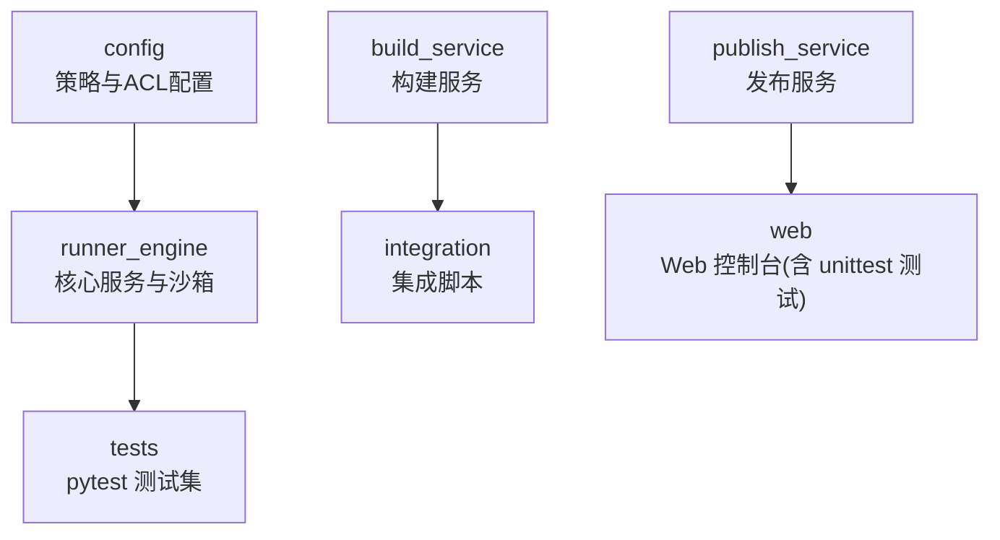

**图表来源**
- [pyproject.toml:34-36](file://pyproject.toml#L34-L36)
- [tests/conftest.py:1-37](file://tests/conftest.py#L1-L37)

**章节来源**
- [pyproject.toml:34-36](file://pyproject.toml#L34-L36)

## 核心组件
本节聚焦 Runner Engine 测试的关键基础设施与常用模式：

- 测试框架与配置
  - 使用 pytest，默认测试路径为 tests，启用安静输出。
  - 通过可选依赖 dev 安装 pytest。

- 共享夹具与测试数据
  - conftest.py 提供 published 夹具，构造最小化 operator 项目、catalog 并发布 release，供端到端与集成测试复用。

- 关键被测组件
  - WorkerPool、Quota、RunnerService、RunnerDB、LocalBackend、OpenSandboxBackend、AgentState、ReleaseMaterializer、OperatorPublisher 等。

**章节来源**
- [pyproject.toml:14-17](file://pyproject.toml#L14-L17)
- [pyproject.toml:34-36](file://pyproject.toml#L34-L36)
- [tests/conftest.py:8-36](file://tests/conftest.py#L8-L36)

## 架构总览
下图展示 Runner Service 在端到端测试中的调用链，包括租约获取、工作池调度、沙箱后端执行与结果返回。

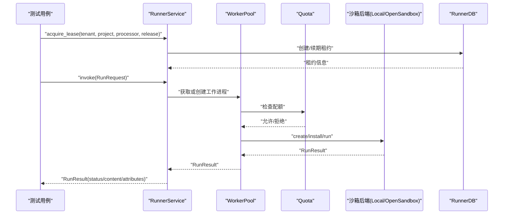

**图表来源**
- [tests/test_end_to_end_local.py:9-32](file://tests/test_end_to_end_local.py#L9-L32)
- [tests/test_service_security.py:56-62](file://tests/test_service_security.py#L56-L62)

## 详细组件分析

### 端到端本地后端测试
- 目标
  - 验证 RunnerService 在 LocalBackend 下的完整执行链路，包括租约、工作池、配额、安全策略过滤与结果断言。
- 关键点
  - 使用 published 夹具提供可执行的 release。
  - 构造 RunnerService、WorkerPool、Quota、LocalBackend 与 RunnerDB。
  - 断言状态码、内容与属性过滤。

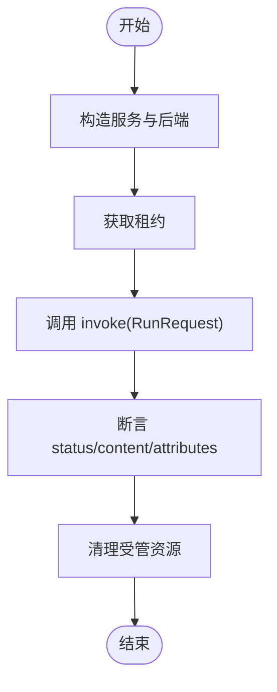

**图表来源**
- [tests/test_end_to_end_local.py:9-32](file://tests/test_end_to_end_local.py#L9-L32)

**章节来源**
- [tests/test_end_to_end_local.py:9-32](file://tests/test_end_to_end_local.py#L9-L32)

### Agent 进程隔离与超时测试
- 目标
  - 验证用户进程退出、解释器全局变量不泄漏、超时杀死用户进程等行为。
- 关键点
  - 通过 _release 辅助函数构造最小化 release 与 AgentState。
  - 使用 state.run 多次调用，断言错误码与返回值稳定性。

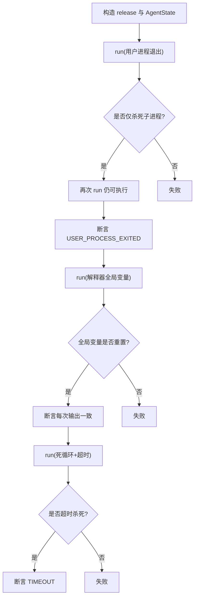

**图表来源**
- [tests/test_agent_process_isolation.py:12-42](file://tests/test_agent_process_isolation.py#L12-L42)
- [tests/test_agent_process_isolation.py:45-99](file://tests/test_agent_process_isolation.py#L45-L99)

**章节来源**
- [tests/test_agent_process_isolation.py:12-42](file://tests/test_agent_process_isolation.py#L12-L42)
- [tests/test_agent_process_isolation.py:45-99](file://tests/test_agent_process_isolation.py#L45-L99)

### 工件解压与防逃逸测试
- 目标
  - 验证 ReleaseMaterializer 对父目录逃逸路径的拒绝行为。
- 关键点
  - 构造包含 "../escape" 的 tar/gzip 工件，断言抛出异常。

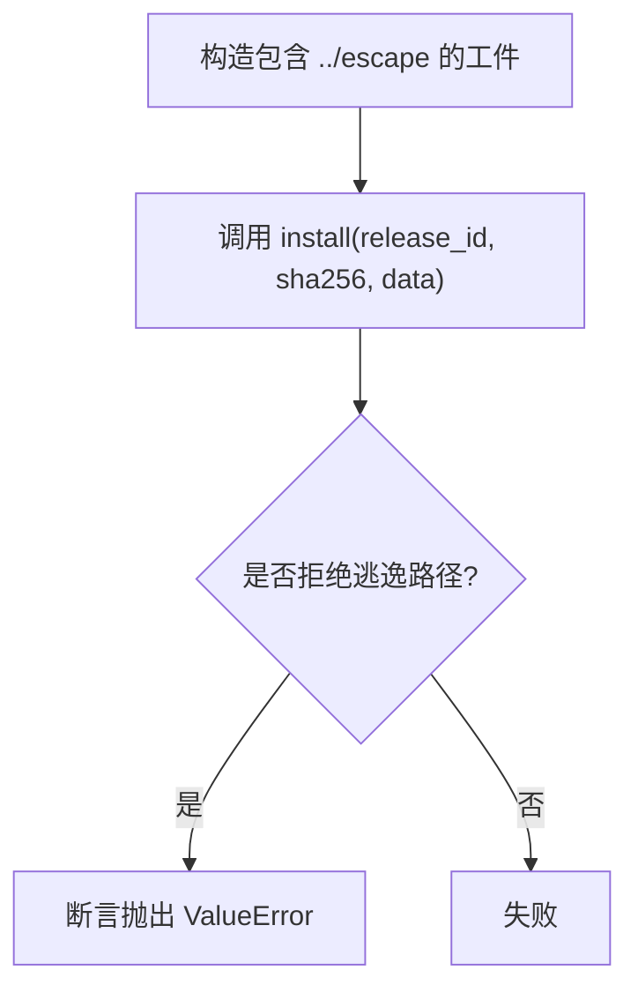

**图表来源**
- [tests/test_materializer.py:9-15](file://tests/test_materializer.py#L9-L15)
- [tests/test_materializer.py:18-24](file://tests/test_materializer.py#L18-L24)

**章节来源**
- [tests/test_materializer.py:18-24](file://tests/test_materializer.py#L18-L24)

### OpenSandbox 后端策略与元数据校验
- 目标
  - 验证 OpenSandboxBackend 在创建沙箱时是否正确应用安全策略与网络策略，并对 metadata 进行长度限制。
- 关键点
  - FakeOpenSandbox 模拟 HTTP 请求，记录 create payload。
  - 断言 resourceLimits、networkPolicy、secureAccess、metadata 字段。

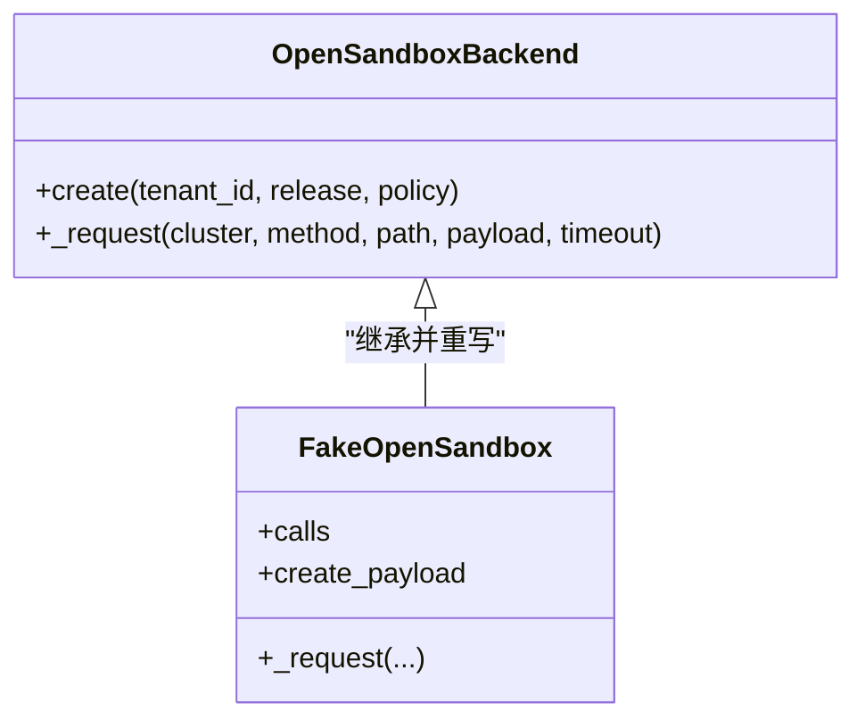

**图表来源**
- [tests/test_opensandbox_backend.py:7-24](file://tests/test_opensandbox_backend.py#L7-L24)
- [tests/test_opensandbox_backend.py:27-59](file://tests/test_opensandbox_backend.py#L27-L59)

**章节来源**
- [tests/test_opensandbox_backend.py:27-59](file://tests/test_opensandbox_backend.py#L27-L59)

### WorkerPool 销毁幂等性与配额一致性
- 目标
  - 验证 WorkerPool.invalidate 对同一 worker 的多次销毁不会重复扣减配额。
- 关键点
  - 自定义 Backend 统计 destroy 次数。
  - 断言 destroy_count 与 quota.live 的一致性。

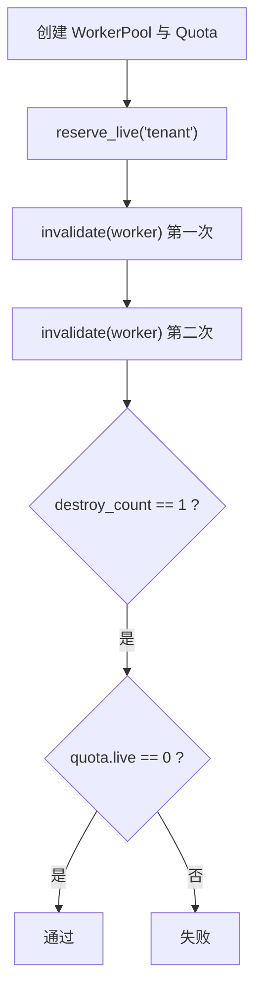

**图表来源**
- [tests/test_pool_destroy_idempotent.py:8-17](file://tests/test_pool_destroy_idempotent.py#L8-L17)
- [tests/test_pool_destroy_idempotent.py:19-40](file://tests/test_pool_destroy_idempotent.py#L19-L40)

**章节来源**
- [tests/test_pool_destroy_idempotent.py:19-40](file://tests/test_pool_destroy_idempotent.py#L19-L40)

### 发布确定性与时不可变镜像校验
- 目标
  - 验证 OperatorPublisher.publish 的确定性（相同输入产生相同 release id 与 artifact_sha256）。
  - 验证可变镜像标签被拒绝，必须使用 sha256 固定版本。
- 关键点
  - 使用 published 夹具对比两次发布结果。
  - 捕获 ValueError 并断言消息包含 sha256。

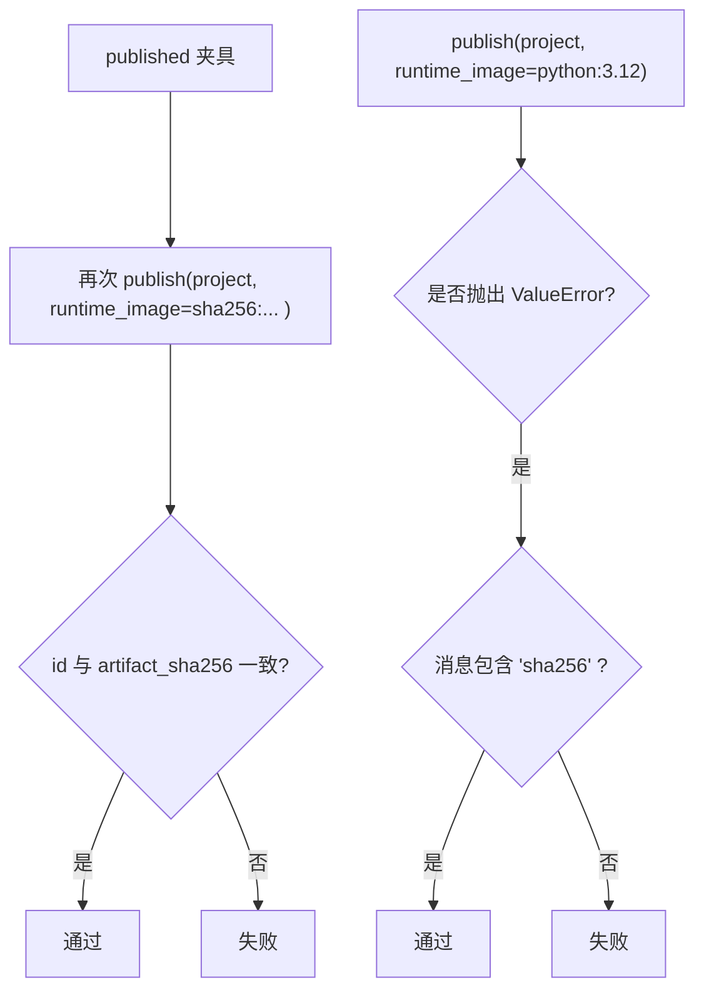

**图表来源**
- [tests/test_publisher.py:4-11](file://tests/test_publisher.py#L4-L11)
- [tests/test_publisher.py:14-26](file://tests/test_publisher.py#L14-L26)

**章节来源**
- [tests/test_publisher.py:4-26](file://tests/test_publisher.py#L4-L26)

### 配额生命周期与错误处理
- 目标
  - 验证 reserve_live/release_live 的生命周期语义，确保 creation_slot 期间不释放 live 计数。
- 关键点
  - 断言 quota.live 变化与 QuotaError 抛出时机。

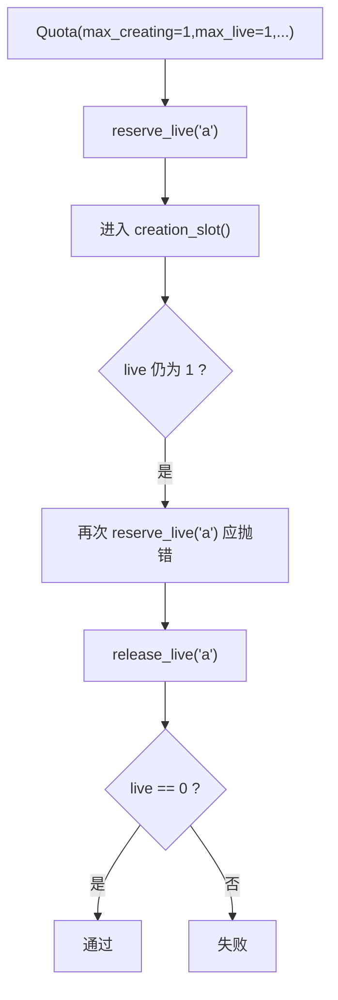

**图表来源**
- [tests/test_quota.py:6-16](file://tests/test_quota.py#L6-L16)

**章节来源**
- [tests/test_quota.py:6-16](file://tests/test_quota.py#L6-L16)

### 服务安全与跨租约取消保护
- 目标
  - 验证 RunnerService 对属性的过滤规则与跨租约 cancel 的拒绝行为。
- 关键点
  - BlockingBackend 模拟阻塞运行与 destroy 回调。
  - 多线程并发 invoke/cancel，断言 RunnerError 与错误码。

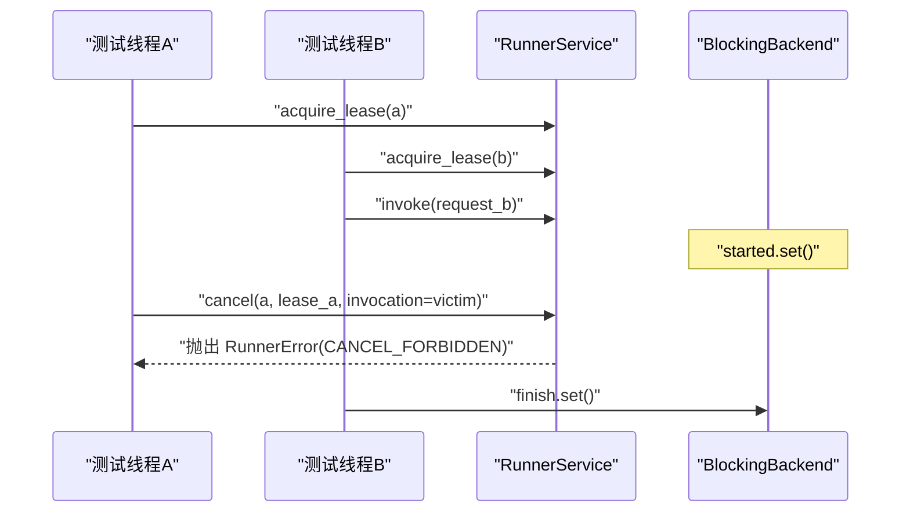

**图表来源**
- [tests/test_service_security.py:13-53](file://tests/test_service_security.py#L13-L53)
- [tests/test_service_security.py:65-112](file://tests/test_service_security.py#L65-L112)

**章节来源**
- [tests/test_service_security.py:65-112](file://tests/test_service_security.py#L65-L112)

### 租约持久化与幂等执行
- 目标
  - 验证 RunnerDB 的租约创建、续期与完成结果回放能力。
- 关键点
  - 断言 require_lease 返回正确 release_id。
  - 断言 finish_run 后可通过 get_completed 回放结果。

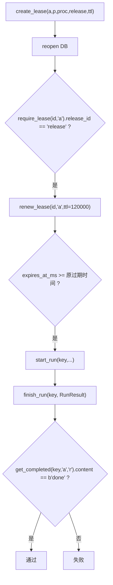

**图表来源**
- [tests/test_state.py:7-15](file://tests/test_state.py#L7-L15)
- [tests/test_state.py:18-24](file://tests/test_state.py#L18-L24)

**章节来源**
- [tests/test_state.py:7-24](file://tests/test_state.py#L7-L24)

## 依赖关系分析
Runner Engine 测试依赖的核心模块与关系如下：

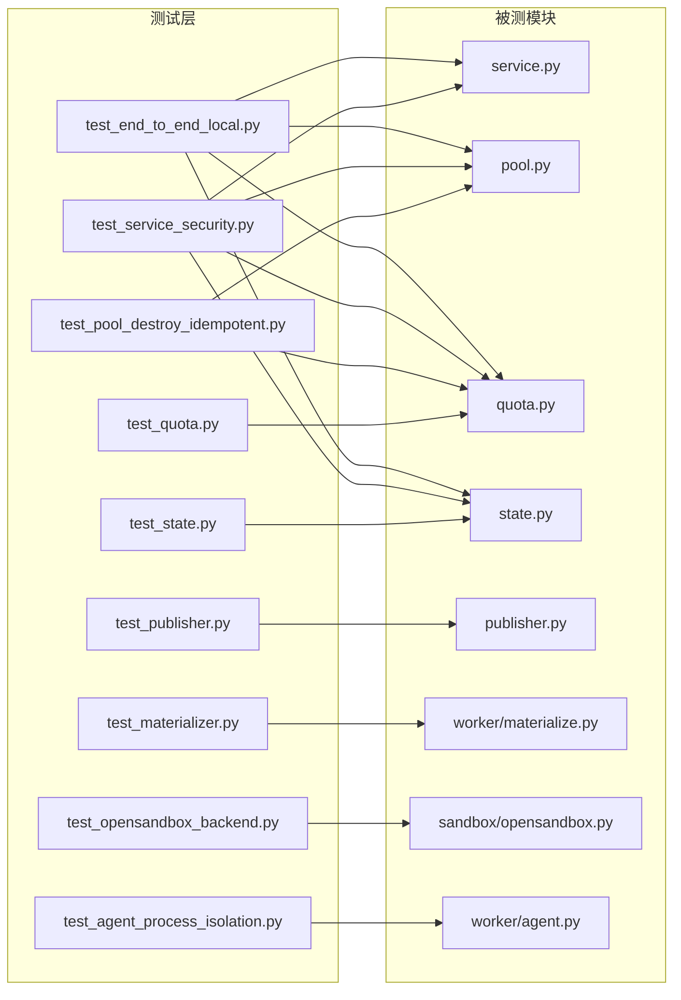

**图表来源**
- [tests/test_end_to_end_local.py:1-6](file://tests/test_end_to_end_local.py#L1-L6)
- [tests/test_service_security.py:1-10](file://tests/test_service_security.py#L1-L10)
- [tests/test_agent_process_isolation.py:9-9](file://tests/test_agent_process_isolation.py#L9-L9)
- [tests/test_materializer.py:6-6](file://tests/test_materializer.py#L6-L6)
- [tests/test_opensandbox_backend.py:3-4](file://tests/test_opensandbox_backend.py#L3-L4)
- [tests/test_pool_destroy_idempotent.py:3-5](file://tests/test_pool_destroy_idempotent.py#L3-L5)
- [tests/test_publisher.py:1-1](file://tests/test_publisher.py#L1-L1)
- [tests/test_quota.py:1-3](file://tests/test_quota.py#L1-L3)
- [tests/test_state.py:1-4](file://tests/test_state.py#L1-L4)

**章节来源**
- [tests/test_end_to_end_local.py:1-6](file://tests/test_end_to_end_local.py#L1-L6)
- [tests/test_service_security.py:1-10](file://tests/test_service_security.py#L1-L10)
- [tests/test_agent_process_isolation.py:9-9](file://tests/test_agent_process_isolation.py#L9-L9)
- [tests/test_materializer.py:6-6](file://tests/test_materializer.py#L6-L6)
- [tests/test_opensandbox_backend.py:3-4](file://tests/test_opensandbox_backend.py#L3-L4)
- [tests/test_pool_destroy_idempotent.py:3-5](file://tests/test_pool_destroy_idempotent.py#L3-L5)
- [tests/test_publisher.py:1-1](file://tests/test_publisher.py#L1-L1)
- [tests/test_quota.py:1-3](file://tests/test_quota.py#L1-L3)
- [tests/test_state.py:1-4](file://tests/test_state.py#L1-L4)

## 性能与并发测试要点
- 并发模型
  - 使用 threading 模拟并发场景，如跨租约取消保护测试中，主线程与子线程分别发起 invoke 与 cancel，并通过 Event 同步。
- 超时控制
  - 针对用户进程死循环场景，使用较短 timeout_ms 验证超时杀死逻辑。
- 资源清理
  - 在端到端测试末尾调用 backend.cleanup_managed() 避免残留资源影响后续用例。
- 建议
  - 对耗时操作设置合理超时与重试上限。
  - 使用临时目录（tmp_path）隔离每个用例的数据与数据库文件。
  - 对外部依赖（如 OpenSandbox API）使用 Mock/Fake 替代真实网络调用。

[本节为通用指导，不直接分析具体文件]

## 故障排查指南
- 常见问题定位
  - 属性泄露：检查 RunnerService 对 attributes 的过滤逻辑，参考跨租户属性过滤测试。
  - 配额不一致：确认 WorkerPool.invalidate 的幂等性，避免重复 destroy 导致配额异常。
  - 租约失效：检查 RunnerDB 的 renew_lease 与 require_lease 行为，确保 TTL 更新与租户匹配。
  - 工件逃逸：确认 ReleaseMaterializer 对路径前缀的检查，防止 ../ 逃逸。
  - 外部依赖不稳定：使用 FakeOpenSandbox 或 monkeypatch 替换 worker_call，确保测试可重复。
- 调试技巧
  - 打印中间状态：在 service.invoke 前后打印租约与工作进程信息。
  - 缩小范围：将端到端用例拆分为更小的单元，逐步定位问题。
  - 日志增强：在关键分支添加日志，便于 CI 环境复现问题。

**章节来源**
- [tests/test_service_security.py:65-78](file://tests/test_service_security.py#L65-L78)
- [tests/test_pool_destroy_idempotent.py:19-40](file://tests/test_pool_destroy_idempotent.py#L19-L40)
- [tests/test_state.py:7-15](file://tests/test_state.py#L7-L15)
- [tests/test_materializer.py:18-24](file://tests/test_materializer.py#L18-L24)
- [tests/test_opensandbox_backend.py:27-59](file://tests/test_opensandbox_backend.py#L27-L59)

## 结论
Runner Engine 的测试体系以 pytest 为核心，围绕 RunnerService、WorkerPool、Quota、RunnerDB、沙箱后端与工件处理等关键组件展开。测试覆盖了端到端流程、进程隔离、权限与安全、配额与幂等、工件安全与发布确定性等维度。通过夹具与 Mock/Fake 机制，测试具备良好的可重复性与可扩展性。建议在持续集成中引入覆盖率门禁与并行执行，进一步提升质量保障效率。

[本节为总结性内容，不直接分析具体文件]

## 附录：测试清单与最佳实践
- 测试类型与示例
  - 单元测试：materializer 路径逃逸、publisher 确定性、quota 生命周期、state 租约与幂等。
  - 集成测试：opensandbox 后端策略与元数据校验。
  - 端到端测试：local 后端全链路执行。
  - 并发与异步测试：跨租约取消保护、用户进程超时与隔离。
- 测试数据准备
  - 使用 tmp_path 与 published 夹具生成最小化 operator 项目与 catalog。
- 模拟对象使用
  - FakeOpenSandbox 模拟 HTTP 接口；BlockingBackend 模拟阻塞运行与 destroy 回调。
- 测试环境搭建
  - 安装 pytest（dev 可选依赖），运行 pytest 自动发现 tests 目录。
- 覆盖率与质量门禁
  - 建议在 CI 中启用 pytest-cov 生成覆盖率报告，并设置最低覆盖率阈值。
- 持续集成与报告
  - 并行执行测试用例，收集 junitxml 与覆盖率报告，归档到 CI 平台。
- 调试技巧
  - 使用 -v 或 --tb=short 查看详细堆栈；对失败用例单独运行并增加日志。

[本节为通用指导，不直接分析具体文件]