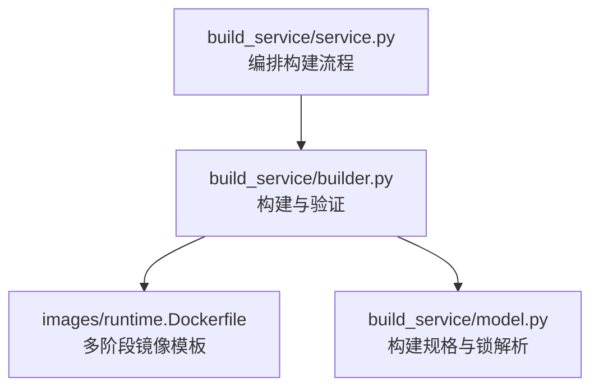
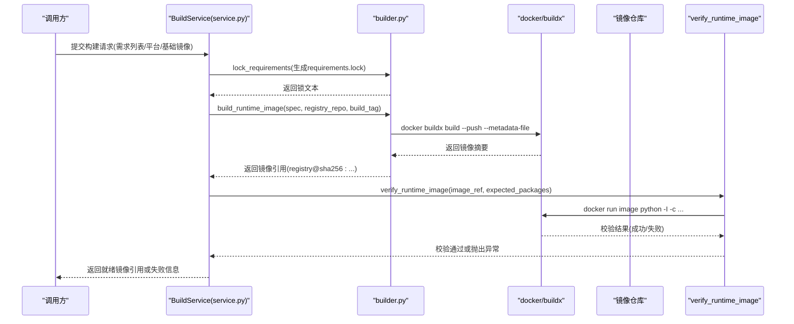
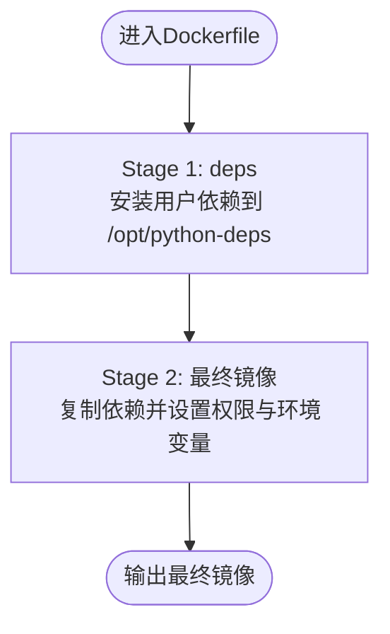
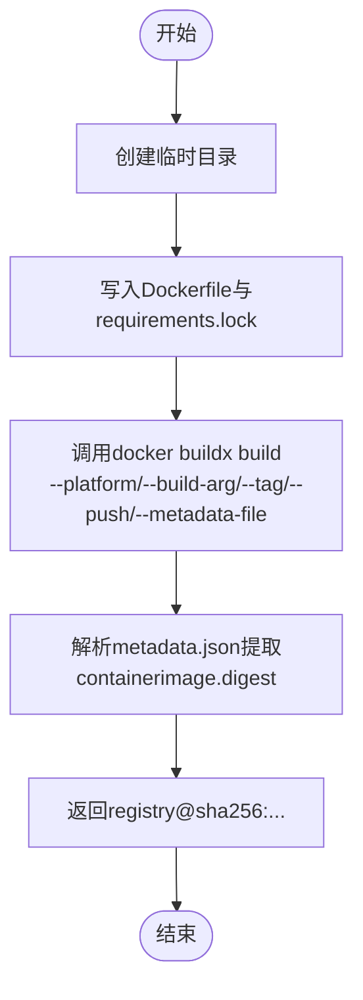
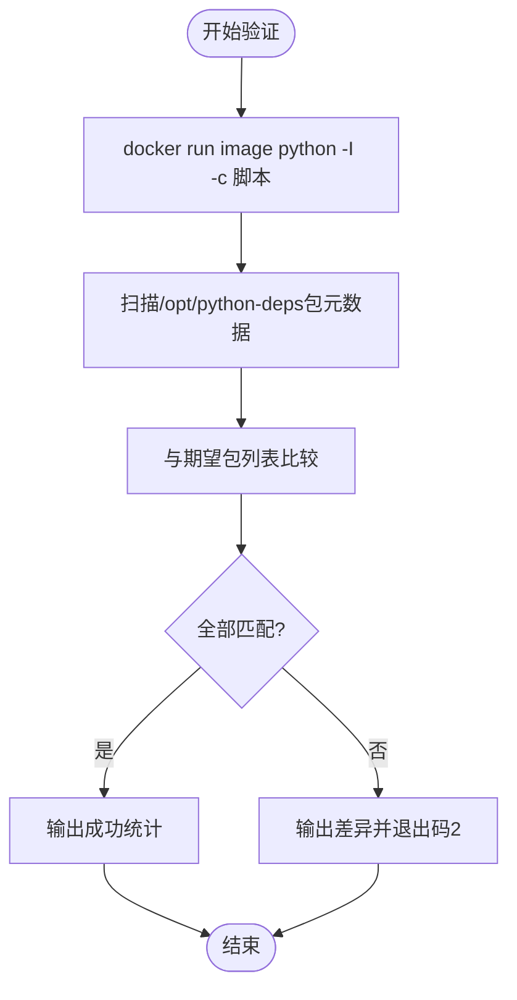
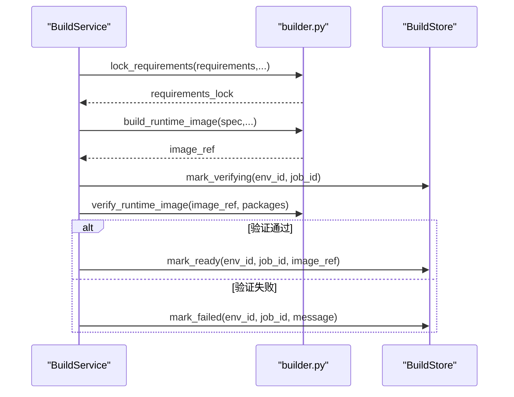
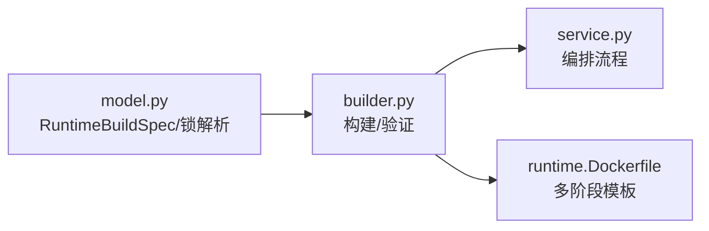

# Docker镜像构建

<cite>
**本文引用的文件**   
- [builder.py](file://build_service/builder.py)
- [model.py](file://build_service/model.py)
- [service.py](file://build_service/service.py)
- [runtime.Dockerfile](file://images/runtime.Dockerfile)
</cite>

## 目录
1. [简介](#简介)
2. [项目结构](#项目结构)
3. [核心组件](#核心组件)
4. [架构总览](#架构总览)
5. [详细组件分析](#详细组件分析)
6. [依赖关系分析](#依赖关系分析)
7. [性能与优化](#性能与优化)
8. [故障排查指南](#故障排查指南)
9. [结论](#结论)
10. [附录：构建示例](#附录构建示例)

## 简介
本文面向Docker镜像构建，重点解释多阶段构建策略、运行时镜像的完整构建流程、镜像验证机制以及镜像优化最佳实践。系统通过“依赖安装阶段”和“最终镜像阶段”分离，确保不可信依赖在隔离阶段安装，最终镜像仅包含最小化、只读的可执行依赖集合；同时通过构建元数据与运行期校验双重保障包版本一致性与完整性。

## 项目结构
与Docker镜像构建直接相关的代码主要位于以下位置：
- build_service/builder.py：定义RUNTIME_DOCKERFILE常量、依赖锁定、镜像构建与镜像验证逻辑。
- build_service/model.py：定义RuntimeBuildSpec，负责锁文件解析、环境键生成与基础镜像固定约束。
- build_service/service.py：编排构建服务流程，调用构建与验证，并维护构建状态。
- images/runtime.Dockerfile：参考的多阶段Dockerfile模板（与builder中内嵌模板语义一致）。

**图表来源**
- [service.py:157-215](file://build_service/service.py#L157-L215)
- [builder.py:122-204](file://build_service/builder.py#L122-L204)
- [runtime.Dockerfile:21-65](file://images/runtime.Dockerfile#L21-L65)
- [model.py:40-71](file://build_service/model.py#L40-L71)

**章节来源**
- [service.py:157-215](file://build_service/service.py#L157-L215)
- [builder.py:122-204](file://build_service/builder.py#L122-L204)
- [runtime.Dockerfile:21-65](file://images/runtime.Dockerfile#L21-L65)
- [model.py:40-71](file://build_service/model.py#L40-L71)

## 核心组件
- RUNTIME_DOCKERFILE：内嵌于builder.py中的多阶段Dockerfile模板，定义依赖安装阶段与最终镜像阶段。
- lock_requirements：使用uv pip compile生成带哈希的requirements.lock，保证可重复构建。
- build_runtime_image：创建临时上下文、写入Dockerfile与lock文件、调用docker buildx构建并推送镜像，返回基于摘要的镜像引用。
- verify_runtime_image：在目标镜像中运行Python脚本，扫描/opt/python-deps下的包元数据并与期望包列表比对，失败时退出码非零。
- RuntimeBuildSpec：封装基础镜像、Python版本、平台、锁文本等构建参数，并提供env_key用于环境去重与幂等性。

**章节来源**
- [builder.py:14-59](file://build_service/builder.py#L14-L59)
- [builder.py:84-119](file://build_service/builder.py#L84-L119)
- [builder.py:122-158](file://build_service/builder.py#L122-L158)
- [builder.py:161-204](file://build_service/builder.py#L161-L204)
- [model.py:40-71](file://build_service/model.py#L40-L71)

## 架构总览
整体构建流程由服务层编排，底层依赖构建工具链与Docker引擎协作完成。

**图表来源**
- [service.py:157-215](file://build_service/service.py#L157-L215)
- [builder.py:84-119](file://build_service/builder.py#L84-L119)
- [builder.py:122-158](file://build_service/builder.py#L122-L158)
- [builder.py:161-204](file://build_service/builder.py#L161-L204)

## 详细组件分析

### 多阶段构建策略：RUNTIME_DOCKERFILE
- 第一阶段（deps）：以RUNNER_BASE为基础镜像，安装用户依赖到/opt/python-deps，使用内部pip源与--no-cache-dir避免缓存污染。
- 第二阶段（最终镜像）：再次从RUNNER_BASE开始，仅复制/opt/python-deps到最终镜像，设置RUNNER_DEPENDENCY_ROOT环境变量，并将PYTHONPATH限制为可信路径，避免Agent依赖用户依赖。
- 安全与权限：对依赖目录设置只读权限，禁止写位，降低被篡改风险。

**图表来源**
- [builder.py:14-59](file://build_service/builder.py#L14-L59)
- [runtime.Dockerfile:21-65](file://images/runtime.Dockerfile#L21-L65)

**章节来源**
- [builder.py:14-59](file://build_service/builder.py#L14-L59)
- [runtime.Dockerfile:21-65](file://images/runtime.Dockerfile#L21-L65)

### 构建流程：build_runtime_image
- 临时目录管理：使用临时目录作为构建上下文，避免污染工作区。
- Dockerfile生成：将RUNTIME_DOCKERFILE写入临时上下文，并写入requirements.lock。
- 构建参数配置：通过--platform指定目标平台，通过--build-arg传入RUNNER_BASE基础镜像。
- 镜像推送：使用--push直接推送到镜像仓库，并通过--metadata-file获取容器镜像摘要。
- 返回值：返回registry@sha256:<digest>形式的不可变镜像引用。

**图表来源**
- [builder.py:122-158](file://build_service/builder.py#L122-L158)

**章节来源**
- [builder.py:122-158](file://build_service/builder.py#L122-L158)

### 镜像验证机制：verify_runtime_image
- 期望包列表：来自RuntimeBuildSpec.packages，由parse_locked_packages解析requirements.lock得到规范化后的包名与版本映射。
- 运行期检查：在目标镜像中以python -I -c方式执行内嵌脚本，读取/opt/python-deps下所有包的Name与Version，进行规范化比较。
- 失败处理：若存在缺失或版本不匹配，打印差异并退出码2；否则输出成功统计。
- 安全性：使用--pull=always确保拉取最新镜像，--rm清理运行容器，避免残留。

**图表来源**
- [builder.py:161-204](file://build_service/builder.py#L161-L204)
- [model.py:17-37](file://build_service/model.py#L17-L37)

**章节来源**
- [builder.py:161-204](file://build_service/builder.py#L161-L204)
- [model.py:17-37](file://build_service/model.py#L17-L37)

### 构建服务编排：service.py
- 流程编排：先调用lock_requirements生成锁，再调用build_runtime_image构建并推送镜像，最后调用verify_runtime_image进行验证。
- 状态管理：在构建过程中更新存储状态（PENDING→VERIFYING→READY/FAILED），并在异常时记录错误信息。
- 重试机制：支持对FAILED状态的构建进行重试。

**图表来源**
- [service.py:157-215](file://build_service/service.py#L157-L215)
- [builder.py:84-119](file://build_service/builder.py#L84-L119)
- [builder.py:122-158](file://build_service/builder.py#L122-L158)
- [builder.py:161-204](file://build_service/builder.py#L161-L204)

**章节来源**
- [service.py:157-215](file://build_service/service.py#L157-L215)

## 依赖关系分析
- builder.py依赖model.py提供的RuntimeBuildSpec与锁解析能力。
- service.py依赖builder.py的构建与验证函数，并协调存储层状态。
- runtime.Dockerfile与builder.py中的RUNTIME_DOCKERFILE保持一致语义，提供多阶段构建模板。

**图表来源**
- [model.py:40-71](file://build_service/model.py#L40-L71)
- [builder.py:122-204](file://build_service/builder.py#L122-L204)
- [service.py:157-215](file://build_service/service.py#L157-L215)
- [runtime.Dockerfile:21-65](file://images/runtime.Dockerfile#L21-L65)

**章节来源**
- [model.py:40-71](file://build_service/model.py#L40-L71)
- [builder.py:122-204](file://build_service/builder.py#L122-L204)
- [service.py:157-215](file://build_service/service.py#L157-L215)
- [runtime.Dockerfile:21-65](file://images/runtime.Dockerfile#L21-L65)

## 性能与优化
- 层缓存优化
  - 将requirements.lock单独COPY，使依赖安装阶段变更频率低，提升Docker层缓存命中率。
  - 使用--no-cache-dir减少pip缓存体积，避免无用层膨胀。
- 镜像大小控制
  - 多阶段构建仅复制/opt/python-deps到最终镜像，避免构建工具与中间文件进入生产镜像。
  - 设置只读权限与最小环境变量，减少攻击面与冗余配置。
- 安全性考虑
  - 基础镜像必须固定为repo@sha256:<digest>，防止基础镜像漂移。
  - 依赖安装使用内部pip源与--trusted-host，避免外部不可信源引入风险。
  - 运行期校验确保/opt/python-deps中包名与版本与锁一致，防止构建与运行不一致。
- 构建可重复性
  - 使用uv pip compile生成带哈希的requirements.lock，确保跨平台与跨时间的一致性。
  - env_key基于base_image、python_version、platform、lock_sha256与build_policy_version计算，实现环境幂等。

[本节为通用指导，不直接分析具体文件]

## 故障排查指南
- 构建失败
  - 检查docker buildx是否可用，网络是否能访问镜像仓库与内部pip源。
  - 确认spec.platform与RUNNER_BASE基础镜像平台匹配。
  - 查看metadata.json是否包含containerimage.digest字段，若无则构建未成功产出摘要。
- 验证失败
  - 核对expected_packages与requirements.lock一致性，确保包名规范化后完全匹配。
  - 检查/opt/python-deps是否存在且包含预期包，权限是否为只读。
  - 若出现SystemExit(2)，说明存在缺失或版本不匹配的包，需调整依赖或锁文件。
- 基础镜像问题
  - base_image必须以repo@sha256:<digest>形式固定，否则会抛出错误。
  - 若基础镜像不可用或平台不匹配，会导致构建失败。

**章节来源**
- [builder.py:122-158](file://build_service/builder.py#L122-L158)
- [builder.py:161-204](file://build_service/builder.py#L161-L204)
- [model.py:48-71](file://build_service/model.py#L48-L71)

## 结论
本方案通过多阶段Dockerfile与严格的依赖锁定、镜像摘要引用与运行期校验，实现了安全、可重复、可追踪的运行时镜像构建流程。服务层编排清晰，便于扩展与监控；优化策略兼顾性能与安全，适合在生产环境中大规模使用。

[本节为总结，不直接分析具体文件]

## 附录：构建示例
以下为典型构建步骤（概念性示例，不涉及具体命令内容）：
- 准备需求列表与基础镜像（固定摘要）。
- 调用lock_requirements生成requirements.lock。
- 调用build_runtime_image构建并推送镜像，获得registry@sha256:...引用。
- 调用verify_runtime_image验证镜像包版本与完整性。
- 将镜像引用持久化至存储层，供后续运行使用。

[本节为概念性示例，不直接分析具体文件]