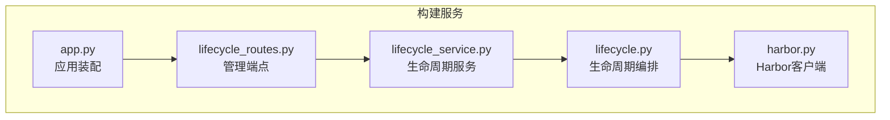
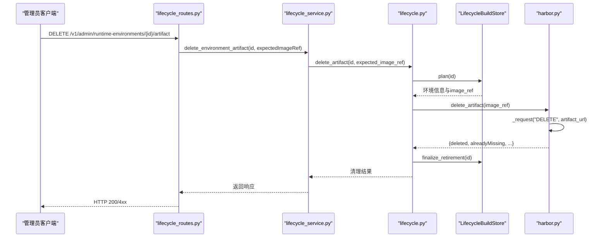
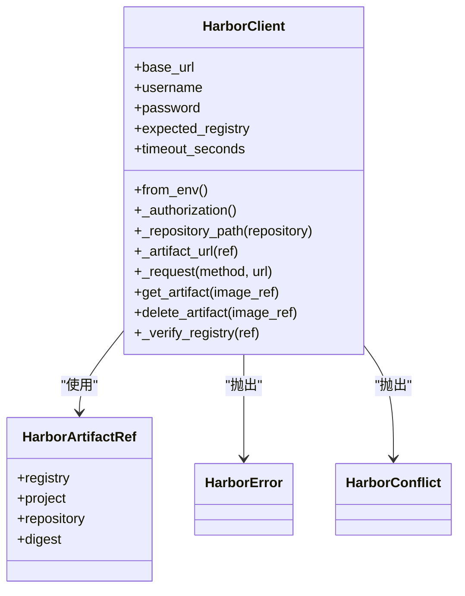
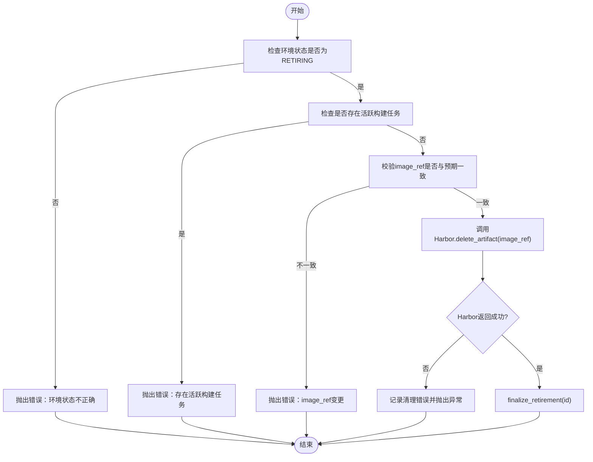
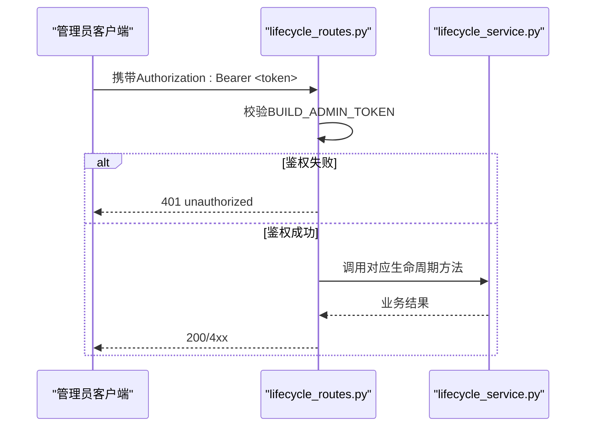
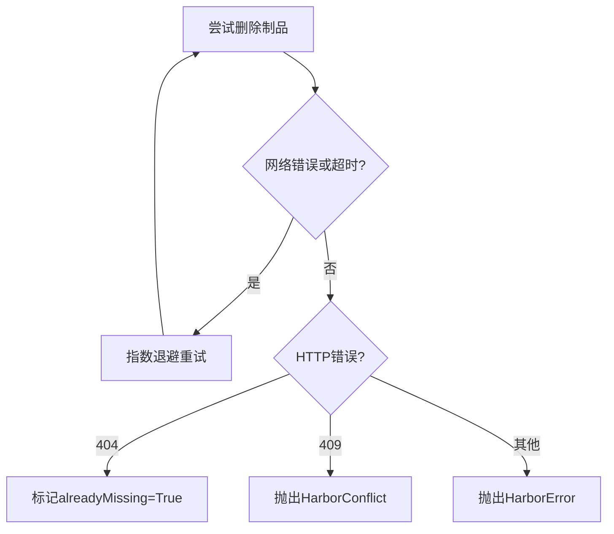
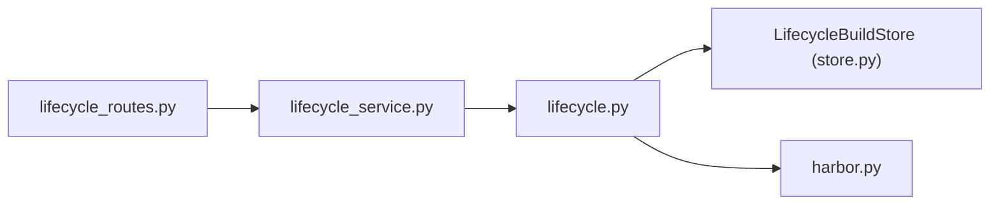

# Harbor仓库集成

<cite>
**本文引用的文件**   
- [build_service/harbor.py](file://build_service/harbor.py)
- [build_service/lifecycle.py](file://build_service/lifecycle.py)
- [build_service/lifecycle_service.py](file://build_service/lifecycle_service.py)
- [build_service/lifecycle_routes.py](file://build_service/lifecycle_routes.py)
- [build_service/app.py](file://build_service/app.py)
</cite>

## 目录
1. [简介](#简介)
2. [项目结构](#项目结构)
3. [核心组件](#核心组件)
4. [架构总览](#架构总览)
5. [详细组件分析](#详细组件分析)
6. [依赖关系分析](#依赖关系分析)
7. [性能与可靠性考虑](#性能与可靠性考虑)
8. [故障排查指南](#故障排查指南)
9. [结论](#结论)
10. [附录：环境变量与API参考](#附录环境变量与api参考)

## 简介
本文件面向需要在构建服务中集成Harbor镜像仓库的工程师，提供从认证、连接配置到镜像制品管理的完整说明。当前代码库实现了一个最小化的Harbor v2 API客户端，用于查询和删除镜像制品；同时通过生命周期状态机协调运行环境的退役与清理流程。需要特别注意：当前Harbor客户端未实现镜像上传与下载（Push/Pull）能力，仅支持基于摘要的制品查询与删除。

## 项目结构
围绕Harbor集成的关键代码位于 build_service 目录下：
- harbor.py：Harbor v2 API客户端、错误类型、镜像引用解析与校验。
- lifecycle.py：构建生命周期计划与退役/取消退役/删除制品的业务逻辑。
- lifecycle_service.py：扩展数据库存储以支持生命周期状态，并对外暴露生命周期服务接口。
- lifecycle_routes.py：FastAPI管理端点，用于触发退役、取消退役与删除制品。
- app.py：应用启动时注入Harbor客户端实例，并提供Harbor是否已配置的探测信息。

**图表来源**
- [build_service/app.py:90-140](file://build_service/app.py#L90-L140)
- [build_service/lifecycle_routes.py:34-108](file://build_service/lifecycle_routes.py#L34-L108)
- [build_service/lifecycle_service.py:293-323](file://build_service/lifecycle_service.py#L293-L323)
- [build_service/lifecycle.py:45-134](file://build_service/lifecycle.py#L45-L134)
- [build_service/harbor.py:57-196](file://build_service/harbor.py#L57-L196)

**章节来源**
- [build_service/harbor.py:1-196](file://build_service/harbor.py#L1-L196)
- [build_service/lifecycle.py:1-134](file://build_service/lifecycle.py#L1-L134)
- [build_service/lifecycle_service.py:1-323](file://build_service/lifecycle_service.py#L1-L323)
- [build_service/lifecycle_routes.py:1-108](file://build_service/lifecycle_routes.py#L1-L108)
- [build_service/app.py:90-140](file://build_service/app.py#L90-L140)

## 核心组件
- HarborClient：封装Harbor v2 API调用，负责Basic认证、SSL上下文、超时控制、URL构造、请求发送与错误映射。
- HarborArtifactRef：不可变的数据类，表示镜像制品引用（registry/project/repository@sha256:...）。
- parse_image_ref：严格校验镜像引用格式，要求必须使用sha256摘要进行固定版本。
- BuildLifecycle：编排退役流程，确保在删除制品前环境处于RETIRING且无活跃构建任务。
- LifecycleBuildStore：为运行时环境表增加生命周期字段与索引，支持按状态过滤与幂等操作。
- LifecycleBuildService：对外暴露cleanup_plan、retire_environment、cancel_environment_retirement、delete_environment_artifact等方法。
- FastAPI路由：提供管理员鉴权的管理端点，驱动上述服务方法。

**章节来源**
- [build_service/harbor.py:21-196](file://build_service/harbor.py#L21-L196)
- [build_service/lifecycle.py:14-134](file://build_service/lifecycle.py#L14-L134)
- [build_service/lifecycle_service.py:11-323](file://build_service/lifecycle_service.py#L11-L323)
- [build_service/lifecycle_routes.py:10-108](file://build_service/lifecycle_routes.py#L10-L108)

## 架构总览
下图展示了从HTTP管理端点到Harbor制品删除的完整调用链。

**图表来源**
- [build_service/lifecycle_routes.py:87-108](file://build_service/lifecycle_routes.py#L87-L108)
- [build_service/lifecycle_service.py:313-323](file://build_service/lifecycle_service.py#L313-L323)
- [build_service/lifecycle.py:91-134](file://build_service/lifecycle.py#L91-L134)
- [build_service/harbor.py:178-188](file://build_service/harbor.py#L178-L188)

## 详细组件分析

### Harbor客户端与认证机制
- 认证方式：Basic认证，用户名密码经Base64编码后放入Authorization头。
- SSL与安全：
  - 默认使用系统默认CA验证证书。
  - 可通过ca_file指定自定义CA文件。
  - insecure参数允许跳过证书验证（不推荐生产使用）。
- 超时控制：每个HTTP请求受timeout_seconds限制。
- 期望注册表校验：当设置expected_registry时，所有制品引用必须匹配该注册表，否则抛出HarborError。
- 镜像引用解析：
  - 必须包含“@”分隔符。
  - digest必须以“sha256:”开头且长度为71。
  - repository部分至少包含project与repository两段。
- URL构造：
  - 使用Harbor v2 API路径：/api/v2.0/projects/{project}/repositories/{repository}/artifacts/{digest}。
  - 对project、repository、digest分别进行URL编码。
- 错误处理：
  - 404：视为制品不存在，get_artifact返回None，delete_artifact标记alreadyMissing。
  - 409：抛出HarborConflict，提示制品仍被引用或受保护。
  - 其他HTTP错误：包装为HarborError。
  - 网络异常或超时：包装为HarborError。

**图表来源**
- [build_service/harbor.py:13-196](file://build_service/harbor.py#L13-L196)

**章节来源**
- [build_service/harbor.py:57-196](file://build_service/harbor.py#L57-L196)

### 生命周期与制品删除流程
- 生命周期状态：ACTIVE、RETIRING、RETIRED。
- 退役前置条件：
  - 环境状态必须为ACTIVE。
  - 无活跃构建任务（BUILDING/VERIFYING）。
  - 非PENDING/BUILDING/VERIFYING状态。
- 删除制品前置条件：
  - 环境状态必须为RETIRING。
  - 无活跃构建任务。
  - image_ref与预期一致，防止竞态。
- 删除失败处理：
  - 若Harbor返回409（冲突），记录清理错误并向上抛出HarborConflict。
  - 若Harbor不可用，记录清理错误并抛出HarborError。
- 最终化：
  - 成功删除后将环境状态更新为RETIRED，清除别名并记录删除时间。

**图表来源**
- [build_service/lifecycle.py:91-134](file://build_service/lifecycle.py#L91-L134)
- [build_service/lifecycle_service.py:254-290](file://build_service/lifecycle_service.py#L254-L290)

**章节来源**
- [build_service/lifecycle.py:45-134](file://build_service/lifecycle.py#L45-L134)
- [build_service/lifecycle_service.py:216-290](file://build_service/lifecycle_service.py#L216-L290)

### 管理端点与权限控制
- 管理员鉴权：
  - 通过Bearer Token进行鉴权，Token来自环境变量BUILD_ADMIN_TOKEN。
  - 使用hmac.compare_digest进行常量时间比较，避免时序攻击。
- 端点：
  - GET /v1/admin/runtime-environments/{environment_id}/cleanup-plan：获取清理计划。
  - POST /v1/admin/runtime-environments/{environment_id}/retire：发起退役。
  - POST /v1/admin/runtime-environments/{environment_id}/cancel-retirement：取消退役。
  - DELETE /v1/admin/runtime-environments/{environment_id}/artifact：删除制品。
- 错误映射：
  - KeyError映射为404。
  - ValueError/RuntimeError映射为409。

**图表来源**
- [build_service/lifecycle_routes.py:18-32](file://build_service/lifecycle_routes.py#L18-L32)
- [build_service/lifecycle_routes.py:34-108](file://build_service/lifecycle_routes.py#L34-L108)

**章节来源**
- [build_service/lifecycle_routes.py:10-108](file://build_service/lifecycle_routes.py#L10-L108)

### 镜像上传、下载与删除的API调用方式
- 删除：
  - 通过HarborClient.delete_artifact(image_ref)调用Harbor v2 API删除制品。
  - 返回包含deleted、alreadyMissing、project、repository、digest的结构化结果。
- 查询：
  - 通过HarborClient.get_artifact(image_ref)查询制品元数据。
  - 404返回None，其他情况返回字典或抛出HarborError。
- 上传与下载：
  - 当前Harbor客户端未实现镜像上传（Push）与下载（Pull）功能。
  - 如需集成上传/下载，需扩展HarborClient以支持Docker Registry V2或Harbor Blob/Manifest API。

**章节来源**
- [build_service/harbor.py:162-188](file://build_service/harbor.py#L162-L188)

### 项目管理和权限控制最佳实践
- 注册表隔离：
  - 通过expected_registry强制限定制品只能来自指定注册表，避免跨注册表误删。
- 项目与仓库命名：
  - 建议将不同团队或产品划分到独立项目，仓库名体现模块或服务名称。
- 访问控制：
  - 为构建服务创建专用Harbor用户，仅授予目标项目的写权限。
  - 在生产环境中禁用insecure模式，使用可信CA证书。
- 管理员令牌：
  - 使用强随机字符串作为BUILD_ADMIN_TOKEN，并通过安全通道注入。
  - 定期轮换令牌，并在日志中避免泄露。

**章节来源**
- [build_service/harbor.py:60-109](file://build_service/harbor.py#L60-L109)
- [build_service/lifecycle_routes.py:18-32](file://build_service/lifecycle_routes.py#L18-L32)

### 镜像标签策略与版本管理建议
- 固定版本：
  - 当前客户端要求镜像引用必须使用sha256摘要，建议在部署时使用“registry/project/repository@sha256:...”。
- 语义化标签：
  - 建议使用语义化版本（如v1.2.3）配合Git提交哈希，便于追溯。
- 保留策略：
  - 结合Harbor垃圾回收与生命周期状态，退役环境后触发制品删除，减少无用镜像占用。
- 多平台镜像：
  - 若使用多平台镜像，确保digest指向正确的manifest列表，而非单一平台镜像。

**章节来源**
- [build_service/harbor.py:29-54](file://build_service/harbor.py#L29-L54)

### 错误处理机制与重试逻辑
- 错误分类：
  - HarborError：通用错误，包括网络不可用、JSON解析失败、HTTP非404/409错误。
  - HarborConflict：特定于409冲突，通常因制品仍被引用或受保护。
- 重试建议：
  - 对于网络超时或临时性错误（URLError/TimeoutError），可实施指数退避重试。
  - 对于HarborConflict，应停止重试并通知人工干预（例如解除保护或等待引用释放）。
- 幂等性：
  - delete_artifact对404返回alreadyMissing=True，保证多次删除幂等。
  - 生命周期状态机确保退役与删除操作的顺序约束。

**图表来源**
- [build_service/harbor.py:129-160](file://build_service/harbor.py#L129-L160)
- [build_service/lifecycle.py:119-123](file://build_service/lifecycle.py#L119-L123)

**章节来源**
- [build_service/harbor.py:129-160](file://build_service/harbor.py#L129-L160)
- [build_service/lifecycle.py:119-123](file://build_service/lifecycle.py#L119-L123)

## 依赖关系分析
- 组件耦合：
  - lifecycle_routes依赖lifecycle_service暴露的方法。
  - lifecycle_service依赖lifecycle与store。
  - lifecycle依赖harbor客户端。
- 外部依赖：
  - Harbor v2 API（GET/DELETE /api/v2.0/projects/{project}/repositories/{repository}/artifacts/{digest}）。
  - 数据库（PostgreSQL，通过psycopg JSONB与事务）。
- 潜在循环依赖：
  - 当前无循环依赖，分层清晰。

**图表来源**
- [build_service/lifecycle_routes.py:34-108](file://build_service/lifecycle_routes.py#L34-L108)
- [build_service/lifecycle_service.py:293-323](file://build_service/lifecycle_service.py#L293-L323)
- [build_service/lifecycle.py:45-134](file://build_service/lifecycle.py#L45-L134)
- [build_service/harbor.py:57-196](file://build_service/harbor.py#L57-L196)

**章节来源**
- [build_service/lifecycle_routes.py:34-108](file://build_service/lifecycle_routes.py#L34-L108)
- [build_service/lifecycle_service.py:293-323](file://build_service/lifecycle_service.py#L293-L323)
- [build_service/lifecycle.py:45-134](file://build_service/lifecycle.py#L45-L134)
- [build_service/harbor.py:57-196](file://build_service/harbor.py#L57-L196)

## 性能与可靠性考虑
- 连接与超时：
  - 合理设置timeout_seconds，避免长时间阻塞。
  - 在高延迟网络环境下，适当增大超时与重试次数。
- 并发与锁：
  - 生命周期状态机通过数据库行级更新保证并发安全。
  - 建议对Harbor API调用添加分布式锁（如Redis）以避免重复删除。
- 资源清理：
  - 删除制品后建议触发Harbor垃圾回收，释放存储空间。
- 监控与告警：
  - 记录Harbor API调用耗时、错误率与冲突次数。
  - 对HarborConflict进行告警，提示人工介入。

[本节为通用指导，不涉及具体文件分析]

## 故障排查指南
- 无法连接Harbor：
  - 检查BUILD_HARBOR_URL、BUILD_HARBOR_USERNAME、BUILD_HARBOR_PASSWORD是否正确配置。
  - 确认SSL证书与CA配置正确，必要时启用insecure模式进行诊断（生产禁用）。
- 404制品不存在：
  - 确认image_ref中的digest是否正确。
  - 检查项目与仓库路径是否匹配。
- 409制品冲突：
  - 制品可能仍被其他镜像或策略引用，需解除引用或等待Harbor策略释放。
- 管理员鉴权失败：
  - 确认Authorization头格式为Bearer <token>，且token与BUILD_ADMIN_TOKEN一致。
- 清理失败：
  - 查看cleanup_error字段，定位Harbor返回的具体错误信息。

**章节来源**
- [build_service/harbor.py:129-160](file://build_service/harbor.py#L129-L160)
- [build_service/lifecycle_routes.py:18-32](file://build_service/lifecycle_routes.py#L18-L32)
- [build_service/lifecycle_service.py:279-290](file://build_service/lifecycle_service.py#L279-L290)

## 结论
当前Harbor集成提供了安全的Basic认证、严格的镜像引用校验、以及基于生命周期状态的制品删除流程。虽然尚未实现镜像上传与下载，但现有架构为扩展这些能力奠定了良好基础。建议在生产环境中强化安全配置、完善监控告警，并根据业务需求扩展HarborClient以支持完整的镜像推送与拉取操作。

[本节为总结性内容，不涉及具体文件分析]

## 附录：环境变量与API参考

### 环境变量
- BUILD_HARBOR_URL：Harbor服务地址。
- BUILD_HARBOR_USERNAME：Harbor用户名。
- BUILD_HARBOR_PASSWORD：Harbor密码。
- BUILD_HARBOR_REGISTRY：期望的注册表域名，用于白名单校验。
- BUILD_HARBOR_CA_FILE：自定义CA证书路径。
- BUILD_HARBOR_INSECURE：是否跳过证书验证（true/false/on/off/yes/no/1/0）。
- BUILD_ADMIN_TOKEN：管理员Bearer Token。

**章节来源**
- [build_service/harbor.py:87-109](file://build_service/harbor.py#L87-L109)
- [build_service/lifecycle_routes.py:18-32](file://build_service/lifecycle_routes.py#L18-L32)

### 管理端点
- GET /v1/admin/runtime-environments/{environment_id}/cleanup-plan
- POST /v1/admin/runtime-environments/{environment_id}/retire
- POST /v1/admin/runtime-environments/{environment_id}/cancel-retirement
- DELETE /v1/admin/runtime-environments/{environment_id}/artifact

**章节来源**
- [build_service/lifecycle_routes.py:34-108](file://build_service/lifecycle_routes.py#L34-L108)