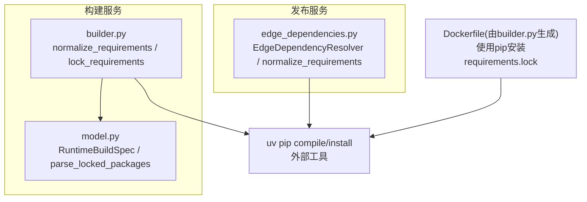
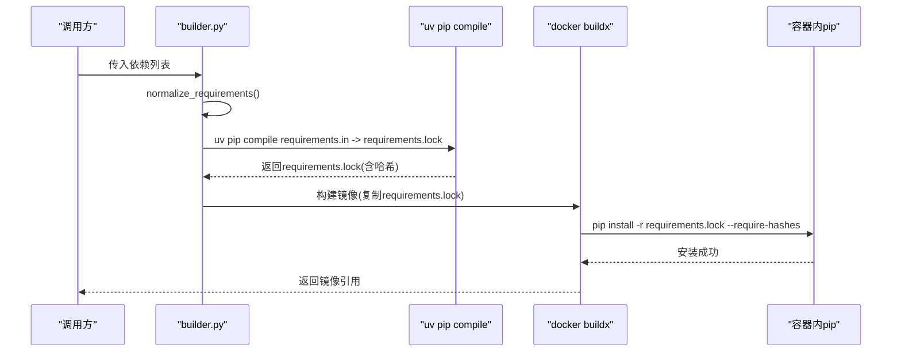
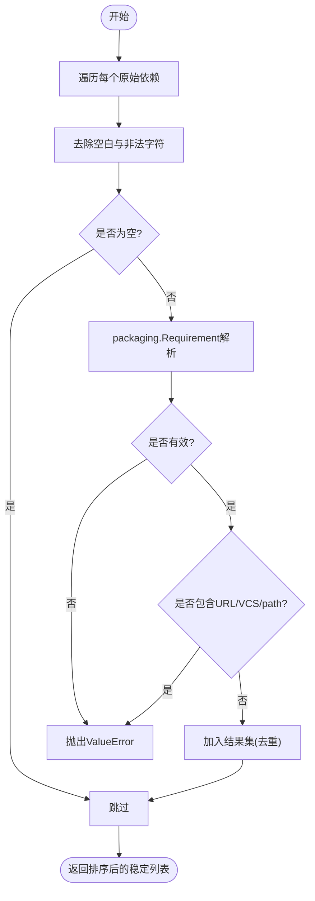
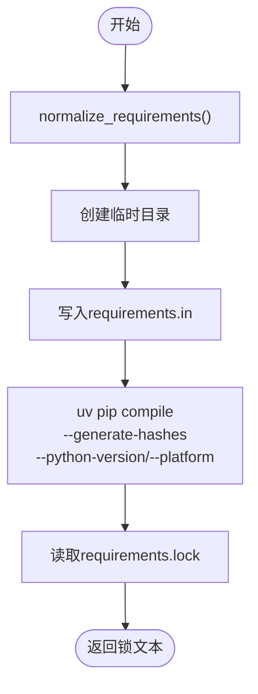
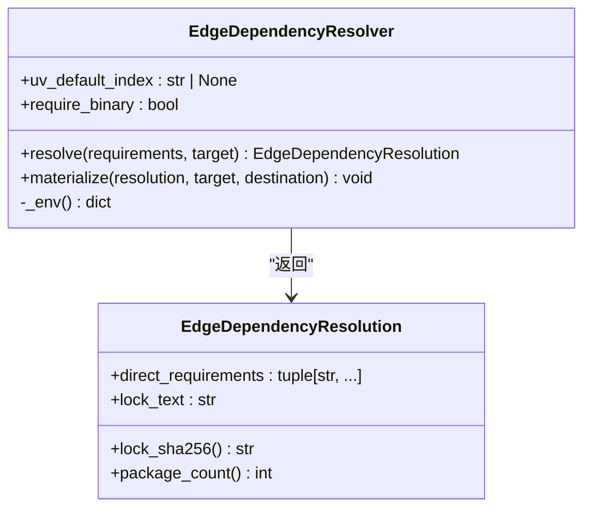
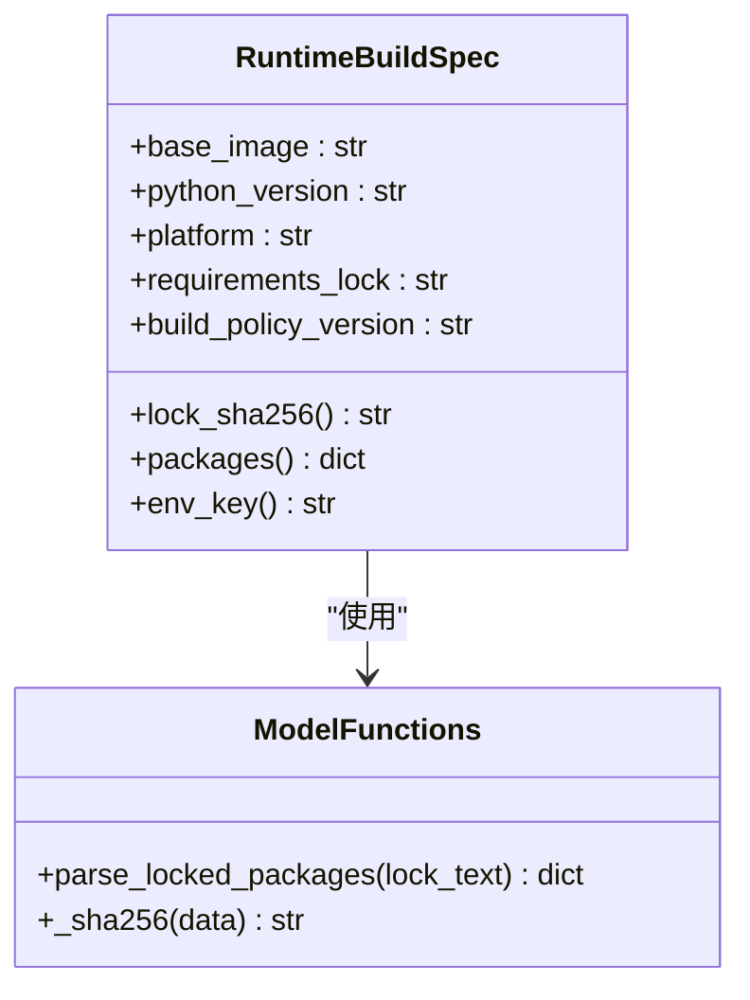
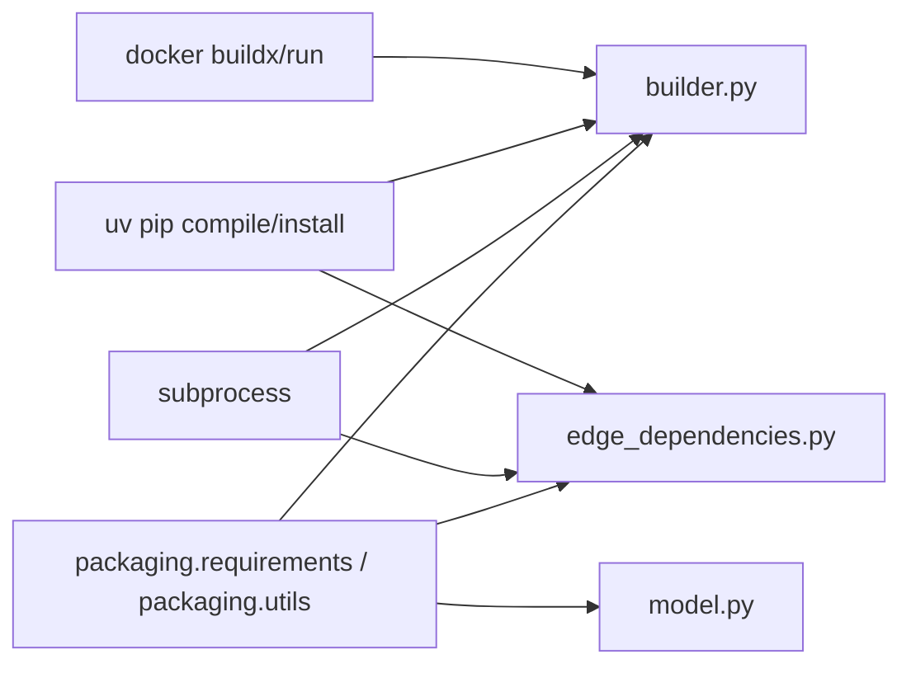

# Python依赖解析

<cite>
**本文引用的文件**   
- [build_service/builder.py](file://build_service/builder.py)
- [publish_service/edge_dependencies.py](file://publish_service/edge_dependencies.py)
- [build_service/model.py](file://build_service/model.py)
- [images/requirements.lock](file://images/requirements.lock)
</cite>

## 目录
1. [简介](#简介)
2. [项目结构](#项目结构)
3. [核心组件](#核心组件)
4. [架构总览](#架构总览)
5. [详细组件分析](#详细组件分析)
6. [依赖关系分析](#依赖关系分析)
7. [性能考虑](#性能考虑)
8. [故障排查指南](#故障排查指南)
9. [结论](#结论)

## 简介
本技术文档聚焦于Python依赖解析在仓库中的实现，重点解释以下能力：
- 依赖声明的标准化与校验：normalize_requirements函数如何规范化、去重、排序并拒绝不安全或不受支持的依赖形式。
- 依赖锁定流程：lock_requirements函数如何通过uv工具生成requirements.in与requirements.lock，以及哈希与安全策略。
- 冲突解决策略：通过严格版本锁定与重复项检测避免依赖冲突。
- 安全检查机制：禁止URL/VCS/path依赖、强制哈希校验、平台与Python版本约束。
- 示例与最佳实践：展示如何处理版本约束、平台特定依赖、二进制优先安装等场景。
- 性能优化技巧：临时目录隔离、最小化子进程参数、哈希校验与缓存键设计。

## 项目结构
本项目中与Python依赖解析相关的代码主要分布在两个服务模块中：
- build_service：负责运行时镜像构建与依赖锁定，提供normalize_requirements与lock_requirements。
- publish_service：面向边缘原生发布场景，提供EdgeDependencyResolver及配套的normalize_requirements。

图表来源
- [build_service/builder.py:62-119](file://build_service/builder.py#L62-L119)
- [build_service/model.py:17-37](file://build_service/model.py#L17-L37)
- [publish_service/edge_dependencies.py:47-136](file://publish_service/edge_dependencies.py#L47-L136)

章节来源
- [build_service/builder.py:1-205](file://build_service/builder.py#L1-L205)
- [publish_service/edge_dependencies.py:1-182](file://publish_service/edge_dependencies.py#L1-L182)
- [build_service/model.py:1-71](file://build_service/model.py#L1-L71)

## 核心组件
- normalize_requirements（构建服务）：对输入依赖进行清洗、语法校验、URL/VCS/path拒绝、标准化字符串输出，并按不区分大小写顺序返回稳定列表。
- lock_requirements（构建服务）：调用uv pip compile将requirements.in编译为requirements.lock，启用哈希生成与平台/Python版本约束。
- EdgeDependencyResolver（发布服务）：面向边缘原生目标平台的依赖解析与物化，支持--no-build以仅获取预编译包。
- RuntimeBuildSpec（构建服务模型）：封装基础镜像、Python版本、平台、锁文本，并提供packages解析与环境键计算。

章节来源
- [build_service/builder.py:62-119](file://build_service/builder.py#L62-L119)
- [publish_service/edge_dependencies.py:47-136](file://publish_service/edge_dependencies.py#L47-L136)
- [build_service/model.py:40-70](file://build_service/model.py#L40-L70)

## 架构总览
依赖解析的整体流程如下：
1. 输入依赖声明经过normalize_requirements标准化与校验。
2. 将标准化后的依赖写入临时requirements.in。
3. 调用uv pip compile生成requirements.lock，同时生成哈希值。
4. 在构建镜像时，使用pip -r requirements.lock安装依赖，确保可复现与安全。
5. 对于边缘原生发布，EdgeDependencyResolver进一步支持--no-build与目标平台安装。

图表来源
- [build_service/builder.py:62-119](file://build_service/builder.py#L62-L119)
- [build_service/builder.py:122-158](file://build_service/builder.py#L122-L158)

## 详细组件分析

### normalize_requirements（构建服务）
职责与行为：
- 去除空白行与非法字符（换行符、回车符）。
- 拒绝以“-”开头的选项行。
- 使用packaging.requirements.Requirement进行语法校验。
- 拒绝URL/VCS/path依赖，仅允许PyPI上的包名与版本约束。
- 标准化为字符串集合，去重后按不区分大小写排序，保证稳定性。

复杂度分析：
- 时间复杂度：O(n log n)，n为依赖数量，主要开销在排序。
- 空间复杂度：O(n)，存储标准化后的依赖集合。

错误处理：
- 遇到无效依赖或受限制类型时抛出ValueError，便于上层捕获并提示。

图表来源
- [build_service/builder.py:62-81](file://build_service/builder.py#L62-L81)

章节来源
- [build_service/builder.py:62-81](file://build_service/builder.py#L62-L81)

### lock_requirements（构建服务）
职责与行为：
- 调用normalize_requirements标准化依赖。
- 在临时目录创建requirements.in与requirements.lock。
- 执行uv pip compile，启用--generate-hashes、--no-header、--no-annotate，并指定--python-version与--python-platform。
- 可选通过环境变量UV_DEFAULT_INDEX设置默认索引源。
- 返回requirements.lock文本内容。

安全与一致性：
- 通过哈希生成确保安装时的完整性校验。
- 固定Python版本与平台，避免跨平台不一致导致的依赖差异。

图表来源
- [build_service/builder.py:84-119](file://build_service/builder.py#L84-L119)

章节来源
- [build_service/builder.py:84-119](file://build_service/builder.py#L84-L119)

### EdgeDependencyResolver（发布服务）
职责与行为：
- 针对NativeTargetPlatform进行依赖解析与物化。
- resolve方法：标准化依赖，生成requirements.in，调用uv pip compile生成requirements.lock，支持--no-build以仅获取预编译包。
- materialize方法：基于requirements.lock与目标平台安装依赖到指定目录，同样支持--no-build。

错误处理：
- 当uv命令失败时抛出EdgeDependencyResolutionError，附带stderr/stdout以便诊断。

图表来源
- [publish_service/edge_dependencies.py:27-44](file://publish_service/edge_dependencies.py#L27-L44)
- [publish_service/edge_dependencies.py:70-136](file://publish_service/edge_dependencies.py#L70-L136)

章节来源
- [publish_service/edge_dependencies.py:47-182](file://publish_service/edge_dependencies.py#L47-L182)

### RuntimeBuildSpec与锁解析（构建服务模型）
职责与行为：
- RuntimeBuildSpec封装基础镜像、Python版本、平台、锁文本与构建策略版本。
- parse_locked_packages解析requirements.lock，要求每行均为精确版本锁定（==），并检测重复包的版本冲突。
- env_key基于基础镜像、Python版本、平台、锁SHA256与策略版本计算环境标识，用于缓存与去重。

图表来源
- [build_service/model.py:17-37](file://build_service/model.py#L17-L37)
- [build_service/model.py:40-70](file://build_service/model.py#L40-L70)

章节来源
- [build_service/model.py:17-70](file://build_service/model.py#L17-L70)

## 依赖关系分析
- builder.py依赖packaging.requirements进行依赖语法校验，并通过subprocess调用uv与docker。
- edge_dependencies.py同样依赖packaging.requirements与subprocess调用uv。
- model.py依赖packaging.utils进行包名规范化，并使用正则表达式解析锁文件。

图表来源
- [build_service/builder.py:1-12](file://build_service/builder.py#L1-L12)
- [publish_service/edge_dependencies.py:1-14](file://publish_service/edge_dependencies.py#L1-L14)
- [build_service/model.py:1-8](file://build_service/model.py#L1-L8)

章节来源
- [build_service/builder.py:1-205](file://build_service/builder.py#L1-L205)
- [publish_service/edge_dependencies.py:1-182](file://publish_service/edge_dependencies.py#L1-L182)
- [build_service/model.py:1-71](file://build_service/model.py#L1-L71)

## 性能考虑
- 临时目录隔离：每次解析与构建均在临时目录中进行，避免污染宿主环境与提高并发安全性。
- 最小化子进程参数：仅传递必要的uv与docker参数，减少解析与构建开销。
- 哈希生成与校验：通过--generate-hashes与--require-hashes确保安装过程快速且一致，避免网络重试与不可信包。
- 环境键与缓存：RuntimeBuildSpec.env_key结合基础镜像、Python版本、平台与锁SHA256，有助于上层服务进行缓存与去重。
- 二进制优先：EdgeDependencyResolver支持--no-build，仅在需要时构建源码包，提升边缘部署效率。

[本节为通用指导，不涉及具体文件分析]

## 故障排查指南
常见问题与定位建议：
- 无效依赖声明：normalize_requirements会抛出ValueError，检查依赖字符串是否符合PEP 508规范，避免换行符、回车符与“-”开头选项。
- URL/VCS/path依赖被拒：确认依赖来自可信PyPI索引，不使用本地路径或VCS链接。
- uv解析失败：查看EdgeDependencyResolutionError的stderr/stdout，检查Python版本与平台参数是否与目标一致。
- 锁文件冲突：parse_locked_packages检测到同一包存在多个版本时会抛出ValueError，需统一版本约束。
- 镜像构建失败：检查docker buildx命令与RUNTIME_DOCKERFILE中的pip安装步骤，确认requirements.lock已正确复制与权限设置。

章节来源
- [build_service/builder.py:62-119](file://build_service/builder.py#L62-L119)
- [publish_service/edge_dependencies.py:116-131](file://publish_service/edge_dependencies.py#L116-L131)
- [build_service/model.py:17-37](file://build_service/model.py#L17-L37)

## 结论
本项目通过严格的依赖标准化、哈希锁定与平台/Python版本约束，实现了安全、可复现的Python依赖解析与构建流程。构建服务与发布服务分别针对不同场景提供了适配的实现：构建服务侧重镜像构建与运行时依赖锁定，发布服务侧重边缘原生目标的依赖解析与物化。建议在工程实践中遵循以下最佳实践：
- 始终使用normalize_requirements对依赖进行标准化与校验。
- 使用lock_requirements生成requirements.lock，并在构建镜像时通过pip -r安装。
- 在边缘场景中启用--no-build以减少构建时间与依赖体积。
- 通过RuntimeBuildSpec.env_key进行缓存与去重，提升整体构建效率。
- 定期审查requirements.lock，确保无冲突与最新的安全补丁。

[本节为总结性内容，不涉及具体文件分析]