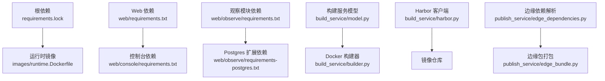
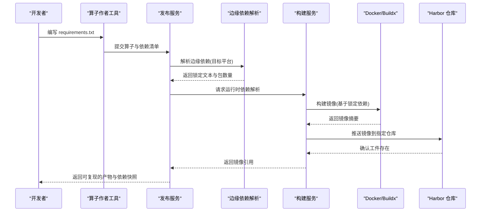
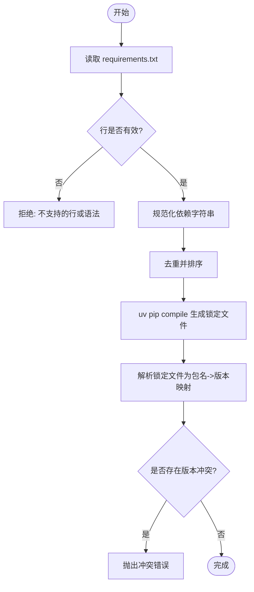
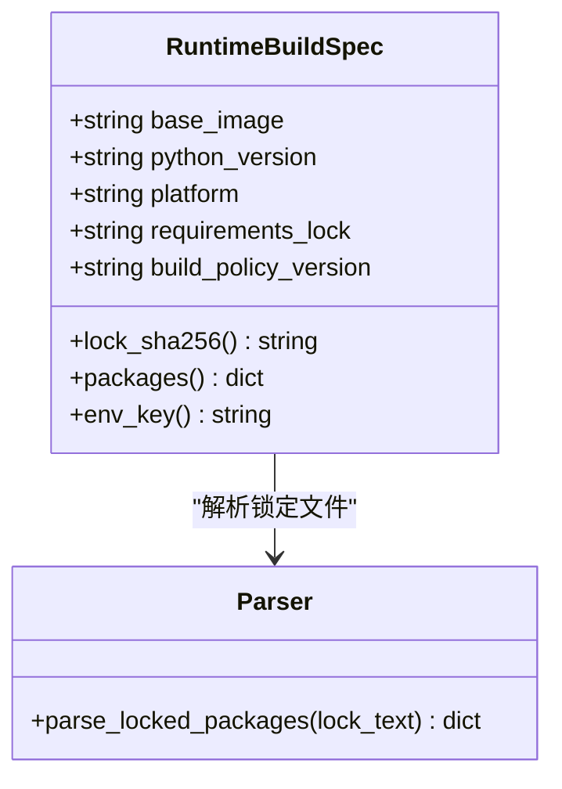
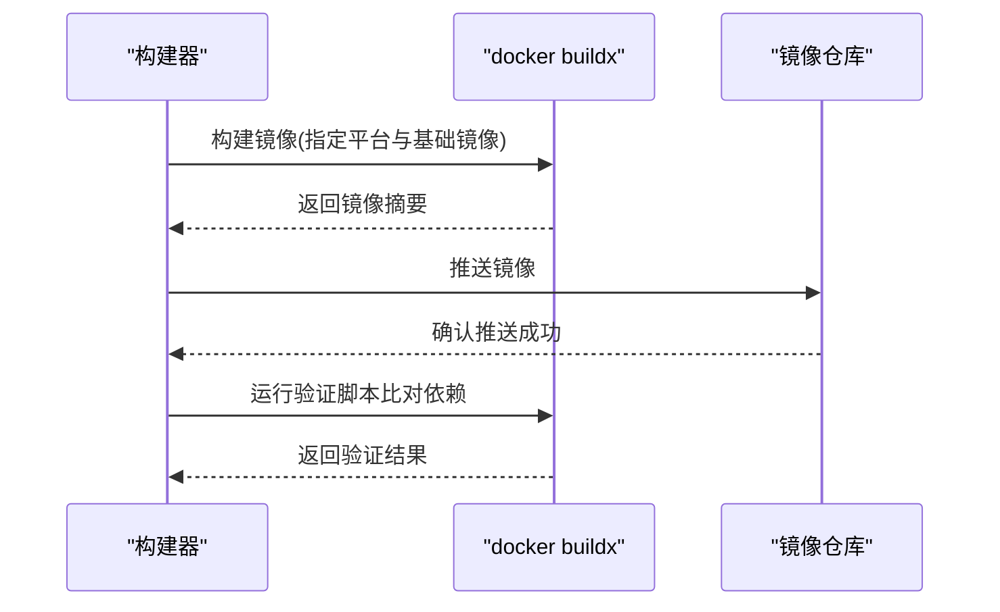
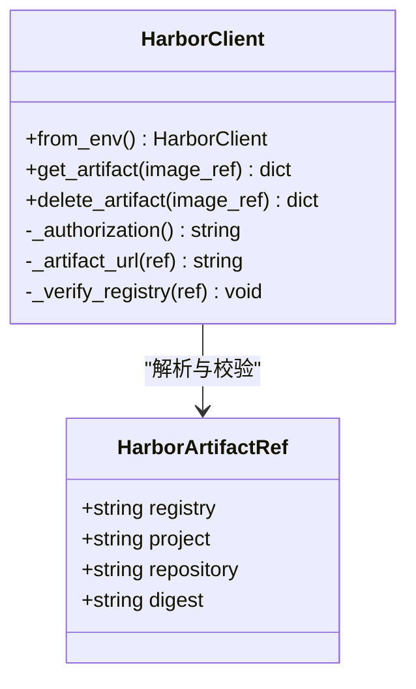
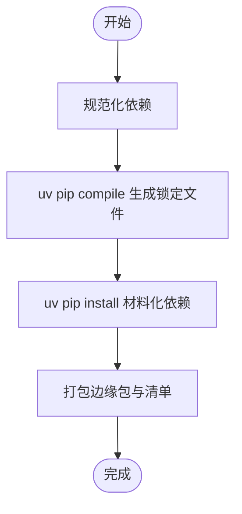
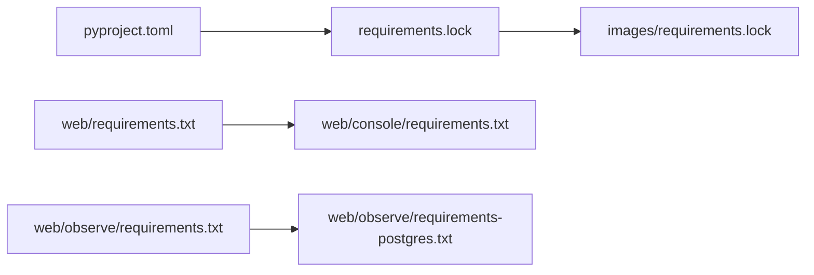

# 依赖管理

<cite>
**本文引用的文件**   
- [pyproject.toml](file://pyproject.toml)
- [requirements.lock](file://requirements.lock)
- [images/requirements.lock](file://images/requirements.lock)
- [web/requirements.txt](file://web/requirements.txt)
- [web/console/requirements.txt](file://web/console/requirements.txt)
- [web/observe/requirements.txt](file://web/observe/requirements.txt)
- [web/observe/requirements-postgres.txt](file://web/observe/requirements-postgres.txt)
- [build_service/model.py](file://build_service/model.py)
- [build_service/builder.py](file://build_service/builder.py)
- [build_service/harbor.py](file://build_service/harbor.py)
- [publish_service/build_client.py](file://publish_service/build_client.py)
- [publish_service/edge_dependencies.py](file://publish_service/edge_dependencies.py)
- [operator_authoring/snapshot.py](file://operator_authoring/snapshot.py)
- [images/runner.Dockerfile](file://images/runner.Dockerfile)
- [images/runtime.Dockerfile](file://images/runtime.Dockerfile)
</cite>

## 目录
1. [引言](#引言)
2. [项目结构](#项目结构)
3. [核心组件](#核心组件)
4. [架构总览](#架构总览)
5. [详细组件分析](#详细组件分析)
6. [依赖关系分析](#依赖关系分析)
7. [性能与优化](#性能与优化)
8. [故障排查指南](#故障排查指南)
9. [结论](#结论)

## 引言
本文件面向依赖管理，覆盖以下主题：
- Python 依赖解析机制与 requirements.txt 分析
- 依赖冲突检测与版本锁定策略
- Docker 镜像构建中的依赖处理流程
- Harbor 镜像仓库集成与使用方式
- 边缘依赖（本地与远程）管理机制
- 依赖版本锁定与安全校验最佳实践
- 依赖优化技巧、性能调优建议
- 第三方库兼容性问题的处理方法

## 项目结构
本项目在多个位置维护依赖定义与锁定文件：
- 根级与 images 子目录分别维护运行时依赖锁定文件
- web 子应用各自维护 requirements.txt，并通过 include 组合依赖
- build_service 提供构建服务模型、Docker 构建与 Harbor 集成
- publish_service 提供边缘依赖解析与打包逻辑
- operator_authoring 负责读取并校验 requirements.txt

**图表来源**
- [requirements.lock:1-11](file://requirements.lock#L1-L11)
- [images/runtime.Dockerfile:21-65](file://images/runtime.Dockerfile#L21-L65)
- [web/requirements.txt:1-4](file://web/requirements.txt#L1-L4)
- [web/console/requirements.txt:1-3](file://web/console/requirements.txt#L1-L3)
- [web/observe/requirements.txt:1-5](file://web/observe/requirements.txt#L1-L5)
- [web/observe/requirements-postgres.txt:1-3](file://web/observe/requirements-postgres.txt#L1-L3)
- [build_service/model.py:17-70](file://build_service/model.py#L17-L70)
- [build_service/builder.py:137-180](file://build_service/builder.py#L137-L180)
- [build_service/harbor.py:57-195](file://build_service/harbor.py#L57-L195)
- [publish_service/edge_dependencies.py:70-181](file://publish_service/edge_dependencies.py#L70-L181)

**章节来源**
- [requirements.lock:1-11](file://requirements.lock#L1-L11)
- [images/requirements.lock:1-11](file://images/requirements.lock#L1-L11)
- [web/requirements.txt:1-4](file://web/requirements.txt#L1-L4)
- [web/console/requirements.txt:1-3](file://web/console/requirements.txt#L1-L3)
- [web/observe/requirements.txt:1-5](file://web/observe/requirements.txt#L1-L5)
- [web/observe/requirements-postgres.txt:1-3](file://web/observe/requirements-postgres.txt#L1-L3)

## 核心组件
- 依赖声明与锁定
  - pyproject.toml 定义项目元数据、可选依赖与脚本入口
  - requirements.lock 由 uv pip compile 生成，用于锁定精确版本
- 构建服务
  - model.py 解析锁定文件、计算环境标识
  - builder.py 调用 docker buildx 构建镜像并推送到仓库
  - harbor.py 提供 Harbor v2 API 客户端，支持鉴权、工件查询与删除
- 发布服务
  - edge_dependencies.py 通过 uv 进行边缘依赖解析与材料化
  - build_client.py 调用构建服务的依赖解析接口
- 算子作者工具
  - snapshot.py 读取并校验 requirements.txt，拒绝不支持的语法

**章节来源**
- [pyproject.toml:1-37](file://pyproject.toml#L1-L37)
- [build_service/model.py:17-70](file://build_service/model.py#L17-L70)
- [build_service/builder.py:137-180](file://build_service/builder.py#L137-L180)
- [build_service/harbor.py:57-195](file://build_service/harbor.py#L57-L195)
- [publish_service/edge_dependencies.py:70-181](file://publish_service/edge_dependencies.py#L70-L181)
- [publish_service/build_client.py:1-30](file://publish_service/build_client.py#L1-L30)
- [operator_authoring/snapshot.py:50-71](file://operator_authoring/snapshot.py#L50-L71)

## 架构总览
依赖管理贯穿“声明—解析—锁定—构建—验证—分发”全链路。

**图表来源**
- [operator_authoring/snapshot.py:50-71](file://operator_authoring/snapshot.py#L50-L71)
- [publish_service/edge_dependencies.py:86-136](file://publish_service/edge_dependencies.py#L86-L136)
- [publish_service/build_client.py:18-30](file://publish_service/build_client.py#L18-L30)
- [build_service/builder.py:137-158](file://build_service/builder.py#L137-L158)
- [build_service/harbor.py:162-195](file://build_service/harbor.py#L162-L195)

## 详细组件分析

### Python 依赖解析与 requirements.txt 分析
- requirements.txt 解析规则
  - 忽略空行与注释
  - 不支持行续写、pip 选项与 include 指令
  - 自动去除行内注释
- 边缘依赖规范化
  - 拒绝 URL/VCS/path 依赖
  - 标准化依赖字符串并去重排序
- 锁定文件解析
  - 仅接受精确版本 pin
  - 检测重复包名但不同版本的冲突

**图表来源**
- [operator_authoring/snapshot.py:50-71](file://operator_authoring/snapshot.py#L50-L71)
- [publish_service/edge_dependencies.py:47-67](file://publish_service/edge_dependencies.py#L47-L67)
- [build_service/model.py:17-37](file://build_service/model.py#L17-L37)

**章节来源**
- [operator_authoring/snapshot.py:50-71](file://operator_authoring/snapshot.py#L50-L71)
- [publish_service/edge_dependencies.py:47-67](file://publish_service/edge_dependencies.py#L47-L67)
- [build_service/model.py:17-37](file://build_service/model.py#L17-L37)

### 依赖冲突解决与版本锁定
- 锁定文件约束
  - 仅允许形如 name==version 的行
  - 同一包名出现不同版本时直接报错
- 环境标识
  - 将基础镜像、Python 版本、平台、锁定文件摘要、构建策略版本等组合哈希，作为唯一环境键
- 最佳实践
  - 始终使用 uv pip compile 生成锁定文件
  - 在 CI 中校验锁定文件未变更且无冲突
  - 对基础镜像使用 digest 引用，避免标签漂移

**图表来源**
- [build_service/model.py:40-70](file://build_service/model.py#L40-L70)
- [build_service/model.py:17-37](file://build_service/model.py#L17-L37)

**章节来源**
- [build_service/model.py:17-70](file://build_service/model.py#L17-L70)

### Docker 镜像构建过程中的依赖处理
- 多阶段构建
  - 第一阶段安装用户依赖到 /opt/python-deps
  - 第二阶段从干净基础镜像复制依赖目录，设置 RUNNER_DEPENDENCY_ROOT
  - 安全隔离：可信 Agent 不依赖用户依赖 PYTHONPATH
- 构建参数
  - RUNNER_BASE 传入基础镜像
  - 使用 --platform 指定目标平台
  - 使用 metadata-file 获取镜像摘要
- 镜像验证
  - 启动容器执行检查脚本，对比期望包列表与实际已安装包

**图表来源**
- [build_service/builder.py:137-180](file://build_service/builder.py#L137-L180)
- [images/runtime.Dockerfile:21-65](file://images/runtime.Dockerfile#L21-L65)

**章节来源**
- [build_service/builder.py:137-180](file://build_service/builder.py#L137-L180)
- [images/runtime.Dockerfile:21-65](file://images/runtime.Dockerfile#L21-L65)

### Harbor 镜像仓库集成与使用
- 客户端能力
  - 解析镜像引用，要求包含 sha256 摘要
  - 基本认证与可选 CA 证书配置
  - 查询工件、删除工件
  - 校验镜像仓库域名与预期一致
- 环境变量
  - BUILD_HARBOR_URL、BUILD_HARBOR_USERNAME、BUILD_HARBOR_PASSWORD
  - BUILD_HARBOR_REGISTRY、BUILD_HARBOR_CA_FILE、BUILD_HARBOR_INSECURE

**图表来源**
- [build_service/harbor.py:21-54](file://build_service/harbor.py#L21-L54)
- [build_service/harbor.py:57-195](file://build_service/harbor.py#L57-L195)

**章节来源**
- [build_service/harbor.py:21-54](file://build_service/harbor.py#L21-L54)
- [build_service/harbor.py:57-195](file://build_service/harbor.py#L57-L195)

### 边缘依赖处理机制（本地与远程）
- 解析流程
  - 规范化依赖，拒绝 URL/VCS/path
  - 使用 uv pip compile 针对目标平台生成锁定文件
  - 可选择 --no-build 仅拉取预编译二进制
- 材料化流程
  - 根据锁定文件与目标平台安装依赖到指定目录
  - 生成边缘包清单，包含处理器工件与依赖锁摘要
- 远程依赖
  - 通过 UV_DEFAULT_INDEX 指向私有索引源
  - 结合构建服务统一解析与缓存

**图表来源**
- [publish_service/edge_dependencies.py:86-181](file://publish_service/edge_dependencies.py#L86-L181)
- [publish_service/edge_bundle.py:46-131](file://publish_service/edge_bundle.py#L46-L131)

**章节来源**
- [publish_service/edge_dependencies.py:86-181](file://publish_service/edge_dependencies.py#L86-L181)
- [publish_service/edge_bundle.py:46-131](file://publish_service/edge_bundle.py#L46-L131)

### 依赖版本锁定与安全校验最佳实践
- 锁定文件
  - 使用 uv pip compile 生成并纳入版本控制
  - 禁止手动编辑锁定文件
- 安全校验
  - 启用 --generate-hashes 与 --require-hashes
  - 在构建与部署阶段校验哈希一致性
- 基础镜像
  - 使用 digest 引用而非标签
  - 固定 Python 版本与平台
- 依赖来源
  - 使用受信任的内部 PyPI 镜像
  - 限制网络访问与仅允许白名单包

**章节来源**
- [images/runtime.Dockerfile:34-40](file://images/runtime.Dockerfile#L34-L40)
- [publish_service/edge_dependencies.py:103-114](file://publish_service/edge_dependencies.py#L103-L114)
- [publish_service/edge_dependencies.py:154-164](file://publish_service/edge_dependencies.py#L154-L164)

### 依赖优化技巧与性能调优建议
- 减少构建时间
  - 使用 --no-build 仅安装预编译包
  - 利用构建缓存与分层优化
- 缩小镜像体积
  - 多阶段构建，仅复制最终依赖目录
  - 清理构建缓存与临时文件
- 提升稳定性
  - 锁定所有传递依赖
  - 在 CI 中并行运行依赖解析与构建

**章节来源**
- [images/runtime.Dockerfile:28-40](file://images/runtime.Dockerfile#L28-L40)
- [publish_service/edge_dependencies.py:113-114](file://publish_service/edge_dependencies.py#L113-L114)

### 第三方库兼容性问题处理
- 平台差异
  - 针对不同 OS/Arch/Python 版本分别解析与打包
- ABI 与二进制兼容性
  - 优先选择预编译 wheel，避免源码编译
- 依赖范围
  - 使用最小必要依赖集，避免引入不必要的大包
- 升级策略
  - 逐步升级并回归测试
  - 使用锁定文件确保可复现

**章节来源**
- [publish_service/edge_dependencies.py:110-112](file://publish_service/edge_dependencies.py#L110-L112)
- [publish_service/edge_dependencies.py:160-162](file://publish_service/edge_dependencies.py#L160-L162)

## 依赖关系分析
- 项目依赖
  - pyproject.toml 定义了核心依赖与可选依赖组
- Web 子应用依赖
  - web/requirements.txt 定义 Web 框架与 HTTP 客户端
  - web/console/requirements.txt 通过 include 组合其他依赖
  - web/observe/requirements.txt 与 Postgres 扩展依赖分离
- 运行时依赖
  - images/requirements.lock 与根 requirements.lock 保持一致，确保镜像内依赖稳定

**图表来源**
- [pyproject.toml:11-19](file://pyproject.toml#L11-L19)
- [web/requirements.txt:1-4](file://web/requirements.txt#L1-L4)
- [web/console/requirements.txt:1-3](file://web/console/requirements.txt#L1-L3)
- [web/observe/requirements.txt:1-5](file://web/observe/requirements.txt#L1-L5)
- [web/observe/requirements-postgres.txt:1-3](file://web/observe/requirements-postgres.txt#L1-L3)
- [requirements.lock:1-11](file://requirements.lock#L1-L11)
- [images/requirements.lock:1-11](file://images/requirements.lock#L1-L11)

**章节来源**
- [pyproject.toml:11-19](file://pyproject.toml#L11-L19)
- [web/requirements.txt:1-4](file://web/requirements.txt#L1-L4)
- [web/console/requirements.txt:1-3](file://web/console/requirements.txt#L1-L3)
- [web/observe/requirements.txt:1-5](file://web/observe/requirements.txt#L1-L5)
- [web/observe/requirements-postgres.txt:1-3](file://web/observe/requirements-postgres.txt#L1-L3)
- [requirements.lock:1-11](file://requirements.lock#L1-L11)
- [images/requirements.lock:1-11](file://images/requirements.lock#L1-L11)

## 性能与优化
- 构建加速
  - 使用构建缓存与并行任务
  - 仅在必要时触发完整重建
- 依赖下载优化
  - 使用内部镜像源与缓存
  - 启用只读依赖目录以减少写入开销
- 资源隔离
  - 在容器中限制 CPU/内存
  - 避免共享宿主机的 Python 环境

[本节为通用指导，不涉及具体文件分析]

## 故障排查指南
- 依赖解析失败
  - 检查 requirements.txt 是否包含不支持的语法
  - 确认 uv 可用且网络可达
- 锁定文件冲突
  - 检查是否有重复包名但不同版本
  - 重新运行 uv pip compile 生成新锁定文件
- 镜像构建失败
  - 检查基础镜像 digest 是否正确
  - 查看构建日志与平台参数
- Harbor 操作失败
  - 检查环境变量与证书配置
  - 确认镜像引用格式与权限

**章节来源**
- [operator_authoring/snapshot.py:50-71](file://operator_authoring/snapshot.py#L50-L71)
- [build_service/model.py:17-37](file://build_service/model.py#L17-L37)
- [build_service/builder.py:137-158](file://build_service/builder.py#L137-L158)
- [build_service/harbor.py:87-109](file://build_service/harbor.py#L87-L109)

## 结论
本项目通过严格的依赖声明、锁定与多阶段构建，实现了可复现、安全的依赖管理。结合 Harbor 与边缘依赖解析，覆盖了从开发到部署的全链路需求。遵循本文的最佳实践与优化建议，可进一步提升构建效率与系统稳定性。

[本节为总结性内容，不涉及具体文件分析]