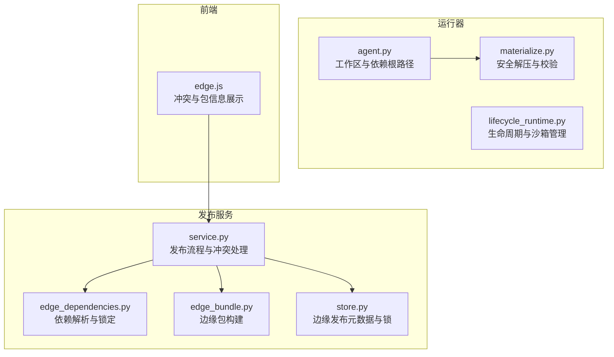
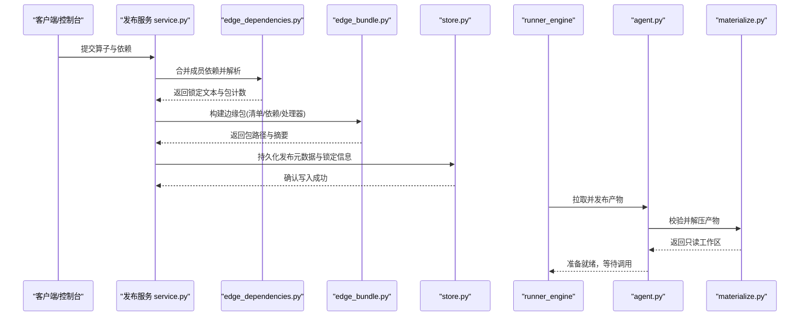
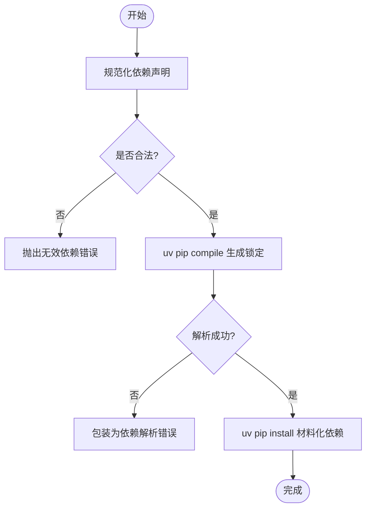
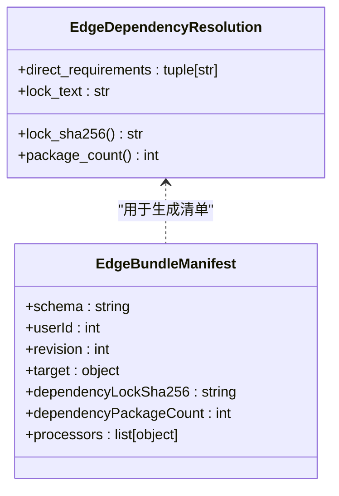
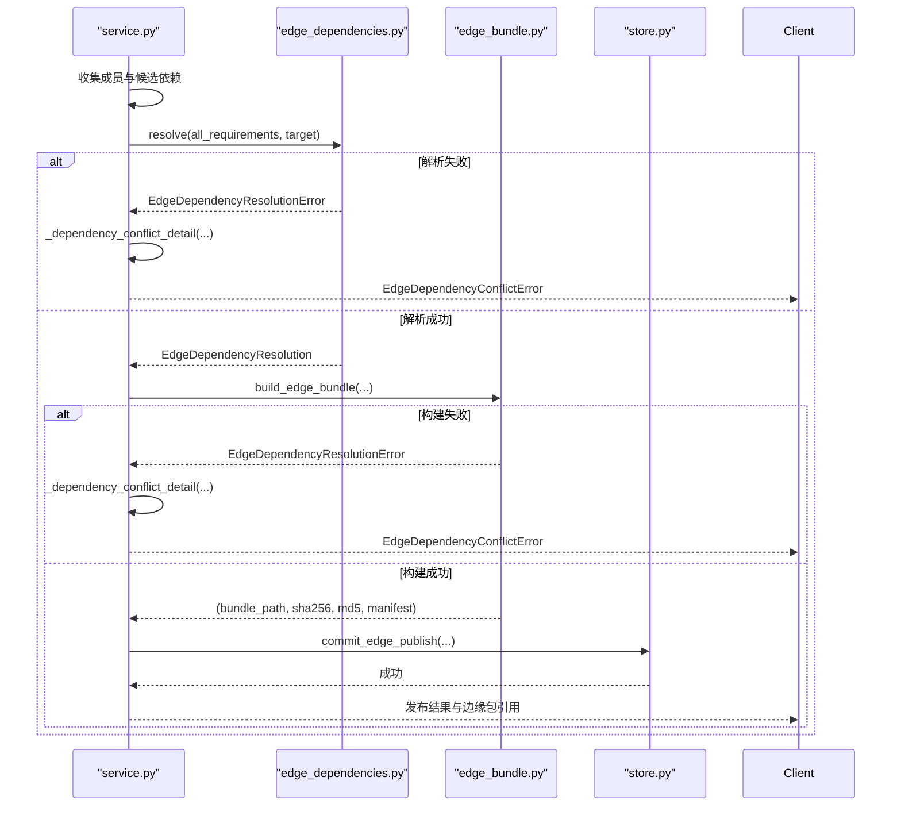
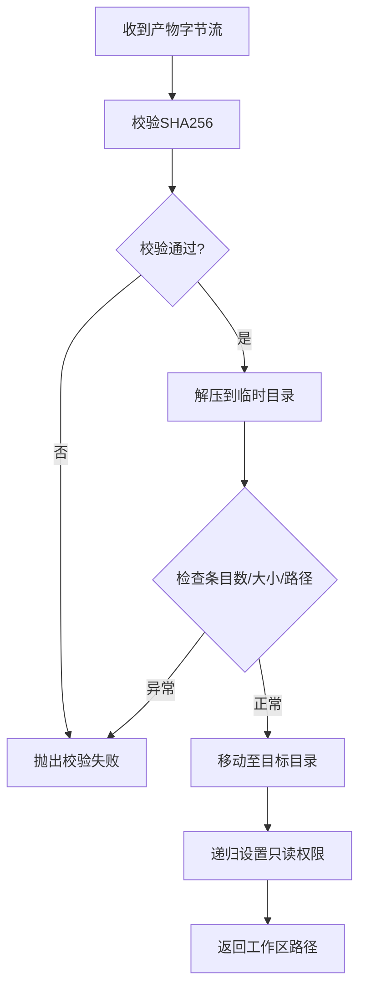
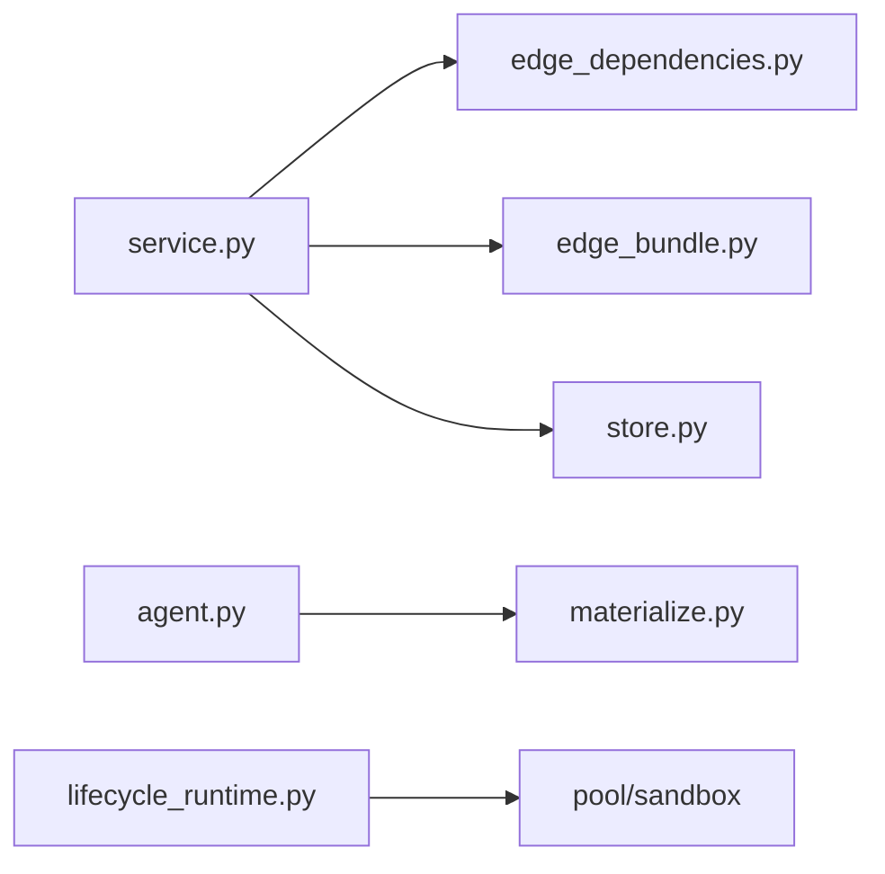

# 边缘依赖管理

<cite>
**本文引用的文件**   
- [publish_service/edge_dependencies.py](file://publish_service/edge_dependencies.py)
- [publish_service/edge_bundle.py](file://publish_service/edge_bundle.py)
- [publish_service/service.py](file://publish_service/service.py)
- [publish_service/store.py](file://publish_service/store.py)
- [runner_engine/worker/materialize.py](file://runner_engine/worker/materialize.py)
- [runner_engine/worker/agent.py](file://runner_engine/worker/agent.py)
- [runner_engine/lifecycle_runtime.py](file://runner_engine/lifecycle_runtime.py)
- [web/app/static/edge.js](file://web/app/static/edge.js)
</cite>

## 目录
1. [引言](#引言)
2. [项目结构](#项目结构)
3. [核心组件](#核心组件)
4. [架构总览](#架构总览)
5. [详细组件分析](#详细组件分析)
6. [依赖关系分析](#依赖关系分析)
7. [性能与优化](#性能与优化)
8. [故障排查指南](#故障排查指南)
9. [结论](#结论)

## 引言
本技术文档聚焦于“边缘依赖管理”，面向在资源受限、网络不稳定或完全离线的边缘环境中部署 Python 算子（NiFi Native）的场景。该系统的核心目标是：
- 将本地依赖与远程依赖统一为可复现的锁定环境；
- 按目标平台打包共享依赖层与处理器构件，形成原子化的边缘包；
- 在边缘侧安全安装、预加载并复用依赖，减少运行时下载和编译成本；
- 检测并提示依赖冲突，提供可操作的解决路径；
- 给出离线部署、依赖预加载、冲突诊断与性能调优的实践建议。

## 项目结构
与边缘依赖管理直接相关的代码主要分布在以下模块：
- 发布服务侧负责依赖解析、冲突检测、边缘包构建与持久化；
- 运行器侧负责边缘包的安全解压、工作区隔离与执行；
- 前端用于展示依赖冲突详情与边缘包状态。

**图表来源**
- [publish_service/edge_dependencies.py:70-182](file://publish_service/edge_dependencies.py#L70-L182)
- [publish_service/edge_bundle.py:46-131](file://publish_service/edge_bundle.py#L46-L131)
- [publish_service/service.py:786-977](file://publish_service/service.py#L786-L977)
- [publish_service/store.py:372-472](file://publish_service/store.py#L372-L472)
- [runner_engine/worker/materialize.py:11-122](file://runner_engine/worker/materialize.py#L11-L122)
- [runner_engine/worker/agent.py:309-368](file://runner_engine/worker/agent.py#L309-L368)
- [runner_engine/lifecycle_runtime.py:187-397](file://runner_engine/lifecycle_runtime.py#L187-L397)
- [web/app/static/edge.js:219-259](file://web/app/static/edge.js#L219-L259)

**章节来源**
- [publish_service/edge_dependencies.py:1-182](file://publish_service/edge_dependencies.py#L1-L182)
- [publish_service/edge_bundle.py:1-132](file://publish_service/edge_bundle.py#L1-L132)
- [publish_service/service.py:786-977](file://publish_service/service.py#L786-L977)
- [publish_service/store.py:372-472](file://publish_service/store.py#L372-L472)
- [runner_engine/worker/materialize.py:1-122](file://runner_engine/worker/materialize.py#L1-L122)
- [runner_engine/worker/agent.py:309-368](file://runner_engine/worker/agent.py#L309-L368)
- [runner_engine/lifecycle_runtime.py:187-397](file://runner_engine/lifecycle_runtime.py#L187-L397)
- [web/app/static/edge.js:219-259](file://web/app/static/edge.js#L219-L259)

## 核心组件
- 依赖解析与锁定：统一规范化依赖声明，调用 uv 生成带哈希的锁定文本，统计包数量并计算锁定摘要。
- 边缘包构建：聚合处理器构件与依赖层，输出包含清单、requirements.in、requirements.lock 的可分发 zip。
- 发布流程与冲突处理：合并当前用户下所有活跃算子的依赖，尝试解析共享环境；失败时包装为明确的依赖冲突错误。
- 存储与并发控制：使用数据库级 advisory lock 保证同一用户+目标平台的边缘发布串行化，避免竞态。
- 安全解压与校验：对发布产物进行 SHA256 校验、条目数与展开大小限制、路径逃逸防护，最终设为只读。
- 运行期工作区与依赖根：Agent 暴露 dependency_root 给子进程，便于离线预装依赖后复用。
- 生命周期与沙箱：Runner 生命周期控制器协调镜像退役、空闲回收与托管沙箱清理。

**章节来源**
- [publish_service/edge_dependencies.py:27-182](file://publish_service/edge_dependencies.py#L27-L182)
- [publish_service/edge_bundle.py:46-131](file://publish_service/edge_bundle.py#L46-L131)
- [publish_service/service.py:786-977](file://publish_service/service.py#L786-L977)
- [publish_service/store.py:372-472](file://publish_service/store.py#L372-L472)
- [runner_engine/worker/materialize.py:11-122](file://runner_engine/worker/materialize.py#L11-L122)
- [runner_engine/worker/agent.py:309-368](file://runner_engine/worker/agent.py#L309-L368)
- [runner_engine/lifecycle_runtime.py:187-397](file://runner_engine/lifecycle_runtime.py#L187-L397)

## 架构总览
边缘依赖管理的端到端流程如下：

**图表来源**
- [publish_service/service.py:850-977](file://publish_service/service.py#L850-L977)
- [publish_service/edge_dependencies.py:86-182](file://publish_service/edge_dependencies.py#L86-L182)
- [publish_service/edge_bundle.py:46-131](file://publish_service/edge_bundle.py#L46-L131)
- [publish_service/store.py:372-472](file://publish_service/store.py#L372-L472)
- [runner_engine/worker/agent.py:353-368](file://runner_engine/worker/agent.py#L353-L368)
- [runner_engine/worker/materialize.py:31-122](file://runner_engine/worker/materialize.py#L31-L122)

## 详细组件分析

### 依赖解析与锁定
- 输入规范化：过滤空行、拒绝换行与命令行参数式依赖、拒绝 URL/VCS/路径依赖，仅允许标准 PEP 508 依赖字符串。
- 锁定生成：通过 uv pip compile 针对目标 Python 版本与平台生成 requirements.lock，并启用哈希校验。
- 材料化：基于锁定文件将依赖安装到目标目录，支持 --no-build 以跳过编译，提升边缘环境稳定性。
- 结果封装：提供 direct_requirements、lock_text、lock_sha256、package_count 等字段，便于后续打包与审计。

**图表来源**
- [publish_service/edge_dependencies.py:47-67](file://publish_service/edge_dependencies.py#L47-L67)
- [publish_service/edge_dependencies.py:86-136](file://publish_service/edge_dependencies.py#L86-L136)
- [publish_service/edge_dependencies.py:138-182](file://publish_service/edge_dependencies.py#L138-L182)

**章节来源**
- [publish_service/edge_dependencies.py:27-182](file://publish_service/edge_dependencies.py#L27-L182)

### 边缘包构建与清单
- 构件聚合：将每个算子的原生处理器构件复制到 processors 目录，记录 operatorId、variantId、packageName、processorArtifact 与 requirements。
- 依赖层：调用 resolver.materialize 将共享依赖安装到 dependencies 目录，并写入 requirements.in 与 requirements.lock。
- 清单生成：manifest.json 包含 schema、userId、revision、target、dependencyLockSha256、dependencyPackageCount、processors 等字段。
- 包标识：基于 manifest 与锁定摘要计算 bundle_key，文件名包含目标平台、修订号与短键，确保幂等与可追溯。

**图表来源**
- [publish_service/edge_dependencies.py:27-44](file://publish_service/edge_dependencies.py#L27-L44)
- [publish_service/edge_bundle.py:99-113](file://publish_service/edge_bundle.py#L99-L113)

**章节来源**
- [publish_service/edge_bundle.py:46-131](file://publish_service/edge_bundle.py#L46-L131)

### 发布流程与依赖冲突检测
- 成员合并：查询当前用户下已发布的同目标平台算子，合并其 requirements 作为候选环境成员。
- 解析与构建：先尝试解析共享依赖环境，再构建边缘包；任一阶段失败均包装为 EdgeDependencyConflictError。
- 冲突详情：_dependency_conflict_detail 返回目标平台、候选算子依赖、已有成员列表与底层解析错误，便于前端展示与定位。
- 持久化：commit_edge_publish 记录 bundle_id、artifact_ref、artifact_sha256、requirements_lock、lock_sha256、members 等关键信息。

**图表来源**
- [publish_service/service.py:850-977](file://publish_service/service.py#L850-L977)
- [publish_service/edge_dependencies.py:86-182](file://publish_service/edge_dependencies.py#L86-L182)
- [publish_service/edge_bundle.py:46-131](file://publish_service/edge_bundle.py#L46-L131)

**章节来源**
- [publish_service/service.py:786-977](file://publish_service/service.py#L786-L977)

### 存储与并发控制
- 边缘发布锁：使用 PostgreSQL advisory lock 对 key edge-native:{user_id}:{os}:{arch}:{python_version} 加锁，保证同一用户+目标平台的发布串行化。
- 列表与查询：提供 list_edge_deployments、list_edge_bundles、get_edge_bundle 等方法，用于前端展示与运维审计。
- 修订号：next_edge_bundle_revision 确保同一用户+目标平台的边缘包修订号单调递增。

**章节来源**
- [publish_service/store.py:372-472](file://publish_service/store.py#L372-L472)

### 运行器侧安全解压与工作区
- ReleaseMaterializer：校验 artifact SHA256，限制条目数与展开大小，禁止符号链接、设备节点、FIFO 与绝对路径，防止路径逃逸；解压完成后递归设置只读权限。
- AgentState：维护 releases_root 与 dependency_root，bootstrap 时安装 release 并缓存 manifest；run 时将 dependency_root 传递给子进程，供离线依赖复用。
- 生命周期控制器：协调镜像退役、空闲回收与托管沙箱清理，保障边缘环境稳定。

**图表来源**
- [runner_engine/worker/materialize.py:31-122](file://runner_engine/worker/materialize.py#L31-L122)
- [runner_engine/worker/agent.py:353-368](file://runner_engine/worker/agent.py#L353-L368)

**章节来源**
- [runner_engine/worker/materialize.py:11-122](file://runner_engine/worker/materialize.py#L11-L122)
- [runner_engine/worker/agent.py:309-368](file://runner_engine/worker/agent.py#L309-L368)
- [runner_engine/lifecycle_runtime.py:187-397](file://runner_engine/lifecycle_runtime.py#L187-L397)

### 前端冲突展示
- 当后端返回 EDGE_DEPENDENCY_CONFLICT 时，前端渲染冲突面板，显示当前算子依赖、已有算子数量与成员列表，并提供 uv resolver 原始错误以便开发者定位。

**章节来源**
- [web/app/static/edge.js:219-259](file://web/app/static/edge.js#L219-L259)

## 依赖关系分析
- 耦合关系：
  - publish_service/service.py 依赖 edge_dependencies.py 与 edge_bundle.py，并通过 store.py 持久化发布元数据。
  - runner_engine/worker/agent.py 依赖 materialize.py 进行安全解压，并将 dependency_root 注入子进程环境。
  - lifecycle_runtime.py 与 pool/sandbox 交互，管理运行期生命周期。
- 外部依赖：
  - uv 工具链用于依赖解析与安装；
  - packaging.requirements 用于依赖字符串解析；
  - PostgreSQL advisory lock 用于并发控制。

**图表来源**
- [publish_service/service.py:850-977](file://publish_service/service.py#L850-L977)
- [publish_service/edge_dependencies.py:70-182](file://publish_service/edge_dependencies.py#L70-L182)
- [publish_service/edge_bundle.py:46-131](file://publish_service/edge_bundle.py#L46-L131)
- [publish_service/store.py:372-472](file://publish_service/store.py#L372-L472)
- [runner_engine/worker/agent.py:309-368](file://runner_engine/worker/agent.py#L309-L368)
- [runner_engine/worker/materialize.py:11-122](file://runner_engine/worker/materialize.py#L11-L122)
- [runner_engine/lifecycle_runtime.py:187-397](file://runner_engine/lifecycle_runtime.py#L187-L397)

**章节来源**
- [publish_service/service.py:850-977](file://publish_service/service.py#L850-L977)
- [publish_service/edge_dependencies.py:70-182](file://publish_service/edge_dependencies.py#L70-L182)
- [publish_service/edge_bundle.py:46-131](file://publish_service/edge_bundle.py#L46-L131)
- [publish_service/store.py:372-472](file://publish_service/store.py#L372-L472)
- [runner_engine/worker/agent.py:309-368](file://runner_engine/worker/agent.py#L309-L368)
- [runner_engine/worker/materialize.py:11-122](file://runner_engine/worker/materialize.py#L11-L122)
- [runner_engine/lifecycle_runtime.py:187-397](file://runner_engine/lifecycle_runtime.py#L187-L397)

## 性能与优化
- 离线安装与依赖预加载：
  - 在发布侧使用 uv pip compile 生成带哈希的 requirements.lock，并在边缘侧使用 uv pip install --target 将依赖安装到固定目录（如 /opt/python-deps）。
  - 在 Agent 启动时传入 dependency_root，使子进程可直接从该路径加载依赖，避免运行时下载与编译。
- 二进制优先策略：
  - 解析与材料化阶段启用 --no-build，避免在边缘环境触发编译，降低失败率与耗时。
- 包体积与解压保护：
  - ReleaseMaterializer 限制条目数与展开大小，防止恶意或异常产物导致资源耗尽。
- 并发与幂等：
  - 使用 advisory lock 串行化同一用户+目标平台的发布流程，避免重复构建与竞态；
  - 包名包含 bundle_key 前缀，相同内容不会重复落盘。
- 生命周期优化：
  - 退役镜像前检查活跃调用、空闲工作器与托管沙箱，确保无残留后再删除制品，减少磁盘占用与不一致风险。

**章节来源**
- [publish_service/edge_dependencies.py:103-164](file://publish_service/edge_dependencies.py#L103-L164)
- [runner_engine/worker/materialize.py:31-122](file://runner_engine/worker/materialize.py#L31-L122)
- [runner_engine/worker/agent.py:309-368](file://runner_engine/worker/agent.py#L309-L368)
- [runner_engine/lifecycle_runtime.py:302-359](file://runner_engine/lifecycle_runtime.py#L302-L359)

## 故障排查指南
- 依赖冲突（EDGE_DEPENDENCY_CONFLICT）：
  - 现象：发布失败，前端显示“共享依赖环境无法完成解析”。
  - 原因：新算子依赖与当前用户下其他算子依赖无法在同一目标平台上解析出一致环境。
  - 处理：
    - 查看冲突详情中的 candidate.requirements 与 environmentMembers；
    - 调整依赖版本或拆分目标平台；
    - 必要时移除不兼容算子或升级依赖至兼容版本。
- 解析或材料化失败：
  - 现象：EdgeDependencyResolutionError，包含 uv 的 stderr/stdout 片段。
  - 原因：依赖不可用、平台不匹配、网络问题或二进制缺失。
  - 处理：
    - 检查 UV_DEFAULT_INDEX 配置与网络连通性；
    - 确认目标平台与 Python 版本正确；
    - 在边缘侧预装依赖或使用离线源。
- 产物校验失败：
  - 现象：ReleaseMaterializer 抛出 SHA256 不匹配或路径非法。
  - 原因：产物损坏、篡改或路径逃逸。
  - 处理：重新获取产物，检查签名与完整性；确认产物由可信发布服务生成。
- 生命周期相关错误：
  - 现象：RUNTIME_RETIRING、超时、日志溢出、协议超限等。
  - 处理：根据错误码定位具体环节（沙箱获取、子进程执行、输出限制），调整超时与限额配置。

**章节来源**
- [publish_service/service.py:786-977](file://publish_service/service.py#L786-L977)
- [publish_service/edge_dependencies.py:20-25](file://publish_service/edge_dependencies.py#L20-L25)
- [runner_engine/worker/materialize.py:31-122](file://runner_engine/worker/materialize.py#L31-L122)
- [runner_engine/worker/agent.py:467-797](file://runner_engine/worker/agent.py#L467-L797)
- [runner_engine/lifecycle_runtime.py:26-47](file://runner_engine/lifecycle_runtime.py#L26-L47)
- [web/app/static/edge.js:219-259](file://web/app/static/edge.js#L219-L259)

## 结论
本系统通过统一的依赖解析与锁定机制、原子化的边缘包构建、严格的安全解压与生命周期管理，为边缘环境提供了稳定、可复现且高效的依赖管理能力。结合离线预装、二进制优先、并发控制与冲突诊断，可在资源受限的网络条件下实现可靠的算子部署与运行。建议在大规模边缘部署中：
- 集中维护依赖源与锁定文件；
- 预先在边缘侧安装共享依赖层；
- 严格控制目标平台与 Python 版本；
- 建立依赖冲突告警与回滚流程；
- 定期清理退役镜像与闲置工作器，释放边缘资源。