# 参数绑定

<cite>
**本文引用的文件**   
- [operator_authoring/model.py](file://operator_authoring/model.py)
- [operator_authoring/compiler.py](file://operator_authoring/compiler.py)
- [operator_authoring/adapter_generator.py](file://operator_authoring/adapter_generator.py)
- [publish_service/model.py](file://publish_service/model.py)
- [publish_service/backends/nifi_native.py](file://publish_service/backends/nifi_native.py)
- [web/app/static/binding.js](file://web/app/static/binding.js)
</cite>

## 目录
1. [引言](#引言)
2. [项目结构中的参数绑定位置](#项目结构中的参数绑定位置)
3. [核心概念与数据模型](#核心概念与数据模型)
4. [绑定源类型与使用场景](#绑定源类型与使用场景)
5. [ArgumentBinding 配置选项与约束](#argumentbinding-配置选项与约束)
6. [参数值传递与数据转换流程](#参数值传递与数据转换流程)
7. [元数据键映射规则与访问方式](#元数据键映射规则与访问方式)
8. [架构总览](#架构总览)
9. [详细组件分析](#详细组件分析)
10. [依赖关系分析](#依赖关系分析)
11. [性能考虑与优化建议](#性能考虑与优化建议)
12. [复杂绑定场景与解决方案](#复杂绑定场景与解决方案)
13. [故障排查指南](#故障排查指南)
14. [结论](#结论)

## 引言
本文围绕“参数绑定”这一核心机制，系统性说明其在算子编排、运行时调用和前端界面中的作用。参数绑定的本质是：把外部输入（消息内容、消息属性、算子配置参数或固定常量）转换为目标 Python 函数或类方法的入参值，并在执行前后完成编码、解码、路径提取和输出序列化。文档将覆盖绑定源类型、配置约束、数据转换、元数据映射、最佳实践、性能优化以及常见复杂场景的解决方案。

## 项目结构中的参数绑定位置
参数绑定贯穿以下层次：
- 模型定义层：统一声明绑定来源、编码格式、元数据键、算子参数规格等。
- 编译规划层：校验绑定是否对应真实函数参数，生成运行时可执行的计划。
- 适配器与后端层：在运行时根据计划解析绑定、读取输入、构造参数并调用目标函数。
- Web 前端层：提供可视化编辑器和字段角色推断，帮助用户选择数据来源并填写必要字段。

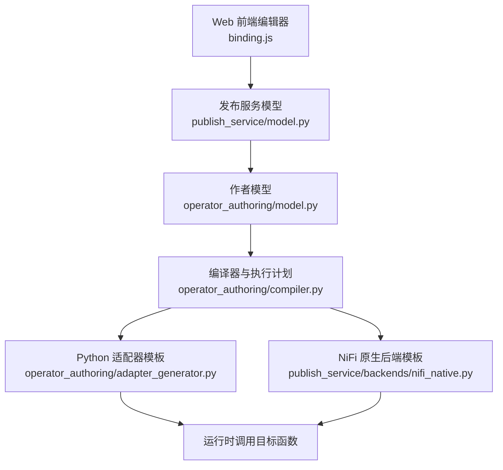

**图表来源**
- [web/app/static/binding.js:11-39](file://web/app/static/binding.js#L11-L39)
- [publish_service/model.py:24-50](file://publish_service/model.py#L24-L50)
- [operator_authoring/model.py:16-20](file://operator_authoring/model.py#L16-L20)
- [operator_authoring/compiler.py:32-44](file://operator_authoring/compiler.py#L32-L44)
- [operator_authoring/adapter_generator.py:75-112](file://operator_authoring/adapter_generator.py#L75-L112)
- [publish_service/backends/nifi_native.py:260-299](file://publish_service/backends/nifi_native.py#L260-L299)

**章节来源**
- [web/app/static/binding.js:11-39](file://web/app/static/binding.js#L11-L39)
- [publish_service/model.py:24-50](file://publish_service/model.py#L24-L50)
- [operator_authoring/model.py:16-20](file://operator_authoring/model.py#L16-L20)
- [operator_authoring/compiler.py:32-44](file://operator_authoring/compiler.py#L32-L44)
- [operator_authoring/adapter_generator.py:75-112](file://operator_authoring/adapter_generator.py#L75-L112)
- [publish_service/backends/nifi_native.py:260-299](file://publish_service/backends/nifi_native.py#L260-L299)

## 核心概念与数据模型
参数绑定由以下关键概念组成：
- 绑定来源：决定参数值从何处获取。
- 编码格式：决定原始值如何转换为 Python 对象。
- 元数据键：当来源为消息属性时，指定要读取的属性名称。
- 算子参数规格：当来源为算子参数时，描述该参数的键名、显示名、默认值、是否必填等。
- 常量值：直接使用该字段作为参数值。
- 参数类型：用于前端展示和类型提示，不改变运行时行为。

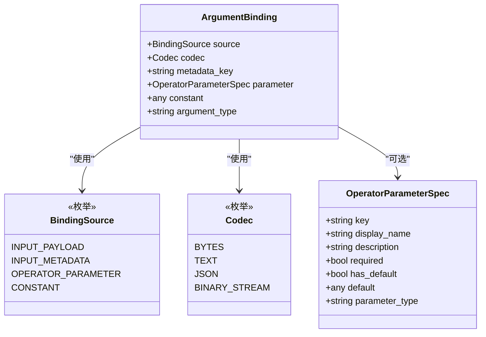

**图表来源**
- [operator_authoring/model.py:16-20](file://operator_authoring/model.py#L16-L20)
- [operator_authoring/model.py:23-27](file://operator_authoring/model.py#L23-L27)
- [operator_authoring/model.py:111-126](file://operator_authoring/model.py#L111-L126)
- [operator_authoring/model.py:129-143](file://operator_authoring/model.py#L129-L143)

**章节来源**
- [operator_authoring/model.py:16-20](file://operator_authoring/model.py#L16-L20)
- [operator_authoring/model.py:23-27](file://operator_authoring/model.py#L23-L27)
- [operator_authoring/model.py:111-126](file://operator_authoring/model.py#L111-L126)
- [operator_authoring/model.py:129-143](file://operator_authoring/model.py#L129-L143)

## 绑定源类型与使用场景
系统支持四种绑定源：

| 绑定源 | 含义 | 典型使用场景 | 必需字段 |
|---|---|---|---|
| `input.payload` | 使用传入消息正文作为参数值 | 文本处理、JSON 解析、二进制流处理 | 无 |
| `input.metadata` | 从传入消息的属性中读取一个值 | 路由标识、租户信息、时间戳、业务标签 | `metadata_key` |
| `operator.parameter` | 读取配置算子时填写的参数 | 阈值、开关、重试次数、策略名称 | `parameter` |
| `constant` | 为此参数填写一个固定值 | 默认编码、固定标志位、常量配置 | `constant` |

前端对这四个来源提供了明确标题与说明，便于用户理解：
- `input.payload`：消息内容
- `input.metadata`：消息属性
- `operator.parameter`：算子参数
- `constant`：固定值

**章节来源**
- [web/app/static/binding.js:11-32](file://web/app/static/binding.js#L11-L32)
- [operator_authoring/model.py:16-20](file://operator_authoring/model.py#L16-L20)

## ArgumentBinding 配置选项与约束
`ArgumentBinding` 是参数绑定的核心数据结构，其字段含义如下：

| 字段 | 类型 | 默认值 | 说明 |
|---|---|---|---|
| `source` | `BindingSource` | 必填 | 绑定来源 |
| `codec` | `Codec` | `TEXT` | 数据编码格式 |
| `metadata_key` | `string \| None` | `None` | 当来源为 `INPUT_METADATA` 时必填 |
| `parameter` | `OperatorParameterSpec \| None` | `None` | 当来源为 `OPERATOR_PARAMETER` 时必填 |
| `constant` | `any \| None` | `None` | 当来源为 `CONSTANT` 时使用 |
| `argument_type` | `string` | `"str"` | 参数类型，主要用于前端展示 |

约束条件：
- 若 `source` 为 `INPUT_METADATA`，必须提供 `metadata_key`。
- 若 `source` 为 `OPERATOR_PARAMETER`，必须提供 `parameter`。
- `OperatorParameterSpec.key` 不能为空。

此外，发布服务层的 `BindingSelection` 也做了相同语义校验，但对外暴露字段采用驼峰命名，例如 `metadataKey`、`parameterKey`。

**章节来源**
- [operator_authoring/model.py:129-143](file://operator_authoring/model.py#L129-L143)
- [operator_authoring/model.py:111-126](file://operator_authoring/model.py#L111-L126)
- [publish_service/model.py:24-50](file://publish_service/model.py#L24-L50)

## 参数值传递与数据转换流程
参数值传递分为两个阶段：
1. **编译期**：将用户配置的 `ArgumentBinding` 转换为运行时可执行的计划。
2. **运行期**：根据计划从输入内容、消息属性和算子参数中取值，并按 `codec` 进行解码。

### 编译期转换
编译器会：
- 校验绑定是否对应真实函数参数。
- 检查必填参数是否已绑定。
- 将 `OPERATOR_PARAMETER` 绑定提升为算子级参数，并记录键名、默认值、是否必填。
- 收集所有使用的 `input.metadata` 键，形成 `input_metadata` 列表。

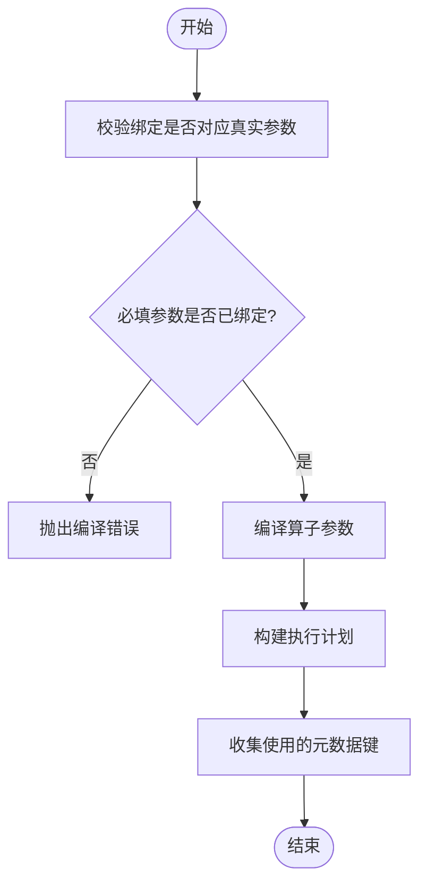

**图表来源**
- [operator_authoring/compiler.py:85-98](file://operator_authoring/compiler.py#L85-L98)
- [operator_authoring/compiler.py:101-149](file://operator_authoring/compiler.py#L101-L149)
- [operator_authoring/compiler.py:204-235](file://operator_authoring/compiler.py#L204-L235)

### 运行期解析
运行时通过 `_resolve_binding` 解析每个绑定：
- `input.payload`：直接使用消息正文。
- `input.metadata`：按 `metadata_key` 读取属性；若缺失且标记为必填则报错，否则返回缺失占位。
- `operator.parameter`：按 `parameter_key` 读取算子参数；若无值但有默认值则返回默认值；若标记为必填则报错，否则返回缺失占位。
- `constant`：直接返回常量值。

随后，所有非缺失值会被组装成关键字参数，调用目标函数。

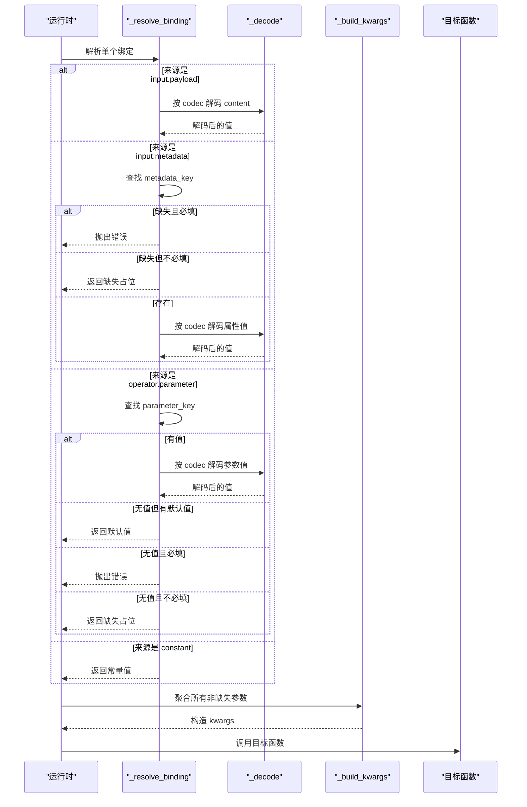

**图表来源**
- [operator_authoring/adapter_generator.py:75-112](file://operator_authoring/adapter_generator.py#L75-L112)
- [publish_service/backends/nifi_native.py:260-299](file://publish_service/backends/nifi_native.py#L260-L299)

**章节来源**
- [operator_authoring/compiler.py:85-98](file://operator_authoring/compiler.py#L85-L98)
- [operator_authoring/compiler.py:101-149](file://operator_authoring/compiler.py#L101-L149)
- [operator_authoring/compiler.py:204-235](file://operator_authoring/compiler.py#L204-L235)
- [operator_authoring/adapter_generator.py:75-112](file://operator_authoring/adapter_generator.py#L75-L112)
- [publish_service/backends/nifi_native.py:260-299](file://publish_service/backends/nifi_native.py#L260-L299)

## 元数据键映射规则与访问方式
元数据键用于从上游消息属性中读取值。规则如下：
- 绑定配置中通过 `metadata_key` 指定键名。
- 编译器会收集所有被使用的元数据键，形成 `input_metadata` 列表，便于下游系统预取或索引。
- 运行时按键名直接从消息属性字典中读取。
- 如果键不存在：
  - 若绑定标记为必填，则抛出错误。
  - 若未标记为必填，则返回缺失占位，最终不会进入目标函数的参数列表。

前端还实现了字段角色推断逻辑，帮助自动识别哪些字段属于元数据键、算子参数键或常量值，从而减少用户手动配置成本。

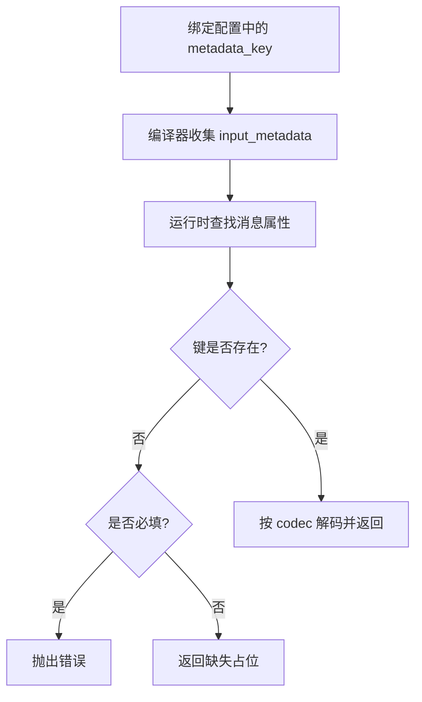

**图表来源**
- [operator_authoring/compiler.py:216-222](file://operator_authoring/compiler.py#L216-L222)
- [operator_authoring/adapter_generator.py:82-88](file://operator_authoring/adapter_generator.py#L82-L88)
- [publish_service/backends/nifi_native.py:267-273](file://publish_service/backends/nifi_native.py#L267-L273)
- [web/app/static/binding.js:34-39](file://web/app/static/binding.js#L34-L39)

**章节来源**
- [operator_authoring/compiler.py:216-222](file://operator_authoring/compiler.py#L216-L222)
- [operator_authoring/adapter_generator.py:82-88](file://operator_authoring/adapter_generator.py#L82-L88)
- [publish_service/backends/nifi_native.py:267-273](file://publish_service/backends/nifi_native.py#L267-L273)
- [web/app/static/binding.js:34-39](file://web/app/static/binding.js#L34-L39)

## 架构总览
参数绑定在系统中的整体职责划分如下：
- **模型层**：定义绑定来源、编码格式、算子参数规格和绑定结构。
- **API 层**：对外暴露绑定选择模型，负责字段别名和基础校验。
- **编译器**：将绑定转换为执行计划，并校验参数完整性。
- **适配器与后端**：在运行时解析绑定、解码数据、调用目标函数并序列化输出。
- **前端**：提供绑定编辑器，自动推断字段角色并引导用户填写。

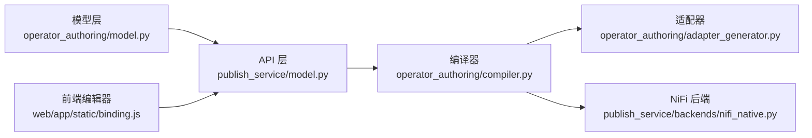

**图表来源**
- [operator_authoring/model.py:16-20](file://operator_authoring/model.py#L16-L20)
- [publish_service/model.py:24-50](file://publish_service/model.py#L24-L50)
- [operator_authoring/compiler.py:32-44](file://operator_authoring/compiler.py#L32-L44)
- [operator_authoring/adapter_generator.py:75-112](file://operator_authoring/adapter_generator.py#L75-L112)
- [publish_service/backends/nifi_native.py:260-299](file://publish_service/backends/nifi_native.py#L260-L299)
- [web/app/static/binding.js:11-39](file://web/app/static/binding.js#L11-L39)

## 详细组件分析

### 模型层：BindingSource、Codec、OperatorParameterSpec、ArgumentBinding
- `BindingSource` 定义了四种绑定来源。
- `Codec` 定义了四种编码格式。
- `OperatorParameterSpec` 描述了算子参数的键名、显示名、描述、是否必填、默认值和类型。
- `ArgumentBinding` 组合了上述类型，并通过验证器强制来源与字段的匹配关系。

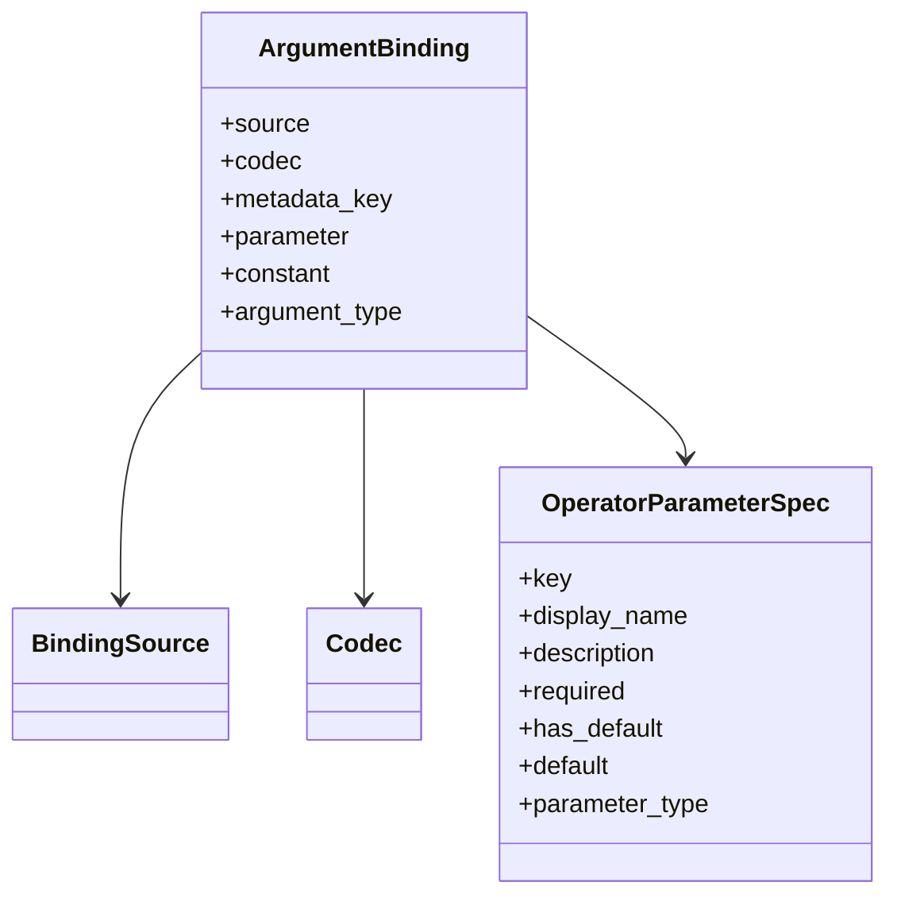

**图表来源**
- [operator_authoring/model.py:16-20](file://operator_authoring/model.py#L16-L20)
- [operator_authoring/model.py:23-27](file://operator_authoring/model.py#L23-L27)
- [operator_authoring/model.py:111-126](file://operator_authoring/model.py#L111-L126)
- [operator_authoring/model.py:129-143](file://operator_authoring/model.py#L129-L143)

**章节来源**
- [operator_authoring/model.py:16-20](file://operator_authoring/model.py#L16-L20)
- [operator_authoring/model.py:23-27](file://operator_authoring/model.py#L23-L27)
- [operator_authoring/model.py:111-126](file://operator_authoring/model.py#L111-L126)
- [operator_authoring/model.py:129-143](file://operator_authoring/model.py#L129-L143)

### 编译器：参数校验与执行计划生成
编译器负责：
- 校验绑定是否对应真实函数参数。
- 检查必填参数是否已绑定。
- 将 `OPERATOR_PARAMETER` 绑定提升为算子级参数。
- 收集 `input.metadata` 使用的键。
- 生成 `ExecutionPlan`，包含目标、构造参数、调用参数、输出规范、算子参数和元数据键列表。

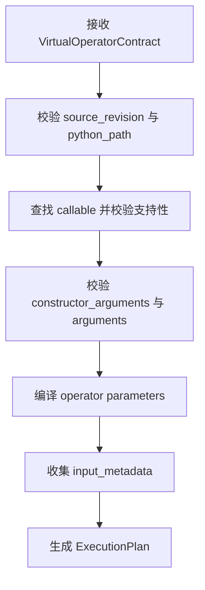

**图表来源**
- [operator_authoring/compiler.py:167-235](file://operator_authoring/compiler.py#L167-L235)

**章节来源**
- [operator_authoring/compiler.py:85-98](file://operator_authoring/compiler.py#L85-L98)
- [operator_authoring/compiler.py:101-149](file://operator_authoring/compiler.py#L101-L149)
- [operator_authoring/compiler.py:167-235](file://operator_authoring/compiler.py#L167-L235)

### 运行时适配器：参数解析与函数调用
适配器模板在运行时：
- 设置 Python 根路径和工作目录。
- 解析构造参数和调用参数。
- 根据目标类型实例化类或直接导入函数。
- 调用目标函数并序列化输出。

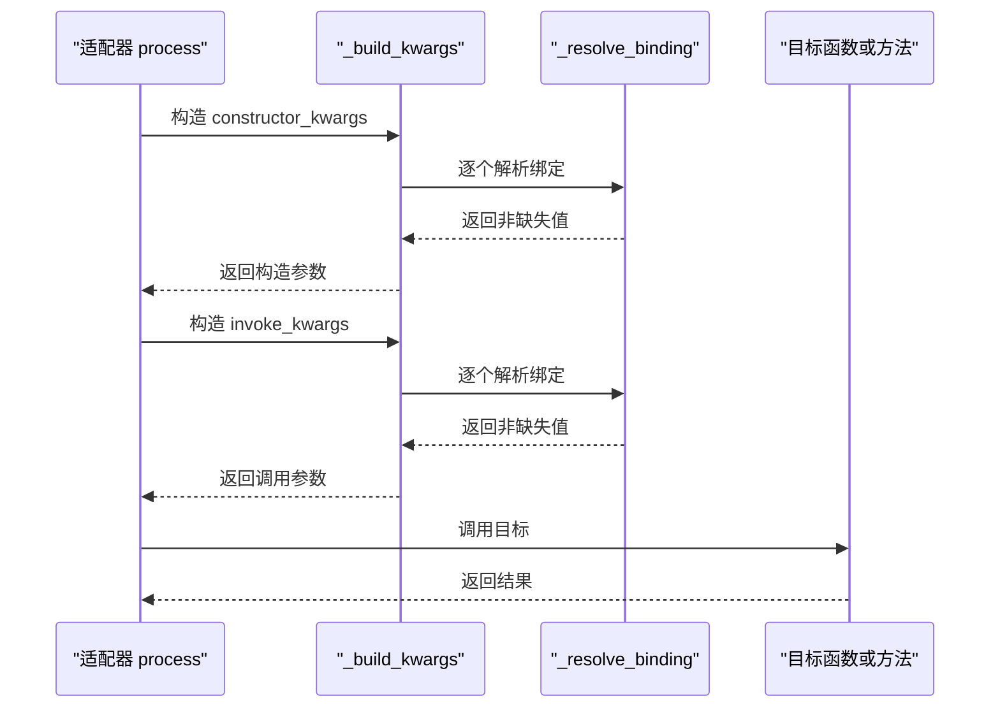

**图表来源**
- [operator_authoring/adapter_generator.py:188-238](file://operator_authoring/adapter_generator.py#L188-L238)
- [operator_authoring/adapter_generator.py:75-112](file://operator_authoring/adapter_generator.py#L75-L112)

**章节来源**
- [operator_authoring/adapter_generator.py:75-112](file://operator_authoring/adapter_generator.py#L75-L112)
- [operator_authoring/adapter_generator.py:188-238](file://operator_authoring/adapter_generator.py#L188-L238)

### NiFi 原生后端：参数解析与 FlowFile 集成
NiFi 原生后端将参数绑定与 NiFi 的 FlowFile 属性、上下文属性结合：
- 从 FlowFile 读取内容和属性。
- 从上下文属性读取算子参数。
- 使用相同的 `_resolve_binding` 和 `_build_kwargs` 逻辑。
- 将结果写回 FlowFile 的内容和属性。

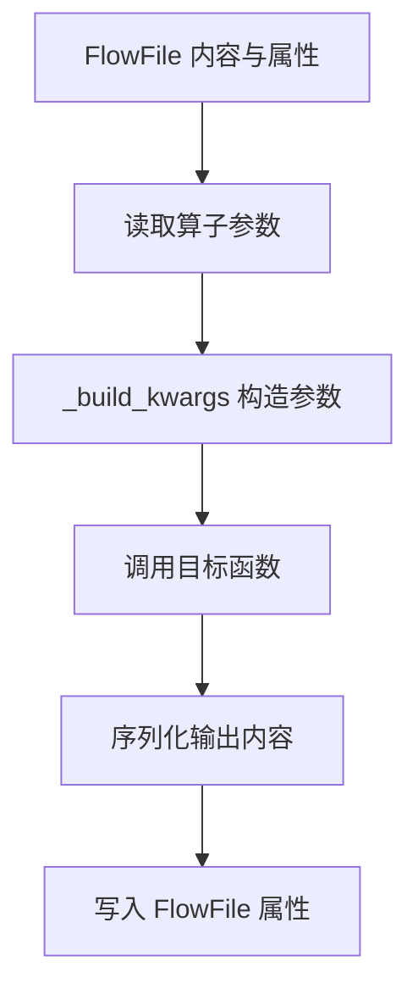

**图表来源**
- [publish_service/backends/nifi_native.py:421-495](file://publish_service/backends/nifi_native.py#L421-L495)
- [publish_service/backends/nifi_native.py:260-299](file://publish_service/backends/nifi_native.py#L260-L299)

**章节来源**
- [publish_service/backends/nifi_native.py:260-299](file://publish_service/backends/nifi_native.py#L260-L299)
- [publish_service/backends/nifi_native.py:421-495](file://publish_service/backends/nifi_native.py#L421-L495)

### 前端编辑器：绑定来源选择与字段角色推断
前端编辑器：
- 提供四种绑定来源的选择面板。
- 根据字段名模式推断字段角色，例如 `metadataKey`、`parameterKey`、`value`、`payloadPath`。
- 动态渲染不同来源所需的字段。
- 对常量值提供类型选择器，支持字符串、数字、布尔、对象或空值。

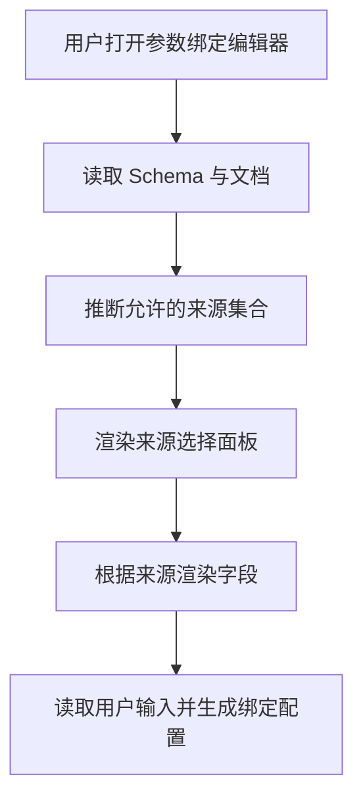

**图表来源**
- [web/app/static/binding.js:11-39](file://web/app/static/binding.js#L11-L39)
- [web/app/static/binding.js:48-95](file://web/app/static/binding.js#L48-L95)
- [web/app/static/binding.js:147-262](file://web/app/static/binding.js#L147-L262)
- [web/app/static/binding.js:264-491](file://web/app/static/binding.js#L264-L491)

**章节来源**
- [web/app/static/binding.js:11-39](file://web/app/static/binding.js#L11-L39)
- [web/app/static/binding.js:48-95](file://web/app/static/binding.js#L48-L95)
- [web/app/static/binding.js:147-262](file://web/app/static/binding.js#L147-L262)
- [web/app/static/binding.js:264-491](file://web/app/static/binding.js#L264-L491)

## 依赖关系分析
参数绑定的依赖关系如下：
- 前端依赖 API Schema 和 Analyze 响应，以决定允许的来源和字段。
- API 层依赖作者模型，复用 `BindingSource`、`Codec`、`OutputValueSource` 等枚举。
- 编译器依赖作者模型，并将绑定转换为执行计划。
- 适配器与 NiFi 后端依赖执行计划，并在运行时解析绑定。

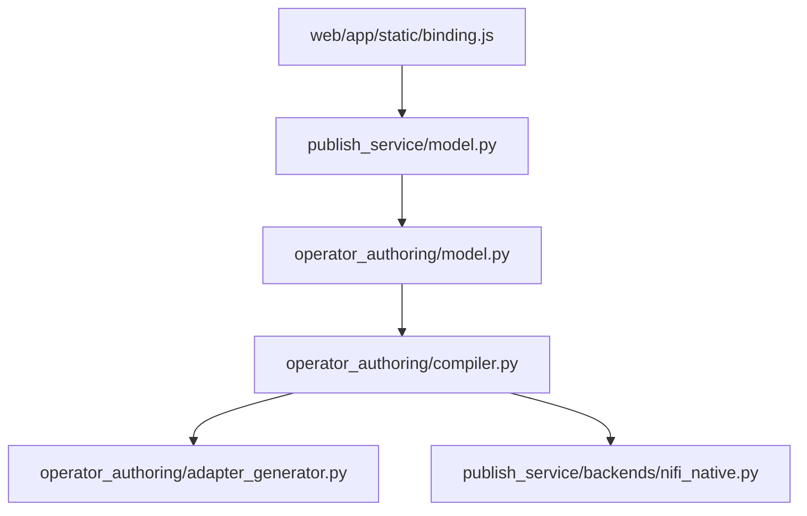

**图表来源**
- [web/app/static/binding.js:11-39](file://web/app/static/binding.js#L11-L39)
- [publish_service/model.py:24-50](file://publish_service/model.py#L24-L50)
- [operator_authoring/model.py:16-20](file://operator_authoring/model.py#L16-L20)
- [operator_authoring/compiler.py:32-44](file://operator_authoring/compiler.py#L32-L44)
- [operator_authoring/adapter_generator.py:75-112](file://operator_authoring/adapter_generator.py#L75-L112)
- [publish_service/backends/nifi_native.py:260-299](file://publish_service/backends/nifi_native.py#L260-L299)

**章节来源**
- [web/app/static/binding.js:11-39](file://web/app/static/binding.js#L11-L39)
- [publish_service/model.py:24-50](file://publish_service/model.py#L24-L50)
- [operator_authoring/model.py:16-20](file://operator_authoring/model.py#L16-L20)
- [operator_authoring/compiler.py:32-44](file://operator_authoring/compiler.py#L32-L44)
- [operator_authoring/adapter_generator.py:75-112](file://operator_authoring/adapter_generator.py#L75-L112)
- [publish_service/backends/nifi_native.py:260-299](file://publish_service/backends/nifi_native.py#L260-L299)

## 性能考虑与优化建议
- **避免不必要的编解码**：尽量让上游数据格式与目标函数期望一致，减少 `bytes`、`text`、`json` 之间的多次转换。
- **合理使用 `binary_stream`**：对于大文件或流式数据，优先使用 `binary_stream`，避免一次性加载到内存。
- **控制元数据键数量**：只绑定实际需要的元数据键，减少运行时查找和序列化开销。
- **使用默认值降低失败率**：对可选参数设置合理默认值，避免频繁缺失占位和错误分支。
- **前端推荐绑定**：利用前端的字段角色推断和来源推荐，减少用户误配导致的运行时错误。

[本节为通用性能指导，不直接分析具体代码文件]

## 复杂绑定场景与解决方案

### 场景一：消息内容为 JSON，需要提取嵌套字段
- 使用 `input.payload` 绑定，`codec` 设为 `json`。
- 在目标函数内部使用路径提取或对象访问获取嵌套字段。
- 若希望简化调用方逻辑，可在输出端使用 `return.path` 提前提取。

**相关实现参考**
- [operator_authoring/adapter_generator.py:122-142](file://operator_authoring/adapter_generator.py#L122-L142)
- [publish_service/backends/nifi_native.py:311-335](file://publish_service/backends/nifi_native.py#L311-L335)

### 场景二：多个参数来自不同来源
- 构造参数可使用 `operator.parameter`，调用参数可使用 `input.payload` 或 `input.metadata`。
- 确保每个绑定都满足必填约束，或使用默认值。
- 编译器会合并所有算子参数定义，避免重复键冲突。

**相关实现参考**
- [operator_authoring/compiler.py:116-134](file://operator_authoring/compiler.py#L116-L134)
- [operator_authoring/adapter_generator.py:200-217](file://operator_authoring/adapter_generator.py#L200-L217)

### 场景三：可选元数据键缺失时降级处理
- 将 `input.metadata` 绑定标记为非必填。
- 运行时返回缺失占位，该参数不会进入目标函数。
- 在目标函数内部判断参数是否存在，并提供降级逻辑。

**相关实现参考**
- [operator_authoring/adapter_generator.py:82-88](file://operator_authoring/adapter_generator.py#L82-L88)
- [publish_service/backends/nifi_native.py:267-273](file://publish_service/backends/nifi_native.py#L267-L273)

### 场景四：算子参数与函数参数同名冲突
- 编译器会检测重复定义的算子参数键，并抛出冲突错误。
- 解决方案：为不同用途的算子参数使用不同键名，或在绑定中调整 `parameter_key`。

**相关实现参考**
- [operator_authoring/compiler.py:127-130](file://operator_authoring/compiler.py#L127-L130)

### 场景五：前端自动推荐绑定来源
- 前端根据字段名模式推断来源，例如 `metadataKey`、`parameterKey`、`value`、`payloadPath`。
- 若 Schema 未提供明确来源，前端会提示用户手动填写完整配置。

**相关实现参考**
- [web/app/static/binding.js:34-39](file://web/app/static/binding.js#L34-L39)
- [web/app/static/binding.js:48-95](file://web/app/static/binding.js#L48-L95)
- [web/app/static/binding.js:280-293](file://web/app/static/binding.js#L280-L293)

**章节来源**
- [operator_authoring/adapter_generator.py:122-142](file://operator_authoring/adapter_generator.py#L122-L142)
- [publish_service/backends/nifi_native.py:311-335](file://publish_service/backends/nifi_native.py#L311-L335)
- [operator_authoring/compiler.py:116-134](file://operator_authoring/compiler.py#L116-L134)
- [operator_authoring/adapter_generator.py:200-217](file://operator_authoring/adapter_generator.py#L200-L217)
- [operator_authoring/adapter_generator.py:82-88](file://operator_authoring/adapter_generator.py#L82-L88)
- [publish_service/backends/nifi_native.py:267-273](file://publish_service/backends/nifi_native.py#L267-L273)
- [operator_authoring/compiler.py:127-130](file://operator_authoring/compiler.py#L127-L130)
- [web/app/static/binding.js:34-39](file://web/app/static/binding.js#L34-L39)
- [web/app/static/binding.js:48-95](file://web/app/static/binding.js#L48-L95)
- [web/app/static/binding.js:280-293](file://web/app/static/binding.js#L280-L293)

## 故障排查指南
常见问题及定位方式：
- **缺少元数据键**：检查 `input.metadata` 绑定是否设置了 `metadata_key`。
- **缺少算子参数**：检查 `operator.parameter` 绑定是否设置了 `parameter`。
- **必填参数未绑定**：编译器会报告缺失的必填参数绑定。
- **算子参数键冲突**：编译器会报告重复定义的算子参数键。
- **运行时元数据缺失**：检查上游消息是否包含对应属性，或将该绑定改为非必填。
- **运行时算子参数缺失**：检查算子配置是否填写了对应参数，或设置默认值。
- **前端绑定无法自动推断**：检查 Schema 是否提供来源字段，或手动选择数据来源。

**章节来源**
- [operator_authoring/model.py:137-143](file://operator_authoring/model.py#L137-L143)
- [publish_service/model.py:44-50](file://publish_service/model.py#L44-L50)
- [operator_authoring/compiler.py:85-98](file://operator_authoring/compiler.py#L85-L98)
- [operator_authoring/compiler.py:127-130](file://operator_authoring/compiler.py#L127-L130)
- [operator_authoring/adapter_generator.py:82-98](file://operator_authoring/adapter_generator.py#L82-L98)
- [publish_service/backends/nifi_native.py:267-283](file://publish_service/backends/nifi_native.py#L267-L283)
- [web/app/static/binding.js:280-293](file://web/app/static/binding.js#L280-L293)

## 结论
参数绑定是连接外部输入与目标函数调用的关键桥梁。通过统一的绑定模型、严格的编译期校验和灵活的运行时解析，系统能够稳定地将消息内容、消息属性、算子参数和常量值转换为函数入参。前端编辑器进一步降低了配置复杂度，提升了用户体验。在实际使用中，建议优先选择合适的绑定源和编码格式，合理使用默认值和必填约束，并结合输出路径提取能力简化调用方逻辑。

[本节为总结性内容，不直接分析具体代码文件]