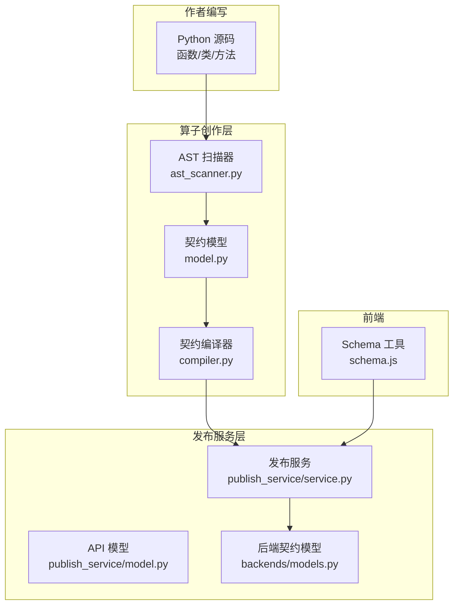
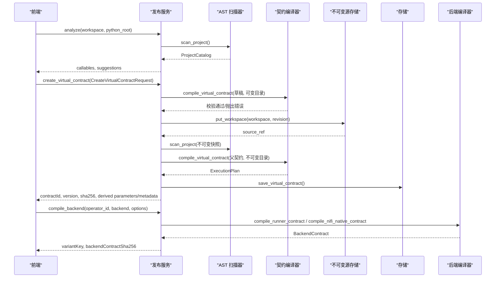
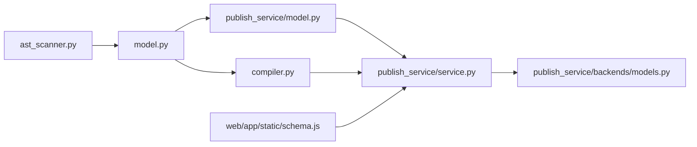

# 契约定义规范

<cite>
**本文引用的文件**   
- [operator_authoring/model.py](file://operator_authoring/model.py)
- [operator_authoring/compiler.py](file://operator_authoring/compiler.py)
- [operator_authoring/ast_scanner.py](file://operator_authoring/ast_scanner.py)
- [publish_service/model.py](file://publish_service/model.py)
- [publish_service/service.py](file://publish_service/service.py)
- [publish_service/backends/models.py](file://publish_service/backends/models.py)
- [web/app/static/schema.js](file://web/app/static/schema.js)
</cite>

## 目录
1. [引言](#引言)
2. [项目结构](#项目结构)
3. [核心组件](#核心组件)
4. [架构总览](#架构总览)
5. [详细组件分析](#详细组件分析)
6. [依赖关系分析](#依赖关系分析)
7. [性能与可扩展性](#性能与可扩展性)
8. [故障排查指南](#故障排查指南)
9. [结论](#结论)
10. [附录：最佳实践与示例路径](#附录最佳实践与示例路径)

## 引言
本技术文档面向“虚拟契约”的定义、验证与编译流程，目标是帮助读者理解：
- 什么是虚拟契约及其在算子编排中的作用。
- 虚拟契约的语法模型、参数绑定、返回值映射、装饰器与类型推断。
- 契约校验机制、数据编解码规则与复杂参数类型的处理方式。
- 版本管理与向后兼容性策略。
- 虚拟契约到运行时执行计划的映射关系。

该体系由“源码扫描 → 契约建模 → 契约编译 → 后端变体生成 → 发布产物”构成，贯穿前端交互、发布服务与运行时代码。

## 项目结构
围绕契约定义的核心代码分布在以下模块：
- operator_authoring：负责 Python 源码扫描、可调用项元信息提取、虚拟契约模型定义与契约编译。
- publish_service：对外提供分析、创建虚拟契约、编译后端变体与发布能力。
- web/app/static：前端 Schema 工具，用于解析 OpenAPI 并驱动表单与绑定选择。

**图表来源**
- [operator_authoring/ast_scanner.py:146-242](file://operator_authoring/ast_scanner.py#L146-L242)
- [operator_authoring/model.py:48-211](file://operator_authoring/model.py#L48-L211)
- [operator_authoring/compiler.py:167-236](file://operator_authoring/compiler.py#L167-L236)
- [publish_service/model.py:15-86](file://publish_service/model.py#L15-L86)
- [publish_service/service.py:385-477](file://publish_service/service.py#L385-L477)
- [publish_service/backends/models.py:10-72](file://publish_service/backends/models.py#L10-L72)
- [web/app/static/schema.js:1-192](file://web/app/static/schema.js#L1-L192)

**章节来源**
- [operator_authoring/ast_scanner.py:146-242](file://operator_authoring/ast_scanner.py#L146-L242)
- [operator_authoring/model.py:48-211](file://operator_authoring/model.py#L48-L211)
- [operator_authoring/compiler.py:167-236](file://operator_authoring/compiler.py#L167-L236)
- [publish_service/model.py:15-86](file://publish_service/model.py#L15-L86)
- [publish_service/service.py:385-477](file://publish_service/service.py#L385-L477)
- [publish_service/backends/models.py:10-72](file://publish_service/backends/models.py#L10-L72)
- [web/app/static/schema.js:1-192](file://web/app/static/schema.js#L1-L192)

## 核心组件
本节聚焦虚拟契约相关的关键数据结构与职责边界。

- 可调用项与参数信息
  - CallableInfo：描述函数或方法的标识、模块、限定名、种类（函数/实例方法/静态方法/类方法）、是否异步、装饰器列表、参数列表、返回注解等。
  - ParameterInfo：描述参数的名称、形参种类、类型注解、是否必填、是否有默认值、默认值与默认表达式字符串。
  - ClassInfo：类的目标标识、构造器参数、方法列表。
  - ProjectCatalog：项目级目录，包含所有函数与类、警告信息，以及按分数排序的可调用项集合。

- 虚拟契约模型
  - VirtualOperatorContract：虚拟契约根对象，包含 API 版本、执行模型、算子元信息、源码定位、目标可调用项、构造器参数绑定、调用参数绑定、输出映射。
  - ArgumentBinding：参数绑定，支持输入载荷、输入元数据、算子参数、常量四种来源，并指定编解码器与可选的元数据键或算子参数键。
  - OutputSpec / OutputValueSpec：输出映射，支持从返回值、返回值路径或常量获取，并可配置编解码器与 None 处理策略。
  - SourceSpec：源码快照定位，包含不可变源修订号、相对 Python 路径与不可变源引用。

- 编译产物
  - ExecutionPlan：编译后的执行计划，包含编译器版本、源码定位、目标、构造器参数与调用参数编译结果、输出映射、暴露给前端的参数定义、输入/输出元数据键集合与契约摘要。

- 发布服务 API 模型
  - BindingSelection / OutputSelection / CreateVirtualContractRequest：前端提交契约选择的请求模型，字段采用驼峰命名并通过 alias_generator 自动映射。

- 后端契约模型
  - BackendContractBase / RunnerBackendContract / NifiNativeBackendContract：基于虚拟契约扩展的后端契约，包含父契约引用、后端类型、编译器版本、变体键、后端选项等。

**章节来源**
- [operator_authoring/model.py:48-211](file://operator_authoring/model.py#L48-L211)
- [operator_authoring/compiler.py:22-44](file://operator_authoring/compiler.py#L22-L44)
- [publish_service/model.py:15-86](file://publish_service/model.py#L15-L86)
- [publish_service/backends/models.py:10-72](file://publish_service/backends/models.py#L10-L72)

## 架构总览
虚拟契约的生命周期如下：
1. 前端通过 Publish Service 的 analyze 接口扫描工作区，得到可调用项、参数视图与建议绑定。
2. 用户在 UI 中选择目标可调用项，并为构造器和调用参数设置绑定来源（输入载荷、输入元数据、算子参数、常量），同时配置输出映射。
3. 前端将选择转换为 CreateVirtualContractRequest，调用 create_virtual_contract。
4. 发布服务将选择转换为虚拟契约草稿，先对可变工作区进行编译校验；随后将工作区落盘为不可变快照，再基于不可变快照重新扫描并编译，最终持久化契约。
5. 根据后端类型（runner 或 nifi_native）生成后端契约变体，并进入发布流程。

**图表来源**
- [publish_service/service.py:385-477](file://publish_service/service.py#L385-L477)
- [publish_service/service.py:569-642](file://publish_service/service.py#L569-L642)
- [operator_authoring/ast_scanner.py:146-242](file://operator_authoring/ast_scanner.py#L146-L242)
- [operator_authoring/compiler.py:167-236](file://operator_authoring/compiler.py#L167-L236)

## 详细组件分析

### 虚拟契约模型与语法规则
虚拟契约是用户意图的声明式表达，核心字段包括：
- api_version：固定为 dsc.virtual-operator/v1，用于契约版本控制。
- execution_model：当前仅支持 direct，表示直接调用模式。
- metadata：算子展示元信息，包含 name、display_name、description。
- source：指向源码快照，包含 source_revision、python_path、source_ref。
- target：目标可调用项，使用 callable_id 引用 AST 扫描得到的唯一 ID。
- constructor_arguments：实例方法的构造器参数绑定。
- arguments：调用参数绑定。
- output：输出映射，包含 payload、metadata 与 none_policy。

参数绑定 ArgumentBinding 的规则：
- source：input.payload、input.metadata、operator.parameter、constant。
- codec：bytes、text、json、binary_stream。
- 当 source 为 input.metadata 时，必须提供 metadata_key。
- 当 source 为 operator.parameter 时，必须提供 parameter（OperatorParameterSpec）。

输出映射 OutputValueSpec 的规则：
- source：return、return.path、constant。
- 当 source 为 return.path 时，path 必须非空。
- codec：bytes、text、json、binary_stream。
- value：当 source 为 constant 时使用。

NonePolicy 控制输出为 None 时的行为：keep-original 或 empty。

SourceSpec 的安全约束：
- python_path 必须是相对 POSIX 路径，不能以 / 开头，不能包含 \，且不能包含 .. 片段，确保始终位于源码快照内。

**章节来源**
- [operator_authoring/model.py:48-211](file://operator_authoring/model.py#L48-L211)

### AST 扫描与可调用项发现
AST 扫描器负责：
- 遍历工作区 Python 文件，排除测试文件、符号链接与常见忽略目录。
- 解析每个文件的 AST，收集函数、类、方法、构造器、装饰器、参数、返回注解。
- 计算可调用项评分，优先推荐常用名称与带有特定装饰器的可调用项。
- 生成 ProjectCatalog，包含 source_revision、python_path、functions、classes、warnings。

关键实现要点：
- _parameter_infos：统一处理位置参数、关键字参数、*args、**kwargs，并标记 required、has_default、default_value、default_repr。
- _callable_score：根据名称权重与装饰器提升优先级。
- _method_kind：识别 staticmethod、classmethod、instance-method。
- source_revision：对所有文件内容与路径做 SHA256 汇总，保证不可变性。

**章节来源**
- [operator_authoring/ast_scanner.py:11-82](file://operator_authoring/ast_scanner.py#L11-L82)
- [operator_authoring/ast_scanner.py:85-122](file://operator_authoring/ast_scanner.py#L85-L122)
- [operator_authoring/ast_scanner.py:125-143](file://operator_authoring/ast_scanner.py#L125-L143)
- [operator_authoring/ast_scanner.py:146-242](file://operator_authoring/ast_scanner.py#L146-L242)

### 契约编译与验证
compile_virtual_contract 的职责：
- 校验 source_revision 与 catalog.source_revision 一致，防止篡改。
- 校验 python_path 与 catalog.python_path 一致。
- 检查 CatalogWarning 中的 error 级别警告，阻止存在语法错误的源码继续编译。
- 查找目标 callable_id，若不存在则报错。
- 校验可调用项支持性：不支持异步、不支持某些参数 kind（如 VAR_POSITIONAL/VAR_KEYWORD），实例方法需要 class_target 与对应 ClassInfo。
- 校验构造器参数绑定与调用参数绑定：未知参数、缺失必填参数都会报错。
- 生成 ExecutionPlan，包含 target、constructor_arguments、arguments、output、parameters、input_metadata、output_metadata、contract_sha256。

支持的参数种类：POSITIONAL_OR_KEYWORD、KEYWORD_ONLY。

**章节来源**
- [operator_authoring/compiler.py:14-19](file://operator_authoring/compiler.py#L14-L19)
- [operator_authoring/compiler.py:56-78](file://operator_authoring/compiler.py#L56-L78)
- [operator_authoring/compiler.py:85-149](file://operator_authoring/compiler.py#L85-L149)
- [operator_authoring/compiler.py:167-236](file://operator_authoring/compiler.py#L167-L236)

### 前端交互与 Schema 工具
前端 schema.js 提供一组工具函数，用于解析后端返回的 OpenAPI 文档，动态构建表单与绑定选择：
- flatten/deref：展开 allOf/$ref，避免循环引用。
- options/schemaType：枚举取值、推断 JSON Schema 类型。
- requestSchema/propertyName/propertySchema：定位请求体 schema 与属性。
- dictionaryValueSchema：推导字典值的子 schema。
- template：根据 schema 生成默认模板值。
- sourceField/fromSuggestion：根据 allowedSources 智能匹配 source 字段，并从建议中填充绑定。

这些工具使前端能够依据后端 schema 自动生成 UI，减少手工维护成本。

**章节来源**
- [web/app/static/schema.js:1-192](file://web/app/static/schema.js#L1-L192)

### 发布服务与后端变体
PublishService.create_virtual_contract：
- 校验 workspace 有效性。
- 扫描可变工作区，校验 source_revision 与请求一致。
- 将前端选择转换为虚拟契约草稿，并进行编译校验。
- 将工作区写入不可变源存储，获得 source_ref。
- 基于不可变快照再次扫描并编译，得到稳定的 ExecutionPlan。
- 持久化虚拟契约，返回 contractId、version、sha256 与派生参数/元数据。

后端变体编译：
- runner：生成 RunnerBackendContract，包含 runtime_profile、runner_manifest、parameters。
- nifi_native：生成 NifiNativeBackendContract，包含 processor_type、class_name、package_name、properties、requirements、target_platform、deployment_mode。
- 两者都继承 BackendContractBase，包含 parent_contract_id/version/sha256、backend、compiler_version、variant_key、backend_options。

**章节来源**
- [publish_service/service.py:418-477](file://publish_service/service.py#L418-L477)
- [publish_service/service.py:569-642](file://publish_service/service.py#L569-L642)
- [publish_service/backends/models.py:10-72](file://publish_service/backends/models.py#L10-L72)

## 依赖关系分析
虚拟契约相关模块之间的依赖关系如下：

**图表来源**
- [operator_authoring/ast_scanner.py:146-242](file://operator_authoring/ast_scanner.py#L146-L242)
- [operator_authoring/model.py:48-211](file://operator_authoring/model.py#L48-L211)
- [operator_authoring/compiler.py:167-236](file://operator_authoring/compiler.py#L167-L236)
- [publish_service/model.py:15-86](file://publish_service/model.py#L15-L86)
- [publish_service/service.py:385-477](file://publish_service/service.py#L385-L477)
- [publish_service/backends/models.py:10-72](file://publish_service/backends/models.py#L10-L72)
- [web/app/static/schema.js:1-192](file://web/app/static/schema.js#L1-L192)

**章节来源**
- [operator_authoring/ast_scanner.py:146-242](file://operator_authoring/ast_scanner.py#L146-L242)
- [operator_authoring/model.py:48-211](file://operator_authoring/model.py#L48-L211)
- [operator_authoring/compiler.py:167-236](file://operator_authoring/compiler.py#L167-L236)
- [publish_service/model.py:15-86](file://publish_service/model.py#L15-L86)
- [publish_service/service.py:385-477](file://publish_service/service.py#L385-L477)
- [publish_service/backends/models.py:10-72](file://publish_service/backends/models.py#L10-L72)
- [web/app/static/schema.js:1-192](file://web/app/static/schema.js#L1-L192)

## 性能与可扩展性
- AST 扫描复杂度：O(N) 文件遍历 + O(M) AST 节点解析，N 为 Python 文件数，M 为 AST 节点总数。
- 契约编译复杂度：主要取决于参数绑定数量与可调用项参数数量，整体线性。
- 不可变快照：通过 source_revision 与 source_ref 保证契约与源码快照强一致，避免并发修改导致的不确定性。
- 可扩展点：
  - 新增后端类型：扩展 BackendContractBase 子类与 PublishService._compile_backend。
  - 新增编解码器：扩展 Codec 枚举并在运行时适配序列化逻辑。
  - 新增参数来源：扩展 BindingSource 与 ArgumentBinding 校验逻辑。

[本节为通用指导，不直接分析具体文件]

## 故障排查指南
常见问题与定位思路：
- 源码语法错误：编译阶段会收集 CatalogWarning 中 severity=error 的信息并拒绝编译。需修复 Python 语法问题后重试。
- 目标可调用项不存在：检查 callable_id 是否与 AST 扫描结果一致。
- 不支持的异步或参数种类：Direct Invoke v1 不支持异步可调用项与 VAR_POSITIONAL/VAR_KEYWORD 等参数种类。
- 实例方法缺少 class_target 或 ClassInfo：确保类元信息完整。
- 参数绑定缺失或多余：检查 constructor_arguments 与 arguments 是否覆盖所有 required 参数，且不包含未知参数。
- 输入元数据绑定缺少 metadata_key：ArgumentBinding.source=input.metadata 时必须提供 metadata_key。
- 算子参数绑定缺少 parameter：ArgumentBinding.source=operator.parameter 时必须提供 OperatorParameterSpec。
- 输出路径为空：OutputValueSpec.source=return.path 时必须提供非空 path。
- 工作区变更冲突：create_virtual_contract 要求 source_revision 与 analyze 返回的一致，否则需重新 analyze。

**章节来源**
- [operator_authoring/compiler.py:56-78](file://operator_authoring/compiler.py#L56-L78)
- [operator_authoring/compiler.py:85-149](file://operator_authoring/compiler.py#L85-L149)
- [operator_authoring/compiler.py:167-236](file://operator_authoring/compiler.py#L167-L236)
- [operator_authoring/model.py:129-143](file://operator_authoring/model.py#L129-L143)
- [operator_authoring/model.py:167-177](file://operator_authoring/model.py#L167-L177)
- [publish_service/service.py:418-477](file://publish_service/service.py#L418-L477)

## 结论
虚拟契约通过声明式模型将 Python 源码的可调用项、参数绑定与输出映射抽象为可编译、可验证、可发布的中间表示。AST 扫描提供稳定的可调用项目录，编译器严格校验契约一致性，发布服务将其转化为后端变体并进入发布流水线。通过不可变源码快照与版本化契约，系统实现了良好的向后兼容性与可追溯性。

[本节为总结性内容，不直接分析具体文件]

## 附录：最佳实践与示例路径
- 参数类型定义
  - 使用 Python 类型注解，AST 扫描会将 annotation 序列化为字符串，便于前端展示与校验。
  - 对于复杂类型（如 list、dict、自定义对象），建议在注解中使用标准库类型提示，例如 list[int]、dict[str, Any]、MyModel。
  - 参考路径：[operator_authoring/ast_scanner.py:85-122](file://operator_authoring/ast_scanner.py#L85-L122)、[operator_authoring/model.py:48-71](file://operator_authoring/model.py#L48-L71)

- 返回值声明
  - 使用 returns 注解声明返回值类型，编译器会保留 return_annotation 供前端展示。
  - 参考路径：[operator_authoring/ast_scanner.py:185-196](file://operator_authoring/ast_scanner.py#L185-L196)、[operator_authoring/model.py:58-71](file://operator_authoring/model.py#L58-L71)

- 装饰器使用
  - 装饰器名称会被记录在 decorators 列表中，影响可调用项评分与推荐。
  - 参考路径：[operator_authoring/ast_scanner.py:125-143](file://operator_authoring/ast_scanner.py#L125-L143)、[operator_authoring/ast_scanner.py:185-196](file://operator_authoring/ast_scanner.py#L185-L196)

- 复杂参数类型处理
  - 列表：list[T]，T 可为基础类型或自定义对象。
  - 字典：dict[K, V]，K/V 可为基础类型或自定义对象。
  - 自定义对象：建议使用 Pydantic BaseModel 或 dataclass，并在注解中引用。
  - 参考路径：[operator_authoring/ast_scanner.py:85-122](file://operator_authoring/ast_scanner.py#L85-L122)

- 版本管理与向后兼容
  - api_version 固定为 dsc.virtual-operator/v1，便于未来演进。
  - source_revision 与 source_ref 保证契约与源码快照强一致。
  - 后端契约包含 parent_contract_id/version/sha256，便于追踪父契约。
  - 参考路径：[operator_authoring/model.py:203-211](file://operator_authoring/model.py#L203-L211)、[publish_service/backends/models.py:10-18](file://publish_service/backends/models.py#L10-L18)

- 运行时执行映射
  - ExecutionPlan.target 包含 kind/module/qualname/class_target/method_name，运行时据此反射调用。
  - constructor_arguments 与 arguments 编译为运行时所需的绑定负载。
  - output 映射决定如何从返回值中提取 payload 与 metadata。
  - 参考路径：[operator_authoring/compiler.py:152-164](file://operator_authoring/compiler.py#L152-L164)、[operator_authoring/compiler.py:204-236](file://operator_authoring/compiler.py#L204-L236)