# 契约语法规范

<cite>
**本文引用的文件**   
- [operator_authoring/model.py](file://operator_authoring/model.py)
- [operator_authoring/compiler.py](file://operator_authoring/compiler.py)
- [publish_service/model.py](file://publish_service/model.py)
- [publish_service/selection.py](file://publish_service/selection.py)
- [publish_service/backends/models.py](file://publish_service/backends/models.py)
</cite>

## 目录
1. [引言](#引言)
2. [项目结构](#项目结构)
3. [核心组件](#核心组件)
4. [架构总览](#架构总览)
5. [详细组件分析](#详细组件分析)
6. [依赖关系分析](#依赖关系分析)
7. [性能与可维护性考虑](#性能与可维护性考虑)
8. [故障排查指南](#故障排查指南)
9. [结论](#结论)
10. [附录：字段与枚举速查](#附录字段与枚举速查)

## 引言
本文件面向“虚拟算子契约”的语法与语义规范，系统性说明 VirtualOperatorContract 及其相关数据结构的定义、约束与编译流程。文档覆盖以下主题：
- 虚拟契约的完整语法规则与结构定义
- 关键字段 api_version、execution_model、metadata、source、target 的语法要求
- 参数绑定 ArgumentBinding 的定义规则与约束条件
- 输出规范 OutputSpec 与 OutputValueSpec 的使用方式
- 装饰器与自定义参数的定义规则
- 语法验证规则与错误处理机制
- 从前端请求到后端执行计划的转换链路

## 项目结构
与契约语法直接相关的代码主要位于 operator_authoring 与 publish_service 两个模块中：
- operator_authoring/model.py：定义虚拟契约的核心数据模型与校验逻辑
- operator_authoring/compiler.py：将虚拟契约编译为可执行的 ExecutionPlan
- publish_service/model.py：对外 API 的请求模型（含 BindingSelection、OutputSelection）
- publish_service/selection.py：将前端选择转换为内部 VirtualOperatorContract
- publish_service/backends/models.py：后端契约扩展（继承自 VirtualOperatorContract）

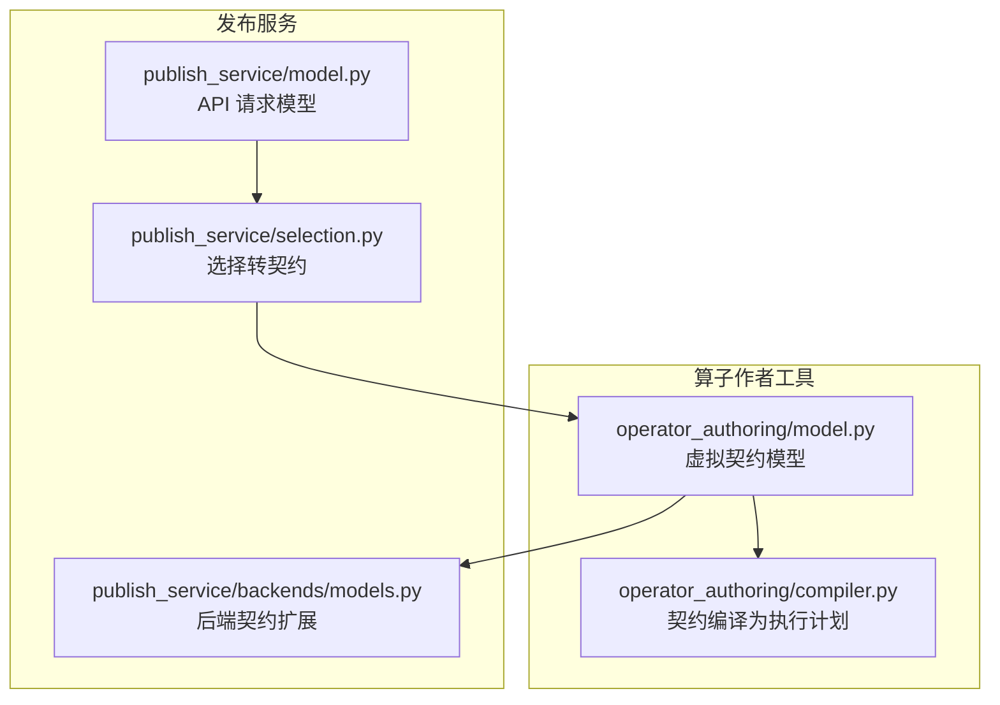

**图表来源**
- [operator_authoring/model.py:111-212](file://operator_authoring/model.py#L111-L212)
- [operator_authoring/compiler.py:167-236](file://operator_authoring/compiler.py#L167-L236)
- [publish_service/model.py:24-80](file://publish_service/model.py#L24-L80)
- [publish_service/selection.py:34-77](file://publish_service/selection.py#L34-L77)
- [publish_service/backends/models.py:10-18](file://publish_service/backends/models.py#L10-L18)

**章节来源**
- [operator_authoring/model.py:111-212](file://operator_authoring/model.py#L111-L212)
- [operator_authoring/compiler.py:167-236](file://operator_authoring/compiler.py#L167-L236)
- [publish_service/model.py:24-80](file://publish_service/model.py#L24-L80)
- [publish_service/selection.py:34-77](file://publish_service/selection.py#L34-L77)
- [publish_service/backends/models.py:10-18](file://publish_service/backends/models.py#L10-L18)

## 核心组件
本节聚焦虚拟契约的核心数据结构与约束规则。

### 虚拟契约 VirtualOperatorContract
VirtualOperatorContract 是虚拟算子契约的根对象，包含版本、执行模型、元信息、源码定位、目标调用点、构造参数绑定、调用参数绑定以及输出规范。

关键字段与语义：
- api_version：固定为 dsc.virtual-operator/v1
- execution_model：固定为 direct
- metadata：算子展示与描述信息
- source：指向不可变源码快照的定位信息
- target：目标可调用项引用
- constructor_arguments：实例方法的构造参数绑定
- arguments：调用参数绑定
- output：输出载荷与元数据的抽取与编码策略

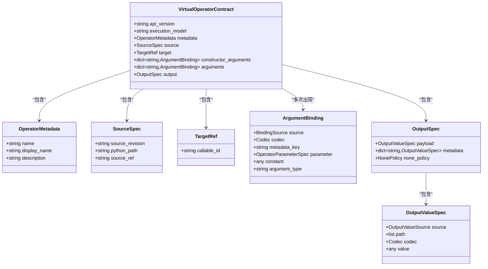

**图表来源**
- [operator_authoring/model.py:111-212](file://operator_authoring/model.py#L111-L212)

**章节来源**
- [operator_authoring/model.py:111-212](file://operator_authoring/model.py#L111-L212)

### 参数绑定 ArgumentBinding
ArgumentBinding 用于将运行时输入或常量映射到目标函数的参数。其关键约束如下：
- 当 source 为 input.metadata 时，必须提供 metadata_key
- 当 source 为 operator.parameter 时，必须提供 parameter（OperatorParameterSpec）
- codec 指定编解码类型；constant 用于常量值；argument_type 表示参数类型字符串

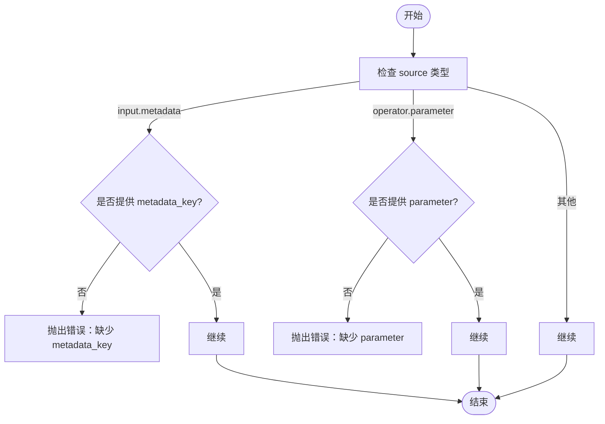

**图表来源**
- [operator_authoring/model.py:129-144](file://operator_authoring/model.py#L129-L144)

**章节来源**
- [operator_authoring/model.py:129-144](file://operator_authoring/model.py#L129-L144)

### 输出规范 OutputSpec 与 OutputValueSpec
OutputSpec 定义整体输出结构，包括主载荷 payload、元数据键值对 metadata，以及空值策略 none_policy。
OutputValueSpec 定义单个值的来源、路径、编解码与常量值。关键约束：
- 当 source 为 return.path 时，path 必须非空

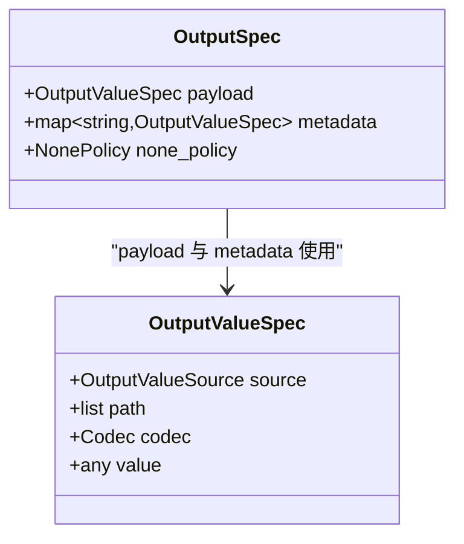

**图表来源**
- [operator_authoring/model.py:167-184](file://operator_authoring/model.py#L167-L184)

**章节来源**
- [operator_authoring/model.py:167-184](file://operator_authoring/model.py#L167-L184)

### 源码定位 SourceSpec
SourceSpec 用于锁定不可变的源码快照，并限制 python_path 的安全范围：
- python_path 必须是相对 POSIX 路径
- 不允许绝对路径与反斜杠
- 不允许使用 .. 跳出快照目录

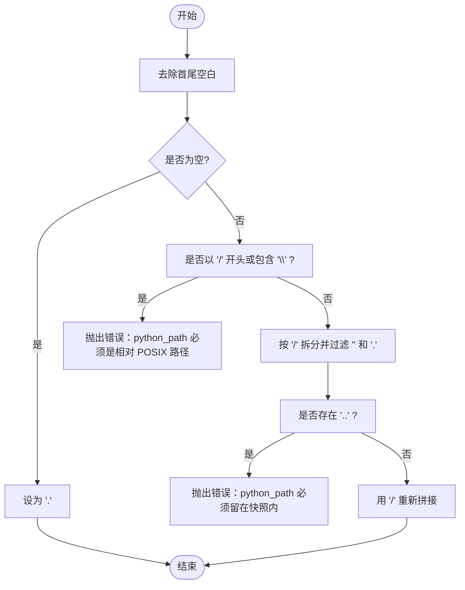

**图表来源**
- [operator_authoring/model.py:186-200](file://operator_authoring/model.py#L186-L200)

**章节来源**
- [operator_authoring/model.py:186-200](file://operator_authoring/model.py#L186-L200)

## 架构总览
下图展示了从前端请求到最终执行计划的完整链路，包括模型转换、契约校验与编译过程。

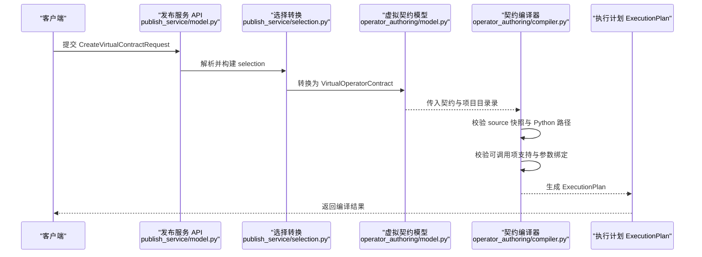

**图表来源**
- [publish_service/model.py:72-80](file://publish_service/model.py#L72-L80)
- [publish_service/selection.py:34-77](file://publish_service/selection.py#L34-L77)
- [operator_authoring/model.py:203-212](file://operator_authoring/model.py#L203-L212)
- [operator_authoring/compiler.py:167-236](file://operator_authoring/compiler.py#L167-L236)

## 详细组件分析

### 虚拟契约字段语法与约束
- api_version：固定值 dsc.virtual-operator/v1
- execution_model：固定值 direct
- metadata.name/display_name/description：名称需满足字符集与空串校验
- source.source_revision/python_path/source_ref：快照版本与路径安全校验
- target.callable_id：必须存在且能在目录录中找到对应可调用项
- constructor_arguments/arguments：参数绑定集合，需与目标函数签名匹配
- output.payload/metadata/none_policy：输出结构与空值策略

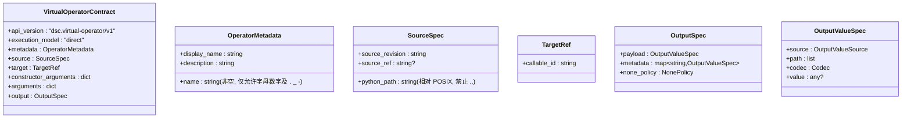

**图表来源**
- [operator_authoring/model.py:111-212](file://operator_authoring/model.py#L111-L212)

**章节来源**
- [operator_authoring/model.py:111-212](file://operator_authoring/model.py#L111-L212)

### 参数绑定 ArgumentBinding 的规则与示例模式
- 绑定来源 source 支持：
  - input.payload：来自上游内容载荷
  - input.metadata：来自上游属性，需要 metadata_key
  - operator.parameter：来自当前算子参数，需要 parameter（OperatorParameterSpec）
  - constant：来自常量值
- 编解码 codec：bytes/text/json/binary_stream
- 自定义参数 OperatorParameterSpec：key/display_name/description/required/has_default/default/parameter_type

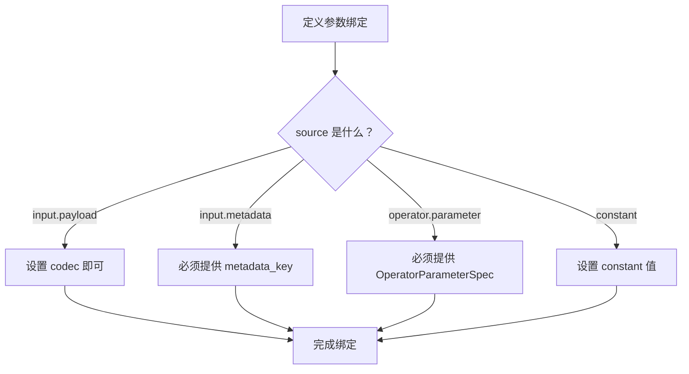

**图表来源**
- [operator_authoring/model.py:129-144](file://operator_authoring/model.py#L129-L144)
- [operator_authoring/model.py:111-127](file://operator_authoring/model.py#L111-L127)

**章节来源**
- [operator_authoring/model.py:111-144](file://operator_authoring/model.py#L111-L144)

### 输出规范 OutputSpec 与 OutputValueSpec 的使用
- payload：主输出值，默认 source=return，codec=bytes
- metadata：多个命名输出，每个使用 OutputValueSpec
- none_policy：keep-original 或 empty
- OutputValueSpec：
  - source：return / return.path / constant
  - path：当 source=return.path 时必须非空
  - codec：bytes/text/json/binary_stream
  - value：当 source=constant 时提供

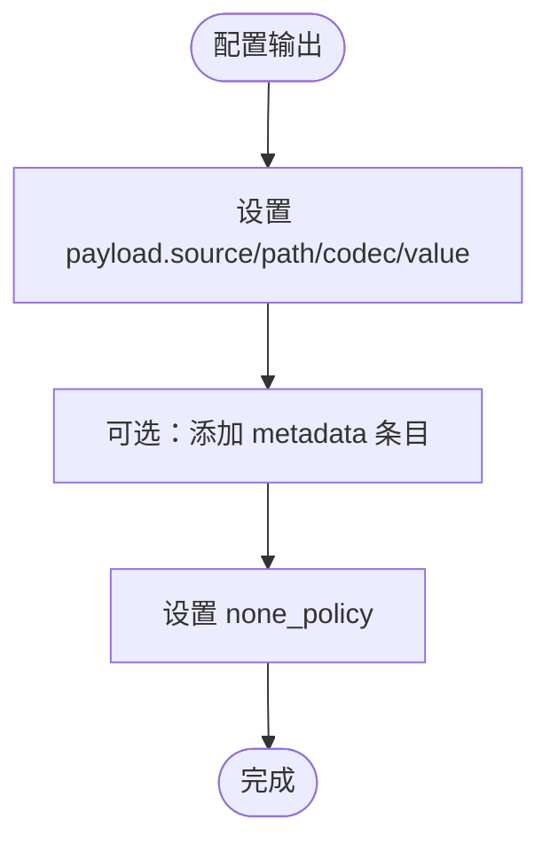

**图表来源**
- [operator_authoring/model.py:167-184](file://operator_authoring/model.py#L167-L184)

**章节来源**
- [operator_authoring/model.py:167-184](file://operator_authoring/model.py#L167-L184)

### 装饰器与自定义参数
- CallableInfo.decorators：记录被扫描到的装饰器列表
- OperatorParameterSpec：用于在 operator.parameter 绑定时声明自定义参数，包括 key、显示名、描述、必填、默认值与类型
- 编译器会将 operator.parameter 绑定合并为统一的 CompiledParameter，并在冲突时报错

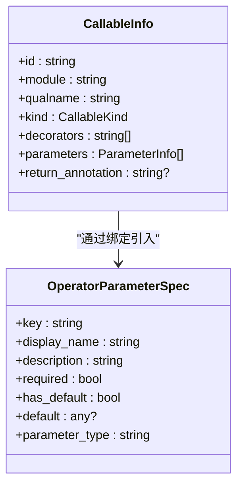

**图表来源**
- [operator_authoring/model.py:58-71](file://operator_authoring/model.py#L58-L71)
- [operator_authoring/model.py:111-127](file://operator_authoring/model.py#L111-L127)

**章节来源**
- [operator_authoring/model.py:58-71](file://operator_authoring/model.py#L58-L71)
- [operator_authoring/model.py:111-127](file://operator_authoring/model.py#L111-L127)

### 从前端请求到虚拟契约的转换
前端通过 CreateVirtualContractRequest 提交算子选择、构造参数绑定、调用参数绑定与输出选择。publish_service/selection.py 将其转换为 VirtualOperatorContract，并填充 metadata、source、target、arguments、output 等字段。

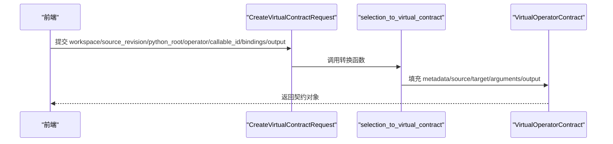

**图表来源**
- [publish_service/model.py:72-80](file://publish_service/model.py#L72-L80)
- [publish_service/selection.py:34-77](file://publish_service/selection.py#L34-L77)

**章节来源**
- [publish_service/model.py:72-80](file://publish_service/model.py#L72-L80)
- [publish_service/selection.py:34-77](file://publish_service/selection.py#L34-L77)

### 契约编译为执行计划
compiler.compile_virtual_contract 负责：
- 校验 source 快照版本与 python_path
- 检查目录录中的语法错误（error 级别）
- 查找目标 callable 并校验支持性（如不支持 async、参数 kind 不合法等）
- 校验构造参数与调用参数绑定完整性与一致性
- 汇总 input_metadata 与 output_metadata
- 计算 contract_sha256 并生成 ExecutionPlan

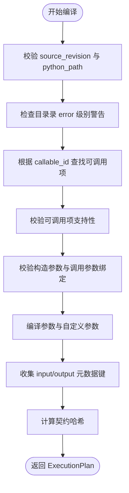

**图表来源**
- [operator_authoring/compiler.py:167-236](file://operator_authoring/compiler.py#L167-L236)

**章节来源**
- [operator_authoring/compiler.py:167-236](file://operator_authoring/compiler.py#L167-L236)

## 依赖关系分析
- operator_authoring/model.py 定义了契约的核心模型与校验逻辑
- operator_authoring/compiler.py 依赖 model.py 的类型与枚举进行编译与校验
- publish_service/model.py 定义 API 层请求模型，复用 model.py 的枚举
- publish_service/selection.py 将 API 请求转换为 VirtualOperatorContract
- publish_service/backends/models.py 扩展 VirtualOperatorContract 为后端契约

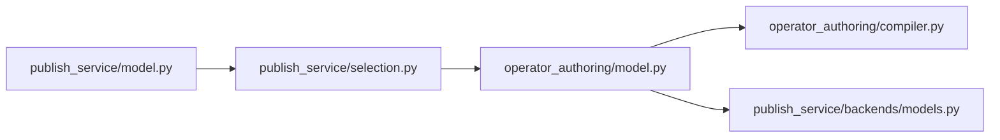

**图表来源**
- [operator_authoring/model.py:111-212](file://operator_authoring/model.py#L111-L212)
- [operator_authoring/compiler.py:9-12](file://operator_authoring/compiler.py#L9-L12)
- [publish_service/model.py:7-8](file://publish_service/model.py#L7-L8)
- [publish_service/selection.py:34-77](file://publish_service/selection.py#L34-L77)
- [publish_service/backends/models.py:7-18](file://publish_service/backends/models.py#L7-L18)

**章节来源**
- [operator_authoring/model.py:111-212](file://operator_authoring/model.py#L111-L212)
- [operator_authoring/compiler.py:9-12](file://operator_authoring/compiler.py#L9-L12)
- [publish_service/model.py:7-8](file://publish_service/model.py#L7-L8)
- [publish_service/selection.py:34-77](file://publish_service/selection.py#L34-L77)
- [publish_service/backends/models.py:7-18](file://publish_service/backends/models.py#L7-L18)

## 性能与可维护性考虑
- 契约哈希：contract_sha256 基于规范化 JSON 计算，保证契约变更可追踪
- 参数合并：CompiledParameter 去重与冲突检测避免重复定义
- 元数据收集：input_metadata 与 output_metadata 排序后稳定输出，便于下游消费
- 可扩展性：后端契约通过继承 VirtualOperatorContract 扩展，保持契约基线一致

[本节为通用指导，不涉及具体文件分析]

## 故障排查指南
常见错误与定位方法：
- 源快照版本不一致：检查 source.source_revision 与目录录快照版本
- Python 路径不安全：确保 python_path 为相对 POSIX 路径且不包含 ..
- 目标可调用项不存在：确认 target.callable_id 在目录录中存在
- 参数绑定缺失或不匹配：检查 required 参数是否绑定，未知参数是否报错
- 构造参数仅在实例方法有效：非实例方法不应提供 constructor_arguments
- 输出路径为空：当 source=return.path 时，path 必须非空
- 自定义参数冲突：同一 key 的 OperatorParameterSpec 定义不一致会报错

**章节来源**
- [operator_authoring/model.py:129-144](file://operator_authoring/model.py#L129-L144)
- [operator_authoring/model.py:167-184](file://operator_authoring/model.py#L167-L184)
- [operator_authoring/model.py:186-200](file://operator_authoring/model.py#L186-L200)
- [operator_authoring/compiler.py:85-136](file://operator_authoring/compiler.py#L85-L136)
- [operator_authoring/compiler.py:167-236](file://operator_authoring/compiler.py#L167-L236)

## 结论
虚拟契约通过严格的模型定义与编译流程，确保算子的可调用性、参数绑定与输出规范的一致性与安全性。借助枚举与校验器，系统在前端选择、契约构建与编译阶段提供了清晰的错误提示与可追溯性。后端契约扩展保持了契约基线的稳定性，同时满足不同运行环境的差异化需求。

[本节为总结性内容，不涉及具体文件分析]

## 附录：字段与枚举速查
- BindingSource：input.payload / input.metadata / operator.parameter / constant
- Codec：bytes / text / json / binary_stream
- NonePolicy：keep-original / empty
- OutputValueSource：return / return.path / constant
- CallableKind：function / instance-method / static-method / class-method

**章节来源**
- [operator_authoring/model.py:16-39](file://operator_authoring/model.py#L16-L39)
- [operator_authoring/model.py:9-13](file://operator_authoring/model.py#L9-L13)