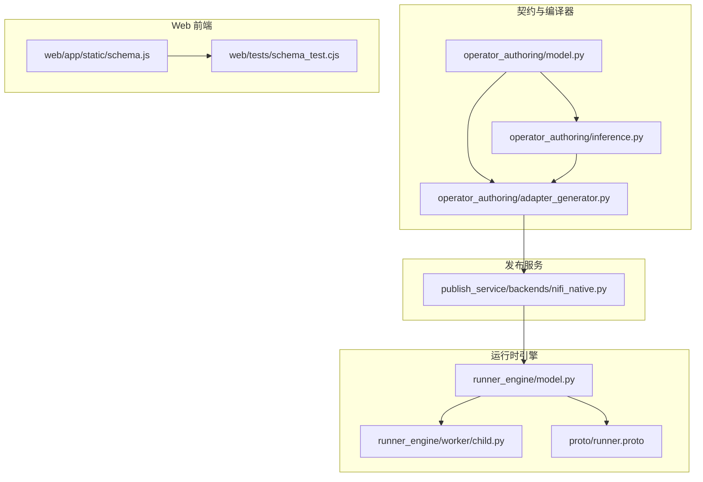
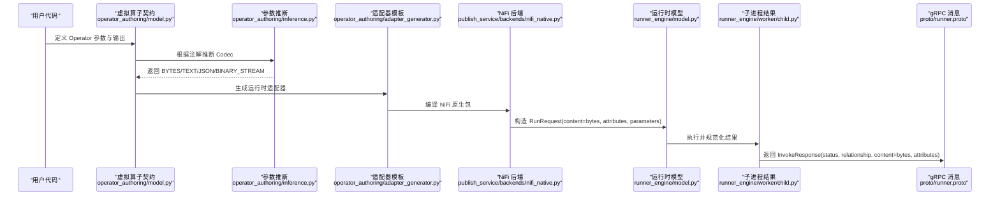
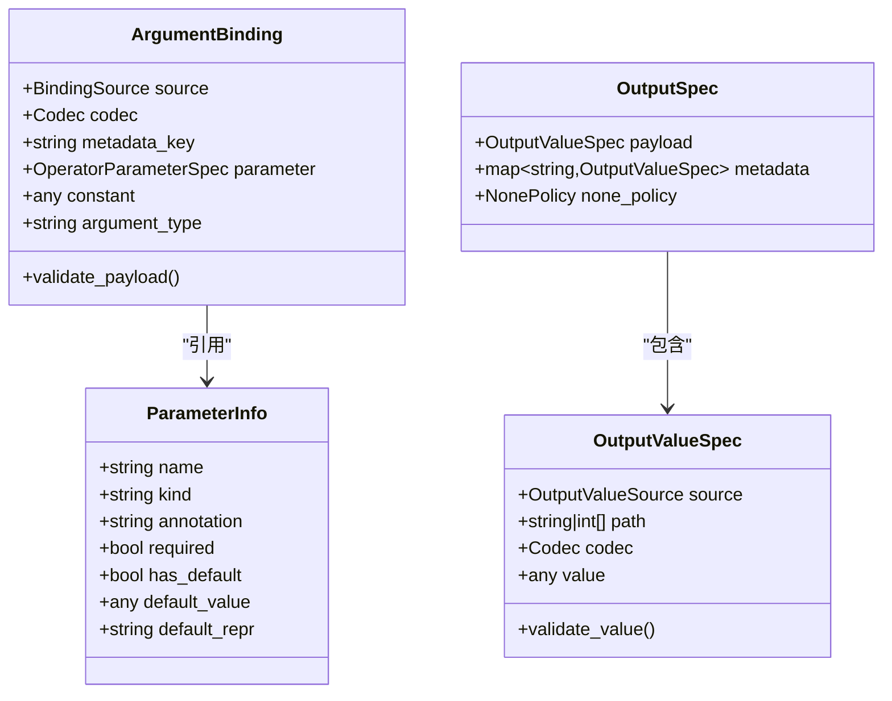
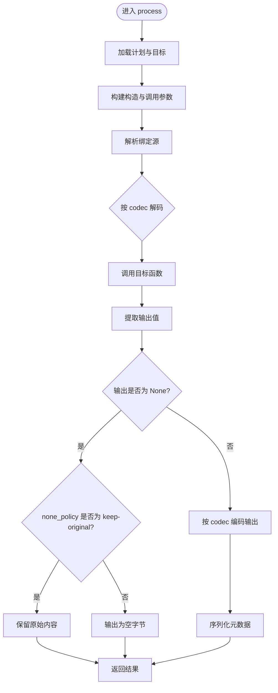
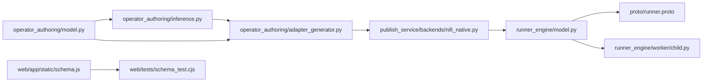

# 类型系统

<cite>
**本文引用的文件**   
- [operator_authoring/model.py](file://operator_authoring/model.py)
- [operator_authoring/inference.py](file://operator_authoring/inference.py)
- [operator_authoring/adapter_generator.py](file://operator_authoring/adapter_generator.py)
- [publish_service/backends/nifi_native.py](file://publish_service/backends/nifi_native.py)
- [runner_engine/model.py](file://runner_engine/model.py)
- [proto/runner.proto](file://proto/runner.proto)
- [runner_engine/worker/child.py](file://runner_engine/worker/child.py)
- [web/tests/schema_test.cjs](file://web/tests/schema_test.cjs)
- [web/app/static/schema.js](file://web/app/static/schema.js)
- [web/RUNTIME_DIAGNOSIS.md](file://web/RUNTIME_DIAGNOSIS.md)
</cite>

## 目录
1. [引言](#引言)
2. [项目结构中的类型相关位置](#项目结构中的类型相关位置)
3. [核心类型与枚举](#核心类型与枚举)
4. [架构总览：从契约到运行时数据流](#架构总览从契约到运行时数据流)
5. [详细组件分析](#详细组件分析)
6. [依赖关系分析](#依赖关系分析)
7. [性能与序列化特性](#性能与序列化特性)
8. [类型验证机制与转换规则](#类型验证机制与转换规则)
9. [兼容性检查与版本迁移策略](#兼容性检查与版本迁移策略)
10. [最佳实践与常见陷阱](#最佳实践与常见陷阱)
11. [故障排查指南](#故障排查指南)
12. [结论](#结论)

## 引言
本技术文档聚焦于该仓库的“类型系统”，目标是解释以下方面：
- 支持的数据类型与类型转换机制，包括基础类型 str、int、float、bool、bytes。
- 复杂类型的处理方式，如列表、字典、自定义对象等的序列化规则。
- Codec 枚举的作用及 BYTES、TEXT、JSON、BINARY_STREAM 的使用场景。
- 类型验证机制和数据转换规则。
- 类型兼容性检查与版本迁移策略。
- 类型定义的最佳实践与常见陷阱。

该系统围绕“算子契约”“参数绑定”“输出映射”“编码解码器”“运行时执行”展开，贯穿编译期（契约解析与适配器生成）与运行期（内容编解码、结果校验）。

## 项目结构中的类型相关位置
类型系统的关键实现分布在以下模块：
- operator_authoring：算子契约模型、推断逻辑、适配器模板生成。
- publish_service：面向 NiFi 原生后端的契约编译与代码生成。
- runner_engine：运行时请求/响应模型、子进程结果规范化与校验。
- proto：gRPC 接口消息定义，统一 content 为 bytes。
- web：前端 Schema 工具与测试，约束 UI 对 codec 的选择行为。

**图表来源**
- [operator_authoring/model.py:23-28](file://operator_authoring/model.py#L23-L28)
- [operator_authoring/inference.py:21-31](file://operator_authoring/inference.py#L21-L31)
- [operator_authoring/adapter_generator.py:44-72](file://operator_authoring/adapter_generator.py#L44-L72)
- [publish_service/backends/nifi_native.py:221-257](file://publish_service/backends/nifi_native.py#L221-L257)
- [runner_engine/model.py:47-70](file://runner_engine/model.py#L47-L70)
- [proto/runner.proto:40-62](file://proto/runner.proto#L40-L62)
- [web/app/static/schema.js:53-63](file://web/app/static/schema.js#L53-L63)
- [web/tests/schema_test.cjs:89-96](file://web/tests/schema_test.cjs#L89-L96)

**章节来源**
- [operator_authoring/model.py:23-28](file://operator_authoring/model.py#L23-L28)
- [operator_authoring/inference.py:21-31](file://operator_authoring/inference.py#L21-L31)
- [operator_authoring/adapter_generator.py:44-72](file://operator_authoring/adapter_generator.py#L44-L72)
- [publish_service/backends/nifi_native.py:221-257](file://publish_service/backends/nifi_native.py#L221-L257)
- [runner_engine/model.py:47-70](file://runner_engine/model.py#L47-L70)
- [proto/runner.proto:40-62](file://proto/runner.proto#L40-L62)
- [web/app/static/schema.js:53-63](file://web/app/static/schema.js#L53-L63)
- [web/tests/schema_test.cjs:89-96](file://web/tests/schema_test.cjs#L89-L96)

## 核心类型与枚举
### Codec 枚举
Codec 是类型系统的核心枚举，定义了四种编码格式：
- BYTES：原始字节或可转为字节的字符串。
- TEXT：文本，最终作为 UTF-8 字节输出。
- JSON：结构化数据，使用 JSON 序列化。
- BINARY_STREAM：二进制流，通常以 BytesIO 形式传递。

这些值在参数推断、适配器生成、NiFi 后端以及运行时中保持一致，确保跨阶段类型一致性。

**章节来源**
- [operator_authoring/model.py:23-28](file://operator_authoring/model.py#L23-L28)

### 基础数据类型
- str：文本类型，对应 TEXT 编码；也可被 bytes 编码器通过 UTF-8 编码处理。
- int、float、bool：主要用于 JSON 序列化；在 JSON 模式下由 json.dumps 处理。
- bytes：二进制数据，对应 BYTES 编码；也用于 gRPC content 字段。

注意：
- 当使用 BYTES 输出时，仅接受 bytes、bytearray 或 str（UTF-8 编码）。
- 当使用 TEXT 输出时，任意值会被 str(value) 后再编码为 UTF-8。
- 当使用 JSON 输出时，需满足 JSON 可序列化要求；不支持 NaN，且会尝试调用 tolist()/item() 以兼容数组库对象。

**章节来源**
- [operator_authoring/adapter_generator.py:164-177](file://operator_authoring/adapter_generator.py#L164-L177)
- [publish_service/backends/nifi_native.py:358-374](file://publish_service/backends/nifi_native.py#L358-L374)
- [runner_engine/model.py:47-70](file://runner_engine/model.py#L47-L70)

### 复杂类型
- list、dict：在 JSON 模式下直接序列化；若包含非标准对象，需要实现 tolist()/item() 或通过自定义 default 函数处理。
- 自定义对象：若提供 tolist() 或 item()，将被转换为 Python 标量或序列；否则抛出不可序列化错误。

**章节来源**
- [operator_authoring/adapter_generator.py:144-162](file://operator_authoring/adapter_generator.py#L144-L162)
- [publish_service/backends/nifi_native.py:338-356](file://publish_service/backends/nifi_native.py#L338-L356)

## 架构总览：从契约到运行时数据流
下图展示从契约定义到运行时执行的类型流转过程：

**图表来源**
- [operator_authoring/model.py:111-183](file://operator_authoring/model.py#L111-L183)
- [operator_authoring/inference.py:21-31](file://operator_authoring/inference.py#L21-L31)
- [operator_authoring/adapter_generator.py:188-238](file://operator_authoring/adapter_generator.py#L188-L238)
- [publish_service/backends/nifi_native.py:385-495](file://publish_service/backends/nifi_native.py#L385-L495)
- [runner_engine/model.py:47-70](file://runner_engine/model.py#L47-L70)
- [runner_engine/worker/child.py:159-190](file://runner_engine/worker/child.py#L159-L190)
- [proto/runner.proto:40-62](file://proto/runner.proto#L40-L62)

## 详细组件分析

### 契约模型与参数绑定
- ParameterInfo：描述算子参数的名称、注解、是否必填、默认值等。
- ArgumentBinding：将输入 payload、metadata、operator.parameter 或常量绑定到算子参数，并指定 codec。
- OutputSpec：定义输出 payload 的来源（return、return.path、constant）、codec 与 none_policy。

关键约束：
- input.metadata 必须提供 metadata_key。
- operator.parameter 必须提供 parameter。
- return.path 必须提供非空 path。
- python_path 必须是相对 POSIX 路径，不能越界。

**图表来源**
- [operator_authoring/model.py:48-71](file://operator_authoring/model.py#L48-L71)
- [operator_authoring/model.py:129-144](file://operator_authoring/model.py#L129-L144)
- [operator_authoring/model.py:167-183](file://operator_authoring/model.py#L167-L183)

**章节来源**
- [operator_authoring/model.py:48-71](file://operator_authoring/model.py#L48-L71)
- [operator_authoring/model.py:129-144](file://operator_authoring/model.py#L129-L144)
- [operator_authoring/model.py:167-183](file://operator_authoring/model.py#L167-L183)

### 参数推断与 Codec 选择
inference.codec_for 根据参数注解和名称推断 Codec：
- 若注解包含 bytes/bytearray → BYTES。
- 若注解包含 dict/list，或名称含 json/record/order/document → JSON。
- 若注解包含 str → TEXT。
- 其他情况：payload 参数默认 BYTES，普通参数默认 TEXT。

这为 UI 建议与自动绑定提供了依据，但实际运行时仍受契约配置与适配器生成的约束。

**章节来源**
- [operator_authoring/inference.py:21-31](file://operator_authoring/inference.py#L21-L31)

### 适配器生成与运行时编解码
adapter_generator 生成 Python 适配器，负责：
- 解析运行时根目录与 python_path。
- 根据 binding 源解析参数（input.payload、input.metadata、operator.parameter、constant）。
- 按 codec 解码输入与编码输出。
- 提取返回值路径或常量。
- 将 None 输出按 none_policy 处理（保留原内容或清空）。

编解码规则：
- BYTES：输入接受 bytes/str；输出接受 bytes/bytearray/str。
- TEXT：输入接受 bytes/任意；输出将 str(value) 编码为 UTF-8。
- JSON：输入接受 bytes/str；输出使用 json.dumps，禁止 NaN，支持 tolist()/item()。
- BINARY_STREAM：输入接受 BytesIO/bytes-like；输出未在此处显式处理，通常由上层决定。

**图表来源**
- [operator_authoring/adapter_generator.py:188-238](file://operator_authoring/adapter_generator.py#L188-L238)
- [operator_authoring/adapter_generator.py:44-72](file://operator_authoring/adapter_generator.py#L44-L72)
- [operator_authoring/adapter_generator.py:164-177](file://operator_authoring/adapter_generator.py#L164-L177)

**章节来源**
- [operator_authoring/adapter_generator.py:44-72](file://operator_authoring/adapter_generator.py#L44-L72)
- [operator_authoring/adapter_generator.py:164-177](file://operator_authoring/adapter_generator.py#L164-L177)
- [operator_authoring/adapter_generator.py:188-238](file://operator_authoring/adapter_generator.py#L188-L238)

### NiFi 原生后端编解码
publish_service/backends/nifi_native.py 同样实现 _decode/_encode_payload，与适配器保持一致：
- BYTES：bytes/str 互转。
- TEXT：bytes→str，任意→str。
- JSON：bytes/str→json.loads，任意→保持。
- BINARY_STREAM：BytesIO/bytes-like→BytesIO。

此外，NiFi 模板还负责：
- 生成 FlowFileTransform 类。
- 将属性与参数注入运行时。
- 将输出写入 FlowFileTransformResult。

**章节来源**
- [publish_service/backends/nifi_native.py:221-257](file://publish_service/backends/nifi_native.py#L221-L257)
- [publish_service/backends/nifi_native.py:358-374](file://publish_service/backends/nifi_native.py#L358-L374)
- [publish_service/backends/nifi_native.py:385-495](file://publish_service/backends/nifi_native.py#L385-L495)

### 运行时模型与 gRPC 协议
runner_engine/model.py 定义 RunRequest/RunResult，其中 content 始终为 bytes，attributes/parameters 为字符串键值对。proto/runner.proto 的 InvokeRequest/InvokeResponse 也采用 bytes content，保证跨语言一致性与高效传输。

**章节来源**
- [runner_engine/model.py:47-70](file://runner_engine/model.py#L47-L70)
- [proto/runner.proto:40-62](file://proto/runner.proto#L40-L62)

### 子进程结果规范化与校验
runner_engine/worker/child.py 对用户返回结果进行规范化：
- 允许 None、bytes、bytearray、str、dict。
- dict 的 attributes 必须为 dict[str, str]。
- 其他类型抛出 InvalidUserResultError。

随后对 content/attributes 进行校验，确保符合运行时契约。

**章节来源**
- [runner_engine/worker/child.py:145-190](file://runner_engine/worker/child.py#L145-L190)

## 依赖关系分析
类型系统各组件之间的依赖如下：
- operator_authoring/model.py 定义契约模型与 Codec。
- operator_authoring/inference.py 依赖 model.py 的 Codec 与 ParameterInfo。
- operator_authoring/adapter_generator.py 依赖 ExecutionPlan 与 model.py 的契约结构。
- publish_service/backends/nifi_native.py 依赖 operator_authoring 的 compiler 与 model。
- runner_engine/model.py 与 proto/runner.proto 共同定义运行时数据结构。
- runner_engine/worker/child.py 负责结果规范化与校验。
- web/app/static/schema.js 与 web/tests/schema_test.cjs 约束前端对 codec 的选择行为。

**图表来源**
- [operator_authoring/model.py:23-28](file://operator_authoring/model.py#L23-L28)
- [operator_authoring/inference.py:21-31](file://operator_authoring/inference.py#L21-L31)
- [operator_authoring/adapter_generator.py:44-72](file://operator_authoring/adapter_generator.py#L44-L72)
- [publish_service/backends/nifi_native.py:221-257](file://publish_service/backends/nifi_native.py#L221-L257)
- [runner_engine/model.py:47-70](file://runner_engine/model.py#L47-L70)
- [proto/runner.proto:40-62](file://proto/runner.proto#L40-L62)
- [web/app/static/schema.js:53-63](file://web/app/static/schema.js#L53-L63)
- [web/tests/schema_test.cjs:89-96](file://web/tests/schema_test.cjs#L89-L96)

**章节来源**
- [operator_authoring/model.py:23-28](file://operator_authoring/model.py#L23-L28)
- [operator_authoring/inference.py:21-31](file://operator_authoring/inference.py#L21-L31)
- [operator_authoring/adapter_generator.py:44-72](file://operator_authoring/adapter_generator.py#L44-L72)
- [publish_service/backends/nifi_native.py:221-257](file://publish_service/backends/nifi_native.py#L221-L257)
- [runner_engine/model.py:47-70](file://runner_engine/model.py#L47-L70)
- [proto/runner.proto:40-62](file://proto/runner.proto#L40-L62)
- [web/app/static/schema.js:53-63](file://web/app/static/schema.js#L53-L63)
- [web/tests/schema_test.cjs:89-96](file://web/tests/schema_test.cjs#L89-L96)

## 性能与序列化特性
- JSON 序列化禁用 NaN，避免浮点异常导致下游解析失败。
- JSON 序列化使用紧凑分隔符以减少体积。
- BYTES 输出避免不必要的中间对象，直接返回 bytes 或 bytearray。
- TEXT 输出统一为 UTF-8，便于网络传输与存储。
- BINARY_STREAM 使用 BytesIO，适合大文件或流式数据，减少内存拷贝。

**章节来源**
- [operator_authoring/adapter_generator.py:175-177](file://operator_authoring/adapter_generator.py#L175-L177)
- [publish_service/backends/nifi_native.py:371-374](file://publish_service/backends/nifi_native.py#L371-L374)

## 类型验证机制与转换规则
### 契约层验证
- ArgumentBinding.validate_payload：校验 input.metadata 与 operator.parameter 的必需字段。
- OutputValueSpec.validate_value：校验 return.path 的非空 path。
- SourceSpec.validate_python_path：校验 python_path 的相对性与安全性。

### 运行时验证
- child._normalize_result：限制用户返回类型为 None/bytes/bytearray/str/dict，并对 attributes 做 dict[str, str] 校验。
- service._validate_attributes：校验 attributes 与 parameters 的键值类型。
- agent._validate_child_result：校验子进程返回结果的结构与状态。

### 转换规则
- BYTES：bytes/str ↔ bytes。
- TEXT：任意 → str → UTF-8 bytes。
- JSON：bytes/str → JSON 对象；任意 → 保持原样（输出时序列化）。
- BINARY_STREAM：bytes-like → BytesIO。

**章节来源**
- [operator_authoring/model.py:129-144](file://operator_authoring/model.py#L129-L144)
- [operator_authoring/model.py:167-183](file://operator_authoring/model.py#L167-L183)
- [operator_authoring/model.py:191-200](file://operator_authoring/model.py#L191-L200)
- [runner_engine/worker/child.py:159-190](file://runner_engine/worker/child.py#L159-L190)

## 兼容性检查与版本迁移策略
- 契约版本：VirtualOperatorContract.api_version 固定为 dsc.virtual-operator/v1，execution_model 固定为 direct，表明当前契约版本稳定。
- 编译器版本：COMPILER_VERSION="nifi-native-contract-v2"，用于标识 NiFi 原生后端的编译契约版本。
- variant_key：基于 contract_sha256、backend、compiler_version、options 计算，确保不同选项生成唯一变体，利于缓存与回滚。
- 前端约束：schema.js 与 schema_test.cjs 明确禁止 enum 顺序自动选择默认 codec，尊重显式默认值，避免 UI 误选 bytes。

迁移建议：
- 升级契约版本时需同步更新 api_version 与 compiler_version，并评估现有 release 的兼容性。
- 变更 codec 默认行为时，应通过显式默认值与 UI 提示引导用户调整，避免破坏现有流程。
- 对旧版 release，应保持 immutable source/release 不变，仅在发布服务侧生成新变体。

**章节来源**
- [operator_authoring/model.py:203-212](file://operator_authoring/model.py#L203-L212)
- [publish_service/backends/nifi_native.py:20-27](file://publish_service/backends/nifi_native.py#L20-L27)
- [publish_service/backends/nifi_native.py:137-151](file://publish_service/backends/nifi_native.py#L137-L151)
- [web/tests/schema_test.cjs:89-96](file://web/tests/schema_test.cjs#L89-L96)

## 最佳实践与常见陷阱
### 最佳实践
- 明确标注参数类型：使用 bytes/bytearray、str、dict/list 等注解，以便 inference 正确推断 Codec。
- 优先使用 JSON 输出结构化数据：便于下游解析与扩展。
- 大文件使用 BINARY_STREAM：避免一次性加载到内存。
- 谨慎使用 BYTES 输出：确保业务函数返回 bytes/bytearray/str，避免隐式 str() 化。
- 设置合理的 none_policy：如需保留上游内容，选择 keep-original；否则清空输出。

### 常见陷阱
- 误将 dict 当作 bytes 输出：BYTES 编码器不会自动将 dict 转为字符串，会抛出类型错误。
- JSON 中包含 NaN：json.dumps 会拒绝 NaN，需替换为 null 或数值。
- 自定义对象未实现 tolist()/item()：JSON 序列化失败，需实现相应方法或提供自定义 default。
- 忘记设置 metadata_key：input.metadata 绑定必须提供 key，否则会校验失败。
- 前端误选 bytes：UI 不应自动选择 enum 第一个值，需尊重显式默认值。

**章节来源**
- [operator_authoring/inference.py:21-31](file://operator_authoring/inference.py#L21-L31)
- [operator_authoring/adapter_generator.py:164-177](file://operator_authoring/adapter_generator.py#L164-L177)
- [operator_authoring/adapter_generator.py:144-162](file://operator_authoring/adapter_generator.py#L144-L162)
- [operator_authoring/model.py:129-144](file://operator_authoring/model.py#L129-L144)
- [web/tests/schema_test.cjs:89-96](file://web/tests/schema_test.cjs#L89-L96)

## 故障排查指南
- 若出现“operator result content must be bytes, bytearray, str, or None”，检查业务函数返回值类型是否符合规范。
- 若出现“result attributes must be dict[str, str]”，检查 attributes 是否为字符串键值对。
- 若 JSON 序列化失败，检查对象是否包含 NaN 或未实现 tolist()/item()。
- 若 BYTES 输出报错，确认返回值是否为 bytes/bytearray/str。
- 若 UI 显示“原始字节”警告，说明选择了 bytes 输出，需确认业务函数能正确处理字节或文本。

参考诊断文档：
- web/RUNTIME_DIAGNOSIS.md 指出即使业务函数返回注解写了 dict，也只能作为线索；实际分支返回类型与输出映射结果还需要运行记录确认。调试日志只需要记录 type(payload_value).__name__ 等类型信息，不必记录可能包含敏感数据的完整内容。

**章节来源**
- [runner_engine/worker/child.py:145-190](file://runner_engine/worker/child.py#L145-L190)
- [web/RUNTIME_DIAGNOSIS.md:74-97](file://web/RUNTIME_DIAGNOSIS.md#L74-L97)

## 结论
该类型系统以 Codec 为核心，贯穿契约定义、参数推断、适配器生成、NiFi 后端与运行时执行。通过严格的验证机制与一致的编解码规则，确保数据在不同阶段的一致性。实践中应明确标注类型、选择合适的 codec、遵循序列化约束，并注意前端与后端的默认行为差异，以避免常见陷阱。对于版本迁移，应关注契约版本与编译器版本的变化，并通过 variant_key 管理不同变体，确保向后兼容与可回滚性。