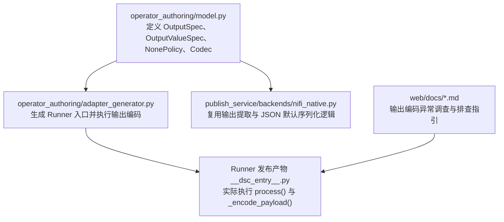
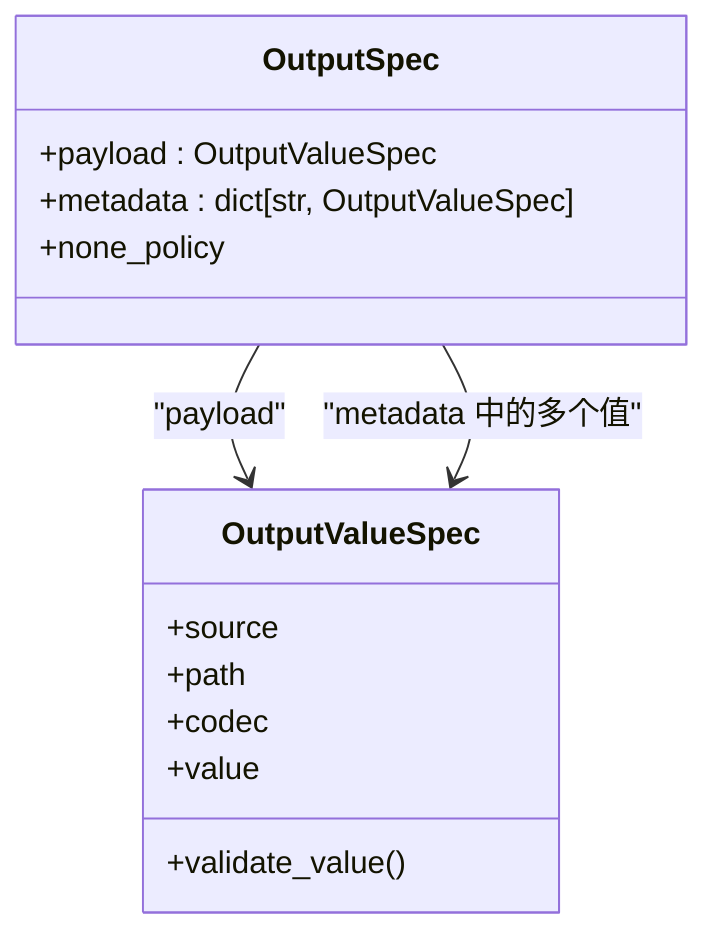
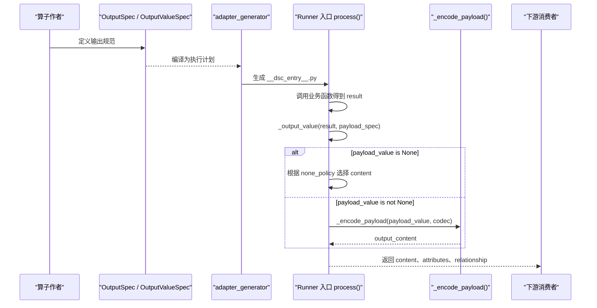
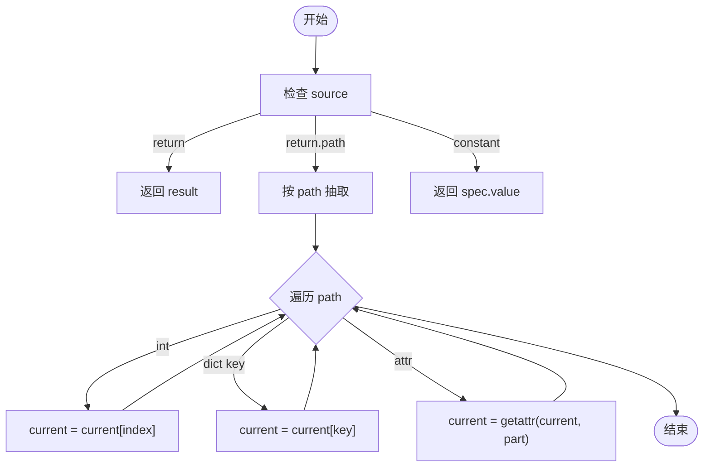
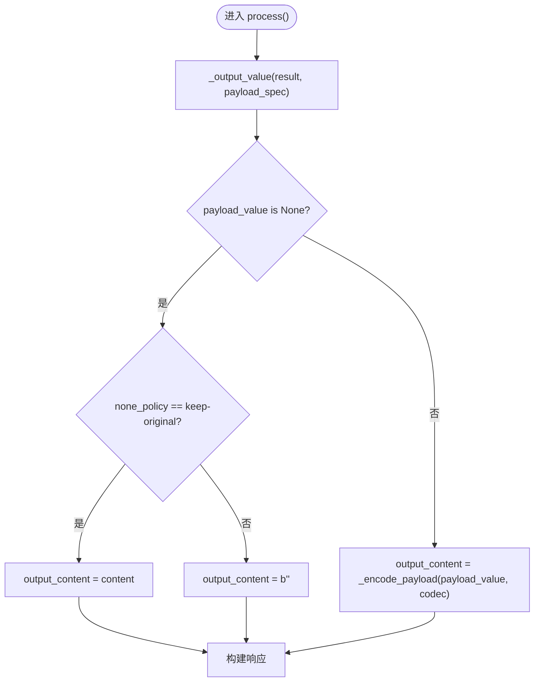
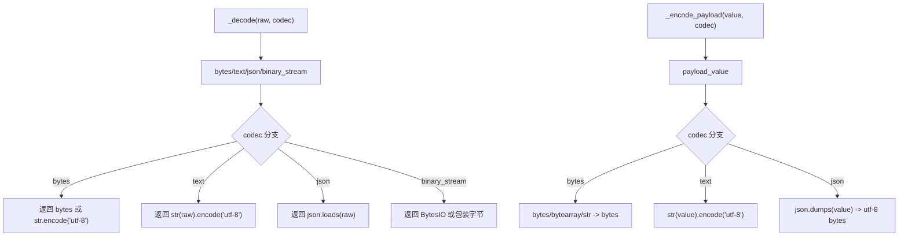
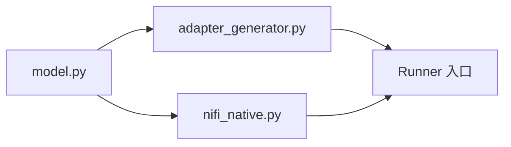

# 输出规范

<cite>
**本文引用的文件**   
- [operator_authoring/model.py](file://operator_authoring/model.py)
- [operator_authoring/adapter_generator.py](file://operator_authoring/adapter_generator.py)
- [publish_service/backends/nifi_native.py](file://publish_service/backends/nifi_native.py)
- [web/docs/output-codec-investigation.md](file://web/docs/output-codec-investigation.md)
- [web/RUNTIME_DIAGNOSIS.md](file://web/RUNTIME_DIAGNOSIS.md)
</cite>

## 目录
1. [引言](#引言)
2. [项目结构](#项目结构)
3. [核心组件](#核心组件)
4. [架构总览](#架构总览)
5. [详细组件分析](#详细组件分析)
6. [依赖关系分析](#依赖关系分析)
7. [性能与行为特征](#性能与行为特征)
8. [故障排查指南](#故障排查指南)
9. [结论](#结论)
10. [附录：最佳实践与设计模式](#附录最佳实践与设计模式)

## 引言
本文围绕“输出规范”展开，系统性解释输出数据的定义、处理机制和运行时行为。重点包括：
- OutputSpec 的结构与配置项含义
- 输出源类型 RETURN、RETURN_PATH、CONSTANT 的使用方式
- 输出路径解析规则与嵌套数据结构访问
- NonePolicy 的空值处理策略
- 输出数据的序列化与反序列化过程
- 输出规范的设计模式与最佳实践

该文档面向希望理解或扩展算子输出行为的开发者与维护者，既提供高层概念说明，也给出代码级实现映射。

## 项目结构
与输出规范直接相关的代码主要分布在以下位置：
- 模型定义层：`operator_authoring/model.py`
- 运行时代码生成器：`operator_authoring/adapter_generator.py`
- NiFi 原生后端复用逻辑：`publish_service/backends/nifi_native.py`
- Web 侧诊断与调查文档：`web/docs/output-codec-investigation.md`、`web/RUNTIME_DIAGNOSIS.md`

**图表来源**
- [operator_authoring/model.py:167-183](file://operator_authoring/model.py#L167-L183)
- [operator_authoring/adapter_generator.py:122-177](file://operator_authoring/adapter_generator.py#L122-L177)
- [publish_service/backends/nifi_native.py:311-356](file://publish_service/backends/nifi_native.py#L311-L356)
- [web/docs/output-codec-investigation.md:1-121](file://web/docs/output-codec-investigation.md#L1-L121)
- [web/RUNTIME_DIAGNOSIS.md:1-97](file://web/RUNTIME_DIAGNOSIS.md#L1-L97)

**章节来源**
- [operator_authoring/model.py:167-212](file://operator_authoring/model.py#L167-L212)
- [operator_authoring/adapter_generator.py:122-255](file://operator_authoring/adapter_generator.py#L122-L255)
- [publish_service/backends/nifi_native.py:311-356](file://publish_service/backends/nifi_native.py#L311-L356)
- [web/docs/output-codec-investigation.md:1-121](file://web/docs/output-codec-investigation.md#L1-L121)
- [web/RUNTIME_DIAGNOSIS.md:1-97](file://web/RUNTIME_DIAGNOSIS.md#L1-L97)

## 核心组件
本节聚焦输出规范的核心数据结构和运行时处理逻辑。

### OutputSpec 与 OutputValueSpec
- OutputSpec 描述算子的整体输出契约，包含：
  - payload：主输出载荷的规格
  - metadata：键到输出值的映射，每个键对应一个 OutputValueSpec
  - none_policy：空值处理策略
- OutputValueSpec 描述单个输出值的来源、路径、编码格式与常量值：
  - source：输出源类型（RETURN、RETURN_PATH、CONSTANT）
  - path：当 source 为 RETURN_PATH 时，用于从返回值中抽取字段的路径
  - codec：输出编码格式（BYTES、TEXT、JSON、BINARY_STREAM）
  - value：当 source 为 CONSTANT 时使用的常量值

**图表来源**
- [operator_authoring/model.py:167-183](file://operator_authoring/model.py#L167-L183)

**章节来源**
- [operator_authoring/model.py:167-183](file://operator_authoring/model.py#L167-L183)

### 输出源类型
- RETURN：直接使用业务函数的返回值作为输出值
- RETURN_PATH：根据 path 从返回值中抽取嵌套字段
- CONSTANT：忽略函数返回值，使用配置的常量值

这些源类型在运行时由 `_output_value()` 处理，并在 adapter_generator 与 nifi_native 后端中保持一致的实现语义。

**章节来源**
- [operator_authoring/model.py:35-38](file://operator_authoring/model.py#L35-L38)
- [operator_authoring/adapter_generator.py:134-142](file://operator_authoring/adapter_generator.py#L134-L142)
- [publish_service/backends/nifi_native.py:325-335](file://publish_service/backends/nifi_native.py#L325-L335)

### NonePolicy 空值处理
- KEEP_ORIGINAL：当 payload 值为 None 时，保留原始输入内容
- EMPTY：当 payload 值为 None 时，输出空字节

该策略在 Runner 入口的 `process()` 中生效，决定最终 output_content 的值。

**章节来源**
- [operator_authoring/model.py:30-33](file://operator_authoring/model.py#L30-L33)
- [operator_authoring/adapter_generator.py:221-228](file://operator_authoring/adapter_generator.py#L221-L228)

### 编码格式 Codec
- BYTES：期望 bytes、bytearray 或 str；str 会被 UTF-8 编码为 bytes
- TEXT：将任意值转为字符串后 UTF-8 编码
- JSON：将对象序列化为 JSON 字符串再 UTF-8 编码
- BINARY_STREAM：用于二进制流场景，支持 BytesIO 或字节类输入

**章节来源**
- [operator_authoring/model.py:23-28](file://operator_authoring/model.py#L23-L28)
- [operator_authoring/adapter_generator.py:164-177](file://operator_authoring/adapter_generator.py#L164-L177)

## 架构总览
下图展示从模型定义到运行时输出的完整流程：

**图表来源**
- [operator_authoring/model.py:167-183](file://operator_authoring/model.py#L167-L183)
- [operator_authoring/adapter_generator.py:188-238](file://operator_authoring/adapter_generator.py#L188-L238)

## 详细组件分析

### 输出源与路径解析
- `_output_value()` 根据 spec.source 分支：
  - return：返回 result
  - return.path：通过 `_extract()` 按 path 抽取
  - constant：返回 spec.value
- `_extract()` 支持：
  - 整数索引访问列表元素
  - 字典键访问
  - 对象属性访问

**图表来源**
- [operator_authoring/adapter_generator.py:122-142](file://operator_authoring/adapter_generator.py#L122-L142)
- [publish_service/backends/nifi_native.py:311-335](file://publish_service/backends/nifi_native.py#L311-L335)

**章节来源**
- [operator_authoring/adapter_generator.py:122-142](file://operator_authoring/adapter_generator.py#L122-L142)
- [publish_service/backends/nifi_native.py:311-335](file://publish_service/backends/nifi_native.py#L311-L335)

### 空值处理策略
- 当 payload_value 为 None：
  - none_policy == keep-original：output_content = 原始输入 content
  - none_policy == empty：output_content = b""
- 当 payload_value 不为 None：
  - 使用 _encode_payload() 按 codec 编码

**图表来源**
- [operator_authoring/adapter_generator.py:217-228](file://operator_authoring/adapter_generator.py#L217-L228)

**章节来源**
- [operator_authoring/adapter_generator.py:217-228](file://operator_authoring/adapter_generator.py#L217-L228)

### 序列化与反序列化
- 反序列化（输入阶段）：
  - _decode() 根据 binding.codec 对 input.payload、input.metadata、operator.parameter 进行解码
  - 支持 bytes、text、json、binary_stream
- 序列化（输出阶段）：
  - _encode_payload() 根据 payload.codec 对 payload_value 进行编码
  - 支持 bytes、text、json；不支持 binary_stream 的输出编码
  - JSON 序列化使用自定义 default 函数以兼容 numpy 等数组类型

**图表来源**
- [operator_authoring/adapter_generator.py:44-72](file://operator_authoring/adapter_generator.py#L44-L72)
- [operator_authoring/adapter_generator.py:164-177](file://operator_authoring/adapter_generator.py#L164-L177)
- [operator_authoring/adapter_generator.py:144-162](file://operator_authoring/adapter_generator.py#L144-L162)

**章节来源**
- [operator_authoring/adapter_generator.py:44-72](file://operator_authoring/adapter_generator.py#L44-L72)
- [operator_authoring/adapter_generator.py:144-177](file://operator_authoring/adapter_generator.py#L144-L177)

### 元数据输出
- metadata 是一个键到 OutputValueSpec 的映射
- 每个元数据值同样经过 _output_value() 提取，然后转换为文本：
  - str：直接返回
  - bytes：UTF-8 解码
  - 其他：JSON 序列化

**章节来源**
- [operator_authoring/adapter_generator.py:180-185](file://operator_authoring/adapter_generator.py#L180-L185)
- [operator_authoring/adapter_generator.py:230-232](file://operator_authoring/adapter_generator.py#L230-L232)

## 依赖关系分析
- model.py 定义了输出规范的抽象模型，被 adapter_generator 与 publish_service 共享
- adapter_generator 生成 Runner 入口代码，负责：
  - 解析执行计划
  - 调用业务函数
  - 应用输出规范
  - 编码输出
- nifi_native.py 复用了相同的输出提取与 JSON 默认序列化逻辑，保证不同后端的一致性

**图表来源**
- [operator_authoring/model.py:167-183](file://operator_authoring/model.py#L167-L183)
- [operator_authoring/adapter_generator.py:122-177](file://operator_authoring/adapter_generator.py#L122-L177)
- [publish_service/backends/nifi_native.py:311-356](file://publish_service/backends/nifi_native.py#L311-L356)

**章节来源**
- [operator_authoring/model.py:167-183](file://operator_authoring/model.py#L167-L183)
- [operator_authoring/adapter_generator.py:122-177](file://operator_authoring/adapter_generator.py#L122-L177)
- [publish_service/backends/nifi_native.py:311-356](file://publish_service/backends/nifi_native.py#L311-L356)

## 性能与行为特征
- 路径抽取 `_extract()` 的时间复杂度与 path 长度线性相关
- JSON 序列化可能触发自定义 default 函数，对 numpy 等类型进行转换
- bytes 编码分支会避免不必要的拷贝，但 str 转 bytes 会产生一次 UTF-8 编码
- text 编码会将任意对象转为字符串，可能带来额外开销
- binary_stream 主要用于输入解码，输出编码未直接支持该 codec

[本节为通用性能讨论，不直接分析具体文件]

## 故障排查指南
当出现输出编码异常时，建议按以下步骤定位：

1. 确认保存的契约与实际生成的 output_spec 是否一致
   - 检查 VirtualContract.output 与 backendContract
2. 对照运行产物 __dsc_entry__.py
   - 查看 output_spec["payload"]["codec"] 的实际值
   - 查看 payload_value 的类型与来源
3. 判断是配置问题还是生成器问题
   - 若契约为 bytes 而 payload_value 为 dict/list/int/None，优先检查输出格式配置
   - 若契约为 json 但生成入口仍使用 bytes，检查 selection→contract→compiler→release writer
4. 记录最小必要信息
   - 业务 Callable 返回值类型
   - 当前 contractVersion
   - 生成入口中 _encode_payload() 附近逻辑

**章节来源**
- [web/RUNTIME_DIAGNOSIS.md:1-97](file://web/RUNTIME_DIAGNOSIS.md#L1-L97)
- [web/docs/output-codec-investigation.md:1-121](file://web/docs/output-codec-investigation.md#L1-L121)

## 结论
输出规范通过 OutputSpec 与 OutputValueSpec 明确描述了算子输出的来源、路径、编码与空值策略。运行时由 adapter_generator 生成的入口代码统一处理输出提取与编码，确保不同后端行为一致。正确配置 codec 与 source 是避免运行时错误的关键；当出现异常时，应优先核对契约、生成入口与业务返回值类型，而不是盲目修改生成器容错逻辑。

[本节为总结性内容，不直接分析具体文件]

## 附录：最佳实践与设计模式

### 设计模式
- 声明式输出契约：通过 OutputSpec 声明输出结构，而非硬编码处理逻辑
- 可插拔输出源：RETURN、RETURN_PATH、CONSTANT 提供灵活的输出来源
- 统一编码接口：_encode_payload() 与 _decode() 提供一致的编解码抽象
- 空值策略可配置：NonePolicy 允许在不同场景下控制空输出行为

### 最佳实践
- 明确约定业务函数返回值类型，并与 OutputValueSpec.codec 匹配
- 使用 RETURN_PATH 精确抽取嵌套字段，避免返回整个大对象
- 对于结构化数据，优先选择 JSON 编码，便于下游解析
- 对于二进制数据，谨慎选择 bytes 或 binary_stream，并确保上下游协议一致
- 在 None 场景下，根据业务需求选择 KEEP_ORIGINAL 或 EMPTY
- 避免在 bytes 分支自动将复杂对象转为字符串，以免掩盖契约错误

[本节为通用指导，不直接分析具体文件]