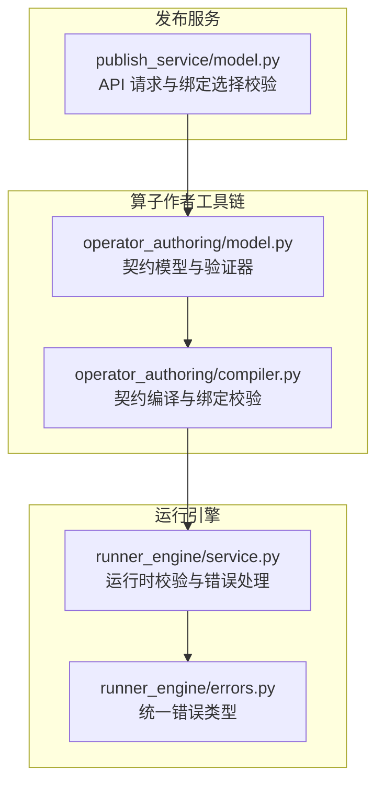
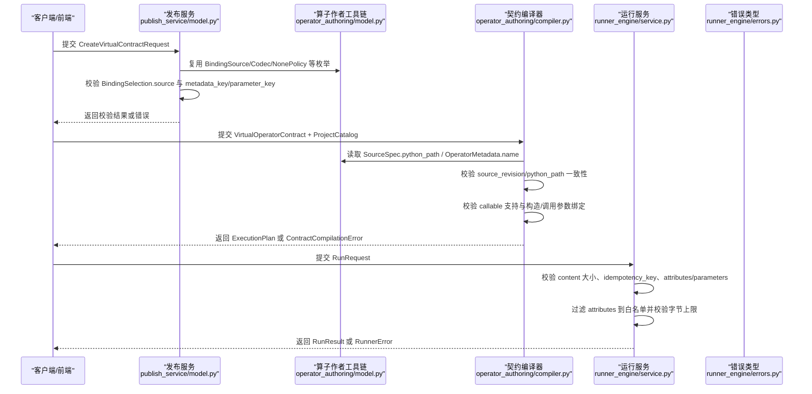
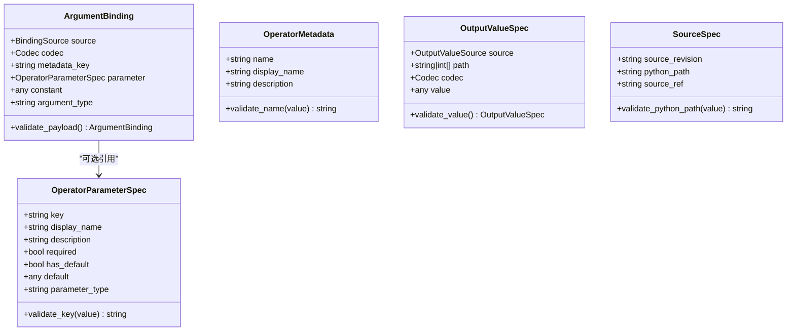
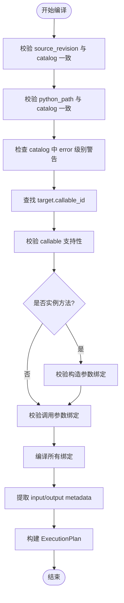
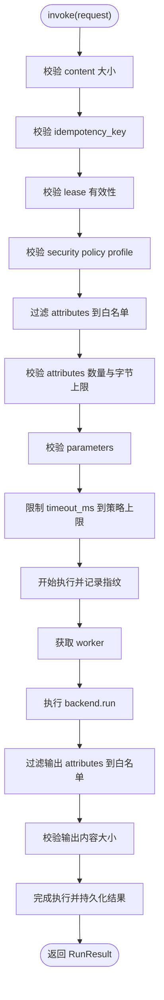
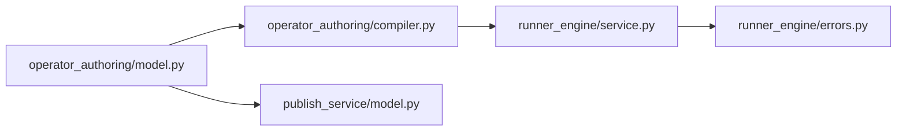

# 验证机制

<cite>
**本文引用的文件**   
- [operator_authoring/model.py](file://operator_authoring/model.py)
- [publish_service/model.py](file://publish_service/model.py)
- [operator_authoring/compiler.py](file://operator_authoring/compiler.py)
- [runner_engine/service.py](file://runner_engine/service.py)
- [runner_engine/errors.py](file://runner_engine/errors.py)
- [web/docs/output-codec-investigation.md](file://web/docs/output-codec-investigation.md)
</cite>

## 目录
1. [简介](#简介)
2. [项目结构](#项目结构)
3. [核心组件](#核心组件)
4. [架构总览](#架构总览)
5. [详细组件分析](#详细组件分析)
6. [依赖关系分析](#依赖关系分析)
7. [性能与限制](#性能与限制)
8. [故障排查指南](#故障排查指南)
9. [结论](#结论)

## 简介
本文围绕“契约验证”和“参数绑定验证”展开，系统性说明以下能力：
- 使用 Pydantic 的字段级与模型级验证器进行契约校验。
- 将用户或前端选择的绑定配置编译为可执行计划，并检查必填、默认值、来源合法性。
- 对元数据（如算子名称）进行格式与字符集限制。
- 对 Python 路径进行相对路径与安全边界校验。
- 在运行时服务中对属性、内容大小、超时等做安全与容量限制。
- 统一错误类型与调试建议，帮助快速定位常见失败原因。

## 项目结构
本仓库中与验证相关的主要代码集中在以下模块：
- operator_authoring：算子作者工具链，定义契约模型、字段/模型验证器，以及将契约编译为执行计划的逻辑。
- publish_service：对外 API 请求模型，复用算子侧的枚举与策略，提供绑定选择校验。
- runner_engine：运行时服务，负责调用前后的输入输出安全校验、资源限制与错误处理。

**图表来源**
- [operator_authoring/model.py:1-212](file://operator_authoring/model.py#L1-L212)
- [operator_authoring/compiler.py:1-237](file://operator_authoring/compiler.py#L1-L237)
- [publish_service/model.py:1-92](file://publish_service/model.py#L1-L92)
- [runner_engine/service.py:1-456](file://runner_engine/service.py#L1-L456)
- [runner_engine/errors.py:1-22](file://runner_engine/errors.py#L1-L22)

**章节来源**
- [operator_authoring/model.py:1-212](file://operator_authoring/model.py#L1-L212)
- [operator_authoring/compiler.py:1-237](file://operator_authoring/compiler.py#L1-L237)
- [publish_service/model.py:1-92](file://publish_service/model.py#L1-L92)
- [runner_engine/service.py:1-456](file://runner_engine/service.py#L1-L456)
- [runner_engine/errors.py:1-22](file://runner_engine/errors.py#L1-L22)

## 核心组件
- 契约模型与验证器：定义算子契约、参数规范、绑定来源、输出规范等数据结构，并通过 field_validator 与 model_validator 实现字段级与跨字段校验。
- 契约编译器：将虚拟算子契约与项目目录扫描结果合并，生成 ExecutionPlan；同时检查源快照一致性、目标可调用项支持性、构造参数与调用参数的绑定完整性。
- 发布服务请求模型：对外暴露 BindingSelection 等请求体，复用底层枚举与策略，并在模型层完成绑定来源与键的一致性校验。
- 运行服务：在执行前后对 attributes、parameters、content 大小、超时等进行校验与过滤，保证安全与稳定。

**章节来源**
- [operator_authoring/model.py:10-212](file://operator_authoring/model.py#L10-L212)
- [operator_authoring/compiler.py:18-237](file://operator_authoring/compiler.py#L18-L237)
- [publish_service/model.py:15-83](file://publish_service/model.py#L15-L83)
- [runner_engine/service.py:25-78](file://runner_engine/service.py#L25-L78)

## 架构总览
下图展示从“契约定义 → 编译校验 → 运行时执行”的端到端流程，以及各阶段的验证点。

**图表来源**
- [publish_service/model.py:24-50](file://publish_service/model.py#L24-L50)
- [operator_authoring/model.py:186-212](file://operator_authoring/model.py#L186-L212)
- [operator_authoring/compiler.py:167-237](file://operator_authoring/compiler.py#L167-L237)
- [runner_engine/service.py:188-235](file://runner_engine/service.py#L188-L235)
- [runner_engine/errors.py:1-22](file://runner_engine/errors.py#L1-L22)

## 详细组件分析

### 契约模型与验证器（operator_authoring/model.py）
该模块定义了算子契约的核心数据结构，并使用 Pydantic 的 field_validator 与 model_validator 实现多层校验。

- 字段级验证器（field_validator）
  - OperatorParameterSpec.key：去除空白后不能为空，确保算子参数键有效。
  - OperatorMetadata.name：去除空白后不能为空，且仅允许字母、数字、点、下划线与连字符，用于控制算子标识符的命名规范。
  - SourceSpec.python_path：规范化相对 POSIX 路径，禁止绝对路径、反斜杠与“..”越界片段，确保 Python 路径始终位于源码快照内。

- 模型级验证器（model_validator, mode="after"）
  - ArgumentBinding.validate_payload：当 source 为 input.metadata 时必须提供 metadata_key；当 source 为 operator.parameter 时必须提供 parameter。
  - OutputValueSpec.validate_value：当 source 为 return.path 时必须提供非空 path。

这些规则共同保证了契约在“字段正确性”和“跨字段一致性”两个层面都满足约束。

**图表来源**
- [operator_authoring/model.py:111-143](file://operator_authoring/model.py#L111-L143)
- [operator_authoring/model.py:150-164](file://operator_authoring/model.py#L150-L164)
- [operator_authoring/model.py:167-177](file://operator_authoring/model.py#L167-L177)
- [operator_authoring/model.py:186-200](file://operator_authoring/model.py#L186-L200)

**章节来源**
- [operator_authoring/model.py:111-143](file://operator_authoring/model.py#L111-L143)
- [operator_authoring/model.py:150-164](file://operator_authoring/model.py#L150-L164)
- [operator_authoring/model.py:167-177](file://operator_authoring/model.py#L167-L177)
- [operator_authoring/model.py:186-200](file://operator_authoring/model.py#L186-L200)

### 契约编译器与参数绑定验证（operator_authoring/compiler.py）
编译器负责将 VirtualOperatorContract 与 ProjectCatalog 合并为 ExecutionPlan，并在过程中执行严格的绑定校验。

- 参数映射与绑定校验
  - _parameter_map：将 ParameterInfo 列表映射为按名称索引的字典。
  - _validate_bindings：检查未知参数绑定与缺失的必填参数绑定，若存在则抛出 ContractCompilationError。
  - _compile_binding：根据 binding.source 生成执行期所需字段；当 source 为 operator.parameter 时，需合并 OperatorParameterSpec 到 CompiledParameter，并检测重复定义冲突。
  - _compile_bindings：遍历参数定义与绑定，生成最终绑定字典。

- 契约编译主流程
  - 校验 source_revision 与 catalog 一致，python_path 与 catalog 一致。
  - 检查 catalog 中的 error 级别警告，若有语法错误直接拒绝。
  - 查找 target.callable_id，校验其支持性（例如不支持异步、参数 kind 受限）。
  - 针对实例方法，校验 class_target 与 constructor 参数绑定。
  - 校验 invoke arguments 绑定完整性。
  - 汇总所有绑定，提取 input_metadata 与 output_metadata，构建 ExecutionPlan。

**图表来源**
- [operator_authoring/compiler.py:81-149](file://operator_authoring/compiler.py#L81-L149)
- [operator_authoring/compiler.py:167-237](file://operator_authoring/compiler.py#L167-L237)

**章节来源**
- [operator_authoring/compiler.py:81-149](file://operator_authoring/compiler.py#L81-L149)
- [operator_authoring/compiler.py:167-237](file://operator_authoring/compiler.py#L167-L237)

### 发布服务请求模型（publish_service/model.py）
对外 API 的请求模型通过 ApiModel 启用驼峰别名，并复用 operator_authoring 的枚举与策略。

- BindingSelection.validate_binding：当 source 为 input.metadata 时必须提供 metadataKey；当 source 为 operator.parameter 时必须提供 parameterKey。
- OutputValueSelection 与 OutputSelection：定义输出来源、路径、编码与 none_policy。
- CreateVirtualContractRequest：聚合 workspace、source_revision、python_root、operator、callable_id、constructor_bindings、argument_bindings、output 等字段。

该层在前端与后端之间建立一致的契约语义，避免非法绑定进入后续编译阶段。

**章节来源**
- [publish_service/model.py:15-83](file://publish_service/model.py#L15-L83)

### 运行时服务校验（runner_engine/service.py）
运行服务在执行前后对输入输出进行严格的安全与容量限制，确保系统稳定性。

- 属性校验与过滤
  - _filter_attributes：根据 release.input_attributes 白名单过滤 attributes。
  - _validate_attributes：校验 attributes 必须为 dict[str, str]，限制数量与总字节数。
- 请求指纹与幂等
  - _request_fingerprint：基于 schema、release_id、content_sha256、attributes、parameters、timeout_ms 计算指纹，用于幂等缓存。
- 调用入口校验
  - 校验 inline content 大小上限。
  - 校验 idempotency_key 必填。
  - 校验 lease 有效性。
  - 校验 security policy profile 是否存在。
  - 过滤并校验 attributes 与 parameters。
  - 限制 timeout_ms 到策略上限。
- 结果校验与清理
  - 过滤 result.attributes 到 release.output_attributes 白名单。
  - 校验输出内容大小上限。
  - 根据 status 与 error_code 决定 worker 重用或失效。
  - 统一捕获 RunnerError 与通用异常，记录数据库状态并抛出标准化错误。

**图表来源**
- [runner_engine/service.py:25-78](file://runner_engine/service.py#L25-L78)
- [runner_engine/service.py:188-331](file://runner_engine/service.py#L188-L331)

**章节来源**
- [runner_engine/service.py:25-78](file://runner_engine/service.py#L25-L78)
- [runner_engine/service.py:188-331](file://runner_engine/service.py#L188-L331)

### 错误类型与处理（runner_engine/errors.py）
- RunnerError：统一错误基类，包含 code、message 与 retryable 标志，便于上层网关与日志系统分类处理。
- CatalogError、LeaseError、QuotaError、SandboxError：细分领域错误子类，便于精准定位问题域。

**章节来源**
- [runner_engine/errors.py:1-22](file://runner_engine/errors.py#L1-L22)

## 依赖关系分析
- operator_authoring/model.py 被 publish_service/model.py 与 operator_authoring/compiler.py 引用，作为契约与绑定的基础模型。
- operator_authoring/compiler.py 依赖 model.py 的枚举与模型，生成 ExecutionPlan。
- runner_engine/service.py 不直接依赖 model.py，但通过 Release/Catalog/Pool 等组件间接消费编译产物，并对运行时输入输出进行校验。
- 错误体系由 runner_engine/errors.py 提供，被 service.py 与 gateway 层使用。

**图表来源**
- [operator_authoring/model.py:1-212](file://operator_authoring/model.py#L1-L212)
- [operator_authoring/compiler.py:1-237](file://operator_authoring/compiler.py#L1-L237)
- [publish_service/model.py:1-92](file://publish_service/model.py#L1-L92)
- [runner_engine/service.py:1-456](file://runner_engine/service.py#L1-L456)
- [runner_engine/errors.py:1-22](file://runner_engine/errors.py#L1-L22)

**章节来源**
- [operator_authoring/model.py:1-212](file://operator_authoring/model.py#L1-L212)
- [operator_authoring/compiler.py:1-237](file://operator_authoring/compiler.py#L1-L237)
- [publish_service/model.py:1-92](file://publish_service/model.py#L1-L92)
- [runner_engine/service.py:1-456](file://runner_engine/service.py#L1-L456)
- [runner_engine/errors.py:1-22](file://runner_engine/errors.py#L1-L22)

## 性能与限制
- 运行时内容大小限制：inline content 与输出内容均限制在 8 MiB 以内，防止大对象阻塞工作进程。
- 属性限制：attributes 数量上限为 128，总字节数上限为 64 KiB，避免元数据过大影响序列化与传输。
- 超时限制：timeout_ms 会被限制到策略允许的最大值，防止长时间占用 worker。
- 编译阶段：ExecutionPlan 会收集 input_metadata 与 output_metadata 列表，便于下游按需传递与优化。

[本节为通用指导，不直接分析具体文件]

## 故障排查指南

### 常见验证失败原因与解决方案
- 字段级校验失败
  - OperatorParameterSpec.key 为空：确保参数键非空且已去除空白。
  - OperatorMetadata.name 非法字符：仅允许字母、数字、点、下划线与连字符，避免特殊字符。
  - SourceSpec.python_path 不安全：避免绝对路径、反斜杠与“..”，保持相对 POSIX 路径。
- 模型级校验失败
  - ArgumentBinding：当 source 为 input.metadata 时缺少 metadata_key；当 source 为 operator.parameter 时缺少 parameter。
  - OutputValueSpec：当 source 为 return.path 时缺少非空 path。
- 编译期绑定校验失败
  - 未知参数绑定：bindings 中包含未定义的参数名。
  - 缺失必填参数绑定：required 参数未提供绑定。
  - 构造参数绑定位置错误：仅在实例方法上允许 constructor_arguments。
  - 目标可调用项不存在或不支持：callable_id 不存在或函数/方法不被支持（如异步、参数 kind 不支持）。
- 运行时校验失败
  - content 超过 8 MiB：拆分或外部存储大对象。
  - 缺少 idempotency_key：调用方必须提供幂等键。
  - attributes 类型或大小超限：确保 attributes 为 dict[str, str]，控制数量与字节上限。
  - 输出内容超过 8 MiB：调整业务返回值或输出编码策略。

### 调试技巧
- 检查保存的契约与输出配置：确认 virtualContract.output.payload.codec 与实际返回值类型匹配，避免 bytes/text/json/binary_stream 误配。
- 对比 AST 扫描结果与前端传入的 parameter_type：确保类型信息一致，减少运行时解码异常。
- 查看 ExecutionPlan 的 input_metadata 与 output_metadata：确认上游 attributes 与下游输出字段是否正确声明。
- 关注 RunnerError.code 与 retryable：区分可重试错误与不可重试错误，合理设计重试策略。

**章节来源**
- [web/docs/output-codec-investigation.md:27-57](file://web/docs/output-codec-investigation.md#L27-L57)
- [runner_engine/service.py:188-331](file://runner_engine/service.py#L188-L331)

## 结论
本项目的验证机制以 Pydantic 为核心，贯穿“契约定义 → 编译校验 → 运行时执行”全链路：
- 在契约层通过 field_validator 与 model_validator 实现字段级与跨字段一致性校验。
- 在编译层通过 _validate_bindings 与 compile_virtual_contract 确保参数绑定完整、目标可调用项受支持、源快照一致。
- 在运行层通过 _filter_attributes 与 _validate_attributes 保障输入输出的安全与容量可控。
- 通过统一的 RunnerError 与 ContractCompilationError 提供清晰的错误分类与调试线索。

遵循上述规则与排查建议，可有效降低契约配置错误与运行时异常的概率，提升系统的稳定性与可维护性。