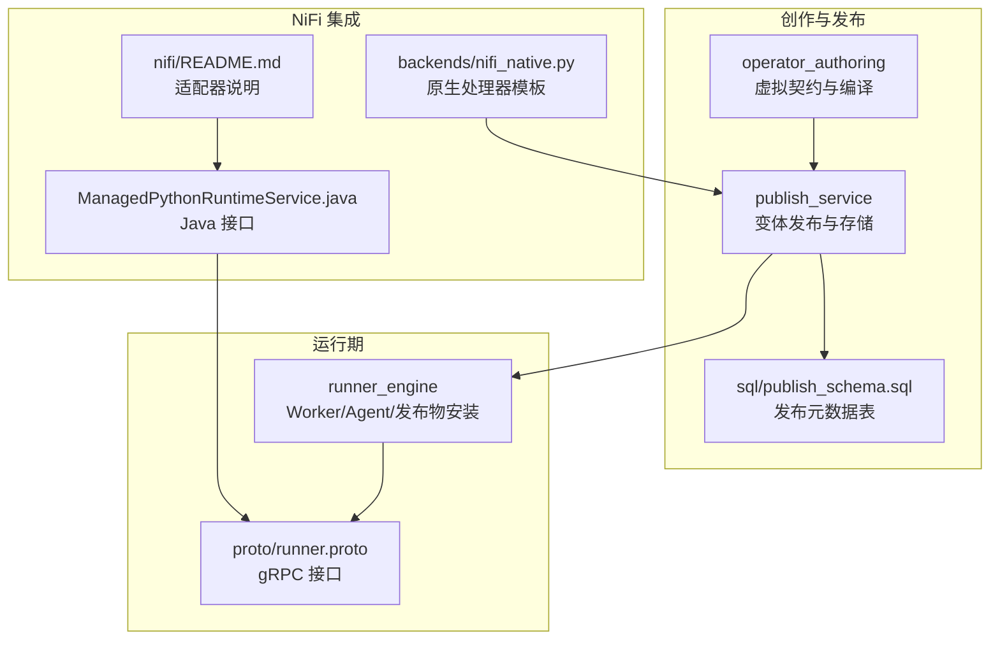
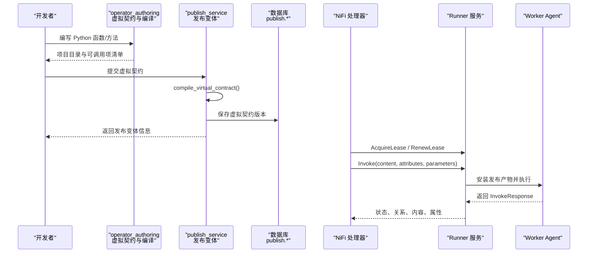
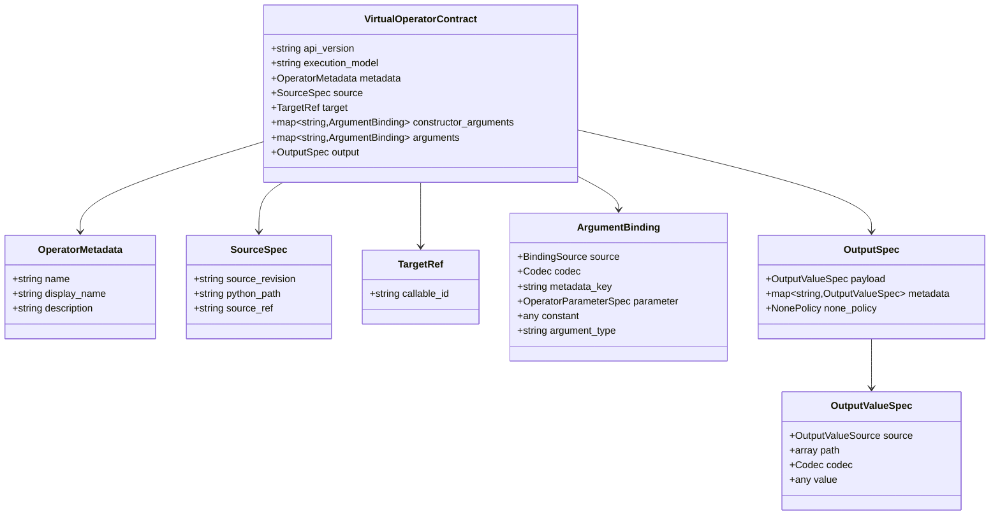
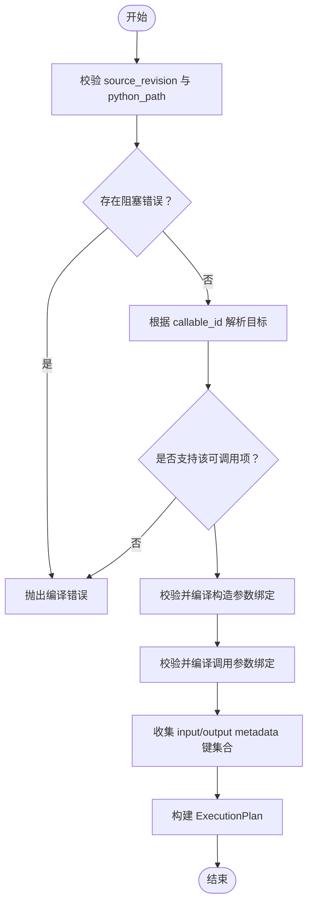
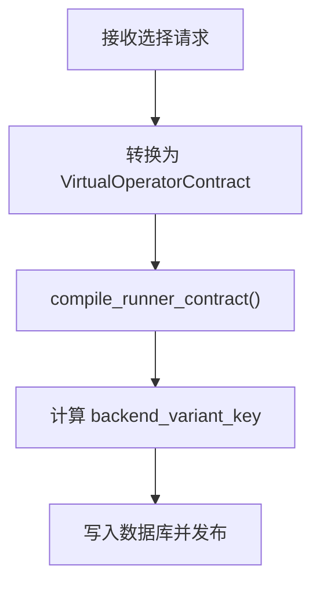
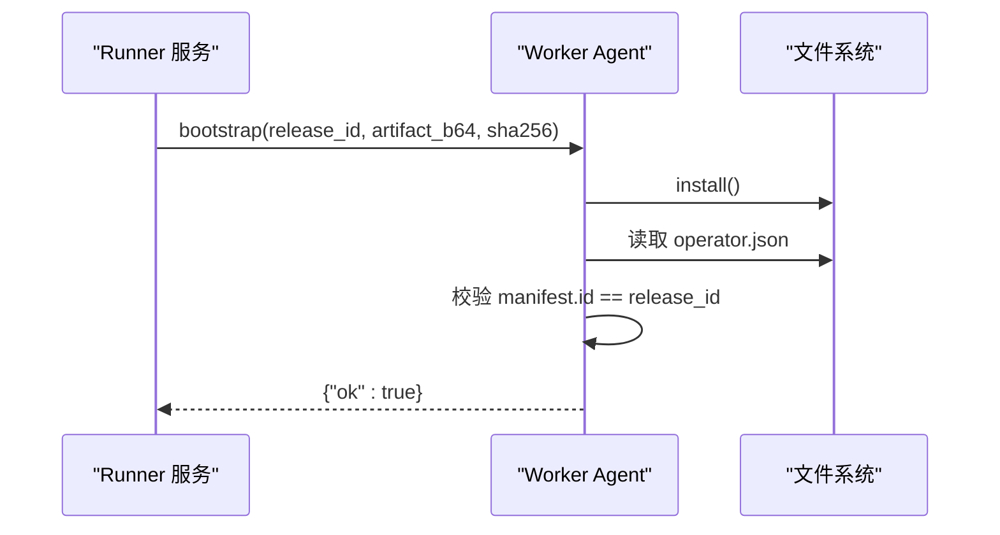
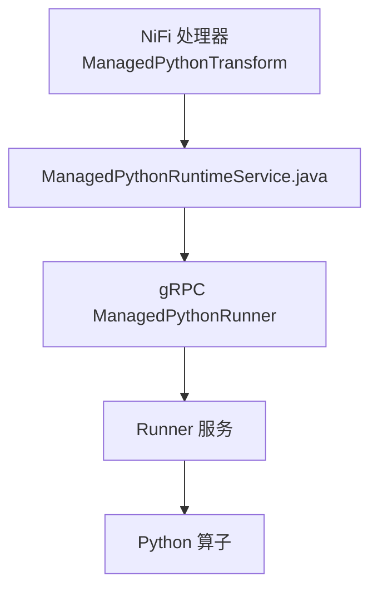
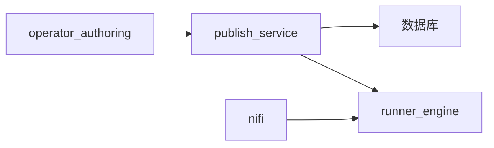

# 算子基础概念

<cite>
**本文引用的文件**   
- [operator_authoring/model.py](file://operator_authoring/model.py)
- [operator_authoring/compiler.py](file://operator_authoring/compiler.py)
- [proto/runner.proto](file://proto/runner.proto)
- [publish_service/backends/runner.py](file://publish_service/backends/runner.py)
- [publish_service/selection.py](file://publish_service/selection.py)
- [publish_service/service.py](file://publish_service/service.py)
- [publish_service/store.py](file://publish_service/store.py)
- [sql/publish_schema.sql](file://sql/publish_schema.sql)
- [nifi/README.md](file://nifi/README.md)
- [nifi/managed-python-processors/src/main/java/com/dsc/nifi/ManagedPythonRuntimeService.java](file://nifi/managed-python-processors/src/main/java/com/dsc/nifi/ManagedPythonRuntimeService.java)
- [publish_service/backends/nifi_native.py](file://publish_service/backends/nifi_native.py)
- [runner_engine/worker/agent.py](file://runner_engine/worker/agent.py)
</cite>

## 目录
1. [引言](#引言)
2. [项目结构](#项目结构)
3. [核心组件](#核心组件)
4. [架构总览](#架构总览)
5. [详细组件分析](#详细组件分析)
6. [依赖关系分析](#依赖关系分析)
7. [性能与运行时特性](#性能与运行时特性)
8. [故障排查指南](#故障排查指南)
9. [结论](#结论)
10. [附录：示例与最佳实践](#附录示例与最佳实践)

## 引言
本章节面向初次接触该系统的开发者，解释“算子（Operator）”是什么、在 NiFi 生态中扮演什么角色，以及为什么需要“虚拟契约（Virtual Contract）”和“运行时环境”。

- 算子：以 Python 函数或类方法为执行目标的可复用数据处理单元。它通过“虚拟契约”描述输入、输出、参数与依赖，由编译期生成可执行的“执行计划”，并在隔离的“运行时环境”中被调度执行。
- 在 NiFi 生态中的作用：NiFi 原生处理器负责编排 FlowFile 流转；算子则提供可插拔、可发布、可版本化的业务逻辑实现。两者通过 gRPC 接口与租约机制协作，既保持 NiFi 的稳定边界，又允许 Python 侧灵活扩展。
- 关键术语
  - 虚拟契约：声明式描述算子的元数据、源码位置、目标调用点、参数绑定与输出规则。
  - 运行时环境：Runner 进程或容器，负责安装发布产物、加载源码、执行算子并返回结果。
  - 生命周期管理：从创建算子、编译契约、发布变体、到运行期租约获取与释放的全流程控制。

本节不直接分析具体代码文件，因此不附“章节来源”。

## 项目结构
仓库围绕“算子创作—编译发布—运行调度—NiFi 集成”的主线组织：

- operator_authoring：算子创作与静态扫描，产出项目目录与可调用项清单。
- publish_service：将虚拟契约编译为后端适配契约，持久化并发布变体。
- runner_engine：运行期服务，负责安装发布产物、维护 Worker、暴露 gRPC 接口。
- nifi：NiFi 适配器，封装 ManagedPythonTransform 与共享 Controller Service。
- proto：Runner 与 NiFi 之间的 gRPC 协议定义。
- sql：发布与算子元数据的数据库表结构。

**图表来源**
- [operator_authoring/model.py:203-212](file://operator_authoring/model.py#L203-L212)
- [operator_authoring/compiler.py:167-236](file://operator_authoring/compiler.py#L167-L236)
- [publish_service/backends/runner.py:17-37](file://publish_service/backends/runner.py#L17-L37)
- [publish_service/store.py:51-105](file://publish_service/store.py#L51-L105)
- [sql/publish_schema.sql:1-31](file://sql/publish_schema.sql#L1-L31)
- [runner_engine/worker/agent.py:353-368](file://runner_engine/worker/agent.py#L353-L368)
- [proto/runner.proto:8-15](file://proto/runner.proto#L8-L15)
- [nifi/README.md:3-13](file://nifi/README.md#L3-L13)
- [nifi/managed-python-processors/src/main/java/com/dsc/nifi/ManagedPythonRuntimeService.java:7-48](file://nifi/managed-python-processors/src/main/java/com/dsc/nifi/ManagedPythonRuntimeService.java#L7-L48)
- [publish_service/backends/nifi_native.py:171-186](file://publish_service/backends/nifi_native.py#L171-L186)

**章节来源**
- [operator_authoring/model.py:203-212](file://operator_authoring/model.py#L203-L212)
- [operator_authoring/compiler.py:167-236](file://operator_authoring/compiler.py#L167-L236)
- [publish_service/backends/runner.py:17-37](file://publish_service/backends/runner.py#L17-L37)
- [publish_service/store.py:51-105](file://publish_service/store.py#L51-L105)
- [sql/publish_schema.sql:1-31](file://sql/publish_schema.sql#L1-L31)
- [runner_engine/worker/agent.py:353-368](file://runner_engine/worker/agent.py#L353-L368)
- [proto/runner.proto:8-15](file://proto/runner.proto#L8-L15)
- [nifi/README.md:3-13](file://nifi/README.md#L3-L13)
- [nifi/managed-python-processors/src/main/java/com/dsc/nifi/ManagedPythonRuntimeService.java:7-48](file://nifi/managed-python-processors/src/main/java/com/dsc/nifi/ManagedPythonRuntimeService.java#L7-L48)
- [publish_service/backends/nifi_native.py:171-186](file://publish_service/backends/nifi_native.py#L171-L186)

## 核心组件
- 虚拟契约（Virtual Operator Contract）
  - 描述算子的元数据、源码快照、目标调用点、构造参数与调用参数绑定、输出规范。
  - 关键字段包括：api_version、execution_model、metadata、source、target、constructor_arguments、arguments、output。
- 编译期（Compiler）
  - 校验契约与源码快照一致性，扫描可调用项，生成 ExecutionPlan。
  - 将 BindingSource 映射为运行时可消费的参数结构，收集 input/output metadata 列表。
- Runner 运行时
  - 通过 gRPC 暴露 Health/AcquireLease/RenewLease/Invoke/Cancel/ReleaseLease 等能力。
  - Worker Agent 负责安装发布产物、校验 manifest、维护 release 缓存。
- NiFi 适配器
  - 提供 ManagedPythonTransform 处理器与共享 Controller Service。
  - 通过 Lease 机制保证幂等与重试安全，属性边界由 allow-list 控制。

**章节来源**
- [operator_authoring/model.py:203-212](file://operator_authoring/model.py#L203-L212)
- [operator_authoring/compiler.py:167-236](file://operator_authoring/compiler.py#L167-L236)
- [proto/runner.proto:8-15](file://proto/runner.proto#L8-L15)
- [runner_engine/worker/agent.py:353-368](file://runner_engine/worker/agent.py#L353-L368)
- [nifi/README.md:3-13](file://nifi/README.md#L3-L13)

## 架构总览
下图展示从“算子创作”到“NiFi 调度执行”的关键路径：

**图表来源**
- [operator_authoring/compiler.py:167-236](file://operator_authoring/compiler.py#L167-L236)
- [publish_service/store.py:51-105](file://publish_service/store.py#L51-L105)
- [sql/publish_schema.sql:14-25](file://sql/publish_schema.sql#L14-L25)
- [proto/runner.proto:8-15](file://proto/runner.proto#L8-L15)
- [runner_engine/worker/agent.py:353-368](file://runner_engine/worker/agent.py#L353-L368)

## 详细组件分析

### 虚拟契约与算子模型
虚拟契约是算子的“蓝图”，它将 Python 源代码中的可调用项抽象为统一的契约对象，便于跨语言、跨运行时进行编译与分发。

**图表来源**
- [operator_authoring/model.py:111-143](file://operator_authoring/model.py#L111-L143)
- [operator_authoring/model.py:150-164](file://operator_authoring/model.py#L150-L164)
- [operator_authoring/model.py:167-183](file://operator_authoring/model.py#L167-L183)
- [operator_authoring/model.py:186-200](file://operator_authoring/model.py#L186-L200)
- [operator_authoring/model.py:203-212](file://operator_authoring/model.py#L203-L212)

**章节来源**
- [operator_authoring/model.py:111-143](file://operator_authoring/model.py#L111-L143)
- [operator_authoring/model.py:150-164](file://operator_authoring/model.py#L150-L164)
- [operator_authoring/model.py:167-183](file://operator_authoring/model.py#L167-L183)
- [operator_authoring/model.py:186-200](file://operator_authoring/model.py#L186-L200)
- [operator_authoring/model.py:203-212](file://operator_authoring/model.py#L203-L212)

### 编译期：从虚拟契约到执行计划
编译器负责将虚拟契约与源码快照对齐，验证可调用项支持性，并将参数绑定转换为运行时可消费的结构。

**图表来源**
- [operator_authoring/compiler.py:167-236](file://operator_authoring/compiler.py#L167-L236)

**章节来源**
- [operator_authoring/compiler.py:167-236](file://operator_authoring/compiler.py#L167-L236)

### 发布服务：变体编译与存储
发布服务将虚拟契约编译为后端适配契约，计算变体键，持久化并发布变体。对于 runner 后端，使用固定编译器版本语义。

**图表来源**
- [publish_service/selection.py:34-77](file://publish_service/selection.py#L34-L77)
- [publish_service/backends/runner.py:17-37](file://publish_service/backends/runner.py#L17-L37)
- [publish_service/store.py:51-105](file://publish_service/store.py#L51-L105)

**章节来源**
- [publish_service/selection.py:34-77](file://publish_service/selection.py#L34-L77)
- [publish_service/backends/runner.py:17-37](file://publish_service/backends/runner.py#L17-L37)
- [publish_service/store.py:51-105](file://publish_service/store.py#L51-L105)

### Runner 运行时与 Worker Agent
Runner 通过 gRPC 暴露能力，Worker Agent 负责安装发布产物、校验 manifest 并缓存 release。

**图表来源**
- [runner_engine/worker/agent.py:353-368](file://runner_engine/worker/agent.py#L353-L368)

**章节来源**
- [runner_engine/worker/agent.py:353-368](file://runner_engine/worker/agent.py#L353-L368)

### NiFi 原生处理器与算子的关系
NiFi 原生处理器负责 FlowFile 的调度与流转，算子作为可发布的 Python 逻辑被远程调用。二者差异如下：

- NiFi 原生处理器
  - 位于 JVM 内，直接操作 FlowFile 与属性。
  - 通过 ManagedPythonRuntimeService 与 Runner 通信。
- 算子（Python）
  - 以函数或方法为执行目标，通过虚拟契约描述输入输出与参数。
  - 在 Runner 中隔离执行，避免污染 NiFi 节点环境。

**图表来源**
- [nifi/README.md:3-13](file://nifi/README.md#L3-L13)
- [nifi/managed-python-processors/src/main/java/com/dsc/nifi/ManagedPythonRuntimeService.java:7-48](file://nifi/managed-python-processors/src/main/java/com/dsc/nifi/ManagedPythonRuntimeService.java#L7-L48)
- [proto/runner.proto:8-15](file://proto/runner.proto#L8-L15)

**章节来源**
- [nifi/README.md:3-13](file://nifi/README.md#L3-L13)
- [nifi/managed-python-processors/src/main/java/com/dsc/nifi/ManagedPythonRuntimeService.java:7-48](file://nifi/managed-python-processors/src/main/java/com/dsc/nifi/ManagedPythonRuntimeService.java#L7-L48)
- [proto/runner.proto:8-15](file://proto/runner.proto#L8-L15)

## 依赖关系分析
- operator_authoring 依赖 pydantic 模型定义虚拟契约与编译数据结构。
- publish_service 依赖 operator_authoring 的编译结果，并通过 store 与数据库交互。
- runner_engine 通过 worker.agent 管理发布产物与执行上下文。
- nifi 模块通过 Java 接口与 Runner 的 gRPC 协议对接。

**图表来源**
- [operator_authoring/model.py:203-212](file://operator_authoring/model.py#L203-L212)
- [publish_service/store.py:51-105](file://publish_service/store.py#L51-L105)
- [runner_engine/worker/agent.py:353-368](file://runner_engine/worker/agent.py#L353-L368)
- [nifi/README.md:3-13](file://nifi/README.md#L3-L13)

**章节来源**
- [operator_authoring/model.py:203-212](file://operator_authoring/model.py#L203-L212)
- [publish_service/store.py:51-105](file://publish_service/store.py#L51-L105)
- [runner_engine/worker/agent.py:353-368](file://runner_engine/worker/agent.py#L353-L368)
- [nifi/README.md:3-13](file://nifi/README.md#L3-L13)

## 性能与运行时特性
- 幂等性与重试
  - NiFi 侧基于 processor-id、release-id、FlowFile uuid 生成稳定 idempotency key，Runner 侧 invocation_id 用于取消与观测。
- 租约与超时
  - 通过 AcquireLease/RenewLease 维持运行期租约，Runner 报告 LEASE_UNKNOWN/LEASE_EXPIRED 时 NiFi 重新获取。
- 属性边界
  - Input Attribute Allow-list 控制离开 JVM 的属性集，Runner 侧再次过滤返回属性。
- 编译期优化
  - ExecutionPlan 预计算 input/output metadata 键集合，减少运行时反射开销。

**章节来源**
- [nifi/README.md:15-34](file://nifi/README.md#L15-L34)
- [proto/runner.proto:23-62](file://proto/runner.proto#L23-L62)
- [operator_authoring/compiler.py:217-235](file://operator_authoring/compiler.py#L217-L235)

## 故障排查指南
- 编译阶段
  - 若 source_revision 或 python_path 不一致，会抛出编译错误。
  - 若目标可调用项不支持（如异步方法），会列出原因并失败。
  - 若构造参数或调用参数绑定缺失或冲突，会提示缺失或冲突的参数键。
- 发布阶段
  - 若虚拟契约无 immutable source_ref，会拒绝加载当前父契约。
  - 数据库写入失败或找不到算子时会抛出相应错误。
- 运行阶段
  - Worker Agent 安装发布产物后校验 manifest.id 与 release_id 一致，否则报错。
  - gRPC 调用失败时，NiFi 侧依据 lease 状态重试或重新获取租约。

建议排查步骤：
1. 检查虚拟契约的 source_revision 与源码快照是否匹配。
2. 确认目标 callable_id 是否存在且支持 Direct Invoke v1。
3. 核对参数绑定是否覆盖所有 required 参数且无冲突。
4. 查看 Runner 日志，确认发布产物安装与 manifest 校验成功。
5. 在 NiFi 侧检查属性 allow-list 与租户/项目权限配置。

**章节来源**
- [operator_authoring/compiler.py:167-236](file://operator_authoring/compiler.py#L167-L236)
- [publish_service/service.py:546-567](file://publish_service/service.py#L546-L567)
- [runner_engine/worker/agent.py:353-368](file://runner_engine/worker/agent.py#L353-L368)
- [nifi/README.md:15-34](file://nifi/README.md#L15-L34)

## 结论
算子体系通过“虚拟契约 + 编译期计划 + 隔离运行时 + NiFi 适配器”的分层设计，实现了 Python 业务逻辑的可插拔、可发布、可版本化与高可靠执行。开发者只需关注函数或方法的输入输出与参数，其余由系统完成编译、发布、调度与安全边界控制。

## 附录：示例与最佳实践

### 何时使用 Python 算子
- 适合场景
  - 复杂的数据清洗、转换、聚合逻辑，需要丰富的 Python 生态库。
  - 需要独立发布、版本管理与灰度回滚的业务处理单元。
  - 希望与 NiFi 原生处理器解耦，避免 JVM 环境变更风险。
- 不适合场景
  - 极轻量、对延迟极其敏感的处理，可直接使用 NiFi 原生处理器。
  - 需要深度访问 NiFi 内部 API 的场景，应优先使用原生处理器。

### 简单算子示例（概念性）
- 输入
  - payload：文本或二进制流，经 Codec 解码为 Python 对象。
  - metadata：若干字符串键值，按 binding 注入。
  - parameters：算子参数，由 OperatorParameterSpec 定义。
- 处理
  - 目标函数或实例方法接收已绑定的参数，执行业务逻辑。
- 输出
  - payload：按 OutputValueSpec.source 与 codec 编码。
  - metadata：按 OutputValueSpec 映射到返回属性。
  - none_policy：控制空值策略。

注意：此处仅给出概念性说明，不展示具体代码。实际实现请参考虚拟契约与编译计划的字段定义。

**章节来源**
- [operator_authoring/model.py:111-143](file://operator_authoring/model.py#L111-L143)
- [operator_authoring/model.py:167-183](file://operator_authoring/model.py#L167-L183)
- [operator_authoring/model.py:203-212](file://operator_authoring/model.py#L203-L212)