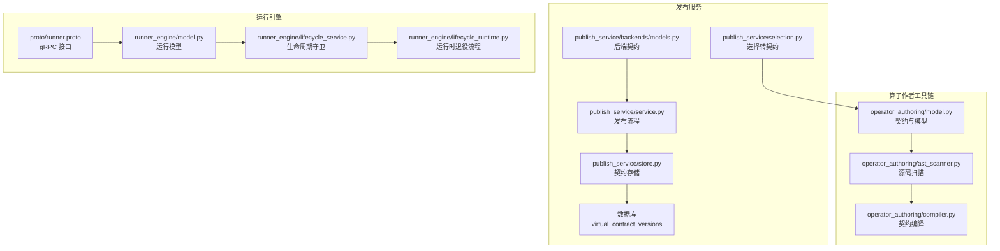
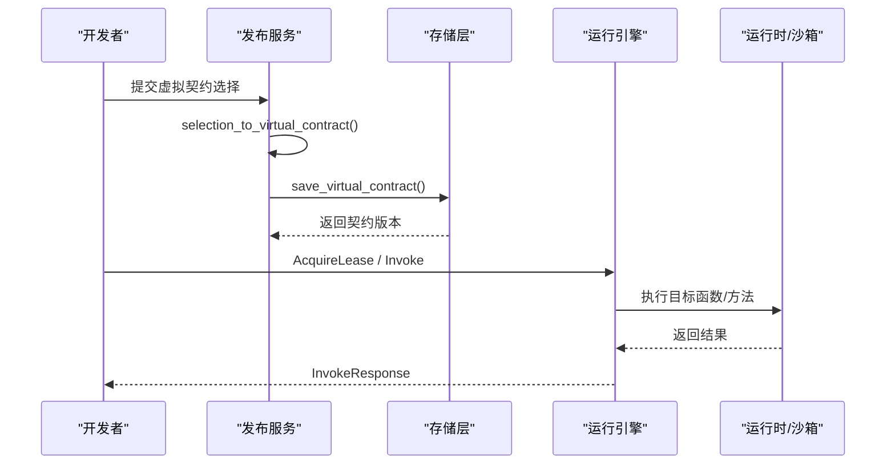
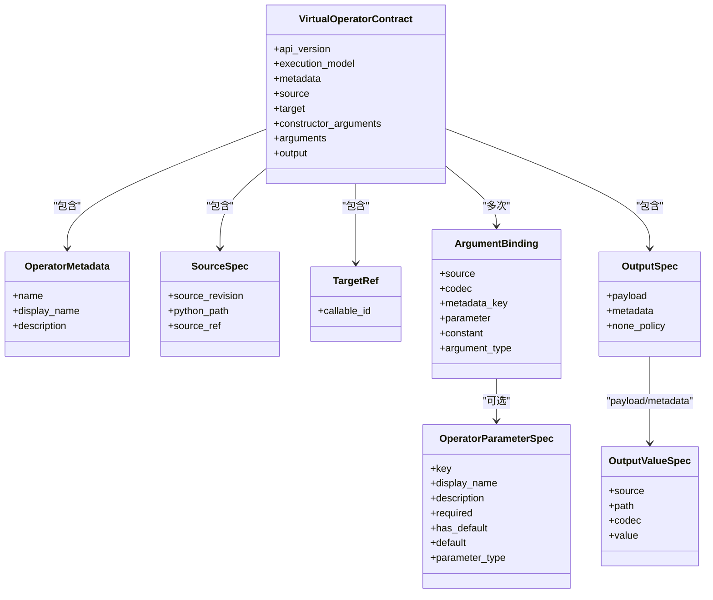
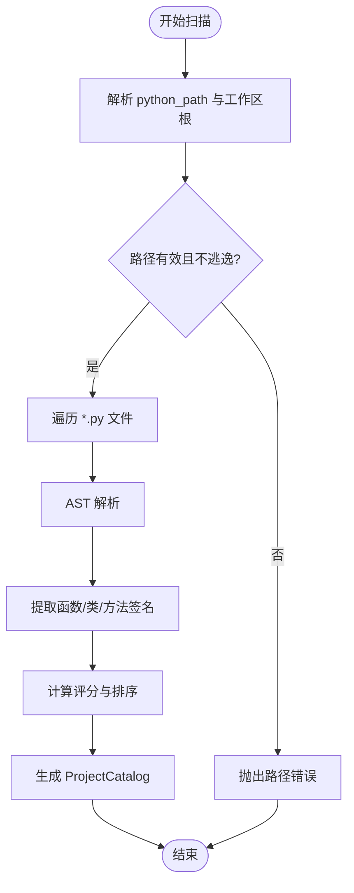
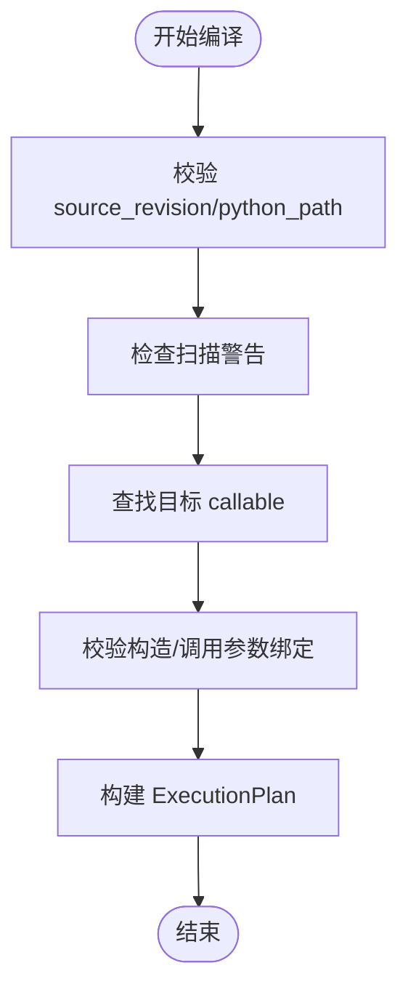
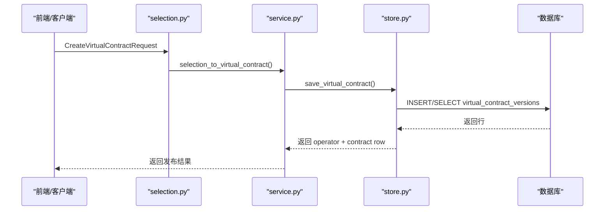
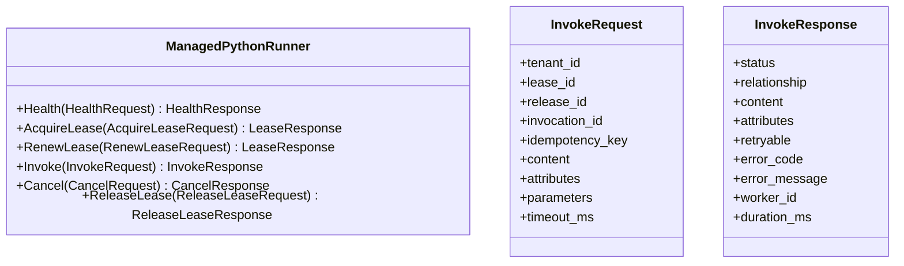
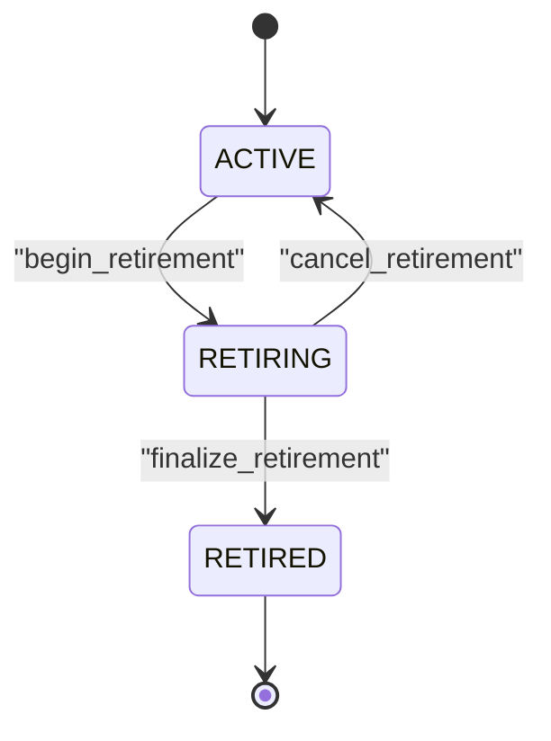
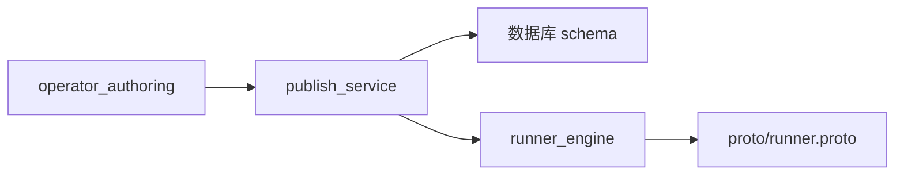

# 算子开发指南

<cite>
**本文引用的文件**   
- [proto/runner.proto](file://proto/runner.proto)
- [operator_authoring/model.py](file://operator_authoring/model.py)
- [operator_authoring/compiler.py](file://operator_authoring/compiler.py)
- [operator_authoring/ast_scanner.py](file://operator_authoring/ast_scanner.py)
- [publish_service/selection.py](file://publish_service/selection.py)
- [publish_service/backends/models.py](file://publish_service/backends/models.py)
- [sql/publish_schema.sql](file://sql/publish_schema.sql)
- [publish_service/store.py](file://publish_service/store.py)
- [publish_service/service.py](file://publish_service/service.py)
- [runner_engine/model.py](file://runner_engine/model.py)
- [runner_engine/lifecycle_service.py](file://runner_engine/lifecycle_service.py)
- [runner_engine/lifecycle_runtime.py](file://runner_engine/lifecycle_runtime.py)
</cite>

## 目录
1. [引言](#引言)
2. [项目结构](#项目结构)
3. [核心组件](#核心组件)
4. [架构总览](#架构总览)
5. [详细组件分析](#详细组件分析)
6. [依赖关系分析](#依赖关系分析)
7. [性能与优化建议](#性能与优化建议)
8. [调试与排错指南](#调试与排错指南)
9. [结论](#结论)
10. [附录：算子编写清单](#附录算子编写清单)

## 引言
本指南面向算子开发者，系统说明如何在本仓库中定义、编译、发布和运行“虚拟契约”驱动的 Python 算子。文档覆盖以下主题：
- 算子编写规范与契约定义
- 虚拟契约的概念、生成与版本管理
- 参数绑定、输入输出定义与数据编解码
- 依赖管理与沙箱隔离
- 生命周期管理与运行时执行
- 调试技巧、常见陷阱与性能优化
- 从入门到进阶的学习路径

## 项目结构
本项目围绕“算子作者工具链 + 发布服务 + 运行引擎”三部分组织：
- operator_authoring：扫描 Python 源码、构建项目目录、将虚拟契约编译为可执行计划
- publish_service：接收用户选择，生成并持久化虚拟契约，生成后端变体（如 runner）
- runner_engine：根据发布的算子制品在沙箱中执行，提供租约、调用、取消等能力

**图表来源**
- [operator_authoring/model.py:1-212](file://operator_authoring/model.py#L1-L212)
- [operator_authoring/ast_scanner.py:146-242](file://operator_authoring/ast_scanner.py#L146-L242)
- [operator_authoring/compiler.py:167-236](file://operator_authoring/compiler.py#L167-L236)
- [publish_service/selection.py:34-77](file://publish_service/selection.py#L34-L77)
- [publish_service/backends/models.py:10-73](file://publish_service/backends/models.py#L10-L73)
- [publish_service/store.py:83-127](file://publish_service/store.py#L83-L127)
- [publish_service/service.py:546-567](file://publish_service/service.py#L546-L567)
- [proto/runner.proto:8-15](file://proto/runner.proto#L8-L15)
- [runner_engine/model.py:14-98](file://runner_engine/model.py#L14-L98)
- [runner_engine/lifecycle_service.py:7-44](file://runner_engine/lifecycle_service.py#L7-L44)
- [runner_engine/lifecycle_runtime.py:319-359](file://runner_engine/lifecycle_runtime.py#L319-L359)

**章节来源**
- [operator_authoring/model.py:1-212](file://operator_authoring/model.py#L1-L212)
- [operator_authoring/ast_scanner.py:146-242](file://operator_authoring/ast_scanner.py#L146-L242)
- [operator_authoring/compiler.py:167-236](file://operator_authoring/compiler.py#L167-L236)
- [publish_service/selection.py:34-77](file://publish_service/selection.py#L34-L77)
- [publish_service/backends/models.py:10-73](file://publish_service/backends/models.py#L10-L73)
- [publish_service/store.py:83-127](file://publish_service/store.py#L83-L127)
- [publish_service/service.py:546-567](file://publish_service/service.py#L546-L567)
- [proto/runner.proto:8-15](file://proto/runner.proto#L8-L15)
- [runner_engine/model.py:14-98](file://runner_engine/model.py#L14-L98)
- [runner_engine/lifecycle_service.py:7-44](file://runner_engine/lifecycle_service.py#L7-L44)
- [runner_engine/lifecycle_runtime.py:319-359](file://runner_engine/lifecycle_runtime.py#L319-L359)

## 核心组件
- 虚拟契约模型：定义算子的元数据、源码定位、目标函数、构造参数、调用参数、输出策略等
- 源码扫描器：解析 Python AST，收集可调用的函数与方法，计算权重与评分，生成项目目录
- 契约编译器：校验契约与目录一致性，验证参数绑定，生成 ExecutionPlan
- 发布服务：将前端选择转换为虚拟契约，持久化契约版本，生成后端变体（Runner/NiFi Native）
- 运行引擎：基于 gRPC 的 ManagedPythonRunner 接口，提供健康检查、租约、调用、取消、释放
- 生命周期：对运行时环境进行退役控制，阻止新调用进入已退役或正在退役的环境

**章节来源**
- [operator_authoring/model.py:10-212](file://operator_authoring/model.py#L10-L212)
- [operator_authoring/ast_scanner.py:146-242](file://operator_authoring/ast_scanner.py#L146-L242)
- [operator_authoring/compiler.py:167-236](file://operator_authoring/compiler.py#L167-L236)
- [publish_service/selection.py:34-77](file://publish_service/selection.py#L34-L77)
- [publish_service/backends/models.py:10-73](file://publish_service/backends/models.py#L10-L73)
- [proto/runner.proto:8-15](file://proto/runner.proto#L8-L15)
- [runner_engine/model.py:14-98](file://runner_engine/model.py#L14-L98)
- [runner_engine/lifecycle_service.py:7-44](file://runner_engine/lifecycle_service.py#L7-L44)

## 架构总览
虚拟契约驱动的执行链路如下：
1. 开发者编写 Python 代码，使用函数或类方法作为算子入口
2. 通过发布服务创建虚拟契约，指定目标 callable、参数绑定与输出策略
3. 发布服务扫描源码、编译契约，得到 ExecutionPlan 并持久化
4. 运行引擎根据发布的算子制品，在沙箱中执行目标函数/方法
5. 生命周期机制确保退役中的运行时不再接受新调用

**图表来源**
- [publish_service/selection.py:34-77](file://publish_service/selection.py#L34-L77)
- [publish_service/store.py:83-127](file://publish_service/store.py#L83-L127)
- [proto/runner.proto:8-15](file://proto/runner.proto#L8-L15)

**章节来源**
- [publish_service/selection.py:34-77](file://publish_service/selection.py#L34-L77)
- [publish_service/store.py:83-127](file://publish_service/store.py#L83-L127)
- [proto/runner.proto:8-15](file://proto/runner.proto#L8-L15)

## 详细组件分析

### 虚拟契约与算子模型
虚拟契约是算子的“声明式描述”，包含：
- 元数据：名称、显示名、描述
- 源码定位：source_revision、python_path、source_ref
- 目标引用：callable_id（模块:函数名 或 模块:类名.方法名）
- 构造参数：实例方法的 __init__ 参数绑定
- 调用参数：目标函数的参数绑定
- 输出策略：payload 与 metadata 的来源、编解码、None 策略

关键类型与约束：
- OperatorParameterSpec：算子级参数的键、显示名、是否必填、默认值、类型
- ArgumentBinding：参数来源（输入负载、输入元数据、算子参数、常量）、编解码、元数据键、常量值
- OutputValueSpec：输出来源（return、return.path、constant）、path、编解码、常量值
- VirtualOperatorContract：顶层契约模型，聚合上述信息

**图表来源**
- [operator_authoring/model.py:111-212](file://operator_authoring/model.py#L111-L212)

**章节来源**
- [operator_authoring/model.py:111-212](file://operator_authoring/model.py#L111-L212)

### 源码扫描与项目目录
扫描器负责：
- 遍历 Python 源文件，排除测试与敏感目录
- 解析 AST，提取函数与方法签名、装饰器、默认值、注解
- 计算可调用的评分，优先推荐常用命名（如 run、process、predict）
- 生成 ProjectCatalog，包含 functions、classes、warnings 与 source_revision

注意事项：
- python_path 必须是相对 POSIX 路径且不能逃逸工作区
- 不允许符号链接
- 语法错误会记录为 error 级别警告，导致编译失败

**图表来源**
- [operator_authoring/ast_scanner.py:146-242](file://operator_authoring/ast_scanner.py#L146-L242)

**章节来源**
- [operator_authoring/ast_scanner.py:146-242](file://operator_authoring/ast_scanner.py#L146-L242)

### 契约编译与执行计划
编译器负责：
- 校验契约的 source_revision 与 catalog 一致
- 校验 python_path 一致
- 检查扫描警告，若存在 error 则拒绝编译
- 查找目标 callable，支持函数、静态方法、类方法、实例方法
- 校验构造参数与调用参数绑定完整性与冲突
- 生成 ExecutionPlan，包含 target、参数、输入/输出元数据键、contract_sha256

**图表来源**
- [operator_authoring/compiler.py:167-236](file://operator_authoring/compiler.py#L167-L236)

**章节来源**
- [operator_authoring/compiler.py:167-236](file://operator_authoring/compiler.py#L167-L236)

### 发布服务与虚拟契约版本管理
发布服务将前端选择转换为虚拟契约，并持久化：
- selection_to_virtual_contract：将用户选择映射为 VirtualOperatorContract
- store.save_virtual_contract：去重、递增版本号、写入 contract_json 与 sha256
- service._load_current_parent：加载最新父契约，重新扫描与编译以生成 plan

数据库表 virtual_contract_versions 用于保存契约版本、来源修订、sha256 与 JSON 内容。

**图表来源**
- [publish_service/selection.py:34-77](file://publish_service/selection.py#L34-L77)
- [publish_service/store.py:83-127](file://publish_service/store.py#L83-L127)
- [sql/publish_schema.sql:14-31](file://sql/publish_schema.sql#L14-L31)

**章节来源**
- [publish_service/selection.py:34-77](file://publish_service/selection.py#L34-L77)
- [publish_service/store.py:83-127](file://publish_service/store.py#L83-L127)
- [sql/publish_schema.sql:14-31](file://sql/publish_schema.sql#L14-L31)
- [publish_service/service.py:546-567](file://publish_service/service.py#L546-L567)

### 后端契约与变体
后端契约继承虚拟契约，扩展后端特定字段：
- RunnerBackendContract：runner 后端，包含 runtime_profile、runner_manifest、parameters
- NifiNativeBackendContract：NiFi Native 后端，包含 processor_type、class_name、properties、requirements、target_platform

这些契约用于生成不同后端的制品与部署配置。

**章节来源**
- [publish_service/backends/models.py:10-73](file://publish_service/backends/models.py#L10-L73)

### 运行引擎与 gRPC 接口
运行引擎暴露 ManagedPythonRunner 服务，包括：
- Health：健康检查
- AcquireLease/RenewLease/ReleaseLease：租约管理
- Invoke：执行算子
- Cancel：取消执行

InvokeRequest/InvokeResponse 定义了租户、项目、处理器、幂等键、负载、属性、参数、超时、状态、关系、错误码等信息。

**图表来源**
- [proto/runner.proto:8-62](file://proto/runner.proto#L8-L62)

**章节来源**
- [proto/runner.proto:8-62](file://proto/runner.proto#L8-L62)

### 生命周期管理与运行时退役
运行引擎的生命周期服务会在租约获取前检查运行时状态：
- 若运行时处于 RETIRED/RETIRING，则拒绝新租约
- lifecycle_runtime 提供退役流程的开始、取消、完成，确保无活跃调用与空闲 worker 后才允许删除制品

**图表来源**
- [runner_engine/lifecycle_service.py:7-44](file://runner_engine/lifecycle_service.py#L7-L44)
- [runner_engine/lifecycle_runtime.py:319-359](file://runner_engine/lifecycle_runtime.py#L319-L359)

**章节来源**
- [runner_engine/lifecycle_service.py:7-44](file://runner_engine/lifecycle_service.py#L7-L44)
- [runner_engine/lifecycle_runtime.py:319-359](file://runner_engine/lifecycle_runtime.py#L319-L359)

## 依赖关系分析
- operator_authoring 被 publish_service 与 runner_engine 间接依赖（通过契约与计划）
- publish_service 依赖 operator_authoring 的模型与编译逻辑
- runner_engine 依赖 proto 定义的 gRPC 接口与内部模型
- 数据库 schema 定义虚拟契约版本表，供发布服务持久化

**图表来源**
- [operator_authoring/__init__.py:1-5](file://operator_authoring/__init__.py#L1-L5)
- [publish_service/service.py:546-567](file://publish_service/service.py#L546-L567)
- [sql/publish_schema.sql:14-31](file://sql/publish_schema.sql#L14-L31)
- [proto/runner.proto:8-15](file://proto/runner.proto#L8-L15)

**章节来源**
- [operator_authoring/__init__.py:1-5](file://operator_authoring/__init__.py#L1-L5)
- [publish_service/service.py:546-567](file://publish_service/service.py#L546-L567)
- [sql/publish_schema.sql:14-31](file://sql/publish_schema.sql#L14-L31)
- [proto/runner.proto:8-15](file://proto/runner.proto#L8-L15)

## 性能与优化建议
- 避免异步 callable：Direct Invoke v1 不支持 async 函数
- 限制参数种类：仅支持 POSITIONAL_OR_KEYWORD 与 KEYWORD_ONLY
- 合理设置编解码：对于大对象优先使用 binary_stream；小文本用 text；结构化数据用 json
- 减少元数据传递：仅在必要时绑定 input.metadata，避免不必要的序列化开销
- 复用运行时：尽量保持运行时稳定，避免频繁退役与重建
- 控制超时：根据算子复杂度设置合理的 timeout_ms，避免长尾请求拖慢池

[本节为通用指导，不直接分析具体文件]

## 调试与排错指南
常见问题与排查要点：
- 源码扫描错误：检查 python_path 是否有效、是否存在语法错误、是否包含符号链接
- 契约编译失败：确认 source_revision 与 catalog 一致、python_path 一致、目标 callable 存在、参数绑定完整且无冲突
- 运行时退役：当运行时处于 RETIRING/RETIRED 时，新租约会被拒绝；需等待退役完成或取消退役
- gRPC 调用异常：检查 InvokeRequest 的 idempotency_key、timeout_ms、attributes、parameters 是否正确

参考实现位置：
- 扫描与警告：[operator_authoring/ast_scanner.py:176-183](file://operator_authoring/ast_scanner.py#L176-L183)
- 编译校验与错误：[operator_authoring/compiler.py:167-186](file://operator_authoring/compiler.py#L167-L186)
- 生命周期守卫：[runner_engine/lifecycle_service.py:19-32](file://runner_engine/lifecycle_service.py#L19-L32)
- 退役流程：[runner_engine/lifecycle_runtime.py:319-359](file://runner_engine/lifecycle_runtime.py#L319-L359)

**章节来源**
- [operator_authoring/ast_scanner.py:176-183](file://operator_authoring/ast_scanner.py#L176-L183)
- [operator_authoring/compiler.py:167-186](file://operator_authoring/compiler.py#L167-L186)
- [runner_engine/lifecycle_service.py:19-32](file://runner_engine/lifecycle_service.py#L19-L32)
- [runner_engine/lifecycle_runtime.py:319-359](file://runner_engine/lifecycle_runtime.py#L319-L359)

## 结论
本指南说明了如何在项目中定义虚拟契约、扫描源码、编译执行计划、发布与运行算子。通过严格的契约模型与编译校验，结合发布服务的版本管理与运行引擎的生命周期守卫，实现了安全、可控、可扩展的算子开发与执行体系。初学者可从函数型算子入手，逐步掌握参数绑定、输出策略与运行时调优；高级用户可定制后端契约与变体，扩展部署与集成能力。

[本节为总结性内容，不直接分析具体文件]

## 附录：算子编写清单
- 选择入口：函数或类方法，避免 async，使用受支持的参数种类
- 定义参数：明确必填与默认值，合理使用 operator.parameter 与 constant
- 绑定输入：input.payload、input.metadata、operator.parameter、constant
- 定义输出：return、return.path、constant，选择合适的 codec
- 校验契约：确保 source_revision 与 catalog 一致，python_path 正确
- 发布与运行：通过发布服务创建虚拟契约，使用 gRPC 接口调用
- 生命周期：关注运行时退役状态，避免在 RETIRING/RETIRED 状态下发起新调用

[本节为通用指导，不直接分析具体文件]