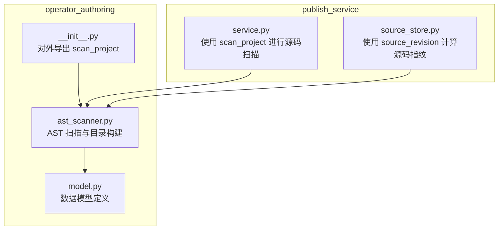
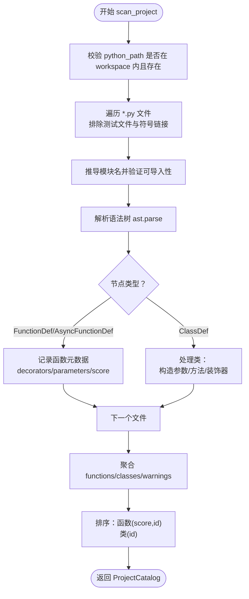
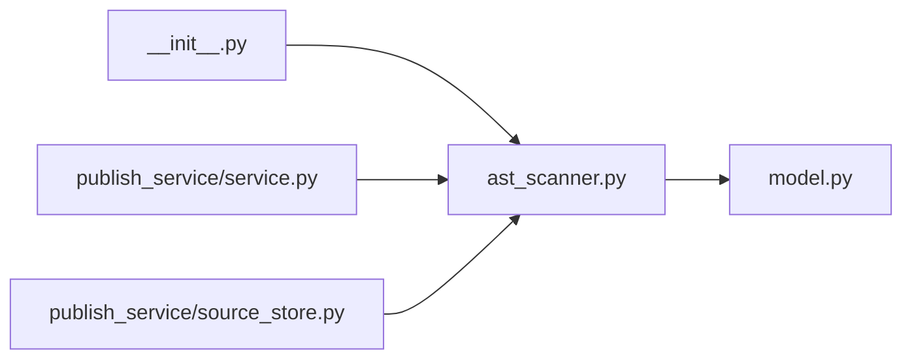

# 代码分析阶段

<cite>
**本文引用的文件**   
- [ast_scanner.py](file://operator_authoring/ast_scanner.py)
- [model.py](file://operator_authoring/model.py)
- [__init__.py](file://operator_authoring/__init__.py)
- [service.py](file://publish_service/service.py)
- [source_store.py](file://publish_service/source_store.py)
</cite>

## 目录
1. [引言](#引言)
2. [项目结构](#项目结构)
3. [核心组件](#核心组件)
4. [架构总览](#架构总览)
5. [详细组件分析](#详细组件分析)
6. [依赖关系分析](#依赖关系分析)
7. [性能与复杂度](#性能与复杂度)
8. [故障排查指南](#故障排查指南)
9. [结论](#结论)
10. [附录：示例与最佳实践](#附录示例与最佳实践)

## 引言
本章节聚焦于“代码分析阶段”的实现，重点解释 AST 扫描器如何解析 Python 源代码并提取函数与类的元数据。文档将深入说明 scan_project 函数的实现原理，包括文件遍历、语法树解析、装饰器识别、参数信息提取机制（位置参数、关键字参数、默认值处理）、可调用对象的评分算法与排序规则，以及常见语法错误的处理策略和警告信息生成机制。同时提供具体代码示例的转换思路，帮助读者理解从 Python 源码到结构化目录对象的全过程。

## 项目结构
operator_authoring 模块负责算子作者工具链中的源码分析与编译能力，其中 ast_scanner.py 是 AST 扫描的核心实现，model.py 定义了扫描结果的数据模型，__init__.py 对外暴露 scan_project 等接口。publish_service 层通过导入 scan_project 与 source_revision 完成算子发布前的源码目录扫描与版本指纹计算。

**图表来源**
- [ast_scanner.py:1-243](file://operator_authoring/ast_scanner.py#L1-L243)
- [model.py:1-212](file://operator_authoring/model.py#L1-L212)
- [__init__.py:1-6](file://operator_authoring/__init__.py#L1-L6)
- [service.py:12-12](file://publish_service/service.py#L12-L12)
- [source_store.py:8-8](file://publish_service/source_store.py#L8-L8)

**章节来源**
- [ast_scanner.py:1-243](file://operator_authoring/ast_scanner.py#L1-L243)
- [model.py:1-212](file://operator_authoring/model.py#L1-L212)
- [__init__.py:1-6](file://operator_authoring/__init__.py#L1-L6)
- [service.py:12-12](file://publish_service/service.py#L12-L12)
- [source_store.py:8-8](file://publish_service/source_store.py#L8-L8)

## 核心组件
- AST 扫描器（ast_scanner.py）
  - 文件遍历与过滤：排除特定目录、跳过测试文件与符号链接。
  - 模块名推导：根据 python_path 与文件相对路径推导可导入模块名。
  - 语法树解析：使用 ast.parse 解析每个 .py 文件，捕获 SyntaxError 与 UnicodeDecodeError。
  - 装饰器识别：递归解析装饰器节点，支持 Name、Attribute、Call 形式。
  - 参数信息提取：统一处理位置参数、仅位置参数、可变位置参数、关键字参数、仅关键字参数、可变关键字参数，并尝试解析默认值为字面量。
  - 可调用对象评分：基于名称权重、私有前缀惩罚、装饰器标记加分。
  - 类与方法分类：区分实例方法、静态方法、类方法；构造方法单独收集。
  - 目录聚合：汇总函数、类、警告，并返回 ProjectCatalog。

- 数据模型（model.py）
  - CallableInfo：描述函数或方法的元数据（id、module、qualname、kind、decorators、parameters、return_annotation、score 等）。
  - ClassInfo：描述类的元数据（constructor、methods）。
  - ParameterInfo：描述参数的元数据（name、kind、annotation、required、has_default、default_value、default_repr）。
  - CatalogWarning：描述扫描过程中的警告或错误信息。
  - ProjectCatalog：项目目录聚合对象，包含 source_revision、python_path、functions、classes、warnings，并提供 all_callables、callable_by_id、class_by_target 等方法。

**章节来源**
- [ast_scanner.py:22-143](file://operator_authoring/ast_scanner.py#L22-L143)
- [ast_scanner.py:146-243](file://operator_authoring/ast_scanner.py#L146-L243)
- [model.py:41-108](file://operator_authoring/model.py#L41-L108)

## 架构总览
scan_project 作为入口函数，接收 project_root 与 python_path，执行以下流程：
1. 校验 python_path 是否位于 workspace 内且存在。
2. 遍历 *.py 文件，跳过测试文件和符号链接，排除指定目录。
3. 推导模块名并验证其可导入性。
4. 解析语法树，捕获语法与编码错误，生成 CatalogWarning。
5. 对顶层函数与类进行处理：
   - 函数：记录 decorators、parameters、return_annotation、score。
   - 类：收集 __init__ 构造参数；忽略魔术方法；识别方法类型；记录方法与构造参数。
6. 汇总并排序：函数按 score 降序、id 升序；类按 id 升序。
7. 返回 ProjectCatalog，包含 source_revision、python_path、functions、classes、warnings。

**图表来源**
- [ast_scanner.py:146-243](file://operator_authoring/ast_scanner.py#L146-L243)

**章节来源**
- [ast_scanner.py:146-243](file://operator_authoring/ast_scanner.py#L146-L243)

## 详细组件分析

### AST 扫描器核心逻辑
- 文件遍历与过滤
  - 使用 rglob("*.py") 遍历所有 Python 文件。
  - 排除 EXCLUDED_DIRS 中的目录（如 .git、venv、site-packages 等）。
  - 跳过以 test_ 开头的文件与符号链接。

- 模块名推导与有效性检查
  - _module_name 根据 python_root 与文件路径推导模块名，处理 __init__.py 的特殊情况。
  - _valid_module_name 确保模块名各部分为合法标识符。

- 装饰器识别
  - _decorator_name 递归解析装饰器节点，支持：
    - Name：直接名称（如 operator）。
    - Attribute：点号访问（如 dsc.operator）。
    - Call：带调用的装饰器（如 @operator(...)）。

- 参数信息提取
  - _parameter_infos 统一处理：
    - 仅位置参数 posonlyargs。
    - 普通位置参数 args。
    - 可变位置参数 vararg。
    - 仅关键字参数 kwonlyargs 与默认值 kw_defaults。
    - 可变关键字参数 kwarg。
  - 默认值解析：
    - _literal_value 尝试 ast.literal_eval 与 json.dumps 校验，成功则记录 default_value 与 has_default。
  - drop_first 控制：
    - 构造方法 __init__ 与实例/类方法会丢弃第一个 self/cls 参数。

- 可调用对象评分与排序
  - _callable_score：
    - 基础分来自 NAME_WEIGHTS（如 run、process、predict 等高权重）。
    - 私有前缀（下划线开头）扣分。
    - 装饰器匹配 operator/dsc.operator/dsc_sdk.operator 加分。
  - 排序规则：
    - 函数：按 (-score, id) 排序，优先高权重与显式 operator 装饰器。
    - 类：按 id 升序。

- 类与方法分类
  - _method_kind：
    - staticmethod → STATIC_METHOD。
    - classmethod → CLASS_METHOD。
    - 其他 → INSTANCE_METHOD。
  - 构造方法 __init__ 单独收集 constructor 参数列表。
  - 魔术方法（双下划线开头与结尾）被忽略。

**章节来源**
- [ast_scanner.py:11-50](file://operator_authoring/ast_scanner.py#L11-L50)
- [ast_scanner.py:53-82](file://operator_authoring/ast_scanner.py#L53-L82)
- [ast_scanner.py:85-143](file://operator_authoring/ast_scanner.py#L85-L143)
- [ast_scanner.py:146-243](file://operator_authoring/ast_scanner.py#L146-L243)

### 数据模型与目录聚合
- CallableInfo
  - 字段：id、module、qualname、kind、class_target、method_name、file、line、is_async、decorators、score、parameters、return_annotation。
  - 用途：描述函数或方法的完整元数据，用于后续编译与绑定。

- ClassInfo
  - 字段：id、module、qualname、target、file、line、constructor、methods。
  - 用途：描述类的构造参数与公开方法集合。

- ParameterInfo
  - 字段：name、kind、annotation、required、has_default、default_value、default_repr。
  - 用途：描述参数的类型注解、是否必填、默认值及其字符串表示。

- CatalogWarning
  - 字段：severity、file、line、message。
  - 用途：记录扫描过程中的警告或错误，便于用户定位问题。

- ProjectCatalog
  - 字段：source_revision、python_path、functions、classes、warnings。
  - 方法：
    - all_callables：合并函数与类方法，并按 score、id 排序。
    - callable_by_id：按 id 查找可调用对象。
    - class_by_target：按 target 查找类。

**章节来源**
- [model.py:41-108](file://operator_authoring/model.py#L41-L108)

### 外部集成点
- operator_authoring.__init__.py 对外导出 scan_project。
- publish_service.service.py 导入 scan_project 用于源码扫描。
- publish_service.source_store.py 导入 source_revision 用于源码指纹计算。

**章节来源**
- [__init__.py:1-6](file://operator_authoring/__init__.py#L1-L6)
- [service.py:12-12](file://publish_service/service.py#L12-L12)
- [source_store.py:8-8](file://publish_service/source_store.py#L8-L8)

## 依赖关系分析
- 内部依赖
  - ast_scanner.py 依赖 model.py 定义的 CallableInfo、ClassInfo、ParameterInfo、ProjectCatalog、CatalogWarning。
  - __init__.py 导出 scan_project，供上层服务使用。

- 外部依赖
  - Python 标准库 ast、hashlib、json、pathlib。
  - pydantic BaseModel、Field、validator（在 model.py 中）。

- 耦合与内聚
  - ast_scanner.py 与 model.py 高内聚：扫描逻辑产出模型对象，模型定义清晰。
  - publish_service 层与 operator_authoring 低耦合：仅通过公共接口使用扫描能力。

**图表来源**
- [ast_scanner.py:1-243](file://operator_authoring/ast_scanner.py#L1-L243)
- [model.py:1-212](file://operator_authoring/model.py#L1-L212)
- [__init__.py:1-6](file://operator_authoring/__init__.py#L1-L6)
- [service.py:12-12](file://publish_service/service.py#L12-L12)
- [source_store.py:8-8](file://publish_service/source_store.py#L8-L8)

**章节来源**
- [ast_scanner.py:1-243](file://operator_authoring/ast_scanner.py#L1-L243)
- [model.py:1-212](file://operator_authoring/model.py#L1-L212)
- [__init__.py:1-6](file://operator_authoring/__init__.py#L1-L6)
- [service.py:12-12](file://publish_service/service.py#L12-L12)
- [source_store.py:8-8](file://publish_service/source_store.py#L8-L8)

## 性能与复杂度
- 时间复杂度
  - 文件遍历：O(N)，N 为 *.py 文件数量。
  - 语法树解析：O(M)，M 为源码字符数总和。
  - 节点遍历：O(K)，K 为 AST 节点总数。
  - 参数解析：O(P)，P 为参数总数。
  - 评分与排序：O(F log F + C log C)，F 为函数数量，C 为类数量。

- 空间复杂度
  - AST 树存储：O(K)。
  - 目录对象聚合：O(F + C + W)，W 为警告数量。

- 优化建议
  - 大仓库场景下可考虑并行解析文件（注意线程安全与 I/O 瓶颈）。
  - 对大型默认值表达式避免 ast.literal_eval 失败导致的异常开销，可在 _literal_value 中增加缓存或限制表达式复杂度。

[本节为通用性能讨论，不直接分析具体文件]

## 故障排查指南
- 常见错误与警告
  - python_path 逃逸工作区：抛出 ValueError，提示“python_path escapes the workspace”。
  - python_path 不存在：抛出 ValueError，提示“python_path does not exist”。
  - 文件不可导入：生成 CatalogWarning，提示“file is not importable from python_path=...; module=...”。
  - 语法错误或编码错误：生成 CatalogWarning，包含 severity="error"、file、line、message。

- 调试建议
  - 检查 python_path 是否为相对 POSIX 路径且不包含“..”或绝对路径。
  - 确认文件命名符合模块规范（无非法标识符）。
  - 查看 warnings 列表，定位具体文件与行号。

**章节来源**
- [ast_scanner.py:146-183](file://operator_authoring/ast_scanner.py#L146-L183)
- [model.py:41-46](file://operator_authoring/model.py#L41-L46)

## 结论
AST 扫描器通过严格的文件遍历、模块名推导、语法树解析与装饰器识别，将 Python 源码转换为结构化的 ProjectCatalog。参数提取机制覆盖多种参数形态，默认值解析兼顾安全性与可用性。可调用对象评分与排序规则有助于快速定位常用与显式标记的算子。错误处理与警告机制为开发者提供了清晰的反馈路径，便于修复源码问题。整体设计内聚、低耦合，便于在发布服务中复用。

[本节为总结性内容，不直接分析具体文件]

## 附录：示例与最佳实践

### 示例一：顶层函数扫描
- 输入：一个包含顶层函数的 Python 文件。
- 处理：
  - 推导模块名。
  - 解析函数签名，提取位置参数、关键字参数、默认值。
  - 计算 score（名称权重、装饰器加分）。
- 输出：CallableInfo 列表，包含函数元数据。

**章节来源**
- [ast_scanner.py:185-197](file://operator_authoring/ast_scanner.py#L185-L197)
- [model.py:58-72](file://operator_authoring/model.py#L58-L72)

### 示例二：类与方法的扫描
- 输入：一个包含类、构造方法与多个方法的 Python 文件。
- 处理：
  - 收集 __init__ 构造参数（drop_first=True）。
  - 忽略魔术方法。
  - 识别 staticmethod/classmethod/instance-method。
  - 记录每个方法的参数与返回注解。
- 输出：ClassInfo，包含 constructor 与 methods。

**章节来源**
- [ast_scanner.py:199-234](file://operator_authoring/ast_scanner.py#L199-L234)
- [model.py:74-83](file://operator_authoring/model.py#L74-L83)

### 示例三：装饰器识别与评分
- 输入：函数或方法带有 @operator、@dsc.operator、@dsc_sdk.operator 装饰器。
- 处理：
  - 解析装饰器名称（支持 Name、Attribute、Call）。
  - 若匹配已知装饰器，score 加 100。
- 输出：CallableInfo.score 提升，排序更靠前。

**章节来源**
- [ast_scanner.py:42-50](file://operator_authoring/ast_scanner.py#L42-L50)
- [ast_scanner.py:125-131](file://operator_authoring/ast_scanner.py#L125-L131)

### 示例四：参数默认值解析
- 输入：函数参数带有字面量默认值（如 int、str、list、dict）。
- 处理：
  - _literal_value 尝试 ast.literal_eval 与 json.dumps 校验。
  - 成功则记录 default_value 与 has_default。
- 输出：ParameterInfo.has_default=True，default_value 可用。

**章节来源**
- [ast_scanner.py:31-39](file://operator_authoring/ast_scanner.py#L31-L39)
- [ast_scanner.py:85-122](file://operator_authoring/ast_scanner.py#L85-L122)

### 最佳实践
- 使用显式装饰器（如 @operator）以提升可发现性。
- 避免在参数中使用复杂默认值表达式，尽量使用字面量。
- 保持模块名与文件路径一致，确保可导入性。
- 在类中合理组织构造方法与公开方法，避免过多魔术方法。

[本节为概念性指导，不直接分析具体文件]