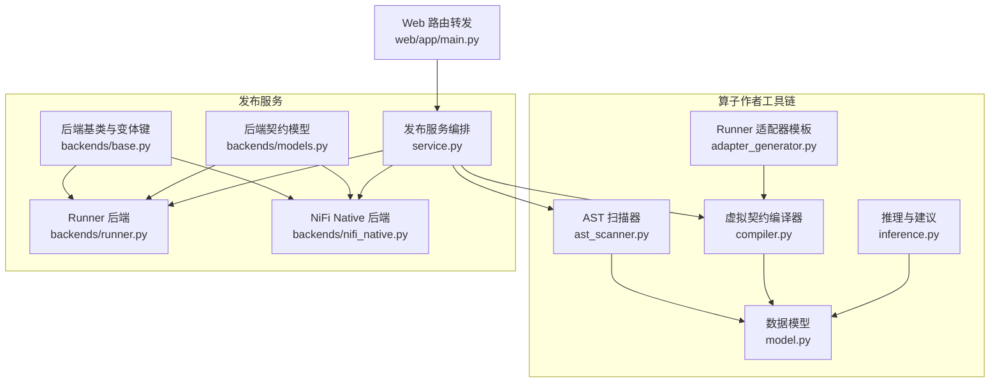
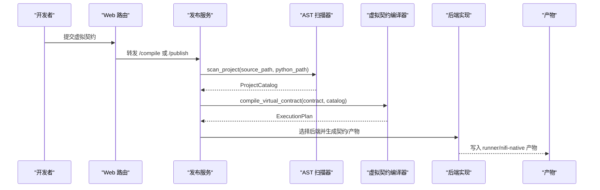
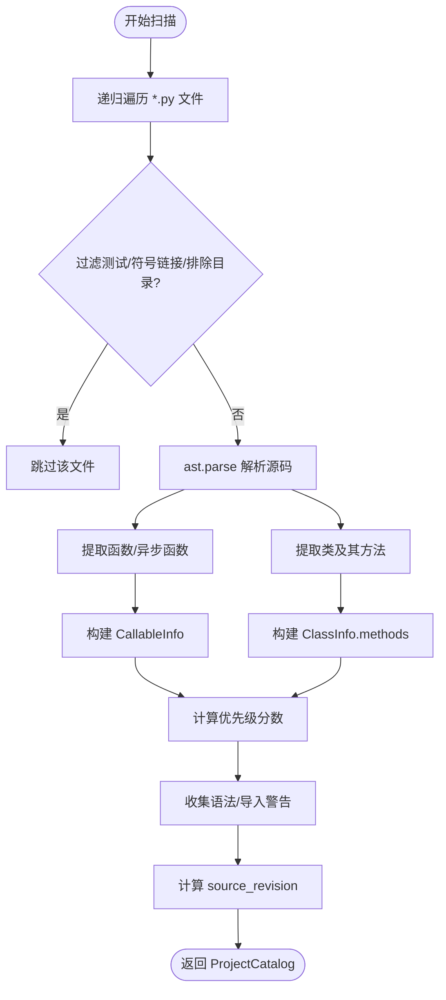
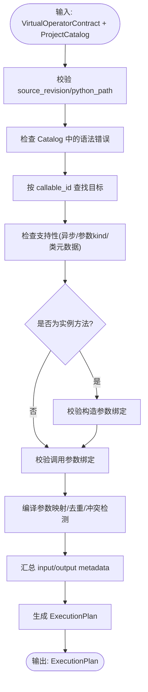
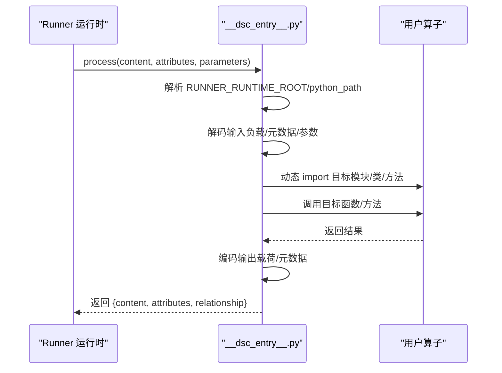
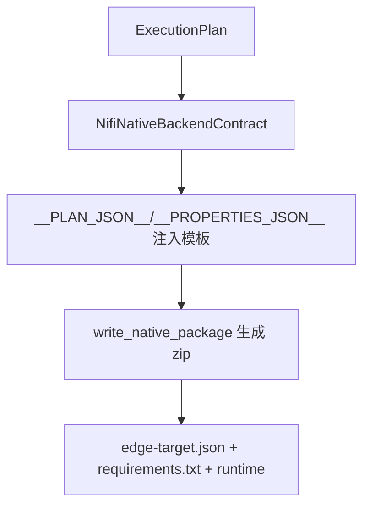
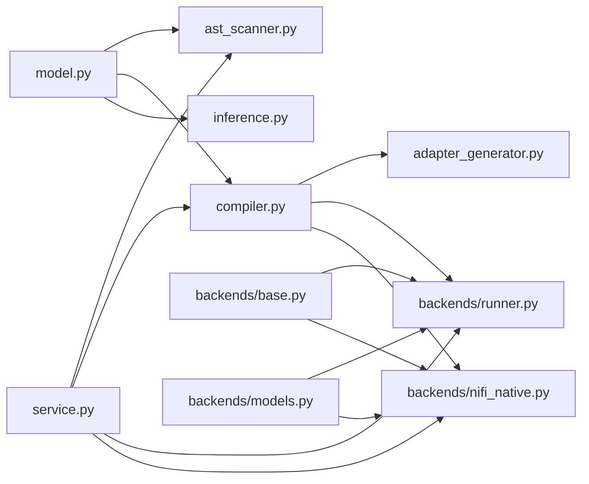

# 算子开发流程

<cite>
**本文引用的文件**   
- [operator_authoring/ast_scanner.py](file://operator_authoring/ast_scanner.py)
- [operator_authoring/model.py](file://operator_authoring/model.py)
- [operator_authoring/compiler.py](file://operator_authoring/compiler.py)
- [operator_authoring/inference.py](file://operator_authoring/inference.py)
- [operator_authoring/adapter_generator.py](file://operator_authoring/adapter_generator.py)
- [publish_service/backends/base.py](file://publish_service/backends/base.py)
- [publish_service/backends/models.py](file://publish_service/backends/models.py)
- [publish_service/backends/runner.py](file://publish_service/backends/runner.py)
- [publish_service/backends/nifi_native.py](file://publish_service/backends/nifi_native.py)
- [publish_service/service.py](file://publish_service/service.py)
- [web/app/main.py](file://web/app/main.py)
</cite>

## 目录
1. [引言](#引言)
2. [项目结构](#项目结构)
3. [核心组件](#核心组件)
4. [架构总览](#架构总览)
5. [详细组件分析](#详细组件分析)
6. [依赖关系分析](#依赖关系分析)
7. [性能与可维护性](#性能与可维护性)
8. [开发与调试指南](#开发与调试指南)
9. [版本控制与代码管理最佳实践](#版本控制与代码管理最佳实践)
10. [故障排查](#故障排查)
11. [结论](#结论)

## 引言
本指南面向算子开发者，覆盖从编写 Python 算子源码到生成后端适配包、编译执行计划、发布部署的完整流程。重点说明：
- AST 扫描器如何解析 Python 源码并提取函数、类与方法信息；
- 编译器如何将虚拟算子契约转换为可执行的 ExecutionPlan；
- 适配器生成机制如何为不同后端（Runner、NiFi Native）生成运行时代码；
- 开发环境搭建、IDE 配置、调试技巧与版本控制建议。

## 项目结构
仓库围绕“算子作者工具链”和“发布服务”两大块组织：
- operator_authoring：提供 AST 扫描、模型定义、虚拟契约编译、适配器模板生成等能力；
- publish_service：面向后端的打包与发布逻辑，包含 Runner 与 NiFi Native 两种后端；
- web：前端入口，转发编译与发布请求到后端服务。

**图表来源**
- [operator_authoring/ast_scanner.py:146-242](file://operator_authoring/ast_scanner.py#L146-L242)
- [operator_authoring/model.py:85-108](file://operator_authoring/model.py#L85-L108)
- [operator_authoring/compiler.py:167-236](file://operator_authoring/compiler.py#L167-L236)
- [operator_authoring/adapter_generator.py:247-254](file://operator_authoring/adapter_generator.py#L247-L254)
- [publish_service/backends/base.py:10-23](file://publish_service/backends/base.py#L10-L23)
- [publish_service/backends/models.py:40-72](file://publish_service/backends/models.py#L40-L72)
- [publish_service/backends/runner.py:23-67](file://publish_service/backends/runner.py#L23-L67)
- [publish_service/backends/nifi_native.py:103-168](file://publish_service/backends/nifi_native.py#L103-L168)
- [publish_service/service.py:546-567](file://publish_service/service.py#L546-L567)
- [web/app/main.py:152-175](file://web/app/main.py#L152-L175)

**章节来源**
- [operator_authoring/ast_scanner.py:146-242](file://operator_authoring/ast_scanner.py#L146-L242)
- [publish_service/service.py:546-567](file://publish_service/service.py#L546-L567)
- [web/app/main.py:152-175](file://web/app/main.py#L152-L175)

## 核心组件
- AST 扫描器：遍历 Python 源码，提取函数、类、方法签名、装饰器、异步标记、默认值等，生成 ProjectCatalog。
- 数据模型：统一描述调用目标、参数绑定、输出规范、虚拟契约等。
- 虚拟契约编译器：校验契约与源码快照一致性，验证参数绑定，生成 ExecutionPlan。
- 推理模块：根据参数名与类型注解给出输入/元数据/参数的绑定建议。
- 适配器生成器：将 ExecutionPlan 嵌入模板，生成 Runner 运行时入口。
- 后端实现：Runner 与 NiFi Native 分别将 ExecutionPlan 转为各自的后端契约与产物。

**章节来源**
- [operator_authoring/ast_scanner.py:146-242](file://operator_authoring/ast_scanner.py#L146-L242)
- [operator_authoring/model.py:8-212](file://operator_authoring/model.py#L8-L212)
- [operator_authoring/compiler.py:167-236](file://operator_authoring/compiler.py#L167-L236)
- [operator_authoring/inference.py:21-71](file://operator_authoring/inference.py#L21-L71)
- [operator_authoring/adapter_generator.py:247-254](file://operator_authoring/adapter_generator.py#L247-L254)
- [publish_service/backends/runner.py:23-67](file://publish_service/backends/runner.py#L23-L67)
- [publish_service/backends/nifi_native.py:103-168](file://publish_service/backends/nifi_native.py#L103-L168)

## 架构总览
算子开发的核心链路如下：
1. 用户提交虚拟算子契约 VirtualOperatorContract；
2. 服务侧基于 source_ref 定位源码快照，使用 AST 扫描器生成 ProjectCatalog；
3. 编译器校验契约与 Catalog 的一致性，生成 ExecutionPlan；
4. 选择后端（Runner/NiFi Native），生成对应后端契约与产物；
5. Runner 后端会生成 __dsc_entry__.py 作为运行时入口，内嵌 ExecutionPlan。

**图表来源**
- [web/app/main.py:152-175](file://web/app/main.py#L152-L175)
- [publish_service/service.py:546-567](file://publish_service/service.py#L546-L567)
- [operator_authoring/ast_scanner.py:146-242](file://operator_authoring/ast_scanner.py#L146-L242)
- [operator_authoring/compiler.py:167-236](file://operator_authoring/compiler.py#L167-L236)
- [publish_service/backends/runner.py:70-114](file://publish_service/backends/runner.py#L70-L114)
- [publish_service/backends/nifi_native.py:533-581](file://publish_service/backends/nifi_native.py#L533-L581)

## 详细组件分析

### AST 扫描器：从 Python 源码到 ProjectCatalog
AST 扫描器负责：
- 排除测试文件、符号链接与敏感目录；
- 解析每个 .py 文件的 AST，提取函数、类、方法；
- 记录装饰器、是否异步、参数签名、默认值、返回注解；
- 计算可调用项优先级分数，用于 UI 推荐排序；
- 生成不可变的源码修订摘要 source_revision。

关键行为：
- 模块名推导：基于 python_path 相对路径，忽略 __init__.py 的特殊处理；
- 参数解析：区分位置参数、关键字参数、*args、**kwargs，标注 required/has_default/default_value；
- 类方法分类：实例方法、静态方法、类方法，构造方法单独收集 constructor；
- 警告收集：语法错误、不可导入模块等以 CatalogWarning 形式返回。

**图表来源**
- [operator_authoring/ast_scanner.py:62-82](file://operator_authoring/ast_scanner.py#L62-L82)
- [operator_authoring/ast_scanner.py:85-122](file://operator_authoring/ast_scanner.py#L85-L122)
- [operator_authoring/ast_scanner.py:146-242](file://operator_authoring/ast_scanner.py#L146-L242)

**章节来源**
- [operator_authoring/ast_scanner.py:62-82](file://operator_authoring/ast_scanner.py#L62-L82)
- [operator_authoring/ast_scanner.py:85-122](file://operator_authoring/ast_scanner.py#L85-L122)
- [operator_authoring/ast_scanner.py:146-242](file://operator_authoring/ast_scanner.py#L146-L242)

### 数据模型：契约、参数与输出规范
模型层定义了算子契约、参数绑定、输出规范等核心数据结构：
- VirtualOperatorContract：声明 API 版本、执行模型、元数据、源码快照、目标可调用项、构造参数绑定、调用参数绑定、输出规范；
- ArgumentBinding：绑定来源（输入负载、输入元数据、算子参数、常量）、编解码器、元数据键、算子参数规格、常量值；
- OutputSpec/OutputValueSpec：输出载荷来源（返回值、返回值路径、常量）、编解码器、None 策略；
- SourceSpec：源码快照标识、python_path 校验；
- OperatorMetadata/OperatorParameterSpec：算子名称、显示名、描述、参数键与展示信息。

这些模型在编译期被严格校验，确保契约与源码一致、参数绑定合法。

**章节来源**
- [operator_authoring/model.py:8-212](file://operator_authoring/model.py#L8-L212)

### 虚拟契约编译器：从契约到 ExecutionPlan
编译器职责：
- 校验 source_revision 与 python_path 与 Catalog 一致；
- 拒绝存在语法错误的源码；
- 查找目标 callable，检查支持性（不支持异步、仅支持部分参数 kind）；
- 对实例方法校验构造方法与方法的参数绑定；
- 合并构造参数与调用参数，生成统一的 CompiledParameter 列表；
- 计算 input_metadata/output_metadata 集合；
- 生成 ExecutionPlan，包含 target、参数映射、输出规范、contract_sha256。

**图表来源**
- [operator_authoring/compiler.py:56-78](file://operator_authoring/compiler.py#L56-L78)
- [operator_authoring/compiler.py:85-149](file://operator_authoring/compiler.py#L85-L149)
- [operator_authoring/compiler.py:167-236](file://operator_authoring/compiler.py#L167-L236)

**章节来源**
- [operator_authoring/compiler.py:56-78](file://operator_authoring/compiler.py#L56-L78)
- [operator_authoring/compiler.py:85-149](file://operator_authoring/compiler.py#L85-L149)
- [operator_authoring/compiler.py:167-236](file://operator_authoring/compiler.py#L167-L236)

### 推理与建议：自动推断参数绑定
推理模块根据参数名与类型注解，给出高置信度的绑定建议：
- 内容参数：content/payload/body/data/input/record/order/request/document 等优先绑定 input.payload；
- 元数据参数：filename/mime_type/path/uuid 等映射到 input.metadata；
- 算子参数：根据 parameter.name 生成 operator.parameter 建议，附带 required/has_default/default；
- 编解码器推断：bytes/bytearray -> bytes；dict/list/json/特定名字 -> json；str -> text；否则 payload 用 bytes，其他用 text。

这极大降低开发者手动配置绑定的成本。

**章节来源**
- [operator_authoring/inference.py:8-71](file://operator_authoring/inference.py#L8-L71)

### 适配器生成机制：Runner 与 NiFi Native
#### Runner 后端
- 通过 generate_runner_adapter(plan) 将 ExecutionPlan 序列化进模板，生成 __dsc_entry__.py；
- 运行时 process(content, attributes, parameters) 负责：
  - 解析 RUNNER_RUNTIME_ROOT 与 python_path，安全校验路径；
  - 解码输入负载与元数据；
  - 解析构造参数与调用参数；
  - 动态 import 目标模块与可调用项；
  - 执行目标函数/方法，编码输出载荷与元数据；
  - 恢复 sys.path 与 cwd，保证隔离性。

**图表来源**
- [operator_authoring/adapter_generator.py:21-41](file://operator_authoring/adapter_generator.py#L21-L41)
- [operator_authoring/adapter_generator.py:44-103](file://operator_authoring/adapter_generator.py#L44-L103)
- [operator_authoring/adapter_generator.py:115-142](file://operator_authoring/adapter_generator.py#L115-L142)
- [operator_authoring/adapter_generator.py:188-243](file://operator_authoring/adapter_generator.py#L188-L243)

**章节来源**
- [operator_authoring/adapter_generator.py:21-41](file://operator_authoring/adapter_generator.py#L21-L41)
- [operator_authoring/adapter_generator.py:44-103](file://operator_authoring/adapter_generator.py#L44-L103)
- [operator_authoring/adapter_generator.py:115-142](file://operator_authoring/adapter_generator.py#L115-L142)
- [operator_authoring/adapter_generator.py:188-243](file://operator_authoring/adapter_generator.py#L188-L243)
- [publish_service/backends/runner.py:70-114](file://publish_service/backends/runner.py#L70-L114)

#### NiFi Native 后端
- 将 ExecutionPlan 与属性列表注入模板，生成 FlowFileTransform 子类；
- 支持多平台目标（Linux/Windows x86_64/aarch64），生成 edge-target.json；
- 打包为 zip，包含 runtime 目录、requirements.txt、生成的处理器类；
- 运行时读取 NiFi 属性，构建参数，调用用户算子，封装 FlowFileTransformResult。

**图表来源**
- [publish_service/backends/nifi_native.py:103-168](file://publish_service/backends/nifi_native.py#L103-L168)
- [publish_service/backends/nifi_native.py:504-530](file://publish_service/backends/nifi_native.py#L504-L530)
- [publish_service/backends/nifi_native.py:533-581](file://publish_service/backends/nifi_native.py#L533-L581)

**章节来源**
- [publish_service/backends/nifi_native.py:103-168](file://publish_service/backends/nifi_native.py#L103-L168)
- [publish_service/backends/nifi_native.py:504-530](file://publish_service/backends/nifi_native.py#L504-L530)
- [publish_service/backends/nifi_native.py:533-581](file://publish_service/backends/nifi_native.py#L533-L581)

### 后端契约与变体键
- backend_variant_key：基于 contract_sha256、backend、compiler_version、options 生成唯一变体键，用于缓存与幂等发布；
- BackendContractBase：所有后端契约的基础结构，包含父契约信息与后端选项；
- RunnerBackendContract/NifiNativeBackendContract：具体后端契约字段差异（manifest、properties、target_platform 等）。

**章节来源**
- [publish_service/backends/base.py:10-23](file://publish_service/backends/base.py#L10-L23)
- [publish_service/backends/models.py:10-72](file://publish_service/backends/models.py#L10-L72)

## 依赖关系分析
- operator_authoring 内部依赖：
  - ast_scanner 依赖 model；
  - compiler 依赖 model；
  - adapter_generator 依赖 compiler；
  - inference 依赖 model。
- publish_service 依赖：
  - backends/runner 依赖 operator_authoring.adapter_generator 与 compiler；
  - backends/nifi_native 依赖 operator_authoring.compiler 与 model；
  - service 依赖 ast_scanner 与 compiler，并协调后端。

**图表来源**
- [operator_authoring/ast_scanner.py:9](file://operator_authoring/ast_scanner.py#L9)
- [operator_authoring/compiler.py:9-12](file://operator_authoring/compiler.py#L9-L12)
- [operator_authoring/adapter_generator.py:5](file://operator_authoring/adapter_generator.py#L5)
- [publish_service/backends/runner.py:9-14](file://publish_service/backends/runner.py#L9-L14)
- [publish_service/backends/nifi_native.py:12-17](file://publish_service/backends/nifi_native.py#L12-L17)
- [publish_service/service.py:546-567](file://publish_service/service.py#L546-L567)

**章节来源**
- [operator_authoring/ast_scanner.py:9](file://operator_authoring/ast_scanner.py#L9)
- [operator_authoring/compiler.py:9-12](file://operator_authoring/compiler.py#L9-L12)
- [operator_authoring/adapter_generator.py:5](file://operator_authoring/adapter_generator.py#L5)
- [publish_service/backends/runner.py:9-14](file://publish_service/backends/runner.py#L9-L14)
- [publish_service/backends/nifi_native.py:12-17](file://publish_service/backends/nifi_native.py#L12-L17)
- [publish_service/service.py:546-567](file://publish_service/service.py#L546-L567)

## 性能与可维护性
- AST 扫描避免解析测试与缓存目录，减少 IO 与解析开销；
- ExecutionPlan 使用规范化 JSON 哈希，保证幂等与缓存命中；
- Runner 适配器在 finally 中恢复 sys.path 与 cwd，避免污染全局状态；
- 后端契约通过 variant_key 区分不同编译选项，便于增量构建与回滚。

[本节为通用指导，不直接分析具体文件]

## 开发与调试指南

### 开发环境搭建
- 安装 Python 3.12+，建议使用 uv 管理依赖；
- 克隆仓库，进入 ；
- 安装依赖（参考 pyproject.toml 与 requirements.lock）；
- 启动发布服务（若需本地调试）；
- 准备算子源码目录，包含 Python 代码与 requirements.txt。

### IDE 配置建议
- 设置项目根为 ；
- 添加 Python 解释器指向虚拟环境；
- 配置 pytest 工作目录为 tests；
- 启用类型检查（mypy/pyright）；
- 配置断点调试：
  - 在 publish_service/service.py 的 _load_current_parent 处设置断点，观察 Catalog 与 ExecutionPlan；
  - 在 adapter_generator.py 的 process 模板函数处设置断点，模拟运行时调用。

### 调试技巧
- 打印 Catalog.warnings，快速定位语法错误或不可导入模块；
- 在 compiler.compile_virtual_contract 抛出异常时，检查 contract.source 与 catalog.python_path 是否一致；
- 在 Runner 适配器中，检查 RUNNER_RUNTIME_ROOT 环境变量与 python_path 是否安全；
- 对于 NiFi Native，确认 edge-target.json 与 requirements.txt 已正确打包。

**章节来源**
- [publish_service/service.py:546-567](file://publish_service/service.py#L546-L567)
- [operator_authoring/adapter_generator.py:188-243](file://operator_authoring/adapter_generator.py#L188-L243)
- [publish_service/backends/nifi_native.py:533-581](file://publish_service/backends/nifi_native.py#L533-L581)

## 版本控制与代码管理最佳实践
- 使用 Git 管理源码，每次变更提交前运行 AST 扫描与单元测试；
- 保持 virtual-operator 契约与源码快照一致，避免 source_revision 不匹配；
- 对算子参数命名采用小写下划线风格，便于推理模块识别；
- 在 requirements.txt 中固定依赖版本，确保可重现构建；
- 发布产物使用 variant_key 进行版本化，便于回滚与审计。

[本节为通用指导，不直接分析具体文件]

## 故障排查
常见问题与定位要点：
- 源码语法错误：查看 Catalog.warnings 中的 error 级别条目；
- 目标可调用项未找到：检查 callable_id 是否正确，是否在 Catalog.all_callables() 中；
- 参数绑定缺失或冲突：检查 ArgumentBinding 的 source/parameter_key/required；
- 运行时路径逃逸：检查 RUNNER_RUNTIME_ROOT 与 python_path 的相对路径校验；
- 编解码器类型不匹配：确认输入/输出 codec 与数据类型一致。

**章节来源**
- [operator_authoring/ast_scanner.py:176-183](file://operator_authoring/ast_scanner.py#L176-L183)
- [operator_authoring/compiler.py:167-186](file://operator_authoring/compiler.py#L167-L186)
- [operator_authoring/adapter_generator.py:21-41](file://operator_authoring/adapter_generator.py#L21-L41)
- [operator_authoring/adapter_generator.py:44-103](file://operator_authoring/adapter_generator.py#L44-L103)

## 结论
本指南系统梳理了算子开发的全流程：从 AST 扫描、契约编译、适配器生成到后端发布。通过统一的模型与严格的校验机制，确保算子在多种后端上的一致性与可移植性。开发者应充分利用推理建议与调试工具，遵循版本控制与代码管理规范，提升交付质量与效率。