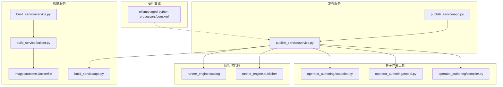
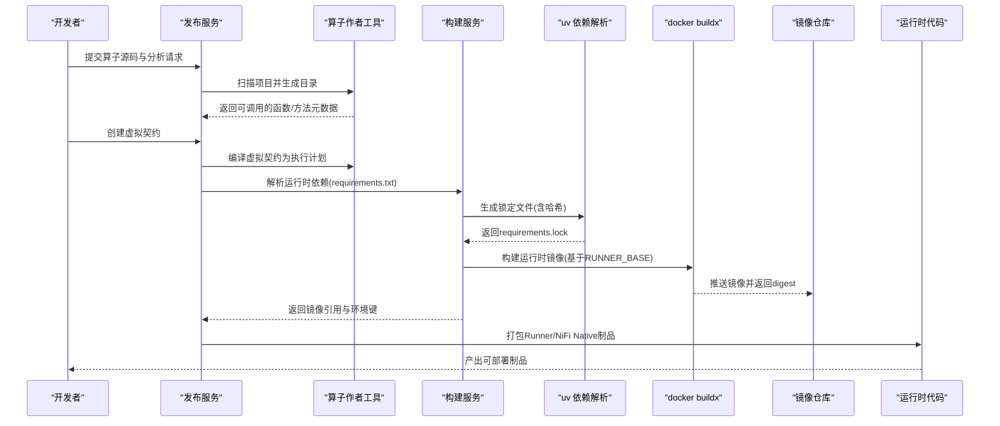
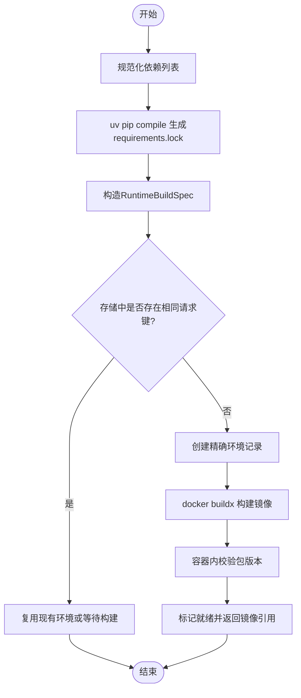
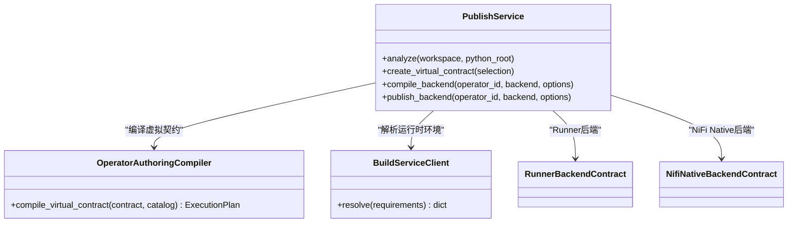
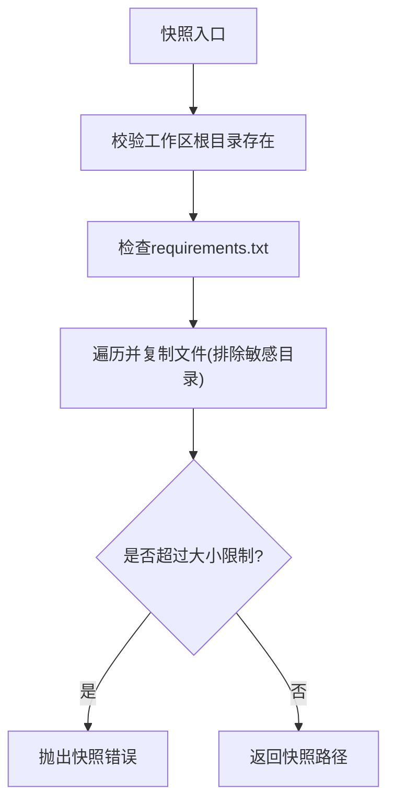
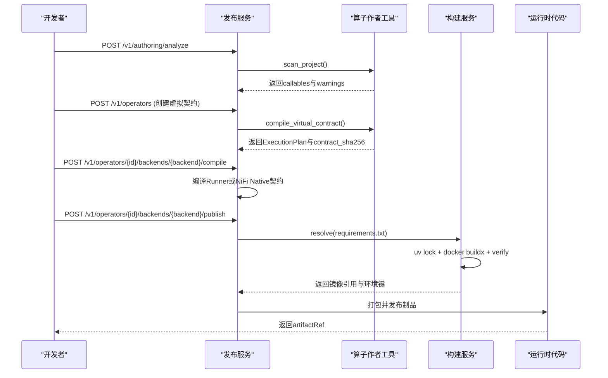
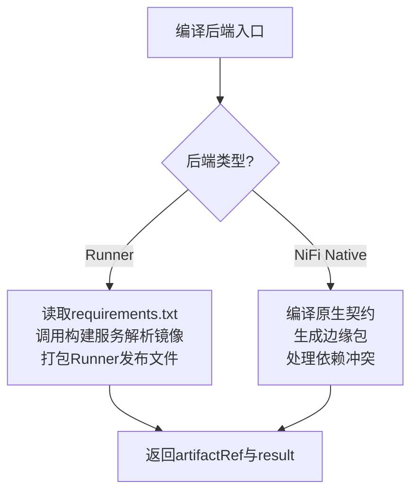

# 编译构建过程

<cite>
**本文引用的文件**   
- [pyproject.toml](file://pyproject.toml)
- [build_service/app.py](file://build_service/app.py)
- [build_service/service.py](file://build_service/service.py)
- [build_service/builder.py](file://build_service/builder.py)
- [images/runtime.Dockerfile](file://images/runtime.Dockerfile)
- [publish_service/app.py](file://publish_service/app.py)
- [publish_service/service.py](file://publish_service/service.py)
- [operator_authoring/compiler.py](file://operator_authoring/compiler.py)
- [operator_authoring/model.py](file://operator_authoring/model.py)
- [operator_authoring/snapshot.py](file://operator_authoring/snapshot.py)
- [nifi/managed-python-processors/pom.xml](file://nifi/managed-python-processors/pom.xml)
</cite>

## 目录
1. [引言](#引言)
2. [项目结构](#项目结构)
3. [核心组件](#核心组件)
4. [架构总览](#架构总览)
5. [详细组件分析](#详细组件分析)
6. [依赖分析与版本管理](#依赖分析与版本管理)
7. [快照机制与可重复性](#快照机制与可重复性)
8. [编译配置选项与优化策略](#编译配置选项与优化策略)
9. [完整编译流程示例](#完整编译流程示例)
10. [错误诊断与调试技巧](#错误诊断与调试技巧)
11. [后端兼容性：Runner 与 NiFi Native](#后端兼容性runner-与-nifi-native)
12. [性能与可靠性建议](#性能与可靠性建议)
13. [结论](#结论)

## 引言
本指南面向希望理解“Python 源代码如何被编译为可执行制品”的工程师与运维人员。系统围绕两条主线展开：
- 算子虚拟契约编译：将 Python 源码扫描、建模并编译为后端无关的执行计划，再针对 Runner 或 NiFi Native 生成具体发布产物。
- 运行时环境构建：根据用户依赖声明生成锁定文件，构建隔离镜像，并通过校验确保包版本一致。

该过程强调依赖解析、版本锁定、环境隔离、快照不可变性与多后端兼容。

## 项目结构
仓库采用服务化分层组织：
- build_service：负责运行时环境的依赖解析、镜像构建与验证。
- publish_service：负责算子分析、虚拟契约创建、后端编译与发布。
- operator_authoring：提供 AST 扫描、模型定义、编译器与快照工具。
- runner_engine：运行时调度、生命周期与发布器（供 publish_service 调用）。
- nifi：NiFi Java 侧处理器与 gRPC 集成。
- images：Docker 镜像模板。

**图表来源**
- [build_service/app.py:106-181](file://build_service/app.py#L106-L181)
- [build_service/service.py:26-216](file://build_service/service.py#L26-L216)
- [build_service/builder.py:122-158](file://build_service/builder.py#L122-L158)
- [images/runtime.Dockerfile:21-65](file://images/runtime.Dockerfile#L21-L65)
- [publish_service/app.py:135-347](file://publish_service/app.py#L135-L347)
- [publish_service/service.py:71-110](file://publish_service/service.py#L71-L110)
- [operator_authoring/compiler.py:167-236](file://operator_authoring/compiler.py#L167-L236)
- [operator_authoring/model.py:85-108](file://operator_authoring/model.py#L85-L108)
- [operator_authoring/snapshot.py:13-47](file://operator_authoring/snapshot.py#L13-L47)
- [nifi/managed-python-processors/pom.xml:57-89](file://nifi/managed-python-processors/pom.xml#L57-L89)

**章节来源**
- [pyproject.toml:1-37](file://pyproject.toml#L1-L37)

## 核心组件
- 构建服务（Build Service）
  - 暴露运行时环境解析与重试接口。
  - 通过 uv 生成锁定文件，使用 docker buildx 构建镜像，并校验镜像内包版本。
- 发布服务（Publish Service）
  - 暴露算子分析、虚拟契约创建、后端编译与发布接口。
  - 协调算子源码快照、AST 扫描、虚拟契约编译、依赖解析与镜像绑定。
- 算子作者工具（Operator Authoring）
  - 定义算子模型、参数绑定、输出规范等。
  - 实现虚拟契约到执行计划的编译器。
  - 提供工作区快照与 requirements.txt 解析。
- NiFi 集成
  - Java 端处理器与 gRPC 协议，用于在 NiFi 中运行 Python 算子。

**章节来源**
- [build_service/app.py:106-181](file://build_service/app.py#L106-L181)
- [build_service/service.py:26-216](file://build_service/service.py#L26-L216)
- [publish_service/app.py:135-347](file://publish_service/app.py#L135-L347)
- [publish_service/service.py:71-110](file://publish_service/service.py#L71-L110)
- [operator_authoring/compiler.py:167-236](file://operator_authoring/compiler.py#L167-L236)
- [operator_authoring/model.py:85-108](file://operator_authoring/model.py#L85-L108)
- [operator_authoring/snapshot.py:13-47](file://operator_authoring/snapshot.py#L13-L47)
- [nifi/managed-python-processors/pom.xml:57-89](file://nifi/managed-python-processors/pom.xml#L57-L89)

## 架构总览
下图展示从 Python 源码到最终制品的关键交互：

**图表来源**
- [publish_service/app.py:201-277](file://publish_service/app.py#L201-L277)
- [publish_service/service.py:418-477](file://publish_service/service.py#L418-L477)
- [operator_authoring/compiler.py:167-236](file://operator_authoring/compiler.py#L167-L236)
- [build_service/app.py:140-179](file://build_service/app.py#L140-L179)
- [build_service/service.py:31-119](file://build_service/service.py#L31-L119)
- [build_service/builder.py:84-158](file://build_service/builder.py#L84-L158)

## 详细组件分析

### 构建服务：依赖解析、镜像构建与验证
- 依赖解析
  - 接收 requirements 列表，规范化后交由 uv 生成带哈希的锁定文件。
  - 支持指定 Python 版本与平台，以及默认索引源。
- 镜像构建
  - 使用 docker buildx 构建多阶段镜像：第一阶段安装依赖，第二阶段拷贝依赖并设置环境变量。
  - 通过 metadata-file 获取镜像 digest，作为不可变引用。
- 镜像验证
  - 在容器内检查已安装包名称与版本是否与预期一致，不一致则失败。

**图表来源**
- [build_service/service.py:31-119](file://build_service/service.py#L31-L119)
- [build_service/builder.py:84-158](file://build_service/builder.py#L84-L158)

**章节来源**
- [build_service/app.py:106-181](file://build_service/app.py#L106-L181)
- [build_service/service.py:26-216](file://build_service/service.py#L26-L216)
- [build_service/builder.py:62-158](file://build_service/builder.py#L62-L158)
- [images/runtime.Dockerfile:21-65](file://images/runtime.Dockerfile#L21-L65)

### 发布服务：算子分析、虚拟契约与后端编译
- 算子分析
  - 扫描 Python 源码，识别函数与方法，提取参数信息、装饰器、返回值注解等。
  - 返回可调用的候选项及不支持原因，辅助开发者选择目标。
- 虚拟契约创建
  - 校验工作区变更，保存不可变源码快照，再次扫描生成不可变目录。
  - 编译虚拟契约为执行计划，计算契约 SHA256，持久化契约与派生参数。
- 后端编译与发布
  - Runner：读取 requirements.txt，调用构建服务解析运行时镜像，打包 Runner 发布文件。
  - NiFi Native：编译原生契约，生成边缘包，处理依赖冲突与平台矩阵。

**图表来源**
- [publish_service/service.py:418-477](file://publish_service/service.py#L418-L477)
- [operator_authoring/compiler.py:167-236](file://operator_authoring/compiler.py#L167-L236)
- [publish_service/service.py:569-622](file://publish_service/service.py#L569-L622)

**章节来源**
- [publish_service/app.py:201-277](file://publish_service/app.py#L201-L277)
- [publish_service/service.py:385-477](file://publish_service/service.py#L385-L477)
- [publish_service/service.py:569-622](file://publish_service/service.py#L569-L622)

### 算子作者工具：模型、编译器与快照
- 模型定义
  - 定义可调用类型、参数绑定、输出规范、算子元数据、虚拟契约等。
  - 提供目录扫描结果的结构化表示，包括警告与错误。
- 编译器
  - 校验源修订与 Python 路径一致性，拒绝语法错误。
  - 校验目标可调用与类构造参数绑定，生成执行计划与契约摘要。
- 快照
  - 复制工作区文件，排除敏感目录，禁止符号链接，限制大小。
  - 解析 requirements.txt，过滤注释与无效行，拒绝 pip 选项。

**图表来源**
- [operator_authoring/snapshot.py:13-47](file://operator_authoring/snapshot.py#L13-L47)

**章节来源**
- [operator_authoring/model.py:85-108](file://operator_authoring/model.py#L85-L108)
- [operator_authoring/compiler.py:167-236](file://operator_authoring/compiler.py#L167-L236)
- [operator_authoring/snapshot.py:13-72](file://operator_authoring/snapshot.py#L13-L72)

## 依赖分析与版本管理
- 依赖解析
  - 使用 uv 进行依赖解析与锁定，生成包含哈希的 requirements.lock。
  - 支持指定 Python 版本与平台，确保跨平台一致性。
- 版本管理
  - 通过镜像 digest 与契约 SHA256 双重不可变性保证构建可重复。
  - 构建服务支持“超集复用”，当请求依赖是已有环境的超集时直接复用，减少重复构建。
- 环境隔离
  - 镜像内依赖安装在独立目录，PYTHONPATH 仅指向可信路径，避免污染信任代理。

**章节来源**
- [build_service/builder.py:84-158](file://build_service/builder.py#L84-L158)
- [build_service/service.py:86-97](file://build_service/service.py#L86-L97)
- [images/runtime.Dockerfile:56-65](file://images/runtime.Dockerfile#L56-L65)

## 快照机制与可重复性
- 工作区快照
  - 复制源码到隔离目录，排除敏感目录，禁止符号链接，限制大小。
  - 要求顶层存在 requirements.txt，即使为空。
- 不可变契约
  - 虚拟契约包含 source_revision 与 source_ref，编译器强制匹配目录快照。
  - 契约 SHA256 由序列化后的 JSON 计算，确保契约内容稳定。
- 可重复构建
  - 依赖锁定文件包含哈希，镜像构建使用固定 base image 与 platform。
  - 镜像 digest 与契约摘要共同构成制品唯一标识。

**章节来源**
- [operator_authoring/snapshot.py:13-72](file://operator_authoring/snapshot.py#L13-L72)
- [operator_authoring/compiler.py:167-174](file://operator_authoring/compiler.py#L167-L174)
- [operator_authoring/compiler.py:47-53](file://operator_authoring/compiler.py#L47-L53)
- [build_service/builder.py:122-158](file://build_service/builder.py#L122-L158)

## 编译配置选项与优化策略
- 构建服务配置
  - base_image：基础镜像引用。
  - registry_repo：镜像仓库地址。
  - python_version：Python 版本。
  - platform：目标平台。
  - uv_python_platform：uv 使用的 Python 平台三元组。
  - uv_default_index：默认索引源。
  - allow_superset_reuse：允许超集复用。
- 发布服务配置
  - workspace_root、catalog_root、source_root：工作区与目录根。
  - edge_python_version：边缘 Python 版本。
  - edge_uv_default_index：边缘依赖索引。
  - edge_require_binary：是否要求二进制依赖。
  - build_timeout_seconds：构建超时。
  - max_source_bytes：源码快照大小上限。
- 优化策略
  - 超集复用减少重复构建。
  - 多阶段镜像分离依赖安装与运行环境。
  - 锁定文件与镜像 digest 提升可重复性。
  - Runner 与 NiFi Native 并行编译不同后端，按需发布。

**章节来源**
- [build_service/service.py:14-24](file://build_service/service.py#L14-L24)
- [publish_service/service.py:53-69](file://publish_service/service.py#L53-L69)
- [build_service/service.py:86-97](file://build_service/service.py#L86-L97)
- [build_service/builder.py:122-158](file://build_service/builder.py#L122-L158)

## 完整编译流程示例
以下示例描述从 Python 源码到最终制品的端到端步骤：

1. 准备源码
   - 在工作区根目录放置 requirements.txt（可为空），并确保 Python 源码位于 src 或当前目录。
2. 分析算子
   - 调用发布服务的分析接口，传入 workspace 与可选 python_root。
   - 返回可调用的函数/方法列表及其参数信息。
3. 创建虚拟契约
   - 选择目标 callable，配置输入/输出绑定与算子参数。
   - 调用创建虚拟契约接口，返回契约 ID、SHA256 与派生参数。
4. 编译后端
   - 选择后端 runner 或 nifi_native，传入选项（如 profile 或 native target）。
   - 返回后端契约与变体信息。
5. 发布制品
   - Runner：读取 requirements.txt，调用构建服务解析运行时镜像，打包 Runner 发布文件。
   - NiFi Native：编译原生契约，生成边缘包，处理依赖冲突与平台矩阵。
6. 下载与部署
   - 通过发布服务提供的下载接口获取边缘包或 Runner 制品。
   - 在 NiFi 或 Runner 环境中部署并运行。

**图表来源**
- [publish_service/app.py:201-277](file://publish_service/app.py#L201-L277)
- [publish_service/service.py:385-477](file://publish_service/service.py#L385-L477)
- [publish_service/service.py:624-774](file://publish_service/service.py#L624-L774)
- [build_service/app.py:140-179](file://build_service/app.py#L140-L179)
- [build_service/service.py:31-119](file://build_service/service.py#L31-L119)

**章节来源**
- [publish_service/app.py:201-277](file://publish_service/app.py#L201-L277)
- [publish_service/service.py:385-477](file://publish_service/service.py#L385-L477)
- [publish_service/service.py:624-774](file://publish_service/service.py#L624-L774)
- [build_service/app.py:140-179](file://build_service/app.py#L140-L179)
- [build_service/service.py:31-119](file://build_service/service.py#L31-L119)

## 错误诊断与调试技巧
- 依赖解析错误
  - 检查 requirements.txt 是否包含无效行或 pip 选项；构建服务会拒绝此类配置。
  - 查看构建服务日志中的“Runtime environment resolve failed”与“Runtime environment build FAILED”。
- 镜像构建失败
  - 确认基础镜像可达、registry 配置正确、platform 与 uv_python_platform 匹配。
  - 使用构建服务重试接口恢复失败的构建。
- 契约编译错误
  - 检查 source_revision 与 python_path 是否匹配快照目录。
  - 检查目标 callable 是否支持（异步、参数类型、类构造参数）。
- 运行时验证失败
  - 检查镜像内包名称与版本是否与预期一致；查看 verify_runtime_image 的输出。
- 调试建议
  - 提高日志级别，观察各服务健康检查与健康状态字段。
  - 使用最小工作区复现问题，逐步添加依赖与代码定位错误。

**章节来源**
- [build_service/app.py:140-179](file://build_service/app.py#L140-L179)
- [build_service/service.py:157-216](file://build_service/service.py#L157-L216)
- [operator_authoring/compiler.py:167-186](file://operator_authoring/compiler.py#L167-L186)
- [build_service/builder.py:161-205](file://build_service/builder.py#L161-L205)

## 后端兼容性：Runner 与 NiFi Native
- Runner 后端
  - 读取 requirements.txt，调用构建服务解析运行时镜像。
  - 打包 Runner 发布文件，返回 releaseId、runtimeImage 与 processorDefinition。
- NiFi Native 后端
  - 编译原生契约，生成边缘包，处理依赖冲突与平台矩阵。
  - 通过 Java 端处理器与 gRPC 协议在 NiFi 中运行 Python 算子。
- 兼容性处理
  - 发布服务统一编排两种后端，返回统一的变体视图与状态。
  - 通过 compiler_version 与 variant_key 区分不同编译产物。

**图表来源**
- [publish_service/service.py:569-622](file://publish_service/service.py#L569-L622)
- [publish_service/service.py:711-774](file://publish_service/service.py#L711-L774)
- [nifi/managed-python-processors/pom.xml:57-89](file://nifi/managed-python-processors/pom.xml#L57-L89)

**章节来源**
- [publish_service/service.py:569-622](file://publish_service/service.py#L569-L622)
- [publish_service/service.py:711-774](file://publish_service/service.py#L711-L774)
- [nifi/managed-python-processors/pom.xml:57-89](file://nifi/managed-python-processors/pom.xml#L57-L89)

## 性能与可靠性建议
- 启用超集复用以减少重复构建。
- 使用稳定的基础镜像与平台配置，避免频繁重建。
- 合理划分工作区与依赖范围，降低锁定文件体积。
- 监控构建服务与发布服务的健康检查与日志。
- 对 NiFi Native 后端，提前评估依赖冲突与平台矩阵，减少发布失败。

[本节为通用指导，不直接分析具体文件]

## 结论
本指南系统阐述了 Python 源码到可执行制品的编译构建过程，涵盖依赖解析、版本管理、环境隔离、快照机制、配置选项与优化策略，并提供完整的端到端流程与错误诊断方法。通过 Runner 与 NiFi Native 双后端支持，系统在可重复性、可观测性与兼容性方面提供了坚实基础。

[本节为总结，不直接分析具体文件]