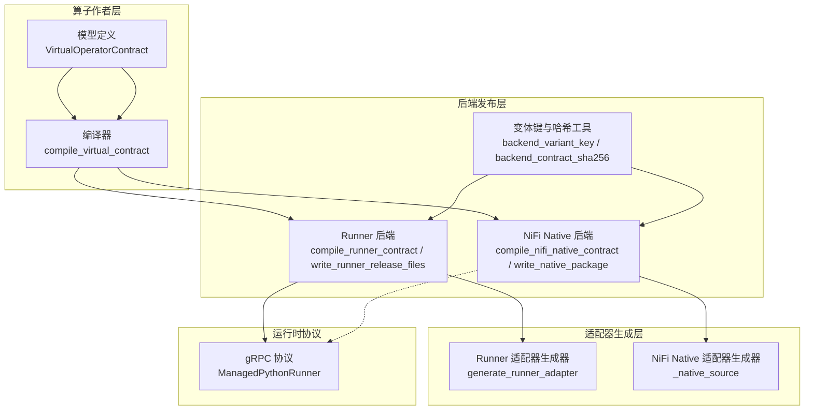
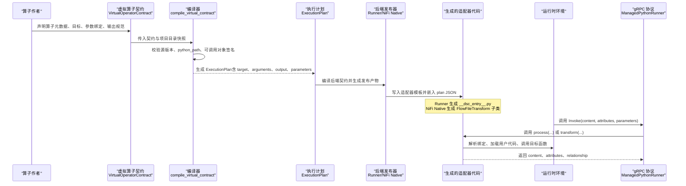
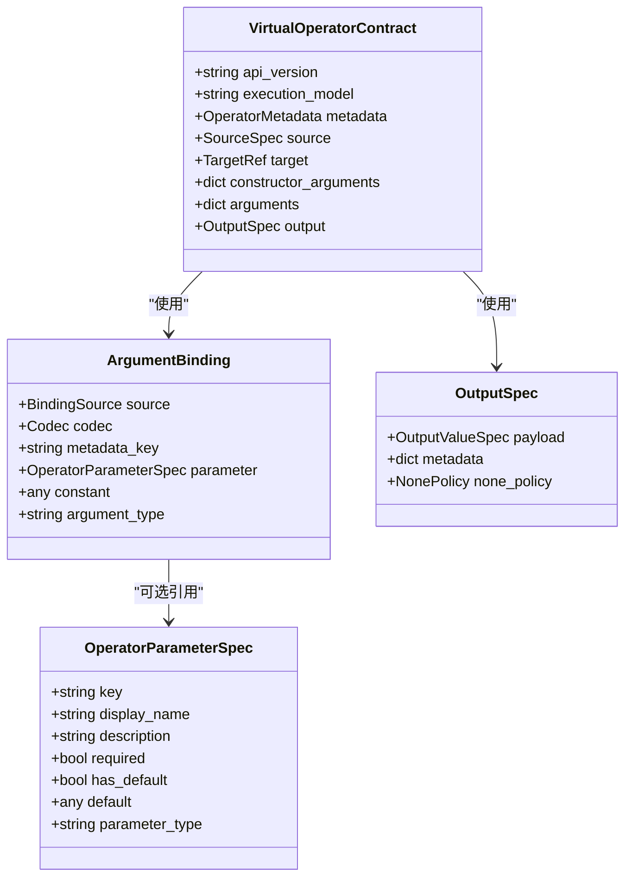
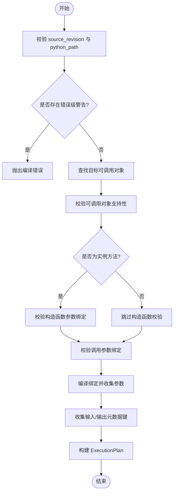
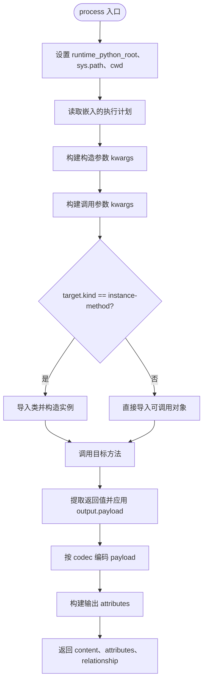
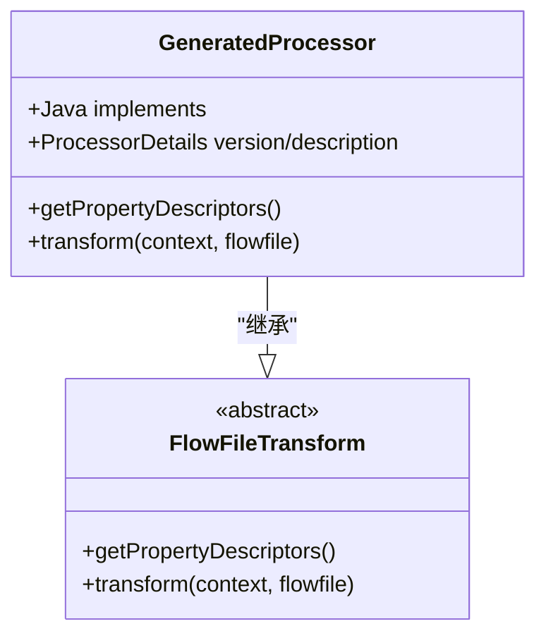
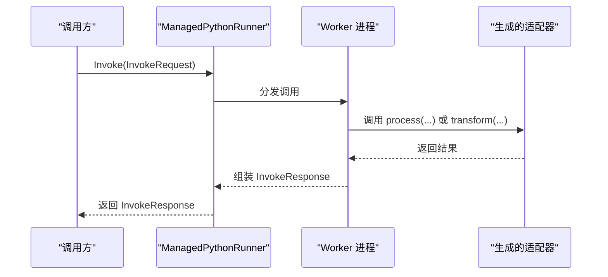
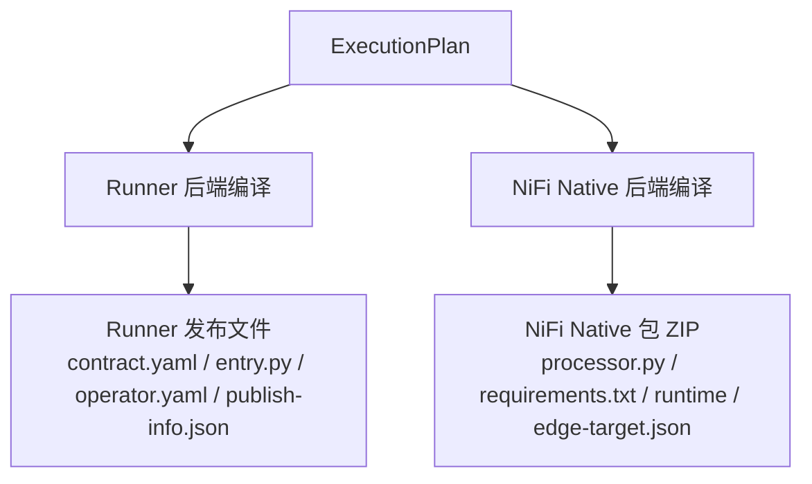
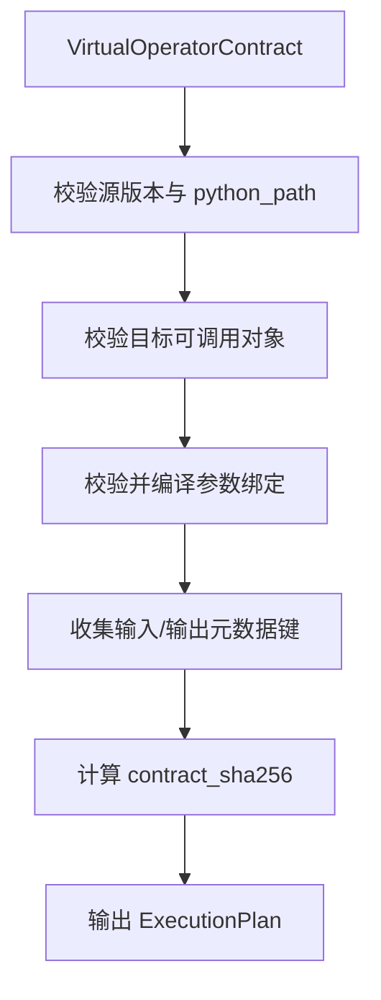
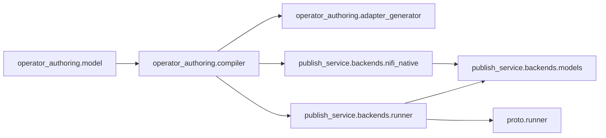

# 适配器生成机制

<cite>
**本文引用的文件**   
- [adapter_generator.py](file://operator_authoring/adapter_generator.py)
- [compiler.py](file://operator_authoring/compiler.py)
- [model.py](file://operator_authoring/model.py)
- [runner.proto](file://proto/runner.proto)
- [base.py](file://publish_service/backends/base.py)
- [runner.py](file://publish_service/backends/runner.py)
- [nifi_native.py](file://publish_service/backends/nifi_native.py)
- [models.py](file://publish_service/backends/models.py)
</cite>

## 目录
1. [引言](#引言)
2. [项目结构](#项目结构)
3. [核心组件](#核心组件)
4. [架构总览](#架构总览)
5. [详细组件分析](#详细组件分析)
6. [依赖关系分析](#依赖关系分析)
7. [性能与优化](#性能与优化)
8. [故障排查指南](#故障排查指南)
9. [结论](#结论)
10. [附录：从抽象定义到具体实现的转换示例](#附录从抽象定义到具体实现的转换示例)

## 引言
本技术文档聚焦于“适配器生成机制”，解释系统如何根据算子（Operator）的抽象定义，自动生成可在不同后端运行的适配代码。重点覆盖以下方面：
- gRPC 协议绑定、消息序列化与类型映射
- 运行时参数绑定、输入输出编解码
- Runner 与 NiFi Native 两种后端的差异与生成策略
- 接口契约校验与转换流程
- 自定义适配器扩展开发指南
- 性能优化与最佳实践

该机制的核心思想是：将用户编写的 Python 可调用对象（函数或类方法）通过“虚拟算子契约”进行声明式描述，再由编译器将其编译为执行计划，最后由后端适配器生成器产出可直接部署的运行时代码。

## 项目结构
与适配器生成相关的核心模块分布如下：
- operator_authoring：负责算子扫描、模型定义、编译器与适配器模板生成
- proto：定义 Runner 的 gRPC 服务与消息
- publish_service/backends：面向不同运行后端的发布产物构建逻辑

**图表来源**
- [model.py:203-212](file://operator_authoring/model.py#L203-L212)
- [compiler.py:167-236](file://operator_authoring/compiler.py#L167-L236)
- [adapter_generator.py:247-254](file://operator_authoring/adapter_generator.py#L247-L254)
- [nifi_native.py:504-530](file://publish_service/backends/nifi_native.py#L504-L530)
- [runner.py:23-67](file://publish_service/backends/runner.py#L23-L67)
- [runner.py:70-114](file://publish_service/backends/runner.py#L70-L114)
- [nifi_native.py:103-168](file://publish_service/backends/nifi_native.py#L103-L168)
- [base.py:10-27](file://publish_service/backends/base.py#L10-L27)
- [runner.proto:8-15](file://proto/runner.proto#L8-L15)

**章节来源**
- [model.py:9-212](file://operator_authoring/model.py#L9-L212)
- [compiler.py:1-237](file://operator_authoring/compiler.py#L1-L237)
- [runner.py:1-114](file://publish_service/backends/runner.py#L1-L114)
- [nifi_native.py:1-582](file://publish_service/backends/nifi_native.py#L1-L582)
- [base.py:1-28](file://publish_service/backends/base.py#L1-L28)
- [runner.proto:1-76](file://proto/runner.proto#L1-L76)

## 核心组件
- 虚拟算子契约与模型
  - VirtualOperatorContract：声明算子的元数据、源码位置、目标可调用对象、构造参数、调用参数、输出规范等
  - ArgumentBinding：描述如何将输入载荷、元数据、算子参数或常量映射到目标函数的参数
  - OutputSpec：描述返回值的提取路径、编码格式与空值策略
- 编译器
  - compile_virtual_contract：校验契约与目录快照一致性，验证可调用对象签名，合并参数定义，生成 ExecutionPlan
- 适配器生成器
  - Runner 适配器：生成 __dsc_entry__.py，内嵌执行计划，提供 process(content, attributes, parameters) 入口
  - NiFi Native 适配器：生成 FlowFileTransform 子类，封装属性描述符与 transform(context, flowfile) 实现
- 后端发布器
  - Runner 后端：输出 operator-contract.yaml、__dsc_entry__.py、operator.yaml、publish-info.json
  - NiFi Native 后端：打包 Python 包 ZIP，包含生成的处理器类、requirements.txt、runtime 目录与 edge-target.json
- gRPC 协议
  - ManagedPythonRunner：健康检查、租约管理、Invoke/Cancel/ReleaseLease 等 RPC

**章节来源**
- [model.py:41-212](file://operator_authoring/model.py#L41-L212)
- [compiler.py:18-45](file://operator_authoring/compiler.py#L18-L45)
- [compiler.py:167-236](file://operator_authoring/compiler.py#L167-L236)
- [adapter_generator.py:8-244](file://operator_authoring/adapter_generator.py#L8-L244)
- [nifi_native.py:171-501](file://publish_service/backends/nifi_native.py#L171-L501)
- [runner.py:23-114](file://publish_service/backends/runner.py#L23-L114)
- [nifi_native.py:103-168](file://publish_service/backends/nifi_native.py#L103-L168)
- [runner.proto:8-76](file://proto/runner.proto#L8-L76)

## 架构总览
下图展示了从“算子定义”到“运行时调用”的端到端流程。

**图表来源**
- [model.py:203-212](file://operator_authoring/model.py#L203-L212)
- [compiler.py:167-236](file://operator_authoring/compiler.py#L167-L236)
- [runner.py:70-114](file://publish_service/backends/runner.py#L70-L114)
- [nifi_native.py:533-581](file://publish_service/backends/nifi_native.py#L533-L581)
- [runner.proto:40-62](file://proto/runner.proto#L40-L62)

## 详细组件分析

### 虚拟算子契约与模型
- VirtualOperatorContract
  - 字段包括 api_version、execution_model、metadata、source、target、constructor_arguments、arguments、output
  - source.python_path 必须为相对 POSIX 路径且不能越出快照目录
  - metadata.name 仅允许字母、数字、点、下划线与连字符
- ArgumentBinding
  - source 支持 input.payload、input.metadata、operator.parameter、constant
  - codec 支持 bytes、text、json、binary_stream
  - 当 source 为 input.metadata 时必须提供 metadata_key；为 operator.parameter 时必须提供 parameter
- OutputSpec
  - payload.source 支持 return、return.path、constant
  - payload.codec 控制输出编码；none_policy 控制返回 None 时的行为（保留原内容或置空）

**图表来源**
- [model.py:111-212](file://operator_authoring/model.py#L111-L212)

**章节来源**
- [model.py:41-212](file://operator_authoring/model.py#L41-L212)

### 编译器与执行计划
- 校验阶段
  - 校验 source_revision 与 catalog 一致
  - 校验 python_path 与 catalog 一致
  - 若存在错误级警告则抛出编译错误
  - 校验 callable_id 存在且支持（不支持异步、参数 kind 限制、实例方法需有类元数据）
- 参数绑定校验
  - 构造函数参数与调用参数分别校验是否匹配已知参数名
  - 必填参数必须有绑定
  - operator.parameter 会合并为统一的 CompiledParameter，冲突时抛错
- 输出元数据收集
  - 从所有绑定中收集 input.metadata 使用的键集合
  - 收集 output.metadata 的键集合

**图表来源**
- [compiler.py:167-236](file://operator_authoring/compiler.py#L167-L236)

**章节来源**
- [compiler.py:18-45](file://operator_authoring/compiler.py#L18-L45)
- [compiler.py:56-78](file://operator_authoring/compiler.py#L56-L78)
- [compiler.py:85-149](file://operator_authoring/compiler.py#L85-L149)
- [compiler.py:167-236](file://operator_authoring/compiler.py#L167-L236)

### Runner 适配器生成器
- 生成入口
  - generate_runner_adapter(plan) 将 ExecutionPlan 序列化为 JSON 并嵌入模板，产出 __dsc_entry__.py
- 运行时入口
  - process(content, attributes, parameters)
  - 动态设置 sys.path 与 cwd 为用户 runtime_python_root
  - 根据 target_spec 决定调用方式：
    - instance-method：先导入类并构造实例，再调用方法
    - 其他：直接导入模块中的可调用对象
- 参数绑定与解码
  - _resolve_binding 支持四种 source：input.payload、input.metadata、operator.parameter、constant
  - _decode 支持 codecs：bytes、text、json、binary_stream
- 输出编码
  - _encode_payload 支持 bytes、text、json
  - _metadata_text 将任意值转为字符串形式的元数据
- 空值策略
  - 若返回值为 None 且 none_policy 为 keep-original，则保留原始 content；否则输出空字节

**图表来源**
- [adapter_generator.py:188-244](file://operator_authoring/adapter_generator.py#L188-L244)
- [adapter_generator.py:44-103](file://operator_authoring/adapter_generator.py#L44-L103)
- [adapter_generator.py:164-186](file://operator_authoring/adapter_generator.py#L164-L186)

**章节来源**
- [adapter_generator.py:8-244](file://operator_authoring/adapter_generator.py#L8-L244)
- [adapter_generator.py:247-254](file://operator_authoring/adapter_generator.py#L247-L254)

### NiFi Native 适配器生成器
- 生成入口
  - _native_source(contract, plan) 将 ExecutionPlan 与属性列表嵌入模板，生成 FlowFileTransform 子类
- 运行时入口
  - transform(context, flowfile)
  - 从 FlowFile 获取 content 与 attributes，并从 context.getProperty 读取算子属性
  - 动态设置 sys.path 与 cwd 为用户 runtime_python_root
  - 构造 PropertyDescriptor 列表以暴露算子属性
- 参数绑定与解码
  - 与 Runner 适配器类似，但针对 NiFi 的属性与 FlowFile API
- 输出处理
  - 将结果转换为 FlowFileTransformResult，包含 relationship、contents、attributes

**图表来源**
- [nifi_native.py:385-501](file://publish_service/backends/nifi_native.py#L385-L501)

**章节来源**
- [nifi_native.py:171-501](file://publish_service/backends/nifi_native.py#L171-L501)
- [nifi_native.py:504-530](file://publish_service/backends/nifi_native.py#L504-L530)
- [nifi_native.py:533-581](file://publish_service/backends/nifi_native.py#L533-L581)

### gRPC 协议绑定与消息序列化
- ManagedPythonRunner 服务
  - Health：健康检查
  - AcquireLease/RenewLease/ReleaseLease：租约生命周期
  - Invoke：调用算子，携带 tenant_id、lease_id、release_id、invocation_id、idempotency_key、content、attributes、parameters、timeout_ms
  - Cancel：取消调用
- InvokeRequest/InvokeResponse
  - content 为二进制载荷
  - attributes 与 parameters 为字符串键值对
  - InvokeResponse 包含 status、relationship、content、attributes、retryable、error_code、error_message、worker_id、duration_ms

**图表来源**
- [runner.proto:8-76](file://proto/runner.proto#L8-L76)

**章节来源**
- [runner.proto:8-76](file://proto/runner.proto#L8-L76)

### 后端差异与生成策略
- Runner 后端
  - 生成 runner-contract-v4 语义
  - 输出 operator-contract.yaml、__dsc_entry__.py、operator.yaml、publish-info.json
  - entrypoint 固定为 __dsc_entry__:process
  - 通过 RUNNER_RUNTIME_ROOT 提供可写运行时视图
- NiFi Native 后端
  - 生成 nifi-native-contract-v2 语义
  - 输出 Python 包 ZIP，包含生成的 Processor 类、requirements.txt、runtime 目录、edge-target.json
  - 基于 FlowFileTransform 与 PropertyDescriptor 暴露算子属性
  - 支持多平台打包（Linux x86_64/aarch64、Windows x86_64/aarch64）

**图表来源**
- [runner.py:23-67](file://publish_service/backends/runner.py#L23-L67)
- [runner.py:70-114](file://publish_service/backends/runner.py#L70-L114)
- [nifi_native.py:103-168](file://publish_service/backends/nifi_native.py#L103-L168)
- [nifi_native.py:533-581](file://publish_service/backends/nifi_native.py#L533-L581)

**章节来源**
- [runner.py:17-114](file://publish_service/backends/runner.py#L17-L114)
- [nifi_native.py:20-168](file://publish_service/backends/nifi_native.py#L20-L168)
- [nifi_native.py:533-581](file://publish_service/backends/nifi_native.py#L533-L581)

### 接口契约的验证与转换过程
- 契约校验
  - 源版本与 python_path 必须与目录快照一致
  - 目标可调用对象必须存在且支持
  - 构造函数与调用参数绑定必须完整且无冲突
- 转换过程
  - 将 ArgumentBinding 编译为运行时可执行的绑定描述
  - 收集 input/output 元数据键集合
  - 计算 contract_sha256 用于变体键与缓存

**图表来源**
- [compiler.py:167-236](file://operator_authoring/compiler.py#L167-L236)

**章节来源**
- [compiler.py:167-236](file://operator_authoring/compiler.py#L167-L236)

## 依赖关系分析
- 模块耦合
  - adapter_generator.py 依赖 compiler.ExecutionPlan 与 model.VirtualOperatorContract
  - runner.py 与 nifi_native.py 均依赖 base.backend_variant_key 与 models 中的后端契约模型
  - runner.proto 定义运行时协议，被 Runner 后端消费
- 外部依赖
  - pydantic 用于模型校验
  - yaml 用于 Runner 后端契约与 manifest 序列化
  - zipfile/shutil/tempfile 用于 NiFi Native 包打包

**图表来源**
- [adapter_generator.py:1-10](file://operator_authoring/adapter_generator.py#L1-L10)
- [runner.py:1-14](file://publish_service/backends/runner.py#L1-L14)
- [nifi_native.py:1-17](file://publish_service/backends/nifi_native.py#L1-L17)
- [models.py:1-73](file://publish_service/backends/models.py#L1-L73)
- [runner.proto:1-15](file://proto/runner.proto#L1-L15)

**章节来源**
- [adapter_generator.py:1-10](file://operator_authoring/adapter_generator.py#L1-L10)
- [runner.py:1-14](file://publish_service/backends/runner.py#L1-L14)
- [nifi_native.py:1-17](file://publish_service/backends/nifi_native.py#L1-L17)
- [models.py:1-73](file://publish_service/backends/models.py#L1-L73)
- [runner.proto:1-15](file://proto/runner.proto#L1-L15)

## 性能与优化
- 避免不必要的序列化
  - 对于大二进制负载，优先使用 bytes 或 binary_stream codec，减少 JSON 编解码开销
- 控制元数据大小
  - 仅在 output.metadata 中放置必要字段，避免过大字符串影响网络传输
- 复用运行时环境
  - Runner 后端可通过 RUNNER_RUNTIME_ROOT 指向可写运行时视图，减少每次启动的初始化成本
- 合理选择输出编码
  - 文本型输出使用 text；结构化数据使用 json；二进制数据使用 bytes/binary_stream
- 避免在 process/transform 中进行重型 I/O
  - 尽量将耗时操作下沉到用户代码内部，适配器只负责绑定与编解码

[本节为通用指导，不直接分析具体文件]

## 故障排查指南
- 常见编译错误
  - 源版本不匹配：确保 VirtualOperatorContract.source.source_revision 与目录快照一致
  - python_path 不一致：确保 contract.source.python_path 与 catalog.python_path 一致
  - 目标可调用对象不存在：确认 callable_id 正确且存在于 ProjectCatalog
  - 异步可调用对象不被支持：Direct Invoke v1 不支持 async
  - 参数 kind 不受支持：仅支持 POSITIONAL_OR_KEYWORD 与 KEYWORD_ONLY
  - 实例方法缺少类元数据：确保 class_target 存在且可解析
  - 参数绑定缺失或冲突：检查 constructor_arguments 与 arguments 的绑定完整性与一致性
- 运行时错误
  - runtime root 不存在：检查 RUNNER_RUNTIME_ROOT 或默认 runtime 目录
  - python_path 逃逸：确保 compiled python_path 位于 runtime root 之下
  - 未支持的 binding source 或 output source：检查绑定与输出配置
  - 未支持的 codec：检查 ArgumentBinding.codec 与 OutputValueSpec.codec
  - 必填元数据或参数缺失：检查 binding.required 与 operator.parameter 配置

**章节来源**
- [compiler.py:167-236](file://operator_authoring/compiler.py#L167-L236)
- [adapter_generator.py:21-41](file://operator_authoring/adapter_generator.py#L21-L41)
- [adapter_generator.py:75-103](file://operator_authoring/adapter_generator.py#L75-L103)
- [adapter_generator.py:134-142](file://operator_authoring/adapter_generator.py#L134-L142)
- [adapter_generator.py:164-177](file://operator_authoring/adapter_generator.py#L164-L177)

## 结论
适配器生成机制通过“虚拟算子契约 + 编译器 + 后端适配器生成器”的分层设计，实现了从抽象定义到具体实现的自动化转换。Runner 与 NiFi Native 两种后端分别面向不同的部署场景：Runner 适合通过 gRPC 调用的远程执行，NiFi Native 适合在 NiFi 边缘环境中以原生处理器形式运行。系统在契约校验、参数绑定、编解码与输出处理等方面提供了统一的能力，同时保留了足够的扩展空间以支持新的后端与协议。

[本节为总结性内容，不直接分析具体文件]

## 附录：从抽象定义到具体实现的转换示例
以下示例展示一个典型的转换流程（不展示具体代码内容，仅提供路径参考）：
- 定义虚拟算子契约
  - 指定 metadata.name、source.python_path、target.callable_id、arguments 与 output
  - 参考路径：[VirtualOperatorContract:203-212](file://operator_authoring/model.py#L203-L212)
- 编译为执行计划
  - 校验契约与目录快照一致性，生成 ExecutionPlan
  - 参考路径：[compile_virtual_contract:167-236](file://operator_authoring/compiler.py#L167-L236)
- Runner 后端发布
  - 生成 operator-contract.yaml、__dsc_entry__.py、operator.yaml、publish-info.json
  - 参考路径：[write_runner_release_files:70-114](file://publish_service/backends/runner.py#L70-L114)
- NiFi Native 后端发布
  - 生成 FlowFileTransform 子类并打包 ZIP
  - 参考路径：[write_native_package:533-581](file://publish_service/backends/nifi_native.py#L533-L581)
- 运行时调用
  - gRPC Invoke 调用 process/transform，完成参数绑定与编解码
  - 参考路径：[runner.proto InvokeRequest/InvokeResponse:40-62](file://proto/runner.proto#L40-L62)

**章节来源**
- [model.py:203-212](file://operator_authoring/model.py#L203-L212)
- [compiler.py:167-236](file://operator_authoring/compiler.py#L167-L236)
- [runner.py:70-114](file://publish_service/backends/runner.py#L70-L114)
- [nifi_native.py:533-581](file://publish_service/backends/nifi_native.py#L533-L581)
- [runner.proto:40-62](file://proto/runner.proto#L40-L62)