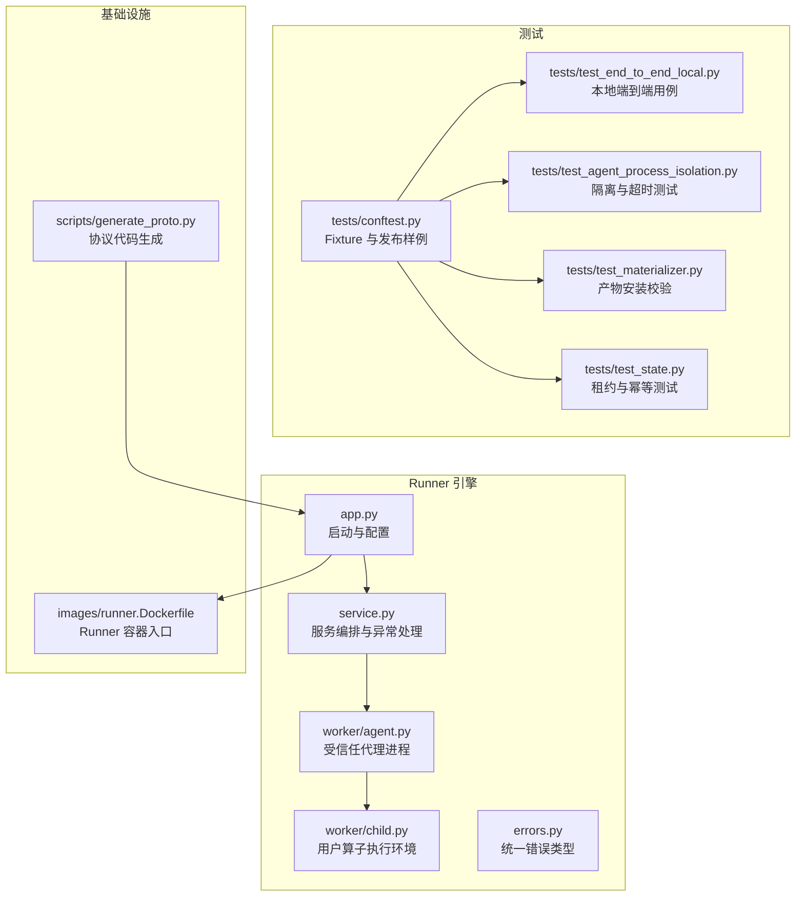
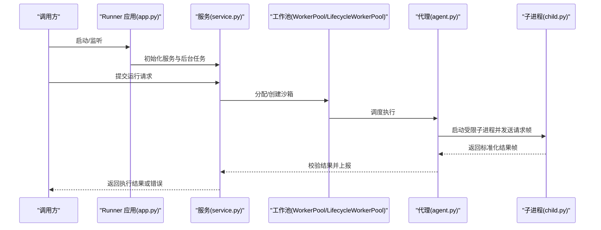
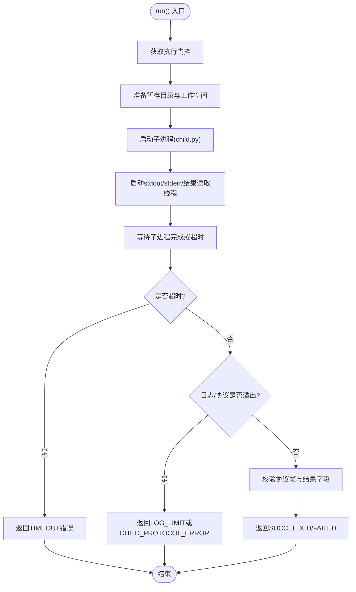
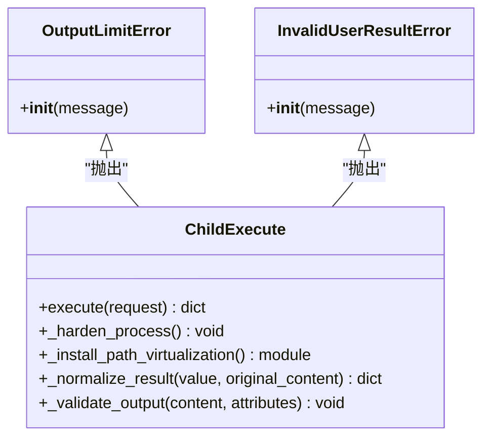
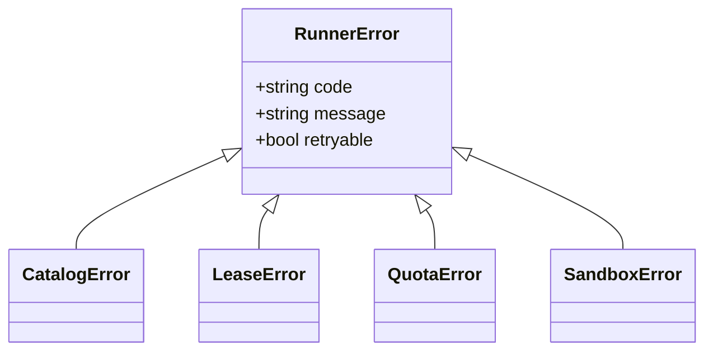
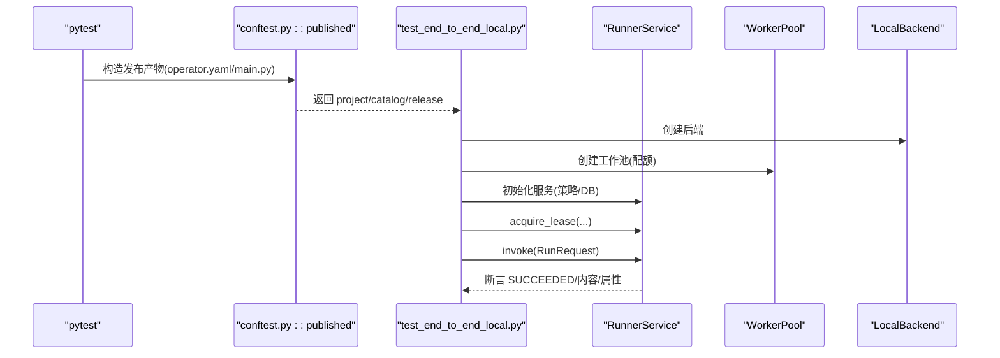
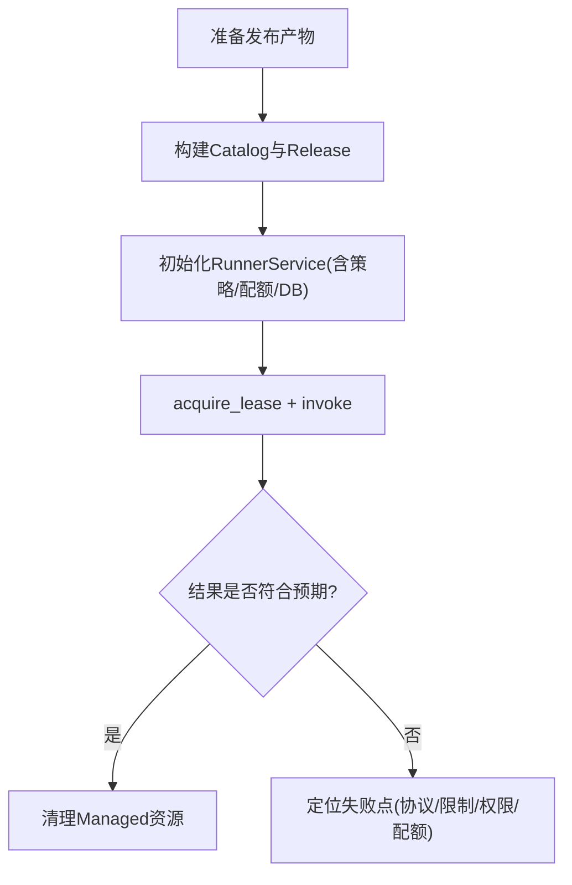
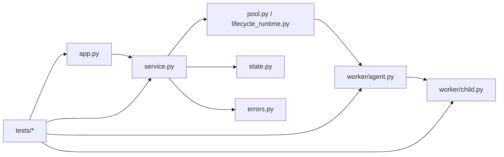

# 调试与测试

<cite>
**本文引用的文件**   
- [runner_engine/app.py](file://runner_engine/app.py)
- [runner_engine/worker/agent.py](file://runner_engine/worker/agent.py)
- [runner_engine/worker/child.py](file://runner_engine/worker/child.py)
- [runner_engine/errors.py](file://runner_engine/errors.py)
- [runner_engine/service.py](file://runner_engine/service.py)
- [tests/conftest.py](file://tests/conftest.py)
- [tests/test_end_to_end_local.py](file://tests/test_end_to_end_local.py)
- [tests/test_agent_process_isolation.py](file://tests/test_agent_process_isolation.py)
- [tests/test_materializer.py](file://tests/test_materializer.py)
- [tests/test_state.py](file://tests/test_state.py)
- [scripts/generate_proto.py](file://scripts/generate_proto.py)
- [images/runner.Dockerfile](file://images/runner.Dockerfile)
</cite>

## 目录
1. [引言](#引言)
2. [项目结构](#项目结构)
3. [核心组件](#核心组件)
4. [架构总览](#架构总览)
5. [详细组件分析](#详细组件分析)
6. [依赖关系分析](#依赖关系分析)
7. [性能考虑](#性能考虑)
8. [故障排查指南](#故障排查指南)
9. [结论](#结论)
10. [附录](#附录)

## 引言
本指南面向算子开发者与平台工程师，聚焦于调试与测试的实操方法。内容覆盖：
- 算子开发过程中的调试技巧与工具使用
- 单元测试、集成测试与端到端测试的编写策略
- 日志记录与错误诊断方法
- 性能测试与压力测试实践
- 监控与可观测性要点
- 测试数据准备与模拟环境搭建

## 项目结构
仓库围绕“Runner 引擎”构建，关键目录与职责如下：
- runner_engine：运行时服务、工作池、沙箱、状态持久化、生命周期管理、协议生成等
- tests：基于 pytest 的单元测试与端到端测试
- scripts：代码生成脚本（如 gRPC 协议）
- images：容器镜像定义，包含 Runner 入口
- web/observe：运行态观察与指标采集相关服务（概念性参考）

**图示来源**
- [runner_engine/app.py:26-154](file://runner_engine/app.py#L26-L154)
- [runner_engine/worker/agent.py:309-599](file://runner_engine/worker/agent.py#L309-L599)
- [runner_engine/worker/child.py:272-344](file://runner_engine/worker/child.py#L272-L344)
- [runner_engine/errors.py:1-22](file://runner_engine/errors.py#L1-L22)
- [runner_engine/service.py:371-409](file://runner_engine/service.py#L371-L409)
- [tests/conftest.py:8-36](file://tests/conftest.py#L8-L36)
- [tests/test_end_to_end_local.py:9-32](file://tests/test_end_to_end_local.py#L9-L32)
- [tests/test_agent_process_isolation.py:45-98](file://tests/test_agent_process_isolation.py#L45-L98)
- [tests/test_materializer.py:18-23](file://tests/test_materializer.py#L18-L23)
- [tests/test_state.py:7-22](file://tests/test_state.py#L7-L22)
- [images/runner.Dockerfile:1-19](file://images/runner.Dockerfile#L1-L19)
- [scripts/generate_proto.py:1-21](file://scripts/generate_proto.py#L1-L21)

**章节来源**
- [runner_engine/app.py:26-154](file://runner_engine/app.py#L26-L154)
- [runner_engine/worker/agent.py:309-599](file://runner_engine/worker/agent.py#L309-L599)
- [runner_engine/worker/child.py:272-344](file://runner_engine/worker/child.py#L272-L344)
- [runner_engine/errors.py:1-22](file://runner_engine/errors.py#L1-L22)
- [runner_engine/service.py:371-409](file://runner_engine/service.py#L371-L409)
- [tests/conftest.py:8-36](file://tests/conftest.py#L8-L36)
- [tests/test_end_to_end_local.py:9-32](file://tests/test_end_to_end_local.py#L9-L32)
- [tests/test_agent_process_isolation.py:45-98](file://tests/test_agent_process_isolation.py#L45-L98)
- [tests/test_materializer.py:18-23](file://tests/test_materializer.py#L18-L23)
- [tests/test_state.py:7-22](file://tests/test_state.py#L7-L22)
- [images/runner.Dockerfile:1-19](file://images/runner.Dockerfile#L1-L19)
- [scripts/generate_proto.py:1-21](file://scripts/generate_proto.py#L1-L21)

## 核心组件
- 启动与服务装配：通过命令行参数与环境变量加载策略、ACL、集群配置，初始化生命周期存储、工作池、服务实例，并启动 gRPC 与可选的管理 HTTP 接口。
- 受信任代理（Agent）：负责安全地创建用户子进程、资源限制、I/O 边界控制、协议编解码、结果校验与清理。
- 用户子进程（Child）：在受限环境中加载用户模块、调用算子函数、规范化返回结果、输出大小与属性限制校验。
- 错误体系：统一的 RunnerError 及其子类，便于上层捕获与分类处理。
- 测试夹具与用例：提供发布样例、端到端流程、隔离与超时验证、产物安装安全校验、租约与幂等行为验证。

**章节来源**
- [runner_engine/app.py:26-154](file://runner_engine/app.py#L26-L154)
- [runner_engine/worker/agent.py:309-599](file://runner_engine/worker/agent.py#L309-L599)
- [runner_engine/worker/child.py:272-344](file://runner_engine/worker/child.py#L272-L344)
- [runner_engine/errors.py:1-22](file://runner_engine/errors.py#L1-L22)
- [tests/conftest.py:8-36](file://tests/conftest.py#L8-L36)

## 架构总览
Runner 引擎以“服务层 + 工作池 + 沙箱代理 + 用户子进程”的分层架构组织。服务层负责请求编排、权限与配额控制；工作池管理沙箱生命周期；代理进程作为可信边界，严格约束用户子进程的资源与 I/O；子进程仅加载用户算子并返回标准化结果。

**图示来源**
- [runner_engine/app.py:156-227](file://runner_engine/app.py#L156-L227)
- [runner_engine/service.py:371-409](file://runner_engine/service.py#L371-L409)
- [runner_engine/worker/agent.py:467-778](file://runner_engine/worker/agent.py#L467-L778)
- [runner_engine/worker/child.py:347-413](file://runner_engine/worker/child.py#L347-L413)

## 详细组件分析

### 代理进程（Agent）调试与测试要点
- 进程隔离与资源限制：通过管道与线程分别读取 stdout/stderr 与结果通道，设置上限并在溢出时终止子进程组。
- 协议安全：对魔法头、版本、长度、字段类型进行严格校验，防止畸形帧与越界数据。
- 生命周期管理：注册活跃子进程、取消请求、清理临时目录与 FD。

**图示来源**
- [runner_engine/worker/agent.py:467-778](file://runner_engine/worker/agent.py#L467-L778)

**章节来源**
- [runner_engine/worker/agent.py:467-778](file://runner_engine/worker/agent.py#L467-L778)

### 用户子进程（Child）调试与测试要点
- 进程加固：禁用 core dump、限制文件描述符、进程数、CPU 时间、地址空间等。
- 路径虚拟化：动态加载 path_virtualization 模块，隔离文件系统访问。
- 结果规范化：将用户返回值转换为标准结构，校验 content/attributes/retryable/status/relationship/error_code/error_message。
- 输出限制：按环境变量限制输出字节数、属性数量与属性总字节数。

**图示来源**
- [runner_engine/worker/child.py:21-27](file://runner_engine/worker/child.py#L21-L27)
- [runner_engine/worker/child.py:272-344](file://runner_engine/worker/child.py#L272-L344)

**章节来源**
- [runner_engine/worker/child.py:21-27](file://runner_engine/worker/child.py#L21-L27)
- [runner_engine/worker/child.py:272-344](file://runner_engine/worker/child.py#L272-L344)

### 错误体系与诊断
- 统一错误基类 RunnerError 携带 code、message、retryable，便于上层区分重试与非重试错误。
- 服务层在基础设施异常时标记为 RUNNER_INFRASTRUCTURE_ERROR，并尝试失效工作节点。

**图示来源**
- [runner_engine/errors.py:1-22](file://runner_engine/errors.py#L1-L22)

**章节来源**
- [runner_engine/errors.py:1-22](file://runner_engine/errors.py#L1-L22)
- [runner_engine/service.py:371-409](file://runner_engine/service.py#L371-L409)

### 单元测试与测试框架
- 测试框架：pytest，使用 fixtures 构造测试数据与发布产物。
- 典型用例：
  - 本地后端端到端：构造 WorkerPool、RunnerService，发起 RunRequest，断言结果状态、内容与属性。
  - 代理隔离：验证 os._exit 仅影响子进程、解释器全局不泄漏、超时正确杀死用户进程。
  - 产物安装安全：拒绝父目录逃逸路径。
  - 状态与租约：验证租约持久化与续期、幂等回放已完成结果。

**图示来源**
- [tests/conftest.py:8-36](file://tests/conftest.py#L8-L36)
- [tests/test_end_to_end_local.py:9-32](file://tests/test_end_to_end_local.py#L9-L32)

**章节来源**
- [tests/conftest.py:8-36](file://tests/conftest.py#L8-L36)
- [tests/test_end_to_end_local.py:9-32](file://tests/test_end_to_end_local.py#L9-L32)
- [tests/test_agent_process_isolation.py:45-98](file://tests/test_agent_process_isolation.py#L45-L98)
- [tests/test_materializer.py:18-23](file://tests/test_materializer.py#L18-L23)
- [tests/test_state.py:7-22](file://tests/test_state.py#L7-L22)

### 集成测试与端到端测试策略
- 集成测试：通过替换后端（如 OpenSandboxBackend）与 LifecycleWorkerPool，结合 RuntimeLifecycleStore 验证完整生命周期。
- 端到端测试：在本地 LocalBackend 上走通从发布到执行的完整链路，断言业务语义正确性与资源清理。

**图示来源**
- [tests/test_end_to_end_local.py:9-32](file://tests/test_end_to_end_local.py#L9-L32)

**章节来源**
- [tests/test_end_to_end_local.py:9-32](file://tests/test_end_to_end_local.py#L9-L32)

### 日志记录与错误诊断
- 日志配置：构建服务中通过 _configure_logging 设置级别与格式化器，并以命名 logger 输出结构化日志。
- 诊断建议：
  - 关注 LOG_LIMIT、CHILD_PROTOCOL_ERROR、OUTPUT_LIMIT、TIMEOUT、USER_PROCESS_EXITED 等错误码。
  - 检查 stderr_tail 片段与运行时上下文信息（cwd/runtime_root）。
  - 在服务层捕获基础设施异常，标记 RUNNER_INFRASTRUCTURE_ERROR 并失效工作节点。

**章节来源**
- [runner_engine/worker/child.py:250-256](file://runner_engine/worker/child.py#L250-L256)
- [runner_engine/worker/agent.py:703-778](file://runner_engine/worker/agent.py#L703-L778)
- [runner_engine/service.py:371-409](file://runner_engine/service.py#L371-L409)

### 性能测试与压力测试
- 压测维度：
  - 并发度：通过 WorkerPool 的 max_creating/max_live/max_live_per_tenant 控制并发上限。
  - 资源限制：RLIMIT_CPU、RLIMIT_AS、NOFILE/NPROC 等限制对吞吐的影响。
  - 输出限制：RUNNER_MAX_OUTPUT_BYTES、RUNNER_MAX_ATTRIBUTES、RUNNER_MAX_ATTRIBUTE_BYTES 对大对象场景的影响。
- 建议：
  - 逐步提升并发，观察超时率、错误码分布与资源占用。
  - 针对大输入/大输出场景，调整限制阈值并评估内存与带宽瓶颈。
  - 使用本地后端快速回归，再切换到 OpenSandbox 后端进行真实环境压测。

[本节为通用指导，无需具体文件引用]

### 监控与可观测性
- 运行态观察：可通过 observe 服务的 /observe/api/runner-runtime 接口查询运行态报告。
- 建议：
  - 在压测过程中持续拉取运行态报告，观察 busy 状态与资源使用情况。
  - 结合系统级指标（CPU、内存、FD、进程数）与 Runner 内部错误码进行关联分析。

**章节来源**
- [web/observe/runtime_routes.py:10-19](file://web/observe/runtime_routes.py#L10-L19)

### 测试数据准备与模拟环境搭建
- 发布夹具：conftest.py 中的 published fixture 自动生成 operator.yaml 与 main.py，并通过 OperatorPublisher 发布到 Catalog。
- 容器镜像：images/runner.Dockerfile 定义了 Runner 容器的基础镜像、用户与入口命令，便于在容器中复现环境。
- 协议生成：scripts/generate_proto.py 用于生成 gRPC Python 代码，确保接口契约一致。

**章节来源**
- [tests/conftest.py:8-36](file://tests/conftest.py#L8-L36)
- [images/runner.Dockerfile:1-19](file://images/runner.Dockerfile#L1-L19)
- [scripts/generate_proto.py:1-21](file://scripts/generate_proto.py#L1-L21)

## 依赖关系分析
Runner 引擎内部模块耦合清晰：
- app.py 装配 service、pool、lifecycle、admin HTTP 与 gRPC 服务
- service.py 协调 pool 与 state，并处理异常与重试
- agent.py 与 child.py 通过自定义协议通信，严格校验与限制
- errors.py 提供统一错误类型
- tests 通过 conftest 提供发布夹具，覆盖端到端、隔离、产物安全与状态一致性

**图示来源**
- [runner_engine/app.py:26-154](file://runner_engine/app.py#L26-L154)
- [runner_engine/service.py:371-409](file://runner_engine/service.py#L371-L409)
- [runner_engine/worker/agent.py:309-599](file://runner_engine/worker/agent.py#L309-L599)
- [runner_engine/worker/child.py:272-344](file://runner_engine/worker/child.py#L272-L344)
- [runner_engine/errors.py:1-22](file://runner_engine/errors.py#L1-L22)

**章节来源**
- [runner_engine/app.py:26-154](file://runner_engine/app.py#L26-L154)
- [runner_engine/service.py:371-409](file://runner_engine/service.py#L371-L409)
- [runner_engine/worker/agent.py:309-599](file://runner_engine/worker/agent.py#L309-L599)
- [runner_engine/worker/child.py:272-344](file://runner_engine/worker/child.py#L272-L344)
- [runner_engine/errors.py:1-22](file://runner_engine/errors.py#L1-L22)

## 性能考虑
- 并发与配额：合理设置 max_creating/max_live/max_live_per_tenant，避免队列积压与资源耗尽。
- 资源限制：根据算子特性调整 RLIMIT_CPU/RLIMIT_AS/NOFILE/NPROC，平衡稳定性与吞吐。
- I/O 限制：控制 RUNNER_MAX_OUTPUT_BYTES 与属性限制，防止大对象导致内存峰值过高。
- 网络与序列化：gRPC 与 JSON 帧的开销需纳入压测评估，必要时优化 payload 结构与压缩策略。

[本节为通用指导，无需具体文件引用]

## 故障排查指南
- 常见错误码与定位思路：
  - TIMEOUT：检查算子耗时与 timeout_ms 配置，确认是否被正确杀死。
  - LOG_LIMIT：减少 stdout/stderr 输出量，避免无限打印。
  - CHILD_PROTOCOL_ERROR：核对协议魔法头、版本、长度与字段类型。
  - OUTPUT_LIMIT：缩小输出体积或提高限制阈值。
  - USER_PROCESS_EXITED：检查算子是否意外退出或未返回协议结果。
  - RUNNER_INFRASTRUCTURE_ERROR：检查底层基础设施（如沙箱创建、网络、存储）异常。
- 诊断步骤：
  - 查看 stderr_tail 与运行时上下文（cwd/runtime_root）。
  - 在服务层捕获异常并记录 error_code 与 error_message。
  - 使用 observe 接口查询运行态，确认 busy 状态与资源占用。
  - 在本地后端先复现问题，再迁移至 OpenSandbox 后端验证。

**章节来源**
- [runner_engine/worker/agent.py:703-778](file://runner_engine/worker/agent.py#L703-L778)
- [runner_engine/worker/child.py:250-256](file://runner_engine/worker/child.py#L250-L256)
- [runner_engine/service.py:371-409](file://runner_engine/service.py#L371-L409)

## 结论
本指南系统化梳理了 Runner 引擎的调试与测试方法，涵盖从单元测试到端到端、从日志诊断到性能压测的全链路实践。建议在算子开发初期即引入隔离与限制测试，结合 observe 与错误码进行持续验证，确保在生产环境中的稳定性与可观测性。

[本节为总结性内容，无需具体文件引用]

## 附录
- 常用环境变量（示例）：
  - RUNNER_LISTEN、RUNNER_CATALOG、RUNNER_DB_URL、RUNNER_POLICIES、RUNNER_ACL、RUNNER_CLUSTERS
  - RUNNER_ADMIN_TOKEN、RUNNER_ADMIN_LISTEN、RUNNER_ADMIN_PORT
  - RUNNER_MAX_CREATING、RUNNER_MAX_LIVE、RUNNER_MAX_LIVE_PER_TENANT
  - RUNNER_WORKER_IDLE_SECONDS、RUNNER_SANDBOX_ORPHAN_TTL_SECONDS、RUNNER_SANDBOX_RENEW_BEFORE_SECONDS
  - RUNNER_LEASE_TTL_MS、RUNNER_IDEMPOTENCY_RETENTION_MS、RUNNER_RUN_RETENTION_MS
  - RUNNER_MAX_OUTPUT_BYTES、RUNNER_MAX_ATTRIBUTES、RUNNER_MAX_ATTRIBUTE_BYTES
  - RUNNER_CHILD_UID、RUNNER_CHILD_GID、RUNNER_CHILD_NPROC、RUNNER_CHILD_NOFILE、RUNNER_CHILD_CPU_SECONDS、RUNNER_CHILD_ADDRESS_SPACE_BYTES

[本节为通用参考，无需具体文件引用]