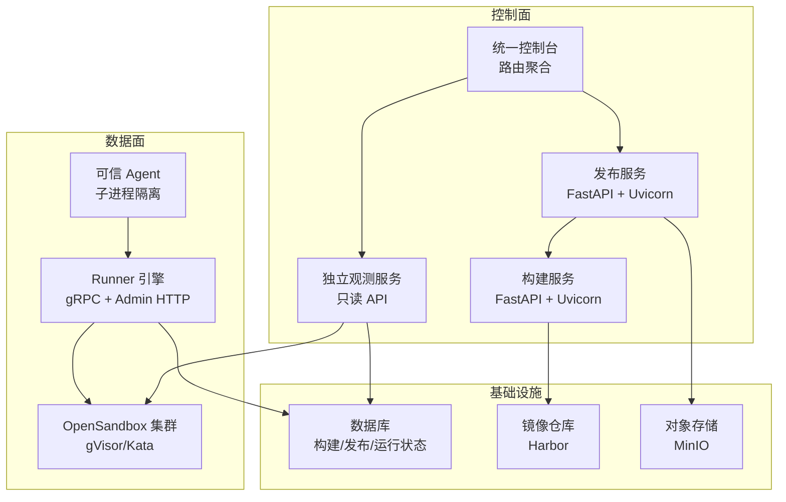
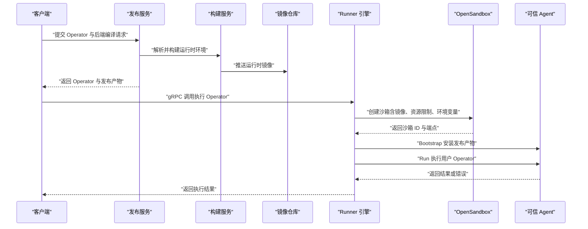
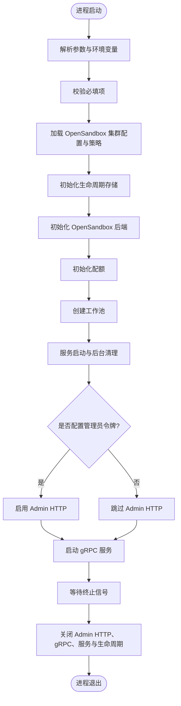
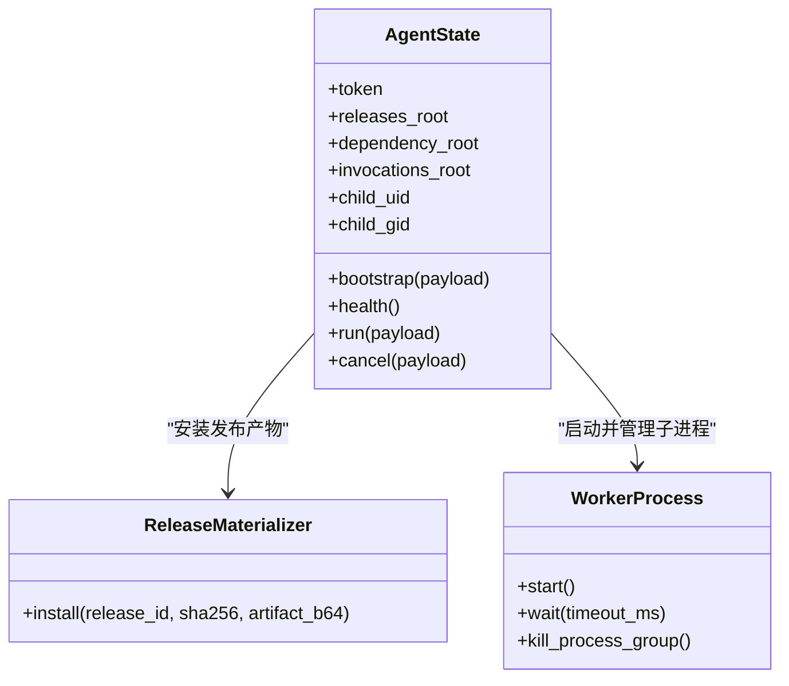
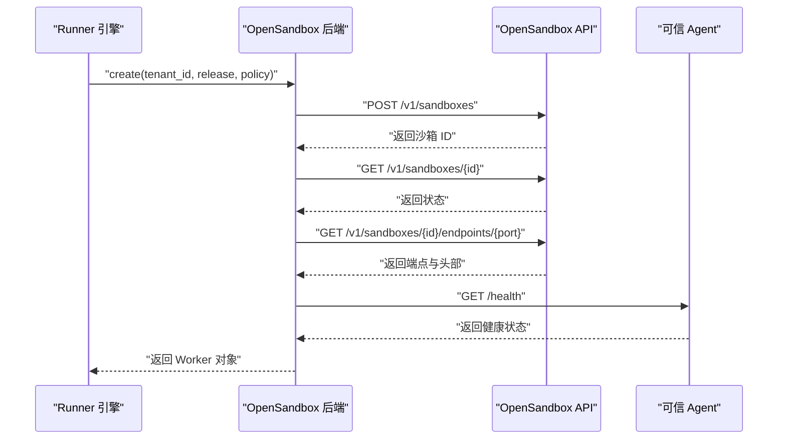
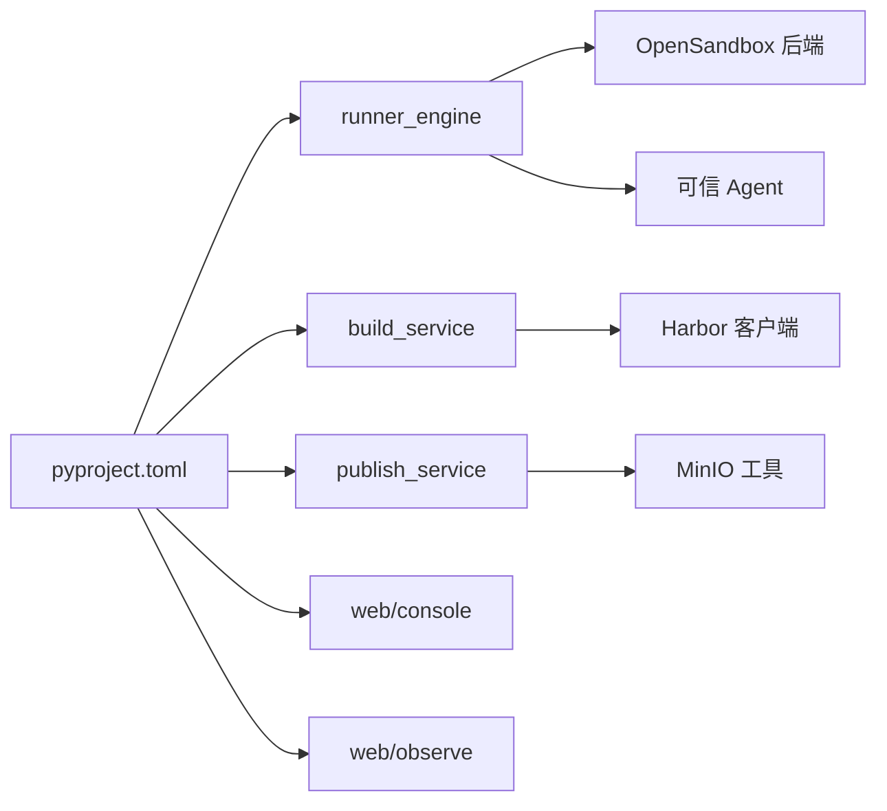

# 部署运维

<cite>
**本文引用的文件**   
- [pyproject.toml](file://pyproject.toml)
- [runner_engine/app.py](file://runner_engine/app.py)
- [runner_engine/worker/agent.py](file://runner_engine/worker/agent.py)
- [runner_engine/sandbox/opensandbox.py](file://runner_engine/sandbox/opensandbox.py)
- [images/runner.Dockerfile](file://images/runner.Dockerfile)
- [images/runtime.Dockerfile](file://images/runtime.Dockerfile)
- [config/opensandbox.example.json](file://config/opensandbox.example.json)
- [infra/opensandbox/README.md](file://infra/opensandbox/README.md)
- [web/OBSERVABILITY_README.md](file://web/OBSERVABILITY_README.md)
- [web/observe/main.py](file://web/observe/main.py)
- [web/observe/sandbox.py](file://web/observe/sandbox.py)
- [web/console/main.py](file://web/console/main.py)
- [web/RUNTIME_DIAGNOSIS.md](file://web/RUNTIME_DIAGNOSIS.md)
- [build_service/app.py](file://build_service/app.py)
- [publish_service/app.py](file://publish_service/app.py)
</cite>

## 目录
1. [简介](#简介)
2. [项目结构](#项目结构)
3. [核心组件](#核心组件)
4. [架构总览](#架构总览)
5. [详细组件分析](#详细组件分析)
6. [依赖关系分析](#依赖关系分析)
7. [性能与容量规划](#性能与容量规划)
8. [监控、日志与健康检查](#监控日志与健康检查)
9. [备份恢复与高可用](#备份恢复与高可用)
10. [故障排查指南](#故障排查指南)
11. [多环境部署模板](#多环境部署模板)
12. [结论](#结论)

## 简介
本指南面向 Runner Engine 的部署与运维人员，覆盖环境准备、服务部署、OpenSandbox 沙箱集群接入、容器镜像构建、监控告警、健康检查、性能调优、容量规划、备份恢复、灾难恢复、高可用方案以及常见故障诊断。文档同时给出本地、云原生和混合云环境的部署建议与脚本思路，帮助在不同环境中稳定运行 Python Operator 的构建、发布与执行生命周期。

Runner Engine 提供三类关键能力：
- 构建服务：解析并构建运行时环境镜像，推送至镜像仓库。
- 发布服务：管理 Operator 虚拟契约、后端编译与发布产物。
- 运行引擎：通过 OpenSandbox 创建隔离沙箱，调度可信 Agent 执行用户 Operator，并提供生命周期管理与资源配额控制。

## 项目结构
Runner Engine 采用按职责划分的模块结构：
- runner_engine：运行期核心，包含 gRPC 网关、生命周期控制器、工作池、策略与配额、状态存储等。
- build_service：构建服务，负责运行时环境解析、镜像构建与镜像仓库集成。
- publish_service：发布服务，负责 Operator 契约、后端编译与发布、边缘包与 MinIO 集成。
- web：Web 控制台与观测子系统，包括统一入口、独立观测页面、OpenSandbox 指标采集。
- images：Docker 镜像定义，包含 Runner 可信 Agent 镜像与运行时依赖镜像。
- config：OpenSandbox 集群配置示例、ACL 与策略文件。
- infra/opensandbox：OpenSandbox 部署说明。

图示来源
- [build_service/app.py:106-181](file://build_service/app.py#L106-L181)
- [publish_service/app.py:135-347](file://publish_service/app.py#L135-L347)
- [web/console/main.py:34-115](file://web/console/main.py#L34-L115)
- [web/observe/main.py:57-168](file://web/observe/main.py#L57-L168)
- [runner_engine/app.py:26-227](file://runner_engine/app.py#L26-L227)
- [runner_engine/worker/agent.py:309-377](file://runner_engine/worker/agent.py#L309-L377)
- [runner_engine/sandbox/opensandbox.py:31-440](file://runner_engine/sandbox/opensandbox.py#L31-L440)

章节来源
- [pyproject.toml:1-37](file://pyproject.toml#L1-L37)
- [runner_engine/app.py:26-227](file://runner_engine/app.py#L26-L227)
- [build_service/app.py:106-181](file://build_service/app.py#L106-L181)
- [publish_service/app.py:135-347](file://publish_service/app.py#L135-L347)
- [web/console/main.py:34-115](file://web/console/main.py#L34-L115)
- [web/observe/main.py:57-168](file://web/observe/main.py#L57-L168)

## 核心组件
- Runner 引擎主进程：解析命令行与环境变量，初始化生命周期存储、OpenSandbox 后端、配额与工作池，启动后台清理任务，暴露 gRPC 服务与可选 Admin HTTP。
- 可信 Agent：在沙箱内以子进程方式执行用户 Operator，严格限制输出大小、协议帧大小、属性数量与字节数，支持取消、超时、信号处理与进程组清理。
- OpenSandbox 后端：封装沙箱创建、就绪等待、端点获取、健康检查、安装发布产物、执行调用、续期与销毁，以及与集群元数据的匹配。
- 构建服务：提供运行时环境解析、重试与查询接口，连接 Harbor 进行镜像推送。
- 发布服务：提供 Operator 虚拟契约、后端编译与发布、边缘平台与包管理、MinIO 文件夹下载等接口。
- 观测服务：独立 FastAPI 应用，提供数据库统计、OpenSandbox 沙箱列表与 execd 资源指标采集，具备基础认证与安全头保护。

章节来源
- [runner_engine/app.py:26-227](file://runner_engine/app.py#L26-L227)
- [runner_engine/worker/agent.py:309-798](file://runner_engine/worker/agent.py#L309-L798)
- [runner_engine/sandbox/opensandbox.py:31-440](file://runner_engine/sandbox/opensandbox.py#L31-L440)
- [build_service/app.py:106-181](file://build_service/app.py#L106-L181)
- [publish_service/app.py:135-347](file://publish_service/app.py#L135-L347)
- [web/observe/main.py:57-168](file://web/observe/main.py#L57-L168)

## 架构总览
Runner Engine 的整体部署由控制面和数据面组成：
- 控制面：构建服务与发布服务为 FastAPI 应用，使用 Uvicorn 启动；统一控制台聚合路径到发布、观测与管理模块；独立观测服务提供只读 API 与前端静态资源。
- 数据面：Runner 引擎通过 gRPC 提供服务，Admin HTTP 用于生命周期管理；Agent 在 OpenSandbox 中执行用户代码，受策略与配额约束。
- 基础设施：数据库保存构建、发布与运行状态；镜像仓库保存运行时镜像；MinIO 作为对象存储用于边缘包与源文件。

图示来源
- [publish_service/app.py:201-277](file://publish_service/app.py#L201-L277)
- [build_service/app.py:140-181](file://build_service/app.py#L140-L181)
- [runner_engine/app.py:159-227](file://runner_engine/app.py#L159-L227)
- [runner_engine/sandbox/opensandbox.py:141-303](file://runner_engine/sandbox/opensandbox.py#L141-L303)
- [runner_engine/worker/agent.py:467-798](file://runner_engine/worker/agent.py#L467-L798)

## 详细组件分析

### Runner 引擎主进程
Runner 引擎主进程负责：
- 参数与环境变量解析：监听地址、目录、数据库 URL、策略与 ACL 文件、OpenSandbox 集群配置、所有者 ID、TLS 证书与客户端 CA。
- 生命周期存储与后端初始化：基于数据库 URL 创建 RuntimeLifecycleStore，加载 OpenSandbox 集群配置。
- 配额与工作池：根据环境变量设置最大创建数、最大存活数、租户上限、空闲时间、孤儿 TTL、续期前时间、每沙箱最大发布数。
- 后台清理：周期性回收过期或孤儿沙箱。
- Admin HTTP：当配置了管理员令牌时启用，默认监听回环地址。
- gRPC 服务：加载访问控制列表，启动 TLS 服务并等待终止。

图示来源
- [runner_engine/app.py:26-227](file://runner_engine/app.py#L26-L227)

章节来源
- [runner_engine/app.py:26-227](file://runner_engine/app.py#L26-L227)

### 可信 Agent 执行模型
可信 Agent 在沙箱中以子进程方式执行用户 Operator，具备以下安全与可靠性特性：
- 协议帧校验：固定魔数、版本、类型、调用 ID、结果状态、内容长度、属性数量与字节数限制。
- 输出限制：stdout/stderr 与协议响应分别限制，超限触发进程组终止。
- 超时与取消：支持调用超时与外部取消，返回明确错误码与消息。
- 资源隔离：通过环境变量传递 UID/GID、进程数、文件描述符、CPU 秒与地址空间限制。
- 工作区隔离：每个调用生成临时目录，复制 runtime 工作区，设置权限与所有权。
- 进程清理：确保子进程组与用户进程被清理，释放管道与临时目录。

图示来源
- [runner_engine/worker/agent.py:309-377](file://runner_engine/worker/agent.py#L309-L377)
- [runner_engine/worker/agent.py:467-798](file://runner_engine/worker/agent.py#L467-L798)

章节来源
- [runner_engine/worker/agent.py:309-798](file://runner_engine/worker/agent.py#L309-L798)

### OpenSandbox 后端
OpenSandbox 后端负责：
- 集群选择：根据策略中的沙箱集群名称查找配置，未找到则抛出未知集群错误。
- 创建沙箱：构造镜像、超时、资源限制、环境变量、入口命令与元数据，调用 OpenSandbox API 创建。
- 就绪等待：轮询沙箱状态，直到 RUNNING/READY/STARTED 或失败状态。
- 端点获取：获取 Agent 端口端点，补全协议与主机名。
- 健康检查：轮询 Agent /health，直到成功或超时。
- 安装发布产物：将发布工件 Base64 编码后通过 Bootstrap 接口安装。
- 执行调用：封装 Run 请求，解码结果并转换为统一结果模型。
- 续期与销毁：延长沙箱过期时间或删除沙箱，兼容 404 不存在情况。
- 清理托管实例：遍历所有集群，删除带有 managed-by 标签且属于当前所有者的沙箱。

图示来源
- [runner_engine/sandbox/opensandbox.py:141-303](file://runner_engine/sandbox/opensandbox.py#L141-L303)

章节来源
- [runner_engine/sandbox/opensandbox.py:31-440](file://runner_engine/sandbox/opensandbox.py#L31-L440)

### 构建服务
构建服务提供：
- 健康检查：返回服务版本、运行时生命周期与 Harbor 配置状态。
- 运行时环境解析：接收依赖列表，解析并持久化环境信息。
- 环境查询与重试：按 env_key 查询环境与重试失败的环境。
- 生命周期路由：注册构建相关的生命周期接口。

章节来源
- [build_service/app.py:106-181](file://build_service/app.py#L106-L181)

### 发布服务
发布服务提供：
- 健康检查：返回服务版本、API 版本、后端类型、边缘原生发布与运行时生命周期状态。
- 边缘平台与部署：列出平台、部署与包。
- 边缘操作与下载：列出操作并下载边缘包。
- 虚拟契约与后端编译发布：创建虚拟契约、编译后端、发布后端。
- MinIO 文件夹下载：从对象存储下载文件夹并记录下载详情。
- Operator 列表：按运行类型与用户 ID 查询 Operator。

章节来源
- [publish_service/app.py:135-347](file://publish_service/app.py#L135-L347)

### 观测服务
观测服务是一个独立的 FastAPI 应用，提供：
- 基础认证：当绑定非回环地址时强制要求 Basic 认证。
- 安全头：添加 X-Content-Type-Options、X-Frame-Options、Referrer-Policy、Content-Security-Policy 与 Cache-Control。
- 健康检查：/observe/health。
- 数据库统计：聚合构建、发布与运行服务的数据库统计。
- OpenSandbox 沙箱列表：分页读取 Running 沙箱，计算存活时间与 TTL。
- execd 资源指标：仅对允许的 origin 发起 GET /metrics，并发限制与超时保护。
- 统一概览：合并数据库、沙箱与 Runner 运行时统计。

章节来源
- [web/observe/main.py:57-168](file://web/observe/main.py#L57-L168)
- [web/observe/sandbox.py:87-325](file://web/observe/sandbox.py#L87-L325)
- [web/OBSERVABILITY_README.md:1-277](file://web/OBSERVABILITY_README.md#L1-L277)

## 依赖关系分析
Runner Engine 的核心依赖包括：
- Python 版本：>=3.11。
- 可选依赖：grpcio、psycopg、fastapi、uvicorn、pydantic、packaging、uv、minio。
- 可执行入口：mpr-agent、mpr-runner、mpr-build-service、mpr-publish-service。

图示来源
- [pyproject.toml:1-37](file://pyproject.toml#L1-L37)
- [runner_engine/sandbox/opensandbox.py:31-440](file://runner_engine/sandbox/opensandbox.py#L31-L440)
- [runner_engine/worker/agent.py:309-798](file://runner_engine/worker/agent.py#L309-L798)
- [build_service/app.py:106-181](file://build_service/app.py#L106-L181)
- [publish_service/app.py:135-347](file://publish_service/app.py#L135-L347)

章节来源
- [pyproject.toml:1-37](file://pyproject.toml#L1-L37)

## 性能与容量规划
Runner Engine 的关键容量参数可通过环境变量调整：
- RUNNER_MAX_CREATING：最大正在创建的沙箱数。
- RUNNER_MAX_LIVE：最大存活沙箱总数。
- RUNNER_MAX_LIVE_PER_TENANT：单租户最大存活沙箱数。
- RUNNER_WORKER_IDLE_SECONDS：工作池空闲回收时间。
- RUNNER_SANDBOX_ORPHAN_TTL_SECONDS：孤儿沙箱 TTL。
- RUNNER_SANDBOX_RENEW_BEFORE_SECONDS：续期提前时间。
- RUNNER_MAX_RELEASES_PER_SANDBOX：每沙箱最大已安装发布数。
- RUNNER_LEASE_TTL_MS：租约 TTL。
- RUNNER_IDEMPOTENCY_RETENTION_MS：幂等性保留时间。
- RUNNER_RUN_RETENTION_MS：运行记录保留时间。

Agent 侧的资源限制：
- 最大输出字节数、最大属性数量与属性字节数。
- 最大协议帧大小与日志输出上限。
- CPU 秒、进程数、文件描述符与地址空间限制。

观测侧采样限制：
- execd 并发上限为 6。
- 默认最多采样 30 个沙箱，采样耗时限制约 18 秒。
- 可通过 OBS_EXECD_SAMPLE_LIMIT 调整采样上限。

建议：
- 根据业务峰值 QPS 与平均执行时长估算 RUNNER_MAX_LIVE。
- 根据租户分布设置 RUNNER_MAX_LIVE_PER_TENANT，避免单租户占用过多资源。
- 合理设置孤儿 TTL 与续期提前时间，减少僵尸沙箱。
- 控制每沙箱最大发布数，避免文件系统与内存压力。
- 观测采样间隔建议 20–60 秒，避免频繁请求 OpenSandbox 与 execd。

章节来源
- [runner_engine/app.py:97-153](file://runner_engine/app.py#L97-L153)
- [runner_engine/worker/agent.py:26-34](file://runner_engine/worker/agent.py#L26-L34)
- [runner_engine/worker/agent.py:494-568](file://runner_engine/worker/agent.py#L494-L568)
- [web/observe/sandbox.py:251-288](file://web/observe/sandbox.py#L251-L288)

## 监控、日志与健康检查
Runner Engine 健康检查与监控要点：
- Runner 引擎：Admin HTTP 提供生命周期管理接口；gRPC 服务对外暴露执行接口。
- 可信 Agent：/health 返回 ok、busy 与路径兼容性。
- 构建服务：/health 返回版本、运行时生命周期与 Harbor 配置状态。
- 发布服务：/health 返回版本、API 版本、后端类型与边缘原生发布状态。
- 观测服务：/observe/health 返回服务版本；/observe/api/databases、/observe/api/sandboxes、/observe/api/runner-runtime 提供统计。

日志收集建议：
- 统一日志格式：时间、级别、模块与消息。
- 区分系统日志与用户日志：Agent stdout/stderr 有上限，避免 OOM。
- 结构化字段：error_code、error_message、duration_ms、retryable。
- 集中采集：建议使用日志代理（如 Fluent Bit/Filebeat）收集容器标准输出与文件日志。

健康检查清单：
- Runner gRPC 端口可达。
- Admin HTTP 仅在内部网络暴露。
- Agent /health 返回 ok。
- 构建服务 /health 正常。
- 发布服务 /health 正常。
- 观测服务 /observe/health 正常。
- OpenSandbox 沙箱列表可读取。

章节来源
- [runner_engine/app.py:174-227](file://runner_engine/app.py#L174-L227)
- [runner_engine/worker/agent.py:370-377](file://runner_engine/worker/agent.py#L370-L377)
- [build_service/app.py:128-138](file://build_service/app.py#L128-L138)
- [publish_service/app.py:157-170](file://publish_service/app.py#L157-L170)
- [web/observe/main.py:108-114](file://web/observe/main.py#L108-L114)

## 备份恢复与高可用
备份范围：
- 构建服务数据库：运行时环境解析结果与构建任务状态。
- 发布服务数据库：Operator 虚拟契约、后端编译与发布记录。
- Runner 引擎数据库：生命周期状态、执行记录与幂等性记录。
- 发布产物与边缘包：存储在文件系统或对象存储（MinIO）。
- OpenSandbox 沙箱：通常由控制平面管理，不应手动迁移。

恢复步骤：
- 停止写入服务，导出数据库快照。
- 校验对象存储中发布产物完整性。
- 恢复数据库与对象存储。
- 重启服务并验证健康检查。
- 清理孤儿沙箱：Runner 提供 cleanup_managed 逻辑，可按 owner_id 清理。

高可用建议：
- 数据库：使用主从或集群模式，读写分离，定期备份。
- 镜像仓库：Harbor 高可用部署，多副本与异地容灾。
- 对象存储：MinIO 纠删码或多副本，跨机房同步。
- 服务无状态：Runner、构建与发布服务多副本，负载均衡。
- OpenSandbox：按隔离类部署多个集群（gVisor/Kata），通过策略选择。

章节来源
- [runner_engine/sandbox/opensandbox.py:401-440](file://runner_engine/sandbox/opensandbox.py#L401-L440)
- [publish_service/app.py:279-335](file://publish_service/app.py#L279-L335)
- [infra/opensandbox/README.md:1-27](file://infra/opensandbox/README.md#L1-L27)

## 故障排查指南
常见问题与定位方法：
- Runner 启动失败：检查必填参数 db-url、owner-id、tls-cert、tls-key、client-ca。
- Admin HTTP 未启用：检查 RUNNER_ADMIN_TOKEN 是否配置。
- OpenSandbox 不可达：检查集群 URL 与 API Key，确认网络连通性与私有网络。
- Agent 健康检查超时：检查沙箱镜像、入口命令、端口暴露与端点头部。
- 执行超时或日志超限：检查 timeout_ms、max_output_bytes、RUNNER_MAX_OUTPUT_BYTES。
- 输出编码异常：核对虚拟契约 output 与实际返回值类型，参考运行时诊断文档。

运行时输出编码异常排查：
- 查看 Operator 的 currentContract.virtualContract.output 与 backendVariants[].backendContract。
- 检查 __dsc_entry__.py 中 output_spec 与 payload_value 的来源。
- 若契约为 bytes 而返回值为 dict/list/int/None，优先检查输出格式配置。
- 若契约为 json 但生成 output_spec 为 bytes，检查编译与入口生成逻辑。

章节来源
- [runner_engine/app.py:76-86](file://runner_engine/app.py#L76-L86)
- [runner_engine/app.py:174-210](file://runner_engine/app.py#L174-L210)
- [runner_engine/sandbox/opensandbox.py:52-110](file://runner_engine/sandbox/opensandbox.py#L52-L110)
- [runner_engine/sandbox/opensandbox.py:260-290](file://runner_engine/sandbox/opensandbox.py#L260-L290)
- [runner_engine/worker/agent.py:674-778](file://runner_engine/worker/agent.py#L674-L778)
- [web/RUNTIME_DIAGNOSIS.md:1-97](file://web/RUNTIME_DIAGNOSIS.md#L1-L97)

## 多环境部署模板

### 本地开发环境
- 数据库：SQLite 或本地 PostgreSQL。
- 镜像仓库：本地 Harbor 或 Docker Hub。
- OpenSandbox：单机 gVisor 或 Kata 实例。
- 服务启动：
  - 构建服务：BUILD_DATABASE_URL、BUILD_RUNNER_BASE_IMAGE、BUILD_REGISTRY_REPO。
  - 发布服务：PUBLISH_WORKSPACE_ROOT、PUBLISH_CATALOG_ROOT、PUBLISH_DATABASE_URL。
  - Runner 引擎：RUNNER_LISTEN、RUNNER_DB_URL、RUNNER_POLICIES、RUNNER_ACL、RUNNER_CLUSTERS、RUNNER_OWNER_ID、TLS 证书与客户端 CA。
  - 观测服务：OBS_PUBLISH_DB_URL、OBS_BUILD_DB_URL、OBS_RUNNER_DB_URL、OBS_SANDBOX_URL、OBS_SANDBOX_API_KEY。

### 云原生环境
- 使用 Kubernetes Deployment 与 Service 部署各服务。
- 使用 ConfigMap 与 Secret 管理配置与密钥。
- 使用 Ingress 暴露 Web 控制台与观测服务。
- 使用 PersistentVolume 挂载数据库与对象存储。
- 使用 HorizontalPodAutoscaler 根据 CPU/内存或自定义指标扩缩容。

### 混合云环境
- 控制面部署在中心云，数据面部署在边缘节点。
- 镜像仓库与对象存储跨云同步。
- OpenSandbox 集群按区域部署，Runner 通过策略选择就近集群。
- 使用专线或 VPN 保证 Runner 与 OpenSandbox 通信安全。

### Docker 镜像构建最佳实践
- Runner 镜像：
  - 使用 slim 基础镜像，创建非 root 用户 runner。
  - 设置 PYTHONPATH 指向应用目录。
  - 入口命令为 python -m runner_engine.worker.agent。
- 运行时镜像：
  - 分阶段构建：依赖构建阶段与最终镜像阶段。
  - 依赖安装到 /opt/python-deps，设置 RUNNER_DEPENDENCY_ROOT。
  - 不将用户依赖加入可信 Agent 的 PYTHONPATH。

章节来源
- [images/runner.Dockerfile:1-19](file://images/runner.Dockerfile#L1-L19)
- [images/runtime.Dockerfile:21-65](file://images/runtime.Dockerfile#L21-L65)
- [config/opensandbox.example.json:1-11](file://config/opensandbox.example.json#L1-L11)
- [infra/opensandbox/README.md:1-27](file://infra/opensandbox/README.md#L1-L27)
- [web/OBSERVABILITY_README.md:55-84](file://web/OBSERVABILITY_README.md#L55-L84)

## 结论
Runner Engine 提供了完整的 Python Operator 构建、发布与执行生命周期管理能力。通过 OpenSandbox 实现强隔离的执行环境，结合策略与配额控制，保障多租户安全与资源公平。部署时应重点关注数据库、镜像仓库与对象存储的高可用，合理配置 Runner 与 Agent 的资源限制，建立完善的监控与日志体系，并制定备份恢复与灾难恢复预案。观测服务提供只读统计与 OpenSandbox 资源指标，有助于快速定位问题与优化性能。不同环境可采用统一的配置模型与镜像构建流程，确保一致性与可维护性。