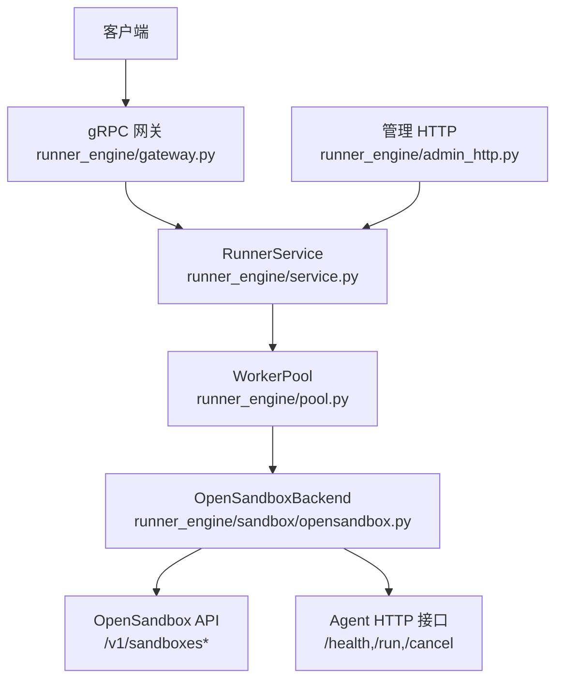
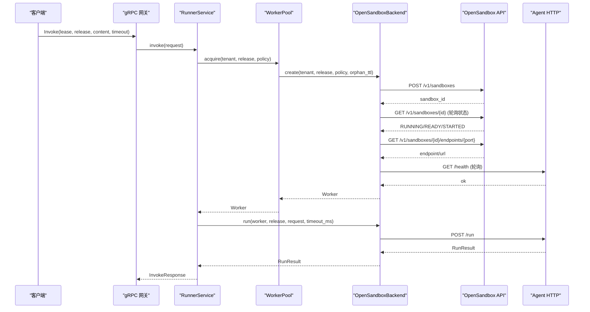
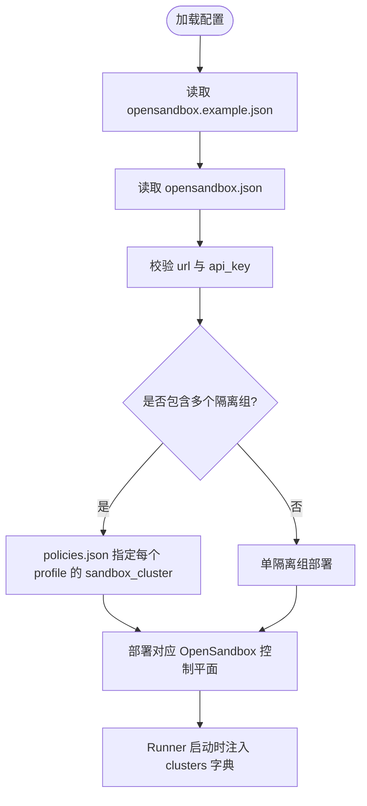
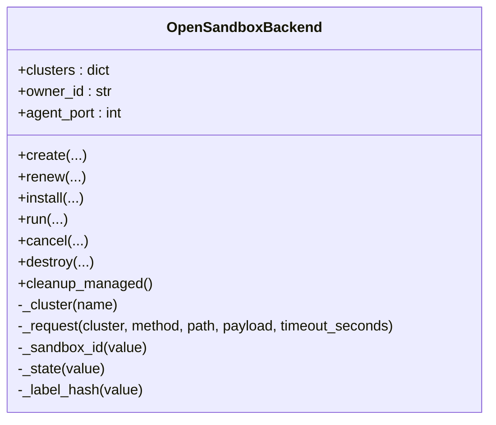
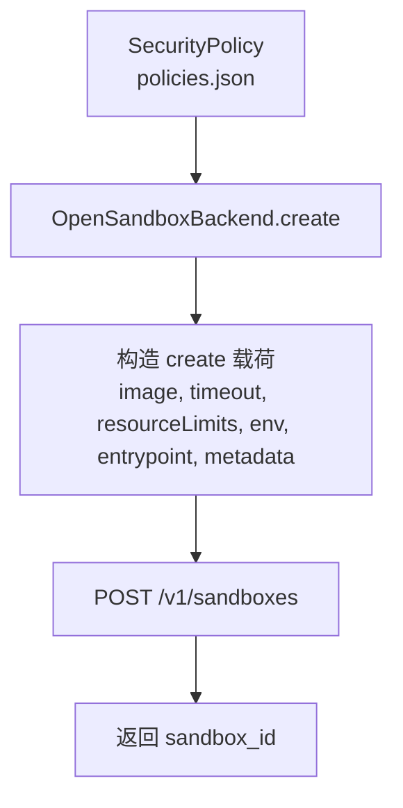
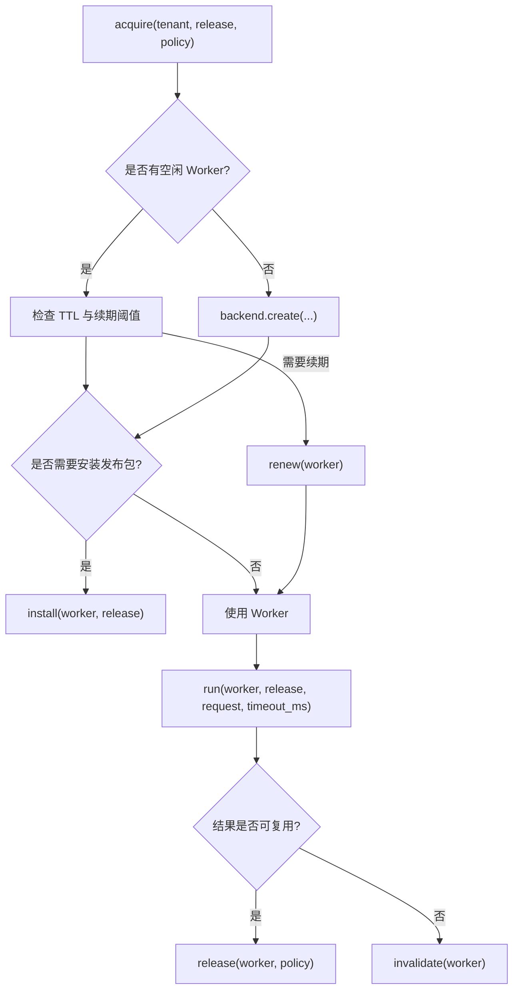
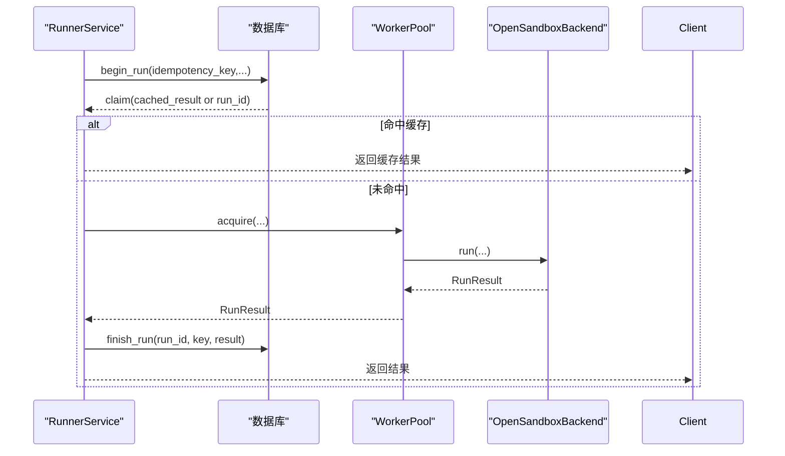
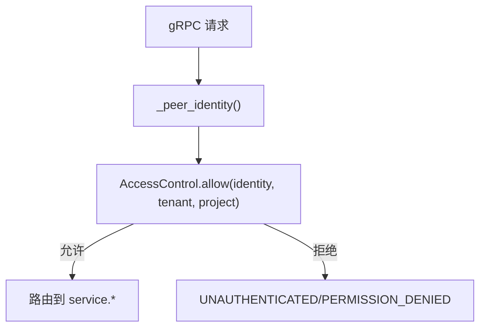
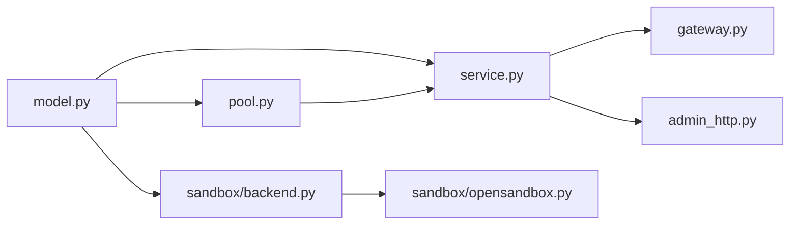
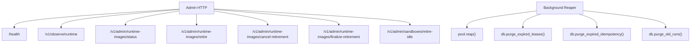

# 沙箱集群配置

<cite>
**本文引用的文件**   
- [opensandbox.example.json](file://config/opensandbox.example.json)
- [opensandbox.json](file://config/opensandbox.json)
- [policies.json](file://config/policies.json)
- [README.md](file://infra/opensandbox/README.md)
- [backend.py](file://runner_engine/sandbox/backend.py)
- [opensandbox.py](file://runner_engine/sandbox/opensandbox.py)
- [pool.py](file://runner_engine/pool.py)
- [model.py](file://runner_engine/model.py)
- [service.py](file://runner_engine/service.py)
- [gateway.py](file://runner_engine/gateway.py)
- [admin_http.py](file://runner_engine/admin_http.py)
</cite>

## 目录
1. [简介](#简介)
2. [项目结构](#项目结构)
3. [核心组件](#核心组件)
4. [架构总览](#架构总览)
5. [详细组件分析](#详细组件分析)
6. [依赖关系分析](#依赖关系分析)
7. [性能与容量规划](#性能与容量规划)
8. [监控与可观测性](#监控与可观测性)
9. [故障排查指南](#故障排查指南)
10. [结论](#结论)
11. [附录：不同规模部署的配置示例](#附录不同规模部署的配置示例)

## 简介
本文面向需要在生产环境中部署 OpenSandbox 沙箱集群的运维与平台工程师，系统性说明以下内容：
- OpenSandbox 集群的连接配置、节点管理与负载均衡策略
- 沙箱隔离级别（gVisor/Kata）与资源分配策略
- 沙箱生命周期管理、健康检查、续期与清理
- 故障恢复与幂等执行机制
- 不同规模部署的配置示例
- 性能调优与监控建议

本仓库通过 runner_engine 暴露 gRPC 控制面，使用 WorkerPool 管理沙箱池，并通过 OpenSandboxBackend 对接 OpenSandbox 控制平面。安全策略由 policies.json 驱动，决定每个运行画像使用的隔离后端与资源上限。

## 项目结构
与沙箱集群配置直接相关的代码与配置分布如下：
- 配置层
  - config/opensandbox.example.json：OpenSandbox 集群连接模板
  - config/opensandbox.json：实际 OpenSandbox 集群连接配置
  - config/policies.json：安全策略与隔离级别映射
- 运行时层
  - runner_engine/sandbox/backend.py：沙箱后端抽象协议
  - runner_engine/sandbox/opensandbox.py：OpenSandbox 后端实现
  - runner_engine/pool.py：WorkerPool 沙箱池与生命周期管理
  - runner_engine/model.py：核心数据模型（策略、工作进程、请求/结果）
  - runner_engine/service.py：RunnerService 编排调用、幂等与清理
  - runner_engine/gateway.py：mTLS gRPC 服务入口
  - runner_engine/admin_http.py：管理 HTTP 接口
- 部署说明
  - infra/opensandbox/README.md：OpenSandbox 部署与隔离组说明

**图表来源**
- [gateway.py:44-194](file://runner_engine/gateway.py#L44-L194)
- [service.py:80-115](file://runner_engine/service.py#L80-L115)
- [pool.py:11-46](file://runner_engine/pool.py#L11-L46)
- [opensandbox.py:31-50](file://runner_engine/sandbox/opensandbox.py#L31-L50)
- [admin_http.py:14-24](file://runner_engine/admin_http.py#L14-L24)

**章节来源**
- [opensandbox.example.json:1-11](file://config/opensandbox.example.json#L1-L11)
- [opensandbox.json:1-11](file://config/opensandbox.json#L1-L11)
- [policies.json:1-19](file://config/policies.json#L1-L19)
- [README.md:1-27](file://infra/opensandbox/README.md#L1-L27)

## 核心组件
- OpenSandboxBackend：封装与 OpenSandbox 控制平面的通信，负责创建、等待就绪、获取端点、安装发布包、执行、取消、销毁与托管清理。
- WorkerPool：按租户+运行时+安全画像维度维护空闲沙箱池，处理 TTL 续期、发布包复用、配额限制与回收。
- RunnerService：编排租约、幂等执行、调用 WorkerPool 与后端、记录运行结果并清理。
- AccessControl + gateway：基于 mTLS 的身份校验与租户/项目授权。
- admin_http：提供运行时快照、镜像退役、闲置沙箱退役等管理能力。

**章节来源**
- [opensandbox.py:31-50](file://runner_engine/sandbox/opensandbox.py#L31-L50)
- [pool.py:11-46](file://runner_engine/pool.py#L11-L46)
- [service.py:80-115](file://runner_engine/service.py#L80-L115)
- [gateway.py:12-31](file://runner_engine/gateway.py#L12-L31)
- [admin_http.py:14-24](file://runner_engine/admin_http.py#L14-L24)

## 架构总览
OpenSandbox 集群以“隔离组”为单位部署，例如 gVisor 与 Kata 分别作为独立控制平面。Runner 根据安全策略选择对应集群，并在其中创建沙箱。每个沙箱启动后暴露 Agent HTTP 接口，Runner 通过该接口进行健康检查、安装发布包、执行任务与取消。

**图表来源**
- [service.py:188-332](file://runner_engine/service.py#L188-L332)
- [pool.py:73-130](file://runner_engine/pool.py#L73-L130)
- [opensandbox.py:141-290](file://runner_engine/sandbox/opensandbox.py#L141-L290)
- [opensandbox.py:339-376](file://runner_engine/sandbox/opensandbox.py#L339-L376)

## 详细组件分析

### OpenSandbox 集群连接配置
- 配置文件
  - opensandbox.example.json：提供 gvisor 与 kata 两个集群的 URL 与 api_key 模板
  - opensandbox.json：实际部署中的集群地址与密钥
- 关键要点
  - 每个隔离组（如 gVisor、Kata）对应一个独立的 OpenSandbox 控制平面
  - api_key 用于访问 OpenSandbox API
  - 所有 OpenSandbox 与 worker 端点应置于私有网络，并使用 secureAccess；Runner 会转发 OpenSandbox 返回的额外头部

**图表来源**
- [opensandbox.example.json:1-11](file://config/opensandbox.example.json#L1-L11)
- [opensandbox.json:1-11](file://config/opensandbox.json#L1-L11)
- [policies.json:1-19](file://config/policies.json#L1-L19)
- [README.md:1-27](file://infra/opensandbox/README.md#L1-L27)

**章节来源**
- [opensandbox.example.json:1-11](file://config/opensandbox.example.json#L1-L11)
- [opensandbox.json:1-11](file://config/opensandbox.json#L1-L11)
- [README.md:1-27](file://infra/opensandbox/README.md#L1-L27)

### 节点管理与负载均衡
- 节点管理
  - OpenSandboxBackend 通过 _request 统一发起 HTTP 请求到 OpenSandbox API，携带 OPEN-SANDBOX-API-KEY 头
  - 支持分页查询已托管的沙箱，并按 managed-by 与 runner-owner 标签清理
- 负载均衡
  - 当前实现未内置多节点负载均衡；建议在 OpenSandbox 控制平面前使用反向代理或负载均衡器
  - 通过 policies.json 将不同安全画像路由到不同隔离组，实现“隔离级别的负载分流”

**图表来源**
- [opensandbox.py:31-50](file://runner_engine/sandbox/opensandbox.py#L31-L50)
- [opensandbox.py:61-110](file://runner_engine/sandbox/opensandbox.py#L61-L110)
- [opensandbox.py:401-439](file://runner_engine/sandbox/opensandbox.py#L401-L439)

**章节来源**
- [opensandbox.py:61-110](file://runner_engine/sandbox/opensandbox.py#L61-L110)
- [opensandbox.py:401-439](file://runner_engine/sandbox/opensandbox.py#L401-L439)

### 沙箱隔离级别与资源分配
- 隔离级别
  - standard：默认使用 gVisor 隔离组
  - hardened：使用 Kata 隔离组，且禁止复用沙箱
- 资源分配
  - CPU 与内存通过 SecurityPolicy.cpu 与 SecurityPolicy.memory 传入 OpenSandbox create 请求
  - 最大超时时间由 max_timeout_ms 限制
  - 网络策略默认 deny-by-default，可通过 network_allow 扩展（具体由 OpenSandbox 侧实现）

**图表来源**
- [policies.json:1-19](file://config/policies.json#L1-L19)
- [model.py:26-35](file://runner_engine/model.py#L26-L35)
- [opensandbox.py:141-189](file://runner_engine/sandbox/opensandbox.py#L141-L189)

**章节来源**
- [policies.json:1-19](file://config/policies.json#L1-L19)
- [model.py:26-35](file://runner_engine/model.py#L26-L35)
- [opensandbox.py:141-189](file://runner_engine/sandbox/opensandbox.py#L141-L189)

### 沙箱生命周期管理
- 创建与就绪
  - 创建后轮询状态，直到 RUNNING/READY/STARTED；失败状态立即报错
  - 获取端点后轮询 Agent /health，确保可信 Agent 就绪
- 安装与执行
  - install：向 Agent 推送发布包
  - run：调用 /run 执行任务，返回 RunResult
- 续期与回收
  - renew：延长沙箱过期时间，避免空闲被回收
  - destroy：删除沙箱
  - cleanup_managed：按标签清理 Runner 托管的沙箱
- 池化与复用
  - WorkerPool 按 tenant+runtime+profile 维度复用空闲沙箱
  - 若沙箱已安装过多发布包或不再健康，则标记为陈旧并销毁

**图表来源**
- [pool.py:73-130](file://runner_engine/pool.py#L73-L130)
- [pool.py:132-187](file://runner_engine/pool.py#L132-L187)
- [opensandbox.py:141-290](file://runner_engine/sandbox/opensandbox.py#L141-L290)
- [opensandbox.py:304-337](file://runner_engine/sandbox/opensandbox.py#L304-L337)
- [opensandbox.py:339-376](file://runner_engine/sandbox/opensandbox.py#L339-L376)
- [opensandbox.py:389-439](file://runner_engine/sandbox/opensandbox.py#L389-L439)

**章节来源**
- [pool.py:73-187](file://runner_engine/pool.py#L73-L187)
- [opensandbox.py:141-439](file://runner_engine/sandbox/opensandbox.py#L141-L439)

### 故障恢复与幂等执行
- 幂等键
  - RunnerService.invoke 要求 idempotency_key，并计算请求指纹用于去重
  - 数据库层面 begin_run/finish_run 保证重复请求返回缓存结果
- 租约与活跃执行
  - 通过 Lease 控制执行权限，active 集合防止并发冲突
- 错误分类与重试
  - RunnerError 区分不可重试与可重试错误
  - 基础设施错误标记 retryable=True，便于上层重试
- 清理与恢复
  - startup 阶段重置运行中执行、清理过期租约与幂等记录
  - background reaper 定期回收空闲 Worker、清理过期数据

**图表来源**
- [service.py:188-332](file://runner_engine/service.py#L188-L332)
- [service.py:105-115](file://runner_engine/service.py#L105-L115)
- [service.py:117-138](file://runner_engine/service.py#L117-L138)

**章节来源**
- [service.py:188-332](file://runner_engine/service.py#L188-L332)
- [service.py:105-138](file://runner_engine/service.py#L105-L138)

### 安全与访问控制
- mTLS 认证
  - gateway.serve 强制启用 mTLS，拒绝明文模式
- 身份与租户授权
  - AccessControl.from_json 加载身份到租户/项目的映射
  - _peer_identity 从 gRPC 上下文提取证书主题或 SAN
  - _authorize/_authorize_lease 校验身份对租户/项目的访问权限

**图表来源**
- [gateway.py:33-41](file://runner_engine/gateway.py#L33-L41)
- [gateway.py:81-96](file://runner_engine/gateway.py#L81-L96)
- [gateway.py:179-194](file://runner_engine/gateway.py#L179-L194)

**章节来源**
- [gateway.py:33-41](file://runner_engine/gateway.py#L33-L41)
- [gateway.py:81-96](file://runner_engine/gateway.py#L81-L96)
- [gateway.py:179-194](file://runner_engine/gateway.py#L179-L194)

## 依赖关系分析
- OpenSandboxBackend 依赖 model 中的 OperatorRelease、RunRequest、RunResult、SecurityPolicy、Worker
- WorkerPool 依赖 SandboxBackend 协议与 Quota（配额）
- RunnerService 依赖 Catalog、RunnerDB、WorkerPool、SecurityPolicy
- gateway 依赖 RunnerService 与 AccessControl

**图表来源**
- [model.py:1-98](file://runner_engine/model.py#L1-L98)
- [backend.py:1-49](file://runner_engine/sandbox/backend.py#L1-L49)
- [opensandbox.py:1-440](file://runner_engine/sandbox/opensandbox.py#L1-L440)
- [pool.py:1-188](file://runner_engine/pool.py#L1-L188)
- [service.py:1-456](file://runner_engine/service.py#L1-L456)
- [gateway.py:1-195](file://runner_engine/gateway.py#L1-L195)
- [admin_http.py:1-190](file://runner_engine/admin_http.py#L1-L190)

**章节来源**
- [model.py:1-98](file://runner_engine/model.py#L1-L98)
- [backend.py:1-49](file://runner_engine/sandbox/backend.py#L1-L49)
- [opensandbox.py:1-440](file://runner_engine/sandbox/opensandbox.py#L1-L440)
- [pool.py:1-188](file://runner_engine/pool.py#L1-L188)
- [service.py:1-456](file://runner_engine/service.py#L1-L456)
- [gateway.py:1-195](file://runner_engine/gateway.py#L1-L195)
- [admin_http.py:1-190](file://runner_engine/admin_http.py#L1-L190)

## 性能与容量规划
- WorkerPool 参数
  - idle_seconds：空闲回收阈值，建议结合业务峰值与冷启动时间设置
  - orphan_ttl_seconds：沙箱过期时间，需大于 idle_seconds 并预留执行余量
  - renew_before_seconds：续期提前量，需小于 orphan_ttl_seconds
  - max_installed_releases：单沙箱最大安装发布包数，影响内存占用与启动速度
- 执行限制
  - MAX_INLINE_BYTES：内联内容上限 8 MiB
  - MAX_ATTRIBUTES/MAX_ATTRIBUTE_BYTES：属性数量与字节上限
  - policy.max_timeout_ms：最大执行超时
- OpenSandbox 请求超时
  - CONTROL_REQUEST_TIMEOUT_SECONDS：控制面请求超时
  - AGENT_HEALTH_REQUEST_SECONDS：Agent 健康检查超时
  - BOOTSTRAP_REQUEST_TIMEOUT_SECONDS：Bootstrap 安装超时
  - RUN_TRANSPORT_GRACE_SECONDS：执行传输宽限时间

优化建议：
- 合理设置 idle_seconds 与 orphan_ttl_seconds，减少频繁创建销毁
- 调整 max_installed_releases 平衡内存与复用率
- 在 OpenSandbox 控制平面前部署负载均衡器，提升高并发下的稳定性
- 针对大输出场景，考虑外部存储而非内联返回

**章节来源**
- [pool.py:19-46](file://runner_engine/pool.py#L19-L46)
- [pool.py:56-71](file://runner_engine/pool.py#L56-L71)
- [service.py:15-17](file://runner_engine/service.py#L15-L17)
- [service.py:231-235](file://runner_engine/service.py#L231-L235)
- [opensandbox.py:21-28](file://runner_engine/sandbox/opensandbox.py#L21-L28)

## 监控与可观测性
- 管理 HTTP 接口
  - /health：健康检查
  - /v1/observe/runtime：运行时快照
  - /v1/admin/runtime-images/status：镜像状态查询
  - /v1/admin/runtime-images/retire：开始镜像退役
  - /v1/admin/runtime-images/cancel-retirement：取消退役
  - /v1/admin/runtime-images/finalize-retirement：完成退役
  - /v1/admin/sandboxes/retire-idle：退役闲置沙箱
- 后台清理
  - RunnerService.start_background 周期性回收空闲 Worker、清理过期租约与幂等记录、清理旧运行记录

**图表来源**
- [admin_http.py:73-169](file://runner_engine/admin_http.py#L73-L169)
- [service.py:117-138](file://runner_engine/service.py#L117-L138)

**章节来源**
- [admin_http.py:73-169](file://runner_engine/admin_http.py#L73-L169)
- [service.py:117-138](file://runner_engine/service.py#L117-L138)

## 故障排查指南
常见问题与定位步骤：
- OpenSandbox 不可达
  - 现象：OPENSANDBOX_UNREACHABLE 或 OPENSANDBOX_HTTP
  - 排查：确认 url 可达、api_key 正确、网络策略允许
  - 参考：[opensandbox.py:61-110](file://runner_engine/sandbox/opensandbox.py#L61-L110)
- 沙箱启动失败或超时
  - 现象：SANDBOX_START_FAILED/SANDBOX_START_TIMEOUT
  - 排查：查看 OpenSandbox 日志、确认 image 与资源限制
  - 参考：[opensandbox.py:192-219](file://runner_engine/sandbox/opensandbox.py#L192-L219)
- Agent 未就绪
  - 现象：AGENT_START_TIMEOUT
  - 排查：检查 Agent /health 响应与端口连通性
  - 参考：[opensandbox.py:259-290](file://runner_engine/sandbox/opensandbox.py#L259-L290)
- 执行超时或被取消
  - 现象：TIMEOUT/CANCELLED
  - 排查：核对 policy.max_timeout_ms 与请求 timeout_ms
  - 参考：[service.py:231-235](file://runner_engine/service.py#L231-L235)
- 输出过大或属性超限
  - 现象：OUTPUT_TOO_LARGE/ATTRIBUTES_TOO_LARGE
  - 排查：减小输出体积或属性数量
  - 参考：[service.py:300-310](file://runner_engine/service.py#L300-L310), [service.py:39-59](file://runner_engine/service.py#L39-L59)
- 并发冲突或幂等键冲突
  - 现象：INVOCATION_ID_IN_USE
  - 排查：确保 invocation_id 唯一，避免并发重复提交
  - 参考：[service.py:238-244](file://runner_engine/service.py#L238-L244)

**章节来源**
- [opensandbox.py:61-110](file://runner_engine/sandbox/opensandbox.py#L61-L110)
- [opensandbox.py:192-290](file://runner_engine/sandbox/opensandbox.py#L192-L290)
- [service.py:39-59](file://runner_engine/service.py#L39-L59)
- [service.py:231-244](file://runner_engine/service.py#L231-L244)
- [service.py:300-310](file://runner_engine/service.py#L300-L310)

## 结论
- OpenSandbox 集群通过隔离组（gVisor/Kata）实现不同安全级别，Runner 依据安全策略选择目标集群
- WorkerPool 提供高效的沙箱复用与生命周期管理，配合 RunnerService 的幂等与清理机制保障可靠性
- 生产环境建议：
  - 在 OpenSandbox 控制平面前部署负载均衡器
  - 严格配置 mTLS 与 AccessControl
  - 合理设置 WorkerPool 与策略参数，平衡复用率与资源占用
  - 使用管理 HTTP 接口进行运行时观察与退役操作

## 附录：不同规模部署的配置示例

### 小型开发环境
- 隔离组：仅 gVisor
- 策略：standard 为主，允许复用沙箱
- 资源：CPU=1，内存=512Mi，max_timeout_ms=60s
- 配置要点
  - opensandbox.json：仅配置 gvisor 集群
  - policies.json：standard 指向 gvisor，hardened 可保留但禁用
  - WorkerPool：idle_seconds=300，orphan_ttl_seconds=900，renew_before_seconds=300，max_installed_releases=128

**章节来源**
- [opensandbox.json:1-11](file://config/opensandbox.json#L1-L11)
- [policies.json:1-19](file://config/policies.json#L1-L19)
- [pool.py:19-46](file://runner_engine/pool.py#L19-L46)

### 中型生产环境
- 隔离组：gVisor 与 Kata 并存
- 策略：standard 走 gVisor，hardened 走 Kata 且不复用
- 资源：standard CPU=1/512Mi，hardened CPU=2/1Gi，max_timeout_ms 分别为 60s/30s
- 配置要点
  - opensandbox.json：同时配置 gvisor 与 kata
  - policies.json：明确 sandbox_cluster 与 reuse_sandbox
  - WorkerPool：根据峰值 QPS 调整 idle_seconds 与 max_installed_releases

**章节来源**
- [opensandbox.json:1-11](file://config/opensandbox.json#L1-L11)
- [policies.json:1-19](file://config/policies.json#L1-L19)
- [pool.py:19-46](file://runner_engine/pool.py#L19-L46)

### 大型高可用环境
- 隔离组：每个隔离组部署多副本，前置负载均衡器
- 策略：按租户/项目划分策略，精细化网络 allow 列表
- 资源：按业务类型分级，标准/强化/高性能三类策略
- 配置要点
  - 在 OpenSandbox 控制平面前部署 L4/L7 负载均衡
  - 使用 AccessControl 精确控制租户/项目访问
  - 开启后台清理与镜像退役流程，定期回收闲置沙箱

**章节来源**
- [README.md:1-27](file://infra/opensandbox/README.md#L1-L27)
- [gateway.py:12-31](file://runner_engine/gateway.py#L12-L31)
- [admin_http.py:116-160](file://runner_engine/admin_http.py#L116-L160)