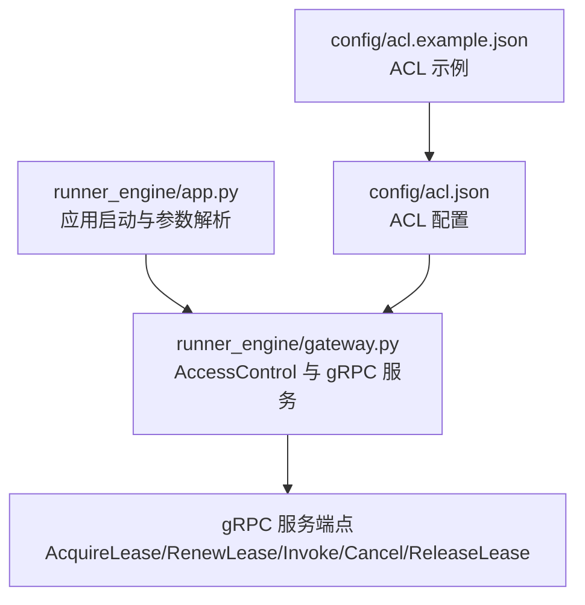
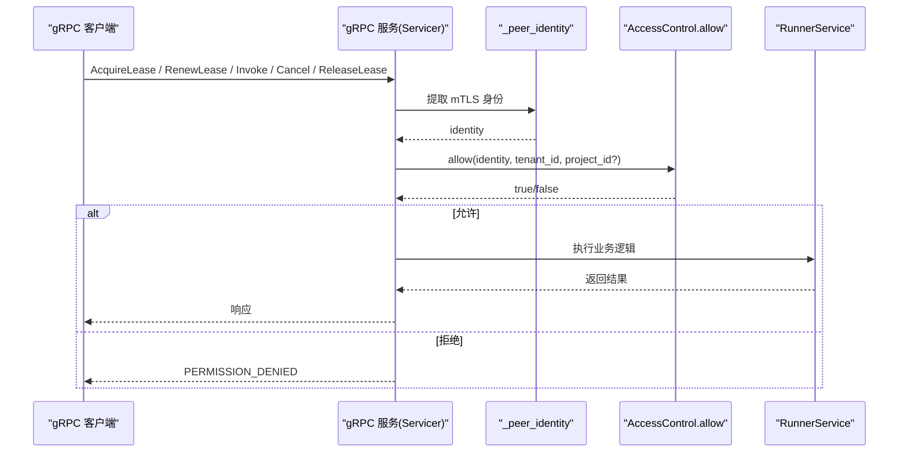
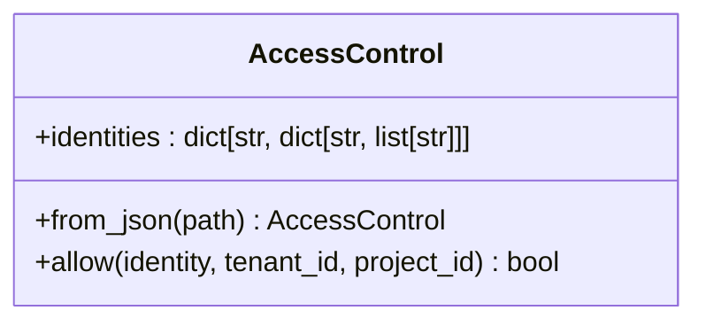
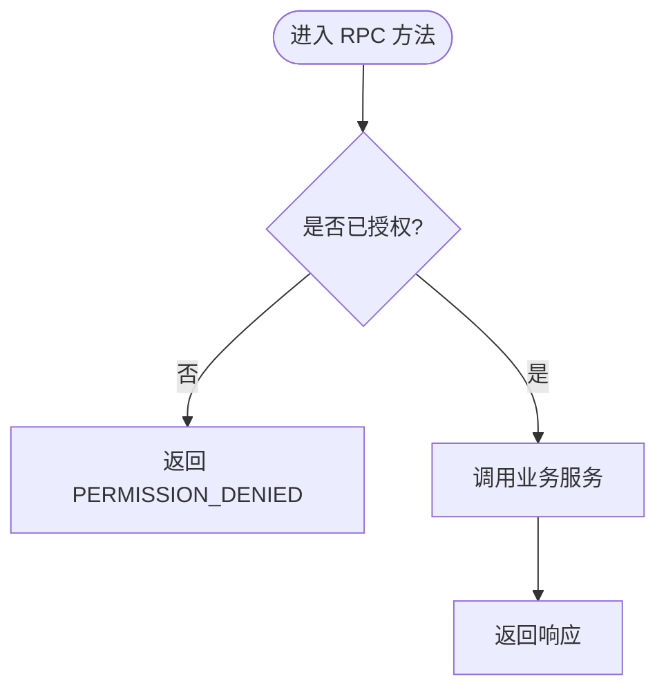
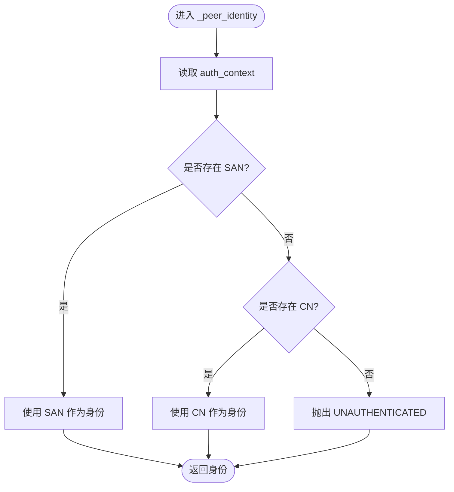
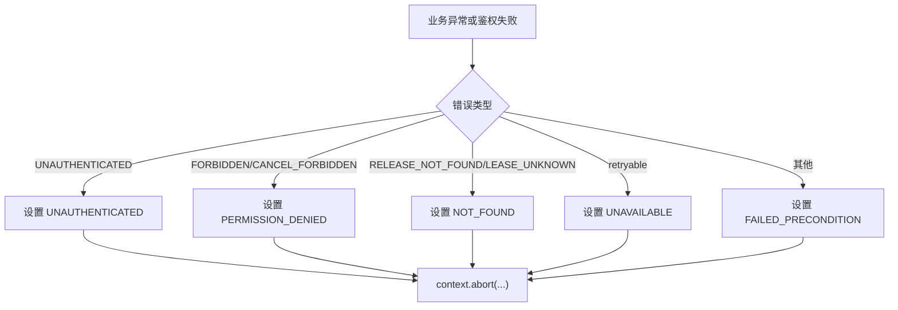
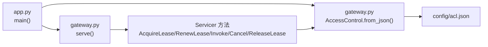
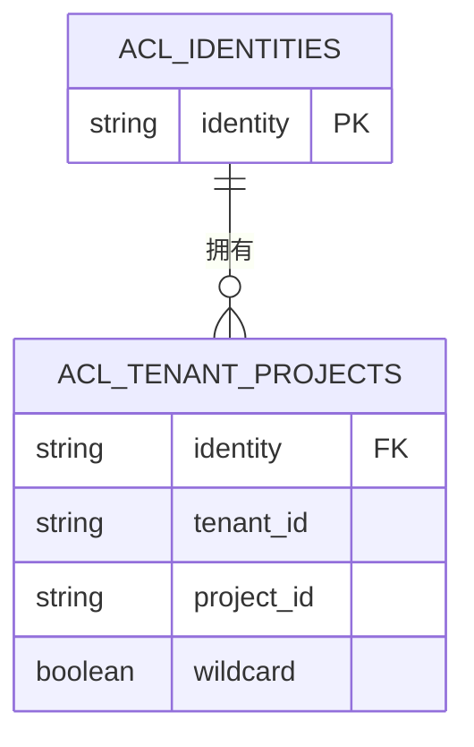

# 访问控制列表配置

<cite>
**本文引用的文件**   
- [runner_engine/app.py](file://runner_engine/app.py)
- [runner_engine/gateway.py](file://runner_engine/gateway.py)
- [config/acl.json](file://config/acl.json)
- [config/acl.example.json](file://config/acl.example.json)
</cite>

## 目录
1. [简介](#简介)
2. [项目结构](#项目结构)
3. [核心组件](#核心组件)
4. [架构总览](#架构总览)
5. [详细组件分析](#详细组件分析)
6. [依赖关系分析](#依赖关系分析)
7. [性能考虑](#性能考虑)
8. [故障排查指南](#故障排查指南)
9. [结论](#结论)
10. [附录：ACL 配置语法与示例](#附录acl-配置语法与示例)

## 简介
本文档面向运维与平台工程师，系统化说明 Runner Engine 的 ACL（访问控制列表）机制。内容涵盖：
- ACL 配置文件结构与语法
- identities、tenants、projects 的定义方式
- 权限模型与继承关系
- 用户、租户、项目级别的访问权限配置方法
- 常见配置场景与最佳实践
- 权限验证流程与错误处理机制

本实现基于 mTLS 客户端证书身份进行鉴权，并通过 gRPC 服务在每次请求时校验调用方对指定租户与项目的访问权限。

## 项目结构
与 ACL 直接相关的代码与配置分布如下：
- runner_engine/app.py：应用启动入口，解析命令行参数并加载 ACL 配置，构造 AccessControl 实例并注入到 gRPC 服务中。
- runner_engine/gateway.py：定义 AccessControl 类与 gRPC 服务端点，负责从 mTLS 上下文提取身份，并在关键接口上执行 ACL 校验。
- config/acl.json：运行时使用的 ACL 配置。
- config/acl.example.json：ACL 配置示例。

图表来源
- [runner_engine/app.py:212-219](file://runner_engine/app.py#L212-L219)
- [runner_engine/gateway.py:12-30](file://runner_engine/gateway.py#L12-L30)
- [config/acl.json:1-8](file://config/acl.json#L1-L8)
- [config/acl.example.json:1-8](file://config/acl.example.json#L1-L8)

章节来源
- [runner_engine/app.py:26-50](file://runner_engine/app.py#L26-L50)
- [runner_engine/app.py:212-219](file://runner_engine/app.py#L212-L219)
- [runner_engine/gateway.py:12-30](file://runner_engine/gateway.py#L12-L30)
- [config/acl.json:1-8](file://config/acl.json#L1-L8)
- [config/acl.example.json:1-8](file://config/acl.example.json#L1-L8)

## 核心组件
- AccessControl：封装 ACL 规则，提供 allow(identity, tenant_id, project_id) 判断方法。
- _peer_identity：从 gRPC 上下文中提取 mTLS 客户端身份（优先 SAN，其次 CN）。
- gRPC Servicer：在每个需要授权的 RPC 方法中调用 AccessControl 进行鉴权。

章节来源
- [runner_engine/gateway.py:12-30](file://runner_engine/gateway.py#L12-L30)
- [runner_engine/gateway.py:33-41](file://runner_engine/gateway.py#L33-L41)
- [runner_engine/gateway.py:81-96](file://runner_engine/gateway.py#L81-L96)

## 架构总览
下图展示了从客户端发起 gRPC 请求到 ACL 校验的关键路径。

图表来源
- [runner_engine/gateway.py:81-96](file://runner_engine/gateway.py#L81-L96)
- [runner_engine/gateway.py:102-177](file://runner_engine/gateway.py#L102-L177)

## 详细组件分析

### AccessControl 类与 ACL 规则
- 初始化：接收 identities 映射，键为身份名，值为 {租户: [项目列表]}。
- from_json：从 JSON 文件读取 identities。
- allow：按身份查找租户映射；若未找到则拒绝；若未指定项目则允许；否则检查项目是否在列表中或包含通配符 "*"。

图表来源
- [runner_engine/gateway.py:12-30](file://runner_engine/gateway.py#L12-L30)

章节来源
- [runner_engine/gateway.py:12-30](file://runner_engine/gateway.py#L12-L30)

### gRPC 服务中的授权流程
- _authorize：从上下文获取身份，调用 AccessControl.allow(tenant_id, project_id)。
- _authorize_lease：先根据 lease_id 查询租约，再校验身份对租约所属项目的访问权限。
- 各 RPC 方法：AcquireLease、RenewLease、Invoke、Cancel、ReleaseLease 均通过上述两个方法进行鉴权。

图表来源
- [runner_engine/gateway.py:81-96](file://runner_engine/gateway.py#L81-L96)
- [runner_engine/gateway.py:102-177](file://runner_engine/gateway.py#L102-L177)

章节来源
- [runner_engine/gateway.py:81-96](file://runner_engine/gateway.py#L81-L96)
- [runner_engine/gateway.py:102-177](file://runner_engine/gateway.py#L102-L177)

### 身份提取与认证
- _peer_identity：从 gRPC 上下文的 auth_context 中提取 x509_subject_alternative_name 或 x509_common_name，取第一个值作为身份字符串。
- 如果无法提取身份，抛出 UNAUTHENTICATED 错误，并在网关层映射为 gRPC UNAUTHENTICATED。

图表来源
- [runner_engine/gateway.py:33-41](file://runner_engine/gateway.py#L33-L41)

章节来源
- [runner_engine/gateway.py:33-41](file://runner_engine/gateway.py#L33-L41)

### 错误处理与状态码映射
- 当 AccessControl.allow 返回 false 时，网关层返回 PERMISSION_DENIED。
- 当身份缺失时，抛出 UNAUTHENTICATED，网关层映射为 UNAUTHENTICATED。
- 其他业务异常由 _abort_runner_error 统一映射为合适的 gRPC 状态码。

图表来源
- [runner_engine/gateway.py:67-79](file://runner_engine/gateway.py#L67-L79)

章节来源
- [runner_engine/gateway.py:67-79](file://runner_engine/gateway.py#L67-L79)

## 依赖关系分析
- app.py 负责解析命令行参数（包括 --acl），并从 JSON 构建 AccessControl，然后将其注入 serve()。
- gateway.py 的 AccessControl 依赖 JSON 文件中的 identities 结构。
- gRPC 服务端点在关键方法中调用 AccessControl 进行鉴权。

图表来源
- [runner_engine/app.py:212-219](file://runner_engine/app.py#L212-L219)
- [runner_engine/gateway.py:12-30](file://runner_engine/gateway.py#L12-L30)
- [runner_engine/gateway.py:102-177](file://runner_engine/gateway.py#L102-L177)

章节来源
- [runner_engine/app.py:212-219](file://runner_engine/app.py#L212-L219)
- [runner_engine/gateway.py:12-30](file://runner_engine/gateway.py#L12-L30)
- [runner_engine/gateway.py:102-177](file://runner_engine/gateway.py#L102-L177)

## 性能考虑
- ACL 校验为 O(1) 字典查找，开销极低。
- 鉴权发生在每个 gRPC 方法入口处，避免重复计算。
- 建议将 ACL 配置保持精简，避免过多租户/项目条目导致维护成本上升。

[本节为通用指导，不直接分析具体文件]

## 故障排查指南
- 现象：客户端收到 PERMISSION_DENIED。
  - 可能原因：
    - 客户端证书 CN/SAN 未在 ACL identities 中声明。
    - 客户端尝试访问的租户不在该身份的允许列表中。
    - 客户端尝试访问的项目不在该租户的项目列表中，且未使用通配符 "*"。
  - 排查步骤：
    - 确认客户端证书 CN/SAN 与 ACL 中的 identity 一致。
    - 检查 ACL 中对应租户与项目列表是否包含目标项目或使用 "*"。
    - 查看日志中是否出现“identity is not allowed for tenant/project”。

- 现象：客户端收到 UNAUTHENTICATED。
  - 可能原因：mTLS 握手成功但无法从上下文提取身份（缺少 SAN/CN）。
  - 排查步骤：
    - 检查客户端证书是否正确签发，是否包含 SAN 或 CN。
    - 确认服务端启用了客户端认证（require_client_auth=True）。

- 现象：业务异常被转换为 UNAVAILABLE 或 NOT_FOUND。
  - 可能原因：
    - 业务异常标记为可重试（retryable），被映射为 UNAVAILABLE。
    - 租约不存在或释放未知，被映射为 NOT_FOUND。
  - 排查步骤：
    - 检查业务侧抛出的 RunnerError 的 code 与 retryable 标志。
    - 核对租约生命周期与 ID 传递是否正确。

章节来源
- [runner_engine/gateway.py:67-79](file://runner_engine/gateway.py#L67-L79)
- [runner_engine/gateway.py:81-96](file://runner_engine/gateway.py#L81-L96)

## 结论
本实现的 ACL 机制以 mTLS 身份为基础，结合 JSON 配置的 identities 映射，实现对租户与项目的细粒度访问控制。其设计简洁高效，适合在多租户环境中隔离不同调用方的资源访问范围。建议在生产环境严格管理 ACL 配置，遵循最小权限原则，并结合审计日志持续监控访问行为。

[本节为总结性内容，不直接分析具体文件]

## 附录：ACL 配置语法与示例

### 配置文件结构
- 顶层字段 identities：键为身份名（通常来自客户端证书的 CN 或 SAN），值为一个对象，键为租户 ID，值为该项目允许访问的项目 ID 列表。
- 项目列表支持通配符 "*"，表示允许访问该租户下的所有项目。

图表来源
- [config/acl.json:1-8](file://config/acl.json#L1-L8)
- [config/acl.example.json:1-8](file://config/acl.example.json#L1-L8)

### 常见配置场景
- 单租户多项目：为某个身份指定多个项目 ID。
- 全量访问：为某个身份在特定租户下使用 "*" 允许访问所有项目。
- 跨租户隔离：不同身份仅能访问各自允许的租户与项目集合。

### 最佳实践
- 最小权限：只授予必要的项目访问权限，避免滥用 "*"。
- 明确命名：身份、租户、项目命名清晰，便于审计与排障。
- 版本化配置：ACL 变更纳入版本控制，配合发布流程审批。
- 定期审计：定期检查 ACL 与实际使用情况，清理不再需要的条目。

章节来源
- [config/acl.json:1-8](file://config/acl.json#L1-L8)
- [config/acl.example.json:1-8](file://config/acl.example.json#L1-L8)