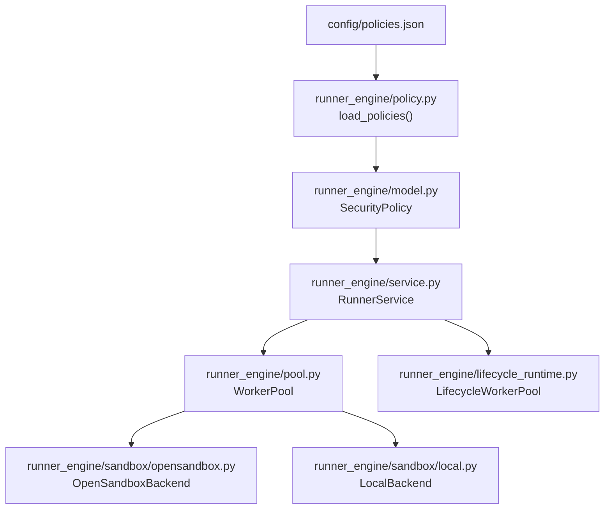
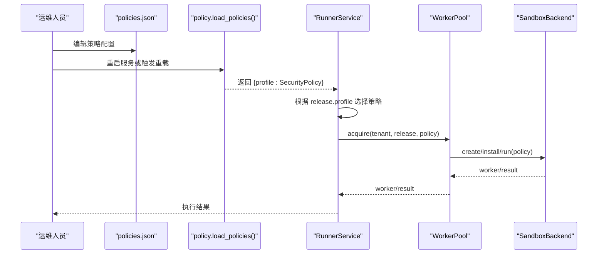
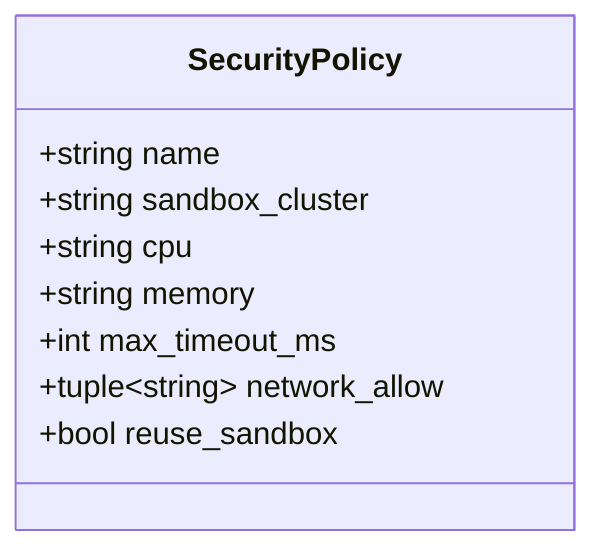
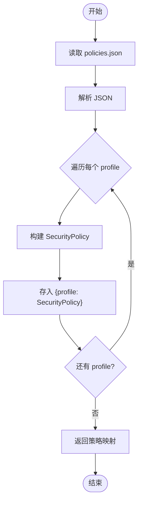
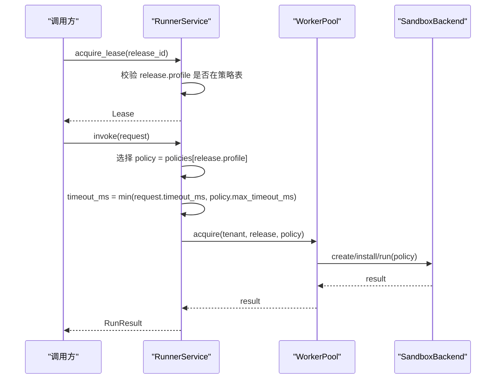
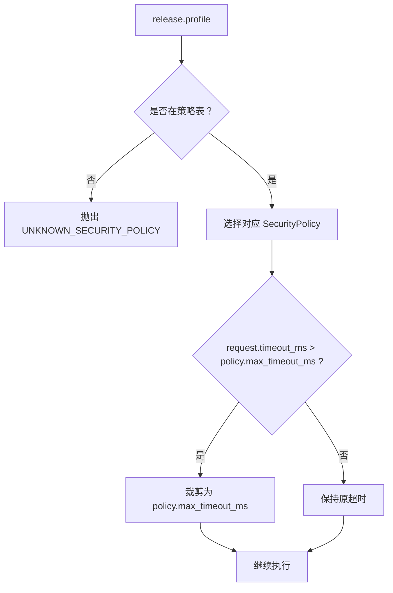
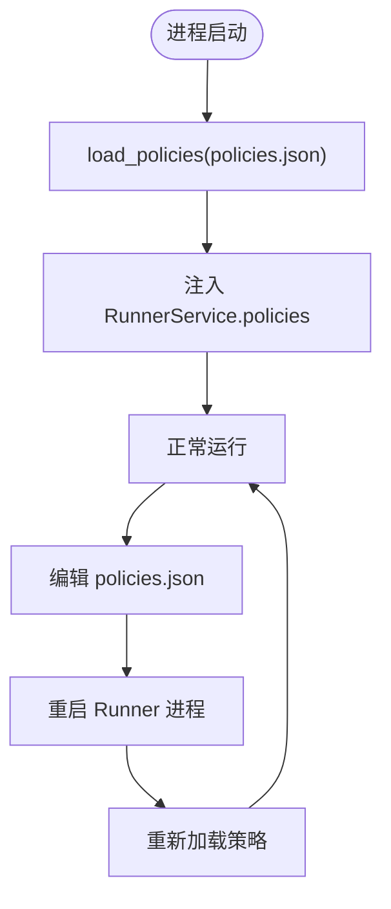
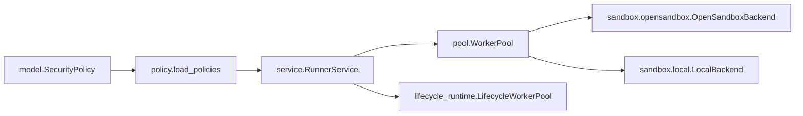

# 运行策略配置

<cite>
**本文引用的文件**   
- [config/policies.json](file://config/policies.json)
- [runner_engine/model.py](file://runner_engine/model.py)
- [runner_engine/policy.py](file://runner_engine/policy.py)
- [runner_engine/service.py](file://runner_engine/service.py)
- [runner_engine/pool.py](file://runner_engine/pool.py)
- [runner_engine/lifecycle_runtime.py](file://runner_engine/lifecycle_runtime.py)
- [runner_engine/sandbox/opensandbox.py](file://runner_engine/sandbox/opensandbox.py)
- [runner_engine/sandbox/local.py](file://runner_engine/sandbox/local.py)
- [infra/opensandbox/README.md](file://infra/opensandbox/README.md)
</cite>

## 目录
1. [简介](#简介)
2. [项目结构](#项目结构)
3. [核心组件](#核心组件)
4. [架构总览](#架构总览)
5. [详细组件分析](#详细组件分析)
6. [依赖关系分析](#依赖关系分析)
7. [性能与约束特性](#性能与约束特性)
8. [故障排查指南](#故障排查指南)
9. [结论](#结论)
10. [附录：策略场景示例](#附录策略场景示例)

## 简介
本文面向“运行策略配置”，系统性说明策略配置文件的结构与规则定义，包括资源限制、安全策略、执行约束等；解释策略的优先级与冲突解决机制；提供 CPU 限制、内存限制、网络访问控制等常见场景的配置思路；并说明策略在系统中的加载方式与热更新注意事项。

本项目的策略以“安全策略（SecurityPolicy）”为核心，通过 JSON 配置文件声明不同 profile（如 standard、hardened），并在运行时由 RunnerService 根据发布版本（OperatorRelease）的 profile 选择对应策略，进而影响沙箱集群、CPU/内存上限、超时、网络白名单以及沙箱复用行为。

## 项目结构
与运行策略直接相关的代码与配置分布如下：
- 策略配置：config/policies.json
- 策略数据模型：runner_engine/model.py
- 策略加载器：runner_engine/policy.py
- 策略使用点：runner_engine/service.py、runner_engine/pool.py
- 策略到后端的传递：runner_engine/sandbox/opensandbox.py、runner_engine/sandbox/local.py
- 生命周期与策略联动：runner_engine/lifecycle_runtime.py
- 外部文档参考：infra/opensandbox/README.md

**图表来源**
- [runner_engine/policy.py:9-24](file://runner_engine/policy.py#L9-L24)
- [runner_engine/model.py:26-34](file://runner_engine/model.py#L26-L34)
- [runner_engine/service.py:80-98](file://runner_engine/service.py#L80-L98)
- [runner_engine/pool.py:11-49](file://runner_engine/pool.py#L11-L49)
- [runner_engine/sandbox/opensandbox.py:170-190](file://runner_engine/sandbox/opensandbox.py#L170-L190)
- [runner_engine/sandbox/local.py:50-65](file://runner_engine/sandbox/local.py#L50-L65)
- [runner_engine/lifecycle_runtime.py:14-47](file://runner_engine/lifecycle_runtime.py#L14-L47)

**章节来源**
- [config/policies.json:1-19](file://config/policies.json#L1-L19)
- [runner_engine/policy.py:1-24](file://runner_engine/policy.py#L1-L24)
- [runner_engine/model.py:26-34](file://runner_engine/model.py#L26-L34)
- [runner_engine/service.py:80-98](file://runner_engine/service.py#L80-L98)
- [runner_engine/pool.py:11-49](file://runner_engine/pool.py#L11-L49)
- [runner_engine/sandbox/opensandbox.py:170-190](file://runner_engine/sandbox/opensandbox.py#L170-L190)
- [runner_engine/sandbox/local.py:50-65](file://runner_engine/sandbox/local.py#L50-L65)
- [runner_engine/lifecycle_runtime.py:14-47](file://runner_engine/lifecycle_runtime.py#L14-L47)

## 核心组件
- SecurityPolicy：策略的数据模型，包含名称、沙箱集群、CPU、内存、最大超时、网络允许列表、是否复用沙箱等字段。
- load_policies：从 JSON 文件加载策略映射表，键为 profile 名，值为 SecurityPolicy 实例。
- RunnerService：在获取租约和执行调用时，依据 OperatorRelease.profile 查找对应策略，并对请求超时进行策略级上限约束。
- WorkerPool：按 tenant + runtime + profile 维度维护空闲沙箱池，结合策略决定沙箱 TTL 续期与复用。
- OpenSandboxBackend / LocalBackend：将策略中的关键参数（如 profile、sandbox_cluster、CPU/memory 等）传递给底层沙箱后端。
- LifecycleWorkerPool：在生命周期管理过程中阻止对即将退役的运行时的新沙箱分配，避免策略与生命周期状态冲突。

**章节来源**
- [runner_engine/model.py:26-34](file://runner_engine/model.py#L26-L34)
- [runner_engine/policy.py:9-24](file://runner_engine/policy.py#L9-L24)
- [runner_engine/service.py:146-167](file://runner_engine/service.py#L146-L167)
- [runner_engine/service.py:188-235](file://runner_engine/service.py#L188-L235)
- [runner_engine/pool.py:73-143](file://runner_engine/pool.py#L73-L143)
- [runner_engine/sandbox/opensandbox.py:170-190](file://runner_engine/sandbox/opensandbox.py#L170-L190)
- [runner_engine/sandbox/local.py:50-65](file://runner_engine/sandbox/local.py#L50-L65)
- [runner_engine/lifecycle_runtime.py:26-47](file://runner_engine/lifecycle_runtime.py#L26-L47)

## 架构总览
下图展示策略从配置到执行的端到端流程：配置文件被加载为策略字典，服务层根据发布版本的 profile 选择策略，工作池基于策略创建或复用沙箱，最终由后端执行任务。

**图表来源**
- [runner_engine/policy.py:9-24](file://runner_engine/policy.py#L9-L24)
- [runner_engine/service.py:146-167](file://runner_engine/service.py#L146-L167)
- [runner_engine/service.py:188-235](file://runner_engine/service.py#L188-L235)
- [runner_engine/pool.py:73-143](file://runner_engine/pool.py#L73-L143)
- [runner_engine/sandbox/opensandbox.py:170-190](file://runner_engine/sandbox/opensandbox.py#L170-L190)

## 详细组件分析

### 策略数据模型与配置文件结构
- SecurityPolicy 字段含义
  - name：策略名称（通常与 profile 一致）。
  - sandbox_cluster：目标沙箱集群标识（例如 gvisor、kata）。
  - cpu：CPU 配额字符串（例如 "1"、"2"）。
  - memory：内存配额字符串（例如 "512Mi"、"1Gi"）。
  - max_timeout_ms：单次执行最大超时毫秒数。
  - network_allow：网络允许列表（默认空表示拒绝所有出站）。
  - reuse_sandbox：是否允许复用已存在的沙箱。

- policies.json 顶层结构
  - 每个顶级键为一个策略 profile（如 standard、hardened）。
  - 每个 profile 对象包含上述字段。

**图表来源**
- [runner_engine/model.py:26-34](file://runner_engine/model.py#L26-L34)

**章节来源**
- [runner_engine/model.py:26-34](file://runner_engine/model.py#L26-L34)
- [config/policies.json:1-19](file://config/policies.json#L1-L19)

### 策略加载与校验
- load_policies 读取 JSON 文件，逐条构建 SecurityPolicy 对象，缺失字段采用默认值。
- 若发布版本使用的 profile 不在策略表中，RunnerService 会抛出未知策略错误。

**图表来源**
- [runner_engine/policy.py:9-24](file://runner_engine/policy.py#L9-L24)

**章节来源**
- [runner_engine/policy.py:9-24](file://runner_engine/policy.py#L9-L24)
- [runner_engine/service.py:146-167](file://runner_engine/service.py#L146-L167)
- [runner_engine/service.py:188-235](file://runner_engine/service.py#L188-L235)

### 策略在运行时的应用
- 租约阶段：RunnerService.acquire_lease 检查 release.profile 是否存在于策略表，不存在则报错。
- 执行阶段：RunnerService.invoke 根据 release.profile 选择策略，并将请求 timeout_ms 裁剪至不超过策略的 max_timeout_ms。
- 工作池阶段：WorkerPool.acquire 使用策略决定是否续期沙箱 TTL；release 阶段根据 reuse_sandbox 决定是否回收沙箱。
- 后端阶段：OpenSandboxBackend 和 LocalBackend 接收策略相关元信息（如 profile、sandbox_cluster、CPU/memory 等），用于创建受控沙箱。

**图表来源**
- [runner_engine/service.py:146-167](file://runner_engine/service.py#L146-L167)
- [runner_engine/service.py:188-235](file://runner_engine/service.py#L188-L235)
- [runner_engine/pool.py:73-143](file://runner_engine/pool.py#L73-L143)
- [runner_engine/sandbox/opensandbox.py:170-190](file://runner_engine/sandbox/opensandbox.py#L170-L190)
- [runner_engine/sandbox/local.py:50-65](file://runner_engine/sandbox/local.py#L50-L65)

**章节来源**
- [runner_engine/service.py:146-167](file://runner_engine/service.py#L146-L167)
- [runner_engine/service.py:188-235](file://runner_engine/service.py#L188-L235)
- [runner_engine/pool.py:73-143](file://runner_engine/pool.py#L73-L143)
- [runner_engine/sandbox/opensandbox.py:170-190](file://runner_engine/sandbox/opensandbox.py#L170-L190)
- [runner_engine/sandbox/local.py:50-65](file://runner_engine/sandbox/local.py#L50-L65)

### 策略优先级与冲突解决
- 单一策略选择：每个发布版本（OperatorRelease）仅有一个 profile，RunnerService 通过 release.profile 精确匹配策略，不存在多策略竞争。
- 无隐式继承：策略之间没有继承或合并语义，每个 profile 独立定义。
- 冲突处理：
  - 如果 release.profile 未在策略表中，系统抛出 UNKNOWN_SECURITY_POLICY 错误，阻止执行。
  - 如果请求超时超过策略的 max_timeout_ms，会被强制裁剪，确保执行时间不超出策略上限。
  - 生命周期保护：当运行时处于 RETIRING 状态时，LifecycleWorkerPool 阻止新的沙箱分配，避免策略与生命周期状态产生不一致。

**图表来源**
- [runner_engine/service.py:146-167](file://runner_engine/service.py#L146-L167)
- [runner_engine/service.py:188-235](file://runner_engine/service.py#L188-L235)
- [runner_engine/lifecycle_runtime.py:26-47](file://runner_engine/lifecycle_runtime.py#L26-L47)

**章节来源**
- [runner_engine/service.py:146-167](file://runner_engine/service.py#L146-L167)
- [runner_engine/service.py:188-235](file://runner_engine/service.py#L188-L235)
- [runner_engine/lifecycle_runtime.py:26-47](file://runner_engine/lifecycle_runtime.py#L26-L47)

### 动态加载与热更新机制
- 启动时加载：Runner 进程启动时调用 load_policies 读取策略文件，构建策略映射并注入 RunnerService。
- 运行时变更：当前实现未提供进程内热重载策略表的 API；修改 policies.json 后需重启 Runner 进程使新策略生效。
- 生命周期联动：即使策略可热更新，仍需考虑生命周期状态（ACTIVE/RETIRING/RETIRED）对沙箱分配的影响，避免在退役期间引入新策略导致的状态不一致。

**图表来源**
- [runner_engine/policy.py:9-24](file://runner_engine/policy.py#L9-L24)
- [runner_engine/service.py:80-98](file://runner_engine/service.py#L80-L98)
- [runner_engine/lifecycle_runtime.py:83-96](file://runner_engine/lifecycle_runtime.py#L83-L96)

**章节来源**
- [runner_engine/policy.py:9-24](file://runner_engine/policy.py#L9-L24)
- [runner_engine/service.py:80-98](file://runner_engine/service.py#L80-L98)
- [runner_engine/lifecycle_runtime.py:83-96](file://runner_engine/lifecycle_runtime.py#L83-L96)

## 依赖关系分析
- 模块耦合
  - policy.py 依赖 model.py 的 SecurityPolicy。
  - service.py 依赖 policy.py 的策略映射，并通过 pool.py 与后端交互。
  - pool.py 依赖 model.py 的 SecurityPolicy 与 quota.py 的配额控制。
  - opensandbox.py 与 local.py 作为后端，接收策略相关参数。
  - lifecycle_runtime.py 扩展 WorkerPool，增加生命周期门控。

**图表来源**
- [runner_engine/model.py:26-34](file://runner_engine/model.py#L26-L34)
- [runner_engine/policy.py:9-24](file://runner_engine/policy.py#L9-L24)
- [runner_engine/service.py:80-98](file://runner_engine/service.py#L80-L98)
- [runner_engine/pool.py:11-49](file://runner_engine/pool.py#L11-L49)
- [runner_engine/sandbox/opensandbox.py:170-190](file://runner_engine/sandbox/opensandbox.py#L170-L190)
- [runner_engine/sandbox/local.py:50-65](file://runner_engine/sandbox/local.py#L50-L65)
- [runner_engine/lifecycle_runtime.py:14-47](file://runner_engine/lifecycle_runtime.py#L14-L47)

**章节来源**
- [runner_engine/model.py:26-34](file://runner_engine/model.py#L26-L34)
- [runner_engine/policy.py:9-24](file://runner_engine/policy.py#L9-L24)
- [runner_engine/service.py:80-98](file://runner_engine/service.py#L80-L98)
- [runner_engine/pool.py:11-49](file://runner_engine/pool.py#L11-L49)
- [runner_engine/sandbox/opensandbox.py:170-190](file://runner_engine/sandbox/opensandbox.py#L170-L190)
- [runner_engine/sandbox/local.py:50-65](file://runner_engine/sandbox/local.py#L50-L65)
- [runner_engine/lifecycle_runtime.py:14-47](file://runner_engine/lifecycle_runtime.py#L14-L47)

## 性能与约束特性
- 超时约束：策略的 max_timeout_ms 作为全局上限，防止长尾任务占用过多资源。
- 沙箱复用：reuse_sandbox 控制空闲沙箱是否回收到池中，影响冷启动与资源利用率。
- 资源隔离：sandbox_cluster 指定底层沙箱技术（如 gvisor、kata），配合 CPU/memory 配额实现强隔离。
- 网络控制：network_allow 为空时默认拒绝出站，适合高安全场景；按需添加白名单条目以最小化暴露面。
- 生命周期保护：在运行时退役期间禁止新沙箱分配，避免策略与生命周期状态冲突。

**章节来源**
- [runner_engine/service.py:188-235](file://runner_engine/service.py#L188-L235)
- [runner_engine/pool.py:56-66](file://runner_engine/pool.py#L56-L66)
- [runner_engine/pool.py:132-143](file://runner_engine/pool.py#L132-L143)
- [runner_engine/lifecycle_runtime.py:26-47](file://runner_engine/lifecycle_runtime.py#L26-L47)
- [infra/opensandbox/README.md:22-22](file://infra/opensandbox/README.md#L22-L22)

## 故障排查指南
- UNKNOWN_SECURITY_POLICY
  - 现象：调用 acquire_lease 或 invoke 时报错，提示 release 使用了未知 profile。
  - 原因：policies.json 中缺少该 profile 的定义。
  - 处理：在 policies.json 中添加对应 profile，重启 Runner 进程。

- 超时被截断
  - 现象：客户端设置的超时大于策略的 max_timeout_ms，实际执行被裁剪。
  - 原因：策略限制了最大执行时间。
  - 处理：调整策略的 max_timeout_ms，或降低客户端超时设置。

- 沙箱无法复用
  - 现象：频繁创建新沙箱，冷启动增多。
  - 原因：reuse_sandbox 为 false，或沙箱健康状态异常。
  - 处理：将 reuse_sandbox 设为 true，并确保后端健康检查正常。

- 网络访问受限
  - 现象：沙箱内无法访问外部网络。
  - 原因：network_allow 为空，默认拒绝出站。
  - 处理：按需添加允许的域名/IP 到 network_allow。

- 运行时退役导致分配失败
  - 现象：在运行时退役期间无法获取新沙箱。
  - 原因：LifecycleWorkerPool 阻止新分配以避免状态不一致。
  - 处理：等待退役完成或取消退役流程。

**章节来源**
- [runner_engine/service.py:146-167](file://runner_engine/service.py#L146-L167)
- [runner_engine/service.py:188-235](file://runner_engine/service.py#L188-L235)
- [runner_engine/pool.py:132-143](file://runner_engine/pool.py#L132-L143)
- [runner_engine/lifecycle_runtime.py:26-47](file://runner_engine/lifecycle_runtime.py#L26-L47)

## 结论
运行策略配置通过 profiles 将资源限制、安全策略与执行约束集中管理。RunnerService 在租约与执行阶段严格校验并使用策略，WorkerPool 结合策略控制沙箱生命周期与复用，后端将策略参数应用于底层沙箱。当前实现不支持进程内热更新策略，修改配置后需重启服务；同时应结合生命周期状态，避免在退役期间引入新策略造成不一致。

## 附录：策略场景示例
以下为常见策略场景的配置思路（以标准 JSON 结构描述，具体字段见 SecurityPolicy）：
- CPU 限制
  - 适用：需要限制计算资源的场景。
  - 配置要点：设置 cpu 为较小值（如 "0.5" 或 "1"），并结合 memory 限制整体资源。
  - 参考字段：cpu、memory、max_timeout_ms。

- 内存限制
  - 适用：防止内存泄漏或突发峰值导致宿主机压力。
  - 配置要点：设置 memory 为合理上限（如 "512Mi" 或 "1Gi"）。
  - 参考字段：memory、max_timeout_ms。

- 网络访问控制
  - 适用：高安全环境，默认拒绝出站，仅开放必要域名/IP。
  - 配置要点：network_allow 留空表示拒绝所有；按需添加白名单条目。
  - 参考字段：network_allow。

- 沙箱复用与安全强度权衡
  - 适用：平衡性能与安全。
  - 配置要点：standard 可启用 reuse_sandbox=true 提升性能；hardened 建议 reuse_sandbox=false 提高隔离性。
  - 参考字段：reuse_sandbox、sandbox_cluster。

- 执行超时控制
  - 适用：防止长尾任务拖垮系统。
  - 配置要点：根据业务 SLA 设置 max_timeout_ms，并确保客户端超时不超过该值。
  - 参考字段：max_timeout_ms。

**章节来源**
- [runner_engine/model.py:26-34](file://runner_engine/model.py#L26-L34)
- [config/policies.json:1-19](file://config/policies.json#L1-L19)
- [infra/opensandbox/README.md:22-22](file://infra/opensandbox/README.md#L22-L22)