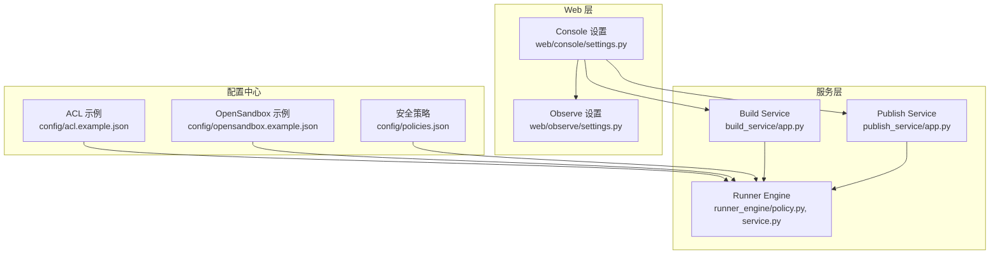
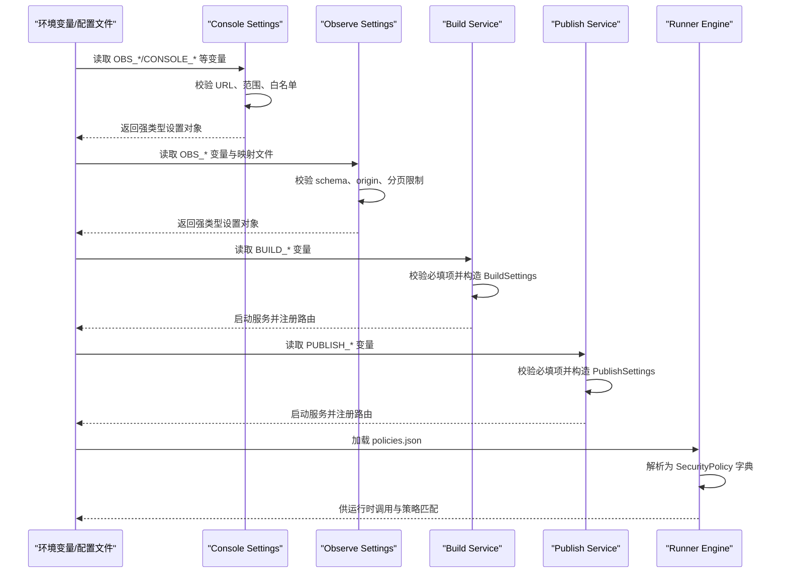
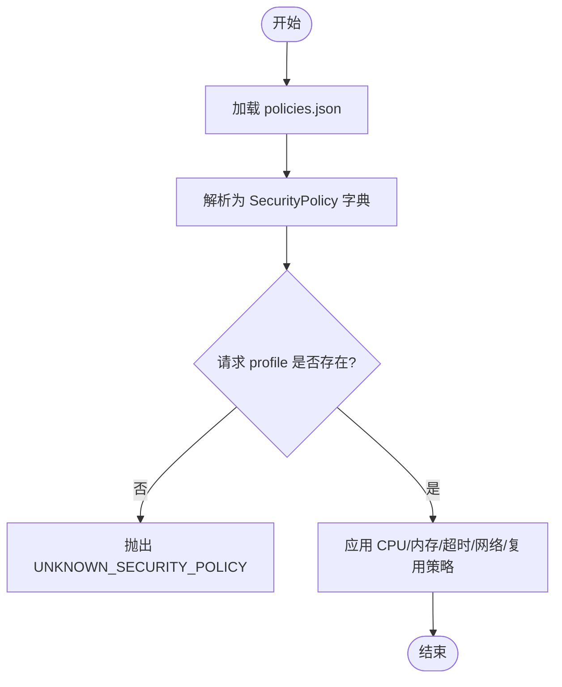
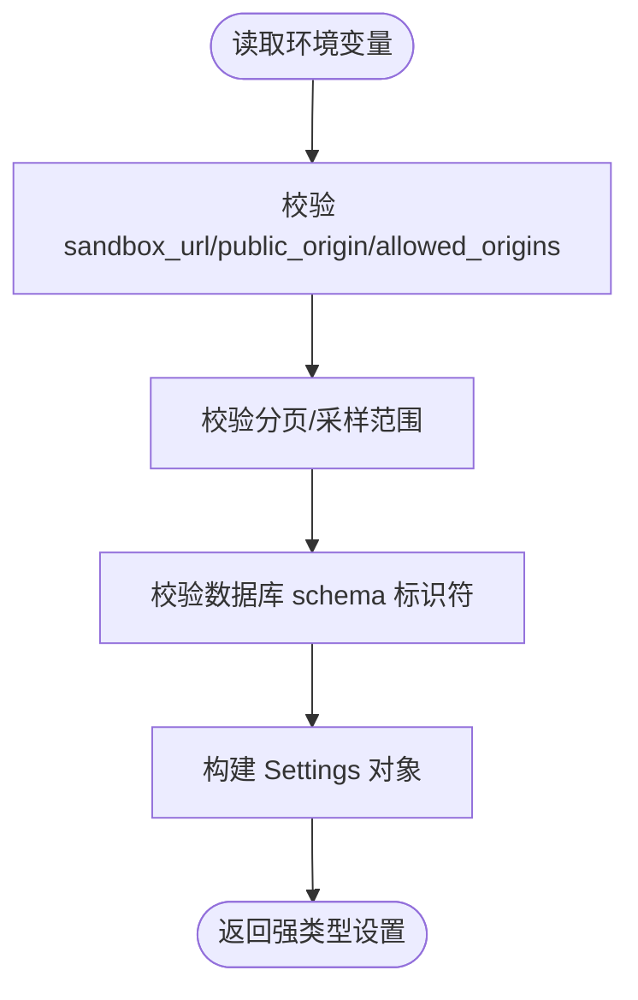
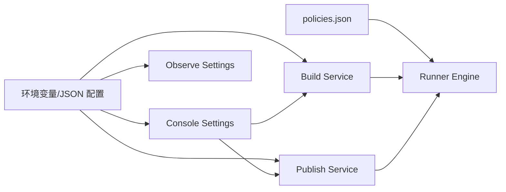

# 配置最佳实践

<cite>
**本文引用的文件**   
- [config/acl.example.json](file://config/acl.example.json)
- [config/opensandbox.example.json](file://config/opensandbox.example.json)
- [config/policies.json](file://config/policies.json)
- [web/console/settings.py](file://web/console/settings.py)
- [web/observe/settings.py](file://web/observe/settings.py)
- [build_service/app.py](file://build_service/app.py)
- [publish_service/app.py](file://publish_service/app.py)
- [runner_engine/policy.py](file://runner_engine/policy.py)
- [runner_engine/service.py](file://runner_engine/service.py)
</cite>

## 目录
1. [引言](#引言)
2. [项目结构](#项目结构)
3. [核心组件](#核心组件)
4. [架构总览](#架构总览)
5. [详细组件分析](#详细组件分析)
6. [依赖关系分析](#依赖关系分析)
7. [性能与容量规划](#性能与容量规划)
8. [故障排查指南](#故障排查指南)
9. [结论](#结论)
10. [附录：环境配置清单与模板](#附录环境配置清单与模板)

## 引言
本文件面向运维、平台工程与安全团队，总结本项目在配置管理方面的通用原则、分层策略、命名约定、版本管理与迁移方法，并给出不同环境的配置模板、验证与审计建议、回滚策略以及常见问题的排查路径。重点强调敏感信息保护与最小权限原则，确保在生产环境中安全、可审计、可回滚地管理配置。

## 项目结构
仓库采用“服务+配置”的模块化组织方式：
- 顶层 config 目录集中存放示例与默认策略配置，便于多服务共享或作为基线。
- web/console 与 web/observe 提供统一控制台与观测能力，其设置通过环境变量加载并进行严格校验。
- build_service 与 publish_service 是构建与发布流水线中的两个关键服务，各自从环境变量读取运行参数，并对必填项进行启动期校验。
- runner_engine 负责运行时执行与安全策略加载，策略以 JSON 文件形式定义，并在运行时解析为强类型对象。

**图表来源**
- [config/acl.example.json:1-9](file://config/acl.example.json#L1-L9)
- [config/opensandbox.example.json:1-11](file://config/opensandbox.example.json#L1-L11)
- [config/policies.json:1-19](file://config/policies.json#L1-L19)
- [web/console/settings.py:1-85](file://web/console/settings.py#L1-L85)
- [web/observe/settings.py:1-128](file://web/observe/settings.py#L1-L128)
- [build_service/app.py:65-99](file://build_service/app.py#L65-L99)
- [publish_service/app.py:50-128](file://publish_service/app.py#L50-L128)
- [runner_engine/policy.py:9-24](file://runner_engine/policy.py#L9-L24)
- [runner_engine/service.py:188-220](file://runner_engine/service.py#L188-L220)

**章节来源**
- [config/acl.example.json:1-9](file://config/acl.example.json#L1-L9)
- [config/opensandbox.example.json:1-11](file://config/opensandbox.example.json#L1-L11)
- [config/policies.json:1-19](file://config/policies.json#L1-L19)
- [web/console/settings.py:1-85](file://web/console/settings.py#L1-L85)
- [web/observe/settings.py:1-128](file://web/observe/settings.py#L1-L128)
- [build_service/app.py:65-99](file://build_service/app.py#L65-L99)
- [publish_service/app.py:50-128](file://publish_service/app.py#L50-L128)
- [runner_engine/policy.py:9-24](file://runner_engine/policy.py#L9-L24)
- [runner_engine/service.py:188-220](file://runner_engine/service.py#L188-L220)

## 核心组件
- 配置分层
  - 静态策略与示例：ACL、OpenSandbox 连接示例、安全策略 JSON。
  - Web 层设置：Console 与 Observe 通过 dataclass 与校验函数将环境变量转换为强类型设置对象。
  - 服务层配置：Build/Publish 服务从环境变量读取数据库、镜像仓库、超时等参数，并在启动时校验必填项。
  - 运行时策略：Runner Engine 加载 policies.json 并映射到 SecurityPolicy 对象，用于资源配额、网络访问控制与沙箱复用策略。
- 命名约定
  - 环境变量按服务前缀分组：BUILD_*、PUBLISH_*、OBS_*、CONSOLE_*、ADMIN_*、MPR_*。
  - URL 类变量保持 http(s) 且不含凭据；表映射键使用 SQL 标识符规范。
- 版本管理
  - 策略文件以 key 区分不同安全等级（如 standard、hardened）。
  - Build/Publish 服务暴露版本号与健康检查，便于外部系统探测与灰度切换。

**章节来源**
- [web/console/settings.py:23-84](file://web/console/settings.py#L23-L84)
- [web/observe/settings.py:79-127](file://web/observe/settings.py#L79-L127)
- [build_service/app.py:65-99](file://build_service/app.py#L65-L99)
- [publish_service/app.py:50-128](file://publish_service/app.py#L50-L128)
- [runner_engine/policy.py:9-24](file://runner_engine/policy.py#L9-L24)

## 架构总览
下图展示配置从“静态策略 + 环境变量”到“服务运行态”的流转过程，包括校验、解析与注入。

**图表来源**
- [web/console/settings.py:33-84](file://web/console/settings.py#L33-L84)
- [web/observe/settings.py:94-127](file://web/observe/settings.py#L94-L127)
- [build_service/app.py:65-99](file://build_service/app.py#L65-L99)
- [publish_service/app.py:50-128](file://publish_service/app.py#L50-L128)
- [runner_engine/policy.py:9-24](file://runner_engine/policy.py#L9-L24)

## 详细组件分析

### 安全策略与沙箱隔离（Runner Engine）
- 策略文件位于 config/policies.json，包含标准与加固两种策略，分别指定沙箱集群、CPU/内存上限、最大超时、网络允许列表与沙箱复用开关。
- runner_engine/policy.py 将 JSON 解析为 SecurityPolicy 对象，字段类型明确，缺失值有默认值。
- runner_engine/service.py 在执行请求时根据 release.profile 查找对应策略，若不存在则抛出未知策略错误，从而强制策略存在性校验。

**图表来源**
- [runner_engine/policy.py:9-24](file://runner_engine/policy.py#L9-L24)
- [runner_engine/service.py:188-220](file://runner_engine/service.py#L188-L220)

**章节来源**
- [config/policies.json:1-19](file://config/policies.json#L1-L19)
- [runner_engine/policy.py:9-24](file://runner_engine/policy.py#L9-L24)
- [runner_engine/service.py:188-220](file://runner_engine/service.py#L188-L220)

### OpenSandbox 后端配置
- config/opensandbox.example.json 提供 gvisor 与 kata 两类沙箱后端的连接地址与 API Key 占位符，需替换为真实值。
- 该配置通常被 Runner Engine 或其他沙箱后端模块引用，用于创建隔离执行环境。

**章节来源**
- [config/opensandbox.example.json:1-11](file://config/opensandbox.example.json#L1-L11)

### ACL 访问控制示例
- config/acl.example.json 定义了身份与租户/项目的映射关系，可用于跨服务的访问控制参考。

**章节来源**
- [config/acl.example.json:1-9](file://config/acl.example.json#L1-L9)

### Web 控制台与观测设置（Console & Observe）
- ConsoleSettings 与 Observe.Settings 均使用 dataclass 冻结对象，并通过 environment() 工厂方法从环境变量构建。
- 校验规则包括：
  - URL 必须为 http(s)，不得包含用户名/密码、查询参数或片段；路径仅允许根或 /v1。
  - 允许的浏览器来源（origins）必须是精确的 http(s) origin。
  - 分页与采样限制必须在合理范围内。
  - 数据库 schema 名称必须符合 SQL 标识符规范。
- Console 还额外校验公共来源（public_origin），在非本地主机下要求显式启用远程无认证模式。

**图表来源**
- [web/console/settings.py:16-84](file://web/console/settings.py#L16-L84)
- [web/observe/settings.py:15-49](file://web/observe/settings.py#L15-L49)
- [web/observe/settings.py:94-127](file://web/observe/settings.py#L94-L127)

**章节来源**
- [web/console/settings.py:1-85](file://web/console/settings.py#L1-L85)
- [web/observe/settings.py:1-128](file://web/observe/settings.py#L1-L128)

### Build Service 配置
- 必填环境变量：BUILD_DATABASE_URL、BUILD_RUNNER_BASE_IMAGE、BUILD_REGISTRY_REPO。
- 可选环境变量：BUILD_PYTHON_VERSION、BUILD_PLATFORM、BUILD_UV_PYTHON_PLATFORM、BUILD_POLICY_VERSION、UV_DEFAULT_INDEX、BUILD_ALLOW_SUPERSET_REUSE、BUILD_LISTEN_HOST、BUILD_LISTEN_PORT、BUILD_LOG_LEVEL、BUILD_ADMIN_TOKEN。
- 启动时会校验必填项，缺失则直接抛出运行时错误，避免半配置启动。

**章节来源**
- [build_service/app.py:65-99](file://build_service/app.py#L65-L99)
- [build_service/app.py:187-212](file://build_service/app.py#L187-L212)

### Publish Service 配置
- 必填环境变量：PUBLISH_WORKSPACE_ROOT、PUBLISH_CATALOG_ROOT、PUBLISH_DATABASE_URL。
- 常用可选环境变量：PUBLISH_SOURCE_ROOT、PUBLISH_NATIVE_ARTIFACT_ROOT、PUBLISH_EDGE_BUNDLE_ROOT、PUBLISH_BUILD_SERVICE_URL、PUBLISH_DEFAULT_PROFILE、PUBLISH_DEFAULT_USER_ID、PUBLISH_EDGE_PYTHON_VERSION、PUBLISH_EDGE_UV_DEFAULT_INDEX、PUBLISH_EDGE_REQUIRE_BINARY、PUBLISH_BUILD_TIMEOUT_SECONDS、PUBLISH_MAX_SOURCE_BYTES、PUBLISH_LISTEN_HOST、PUBLISH_LISTEN_PORT、PUBLISH_LOG_LEVEL、PUBLISH_ADMIN_TOKEN。
- 启动时同样对必填项进行校验，缺失则拒绝启动。

**章节来源**
- [publish_service/app.py:50-128](file://publish_service/app.py#L50-L128)
- [publish_service/app.py:353-378](file://publish_service/app.py#L353-L378)

## 依赖关系分析
- 配置来源依赖
  - Console 与 Observe 依赖环境变量与少量 JSON 映射文件。
  - Build/Publish 依赖环境变量与数据库连接。
  - Runner Engine 依赖策略 JSON 文件。
- 组件耦合
  - Console 与 Observe 之间通过 settings 模块解耦，Console 复用 Observe 的设置基础。
  - Build/Publish 与 Runner Engine 通过运行时策略与沙箱后端间接耦合。
- 潜在循环依赖
  - 当前代码中未见循环导入；settings 模块职责单一，避免了对 app 状态的直接读写。

**图表来源**
- [web/console/settings.py:1-85](file://web/console/settings.py#L1-L85)
- [web/observe/settings.py:1-128](file://web/observe/settings.py#L1-L128)
- [build_service/app.py:65-99](file://build_service/app.py#L65-L99)
- [publish_service/app.py:50-128](file://publish_service/app.py#L50-L128)
- [runner_engine/policy.py:9-24](file://runner_engine/policy.py#L9-L24)

**章节来源**
- [web/console/settings.py:1-85](file://web/console/settings.py#L1-L85)
- [web/observe/settings.py:1-128](file://web/observe/settings.py#L1-L128)
- [build_service/app.py:65-99](file://build_service/app.py#L65-L99)
- [publish_service/app.py:50-128](file://publish_service/app.py#L50-L128)
- [runner_engine/policy.py:9-24](file://runner_engine/policy.py#L9-L24)

## 性能与容量规划
- 分页与采样限制
  - OBS_SANDBOX_PAGE_SIZE、OBS_SANDBOX_MAX_ITEMS、OBS_EXECD_SAMPLE_LIMIT 均有上下界校验，建议根据数据量与前端渲染性能调优。
- 超时与资源配额
  - 安全策略中的 max_timeout_ms 与 CPU/内存上限应结合业务 SLA 与节点资源池规模设定。
- 并发与连接池
  - 数据库连接与 HTTP 客户端超时（如 MPR_HTTP_TIMEOUT_SECONDS、MPR_LONG_TIMEOUT_SECONDS）需与上游服务吞吐匹配，避免雪崩。

[本节为通用指导，不直接分析具体文件]

## 故障排查指南
- 启动失败：缺少必填环境变量
  - Build/Publish 服务会在启动阶段校验必填项，缺失会抛出运行时错误。请检查 BUILD_* 与 PUBLISH_* 相关变量是否已正确设置。
- 策略未找到：UNKNOWN_SECURITY_POLICY
  - 当请求使用的 profile 未在 policies.json 中定义时，Runner Engine 会抛出未知策略错误。请确认策略文件包含所需 profile。
- URL 配置非法
  - sandbox_url、public_origin、allowed_origins 必须为 http(s) origin，且不能包含凭据、查询参数或片段。请修正 URL 格式。
- 数据库 schema 非法
  - schema 名称必须符合 SQL 标识符规范，否则会被拒绝。请检查 OBS_*_DB_SCHEMA 的值。
- MinIO 下载失败
  - 可能因桶不存在、路径不存在、权限不足或配置错误导致。请根据返回状态码与日志定位问题。

**章节来源**
- [build_service/app.py:65-99](file://build_service/app.py#L65-L99)
- [publish_service/app.py:50-128](file://publish_service/app.py#L50-L128)
- [runner_engine/service.py:188-220](file://runner_engine/service.py#L188-L220)
- [web/console/settings.py:61-84](file://web/console/settings.py#L61-L84)
- [web/observe/settings.py:15-49](file://web/observe/settings.py#L15-L49)
- [web/observe/settings.py:94-127](file://web/observe/settings.py#L94-L127)

## 结论
本项目在配置管理方面遵循“强类型 + 严格校验 + 分层隔离”的原则：
- 静态策略与示例集中在 config 目录，便于版本化与审计。
- Web 与服务层通过环境变量加载配置，并在启动期完成合法性校验，避免半配置运行。
- 安全策略与沙箱后端分离，便于按租户/项目维度实施差异化隔离。
建议在部署时采用“基线配置 + 环境覆盖”的策略，配合密钥管理工具与变更审批流程，确保配置的安全性、可追溯性与可回滚性。

[本节为总结性内容，不直接分析具体文件]

## 附录：环境配置清单与模板

### 环境变量命名与分组
- BUILD_*：构建服务相关（数据库、基础镜像、仓库、Python 版本、平台、策略版本、日志级别、监听端口等）。
- PUBLISH_*：发布服务相关（工作区、目录、数据库、构建服务 URL、默认 profile、用户 ID、边缘 Python 版本、二进制要求、超时、大小限制、日志级别、监听端口等）。
- OBS_*：观测相关（各服务数据库 URL/schema、沙箱 URL/API Key、分页/采样限制、指标开关、允许来源、Basic 认证等）。
- CONSOLE_*：控制台相关（远程无认证开关、公共来源、审计角色、构建服务 URL/Bearer Token 等）。
- ADMIN_*：管理员相关（数据库 URL、构建服务 URL/Bearer Token 等）。
- MPR_*：网关/HTTP 客户端相关（超时、Bearer Token 等）。

### 不同环境配置模板建议
- 开发环境
  - 使用本地数据库与最小资源配额；sandbox_url 指向本地或测试沙箱；允许来源包含 localhost。
  - 关闭严格的安全限制，便于调试。
- 测试环境
  - 使用独立数据库与镜像仓库；启用基本认证；策略选择 hardened 以接近生产行为。
- 预发环境
  - 镜像仓库与数据库与生产同构；开启审计与指标采集；策略与资源配额对齐生产。
- 生产环境
  - 所有敏感信息通过密钥管理服务注入；启用 TLS 与双向认证；策略选择 hardened；限制 allowed_origins 与公网访问。

### 配置验证与审计
- 启动期校验
  - 必填环境变量缺失即拒绝启动；URL 与范围校验失败即报错。
- 运行时校验
  - 策略缺失即拒绝执行；输入属性与参数进行过滤与校验。
- 审计建议
  - 记录配置变更（谁、何时、改了什么）；保留策略文件的版本历史；对敏感变量进行脱敏日志输出。

### 回滚策略
- 策略文件回滚
  - 通过版本化存储（Git/对象存储）保存策略快照；回滚时替换 policies.json 并重启 Runner Engine。
- 环境变量回滚
  - 通过编排平台（Kubernetes ConfigMap/Secret、CI/CD 流水线）回滚至上一稳定版本；服务自动重载或滚动更新。
- 服务健康检查
  - 利用 /health 端点判断服务状态；结合蓝绿/金丝雀发布降低风险。

### 敏感信息保护
- 禁止在环境变量或配置文件中明文存放密钥；使用密钥管理服务（如 Vault、云厂商 KMS）注入。
- URL 中不得包含用户名/密码；API Key 通过头部或受控通道传递。
- 最小权限原则：为每个服务分配最小必要的数据库与对象存储权限。

[本节为通用指导，不直接分析具体文件]