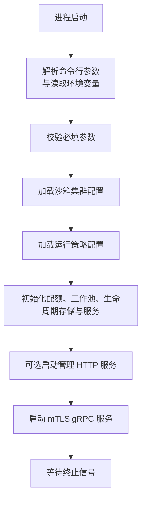
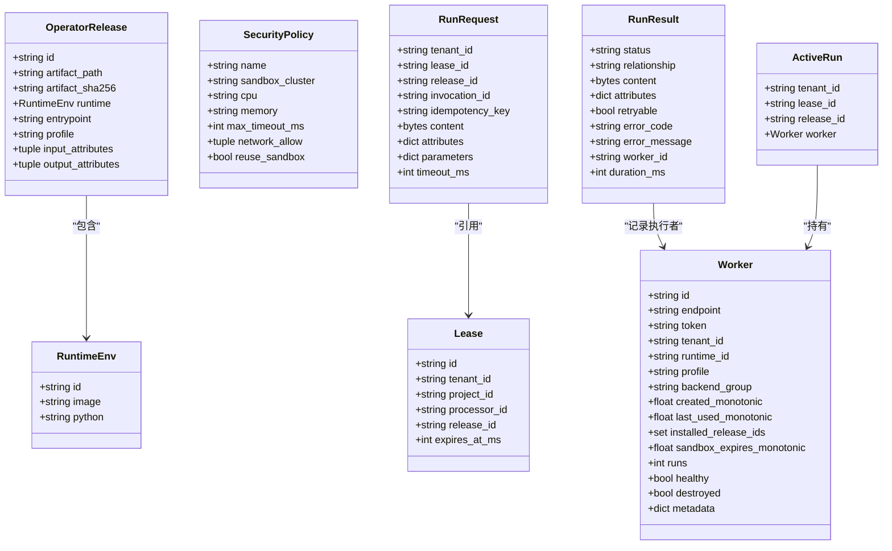
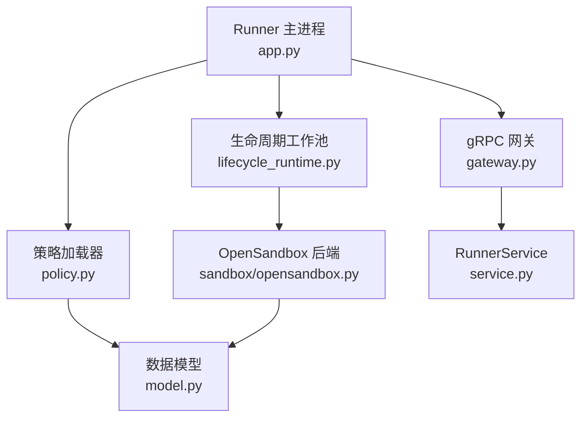
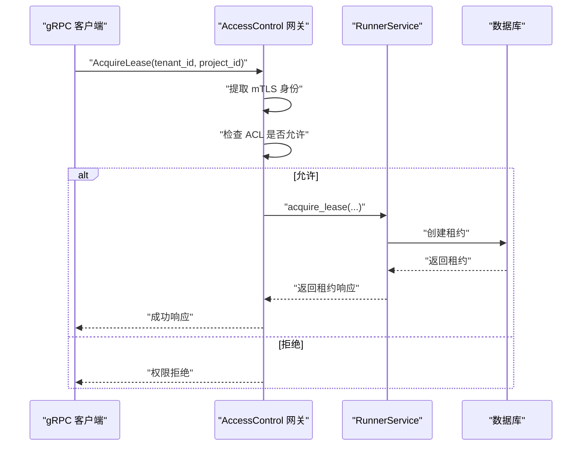
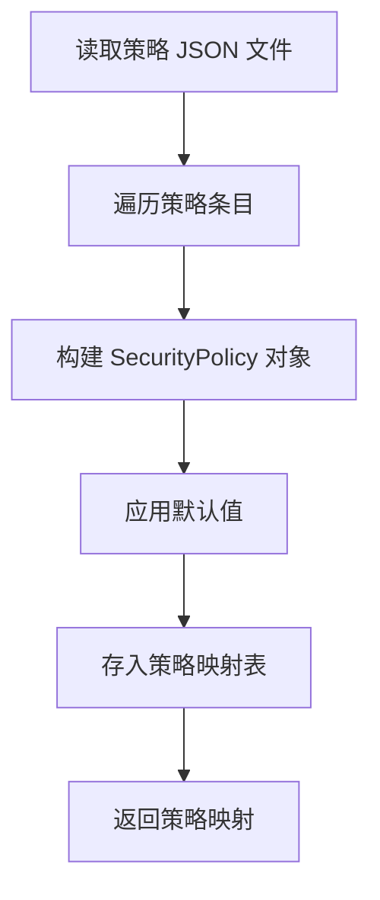
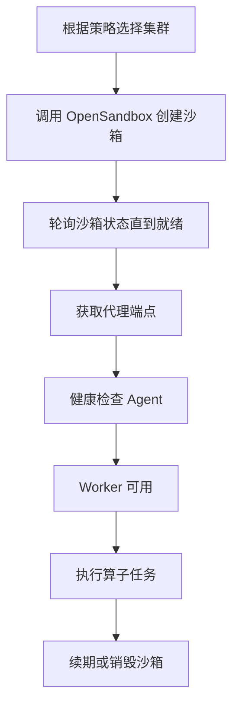
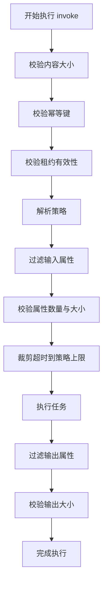
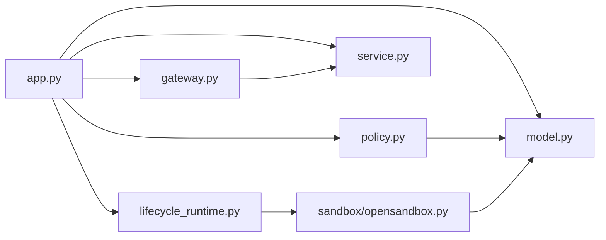

# 配置管理

<cite>
**本文引用的文件**   
- [runner_engine/app.py](file://runner_engine/app.py)
- [runner_engine/gateway.py](file://runner_engine/gateway.py)
- [runner_engine/policy.py](file://runner_engine/policy.py)
- [runner_engine/model.py](file://runner_engine/model.py)
- [runner_engine/service.py](file://runner_engine/service.py)
- [runner_engine/lifecycle_runtime.py](file://runner_engine/lifecycle_runtime.py)
- [runner_engine/sandbox/opensandbox.py](file://runner_engine/sandbox/opensandbox.py)
- [config/acl.json](file://config/acl.json)
- [config/acl.example.json](file://config/acl.example.json)
- [config/opensandbox.json](file://config/opensandbox.json)
- [config/opensandbox.example.json](file://config/opensandbox.example.json)
- [config/policies.json](file://config/policies.json)
</cite>

## 目录
1. [引言](#引言)
2. [项目结构与配置入口](#项目结构与配置入口)
3. [核心配置对象与数据模型](#核心配置对象与数据模型)
4. [架构总览](#架构总览)
5. [详细组件分析](#详细组件分析)
6. [依赖关系分析](#依赖关系分析)
7. [性能与容量配置](#性能与容量配置)
8. [故障排查指南](#故障排查指南)
9. [结论](#结论)
10. [附录：环境模板与最佳实践](#附录环境模板与最佳实践)

## 引言
本文面向 Runner Engine 的配置管理，覆盖以下主题：
- 环境变量、命令行参数与配置文件的作用域和优先级。
- 访问控制列表 ACL 的语法、校验逻辑与权限模型。
- 运行策略 policies 的结构、字段含义与安全规则。
- 沙箱集群 opensandbox 的配置参数与环境隔离机制。
- 配置验证、运行时行为限制、以及当前实现中的热重载能力边界。
- 开发、测试、生产环境的配置建议与示例路径。

Runner Engine 以 gRPC 服务形式对外暴露生命周期与执行接口，并通过 mTLS 认证、ACL 授权、策略约束和沙箱隔离共同构成安全执行环境。

## 项目结构与配置入口
Runner Engine 的主入口负责解析命令行参数和环境变量，加载 ACL、策略和沙箱集群配置，并启动 gRPC 服务与管理端点。

关键入口职责：
- 解析监听地址、目录、数据库连接、策略文件、ACL 文件、沙箱集群文件、所有者标识、mTLS 证书等参数。
- 校验必填项，如数据库连接、所有者标识、TLS 证书、私钥与客户端 CA。
- 加载沙箱集群配置与策略配置。
- 初始化配额、工作池、生命周期存储、服务实例，并启动后台清理任务。
- 根据是否设置管理员令牌决定是否启动管理 HTTP 服务。
- 启动带 mTLS 的 gRPC 服务，并将 ACL 注入网关层进行请求级鉴权。

**图表来源**
- [runner_engine/app.py:26-74](file://runner_engine/app.py#L26-L74)
- [runner_engine/app.py:76-90](file://runner_engine/app.py#L76-L90)
- [runner_engine/app.py:92-154](file://runner_engine/app.py#L92-L154)
- [runner_engine/app.py:156-227](file://runner_engine/app.py#L156-L227)

**章节来源**
- [runner_engine/app.py:26-74](file://runner_engine/app.py#L26-L74)
- [runner_engine/app.py:76-90](file://runner_engine/app.py#L76-L90)
- [runner_engine/app.py:92-154](file://runner_engine/app.py#L92-L154)
- [runner_engine/app.py:156-227](file://runner_engine/app.py#L156-L227)

## 核心配置对象与数据模型
Runner Engine 将策略、租约、请求、结果与工作进程等抽象为不可变数据类，便于在安全边界内传递配置与状态。

重点模型说明：
- RuntimeEnv：描述运行时镜像、Python 版本等基础信息。
- OperatorRelease：描述算子发布物、入口、所属运行时、安全策略名称、输入输出属性白名单。
- SecurityPolicy：描述策略名称、目标沙箱集群、CPU 与内存限制、最大超时时间、网络允许列表、是否复用沙箱。
- Lease：描述租户、项目、处理器、发布物与过期时间。
- RunRequest：描述一次执行请求，包括内容、属性、参数、幂等键与超时。
- RunResult：描述执行结果、重试标志、错误码、耗时与 Worker 标识。
- Worker：描述沙箱工作进程的生命周期元数据、资源归属与使用统计。
- ActiveRun：描述当前活跃执行的上下文。

这些模型是策略加载、服务调用、沙箱创建与执行结果封装的基础。

**图表来源**
- [runner_engine/model.py:7-98](file://runner_engine/model.py#L7-L98)

**章节来源**
- [runner_engine/model.py:7-98](file://runner_engine/model.py#L7-L98)

## 架构总览
Runner Engine 的整体配置驱动流程如下：
- app.py 作为进程入口，负责参数解析、配置加载与组件装配。
- gateway.py 提供 mTLS gRPC 服务，并在每个 RPC 方法中执行身份提取与 ACL 授权。
- policy.py 将 JSON 策略文件转换为 SecurityPolicy 字典。
- lifecycle_runtime.py 扩展工作池与 OpenSandbox 后端，支持运行时生命周期管理与沙箱管理。
- sandbox/opensandbox.py 负责与 OpenSandbox 集群通信，创建、续期、安装、执行、取消与销毁沙箱。

**图表来源**
- [runner_engine/app.py:26-227](file://runner_engine/app.py#L26-L227)
- [runner_engine/gateway.py:12-195](file://runner_engine/gateway.py#L12-L195)
- [runner_engine/policy.py:9-24](file://runner_engine/policy.py#L9-L24)
- [runner_engine/lifecycle_runtime.py:14-397](file://runner_engine/lifecycle_runtime.py#L14-L397)
- [runner_engine/sandbox/opensandbox.py:31-440](file://runner_engine/sandbox/opensandbox.py#L31-L440)
- [runner_engine/model.py:7-98](file://runner_engine/model.py#L7-L98)

## 详细组件分析

### 环境变量与命令行参数
Runner Engine 通过 argparse 定义命令行参数，同时优先从环境变量读取默认值。主要参数与对应环境变量如下：

| 参数 | 环境变量 | 默认值或行为 | 作用 |
|---|---|---|---|
| --listen | RUNNER_LISTEN | 0.0.0.0:9443 | gRPC 服务监听地址 |
| --catalog | RUNNER_CATALOG | ./catalog | 算子发布目录 |
| --db-url | RUNNER_DB_URL | 空字符串 | 数据库连接字符串 |
| --policies | RUNNER_POLICIES | ./config/policies.json | 策略配置文件路径 |
| --acl | RUNNER_ACL | ./config/acl.json | ACL 配置文件路径 |
| --clusters | RUNNER_CLUSTERS | ./config/opensandbox.json | 沙箱集群配置文件路径 |
| --owner-id | RUNNER_OWNER_ID | 空字符串 | 沙箱所有者标识 |
| --tls-cert | RUNNER_TLS_CERT | 空字符串 | TLS 服务器证书 |
| --tls-key | RUNNER_TLS_KEY | 空字符串 | TLS 私钥 |
| --client-ca | RUNNER_CLIENT_CA | 空字符串 | 客户端 CA 证书 |
| RUNNER_ADMIN_TOKEN | 无对应 CLI 参数 | 空字符串 | 是否启用管理 HTTP 服务 |
| RUNNER_ADMIN_LISTEN | 无对应 CLI 参数 | 127.0.0.1 | 管理服务监听地址 |
| RUNNER_ADMIN_PORT | 无对应 CLI 参数 | 9444 | 管理服务监听端口 |

必填校验要求 db-url、owner-id、tls-cert、tls-key、client-ca 非空；否则进程退出。

**章节来源**
- [runner_engine/app.py:26-74](file://runner_engine/app.py#L26-L74)
- [runner_engine/app.py:76-85](file://runner_engine/app.py#L76-L85)
- [runner_engine/app.py:174-210](file://runner_engine/app.py#L174-L210)

### 访问控制列表 ACL
ACL 配置文件结构由 identities 映射组成，键为已认证的身份，值为租户到项目列表的映射。项目列表支持精确匹配与通配符。

ACL 数据结构：
- identities：身份到租户项目的映射。
- 租户下的项目列表：可包含具体项目 ID 或通配符。

ACL 授权逻辑：
- 从 gRPC 上下文中提取 mTLS 对端身份。
- 若身份不存在，直接拒绝。
- 若未指定项目，则只要身份存在该租户即允许。
- 若指定项目，则项目必须在列表中，或列表包含通配符。

**图表来源**
- [runner_engine/gateway.py:33-41](file://runner_engine/gateway.py#L33-L41)
- [runner_engine/gateway.py:81-96](file://runner_engine/gateway.py#L81-L96)
- [runner_engine/gateway.py:102-117](file://runner_engine/gateway.py#L102-L117)

ACL 配置示例文件位于 config/acl.json 与 config/acl.example.json，二者结构一致，用于展示身份、租户与项目的映射关系。

**章节来源**
- [runner_engine/gateway.py:12-30](file://runner_engine/gateway.py#L12-L30)
- [runner_engine/gateway.py:33-41](file://runner_engine/gateway.py#L33-L41)
- [runner_engine/gateway.py:81-96](file://runner_engine/gateway.py#L81-L96)
- [config/acl.json:1-9](file://config/acl.json#L1-L9)
- [config/acl.example.json:1-9](file://config/acl.example.json#L1-L9)

### 运行策略 policies
策略配置文件将策略名称映射到一组运行时约束。策略加载器会将 JSON 转换为 SecurityPolicy 对象，并填充默认值。

策略字段说明：
- sandbox_cluster：目标沙箱集群名称，必须存在于 opensandbox 配置中。
- cpu：容器或沙箱 CPU 限制。
- memory：容器或沙箱内存限制。
- max_timeout_ms：单次执行最大超时时间。
- network_allow：网络允许列表（当前策略模型保留该字段）。
- reuse_sandbox：是否允许复用沙箱。

策略加载过程：
- 读取 JSON 文件。
- 遍历每个策略名称及其配置项。
- 构造 SecurityPolicy 对象，缺失字段使用默认值。
- 返回策略名称到对象的映射。

**图表来源**
- [runner_engine/policy.py:9-24](file://runner_engine/policy.py#L9-L24)
- [runner_engine/model.py:26-35](file://runner_engine/model.py#L26-L35)

策略示例位于 config/policies.json，包含 standard 与 hardened 两种策略，分别指向不同沙箱集群与资源限制。

**章节来源**
- [runner_engine/policy.py:9-24](file://runner_engine/policy.py#L9-L24)
- [runner_engine/model.py:26-35](file://runner_engine/model.py#L26-L35)
- [config/policies.json:1-19](file://config/policies.json#L1-L19)

### 沙箱集群 opensandbox
沙箱集群配置文件定义多个后端集群，每个集群包含 URL 与 API Key。Runner Engine 通过 OpenSandboxBackend 与这些集群交互，创建、查询、续期、销毁沙箱。

集群配置字段：
- url：OpenSandbox 服务地址。
- api_key：访问 OpenSandbox 的密钥头。

OpenSandboxBackend 行为要点：
- 根据策略中的 sandbox_cluster 选择集群。
- 创建沙箱时注入运行环境变量、资源限制、入口命令与标签。
- 等待沙箱进入就绪状态，再获取代理端点。
- 健康检查通过后认为 Worker 可用。
- 支持按 owner_id 与 managed-by 标签清理受管沙箱。

**图表来源**
- [runner_engine/sandbox/opensandbox.py:38-59](file://runner_engine/sandbox/opensandbox.py#L38-L59)
- [runner_engine/sandbox/opensandbox.py:141-189](file://runner_engine/sandbox/opensandbox.py#L141-L189)
- [runner_engine/sandbox/opensandbox.py:192-290](file://runner_engine/sandbox/opensandbox.py#L192-L290)
- [runner_engine/sandbox/opensandbox.py:304-322](file://runner_engine/sandbox/opensandbox.py#L304-L322)
- [runner_engine/sandbox/opensandbox.py:389-439](file://runner_engine/sandbox/opensandbox.py#L389-L439)

集群示例位于 config/opensandbox.json 与 config/opensandbox.example.json，分别展示 gvisor 与 kata 两个集群的配置方式。

**章节来源**
- [runner_engine/sandbox/opensandbox.py:31-59](file://runner_engine/sandbox/opensandbox.py#L31-L59)
- [runner_engine/sandbox/opensandbox.py:141-189](file://runner_engine/sandbox/opensandbox.py#L141-L189)
- [runner_engine/sandbox/opensandbox.py:192-290](file://runner_engine/sandbox/opensandbox.py#L192-L290)
- [runner_engine/sandbox/opensandbox.py:304-322](file://runner_engine/sandbox/opensandbox.py#L304-L322)
- [runner_engine/sandbox/opensandbox.py:389-439](file://runner_engine/sandbox/opensandbox.py#L389-L439)
- [config/opensandbox.json:1-11](file://config/opensandbox.json#L1-L11)
- [config/opensandbox.example.json:1-11](file://config/opensandbox.example.json#L1-L11)

### 配置验证与运行时限制
Runner Engine 在多处进行配置与请求校验：

- 启动阶段必填参数校验：缺少数据库连接、所有者标识或 TLS 相关证书会直接退出。
- 策略校验：如果算子发布物的 profile 不在已加载策略中，会抛出未知策略错误。
- 属性校验：输入属性会被限制为发布物声明的 input_attributes，且属性数量、类型与字节大小有限制。
- 超时限制：请求超时会被裁剪到策略定义的 max_timeout_ms。
- 内容大小限制：输入内容与输出内容均限制在固定上限。
- 幂等性校验：执行请求必须携带幂等键。
- 沙箱集群校验：如果策略引用的集群不存在，会抛出未知集群错误。

**图表来源**
- [runner_engine/service.py:188-235](file://runner_engine/service.py#L188-L235)
- [runner_engine/service.py:300-310](file://runner_engine/service.py#L300-L310)
- [runner_engine/sandbox/opensandbox.py:52-59](file://runner_engine/sandbox/opensandbox.py#L52-L59)

**章节来源**
- [runner_engine/app.py:76-85](file://runner_engine/app.py#L76-L85)
- [runner_engine/service.py:188-235](file://runner_engine/service.py#L188-L235)
- [runner_engine/service.py:300-310](file://runner_engine/service.py#L300-L310)
- [runner_engine/sandbox/opensandbox.py:52-59](file://runner_engine/sandbox/opensandbox.py#L52-L59)

### 热重载与配置迁移
当前实现中：
- 策略、ACL、集群配置均在进程启动时加载。
- 没有显式的热重载机制。
- 运行时可通过生命周期控制器对运行时镜像进行退役与恢复操作，但这属于运行时状态管理，不是配置文件的动态热更新。

因此，配置变更通常需要重启 Runner Engine 进程才能生效。对于需要高可用的部署，建议使用滚动重启配合负载均衡，确保旧进程优雅退出、新进程加载新配置后接管流量。

**章节来源**
- [runner_engine/app.py:87-90](file://runner_engine/app.py#L87-L90)
- [runner_engine/lifecycle_runtime.py:302-359](file://runner_engine/lifecycle_runtime.py#L302-L359)

## 依赖关系分析
Runner Engine 的配置依赖关系如下：
- app.py 依赖 gateway.py、policy.py、lifecycle_runtime.py、service.py、model.py。
- gateway.py 依赖 service.py 与 model.py。
- policy.py 依赖 model.py。
- lifecycle_runtime.py 依赖 sandbox/opensandbox.py 与 model.py。
- sandbox/opensandbox.py 依赖 model.py 与 worker HTTP 调用工具。

**图表来源**
- [runner_engine/app.py:9-21](file://runner_engine/app.py#L9-L21)
- [runner_engine/gateway.py:7-10](file://runner_engine/gateway.py#L7-L10)
- [runner_engine/policy.py:6-6](file://runner_engine/policy.py#L6-L6)
- [runner_engine/lifecycle_runtime.py:8-11](file://runner_engine/lifecycle_runtime.py#L8-L11)
- [runner_engine/sandbox/opensandbox.py:16-18](file://runner_engine/sandbox/opensandbox.py#L16-L18)

**章节来源**
- [runner_engine/app.py:9-21](file://runner_engine/app.py#L9-L21)
- [runner_engine/gateway.py:7-10](file://runner_engine/gateway.py#L7-L10)
- [runner_engine/policy.py:6-6](file://runner_engine/policy.py#L6-L6)
- [runner_engine/lifecycle_runtime.py:8-11](file://runner_engine/lifecycle_runtime.py#L8-L11)
- [runner_engine/sandbox/opensandbox.py:16-18](file://runner_engine/sandbox/opensandbox.py#L16-L18)

## 性能与容量配置
Runner Engine 提供多组环境变量用于控制并发、资源与清理行为：

| 环境变量 | 默认值 | 作用 |
|---|---:|---|
| RUNNER_MAX_CREATING | 8 | 最大正在创建的沙箱数 |
| RUNNER_MAX_LIVE | 64 | 最大存活沙箱总数 |
| RUNNER_MAX_LIVE_PER_TENANT | 16 | 每个租户最大存活沙箱数 |
| RUNNER_WORKER_IDLE_SECONDS | 600 | Worker 空闲回收阈值 |
| RUNNER_SANDBOX_ORPHAN_TTL_SECONDS | 3600 | 沙箱孤儿 TTL |
| RUNNER_SANDBOX_RENEW_BEFORE_SECONDS | 900 | 提前续期时间 |
| RUNNER_MAX_RELEASES_PER_SANDBOX | 256 | 单个沙箱最大安装发布数 |
| RUNNER_LEASE_TTL_MS | 15 分钟 | 租约 TTL |
| RUNNER_IDEMPOTENCY_RETENTION_MS | 7 天 | 幂等记录保留时间 |
| RUNNER_RUN_RETENTION_MS | 90 天 | 执行记录保留时间 |
| RUNNER_REAPER_INTERVAL_SECONDS | 30 | 后台清理任务间隔 |

这些参数影响：
- 并发创建与存活沙箱数量。
- Worker 生命周期与资源回收节奏。
- 租约与执行记录的保留策略。
- 后台维护任务的频率。

**章节来源**
- [runner_engine/app.py:97-153](file://runner_engine/app.py#L97-L153)
- [runner_engine/app.py:162-168](file://runner_engine/app.py#L162-L168)
- [runner_engine/service.py:117-138](file://runner_engine/service.py#L117-L138)

## 故障排查指南
常见配置相关问题与定位思路：

- 启动失败且提示必填参数缺失：
  - 检查 RUNNER_DB_URL、RUNNER_OWNER_ID、RUNNER_TLS_CERT、RUNNER_TLS_KEY、RUNNER_CLIENT_CA 是否设置。
  - 确认命令行参数与环境变量一致。

- gRPC 调用返回未认证或权限拒绝：
  - 检查 mTLS 证书链是否正确。
  - 检查 ACL 配置中是否包含对端身份，以及该身份是否被允许访问目标租户与项目。

- 执行时报未知安全策略：
  - 检查算子发布物的 profile 是否在 policies.json 中定义。
  - 检查策略名称是否与发布物声明一致。

- 沙箱创建失败或无法就绪：
  - 检查策略中的 sandbox_cluster 是否存在于 opensandbox.json。
  - 检查 OpenSandbox 集群 URL 与 API Key 是否正确。
  - 查看沙箱状态与代理健康检查日志。

- 执行超时或被截断：
  - 检查请求超时是否超过策略的 max_timeout_ms。
  - 检查输入输出内容是否超过大小限制。

- 后台清理异常：
  - 关注 Runner 后台维护线程日志，确认数据库连接、租约清理与执行记录清理是否正常。

**章节来源**
- [runner_engine/app.py:76-85](file://runner_engine/app.py#L76-L85)
- [runner_engine/gateway.py:67-79](file://runner_engine/gateway.py#L67-L79)
- [runner_engine/service.py:154-167](file://runner_engine/service.py#L154-L167)
- [runner_engine/service.py:188-235](file://runner_engine/service.py#L188-L235)
- [runner_engine/sandbox/opensandbox.py:52-59](file://runner_engine/sandbox/opensandbox.py#L52-L59)
- [runner_engine/sandbox/opensandbox.py:192-290](file://runner_engine/sandbox/opensandbox.py#L192-L290)
- [runner_engine/service.py:117-138](file://runner_engine/service.py#L117-L138)

## 结论
Runner Engine 的配置体系围绕三个核心文件展开：ACL、策略与沙箱集群配置。它们分别控制访问权限、执行安全约束与底层沙箱资源。进程启动时对必填参数进行严格校验，并在执行路径中对属性、超时、内容大小与策略一致性进行二次校验。沙箱集群通过 OpenSandbox 后端进行隔离与资源管理。当前实现不支持配置热重载，推荐通过滚动重启完成配置迁移。

## 附录：环境模板与最佳实践

### 配置文件结构说明
- ACL 配置：
  - 顶层 identities 映射身份到租户项目。
  - 租户下项目列表支持精确项目 ID 与通配符。
- 策略配置：
  - 每个策略名称对应一组运行时约束。
  - 必须包含 sandbox_cluster、cpu、memory、max_timeout_ms、network_allow、reuse_sandbox。
- 沙箱集群配置：
  - 每个集群名称对应 url 与 api_key。
  - 策略中的 sandbox_cluster 必须与集群名称一致。

### 配置最佳实践
- 使用环境变量注入敏感信息，如 API Key、TLS 证书路径、数据库连接串。
- 将 ACL 与策略分离，便于不同团队独立维护。
- 为不同环境准备独立的策略与集群配置，避免跨环境误用。
- 在生产环境中启用 mTLS，并确保客户端 CA 正确配置。
- 合理设置 RUNNER_MAX_LIVE 与 RUNNER_MAX_LIVE_PER_TENANT，防止资源耗尽。
- 将 RUNNER_REAPER_INTERVAL_SECONDS 设置为较短间隔，保证后台清理及时。
- 使用 hardened 策略处理高风险任务，standard 策略处理常规任务。

### 常见配置场景
- 开发环境：
  - 使用本地或最小化 OpenSandbox 集群。
  - 放宽部分限制以便调试，但仍需保持基本安全约束。
- 测试环境：
  - 使用独立集群与策略，模拟生产隔离。
  - 开启完整 ACL 校验，验证权限边界。
- 生产环境：
  - 严格配置 mTLS、ACL 与策略。
  - 使用 hardened 策略处理敏感任务。
  - 配置合理的资源上限与清理策略。

### 配置模板与示例路径
- ACL 示例：config/acl.example.json
- ACL 实际配置：config/acl.json
- 策略示例：config/policies.json
- 沙箱集群示例：config/opensandbox.example.json
- 沙箱集群实际配置：config/opensandbox.json

**章节来源**
- [config/acl.example.json:1-9](file://config/acl.example.json#L1-L9)
- [config/acl.json:1-9](file://config/acl.json#L1-L9)
- [config/policies.json:1-19](file://config/policies.json#L1-L19)
- [config/opensandbox.example.json:1-11](file://config/opensandbox.example.json#L1-L11)
- [config/opensandbox.json:1-11](file://config/opensandbox.json#L1-L11)