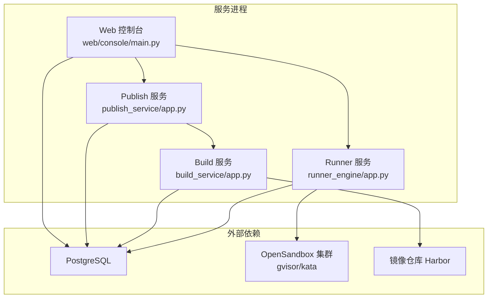
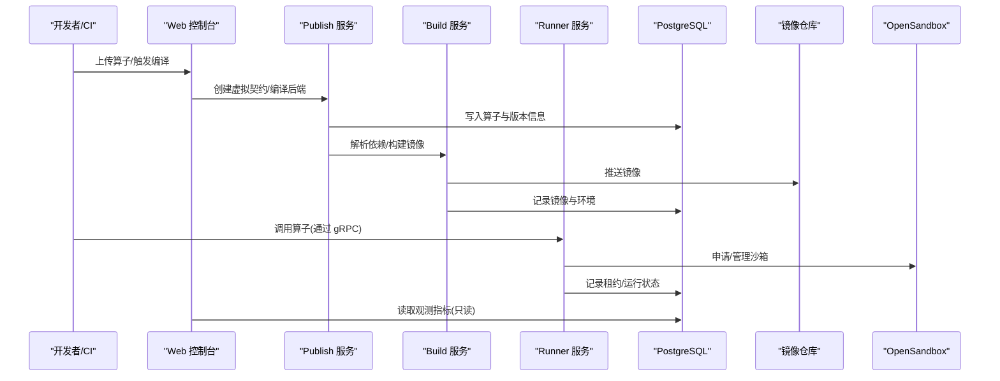
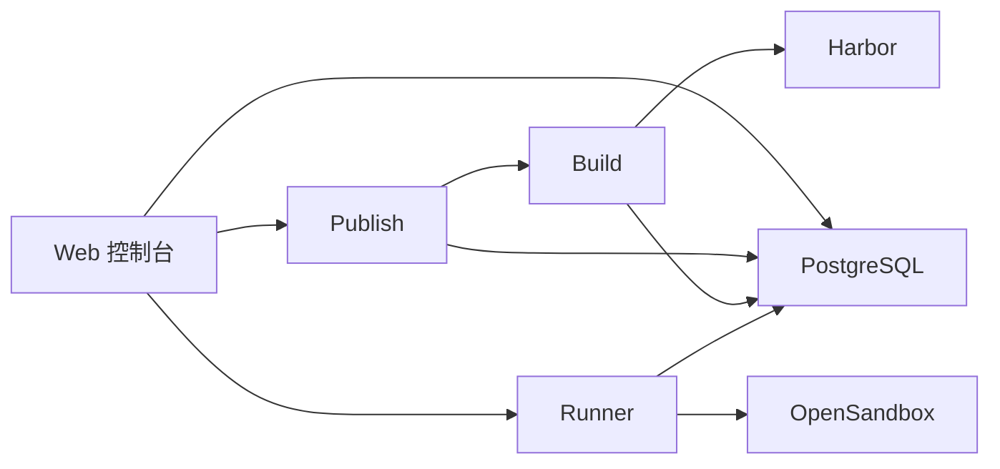

# 快速开始

<cite>
**本文引用的文件**   
- [pyproject.toml](file://pyproject.toml)
- [runner_engine/app.py](file://runner_engine/app.py)
- [build_service/app.py](file://build_service/app.py)
- [publish_service/app.py](file://publish_service/app.py)
- [config/acl.example.json](file://config/acl.example.json)
- [config/opensandbox.example.json](file://config/opensandbox.example.json)
- [config/policies.json](file://config/policies.json)
- [sql/publish_schema.sql](file://sql/publish_schema.sql)
- [runner_engine/lifecycle_runtime.py](file://runner_engine/lifecycle_runtime.py)
- [runner_engine/policy.py](file://runner_engine/policy.py)
- [web/console/main.py](file://web/console/main.py)
- [web/admin/main.py](file://web/admin/main.py)
- [web/console/settings.py](file://web/console/settings.py)
- [web/observe/database.py](file://web/observe/database.py)
- [web/observe/settings.py](file://web/observe/settings.py)
- [web/console/sql_schemas.py](file://web/console/sql_schemas.py)
</cite>

## 目录
1. [简介](#简介)
2. [项目结构](#项目结构)
3. [核心组件](#核心组件)
4. [架构总览](#架构总览)
5. [详细组件分析](#详细组件分析)
6. [依赖关系分析](#依赖关系分析)
7. [性能与容量规划](#性能与容量规划)
8. [故障排查指南](#故障排查指南)
9. [结论](#结论)
10. [附录：环境变量与端口速查](#附录环境变量与端口速查)

## 简介
本快速开始指南面向首次部署 Runner Engine 的用户，目标是帮助你在最短时间内完成环境准备、数据库初始化、配置准备、服务启动与基本验证。文档同时提供 Docker Compose 与手动部署两种路径，并给出常见问题与排错建议。

Runner Engine 由以下关键服务组成：
- Runner 运行时服务：负责沙箱生命周期、工作池、策略与配额控制。
- Build Service：构建 Python 运行环境与镜像解析。
- Publish Service：算子发布、编译与后端产物管理。
- Web 控制台：统一入口，聚合发布、观测与管理界面。

## 项目结构
仓库采用多服务组织方式，核心可执行入口通过脚本命令暴露；配置文件集中在 config 目录；SQL 定义位于 sql 目录；Web 前端与后端聚合在 web 目录。

图表来源
- [runner_engine/app.py:26-226](file://runner_engine/app.py#L26-L226)
- [build_service/app.py:106-212](file://build_service/app.py#L106-L212)
- [publish_service/app.py:135-378](file://publish_service/app.py#L135-L378)
- [web/console/main.py:91-115](file://web/console/main.py#L91-L115)

章节来源
- [pyproject.toml:23-28](file://pyproject.toml#L23-L28)
- [runner_engine/app.py:26-226](file://runner_engine/app.py#L26-L226)
- [build_service/app.py:106-212](file://build_service/app.py#L106-L212)
- [publish_service/app.py:135-378](file://publish_service/app.py#L135-L378)
- [web/console/main.py:91-115](file://web/console/main.py#L91-L115)

## 核心组件
- Runner 服务
  - 负责 gRPC 接口、ACL 鉴权、策略加载、配额限制、沙箱池与生命周期管理。
  - 关键参数包括监听地址、数据库连接、策略文件、ACL 文件、OpenSandbox 集群配置、TLS 证书等。
- Build 服务
  - 基于 FastAPI + Uvicorn 提供 HTTP API，负责解析 Python 依赖、生成镜像并写入数据库。
  - 需要 PostgreSQL 与镜像仓库（Harbor）配置。
- Publish 服务
  - 提供算子虚拟契约、后端编译与发布能力，依赖 Build 服务与 PostgreSQL。
- Web 控制台
  - 统一路由聚合发布、观测与管理页面，支持只读观测数据库与独立的管理元数据库。

章节来源
- [runner_engine/app.py:26-226](file://runner_engine/app.py#L26-L226)
- [build_service/app.py:106-212](file://build_service/app.py#L106-L212)
- [publish_service/app.py:135-378](file://publish_service/app.py#L135-L378)
- [web/console/main.py:91-115](file://web/console/main.py#L91-L115)

## 架构总览
下图展示服务间调用关系与数据流向。Runner 通过 OpenSandbox 管理沙箱，Build/Publish 通过 PostgreSQL 持久化状态，Web 控制台聚合各服务的能力并提供统一访问入口。

图表来源
- [publish_service/app.py:201-277](file://publish_service/app.py#L201-L277)
- [build_service/app.py:140-179](file://build_service/app.py#L140-L179)
- [runner_engine/app.py:212-226](file://runner_engine/app.py#L212-L226)
- [runner_engine/lifecycle_runtime.py:123-184](file://runner_engine/lifecycle_runtime.py#L123-L184)

## 详细组件分析

### 环境准备
- 系统要求
  - Python >= 3.11
  - PostgreSQL（用于 Runner、Build、Publish 以及观测只读连接）
  - OpenSandbox 集群（gvisor/kata），供 Runner 调度沙箱
  - 镜像仓库（Harbor），供 Build 服务推送镜像
- 依赖安装
  - 使用 pyproject.toml 的可选依赖组：grpc、postgres、build、publish、dev
  - 常用命令示例（根据实际包管理器替换）：
    - pip install ".[grpc,postgres,build,publish]"
    - pip install ".[dev]"

章节来源
- [pyproject.toml:5-19](file://pyproject.toml#L5-L19)

### 数据库初始化
- 目标
  - 为 Publish 服务创建 schema 与表结构
- 步骤
  - 连接到 PostgreSQL，执行 sql/publish_schema.sql
  - 该脚本会创建 publish schema 及 operators、virtual_contract_versions、backend_variants、publish_jobs 等表
- 注意事项
  - 确保数据库角色具备 DDL 权限
  - 生产环境建议将 schema 命名与业务隔离

章节来源
- [sql/publish_schema.sql:1-68](file://sql/publish_schema.sql#L1-L68)

### 配置文件准备
- ACL 配置
  - 参考 config/acl.example.json，定义身份与租户/项目映射
  - Runner 启动时通过 --acl 或 RUNNER_ACL 指定
- 策略配置
  - 参考 config/policies.json，定义标准与加固策略（CPU、内存、超时、网络允许、是否复用沙箱等）
  - Runner 启动时通过 --policies 或 RUNNER_POLICIES 指定
- OpenSandbox 集群配置
  - 参考 config/opensandbox.example.json，配置 gvisor/kata 的 URL 与 API Key
  - Runner 启动时通过 --clusters 或 RUNNER_CLUSTERS 指定

章节来源
- [config/acl.example.json:1-9](file://config/acl.example.json#L1-L9)
- [config/policies.json:1-19](file://config/policies.json#L1-L19)
- [config/opensandbox.example.json:1-11](file://config/opensandbox.example.json#L1-L11)
- [runner_engine/app.py:41-57](file://runner_engine/app.py#L41-L57)
- [runner_engine/policy.py:9-24](file://runner_engine/policy.py#L9-L24)

### 服务启动顺序与配置
推荐启动顺序：
1. PostgreSQL
2. OpenSandbox（gvisor/kata）
3. 镜像仓库（Harbor）
4. Build 服务
5. Publish 服务
6. Runner 服务
7. Web 控制台

#### Runner 服务
- 必需参数
  - --db-url / RUNNER_DB_URL
  - --owner-id / RUNNER_OWNER_ID
  - --tls-cert / RUNNER_TLS_CERT
  - --tls-key / RUNNER_TLS_KEY
  - --client-ca / RUNNER_CLIENT_CA
- 可选参数
  - --listen / RUNNER_LISTEN（默认 0.0.0.0:9443）
  - --catalog / RUNNER_CATALOG（默认 ./catalog）
  - --policies / RUNNER_POLICIES（默认 ./config/policies.json）
  - --acl / RUNNER_ACL（默认 ./config/acl.json）
  - --clusters / RUNNER_CLUSTERS（默认 ./config/opensandbox.json）
- 行为要点
  - 启动后加载策略、ACL、OpenSandbox 集群
  - 初始化生命周期存储、配额与工作池
  - 可选启用 Admin HTTP（RUNNER_ADMIN_TOKEN）
  - 启动 gRPC 服务并等待终止信号

章节来源
- [runner_engine/app.py:26-226](file://runner_engine/app.py#L26-L226)

#### Build 服务
- 必需环境变量
  - BUILD_DATABASE_URL
  - BUILD_RUNNER_BASE_IMAGE
  - BUILD_REGISTRY_REPO
- 常用参数
  - --listen-host / BUILD_LISTEN_HOST（默认 127.0.0.1）
  - --listen-port / BUILD_LISTEN_PORT（默认 9088）
  - --log-level / BUILD_LOG_LEVEL
- 健康检查
  - GET /health 返回 ok、版本、运行时生命周期与 Harbor 配置状态

章节来源
- [build_service/app.py:65-99](file://build_service/app.py#L65-L99)
- [build_service/app.py:128-138](file://build_service/app.py#L128-L138)
- [build_service/app.py:187-212](file://build_service/app.py#L187-L212)

#### Publish 服务
- 必需环境变量
  - PUBLISH_WORKSPACE_ROOT
  - PUBLISH_CATALOG_ROOT
  - PUBLISH_DATABASE_URL
- 常用参数
  - --listen-host / PUBLISH_LISTEN_HOST（默认 127.0.0.1）
  - --listen-port / PUBLISH_LISTEN_PORT（默认 9090）
  - --log-level / PUBLISH_LOG_LEVEL
- 健康检查
  - GET /health 返回 ok、版本、API 能力与管理员配置状态

章节来源
- [publish_service/app.py:50-128](file://publish_service/app.py#L50-L128)
- [publish_service/app.py:157-170](file://publish_service/app.py#L157-L170)
- [publish_service/app.py:353-378](file://publish_service/app.py#L353-L378)

#### Web 控制台
- 功能
  - 聚合发布、观测与管理页面
  - 支持只读观测数据库与独立的管理元数据库
- 常用参数
  - --host（默认 127.0.0.1）
  - --port（默认 9095）
- 安全提示
  - 非回环地址且未认证访问需显式开启 CONSOLE_ALLOW_REMOTE_NO_AUTH
  - 必须设置 CONSOLE_PUBLIC_ORIGIN 以启用同源保护

章节来源
- [web/console/main.py:118-142](file://web/console/main.py#L118-L142)
- [web/console/settings.py:61-84](file://web/console/settings.py#L61-L84)

### Docker Compose 部署方式
- 说明
  - 建议使用容器编排工具（如 Docker Compose）拉起 PostgreSQL、OpenSandbox、Harbor、Build、Publish、Runner 与 Web 控制台
  - 将必要的配置文件挂载到容器内，并通过环境变量注入数据库连接、镜像仓库地址、OpenSandbox 地址等
- 关键步骤
  - 准备配置文件：acl.json、opensandbox.json、policies.json
  - 初始化数据库：执行 sql/publish_schema.sql
  - 启动服务：按顺序启动 Build、Publish、Runner、Web 控制台
  - 暴露端口：Runner gRPC（默认 9443）、Build HTTP（默认 9088）、Publish HTTP（默认 9090）、Web 控制台（默认 9095）

章节来源
- [runner_engine/app.py:26-226](file://runner_engine/app.py#L26-L226)
- [build_service/app.py:187-212](file://build_service/app.py#L187-L212)
- [publish_service/app.py:353-378](file://publish_service/app.py#L353-L378)
- [web/console/main.py:118-142](file://web/console/main.py#L118-L142)

### 手动部署方式
- 步骤
  - 安装 Python 与依赖：pip install ".[grpc,postgres,build,publish]"
  - 初始化 PostgreSQL：执行 sql/publish_schema.sql
  - 准备配置文件：复制并编辑 acl.json、opensandbox.json、policies.json
  - 启动 Build 服务：python -m build_service.app（或使用 mpr-build-service）
  - 启动 Publish 服务：python -m publish_service.app（或使用 mpr-publish-service）
  - 启动 Runner 服务：python -m runner_engine.app（或使用 mpr-runner），传入必需参数
  - 启动 Web 控制台：python -m web.console.main（或使用统一入口）

章节来源
- [pyproject.toml:23-28](file://pyproject.toml#L23-L28)
- [sql/publish_schema.sql:1-68](file://sql/publish_schema.sql#L1-L68)
- [runner_engine/app.py:26-226](file://runner_engine/app.py#L26-L226)
- [build_service/app.py:187-212](file://build_service/app.py#L187-L212)
- [publish_service/app.py:353-378](file://publish_service/app.py#L353-L378)
- [web/console/main.py:118-142](file://web/console/main.py#L118-L142)

### 基本验证
- 健康检查
  - Build 服务：GET http://127.0.0.1:9088/health
  - Publish 服务：GET http://127.0.0.1:9090/health
- 简单测试
  - 通过 Web 控制台访问 /console 与 /admin 页面
  - 在 Publish 服务中创建算子虚拟契约并编译后端
  - 在 Runner 服务中调用算子（gRPC），观察沙箱分配与运行状态

章节来源
- [build_service/app.py:128-138](file://build_service/app.py#L128-L138)
- [publish_service/app.py:157-170](file://publish_service/app.py#L157-L170)
- [web/console/main.py:91-115](file://web/console/main.py#L91-L115)

## 依赖关系分析
- Runner 依赖
  - PostgreSQL（生命周期存储、租约与运行状态）
  - OpenSandbox（gvisor/kata）用于沙箱调度
  - ACL 与策略文件用于鉴权与资源限制
- Build 依赖
  - PostgreSQL（构建任务与环境元数据）
  - Harbor（镜像推送）
- Publish 依赖
  - PostgreSQL（算子与版本信息）
  - Build 服务（依赖解析与镜像构建）
- Web 控制台依赖
  - Publish 服务（发布流程）
  - Runner 服务（生命周期与观测）
  - PostgreSQL（只读观测与元数据）

图表来源
- [runner_engine/app.py:212-226](file://runner_engine/app.py#L212-L226)
- [build_service/app.py:65-99](file://build_service/app.py#L65-L99)
- [publish_service/app.py:50-128](file://publish_service/app.py#L50-L128)
- [web/console/main.py:91-115](file://web/console/main.py#L91-L115)

章节来源
- [runner_engine/app.py:26-226](file://runner_engine/app.py#L26-L226)
- [build_service/app.py:65-99](file://build_service/app.py#L65-L99)
- [publish_service/app.py:50-128](file://publish_service/app.py#L50-L128)
- [web/console/main.py:91-115](file://web/console/main.py#L91-L115)

## 性能与容量规划
- Runner 工作池与配额
  - 可通过环境变量调整最大创建数、最大存活数、每租户最大存活数
  - 空闲回收与孤儿清理时间可通过环境变量配置
- 策略与资源
  - 不同策略可配置 CPU、内存、超时与网络允许列表
  - 加固策略通常禁用沙箱复用以提升隔离性
- 观测只读连接
  - 观测模块强制只读事务与语句超时，避免影响主库性能

章节来源
- [runner_engine/app.py:97-129](file://runner_engine/app.py#L97-L129)
- [config/policies.json:1-19](file://config/policies.json#L1-L19)
- [web/observe/database.py:141-154](file://web/observe/database.py#L141-L154)

## 故障排查指南
- Runner 无法启动
  - 检查必需参数：db-url、owner-id、tls-cert、tls-key、client-ca
  - 确认 ACL、策略与 OpenSandbox 配置文件路径正确
  - 查看日志中关于 Admin HTTP 是否启用的警告
- Build 服务不可用
  - 检查 BUILD_DATABASE_URL、BUILD_RUNNER_BASE_IMAGE、BUILD_REGISTRY_REPO 是否已设置
  - 确认 Harbor 可达且凭据有效
- Publish 服务不可用
  - 检查 PUBLISH_WORKSPACE_ROOT、PUBLISH_CATALOG_ROOT、PUBLISH_DATABASE_URL
  - 确认 Build 服务地址 PUBLISH_BUILD_SERVICE_URL 可达
- Web 控制台访问异常
  - 非回环地址访问需设置 CONSOLE_ALLOW_REMOTE_NO_AUTH=1 与 CONSOLE_PUBLIC_ORIGIN
  - 管理端点需同源请求与 JSON Content-Type
- 观测只读连接失败
  - 检查 OBS_*_DB_URL 与 OBS_*_DB_SCHEMA 配置
  - 确认 PostgreSQL 角色具备 SELECT 权限且会话设置为只读

章节来源
- [runner_engine/app.py:76-85](file://runner_engine/app.py#L76-L85)
- [runner_engine/app.py:174-210](file://runner_engine/app.py#L174-L210)
- [build_service/app.py:65-77](file://build_service/app.py#L65-L77)
- [publish_service/app.py:50-69](file://publish_service/app.py#L50-L69)
- [web/console/main.py:125-140](file://web/console/main.py#L125-L140)
- [web/observe/database.py:141-154](file://web/observe/database.py#L141-L154)

## 结论
通过遵循本快速开始指南，你可以从零开始完成 Runner Engine 的环境准备、数据库初始化、配置准备、服务启动与基本验证。建议在生产环境中使用容器编排工具统一管理依赖与服务，严格配置 ACL、策略与 TLS，并对观测连接实施只读保护。

## 附录：环境变量与端口速查
- Runner
  - 端口：9443（gRPC），9444（Admin HTTP，可选）
  - 关键变量：RUNNER_DB_URL、RUNNER_OWNER_ID、RUNNER_TLS_CERT、RUNNER_TLS_KEY、RUNNER_CLIENT_CA、RUNNER_POLICIES、RUNNER_ACL、RUNNER_CLUSTERS、RUNNER_ADMIN_TOKEN
- Build
  - 端口：9088（HTTP）
  - 关键变量：BUILD_DATABASE_URL、BUILD_RUNNER_BASE_IMAGE、BUILD_REGISTRY_REPO、BUILD_LISTEN_HOST、BUILD_LISTEN_PORT、BUILD_LOG_LEVEL
- Publish
  - 端口：9090（HTTP）
  - 关键变量：PUBLISH_WORKSPACE_ROOT、PUBLISH_CATALOG_ROOT、PUBLISH_DATABASE_URL、PUBLISH_BUILD_SERVICE_URL、PUBLISH_LISTEN_HOST、PUBLISH_LISTEN_PORT、PUBLISH_LOG_LEVEL
- Web 控制台
  - 端口：9095（HTTP）
  - 关键变量：CONSOLE_ALLOW_REMOTE_NO_AUTH、CONSOLE_PUBLIC_ORIGIN、ADMIN_DB_URL、OBS_*_DB_URL、OBS_*_DB_SCHEMA

章节来源
- [runner_engine/app.py:26-226](file://runner_engine/app.py#L26-L226)
- [build_service/app.py:187-212](file://build_service/app.py#L187-L212)
- [publish_service/app.py:353-378](file://publish_service/app.py#L353-L378)
- [web/console/main.py:118-142](file://web/console/main.py#L118-L142)