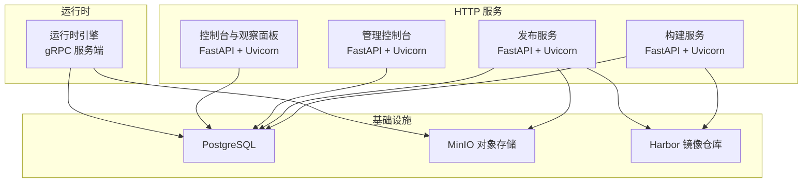
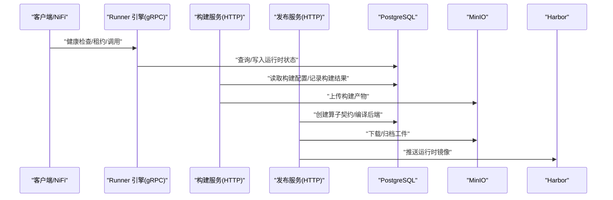
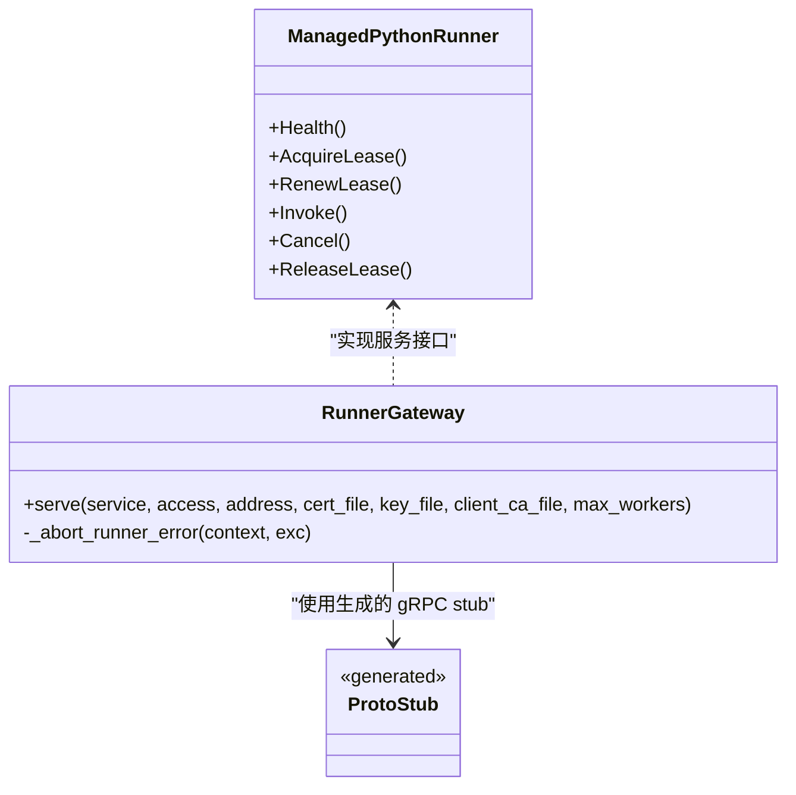
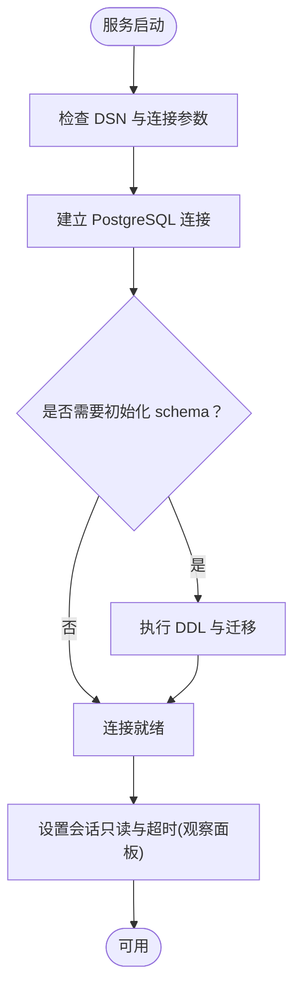
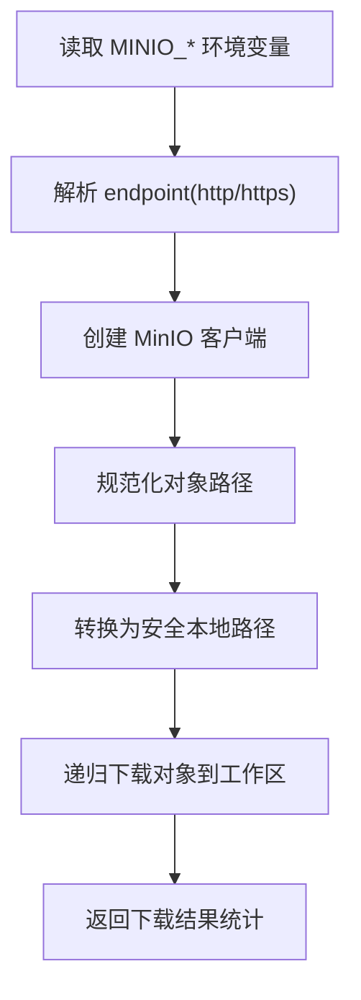
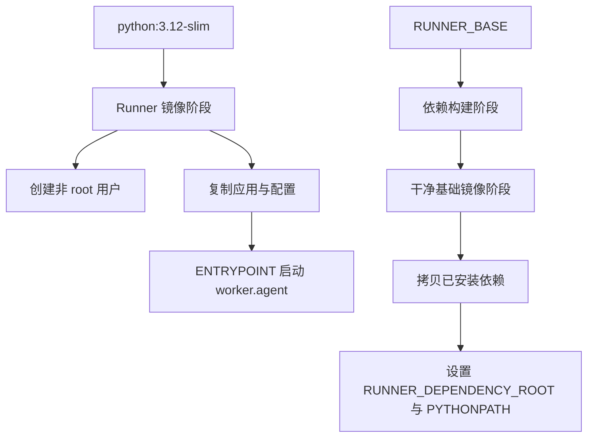
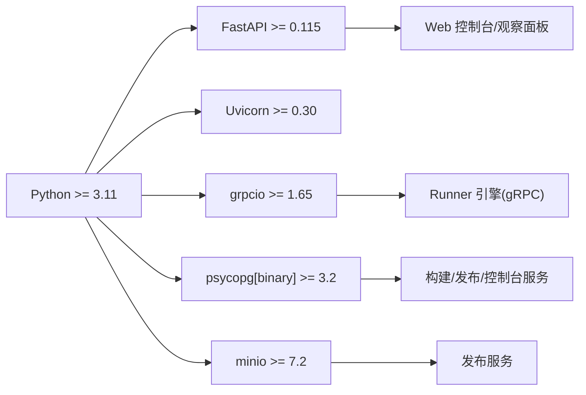

# 技术栈

<cite>
**本文引用的文件**   
- [pyproject.toml](file://pyproject.toml)
- [requirements.lock](file://requirements.lock)
- [web/requirements.txt](file://web/requirements.txt)
- [web/console/requirements.txt](file://web/console/requirements.txt)
- [web/observe/requirements.txt](file://web/observe/requirements.txt)
- [web/observe/requirements-postgres.txt](file://web/observe/requirements-postgres.txt)
- [proto/runner.proto](file://proto/runner.proto)
- [scripts/generate_proto.py](file://scripts/generate_proto.py)
- [runner_engine/gateway.py](file://runner_engine/gateway.py)
- [build_service/app.py](file://build_service/app.py)
- [build_service/store.py](file://build_service/store.py)
- [publish_service/utils/minio_tools.py](file://publish_service/utils/minio_tools.py)
- [images/runner.Dockerfile](file://images/runner.Dockerfile)
- [images/runtime.Dockerfile](file://images/runtime.Dockerfile)
- [web/admin/main.py](file://web/admin/main.py)
- [web/observe/database.py](file://web/observe/database.py)
- [web/observe/metrics.py](file://web/observe/metrics.py)
- [web/admin/store.py](file://web/admin/store.py)
- [web/console/sql_schemas.py](file://web/console/sql_schemas.py)
</cite>

## 目录
1. [简介](#简介)
2. [项目结构](#项目结构)
3. [核心组件](#核心组件)
4. [架构总览](#架构总览)
5. [详细组件分析](#详细组件分析)
6. [依赖关系分析](#依赖关系分析)
7. [性能与可伸缩性](#性能与可伸缩性)
8. [故障排查指南](#故障排查指南)
9. [结论](#结论)
10. [附录：版本兼容性与升级策略](#附录版本兼容性与升级策略)

## 简介
本技术栈文档面向 Runner Engine 项目的后端、RPC、数据库、对象存储、容器化与前端构建工具链，系统性说明各技术选型的原因、版本要求、在系统中的职责边界、开发环境与生产环境的差异，以及兼容性约束和升级策略。项目以 Python 为核心语言，使用 FastAPI 与 Uvicorn 提供 HTTP API，使用 gRPC 暴露运行时控制面，使用 PostgreSQL 作为结构化数据持久层，使用 MinIO 作为对象存储后端，并通过 Docker 镜像进行服务打包与分发；Harbor 作为镜像仓库用于统一分发与治理。

## 项目结构
Runner Engine 采用多服务、多子系统的组织方式：
- runner_engine：运行时引擎与 gRPC 服务端入口
- build_service：算子构建服务（FastAPI + Uvicorn）
- publish_service：发布服务（FastAPI + Uvicorn + MinIO）
- web：控制台与观察面板（FastAPI + Uvicorn + 静态前端资源）
- proto：gRPC 接口定义
- images：Docker 镜像构建脚本
- scripts：代码生成脚本（如 gRPC stubs）

图示来源
- [build_service/app.py:193-216](file://build_service/app.py#L193-L216)
- [runner_engine/gateway.py:44-79](file://runner_engine/gateway.py#L44-L79)
- [publish_service/utils/minio_tools.py:74-132](file://publish_service/utils/minio_tools.py#L74-L132)
- [images/runner.Dockerfile:1-19](file://images/runner.Dockerfile#L1-L19)
- [images/runtime.Dockerfile:21-65](file://images/runtime.Dockerfile#L21-L65)

章节来源
- [pyproject.toml:1-37](file://pyproject.toml#L1-L37)

## 核心组件
- 后端框架与 Web 服务器
  - FastAPI：声明式路由、Pydantic 模型校验、异步 I/O，适合高并发 API 场景。
  - Uvicorn：ASGI 高性能服务器，承载 FastAPI 应用。
- RPC 通信
  - gRPC：强类型 IDL、高效二进制协议、双向流能力，适合内部服务间控制面通信。
- 数据库
  - PostgreSQL：ACID 事务、JSONB、扩展生态丰富，适合结构化元数据与审计日志。
- 对象存储
  - MinIO：S3 兼容对象存储，用于算子包、工件与运行期产物归档。
- 容器化
  - Docker：标准化镜像构建与运行环境隔离，支持多阶段构建与安全加固。
- 镜像仓库
  - Harbor：企业级镜像仓库，提供镜像扫描、访问控制与版本治理。

章节来源
- [pyproject.toml:11-28](file://pyproject.toml#L11-L28)
- [web/requirements.txt:1-4](file://web/requirements.txt#L1-L4)
- [web/observe/requirements.txt:1-5](file://web/observe/requirements.txt#L1-L5)
- [web/observe/requirements-postgres.txt:1-3](file://web/observe/requirements-postgres.txt#L1-L3)
- [proto/runner.proto:1-76](file://proto/runner.proto#L1-L76)
- [runner_engine/gateway.py:44-79](file://runner_engine/gateway.py#L44-L79)
- [build_service/store.py:67-104](file://build_service/store.py#L67-L104)
- [publish_service/utils/minio_tools.py:74-132](file://publish_service/utils/minio_tools.py#L74-L132)
- [images/runner.Dockerfile:1-19](file://images/runner.Dockerfile#L1-L19)
- [images/runtime.Dockerfile:21-65](file://images/runtime.Dockerfile#L21-L65)

## 架构总览
Runner Engine 的运行时通过 gRPC 暴露健康检查、租约获取/续期/释放、任务调用与取消等能力；构建与发布服务通过 HTTP API 暴露算子编译、打包与发布流程；控制台与观察面板提供可视化运维能力；所有服务共享 PostgreSQL 作为元数据存储，发布与构建过程将工件落盘至 MinIO，最终镜像推送到 Harbor。

图示来源
- [proto/runner.proto:8-15](file://proto/runner.proto#L8-L15)
- [runner_engine/gateway.py:44-79](file://runner_engine/gateway.py#L44-L79)
- [build_service/app.py:193-216](file://build_service/app.py#L193-L216)
- [publish_service/utils/minio_tools.py:74-132](file://publish_service/utils/minio_tools.py#L74-L132)

## 详细组件分析

### 后端框架与 Web 服务器：FastAPI 与 Uvicorn
- 选择原因
  - FastAPI 提供声明式路由、自动文档、Pydantic 数据校验与异步处理能力，适合微服务 API 场景。
  - Uvicorn 是高性能 ASGI 服务器，与 FastAPI 天然契合。
- 版本要求
  - FastAPI >= 0.115，Uvicorn >= 0.30。
- 系统作用
  - 构建服务与发布服务均基于 FastAPI + Uvicorn 启动 HTTP 服务。
  - 控制台与观察面板同样使用 FastAPI + Uvicorn 提供 Web 界面与 API。
- 关键实现位置
  - 构建服务启动参数与 Uvicorn 运行入口。
  - 控制台与观察面板依赖声明。

章节来源
- [pyproject.toml:18-19](file://pyproject.toml#L18-L19)
- [web/requirements.txt:1-4](file://web/requirements.txt#L1-L4)
- [web/observe/requirements.txt:1-5](file://web/observe/requirements.txt#L1-L5)
- [build_service/app.py:193-216](file://build_service/app.py#L193-L216)

### RPC 通信：gRPC
- 选择原因
  - 强类型 IDL 与二进制协议带来更好的性能与稳定性，适合内部服务间控制面通信。
  - 支持双向流与超时控制，便于生命周期管理与任务调度。
- 接口定义
  - ManagedPythonRunner 服务包含健康检查、租约管理、任务调用与取消等 RPC。
- 代码生成
  - 通过脚本从 runner.proto 生成 Python stubs，并修正导入路径。
- 服务端实现
  - 生产入口强制启用 mTLS，拒绝明文模式，错误码映射到 gRPC Status。
- 关键实现位置
  - proto 定义、stub 生成脚本、gRPC 网关与服务端实现。

图示来源
- [proto/runner.proto:8-15](file://proto/runner.proto#L8-L15)
- [scripts/generate_proto.py:1-21](file://scripts/generate_proto.py#L1-L21)
- [runner_engine/gateway.py:44-79](file://runner_engine/gateway.py#L44-L79)

章节来源
- [proto/runner.proto:1-76](file://proto/runner.proto#L1-L76)
- [scripts/generate_proto.py:1-21](file://scripts/generate_proto.py#L1-L21)
- [runner_engine/gateway.py:44-79](file://runner_engine/gateway.py#L44-L79)

### 数据库：PostgreSQL
- 选择原因
  - ACID 事务、JSONB、丰富的扩展与成熟的生态，适合复杂业务元数据与审计需求。
- 版本要求
  - psycopg[binary] >= 3.2，psycopg-pool >= 3.2。
- 系统作用
  - 构建服务初始化 schema 与迁移。
  - 控制台与观察面板只读连接，设置会话级只读与语句超时。
  - Admin 控制台启动时确保 schema 就绪。
- 关键实现位置
  - 构建服务数据库连接池与 schema 初始化。
  - 观察面板数据库连接与会话特性设置。
  - Admin 控制台数据库连接与 schema 保障。
  - SQL 标识符路由与默认 schema 配置。

图示来源
- [build_service/store.py:67-104](file://build_service/store.py#L67-L104)
- [web/observe/database.py:141-174](file://web/observe/database.py#L141-L174)
- [web/admin/store.py:50-90](file://web/admin/store.py#L50-L90)
- [web/console/sql_schemas.py:1-28](file://web/console/sql_schemas.py#L1-L28)

章节来源
- [pyproject.toml:17-19](file://pyproject.toml#L17-L19)
- [build_service/store.py:67-104](file://build_service/store.py#L67-L104)
- [web/observe/database.py:141-174](file://web/observe/database.py#L141-L174)
- [web/admin/store.py:50-90](file://web/admin/store.py#L50-L90)
- [web/console/sql_schemas.py:1-28](file://web/console/sql_schemas.py#L1-L28)

### 对象存储：MinIO
- 选择原因
  - S3 兼容对象存储，易于集成与扩展，适合算子包、工件与运行期产物归档。
- 版本要求
  - minio >= 7.2。
- 系统作用
  - 构建与发布流程中下载/上传工件，路径规范化与安全检查。
  - 客户端从环境变量构造，支持 http/https 两种 endpoint 格式。
- 关键实现位置
  - MinIO 客户端创建与环境变量解析。
  - 文件夹路径规范化与本地安全路径转换。
  - 错误分类与异常封装。

图示来源
- [publish_service/utils/minio_tools.py:74-132](file://publish_service/utils/minio_tools.py#L74-L132)
- [publish_service/utils/minio_tools.py:135-180](file://publish_service/utils/minio_tools.py#L135-L180)
- [publish_service/utils/minio_tools.py:264-303](file://publish_service/utils/minio_tools.py#L264-L303)
- [publish_service/utils/minio_tools.py:329-427](file://publish_service/utils/minio_tools.py#L329-L427)

章节来源
- [pyproject.toml:19](file://pyproject.toml#L19)
- [publish_service/utils/minio_tools.py:74-132](file://publish_service/utils/minio_tools.py#L74-L132)
- [publish_service/utils/minio_tools.py:135-180](file://publish_service/utils/minio_tools.py#L135-L180)
- [publish_service/utils/minio_tools.py:264-303](file://publish_service/utils/minio_tools.py#L264-L303)
- [publish_service/utils/minio_tools.py:329-427](file://publish_service/utils/minio_tools.py#L329-L427)

### 容器化与镜像仓库：Docker 与 Harbor
- 选择原因
  - Docker 提供一致的运行环境与隔离能力；Harbor 提供企业级镜像治理与分发。
- 版本要求
  - Python 基础镜像为 python:3.12-slim；Runner 镜像以非 root 用户运行。
- 系统作用
  - runner.Dockerfile 定义 Runner 镜像基础结构与入口。
  - runtime.Dockerfile 演示多阶段构建与依赖隔离，限制不可信依赖安装范围。
- 关键实现位置
  - Runner 镜像构建与用户权限设置。
  - 运行时镜像依赖安装与 PYTHONPATH 隔离。

图示来源
- [images/runner.Dockerfile:1-19](file://images/runner.Dockerfile#L1-L19)
- [images/runtime.Dockerfile:21-65](file://images/runtime.Dockerfile#L21-L65)

章节来源
- [images/runner.Dockerfile:1-19](file://images/runner.Dockerfile#L1-L19)
- [images/runtime.Dockerfile:21-65](file://images/runtime.Dockerfile#L21-L65)

### 前端技术栈与构建工具链
- 前端技术
  - JavaScript 与 CSS 静态资源位于 web 目录下，由 FastAPI 服务直接托管。
- 构建工具链
  - 控制台与观察面板使用 FastAPI + Uvicorn 提供后端 API，结合静态资源构成完整控制台体验。
  - 未引入额外前端构建工具（如 webpack/vite），保持轻量与易维护。
- 安全头与同源校验
  - 管理控制台对跨域与请求头进行严格校验，并设置安全响应头。

章节来源
- [web/admin/main.py:77-111](file://web/admin/main.py#L77-L111)
- [web/requirements.txt:1-4](file://web/requirements.txt#L1-L4)
- [web/console/requirements.txt:1-3](file://web/console/requirements.txt#L1-L3)

## 依赖关系分析
Runner Engine 的核心依赖包括：
- Python 运行时：>= 3.11
- FastAPI/Uvicorn：>= 0.115 / >= 0.30
- gRPC：grpcio >= 1.65，grpcio-tools >= 1.65
- PostgreSQL 驱动：psycopg[binary] >= 3.2，psycopg-pool >= 3.2
- MinIO：>= 7.2
- 构建工具：uv >= 0.8，packaging >= 24.0

图示来源
- [pyproject.toml:1-19](file://pyproject.toml#L1-L19)

章节来源
- [pyproject.toml:1-19](file://pyproject.toml#L1-L19)

## 性能与可伸缩性
- gRPC 服务端
  - 通过 futures 线程池处理并发请求，max_workers 可调。
  - 生产入口强制 mTLS，避免明文传输带来的安全风险与性能损耗。
- 数据库连接池
  - 构建服务使用 ConnectionPool，最小/最大连接数可配置，减少连接开销。
- 对象存储
  - MinIO 客户端支持并行列举与下载，注意网络带宽与磁盘 IO 瓶颈。
- 容器化
  - 多阶段构建减少镜像体积与攻击面；非 root 用户提升安全性。

章节来源
- [runner_engine/gateway.py:44-79](file://runner_engine/gateway.py#L44-L79)
- [build_service/store.py:67-104](file://build_service/store.py#L67-L104)
- [publish_service/utils/minio_tools.py:329-427](file://publish_service/utils/minio_tools.py#L329-L427)
- [images/runner.Dockerfile:1-19](file://images/runner.Dockerfile#L1-L19)

## 故障排查指南
- gRPC 相关
  - 若缺少生成的 stubs，启动时会抛出运行时错误，需先执行脚本生成。
  - 错误码映射到 gRPC Status，便于客户端重试与降级。
- PostgreSQL 相关
  - 连接失败或权限不足会触发警告与异常，需检查 DSN、网络与 SELECT 授权。
  - 观察面板设置会话级只读与语句超时，避免长时间阻塞。
- MinIO 相关
  - 环境变量缺失或 endpoint 格式不正确会抛出配置错误。
  - 路径不安全或对象不存在会抛出相应异常，需检查 bucket/prefix 与权限。
- 控制台相关
  - Admin 控制台启动时需确保 schema 就绪，否则抛出存储不可用异常。

章节来源
- [runner_engine/gateway.py:44-79](file://runner_engine/gateway.py#L44-L79)
- [web/observe/metrics.py:149-257](file://web/observe/metrics.py#L149-L257)
- [web/observe/database.py:141-174](file://web/observe/database.py#L141-L174)
- [publish_service/utils/minio_tools.py:74-132](file://publish_service/utils/minio_tools.py#L74-L132)
- [web/admin/store.py:50-90](file://web/admin/store.py#L50-L90)

## 结论
Runner Engine 的技术栈围绕 Python 生态展开，FastAPI 与 Uvicorn 提供高性能 HTTP API，gRPC 承担内部控制面通信，PostgreSQL 与 MinIO 分别负责结构化元数据与对象存储，Docker 与 Harbor 完成镜像构建与企业级分发。整体设计强调类型安全、可观测性与安全性，适用于 NiFi 算子的构建、发布与运行全生命周期管理。

## 附录：版本兼容性与升级策略
- 版本基线
  - Python >= 3.11
  - FastAPI >= 0.115，Uvicorn >= 0.30
  - grpcio >= 1.65，grpcio-tools >= 1.65
  - psycopg[binary] >= 3.2，psycopg-pool >= 3.2
  - minio >= 7.2
  - uv >= 0.8，packaging >= 24.0
- 锁定依赖
  - requirements.lock 固定第三方依赖版本，保证构建可重复性。
- 升级策略
  - 优先升级可选依赖组（grpc、postgres、build、publish），逐步验证兼容性。
  - 使用 uv 进行依赖编译与锁定，避免漂移。
  - 针对 gRPC 与 psycopg 升级，需关注 ABI 与 API 变更，先在测试环境验证。
  - 容器镜像基础镜像升级需谨慎，评估 Python 运行时与系统库兼容性。

章节来源
- [pyproject.toml:1-19](file://pyproject.toml#L1-L19)
- [requirements.lock:1-11](file://requirements.lock#L1-L11)