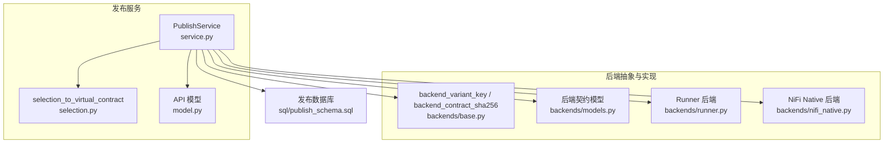
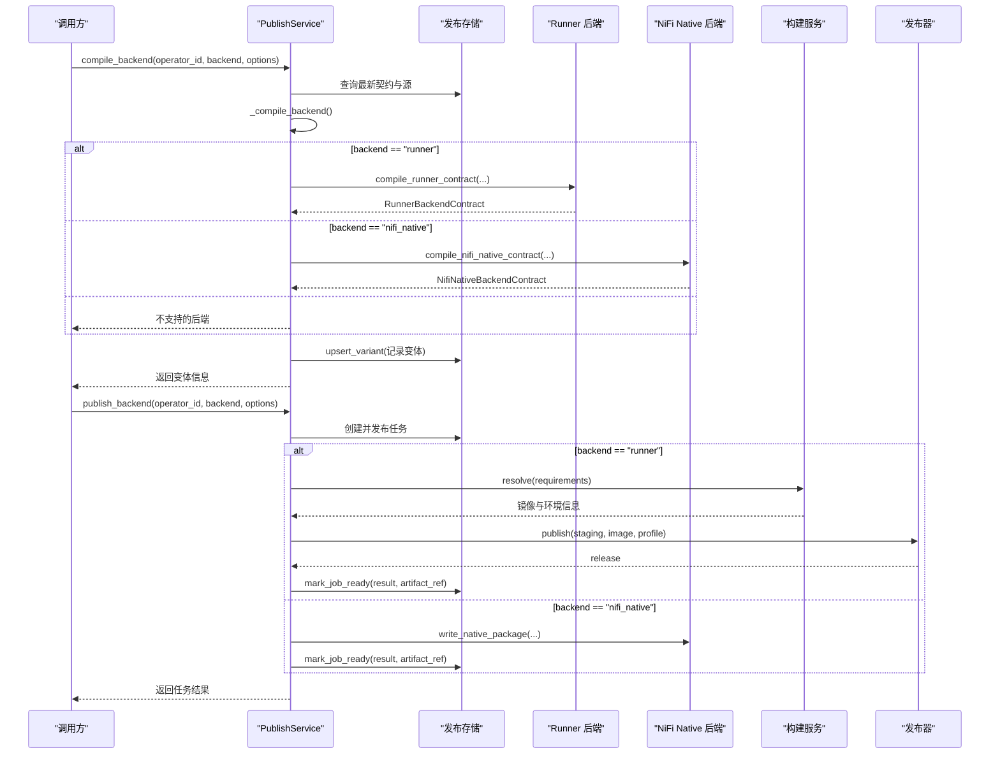
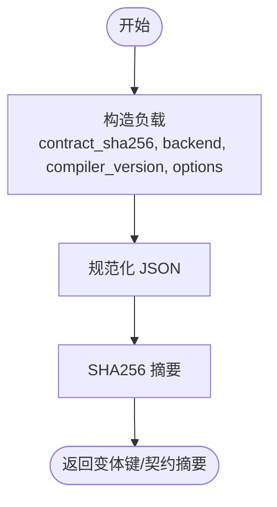
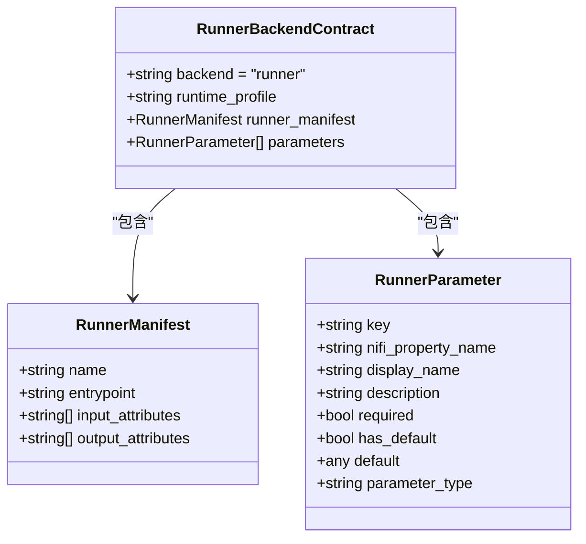
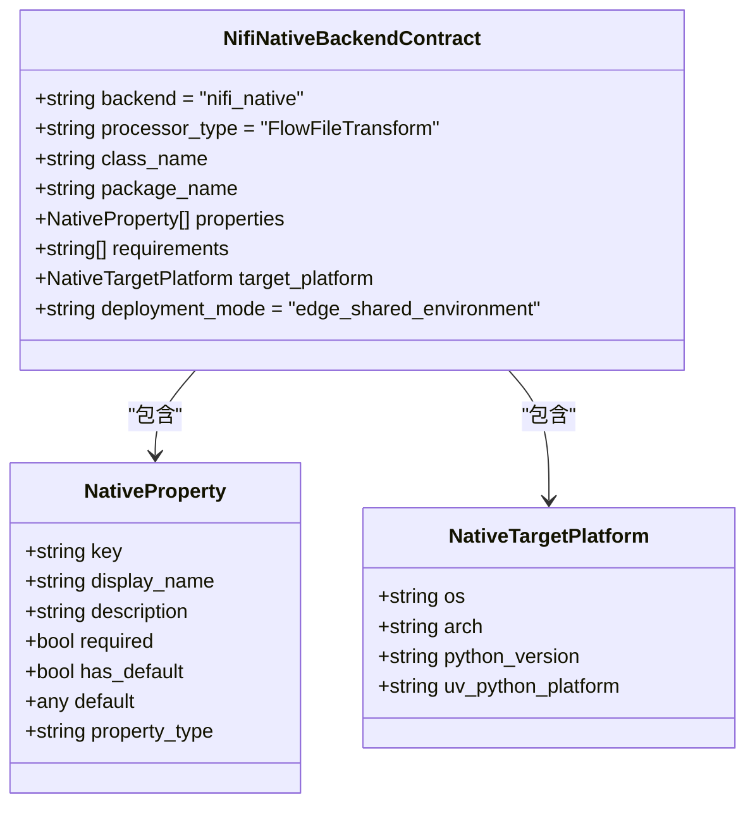
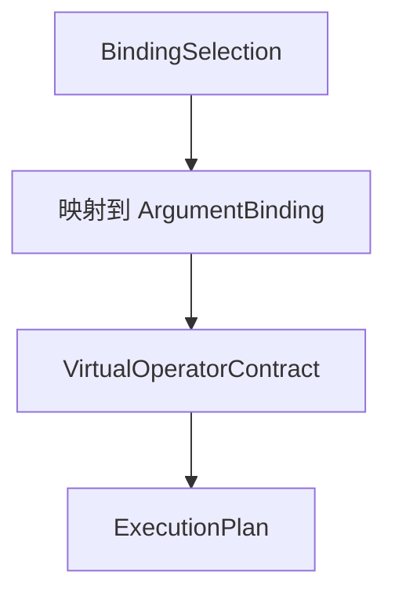
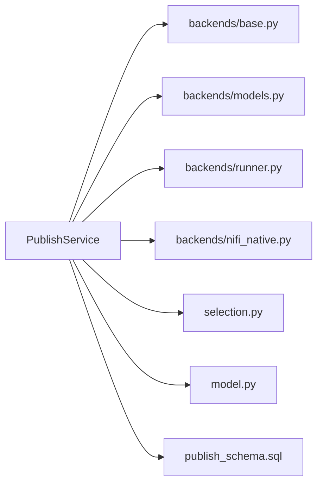
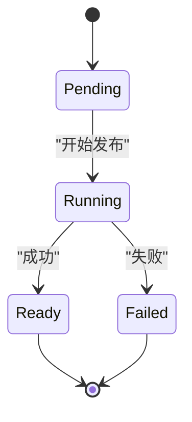

# 多后端支持

<cite>
**本文引用的文件**   
- [publish_service/backends/base.py](file://publish_service/backends/base.py)
- [publish_service/backends/models.py](file://publish_service/backends/models.py)
- [publish_service/backends/runner.py](file://publish_service/backends/runner.py)
- [publish_service/backends/nifi_native.py](file://publish_service/backends/nifi_native.py)
- [publish_service/selection.py](file://publish_service/selection.py)
- [publish_service/model.py](file://publish_service/model.py)
- [publish_service/service.py](file://publish_service/service.py)
- [sql/publish_schema.sql](file://sql/publish_schema.sql)
</cite>

## 目录
1. [引言](#引言)
2. [项目结构](#项目结构)
3. [核心组件](#核心组件)
4. [架构总览](#架构总览)
5. [详细组件分析](#详细组件分析)
6. [依赖关系分析](#依赖关系分析)
7. [性能与适用场景](#性能与适用场景)
8. [错误处理与排错指南](#错误处理与排错指南)
9. [扩展新后端指南](#扩展新后端指南)
10. [迁移与兼容性说明](#迁移与兼容性说明)
11. [结论](#结论)

## 引言
本文面向“多后端支持”能力，重点解释 Runner 与 NiFi Native 两种执行后端的抽象设计、实现差异、选择策略、配置方式、错误处理、性能特征与适用场景，并给出扩展新后端、切换后端以及迁移兼容性的实践指南。读者无需深入源码即可理解整体机制；如需定位具体实现，文档在相关章节提供精确的文件与行号引用。

## 项目结构
多后端发布能力集中在 publish_service 模块中：
- backends：后端抽象与具体实现（Runner、NiFi Native）
- selection：将用户绑定选择转换为虚拟算子契约
- model：API 请求模型
- service：编排编译、发布、存储与任务状态
- sql：数据库表结构与索引

**图表来源**
- [publish_service/service.py:569-622](file://publish_service/service.py#L569-L622)
- [publish_service/selection.py:34-77](file://publish_service/selection.py#L34-L77)
- [publish_service/model.py:15-92](file://publish_service/model.py#L15-L92)
- [publish_service/backends/base.py:10-27](file://publish_service/backends/base.py#L10-L27)
- [publish_service/backends/models.py:10-73](file://publish_service/backends/models.py#L10-L73)
- [publish_service/backends/runner.py:23-113](file://publish_service/backends/runner.py#L23-L113)
- [publish_service/backends/nifi_native.py:103-168](file://publish_service/backends/nifi_native.py#L103-L168)
- [sql/publish_schema.sql:51-67](file://sql/publish_schema.sql#L51-L67)

**章节来源**
- [publish_service/service.py:71-110](file://publish_service/service.py#L71-L110)
- [publish_service/selection.py:34-77](file://publish_service/selection.py#L34-L77)
- [publish_service/model.py:15-92](file://publish_service/model.py#L15-L92)
- [publish_service/backends/base.py:10-27](file://publish_service/backends/base.py#L10-L27)
- [publish_service/backends/models.py:10-73](file://publish_service/backends/models.py#L10-L73)
- [publish_service/backends/runner.py:23-113](file://publish_service/backends/runner.py#L23-L113)
- [publish_service/backends/nifi_native.py:103-168](file://publish_service/backends/nifi_native.py#L103-L168)
- [sql/publish_schema.sql:51-67](file://sql/publish_schema.sql#L51-L67)

## 核心组件
- 后端抽象接口与通用工具
  - 变体键生成：基于契约摘要、后端类型、编译器版本与选项计算稳定哈希，用于缓存与去重。
  - 契约摘要：对后端契约进行规范化序列化后计算摘要，作为唯一标识。
- 后端契约模型
  - 公共基类包含后端类型、编译器版本、父契约信息、变体键与后端选项。
  - Runner 契约包含运行时 profile、Runner Manifest 与参数映射。
  - NiFi Native 契约包含类名、包名、属性列表、requirements、目标平台与部署模式。
- 后端实现
  - Runner：生成 runner 适配入口、operator-contract.yaml、operator.yaml 与 publish-info.json，并通过构建服务解析 Python 运行环境镜像。
  - NiFi Native：生成 Python 包装类与 NAR 包结构，打包为 zip，包含 edge-target.json 与 runtime 目录。
- 选择与转换
  - 将前端 BindingSelection 转换为 VirtualOperatorContract，统一入参来源、编解码器、元数据与输出策略。
- 服务编排
  - PublishService 负责工作区校验、Python 根目录选择、虚拟契约创建、后端编译与发布、任务状态管理。

**章节来源**
- [publish_service/backends/base.py:10-27](file://publish_service/backends/base.py#L10-L27)
- [publish_service/backends/models.py:10-73](file://publish_service/backends/models.py#L10-L73)
- [publish_service/backends/runner.py:23-113](file://publish_service/backends/runner.py#L23-L113)
- [publish_service/backends/nifi_native.py:103-168](file://publish_service/backends/nifi_native.py#L103-L168)
- [publish_service/selection.py:34-77](file://publish_service/selection.py#L34-L77)
- [publish_service/service.py:569-622](file://publish_service/service.py#L569-L622)

## 架构总览
后端选择与编译发布流程如下：

**图表来源**
- [publish_service/service.py:569-622](file://publish_service/service.py#L569-L622)
- [publish_service/service.py:644-710](file://publish_service/service.py#L644-L710)
- [publish_service/backends/runner.py:23-113](file://publish_service/backends/runner.py#L23-L113)
- [publish_service/backends/nifi_native.py:103-168](file://publish_service/backends/nifi_native.py#L103-L168)

## 详细组件分析

### 后端抽象接口与通用工具
- 变体键生成
  - 输入：契约摘要、后端类型、编译器版本、选项字典。
  - 输出：稳定哈希字符串，用于变体去重与缓存。
- 契约摘要
  - 对后端契约进行规范化 JSON 序列化后计算摘要，保证跨语言与跨版本的稳定性。

**图表来源**
- [publish_service/backends/base.py:10-27](file://publish_service/backends/base.py#L10-L27)

**章节来源**
- [publish_service/backends/base.py:10-27](file://publish_service/backends/base.py#L10-L27)

### Runner 后端
- 编译阶段
  - 读取 profile 选项，默认 standard。
  - 生成 RunnerBackendContract，包含父契约信息、编译器版本、变体键、后端选项、运行时 profile、RunnerManifest 与参数映射。
- 发布阶段
  - 写入 operator-contract.yaml、__dsc_entry__.py、operator.yaml 与 publish-info.json。
  - 通过构建服务解析 requirements，获取运行镜像与环境。
  - 使用发布器发布产物，返回 releaseId、runtimeImage、processorDefinition 等。

**图表来源**
- [publish_service/backends/models.py:21-44](file://publish_service/backends/models.py#L21-L44)
- [publish_service/backends/runner.py:23-67](file://publish_service/backends/runner.py#L23-L67)

**章节来源**
- [publish_service/backends/runner.py:23-113](file://publish_service/backends/runner.py#L23-L113)
- [publish_service/backends/models.py:21-44](file://publish_service/backends/models.py#L21-L44)
- [publish_service/service.py:711-774](file://publish_service/service.py#L711-L774)

### NiFi Native 后端
- 编译阶段
  - 读取 requirements 与目标平台（os/arch/pythonVersion/uvPythonPlatform）。
  - 生成类名与包名，规范化选项，生成 NifiNativeBackendContract。
  - 包含处理器类型 FlowFileTransform、属性列表、requirements、目标平台与部署模式。
- 发布阶段
  - 生成 Python 包装类模板，嵌入计划与属性 JSON。
  - 打包为 zip，包含 __init__.py、类文件、requirements.txt、edge-target.json 与 runtime 目录。

**图表来源**
- [publish_service/backends/models.py:47-73](file://publish_service/backends/models.py#L47-L73)
- [publish_service/backends/nifi_native.py:103-168](file://publish_service/backends/nifi_native.py#L103-L168)

**章节来源**
- [publish_service/backends/nifi_native.py:103-168](file://publish_service/backends/nifi_native.py#L103-L168)
- [publish_service/backends/nifi_native.py:533-581](file://publish_service/backends/nifi_native.py#L533-L581)
- [publish_service/backends/models.py:47-73](file://publish_service/backends/models.py#L47-L73)

### 选择与转换
- BindingSelection 描述入参来源（input.payload、input.metadata、operator.parameter、constant）、编解码器、元数据键、参数信息与常量值。
- selection_to_virtual_contract 将其转换为 VirtualOperatorContract，统一构造与调用参数绑定、输出策略与 none_policy。

**图表来源**
- [publish_service/model.py:24-50](file://publish_service/model.py#L24-L50)
- [publish_service/selection.py:11-31](file://publish_service/selection.py#L11-L31)
- [publish_service/selection.py:34-77](file://publish_service/selection.py#L34-L77)

**章节来源**
- [publish_service/model.py:24-50](file://publish_service/model.py#L24-L50)
- [publish_service/selection.py:11-31](file://publish_service/selection.py#L11-L31)
- [publish_service/selection.py:34-77](file://publish_service/selection.py#L34-L77)

## 依赖关系分析
- PublishService 依赖：
  - 后端抽象与实现：base、models、runner、nifi_native。
  - 选择与模型：selection、model。
  - 外部服务：构建服务（BuildServiceClient）、发布器（OperatorPublisher）、存储（PublishStore）。
- 数据库依赖：
  - 后端变体表与发布任务表，含状态机 PENDING/RUNNING/READY/FAILED。

**图表来源**
- [publish_service/service.py:20-38](file://publish_service/service.py#L20-L38)
- [sql/publish_schema.sql:51-67](file://sql/publish_schema.sql#L51-L67)

**章节来源**
- [publish_service/service.py:20-38](file://publish_service/service.py#L20-L38)
- [sql/publish_schema.sql:51-67](file://sql/publish_schema.sql#L51-L67)

## 性能与适用场景
- Runner 后端
  - 特点：通过构建服务解析 Python 依赖并拉取运行镜像，适合需要隔离运行环境与灵活依赖管理的场景。
  - 优势：镜像化运行、可复用构建环境、便于调试与观测。
  - 注意：依赖解析与镜像拉取可能引入额外延迟。
- NiFi Native 后端
  - 特点：生成 Python 包装类与 NAR 包，直接嵌入 NiFi 边缘节点共享环境，适合低延迟、轻量级部署。
  - 优势：减少运行时开销、避免镜像拉取、适合高频短任务。
  - 注意：依赖冲突检测严格，需确保同一目标平台的依赖一致性。

[本节为通用指导，不直接分析具体文件]

## 错误处理与排错指南
- 不支持的后端
  - 当传入的 backend 不是 runner 或 nifi_native 时，抛出 PublishError。
- 工作区与 Python 根目录
  - workspace 必须为非空相对路径且位于配置的 workspace_root 内；若不存在或逃逸则报错。
  - Python 根目录需在候选集中，否则报错。
- 虚拟契约创建
  - 若工作区在 Analyze 之后发生变化，会提示重新 Analyze。
- 依赖冲突（NiFi Native）
  - 当新算子与已发布的算子在相同边缘目标上存在依赖冲突时，抛出 EdgeDependencyConflictError，并附带冲突详情。
- 构建服务异常
  - 未返回运行环境、构建失败或未就绪时，分别抛出对应 PublishError。
- 任务状态
  - 发布任务状态机：PENDING → RUNNING → READY/FAILED；失败时会记录错误消息。

**图表来源**
- [sql/publish_schema.sql:54-64](file://sql/publish_schema.sql#L54-L64)

**章节来源**
- [publish_service/service.py:43-50](file://publish_service/service.py#L43-L50)
- [publish_service/service.py:247-309](file://publish_service/service.py#L247-L309)
- [publish_service/service.py:418-477](file://publish_service/service.py#L418-L477)
- [publish_service/service.py:644-710](file://publish_service/service.py#L644-L710)
- [sql/publish_schema.sql:54-64](file://sql/publish_schema.sql#L54-L64)

## 扩展新后端指南
要新增一个后端类型，建议遵循以下步骤：

1. 定义后端契约模型
   - 在 backends/models.py 中新增继承 BackendContractBase 的具体契约类，声明 backend 字面量与特有字段。
   - 示例参考：RunnerBackendContract、NifiNativeBackendContract。

2. 实现后端编译逻辑
   - 在 backends/<new_backend>.py 中实现 compile_<backend>_contract 函数，接收 parent、plan、options 等参数，返回后端契约对象。
   - 使用 backend_variant_key 生成稳定变体键。
   - 示例参考：compile_runner_contract、compile_nifi_native_contract。

3. 实现发布逻辑
   - 在 backends/<new_backend>.py 中实现 write_<backend>_package 或类似函数，生成发布所需文件与归档。
   - 示例参考：write_runner_release_files、write_native_package。

4. 在服务中注册后端
   - 在 PublishService._compile_backend 中添加新的 backend 分支，调用对应的编译函数。
   - 在 PublishService.publish_backend 中添加新的 backend 分支，调用对应的发布函数。
   - 示例参考：_compile_backend、publish_backend。

5. 配置后端参数
   - 在 options 中定义后端特定参数，并在编译函数中进行归一化与校验。
   - 示例参考：Runner 的 profile、NiFi Native 的 targetPlatform、className、packageName。

6. 处理后端特定错误
   - 在后端实现中抛出明确的异常类型，并在服务层捕获并记录到任务错误消息。
   - 示例参考：EdgeDependencyConflictError、PublishError。

7. 测试与验证
   - 编写单元测试覆盖编译与发布流程，包括边界条件与错误路径。
   - 使用集成测试验证端到端行为。

**章节来源**
- [publish_service/backends/models.py:10-73](file://publish_service/backends/models.py#L10-L73)
- [publish_service/backends/runner.py:23-113](file://publish_service/backends/runner.py#L23-L113)
- [publish_service/backends/nifi_native.py:103-168](file://publish_service/backends/nifi_native.py#L103-L168)
- [publish_service/service.py:569-622](file://publish_service/service.py#L569-L622)
- [publish_service/service.py:644-710](file://publish_service/service.py#L644-L710)

## 迁移与兼容性说明
- 编译器版本
  - Runner 使用 runner-contract-v4，NiFi Native 使用 nifi-native-contract-v2。不同后端具有独立的编译器版本，向后兼容由后端契约字段与变体键保障。
- 变体键与契约摘要
  - 变体键包含 contract_sha256、backend、compiler_version 与 options，确保不同后端与不同选项产生独立变体。
  - 契约摘要是后端契约的唯一标识，用于存储与检索。
- 后端切换
  - 通过 compile_backend 与 publish_backend 的 backend 参数切换后端类型。
  - 同一父契约可生成多个后端变体，互不影响。
- 依赖与平台
  - Runner 依赖构建服务提供的运行镜像；NiFi Native 依赖目标平台与 uvPythonPlatform。
  - 迁移时需确保目标平台的依赖一致性与兼容性。

**章节来源**
- [publish_service/backends/runner.py:17-20](file://publish_service/backends/runner.py#L17-L20)
- [publish_service/backends/nifi_native.py:20-27](file://publish_service/backends/nifi_native.py#L20-L27)
- [publish_service/backends/base.py:10-27](file://publish_service/backends/base.py#L10-L27)
- [publish_service/service.py:569-622](file://publish_service/service.py#L569-L622)

## 结论
多后端支持通过统一的抽象与清晰的职责划分，实现了 Runner 与 NiFi Native 两种执行后端的并行开发与平滑切换。Runner 侧重隔离与可观测性，NiFi Native 侧重轻量与低延迟。通过变体键与契约摘要保证版本稳定与去重，结合任务状态机与错误处理提升可靠性。扩展新后端只需遵循约定接口与服务注册流程，即可快速接入现有发布体系。