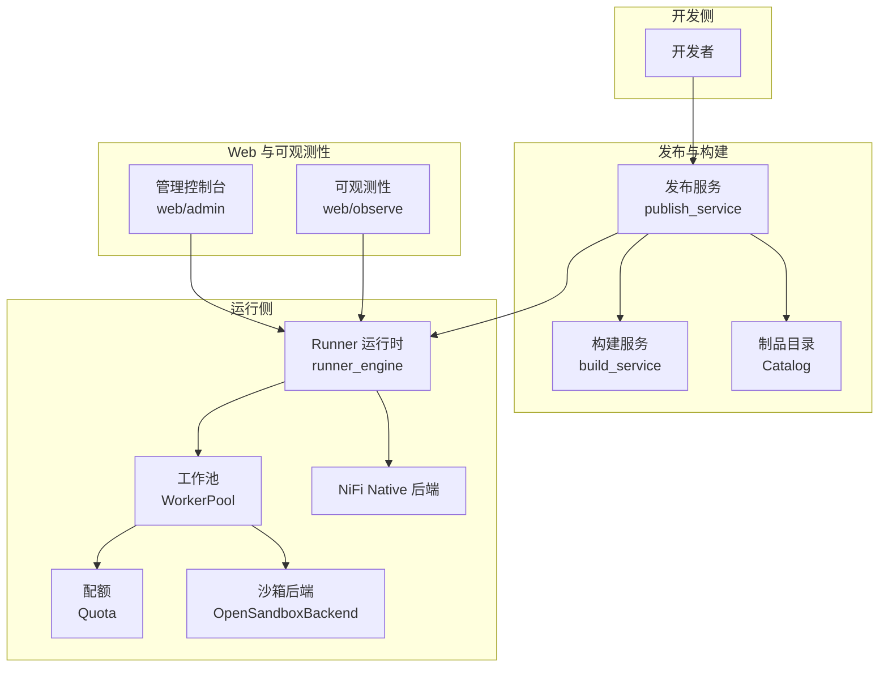
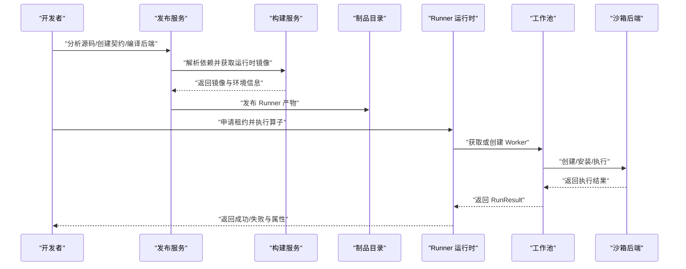
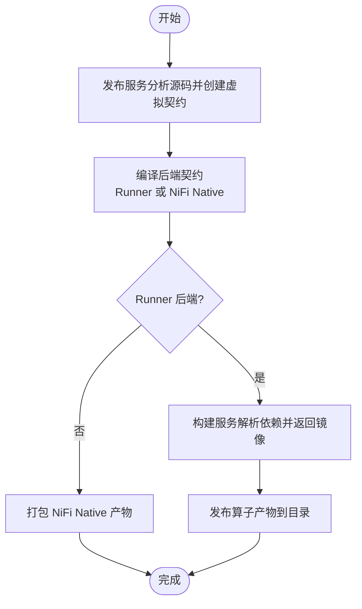
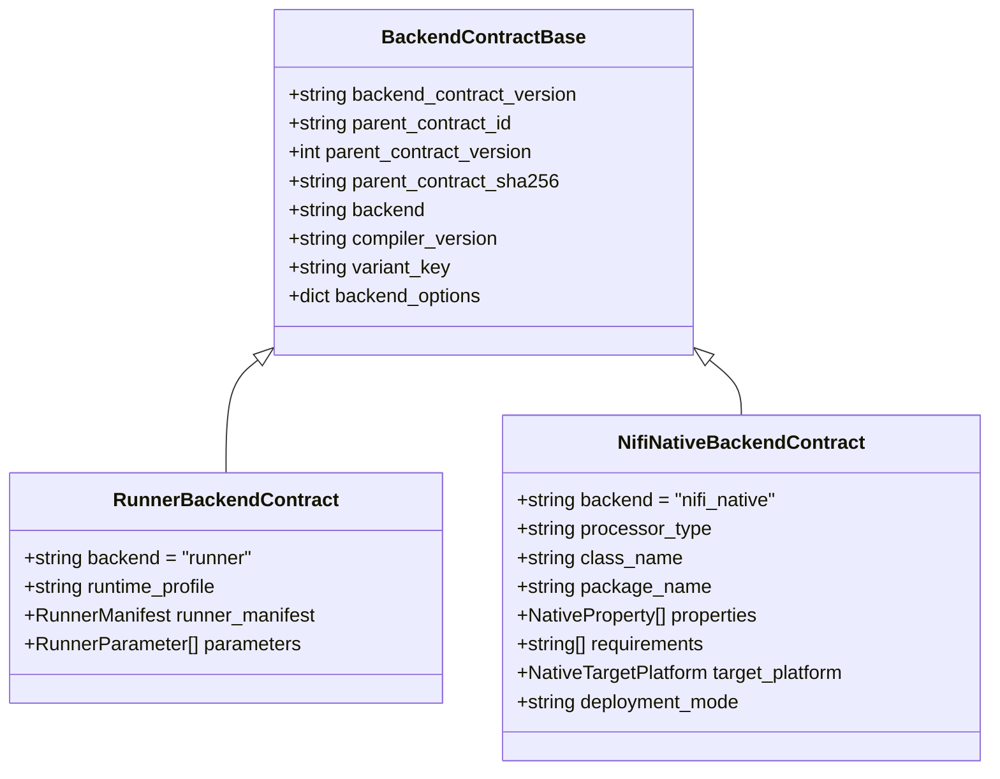
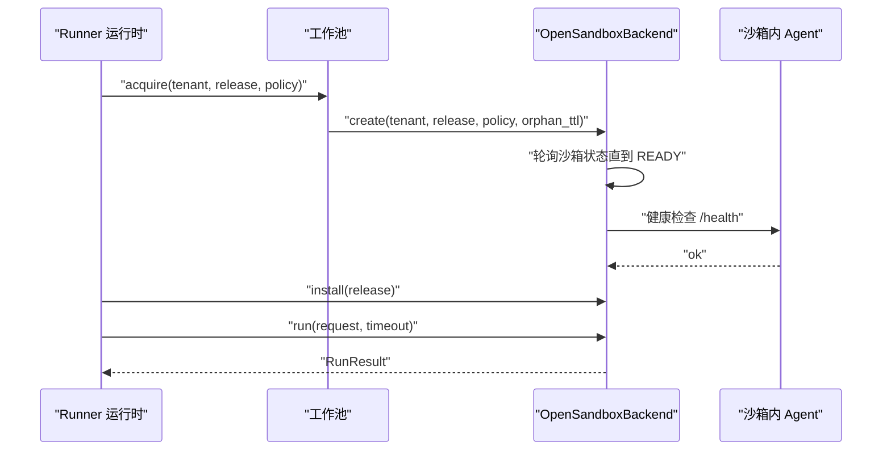
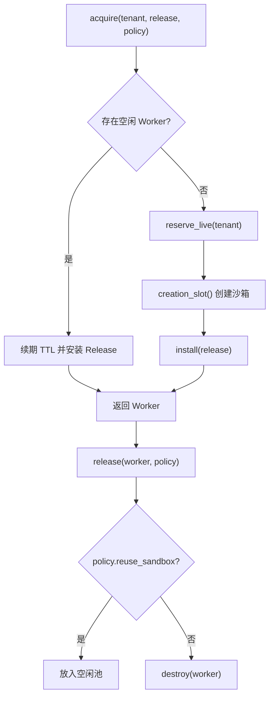
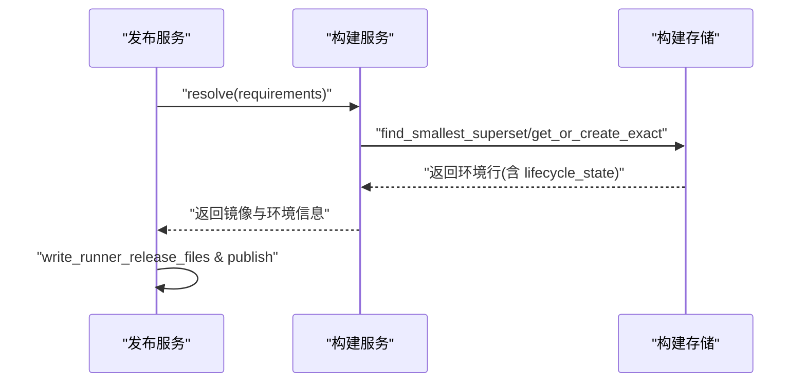
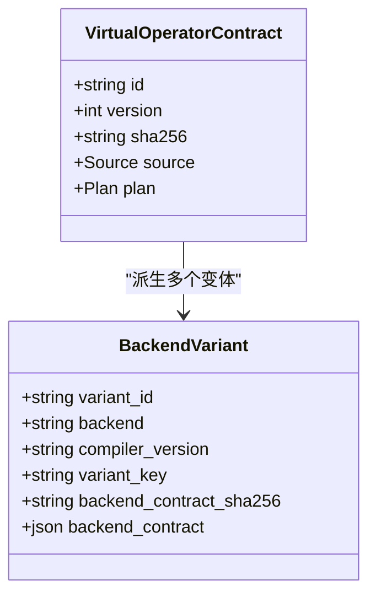
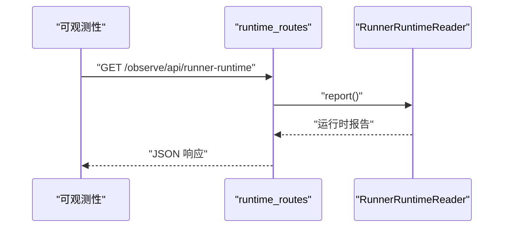
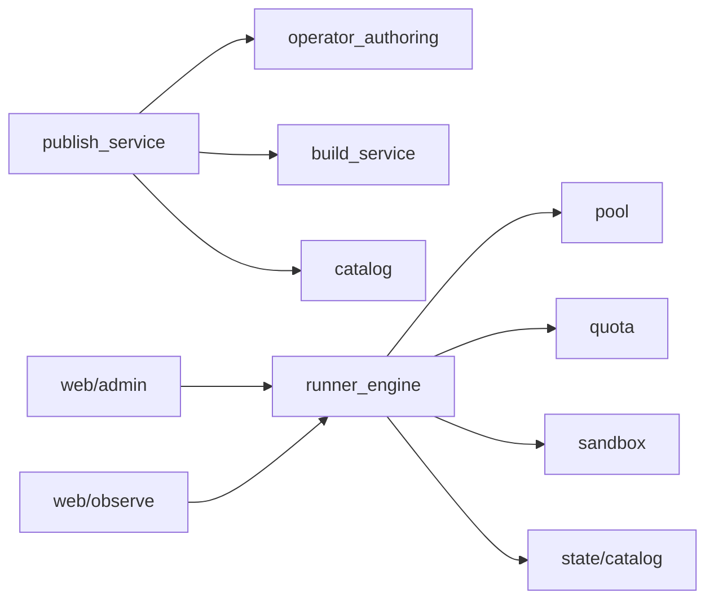

# 核心特性

<cite>
**本文引用的文件**   
- [pyproject.toml](file://pyproject.toml)
- [runner_engine/model.py](file://runner_engine/model.py)
- [runner_engine/service.py](file://runner_engine/service.py)
- [runner_engine/lifecycle_service.py](file://runner_engine/lifecycle_service.py)
- [runner_engine/pool.py](file://runner_engine/pool.py)
- [runner_engine/quota.py](file://runner_engine/quota.py)
- [runner_engine/sandbox/backend.py](file://runner_engine/sandbox/backend.py)
- [runner_engine/sandbox/opensandbox.py](file://runner_engine/sandbox/opensandbox.py)
- [publish_service/service.py](file://publish_service/service.py)
- [publish_service/backends/models.py](file://publish_service/backends/models.py)
- [build_service/lifecycle_service.py](file://build_service/lifecycle_service.py)
- [web/admin/lifecycle_routes.py](file://web/admin/lifecycle_routes.py)
- [web/admin/main.py](file://web/admin/main.py)
- [web/observe/runtime_routes.py](file://web/observe/runtime_routes.py)
</cite>

## 目录
1. [引言](#引言)
2. [项目结构](#项目结构)
3. [核心组件](#核心组件)
4. [架构总览](#架构总览)
5. [详细特性分析](#详细特性分析)
6. [依赖关系分析](#依赖关系分析)
7. [性能与容量规划](#性能与容量规划)
8. [故障排查指南](#故障排查指南)
9. [结论](#结论)

## 引言
本文件面向 Runner Engine 项目的开发者与运维人员，系统性说明平台的核心特性：算子生命周期管理、多后端支持、环境隔离、资源配额与调度、自动化构建、版本控制与回滚、监控观察。文档从代码实现出发，解释每个特性的工作原理、配置方式和使用场景，并通过图示帮助理解数据流与控制流。

Runner Engine 是一个面向 NiFi 的托管 Python 算子构建、发布与运行平台。它通过“发布服务”完成算子分析与产物构建，通过“Runner 运行时”在沙箱中安全执行算子，并提供统一的生命周期管理与可观测性能力。

## 项目结构
仓库采用按职责划分的模块化结构：
- runner_engine：运行时核心，包含算子执行、工作池、配额、沙箱适配、生命周期门控等。
- publish_service：算子源码分析、虚拟契约编译、多后端产物发布。
- build_service：运行时镜像构建与环境生命周期管理。
- web：控制台、管理员界面与可观测性前端路由。
- nifi：NiFi Native 集成相关 Java 组件。
- operator_authoring：算子源码扫描、契约编译与推断。
- proto：gRPC 协议定义。
- images：Docker 构建文件。

**图表来源**
- [pyproject.toml:23-28](file://pyproject.toml#L23-L28)
- [publish_service/service.py:71-110](file://publish_service/service.py#L71-L110)
- [runner_engine/service.py:80-101](file://runner_engine/service.py#L80-L101)
- [runner_engine/pool.py:11-43](file://runner_engine/pool.py#L11-L43)
- [runner_engine/sandbox/opensandbox.py:31-50](file://runner_engine/sandbox/opensandbox.py#L31-L50)

**章节来源**
- [pyproject.toml:1-37](file://pyproject.toml#L1-L37)

## 核心组件
- 发布服务 PublishService：负责算子源码分析、虚拟契约创建、后端编译与发布，协调构建服务生成运行时镜像，并产出 Runner 或 NiFi Native 产物。
- Runner 运行时 RunnerService：负责租约、幂等执行、工作池调度、沙箱生命周期、输出校验与错误处理。
- 工作池 WorkerPool：按租户、运行时镜像与安全策略复用沙箱，控制空闲回收、TTL 续期与安装算子版本。
- 配额 Quota：限制全局与租户级并发创建与在线沙箱数量。
- 沙箱后端 OpenSandboxBackend：封装 OpenSandbox API，负责创建、健康检查、安装、执行、取消与销毁。
- 构建服务 LifecycleBuildService：为运行时镜像提供 ACTIVE/RETIRING/RETIRED 生命周期状态与清理计划。
- Web 管理端：暴露生命周期能力、清理计划、重试与预览接口。
- 可观测性：暴露 Runner 运行时状态查询接口。

**章节来源**
- [publish_service/service.py:71-110](file://publish_service/service.py#L71-L110)
- [runner_engine/service.py:80-115](file://runner_engine/service.py#L80-L115)
- [runner_engine/pool.py:11-43](file://runner_engine/pool.py#L11-L43)
- [runner_engine/quota.py:9-26](file://runner_engine/quota.py#L9-L26)
- [runner_engine/sandbox/opensandbox.py:31-50](file://runner_engine/sandbox/opensandbox.py#L31-L50)
- [build_service/lifecycle_service.py:293-302](file://build_service/lifecycle_service.py#L293-L302)
- [web/admin/lifecycle_routes.py:17-50](file://web/admin/lifecycle_routes.py#L17-L50)
- [web/observe/runtime_routes.py:10-19](file://web/observe/runtime_routes.py#L10-L19)

## 架构总览
Runner Engine 的整体调用链如下：
- 开发者通过发布服务提交算子源码，系统分析并生成虚拟契约。
- 根据目标后端（Runner 或 NiFi Native）编译后端契约。
- Runner 后端需要构建服务解析依赖并返回可用运行时镜像；发布服务将算子产物发布到目录。
- 运行时 RunnerService 接收执行请求，校验参数与属性，创建工作池中的 Worker，并在沙箱中执行算子。
- 管理端与可观测性分别提供生命周期操作与运行时状态查询。

**图表来源**
- [publish_service/service.py:569-689](file://publish_service/service.py#L569-L689)
- [publish_service/service.py:711-774](file://publish_service/service.py#L711-L774)
- [runner_engine/service.py:188-331](file://runner_engine/service.py#L188-L331)
- [runner_engine/pool.py:73-130](file://runner_engine/pool.py#L73-L130)
- [runner_engine/sandbox/opensandbox.py:141-376](file://runner_engine/sandbox/opensandbox.py#L141-L376)

## 详细特性分析

### 1) 算子生命周期管理：从开发到生产
- 工作原理
  - 发布服务对源码进行静态扫描，生成虚拟契约，并基于后端类型编译后端契约。
  - 对于 Runner 后端，发布服务调用构建服务解析依赖并返回运行时镜像，随后发布算子产物。
  - 运行时 RunnerService 在执行前校验租约、安全策略与生命周期状态，确保 RETIRING/RETIRED 的运行时不接受新执行。
  - 管理端提供生命周期能力查询、清理计划与执行入口，便于运维人员在生产环境中安全地退役环境与清理资源。

- 配置方式
  - 发布服务通过 PublishSettings 配置工作区、目录根、数据库 URL、构建服务地址、默认 profile 等。
  - Runner 运行时通过 Catalog 加载已发布的算子产物，并通过 RunnerDB 管理租约与执行记录。
  - 管理端通过 install_lifecycle_routes 挂载生命周期路由，结合 Inventory 与 LifecycleClient 展示能力与计划。

- 使用场景
  - 开发者在本地或 CI 中调用发布服务分析源码并编译 Runner/NiFi Native 契约。
  - 运维在生产环境通过管理端查看环境清理计划，确认无阻塞后执行退役与清理。
  - 运行时在接收到执行请求时，若对应运行时处于 RETIRING/RETIRED，则拒绝新执行，避免灰度期间流量进入即将退役的环境。

**图表来源**
- [publish_service/service.py:385-477](file://publish_service/service.py#L385-L477)
- [publish_service/service.py:569-689](file://publish_service/service.py#L569-L689)
- [publish_service/service.py:711-774](file://publish_service/service.py#L711-L774)

**章节来源**
- [publish_service/service.py:71-110](file://publish_service/service.py#L71-L110)
- [publish_service/service.py:385-477](file://publish_service/service.py#L385-L477)
- [publish_service/service.py:569-689](file://publish_service/service.py#L569-L689)
- [publish_service/service.py:711-774](file://publish_service/service.py#L711-L774)
- [runner_engine/lifecycle_service.py:7-32](file://runner_engine/lifecycle_service.py#L7-L32)
- [web/admin/lifecycle_routes.py:17-50](file://web/admin/lifecycle_routes.py#L17-L50)
- [web/admin/main.py:142-162](file://web/admin/main.py#L142-L162)

### 2) 多后端支持：Runner 与 NiFi Native
- 工作原理
  - 发布服务根据 backend 字段分发到不同编译器：
    - Runner：编译 RunnerBackendContract，包含 runtime_profile、runner_manifest 与 parameters。
    - NiFi Native：编译 NifiNativeBackendContract，包含 class_name、package_name、properties、requirements 与 target_platform。
  - 运行时 RunnerService 通过 WorkerPool 与沙箱后端执行 Runner 算子；NiFi Native 则由 NiFi 原生处理器执行。

- 配置方式
  - 发布服务通过 options 指定后端选项：
    - Runner：profile 默认来自 settings.default_profile。
    - NiFi Native：className、packageName、targetPlatform 等由编译器规范化。
  - 后端契约模型在后端 models 中定义，用于序列化与存储。

- 使用场景
  - 高性能、可伸缩的 Python 算子适合 Runner 后端，在沙箱中独立执行。
  - 需要与 NiFi 原生生态深度集成的算子适合 NiFi Native 后端，以 Java NAR 包形式部署。

**图表来源**
- [publish_service/backends/models.py:10-72](file://publish_service/backends/models.py#L10-L72)

**章节来源**
- [publish_service/service.py:569-689](file://publish_service/service.py#L569-L689)
- [publish_service/backends/models.py:10-72](file://publish_service/backends/models.py#L10-L72)

### 3) 环境隔离：基于沙箱的安全执行
- 工作原理
  - Runner 运行时通过 OpenSandboxBackend 调用 OpenSandbox API 创建沙箱，注入环境变量、资源限制与元数据标签。
  - 沙箱启动后轮询状态，等待 RUNNING/READY/STARTED，再获取 agent 端口并验证健康。
  - 算子产物通过 /bootstrap 安装到沙箱，执行通过 /run 接口传递内容、属性与参数，并限制输出大小与属性数量。
  - 安全策略 SecurityPolicy 决定 CPU、内存、最大超时与网络允许列表，并由沙箱后端映射为资源限制与网络策略。

- 配置方式
  - OpenSandboxBackend 初始化时传入 clusters 配置，包含集群名称与访问信息。
  - SecurityPolicy 配置 sandbox_cluster、cpu、memory、max_timeout_ms、network_allow 等。
  - WorkerPool 配置 idle_seconds、orphan_ttl_seconds、renew_before_seconds、max_installed_releases 等。

- 使用场景
  - 多租户环境下，每个租户的沙箱数量受配额限制，避免资源争用。
  - 高安全要求的算子可通过严格的安全策略限制网络与资源，防止越权访问。

**图表来源**
- [runner_engine/sandbox/opensandbox.py:141-376](file://runner_engine/sandbox/opensandbox.py#L141-L376)
- [runner_engine/pool.py:73-130](file://runner_engine/pool.py#L73-L130)

**章节来源**
- [runner_engine/model.py:26-35](file://runner_engine/model.py#L26-L35)
- [runner_engine/sandbox/opensandbox.py:31-50](file://runner_engine/sandbox/opensandbox.py#L31-L50)
- [runner_engine/sandbox/opensandbox.py:141-376](file://runner_engine/sandbox/opensandbox.py#L141-L376)
- [runner_engine/pool.py:19-43](file://runner_engine/pool.py#L19-L43)

### 4) 资源管理：智能配额控制与调度
- 工作原理
  - Quota 维护全局与租户级的在线沙箱计数，以及创建并发信号量。
  - WorkerPool.acquire 先尝试复用空闲 Worker，否则申请配额并创建新沙箱。
  - WorkerPool.release 根据策略决定是否复用 Worker，并更新 last_used_monotonic 与 runs 计数。
  - WorkerPool.reap 定期清理空闲超时的 Worker，释放配额。

- 配置方式
  - Quota(max_creating, max_live, max_live_per_tenant) 控制并发与上限。
  - WorkerPool(idle_seconds, orphan_ttl_seconds, renew_before_seconds, max_installed_releases) 控制复用与 TTL。
  - SecurityPolicy.reuse_sandbox 控制是否允许复用沙箱。

- 使用场景
  - 在高并发场景中，通过 Quota 限制全局与租户级沙箱数量，避免资源耗尽。
  - 通过 WorkerPool 复用沙箱减少启动开销，提高吞吐。

**图表来源**
- [runner_engine/pool.py:73-180](file://runner_engine/pool.py#L73-L180)
- [runner_engine/quota.py:28-60](file://runner_engine/quota.py#L28-L60)

**章节来源**
- [runner_engine/pool.py:11-188](file://runner_engine/pool.py#L11-L188)
- [runner_engine/quota.py:9-61](file://runner_engine/quota.py#L9-L61)

### 5) 自动化构建：依赖解析与镜像构建
- 工作原理
  - 发布服务读取算子源码的 requirements，调用构建服务 BuildServiceClient.resolve 解析依赖并返回运行时镜像。
  - 构建服务 LifecycleBuildStore 扩展运行时环境的生命周期状态，支持 ACTIVE/RETIRING/RETIRED，并管理别名与构建任务。
  - 发布服务将算子产物写入临时目录并发布到 Catalog，同时记录 runtime_image、environmentId、envKey 等信息。

- 配置方式
  - PublishSettings.build_service_url 指向构建服务地址。
  - PublishSettings.edge_python_version 与 edge_uv_default_index 影响边缘平台的 Python 与索引配置。
  - BuildServiceClient 通过 HTTP 与构建服务交互，超时由 build_timeout_seconds 控制。

- 使用场景
  - 在 CI/CD 中自动构建依赖镜像，确保运行时一致性与可重现性。
  - 通过构建服务的生命周期管理，逐步退役旧镜像并清理制品。

**图表来源**
- [publish_service/service.py:711-774](file://publish_service/service.py#L711-L774)
- [build_service/lifecycle_service.py:65-107](file://build_service/lifecycle_service.py#L65-L107)

**章节来源**
- [publish_service/service.py:71-110](file://publish_service/service.py#L71-L110)
- [publish_service/service.py:711-774](file://publish_service/service.py#L711-L774)
- [build_service/lifecycle_service.py:11-107](file://build_service/lifecycle_service.py#L11-L107)

### 6) 版本控制：算子版本管理与回滚
- 工作原理
  - 发布服务保存虚拟契约与后端变体，记录 contract_id、version、contract_sha256、source_ref 等。
  - 后端变体通过 variant_key 与 backend_contract_sha256 唯一标识，支持多次编译与发布。
  - 运行时通过 Catalog 加载 release_id 对应的产物，确保执行的是已发布的稳定版本。
  - 构建服务支持对运行时镜像的退役与清理，配合管理端的清理计划实现安全的版本切换。

- 配置方式
  - 发布服务 store.save_virtual_contract 与 upsert_variant 持久化契约与变体。
  - 管理端通过 lifecycle_client.enabled 与 build/publish/runner 能力开关控制功能。

- 使用场景
  - 灰度发布：保留旧版本 release_id，逐步切换流量到新版本。
  - 回滚：快速恢复至历史 release_id，避免新版本问题影响线上。

**图表来源**
- [publish_service/service.py:418-477](file://publish_service/service.py#L418-L477)
- [publish_service/service.py:532-544](file://publish_service/service.py#L532-L544)

**章节来源**
- [publish_service/service.py:418-477](file://publish_service/service.py#L418-L477)
- [publish_service/service.py:532-544](file://publish_service/service.py#L532-L544)
- [web/admin/lifecycle_routes.py:34-50](file://web/admin/lifecycle_routes.py#L34-L50)

### 7) 监控观察：完整的可观测性支持
- 工作原理
  - 可观测性模块暴露 /observe/api/runner-runtime 接口，返回 Runner 运行时报告，包括活跃执行、工作池状态与沙箱使用情况。
  - RunnerService.start_background 定期清理过期租约、幂等缓存与旧执行记录，保证系统长期稳定运行。
  - 管理端暴露生命周期能力与清理计划，便于运维观察与干预。

- 配置方式
  - 可观测性通过 install_runner_runtime_routes 挂载路由，使用 RunnerRuntimeReader.environment 获取运行时报告。
  - RunnerService.start_background(interval_seconds) 配置后台清理间隔。

- 使用场景
  - 实时监控 Runner 运行时的负载与健康状况。
  - 结合管理端生命周期能力，观察环境退役进度与清理结果。

**图表来源**
- [web/observe/runtime_routes.py:10-19](file://web/observe/runtime_routes.py#L10-L19)

**章节来源**
- [web/observe/runtime_routes.py:10-19](file://web/observe/runtime_routes.py#L10-L19)
- [runner_engine/service.py:117-138](file://runner_engine/service.py#L117-L138)
- [web/admin/lifecycle_routes.py:34-50](file://web/admin/lifecycle_routes.py#L34-L50)

## 依赖关系分析
Runner Engine 各模块之间的依赖关系如下：
- publish_service 依赖 operator_authoring 进行源码扫描与契约编译，依赖 build_service 进行镜像构建，依赖 catalog 进行产物发布。
- runner_engine 依赖 pool、quota、sandbox 与 state/catalog 进行执行与资源管理。
- web/admin 与 web/observe 分别依赖生命周期客户端与运行时读者提供管理能力与可观测性。

**图表来源**
- [publish_service/service.py:12-38](file://publish_service/service.py#L12-L38)
- [runner_engine/service.py:8-12](file://runner_engine/service.py#L8-L12)
- [runner_engine/pool.py:6-8](file://runner_engine/pool.py#L6-L8)

**章节来源**
- [publish_service/service.py:12-38](file://publish_service/service.py#L12-L38)
- [runner_engine/service.py:8-12](file://runner_engine/service.py#L8-L12)
- [runner_engine/pool.py:6-8](file://runner_engine/pool.py#L6-L8)

## 性能与容量规划
- 工作池复用：通过 WorkerPool 复用沙箱，减少启动开销，提升吞吐。建议根据业务峰值调整 idle_seconds 与 max_installed_releases。
- 配额控制：Quota 的全局与租户级限制可防止资源争用。建议根据节点容量与租户 SLA 设置 max_live 与 max_live_per_tenant。
- TTL 续期：WorkerPool 在接近过期时调用 backend.renew，避免沙箱被提前回收。建议根据算子最大超时设置 renew_before_seconds。
- 构建服务：构建服务的最小超集查找与别名机制可减少重复构建。建议合理划分 base_image 与 python_version，提升命中率。

[本节为通用指导，不直接分析具体文件]

## 故障排查指南
- 运行时拒绝新执行
  - 现象：acquire_lease/renew_lease/invoke 抛出 RUNTIME_RETIRED 或 RUNTIME_RETIRING。
  - 原因：运行时处于 RETIRING/RETIRED 状态，LifecycleRunnerService 阻止新执行。
  - 处理：通过管理端查看生命周期状态，等待退役完成或切换到新版本。

- 沙箱启动失败
  - 现象：OpenSandboxBackend.create 抛出 SANDBOX_START_FAILED 或 SANDBOX_START_TIMEOUT。
  - 原因：沙箱进入 FAILED/STOPPED/ERROR/TERMINATED 或未在规定时间内就绪。
  - 处理：检查 OpenSandbox 集群配置与网络策略，确认镜像与 entrypoint 正确。

- 配额超限
  - 现象：WorkerPool.acquire 抛出 GLOBAL_SANDBOX_QUOTA 或 TENANT_SANDBOX_QUOTA。
  - 原因：全局或租户级在线沙箱数量达到上限。
  - 处理：降低并发或增加配额，检查是否有泄漏的 Worker 未释放。

- 构建服务不可达
  - 现象：PublishService._publish_runner 抛出 RUNTIME_NOT_READY 或 RUNTIME_BUILD_FAILED。
  - 原因：构建服务未返回镜像或构建失败。
  - 处理：检查构建服务地址与依赖解析日志，确认镜像构建任务状态。

**章节来源**
- [runner_engine/lifecycle_service.py:19-32](file://runner_engine/lifecycle_service.py#L19-L32)
- [runner_engine/sandbox/opensandbox.py:192-219](file://runner_engine/sandbox/opensandbox.py#L192-L219)
- [runner_engine/quota.py:36-44](file://runner_engine/quota.py#L36-L44)
- [publish_service/service.py:711-737](file://publish_service/service.py#L711-L737)

## 结论
Runner Engine 通过发布服务与构建服务协同完成算子的分析与产物构建，通过 Runner 运行时在沙箱中安全执行，并提供完整的管理与可观测性能力。其核心优势在于：
- 统一的算子生命周期管理，支持灰度与回滚。
- 多后端支持，兼顾灵活性与原生集成。
- 强隔离的沙箱执行环境，保障安全与稳定性。
- 智能的资源配额与工作池调度，提升吞吐与效率。
- 自动化构建与版本控制，确保一致性与可重现性。
- 完善的监控观察，便于运维与排障。

[本节为总结，不直接分析具体文件]