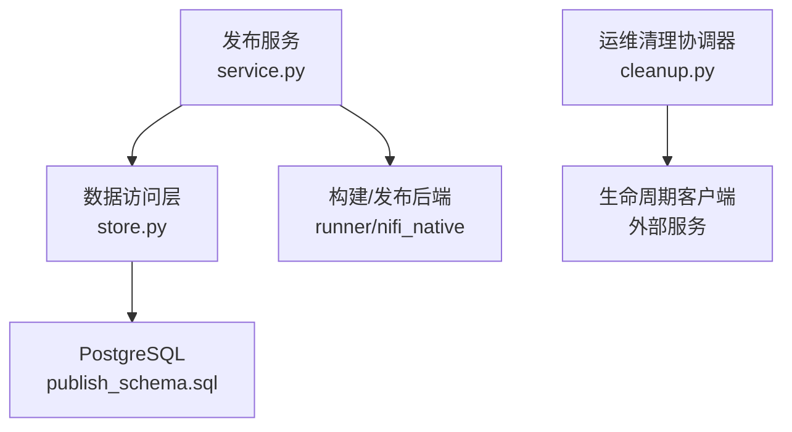
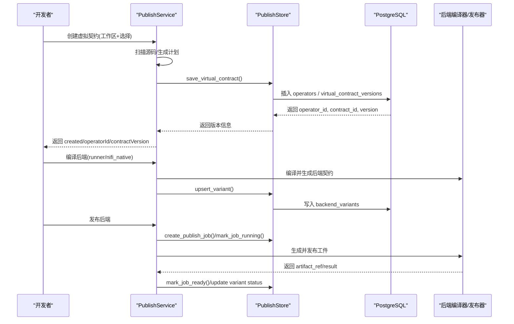
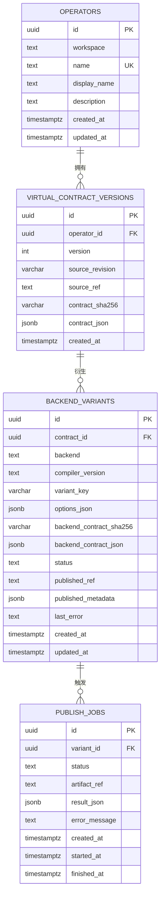
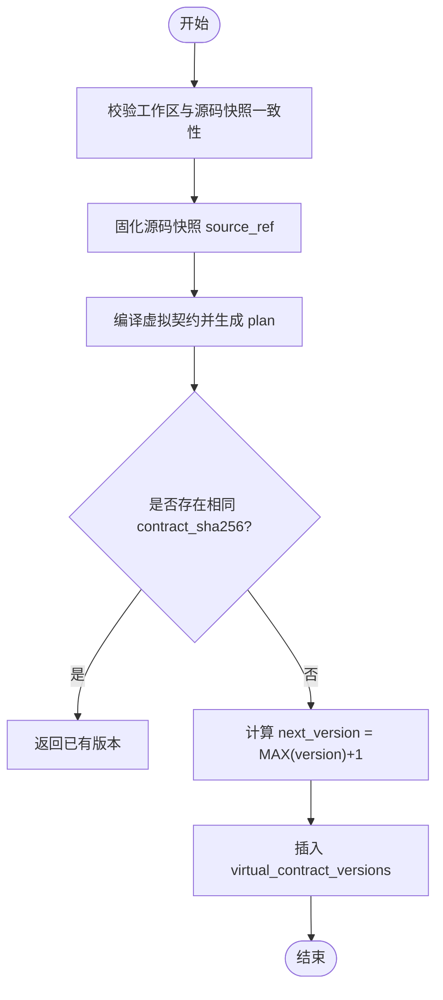
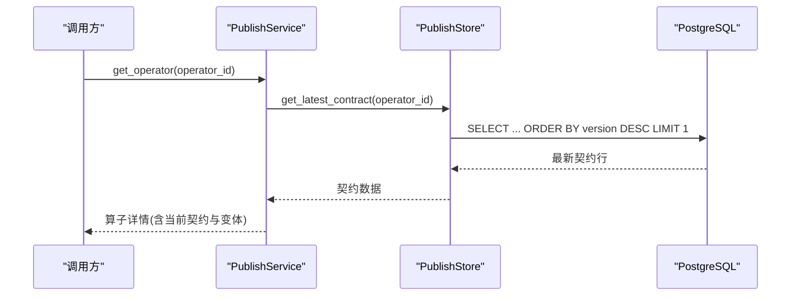
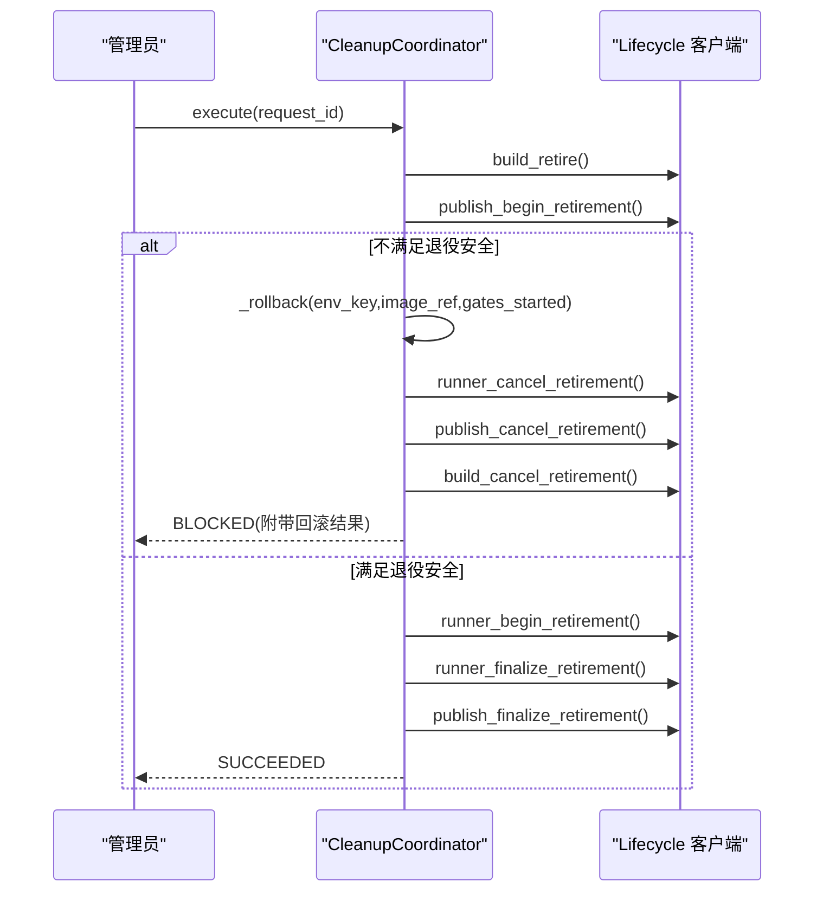
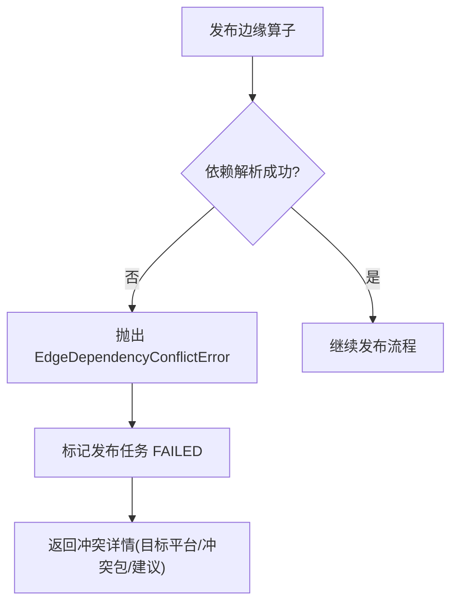
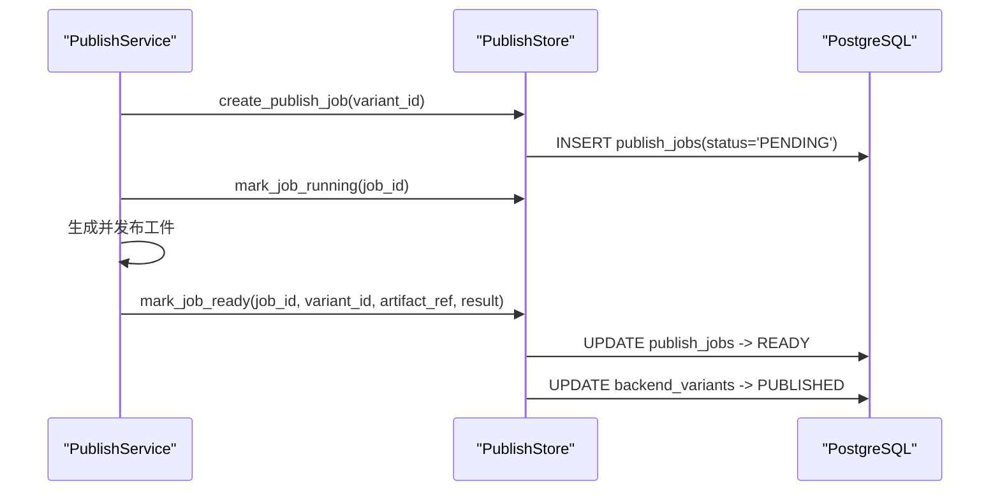
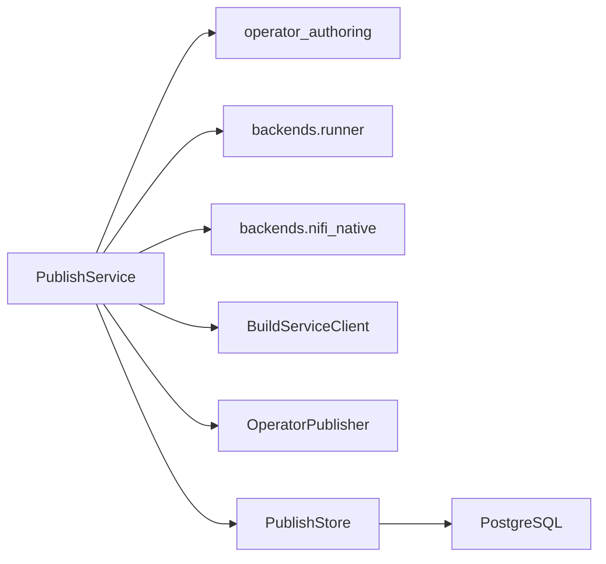

# 版本控制

<cite>
**本文引用的文件**   
- [publish_service/store.py](file://publish_service/store.py)
- [sql/publish_schema.sql](file://sql/publish_schema.sql)
- [publish_service/service.py](file://publish_service/service.py)
- [web/admin/cleanup.py](file://web/admin/cleanup.py)
</cite>

## 目录
1. [引言](#引言)
2. [项目结构](#项目结构)
3. [核心组件](#核心组件)
4. [架构总览](#架构总览)
5. [详细组件分析](#详细组件分析)
6. [依赖关系分析](#依赖关系分析)
7. [性能与一致性](#性能与一致性)
8. [故障排查指南](#故障排查指南)
9. [结论](#结论)
10. [附录：最佳实践与迁移指南](#附录最佳实践与迁移指南)

## 引言
本文件面向“算子版本控制”能力，系统性说明版本存储、版本比较、回滚操作、版本元数据结构、版本关系图谱、版本一致性保证机制，以及冲突解决策略、分支管理方法与发布流程控制。文档同时给出创建新版本、查询版本历史、执行版本回滚的具体步骤与代码路径参考，帮助读者在理解系统实现的同时，快速上手使用。

## 项目结构
与版本控制直接相关的核心代码位于以下模块：
- 发布服务数据访问层：`publish_service/store.py`
- 发布服务业务编排层：`publish_service/service.py`
- 数据库模式定义：`sql/publish_schema.sql`
- 清理与回滚协调器（生命周期相关）：`web/admin/cleanup.py`

图表来源
- [publish_service/service.py:418-477](file://publish_service/service.py#L418-L477)
- [publish_service/store.py:17-127](file://publish_service/store.py#L17-L127)
- [sql/publish_schema.sql:1-68](file://sql/publish_schema.sql#L1-L68)
- [web/admin/cleanup.py:14-334](file://web/admin/cleanup.py#L14-L334)

章节来源
- [publish_service/store.py:17-127](file://publish_service/store.py#L17-L127)
- [sql/publish_schema.sql:1-68](file://sql/publish_schema.sql#L1-L68)
- [publish_service/service.py:418-477](file://publish_service/service.py#L418-L477)
- [web/admin/cleanup.py:14-334](file://web/admin/cleanup.py#L14-L334)

## 核心组件
- 发布服务 PublishService：负责算子虚拟契约的创建、编译、发布与边缘依赖解析；对外暴露创建版本、查询算子、编译后端、发布后端等能力。
- 数据访问层 PublishStore：封装 PostgreSQL 访问，提供保存虚拟契约、查询算子与版本、变体管理与发布任务状态更新等方法。
- 数据库模式 publish_schema：定义 operators、virtual_contract_versions、backend_variants、publish_jobs 等表结构与约束。
- 清理协调器 CleanupCoordinator：编排环境清理流程，包含发布与运行时的退役门控与回滚逻辑。

章节来源
- [publish_service/service.py:71-110](file://publish_service/service.py#L71-L110)
- [publish_service/store.py:17-127](file://publish_service/store.py#L17-L127)
- [sql/publish_schema.sql:1-68](file://sql/publish_schema.sql#L1-L68)
- [web/admin/cleanup.py:14-334](file://web/admin/cleanup.py#L14-L334)

## 架构总览
版本控制贯穿“源码快照 → 虚拟契约 → 后端变体 → 发布工件”的全链路。版本以“算子 + 版本号 + 内容哈希”为唯一标识，确保可追溯与幂等。

图表来源
- [publish_service/service.py:418-477](file://publish_service/service.py#L418-L477)
- [publish_service/service.py:569-642](file://publish_service/service.py#L569-L642)
- [publish_service/service.py:644-709](file://publish_service/service.py#L644-L709)
- [publish_service/store.py:39-127](file://publish_service/store.py#L39-L127)
- [publish_service/store.py:246-290](file://publish_service/store.py#L246-L290)
- [publish_service/store.py:292-370](file://publish_service/store.py#L292-L370)

## 详细组件分析

### 版本元数据结构与存储
- operators：算子逻辑实体，按 workspace+name 唯一，记录显示名与描述。
- virtual_contract_versions：算子版本表，关键字段包括：
  - id：UUID
  - operator_id：外键关联 operators
  - version：自增整数版本
  - source_revision/source_ref：源码快照标识
  - contract_sha256：契约内容哈希
  - contract_json：JSONB 契约本体
  - created_at：创建时间
  - 唯一约束：(operator_id, version)、(operator_id, contract_sha256)
- backend_variants：后端变体表，记录 runner/nifi_native 的后端契约、编译版本、选项、状态、已发布引用等。
- publish_jobs：发布任务表，跟踪 PENDING/RUNNING/READY/FAILED 状态及产物引用。

图表来源
- [sql/publish_schema.sql:3-68](file://sql/publish_schema.sql#L3-L68)

章节来源
- [sql/publish_schema.sql:3-68](file://sql/publish_schema.sql#L3-L68)

### 版本创建与比较
- 版本创建流程：
  - 校验工作区与源码快照一致性，避免并发修改导致不一致。
  - 将工作区源码不可变化存储，得到 source_ref。
  - 基于父版本与不可变源码重新编译虚拟契约，得到 plan。
  - 调用 store.save_virtual_contract 持久化：
    - 若同一 operator 下存在相同 contract_sha256，则视为重复提交，直接返回已有版本。
    - 否则计算 next_version = MAX(version)+1，插入新记录。
- 版本比较：
  - 通过 contract_sha256 判断内容是否一致，避免重复版本。
  - 通过 version 字段进行顺序比较，用于排序与最新选择。

图表来源
- [publish_service/service.py:418-477](file://publish_service/service.py#L418-L477)
- [publish_service/store.py:39-127](file://publish_service/store.py#L39-L127)

章节来源
- [publish_service/service.py:418-477](file://publish_service/service.py#L418-L477)
- [publish_service/store.py:39-127](file://publish_service/store.py#L39-L127)

### 版本历史查询与最新选择
- 获取算子最新契约：按 operator_id 与 user_id 过滤，按 version DESC 取第一条。
- 获取具体契约：通过 contract_id 精确查询。
- 列出算子列表：根据 run_type（runner 或 edge）聚合各后端变体的最新发布项。

图表来源
- [publish_service/service.py:479-517](file://publish_service/service.py#L479-L517)
- [publish_service/store.py:208-232](file://publish_service/store.py#L208-L232)

章节来源
- [publish_service/service.py:479-517](file://publish_service/service.py#L479-L517)
- [publish_service/store.py:208-232](file://publish_service/store.py#L208-L232)

### 版本回滚与清理协调
- 清理协调器 CleanupCoordinator 编排环境退役流程，涉及构建、发布与运行时的门控检查。
- 当发布侧判定不满足退役条件时，会触发回滚：
  - 取消运行时退役门控
  - 取消发布侧退役门控
  - 取消构建侧退役门控
- 该回滚并非“算子版本回滚”，而是“环境退役流程的回滚”，用于恢复门控状态，避免误删或错误退役。

图表来源
- [web/admin/cleanup.py:52-298](file://web/admin/cleanup.py#L52-L298)
- [web/admin/cleanup.py:300-334](file://web/admin/cleanup.py#L300-L334)

章节来源
- [web/admin/cleanup.py:52-298](file://web/admin/cleanup.py#L52-L298)
- [web/admin/cleanup.py:300-334](file://web/admin/cleanup.py#L300-L334)

### 版本冲突解决策略
- 内容去重：同一算子下，若 contract_sha256 已存在，则视为重复提交，直接返回已有版本，避免冗余版本。
- 依赖冲突（边缘部署）：当多个算子在目标平台共享依赖环境时，若出现依赖版本冲突，会抛出 EdgeDependencyConflictError，并在发布任务中标记失败，附带冲突详情。

图表来源
- [publish_service/service.py:691-709](file://publish_service/service.py#L691-L709)
- [publish_service/service.py:786-800](file://publish_service/service.py#L786-L800)

章节来源
- [publish_service/service.py:691-709](file://publish_service/service.py#L691-L709)
- [publish_service/service.py:786-800](file://publish_service/service.py#L786-L800)

### 分支管理方法
- 当前仓库未实现显式“分支”概念。版本演进通过“算子 + 版本号 + 内容哈希”组织。
- 工作区（workspace）作为逻辑隔离单元，配合源码快照（source_ref）与版本（version）形成类似“分支+提交”的可追溯结构。
- 如需多分支协作，建议在 workspace 命名中体现分支语义（例如 feature-x），并通过 source_ref 指向对应源码快照。

章节来源
- [publish_service/service.py:418-477](file://publish_service/service.py#L418-L477)
- [publish_service/store.py:39-127](file://publish_service/store.py#L39-L127)

### 发布流程控制
- 编译后端：根据 backend（runner/nifi_native）生成后端契约，并 upsert 到 backend_variants。
- 发布后端：创建发布任务 publish_jobs，状态流转 PENDING → RUNNING → READY/FAILED；成功后更新变体状态为 PUBLISHED 并记录 published_ref 与 metadata。
- 边缘依赖打包：对 nifi_native 场景，支持依赖解析、冲突检测与 bundle 提交，最终 commit_edge_publish 原子性写入部署与依赖包信息。

图表来源
- [publish_service/store.py:292-370](file://publish_service/store.py#L292-L370)
- [publish_service/service.py:644-709](file://publish_service/service.py#L644-L709)

章节来源
- [publish_service/store.py:292-370](file://publish_service/store.py#L292-L370)
- [publish_service/service.py:644-709](file://publish_service/service.py#L644-L709)

## 依赖关系分析
- PublishService 依赖：
  - operator_authoring：源码扫描、契约编译与推断。
  - backends.runner/nifi_native：后端契约编译与产物生成。
  - build_client：构建服务交互，解析运行环境。
  - publisher：发布到制品库。
  - store：数据库访问。
- PublishStore 依赖：
  - psycopg/psycopg_pool：连接池与 JSONB 类型处理。
  - schema：DDL 语句集合。

图表来源
- [publish_service/service.py:12-38](file://publish_service/service.py#L12-L38)
- [publish_service/store.py:1-15](file://publish_service/store.py#L1-L15)

章节来源
- [publish_service/service.py:12-38](file://publish_service/service.py#L12-L38)
- [publish_service/store.py:1-15](file://publish_service/store.py#L1-L15)

## 性能与一致性
- 版本号生成：通过 MAX(version)+1 计算，简单可靠；在高并发下由数据库事务与唯一约束保障一致性。
- 内容去重：contract_sha256 唯一约束避免重复版本，减少存储膨胀。
- 索引优化：
  - ix_publish_contract_operator_created：按 operator_id 与 version 降序，加速最新契约查询。
  - ix_publish_contract_source_revision：按 source_revision 索引，便于溯源。
  - ix_publish_variant_contract_backend：按 contract_id/backend/created_at 降序，加速变体查询。
  - ix_publish_jobs_variant_created：按 variant_id/created_at 降序，加速任务查询。
- 锁与事务：
  - 使用 psycopg_pool 连接池与事务上下文，保证写操作的原子性。
  - 边缘发布使用 pg_advisory_lock 针对用户+目标平台+Python 版本加锁，避免并发冲突。

章节来源
- [sql/publish_schema.sql:27-31](file://sql/publish_schema.sql#L27-L31)
- [sql/publish_schema.sql:51-67](file://sql/publish_schema.sql#L51-L67)
- [publish_service/store.py:372-399](file://publish_service/store.py#L372-L399)

## 故障排查指南
- 常见错误与定位：
  - SOURCE_CHANGED：工作区在 Analyze 后发生变化，需重新 Analyze 再保存契约。
  - RUNTIME_BUILD_FAILED/RUNTIME_NOT_READY：构建服务返回的环境不可用，检查构建服务状态与镜像。
  - EDGE_DEPENDENCY_CONFLICT：边缘依赖冲突，查看冲突详情中的目标平台与冲突包，调整依赖版本或拆分环境。
  - 发布任务 FAILED：查看 publish_jobs.error_message 与 backend_variants.last_error，定位编译或发布阶段问题。
- 回滚与清理：
  - 清理流程阻塞：检查 lifecycle 返回的 blockingReasons，确认是否有活跃构建或未释放的运行实例。
  - 回滚结果：关注 cleanup 步骤中的 rollback 状态与 errors 列表，逐项修复后再重试。

章节来源
- [publish_service/service.py:428-432](file://publish_service/service.py#L428-L432)
- [publish_service/service.py:720-737](file://publish_service/service.py#L720-L737)
- [publish_service/service.py:691-709](file://publish_service/service.py#L691-L709)
- [web/admin/cleanup.py:20-50](file://web/admin/cleanup.py#L20-L50)
- [web/admin/cleanup.py:140-163](file://web/admin/cleanup.py#L140-L163)

## 结论
本版本控制系统以“算子 + 版本号 + 内容哈希”为核心，结合不可变源码快照与后端变体管理，实现了可追溯、幂等且可扩展的版本治理。通过数据库约束与索引优化，保障了高并发下的数据一致性与查询性能。发布流程采用任务化与状态机驱动，配合边缘依赖冲突检测与环境退役门控，提供了稳健的发布与回滚能力。

## 附录：最佳实践与迁移指南

### 创建新版本
- 步骤：
  1. 在工作区完成算子开发，确保源码稳定。
  2. 调用分析接口获取推荐 callable 与参数建议。
  3. 提交虚拟契约，系统自动计算 next_version 并持久化。
  4. 如需要，编译后端并发布。
- 参考路径：
  - [publish_service/service.py:418-477](file://publish_service/service.py#L418-L477)
  - [publish_service/store.py:39-127](file://publish_service/store.py#L39-L127)

### 查询版本历史
- 获取算子最新契约：
  - 使用 get_operator 或 get_latest_contract，按 version DESC 取最新。
- 列出算子与变体：
  - 使用 get_operator_list，按 run_type 筛选 runner 或 edge。
- 参考路径：
  - [publish_service/service.py:479-517](file://publish_service/service.py#L479-L517)
  - [publish_service/store.py:140-206](file://publish_service/store.py#L140-L206)

### 执行版本回滚
- 注意：当前系统的“回滚”主要指环境退役流程的回滚，而非算子版本回滚。
- 操作步骤：
  1. 发起清理请求，观察清理计划与阻塞原因。
  2. 若不满足退役条件，系统将自动回滚已开启的门控。
  3. 修复阻塞点后重试清理。
- 参考路径：
  - [web/admin/cleanup.py:52-298](file://web/admin/cleanup.py#L52-L298)
  - [web/admin/cleanup.py:300-334](file://web/admin/cleanup.py#L300-L334)

### 版本一致性保证
- 使用 contract_sha256 去重，避免重复版本。
- 使用 version 升序与索引优化，确保最新选择与历史遍历高效。
- 使用事务与 advisory lock，保证并发安全。
- 参考路径：
  - [sql/publish_schema.sql:14-31](file://sql/publish_schema.sql#L14-L31)
  - [publish_service/store.py:372-399](file://publish_service/store.py#L372-L399)

### 冲突解决策略
- 内容冲突：通过 contract_sha256 去重。
- 依赖冲突：捕获 EdgeDependencyConflictError，查看冲突详情并调整依赖版本或拆分环境。
- 参考路径：
  - [publish_service/service.py:691-709](file://publish_service/service.py#L691-L709)
  - [publish_service/service.py:786-800](file://publish_service/service.py#L786-L800)

### 分支管理方法
- 使用 workspace 命名约定表达分支语义（例如 feature-x）。
- 使用 source_ref 指向不可变源码快照，实现类似“提交”的可追溯性。
- 参考路径：
  - [publish_service/service.py:418-477](file://publish_service/service.py#L418-L477)

### 发布流程控制
- 编译后端：upsert 变体，记录编译版本与后端契约哈希。
- 发布后端：创建任务，状态机驱动，成功后更新变体为 PUBLISHED。
- 边缘依赖打包：依赖解析、冲突检测、bundle 提交与原子写入。
- 参考路径：
  - [publish_service/service.py:569-709](file://publish_service/service.py#L569-L709)
  - [publish_service/store.py:246-370](file://publish_service/store.py#L246-L370)